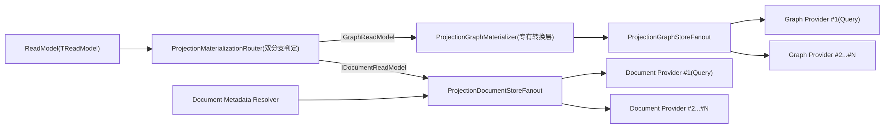
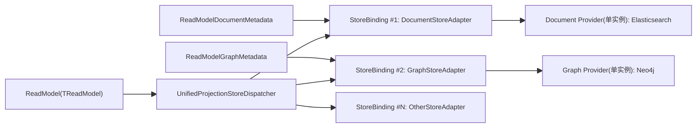

# Projection 存储完整审计与架构评分（2026-02-24，按“ReadModel -> N Stores”口径重评）

## 1. 审计目标

1. 全面审计 Projection 存储层（抽象、Runtime、Provider、Workflow 接入）。
2. 严格确认 `DocumentStore` 与 `GraphStore` 的关系。
3. 严格确认“一对多（1:N）”是否按你定义落地：`1个ReadModel -> 多个Store`。
4. 找出全部可定位冗余并重新评分。

## 2. 评分口径声明（本次重评）

1. **你的口径是唯一准绳**：`DocumentStore` 与 `GraphStore` 都应是 `Store` 家族中的平行实现类型。
2. **一对多定义**：不是“Document 一对多 + Graph 一对多”两条主干，而是“同一个 ReadModel 可被同一投影链路分发到多个 Store（其中包含 Document/Graph）”。
3. 若实现为“双主干 + 分支编排”，即便功能可用，也按“并行性不足”扣分。

## 3. 审计范围

1. `src/Aevatar.CQRS.Projection.Stores.Abstractions`
2. `src/Aevatar.CQRS.Projection.Runtime.Abstractions`
3. `src/Aevatar.CQRS.Projection.Runtime`
4. `src/Aevatar.CQRS.Projection.Providers.InMemory`
5. `src/Aevatar.CQRS.Projection.Providers.Elasticsearch`
6. `src/Aevatar.CQRS.Projection.Providers.Neo4j`
7. `src/workflow/extensions/Aevatar.Workflow.Extensions.Hosting`
8. `test/Aevatar.CQRS.Projection.Core.Tests`
9. `test/Aevatar.Workflow.Host.Api.Tests`

## 4. 验证基线（本轮沿用）

1. `dotnet test test/Aevatar.CQRS.Projection.Core.Tests/Aevatar.CQRS.Projection.Core.Tests.csproj --nologo`
2. `dotnet test test/Aevatar.Workflow.Host.Api.Tests/Aevatar.Workflow.Host.Api.Tests.csproj --nologo`
3. `bash tools/ci/architecture_guards.sh`

结果：通过。

## 5. 结构结论（按新口径）

### 5.1 结论 A：概念上“平行实现”成立

1. `WorkflowExecutionReport` 同时实现 `IDocumentReadModel` 与 `IGraphReadModel`，具备“双存储能力”事实（`src/workflow/Aevatar.Workflow.Projection/ReadModels/WorkflowExecutionReadModel.cs:36-37`）。
2. Provider 注册侧确实可同时启用 ES 与 Neo4j（`src/workflow/extensions/Aevatar.Workflow.Extensions.Hosting/WorkflowProjectionProviderServiceCollectionExtensions.cs:43-76`）。

### 5.2 结论 B：实现上“同层并行”**不成立（你的感觉是对的）**

1. **根抽象不是同层模型**：
   - Document：`IDocumentProjectionStore<TReadModel,TKey>`（CRUD形状）
   - Graph：`IProjectionGraphStore`（节点/边形状）
   这不是统一 `IProjectionStore<TReadModel,...>` 的同层实现。
2. **路由是硬编码双分支**：
   - `ProjectionMaterializationRouter` 用 `IsAssignableFrom` 分别判断 `IDocumentReadModel/IGraphReadModel`（`src/Aevatar.CQRS.Projection.Runtime/Runtime/ProjectionMaterializationRouter.cs:13-14`）。
   - 这意味着“ReadModel -> Store列表”不是统一分发表达，而是“Document链 + Graph链”。
3. **Graph 多一层专有中间件**：
   - Graph 需要 `ProjectionGraphMaterializer` 做 descriptor -> store model 转换（`src/Aevatar.CQRS.Projection.Runtime/Runtime/ProjectionGraphMaterializer.cs:116-196`）。
   - Document 无对等层，导致链路层级不对称。
4. **Metadata 机制只有 Document 分支**：
   - `IProjectionDocumentMetadataProvider` / `IProjectionDocumentMetadataResolver` 存在（`src/Aevatar.CQRS.Projection.Stores.Abstractions/Abstractions/ReadModels/IProjectionDocumentMetadataProvider.cs:3-6`，`src/Aevatar.CQRS.Projection.Runtime/Runtime/ProjectionDocumentMetadataResolver.cs:5-19`）。
   - Graph 没有同层 metadata 契约。

## 6. 当前实际架构图（显示“非同层并行”）

### 6.1 目标架构图（同层并行，且同类 Provider 仅 1 个）

目标语义：

1. `DocumentStore` 与 `GraphStore` 处于同一层抽象（`StoreBinding`），只是在能力类型上不同。
2. 一对多以 `ReadModel` 为中心，由统一分发器一次性分发到多个 `StoreBinding`。
3. 每个 `StoreBinding` 仅绑定一个同类 provider（Document 1个、Graph 1个），不再引入 provider 级 fan-out 与“首注册查询源”语义。

## 7. 冗余问题清单（重排后）

### P1-1（高）“ReadModel -> 多Store”未被统一抽象表达

1. 当前是 Document/Graph 双主干 + 分支路由，不是单一 `Store` 家族同层并行。
2. 直接导致你感知的“实现不并行”。

### P1-2（高）Graph 双模型并存且高度重复

1. ReadModel 侧：`GraphNodeDescriptor`/`GraphEdgeDescriptor`。
2. Store 侧：`ProjectionGraphNode`/`ProjectionGraphEdge`。
3. Runtime 强制桥接转换。

### P1-3（高）能力判定依赖 marker + 运行时反射

1. `IDocumentReadModel` 是空 marker。
2. `ProjectionMaterializationRouter` 通过 `IsAssignableFrom` 路由。
3. 编译期无法直接保证“同层 Store 分发能力矩阵”。

### P1-4（高）Metadata 能力只在 Document 分支存在

1. Document 有 metadata provider/resolver。
2. Graph 分支没有等价契约，进一步拉大两条链路语义差距。

### P2-5（中）运行态系统键暴露到 Stores.Abstractions

1. `ProjectionGraphSystemPropertyKeys` 位于抽象层。
2. 实际语义是 runtime/provider 的内部生命周期键。

### P2-6（中）Neo4j managed 信息双存

1. `propertiesJson` 与 `projectionManaged/projectionOwnerId` 同时存储。
2. 引入冗余与一致性维护成本。

### P2-7（中）文档陈旧术语残留

1. 仍有 `IProjectionReadModelStore` 等旧术语残留。

### P3-8（低）`ProjectionGraphSubgraph` 可变结构可进一步收敛

1. 非功能缺陷，但语义表达可更简化。

## 8. 架构评分（严格，按你口径）

### 8.1 评分维度与结果

| 维度 | 权重 | 得分 | 说明 |
|---|---:|---:|---|
| `ReadModel -> N Stores` 口径符合度 | 20 | 13 | 能同时投影到多 provider，但分发不是统一 store 家族。 |
| Document/Graph 同层并行一致性 | 20 | 10 | 目前是双主干 + Graph 专有中间层，层级不对齐。 |
| 抽象最小化与去冗余 | 20 | 12 | 双模型、marker+反射、系统键外泄导致冗余偏高。 |
| 数据模型一致性 | 15 | 10 | Graph descriptor/store model 重复，Neo4j managed 双存。 |
| Provider 扩展一致性 | 10 | 8 | 注册模式一致，但能力面不对称（metadata、materializer）。 |
| 测试与治理门禁 | 10 | 9 | 关键路由与投影流程门禁覆盖较好。 |
| 文档一致性 | 5 | 2 | 仍有旧术语未清理。 |

### 8.2 总分

- **64 / 100（C-，严格口径）**

## 9. 审计结论（直接回答你的问题）

1. 你说的“一对多”定义是对的，且应作为重构目标模型。
2. 当前代码**功能上可并行写入**，但**架构形状并不并行**，你的不适感来自真实的结构不对称。
3. 现状更准确描述是：`ReadModel` 经过“Document链 + Graph链”双分支处理，而不是统一 `Store` 家族的一体化多路分发。

## 10. 实施计划（彻底重构，无兼容性）

### 10.1 约束与完成定义

1. 不保留兼容层，不保留旧接口转发壳。
2. 同类 Provider 仅 1 个实例：Document 1 个、Graph 1 个。
3. 删除 fan-out 与“主存储/首注册查询源”语义。
4. `ReadModel -> N Stores` 由统一分发器一次分发完成，`DocumentStore` 与 `GraphStore` 为同层实现。
5. 完成定义：旧双主干代码删除，Workflow 投影链路跑通，核心测试与架构门禁通过。

### 10.2 总体实施图（阶段化）

```mermaid
%%{init: {"maxTextSize": 100000, "flowchart": {"useMaxWidth": false, "nodeSpacing": 10, "rankSpacing": 50}, "themeVariables": {"fontSize": "10px"}}}%%
flowchart LR
  P0["Phase 0: 冻结目标与删除范围"] --> P1["Phase 1: 抽象重建(统一Store分发)"]
  P1 --> P2["Phase 2: Runtime替换(去Fanout/去双路由)"]
  P2 --> P3["Phase 3: Provider重接入(单实例)"]
  P3 --> P4["Phase 4: Workflow接入改造"]
  P4 --> P5["Phase 5: 测试迁移与门禁收敛"]
  P5 --> P6["Phase 6: 文档清理与最终复评分"]
```

### 10.3 Phase 0：冻结目标与删除范围

1. 固化目标模型：统一分发器 + 同层 StoreBinding + 同类 Provider 单实例。
2. 固化删除范围（本次重构必须删除）：
   - `src/Aevatar.CQRS.Projection.Runtime/Runtime/ProjectionDocumentStoreFanout.cs`
   - `src/Aevatar.CQRS.Projection.Runtime/Runtime/ProjectionGraphStoreFanout.cs`
   - `src/Aevatar.CQRS.Projection.Runtime/Runtime/ProjectionMaterializationRouter.cs`
   - `src/Aevatar.CQRS.Projection.Runtime/Runtime/ProjectionGraphMaterializer.cs`
   - `src/Aevatar.CQRS.Projection.Runtime.Abstractions/Abstractions/Selection/IProjectionMaterializationRouter.cs`
   - `src/Aevatar.CQRS.Projection.Runtime.Abstractions/Abstractions/Selection/IProjectionGraphMaterializer.cs`
   - `src/Aevatar.CQRS.Projection.Runtime.Abstractions/Abstractions/Core/IProjectionStoreRegistration.cs`
   - `src/Aevatar.CQRS.Projection.Runtime.Abstractions/Abstractions/Core/DelegateProjectionStoreRegistration.cs`
3. 冻结决策：不再接受“恢复 fan-out”或“恢复主存储”回退。

### 10.4 Phase 1：抽象重建（统一 Store 分发）

1. 在 `Aevatar.CQRS.Projection.Stores.Abstractions` 新增统一 StoreBinding 抽象（建议放在 `Abstractions/Stores/`）。
2. 用统一写入契约替代 `IDocumentProjectionStore` 与 `IProjectionGraphStore` 的分裂入口。
3. 保留“索引元数据、关系语义”，但改为按 ReadModel 泛型/绑定提供，不再依赖 marker 能力链。
4. 统一 Graph 模型：删除 `GraphNodeDescriptor/GraphEdgeDescriptor` 与 `ProjectionGraphNode/ProjectionGraphEdge` 的双模型并存状态，只保留一套权威模型。
5. 将 `ProjectionGraphSystemPropertyKeys` 下沉到 Runtime 或 Provider，抽象层不暴露运行态内部键。

### 10.5 Phase 2：Runtime 替换（去 Fanout/去双路由）

1. 在 `Aevatar.CQRS.Projection.Runtime` 新增统一分发器实现（单入口、一次分发）。
2. 删除旧双路由注册：
   - `src/Aevatar.CQRS.Projection.Runtime/DependencyInjection/ServiceCollectionExtensions.cs` 中移除 `ProjectionDocumentStoreFanout/ProjectionGraphStoreFanout/ProjectionMaterializationRouter/ProjectionGraphMaterializer` 注册。
3. Runtime DI 改为注册：
   - 统一 Dispatcher
   - StoreBinding 列表
   - ReadModel 元数据解析器（若保留）
4. 禁止运行时 `IsAssignableFrom` 能力判定路径。

### 10.6 Phase 3：Provider 重接入（单实例）

1. `Aevatar.CQRS.Projection.Providers.Elasticsearch` 仅提供 Document 绑定实现，不再提供注册到 fan-out 的适配。
2. `Aevatar.CQRS.Projection.Providers.Neo4j` 仅提供 Graph 绑定实现，不再提供注册到 fan-out 的适配。
3. `Aevatar.CQRS.Projection.Providers.InMemory` 保留开发/测试用途实现，但同样走统一 Binding 协议。
4. 宿主层强约束：同类 provider 只能注册 1 个，多于 1 个直接 fail-fast。

### 10.7 Phase 4：Workflow 接入改造

1. 改造 `src/workflow/Aevatar.Workflow.Projection`：
   - Projector/Updater 从旧 `IProjectionMaterializationRouter<,>` 切换到统一 dispatcher。
   - QueryReader 保持读侧语义，但查询端口来自统一 StoreBinding 模型。
2. 改造 `src/workflow/extensions/Aevatar.Workflow.Extensions.Hosting/WorkflowProjectionProviderServiceCollectionExtensions.cs`：
   - 删除旧 `Add*StoreRegistration` 路径。
   - 使用“Document 单实例 + Graph 单实例”显式注册。
   - 发现同类重复注册时抛异常（启动失败）。
3. `WorkflowExecutionReport` 保留索引、关系语义提供能力，但不再承担 marker 路由职责。

### 10.8 Phase 5：测试迁移与门禁收敛

1. 删除或改写依赖 fan-out/首注册语义的测试：
   - `test/Aevatar.CQRS.Projection.Core.Tests/ProjectionReadModelRuntimeTests.cs`
   - `test/Aevatar.CQRS.Projection.Core.Tests/ProjectionReadModelStoreSelectorTests.cs`
2. 新增统一分发器测试矩阵：
   - 单 ReadModel 同时写 Document+Graph
   - 同类 provider 重复注册 fail-fast
   - Graph/Document 任一写入失败时的错误传播策略
3. Workflow 侧新增端到端断言：
   - 一次投影后，ES 可检索，Neo4j 可遍历，且来源同一 ReadModel 版本。
4. 必跑命令：
   - `dotnet build aevatar.slnx --nologo`
   - `dotnet test aevatar.slnx --nologo`
   - `bash tools/ci/architecture_guards.sh`
   - `bash tools/ci/projection_route_mapping_guard.sh`
   - `bash tools/ci/test_stability_guards.sh`

### 10.9 Phase 6：文档清理与最终复评分

1. 清理旧术语：
   - `IProjectionReadModelStore`
   - `Projection*Fanout`
   - `主存储/首注册查询源`
2. 更新文档：
   - `src/Aevatar.CQRS.Projection.Stores.Abstractions/README.md`
   - `src/Aevatar.CQRS.Projection.Runtime/README.md`
   - `src/workflow/Aevatar.Workflow.Projection/README.md`
   - `docs/architecture/projection-readmodel-full-refactor-plan-2026-02-24.md`
3. 复评输出：在 `docs/audit-scorecard/` 新增重构后评分文档，验证目标分数应达到 `>= 90`。

### 10.10 风险与控制

1. 风险：一次性删除旧抽象导致大面积编译错误。  
控制：按 Phase 提交，每阶段必须 `build + targeted test` 全绿后进入下一阶段。
2. 风险：Workflow 查询端口在接口切换时出现行为回归。  
控制：先补端到端基线测试，再替换实现。
3. 风险：Neo4j 属性模型收敛时丢失 managed 生命周期信息。  
控制：先定义唯一事实字段，再做一次性数据迁移脚本或重建策略。

### 10.11 里程碑验收清单（必须全部满足）

1. 代码中不存在 `ProjectionDocumentStoreFanout`、`ProjectionGraphStoreFanout`、`ProjectionMaterializationRouter`、`ProjectionGraphMaterializer`。
2. Runtime 不存在基于 marker 的 `IsAssignableFrom` 路由分支。
3. 同类 Provider 重复注册时启动即失败（明确错误消息）。
4. 单次投影可同时落 Document 与 Graph，两边查询结果一致。
5. 全量测试与门禁命令通过。
