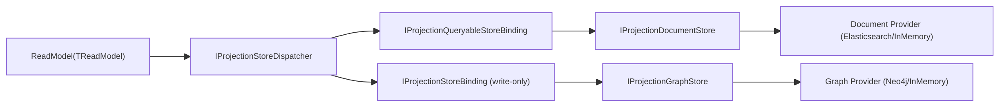
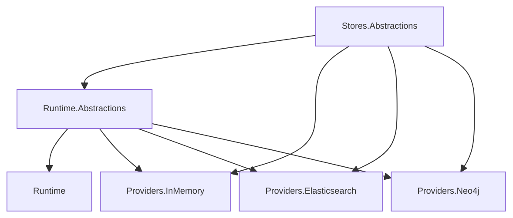

# Projection Store 全量类审计报告（2026-02-24）

- 审计日期：2026-02-24
- 审计范围：
  - `src/Aevatar.CQRS.Projection.Stores.Abstractions`
  - `src/Aevatar.CQRS.Projection.Runtime.Abstractions`
  - `src/Aevatar.CQRS.Projection.Runtime`
  - `src/Aevatar.CQRS.Projection.Providers.InMemory`
  - `src/Aevatar.CQRS.Projection.Providers.Elasticsearch`
  - `src/Aevatar.CQRS.Projection.Providers.Neo4j`
- 审计对象：31 个 Projection Store 相关公开类/接口/枚举/记录
- 审计目标：
  1. 完整核对所有 Projection Store 类职责边界。
  2. 验证 `DocumentStore` 与 `GraphStore` 是否为平行关系。
  3. 验证 `1 ReadModel -> N Stores` 是否为当前权威模型。
  4. 输出结构化打分、问题清单、改进建议。

---

## 1. 总体结论

### 1.1 总分

- **9.1 / 10**

### 1.2 结论摘要

1. 当前架构已完成从旧的 Router/Fanout/Registration 体系向 Dispatcher/Binding 体系的收敛。
2. `DocumentStore` 与 `GraphStore` 在抽象、运行时绑定、Provider 三层均为平行关系，不再存在“语义主从”。
3. `1 ReadModel -> N Stores` 已落地为稳定主干：Dispatcher 一次写入可同时投影到 Document + Graph。
4. 主要扣分点集中在两个“超大 Provider 类”的维护复杂度与部分语义冗余。

---

## 2. 目标架构图（已落地）





---

## 3. 类清单与逐类打分（31/31）

### 3.1 Stores.Abstractions

| 类/接口 | 评分 | 审计结论 |
|---|---:|---|
| `IProjectionReadModel` | 9.5 | 最小主键契约清晰，无冗余。 |
| `IGraphReadModel` | 9.4 | 直接暴露 `GraphNodes/GraphEdges`，去除了旧 descriptor 双模型。 |
| `IProjectionDocumentStore<TReadModel,TKey>` | 9.0 | CRUD 语义完整；未约束 `IProjectionReadModel`，灵活但类型语义略宽。 |
| `DocumentIndexMetadata` | 9.2 | 索引元数据结构化良好，避免字符串拼 JSON。 |
| `IProjectionDocumentMetadataProvider<TReadModel>` | 9.3 | 元数据来源抽象简洁，职责单一。 |
| `IProjectionGraphStore` | 9.2 | 图写入/查询/owner 清理契约完整。 |
| `ProjectionGraphDirection` | 9.6 | 枚举清晰。 |
| `ProjectionGraphNode` | 9.1 | 结构简明；`Properties` 固定 string->string，通用性受限但稳定。 |
| `ProjectionGraphEdge` | 9.1 | 同上。 |
| `ProjectionGraphQuery` | 9.3 | 方向/边类型/深度/take 语义完整。 |
| `ProjectionGraphSubgraph` | 9.4 | 输出模型简洁。 |

### 3.2 Runtime.Abstractions

| 类/接口 | 评分 | 审计结论 |
|---|---:|---|
| `IProjectionStoreDispatcher<TReadModel,TKey>` | 9.4 | 统一入口良好，彻底替代旧 Router。 |
| `IProjectionStoreBinding<TReadModel,TKey>` | 9.3 | 最小写入 binding 抽象，扩展成本低。 |
| `IProjectionQueryableStoreBinding<TReadModel,TKey>` | 9.2 | 显式区分查询源和写入源，核心设计正确。 |
| `IProjectionDocumentMetadataResolver` | 9.1 | 解析职责明确。 |
| `ProjectionGraphManagedPropertyKeys` | 8.9 | 运行态系统键集中定义合理；命名可继续收敛。 |

### 3.3 Runtime

| 类/接口 | 评分 | 审计结论 |
|---|---:|---|
| `ServiceCollectionExtensions` | 9.0 | 默认注入模型清晰；对“唯一 query binding”有约束前提。 |
| `ProjectionDocumentMetadataResolver` | 9.2 | DI 解析简单稳定。 |
| `ProjectionDocumentStoreBinding<TReadModel,TKey>` | 9.4 | 纯代理类，无冗余逻辑。 |
| `ProjectionGraphStoreBinding<TReadModel,TKey>` | 8.8 | owner 标记+差集清理逻辑完整；固定 `take:50000` 具规模上限风险。 |
| `ProjectionStoreDispatcher<TReadModel,TKey>` | 8.9 | 一对多分发模型正确；写入失败时非事务一致性需要明确。 |

### 3.4 Providers.InMemory

| 类/接口 | 评分 | 审计结论 |
|---|---:|---|
| `ServiceCollectionExtensions` | 9.2 | Document/Graph 注册对称。 |
| `InMemoryProjectionDocumentStore<TReadModel,TKey>` | 8.8 | 行为完整；序列化 clone 成本较高，但测试语义可接受。 |
| `InMemoryProjectionGraphStore` | 8.6 | 功能完整；子图构建复杂度较高，适合 dev/test，不宜生产事实源。 |

### 3.5 Providers.Elasticsearch

| 类/接口 | 评分 | 审计结论 |
|---|---:|---|
| `ElasticsearchMissingIndexBehavior` | 9.3 | 缺失索引策略明确。 |
| `ElasticsearchProjectionDocumentStoreOptions` | 9.2 | 配置项完整。 |
| `ServiceCollectionExtensions` | 9.3 | 注册方式标准化。 |
| `ElasticsearchProjectionDocumentStore<TReadModel,TKey>` | 8.4 | OCC/索引初始化/查询逻辑完整，但类体过大（700+ 行）维护成本高。 |

### 3.6 Providers.Neo4j

| 类/接口 | 评分 | 审计结论 |
|---|---:|---|
| `Neo4jProjectionGraphStoreOptions` | 9.1 | 配置完整。 |
| `ServiceCollectionExtensions` | 8.7 | 注入接口清晰，但 `scopeFactory` 语义与实现存在冗余。 |
| `Neo4jProjectionGraphStore` | 8.3 | 图能力完整；类体过大（690+ 行）且 `_scope` 仅用于日志，语义冗余。 |

---

## 4. 关键架构核对项

### 4.1 Document 与 Graph 是否平行

结论：**是**。

证据：

1. 抽象层：`IProjectionDocumentStore` 与 `IProjectionGraphStore` 同层并列。
2. Runtime 层：`ProjectionDocumentStoreBinding` 与 `ProjectionGraphStoreBinding` 同层并列。
3. Provider 层：
   - Document：`InMemoryProjectionDocumentStore` / `ElasticsearchProjectionDocumentStore`
   - Graph：`InMemoryProjectionGraphStore` / `Neo4jProjectionGraphStore`

### 4.2 是否是 1 对多（ReadModel -> Stores）

结论：**是**。

证据：

1. `ProjectionStoreDispatcher` 接收 `IEnumerable<IProjectionStoreBinding<...>>`。
2. `UpsertAsync` 对所有 binding 顺序写入。
3. `MutateAsync` 先改 query binding，再回写 write-only bindings。

### 4.3 同类 Provider 是否单实现

结论：**Workflow Host 侧已强约束**。

证据：

1. Document provider count 必须为 1。
2. Graph provider count 必须为 1。
3. 配置冲突时 fail-fast。

---

## 5. 发现的问题（按严重度）

### 5.1 High

无。

### 5.2 Medium

1. 分发写入非事务一致性风险。
- 位置：`ProjectionStoreDispatcher`。
- 现象：某 binding 写入失败时，前序 binding 可能已成功写入，存在短时不一致。
- 影响：Document 与 Graph 同步窗口内可能产生读侧偏差。
- 建议：
  1. 在 dispatcher 层引入可选补偿策略接口（`IProjectionStoreDispatchCompensator`）。
  2. 明确一致性等级（at-least-once + eventual consistency）并写入契约文档。

2. Graph 清理固定上限可能漏删。
- 位置：`ProjectionGraphStoreBinding` 的 `take:50000`。
- 现象：超大 owner 规模下清理差集可能不完整。
- 影响：陈旧边/节点残留。
- 建议：分页清理或游标化清理。

3. Neo4j scope 语义冗余。
- 位置：`Neo4jProjectionGraphStore` 的 `_scope` 字段。
- 现象：构造注入 `scopeFactory`，但 `_scope` 基本不参与行为约束，仅用于日志。
- 影响：配置心智负担增加，接口语义与实现不一致。
- 建议：
  1. 若不需要全局 scope 约束，删除 `scopeFactory` 与 `_scope` 字段。
  2. 若需要约束，则在所有写/读入口强校验 `query.Scope == _scope`。

### 5.3 Low

1. Provider 大类过重（可维护性）。
- `ElasticsearchProjectionDocumentStore` 712 行。
- `Neo4jProjectionGraphStore` 691 行。
- 建议：按职责拆分 `IndexBootstrap / DocumentMutation / QueryAdapter / CypherBuilder`。

2. `IProjectionDocumentStore` 类型约束较宽。
- 当前仅 `where TReadModel : class`。
- 建议：若长期只服务 Projection ReadModel，可评估收紧为 `IProjectionReadModel`。

### 5.4 证据索引（关键问题）

1. 非事务分发路径：
   - `src/Aevatar.CQRS.Projection.Runtime/Runtime/ProjectionStoreDispatcher.cs:55`
   - `src/Aevatar.CQRS.Projection.Runtime/Runtime/ProjectionStoreDispatcher.cs:67`
   - `src/Aevatar.CQRS.Projection.Runtime/Runtime/ProjectionStoreDispatcher.cs:71`
   - `src/Aevatar.CQRS.Projection.Runtime/Runtime/ProjectionStoreDispatcher.cs:78`
2. Graph 清理固定上限：
   - `src/Aevatar.CQRS.Projection.Runtime/Runtime/ProjectionGraphStoreBinding.cs:44`
   - `src/Aevatar.CQRS.Projection.Runtime/Runtime/ProjectionGraphStoreBinding.cs:53`
3. Neo4j scope 冗余链路：
   - `src/Aevatar.CQRS.Projection.Providers.Neo4j/DependencyInjection/ServiceCollectionExtensions.cs:13`
   - `src/Aevatar.CQRS.Projection.Providers.Neo4j/Stores/Neo4jProjectionGraphStore.cs:15`
   - `src/Aevatar.CQRS.Projection.Providers.Neo4j/Stores/Neo4jProjectionGraphStore.cs:642`
4. Runtime 默认 query binding 注入：
   - `src/Aevatar.CQRS.Projection.Runtime/DependencyInjection/ServiceCollectionExtensions.cs:12`
   - `src/Aevatar.CQRS.Projection.Runtime/DependencyInjection/ServiceCollectionExtensions.cs:13`
5. Document store 类型约束：
   - `src/Aevatar.CQRS.Projection.Stores.Abstractions/Abstractions/ReadModels/IProjectionDocumentStore.cs:3`
   - `src/Aevatar.CQRS.Projection.Stores.Abstractions/Abstractions/ReadModels/IProjectionDocumentStore.cs:4`

---

## 6. 冗余与重复审计结果

### 6.1 已清理（通过）

1. 旧 `Router/Fanout/Registration` 双轨层已移除。
2. `IDocumentReadModel` marker 已移除。
3. `GraphNodeDescriptor/GraphEdgeDescriptor` 双模型已移除。
4. Document 命名已收敛为 `ProjectionDocumentStore` 体系。

### 6.2 当前仍需关注（非阻塞）

1. Neo4j `scopeFactory` 冗余。
2. 两个 Provider 超大类的职责聚合过多。

---

## 7. 测试覆盖审计

### 7.1 已覆盖

1. Dispatcher 核心行为：
   - 多 binding 写入
   - query binding 唯一性约束
2. Graph binding 生命周期行为：
   - owner 差集删除
   - 跨 owner 隔离
   - 空 Id fail-fast
3. Elasticsearch 行为：
   - 缺失索引策略
   - OCC 重试
   - 索引元数据结构化初始化
4. Workflow Host 组合：
   - Provider 单实现约束
   - 组合注册 idempotent

### 7.2 建议补测

1. `ProjectionStoreDispatcher` 写入失败补偿/告警行为（当前无契约测试）。
2. `ProjectionGraphStoreBinding` 在超大 owner（>50k）时的清理分页行为。
3. `Neo4jProjectionGraphStore` scope 约束行为（若决定保留 `_scope`）。

---

## 8. 分层与依赖反转审计

结论：**通过**。

1. `Stores.Abstractions` 无额外依赖，保持最小内核。
2. `Runtime.Abstractions` 仅依赖 `Stores.Abstractions`。
3. `Runtime` 依赖 Runtime/Stores 抽象，不依赖业务层。
4. Provider 项目仅依赖抽象与通用基础包，不依赖 Workflow/AI 业务项目。

---

## 9. 综合评分明细

| 维度 | 分数 | 说明 |
|---|---:|---|
| 分层清晰度 | 9.4 | 分层边界清晰，依赖方向正确。 |
| 平行一致性（Document/Graph） | 9.5 | 三层结构平行，命名已统一。 |
| 一对多模型完备度 | 9.2 | Dispatcher/Binding 语义完整。 |
| 冗余清理彻底性 | 9.0 | 旧体系已删，少量语义冗余尚存。 |
| 可维护性 | 8.4 | 两个 Provider 大类过重。 |
| 可扩展性 | 9.1 | Binding 扩展点清晰。 |
| 可测试性 | 9.0 | 核心路径有测试，补偿/规模化场景需补测。 |
| 运行稳定性 | 8.9 | 现有模型可用，但需明确非事务一致性语义。 |

- **最终得分：9.1 / 10**

---

## 10. 建议实施顺序（P0/P1/P2）

1. P0：确定 Neo4j scope 语义（删除或强约束）。
2. P1：为 Dispatcher 增加失败补偿扩展点与可观测日志。
3. P1：Graph owner 清理改为分页/游标模式，移除固定 50k 上限。
4. P2：拆分 Elasticsearch/Neo4j 大类，降低维护复杂度。

---

## 11. 审计结语

Projection Store 当前架构已经达到“单主干 + Document/Graph 平行 + ReadModel 一对多投影”的目标态。
当前最需要处理的不是重做模型，而是收敛少量语义冗余并降低大类复杂度。

---

## 附录 A：31 个类声明位置（文件:行号）

```text
src/Aevatar.CQRS.Projection.Providers.Elasticsearch/Configuration/ElasticsearchMissingIndexBehavior.cs:3:public enum ElasticsearchMissingIndexBehavior
src/Aevatar.CQRS.Projection.Providers.Elasticsearch/Configuration/ElasticsearchProjectionDocumentStoreOptions.cs:3:public sealed class ElasticsearchProjectionDocumentStoreOptions
src/Aevatar.CQRS.Projection.Providers.Elasticsearch/DependencyInjection/ServiceCollectionExtensions.cs:8:public static class ServiceCollectionExtensions
src/Aevatar.CQRS.Projection.Providers.Elasticsearch/Stores/ElasticsearchProjectionDocumentStore.cs:11:public sealed class ElasticsearchProjectionDocumentStore<TReadModel, TKey>
src/Aevatar.CQRS.Projection.Providers.InMemory/DependencyInjection/ServiceCollectionExtensions.cs:7:public static class ServiceCollectionExtensions
src/Aevatar.CQRS.Projection.Providers.InMemory/Stores/InMemoryProjectionDocumentStore.cs:7:public sealed class InMemoryProjectionDocumentStore<TReadModel, TKey>
src/Aevatar.CQRS.Projection.Providers.InMemory/Stores/InMemoryProjectionGraphStore.cs:5:public sealed class InMemoryProjectionGraphStore
src/Aevatar.CQRS.Projection.Providers.Neo4j/Configuration/Neo4jProjectionGraphStoreOptions.cs:3:public sealed class Neo4jProjectionGraphStoreOptions
src/Aevatar.CQRS.Projection.Providers.Neo4j/DependencyInjection/ServiceCollectionExtensions.cs:8:public static class ServiceCollectionExtensions
src/Aevatar.CQRS.Projection.Providers.Neo4j/Stores/Neo4jProjectionGraphStore.cs:9:public sealed class Neo4jProjectionGraphStore
src/Aevatar.CQRS.Projection.Runtime.Abstractions/Abstractions/Graphs/ProjectionGraphManagedPropertyKeys.cs:3:public static class ProjectionGraphManagedPropertyKeys
src/Aevatar.CQRS.Projection.Runtime.Abstractions/Abstractions/ReadModels/IProjectionDocumentMetadataResolver.cs:3:public interface IProjectionDocumentMetadataResolver
src/Aevatar.CQRS.Projection.Runtime.Abstractions/Abstractions/Stores/IProjectionQueryableStoreBinding.cs:3:public interface IProjectionQueryableStoreBinding<TReadModel, in TKey>
src/Aevatar.CQRS.Projection.Runtime.Abstractions/Abstractions/Stores/IProjectionStoreBinding.cs:3:public interface IProjectionStoreBinding<in TReadModel, in TKey>
src/Aevatar.CQRS.Projection.Runtime.Abstractions/Abstractions/Stores/IProjectionStoreDispatcher.cs:3:public interface IProjectionStoreDispatcher<TReadModel, in TKey>
src/Aevatar.CQRS.Projection.Runtime/DependencyInjection/ServiceCollectionExtensions.cs:7:public static class ServiceCollectionExtensions
src/Aevatar.CQRS.Projection.Runtime/Runtime/ProjectionDocumentMetadataResolver.cs:5:public sealed class ProjectionDocumentMetadataResolver : IProjectionDocumentMetadataResolver
src/Aevatar.CQRS.Projection.Runtime/Runtime/ProjectionDocumentStoreBinding.cs:3:public sealed class ProjectionDocumentStoreBinding<TReadModel, TKey>
src/Aevatar.CQRS.Projection.Runtime/Runtime/ProjectionGraphStoreBinding.cs:3:public sealed class ProjectionGraphStoreBinding<TReadModel, TKey>
src/Aevatar.CQRS.Projection.Runtime/Runtime/ProjectionStoreDispatcher.cs:6:public sealed class ProjectionStoreDispatcher<TReadModel, TKey>
src/Aevatar.CQRS.Projection.Stores.Abstractions/Abstractions/Graphs/IProjectionGraphStore.cs:3:public interface IProjectionGraphStore
src/Aevatar.CQRS.Projection.Stores.Abstractions/Abstractions/Graphs/ProjectionGraphDirection.cs:3:public enum ProjectionGraphDirection
src/Aevatar.CQRS.Projection.Stores.Abstractions/Abstractions/Graphs/ProjectionGraphEdge.cs:3:public sealed class ProjectionGraphEdge
src/Aevatar.CQRS.Projection.Stores.Abstractions/Abstractions/Graphs/ProjectionGraphNode.cs:3:public sealed class ProjectionGraphNode
src/Aevatar.CQRS.Projection.Stores.Abstractions/Abstractions/Graphs/ProjectionGraphQuery.cs:3:public sealed class ProjectionGraphQuery
src/Aevatar.CQRS.Projection.Stores.Abstractions/Abstractions/Graphs/ProjectionGraphSubgraph.cs:3:public sealed class ProjectionGraphSubgraph
src/Aevatar.CQRS.Projection.Stores.Abstractions/Abstractions/ReadModels/DocumentIndexMetadata.cs:3:public sealed record DocumentIndexMetadata(
src/Aevatar.CQRS.Projection.Stores.Abstractions/Abstractions/ReadModels/IGraphReadModel.cs:3:public interface IGraphReadModel : IProjectionReadModel
src/Aevatar.CQRS.Projection.Stores.Abstractions/Abstractions/ReadModels/IProjectionDocumentMetadataProvider.cs:3:public interface IProjectionDocumentMetadataProvider<out TReadModel>
src/Aevatar.CQRS.Projection.Stores.Abstractions/Abstractions/ReadModels/IProjectionDocumentStore.cs:3:public interface IProjectionDocumentStore<TReadModel, in TKey>
src/Aevatar.CQRS.Projection.Stores.Abstractions/Abstractions/ReadModels/IProjectionReadModel.cs:3:public interface IProjectionReadModel
```
