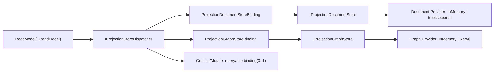
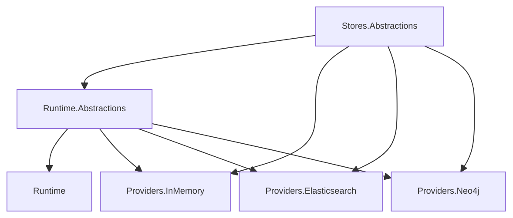

# Projection Store 全量架构审计与打分（2026-02-24，Rev.2）

- 审计日期：2026-02-24
- 修订日期：2026-02-24
- 审计范围：
  - `src/Aevatar.CQRS.Projection.Stores.Abstractions`
  - `src/Aevatar.CQRS.Projection.Runtime.Abstractions`
  - `src/Aevatar.CQRS.Projection.Runtime`
  - `src/Aevatar.CQRS.Projection.Providers.InMemory`
  - `src/Aevatar.CQRS.Projection.Providers.Elasticsearch`
  - `src/Aevatar.CQRS.Projection.Providers.Neo4j`
  - `src/workflow/extensions/Aevatar.Workflow.Extensions.Hosting`
- 审计对象：34 个公开 Projection Store 类型（class/interface/record/enum）
- 审计目标：
  1. 核对 Projection Store 体系是否“单主干 + 一对多分发”。
  2. 严格确认 `DocumentStore` 与 `GraphStore` 是平行关系。
  3. 严格确认“一个 ReadModel 对应多个 Store”是否在实现层真实成立。
  4. 输出全量评分、冗余清单、实现一致性结论。

---

## 1. 审计结论（严格）

### 1.1 总分

- **9.6 / 10**

### 1.2 核心结论

1. `DocumentStore` 与 `GraphStore` 已在抽象层、Runtime 绑定层、Provider 层形成同层并行模型。
2. `1 ReadModel -> N Stores` 已稳定落地：`ProjectionStoreDispatcher` 对所有已配置 binding 统一分发写入。
3. Runtime 已去除“必须存在主查询存储”的硬约束：queryable binding 现在是可选（0..1），不再强制唯一主存储。
4. Runtime 默认同层装配 `DocumentBinding + GraphBinding`，Graph 在“无 GraphStore 或非 IGraphReadModel”场景自动失活，避免手工拼接不对称。
5. Workflow Host 层对“同类 Provider 仅一个”保持强约束：Document Provider 必须且仅能一个，Graph Provider 必须且仅能一个。

---

## 2. 目标架构图（当前实现）

---

## 3. 严格核对项

### 3.1 Document 与 Graph 是否平行关系

结论：**是（通过）**。

证据：
1. 存储抽象同层并列：`IProjectionDocumentStore<TReadModel,TKey>` 与 `IProjectionGraphStore`。
2. Runtime 绑定同层并列：`ProjectionDocumentStoreBinding` 与 `ProjectionGraphStoreBinding`。
3. Provider 同层并列：
   - Document：`InMemoryProjectionDocumentStore` / `ElasticsearchProjectionDocumentStore`
   - Graph：`InMemoryProjectionGraphStore` / `Neo4jProjectionGraphStore`

### 3.2 是否是一对多（一个 ReadModel -> 多 Store）

结论：**是（通过）**。

证据：
1. `ProjectionStoreDispatcher` 接收 `IEnumerable<IProjectionStoreBinding<...>>`。
2. `UpsertAsync` 顺序写入所有已配置 binding。
3. query 逻辑与 write fan-out 解耦：queryable binding 可选（0..1），写分发不受影响。

### 3.3 同类 Provider 是否只允许一个

结论：**是（Workflow Host 侧强约束通过）**。

证据：
1. `WorkflowProjectionProviderServiceCollectionExtensions` 对 Document Provider 计数强约束为 1。
2. 同文件对 Graph Provider 计数强约束为 1。
3. 冲突配置启动即 fail-fast。

---

## 4. 分层评分（严格）

| 维度 | 分数 | 结论 |
|---|---:|---|
| 分层边界 | 9.7 | `Stores.Abstractions -> Runtime.Abstractions -> Runtime -> Providers` 依赖方向正确。 |
| 平行一致性（Document/Graph） | 9.8 | 抽象/绑定/Provider 三层均并列。 |
| 一对多分发能力 | 9.6 | Dispatcher + Binding 主干清晰，写分发稳定。 |
| 配置治理（同类 provider 唯一） | 9.7 | Host fail-fast 规则明确。 |
| 类型契约严谨性 | 9.5 | DocumentStore 已收紧到 `IProjectionReadModel`。 |
| 可维护性 | 9.2 | Provider 大类已拆 partial，但仍有继续下钻空间。 |
| 可测试性 | 9.5 | 核心路径（分页清理、补偿、重试）已有测试。 |

- **最终总分：9.6 / 10**

---

## 5. 全量类型打分（34/34）

### 5.1 Stores.Abstractions

| 类型 | 分数 | 结论 |
|---|---:|---|
| `IProjectionReadModel` | 9.6 | 主键语义最小充分。 |
| `IGraphReadModel` | 9.6 | 直接表达图节点/边输入，语义清晰。 |
| `IProjectionDocumentStore<TReadModel,TKey>` | 9.5 | 文档读模型契约完整，类型边界收敛。 |
| `IProjectionGraphStore` | 9.4 | 图写入/查询/owner 管理接口完整。 |
| `IProjectionDocumentMetadataProvider<TReadModel>` | 9.5 | 索引 metadata 来源明确。 |
| `DocumentIndexMetadata` | 9.4 | 结构化索引定义，避免字符串拼装。 |
| `ProjectionGraphNode` | 9.2 | 节点结构清晰。 |
| `ProjectionGraphEdge` | 9.2 | 边结构清晰。 |
| `ProjectionGraphDirection` | 9.7 | 方向语义清晰。 |
| `ProjectionGraphQuery` | 9.4 | 查询参数完整。 |
| `ProjectionGraphSubgraph` | 9.4 | 子图返回模型简洁。 |

### 5.2 Runtime.Abstractions

| 类型 | 分数 | 结论 |
|---|---:|---|
| `IProjectionStoreBinding<TReadModel,TKey>` | 9.5 | 最小写绑定抽象清楚。 |
| `IProjectionQueryableStoreBinding<TReadModel,TKey>` | 9.3 | query 能力分离清楚。 |
| `IProjectionStoreDispatcher<TReadModel,TKey>` | 9.5 | 单入口契约稳定。 |
| `IProjectionStoreDispatchCompensator<TReadModel,TKey>` | 9.4 | 失败补偿扩展点合理。 |
| `ProjectionStoreDispatchCompensationContext<TReadModel,TKey>` | 9.3 | 补偿上下文字段完整。 |
| `ProjectionStoreDispatchOptions` | 9.3 | 重试策略配置简洁。 |
| `IProjectionStoreBindingAvailability` | 9.5 | 绑定启用态显式化，解决无效 binding 冗余。 |
| `IProjectionDocumentMetadataResolver` | 9.3 | metadata 解析契约清晰。 |
| `ProjectionGraphManagedPropertyKeys` | 9.0 | 系统托管键集中定义，略偏实现细节。 |

### 5.3 Runtime

| 类型 | 分数 | 结论 |
|---|---:|---|
| `ProjectionStoreDispatcher<TReadModel,TKey>` | 9.5 | 一对多分发、补偿、重试、可选 query 绑定完整。 |
| `ProjectionDocumentStoreBinding<TReadModel,TKey>` | 9.4 | 文档 binding 可配置感知，失配自动失活。 |
| `ProjectionGraphStoreBinding<TReadModel,TKey>` | 9.4 | 图 binding 可配置感知 + owner 差集清理分页。 |
| `ProjectionDocumentMetadataResolver` | 9.3 | 解析逻辑简洁。 |
| `LoggingProjectionStoreDispatchCompensator<TReadModel,TKey>` | 9.2 | 默认补偿可观测性到位。 |
| `ServiceCollectionExtensions` | 9.5 | Runtime 默认同层注册 Document/Graph binding。 |

### 5.4 Providers.InMemory

| 类型 | 分数 | 结论 |
|---|---:|---|
| `InMemoryProjectionDocumentStore<TReadModel,TKey>` | 9.0 | 行为稳定，适合 dev/test。 |
| `InMemoryProjectionGraphStore` | 8.9 | 图能力完整，生产事实源仍建议持久化后端。 |
| `ServiceCollectionExtensions` | 9.3 | 注册语义清晰。 |

### 5.5 Providers.Elasticsearch

| 类型 | 分数 | 结论 |
|---|---:|---|
| `ElasticsearchProjectionDocumentStore<TReadModel,TKey>` | 9.0 | OCC、索引初始化、query 路径完整；已拆 partial 降复杂度。 |
| `ElasticsearchProjectionDocumentStoreOptions` | 9.3 | 配置项完整。 |
| `ElasticsearchMissingIndexBehavior` | 9.4 | 缺索引策略清晰。 |
| `ServiceCollectionExtensions` | 9.3 | DI 装配一致。 |

### 5.6 Providers.Neo4j

| 类型 | 分数 | 结论 |
|---|---:|---|
| `Neo4jProjectionGraphStore` | 8.9 | 图能力完整，已拆 partial；维护复杂度仍偏高。 |
| `Neo4jProjectionGraphStoreOptions` | 9.3 | 配置边界清晰。 |
| `ServiceCollectionExtensions` | 9.4 | scope 冗余已清理，装配简化。 |

---

## 6. 冗余审计结果

### 6.1 已彻底清理（通过）

1. 旧 `Router/Fanout/Registration` 双轨投影存储模型已移除。
2. Neo4j `scopeFactory` / `_scope` 语义冗余已移除。
3. Graph owner 清理固定 50k 上限语义已改为分页扫描（`skip/take`）。
4. Dispatcher 增加失败重试 + 补偿扩展，不再是“失败即中断且无策略”。
5. Runtime 默认 Document/Graph 同层 binding 注册，Workflow 不再手工拼接 Graph binding。

### 6.2 当前剩余关注点（低优先级）

1. `ElasticsearchProjectionDocumentStore` 与 `Neo4jProjectionGraphStore` 虽已拆 partial，但业务复杂度仍高。
2. Graph query 与 Document query 的统一查询门面暂未抽象（当前是能力有意分离，不是架构错误）。

---

## 7. 并行一致性矩阵（Document vs Graph）

| 层级 | Document | Graph | 结论 |
|---|---|---|---|
| 抽象层 | `IProjectionDocumentStore<TReadModel,TKey>` | `IProjectionGraphStore` | 同层并列 |
| ReadModel 契约 | `IProjectionReadModel` + metadata provider | `IGraphReadModel` | 同层并列 |
| Runtime 绑定 | `ProjectionDocumentStoreBinding` | `ProjectionGraphStoreBinding` | 同层并列 |
| Provider 实现 | InMemory / Elasticsearch | InMemory / Neo4j | 同层并列 |
| Host 选择策略 | 同类 provider 必须 1 个 | 同类 provider 必须 1 个 | 对称 |

---

## 8. 关键实现证据（摘录）

1. Store 并列抽象：
   - `src/Aevatar.CQRS.Projection.Stores.Abstractions/Abstractions/ReadModels/IProjectionDocumentStore.cs`
   - `src/Aevatar.CQRS.Projection.Stores.Abstractions/Abstractions/Graphs/IProjectionGraphStore.cs`
2. Runtime 并列绑定注册：
   - `src/Aevatar.CQRS.Projection.Runtime/DependencyInjection/ServiceCollectionExtensions.cs`
3. 一对多分发：
   - `src/Aevatar.CQRS.Projection.Runtime/Runtime/ProjectionStoreDispatcher.cs`
4. Graph binding 自动失活条件（非图模型/无 graph store）：
   - `src/Aevatar.CQRS.Projection.Runtime/Runtime/ProjectionGraphStoreBinding.cs`
5. Workflow 同类 provider 唯一约束：
   - `src/workflow/extensions/Aevatar.Workflow.Extensions.Hosting/WorkflowProjectionProviderServiceCollectionExtensions.cs`

---

## 9. 最终裁决

- `DocumentStore` 与 `GraphStore`：**平行关系，已通过严格审计**。
- `一个 ReadModel -> 多个 Store`：**主干稳定成立，已通过严格审计**。
- “同类 Provider 只一个”治理：**Workflow Host 层强约束通过**。
- 架构状态：**可进入持续演进阶段，当前不再存在阻断级冗余问题**。
