# Aevatar ReadModel Index 架构评分卡（2026-02-24，专项审计）

## 1. 审计范围与方法

1. 审计对象：ReadModel Index 选择与校验主链（Bindings -> Requirements -> Provider Capabilities -> Runtime Selection -> Provider Store）。
2. 评分规范：`docs/audit-scorecard/README.md`（100 分模型，6 维度）。
3. 证据来源：当前分支源码、CI 脚本、专项命令实跑结果（2026-02-24）。

## 2. 审计边界

1. Index 抽象与约束：
`src/Aevatar.CQRS.Projection.Abstractions/Abstractions/ProjectionReadModelIndexKind.cs`、`src/Aevatar.CQRS.Projection.Abstractions/Abstractions/ProjectionReadModelRequirements.cs`、`src/Aevatar.CQRS.Projection.Abstractions/Abstractions/ProjectionReadModelProviderCapabilities.cs`、`src/Aevatar.CQRS.Projection.Abstractions/Abstractions/ProjectionReadModelCapabilityValidator.cs`。
2. Runtime 绑定与选择：
`src/Aevatar.CQRS.Projection.Runtime/Runtime/ProjectionReadModelBindingResolver.cs`、`src/Aevatar.CQRS.Projection.Runtime/Runtime/ProjectionReadModelProviderSelector.cs`、`src/Aevatar.CQRS.Projection.Runtime/Runtime/ProjectionReadModelStoreFactory.cs`、`src/Aevatar.CQRS.Projection.Abstractions/Abstractions/ProjectionReadModelStoreSelector.cs`。
3. Provider capability 声明与索引实现：
`src/Aevatar.CQRS.Projection.Providers.InMemory/DependencyInjection/ServiceCollectionExtensions.cs`、`src/Aevatar.CQRS.Projection.Providers.Elasticsearch/DependencyInjection/ServiceCollectionExtensions.cs`、`src/Aevatar.CQRS.Projection.Providers.Neo4j/DependencyInjection/ServiceCollectionExtensions.cs`、`src/Aevatar.CQRS.Projection.Providers.Elasticsearch/Stores/ElasticsearchProjectionReadModelStore.cs`、`src/Aevatar.CQRS.Projection.Providers.Neo4j/Stores/Neo4jProjectionReadModelStore.cs`。
4. Workflow 接入与启动校验：
`src/workflow/Aevatar.Workflow.Infrastructure/DependencyInjection/WorkflowCapabilityServiceCollectionExtensions.cs`、`src/workflow/Aevatar.Workflow.Projection/Configuration/WorkflowExecutionProjectionOptions.cs`、`src/workflow/Aevatar.Workflow.Projection/Orchestration/WorkflowReadModelSelectionPlanner.cs`、`src/workflow/Aevatar.Workflow.Projection/Orchestration/WorkflowReadModelStartupValidationHostedService.cs`、`src/workflow/extensions/Aevatar.Workflow.Extensions.Hosting/WorkflowProjectionProviderServiceCollectionExtensions.cs`。
5. CI 与门禁：
`.github/workflows/ci.yml`、`tools/ci/architecture_guards.sh`、`tools/ci/projection_route_mapping_guard.sh`、`tools/ci/projection_provider_e2e_smoke.sh`。

## 3. ReadModel Index 主链

```mermaid
%%{init: {"maxTextSize": 100000, "flowchart": {"useMaxWidth": false, "nodeSpacing": 10, "rankSpacing": 50}, "themeVariables": {"fontSize": "10px"}}}%%
flowchart LR
    A["Projection:ReadModel:Bindings"] --> B["ApplyGlobalReadModelOptions"]
    B --> C["WorkflowReadModelSelectionPlanner.Build"]
    C --> D["ProjectionReadModelBindingResolver.Resolve"]
    D --> E["ProjectionReadModelRequirements(RequiredIndexKinds)"]
    C --> F["ProjectionReadModelStoreFactory.Create"]
    F --> G["ProjectionReadModelProviderSelector.Select"]
    G --> H["ProjectionReadModelStoreSelector.Select"]
    H --> I["ProjectionReadModelCapabilityValidator.Validate"]
    I --> J["ProviderCapabilities(IndexKinds/Aliases/Schema)"]
    J --> K["Selected ReadModel Store"]
    C --> L["WorkflowReadModelStartupValidationHostedService"]
    L --> G
```

## 4. 客观验证结果（2026-02-24）

| 检查项 | 命令 | 结果 |
|---|---|---|
| 架构门禁（含 route mapping） | `bash tools/ci/architecture_guards.sh` | 通过（`Architecture guards passed.`） |
| 路由映射专项门禁 | `bash tools/ci/projection_route_mapping_guard.sh` | 通过（`Projection route-mapping guard passed.`） |
| Projection Core 定向回归 | `dotnet test test/Aevatar.CQRS.Projection.Core.Tests/Aevatar.CQRS.Projection.Core.Tests.csproj --nologo --filter "FullyQualifiedName~ProjectionReadModelRuntimeTests|FullyQualifiedName~ProjectionReadModelStoreSelectorTests|FullyQualifiedName~ProjectionProviderE2EIntegrationTests"` | 通过（8 passed / 0 failed / 2 skipped） |
| Workflow Host 定向回归 | `dotnet test test/Aevatar.Workflow.Host.Api.Tests/Aevatar.Workflow.Host.Api.Tests.csproj --nologo --filter "FullyQualifiedName~WorkflowExecutionProjectionRegistrationTests|FullyQualifiedName~WorkflowReadModelSelectionPlannerTests"` | 通过（20 passed / 0 failed / 0 skipped） |
| Provider E2E 烟雾（容器 + TRX 全执行校验） | `bash tools/ci/projection_provider_e2e_smoke.sh` | 通过（2 passed / 0 skipped，`total=2 executed=2`） |

## 5. 整体评分（100 分制）

**总分：100 / 100（A+）**

| 维度 | 权重 | 得分 | 评分依据 |
|---|---:|---:|---|
| 分层与依赖反转 | 20 | 20 | Index 需求建模、选择器、Provider 注册和 Workflow 规划边界清晰，上层统一依赖抽象接口。 |
| CQRS 与统一投影链路 | 20 | 20 | ReadModel Index 需求从统一 `Projection:ReadModel` 入口注入，链路无平行第二实现。 |
| Projection 编排与状态约束 | 20 | 20 | Index 选择由 runtime selector + startup validation 承担，无中间层事实态映射字典。 |
| 读写分离与会话语义 | 15 | 15 | Index 仅约束读侧存储能力，不污染命令/事件写侧语义。 |
| 命名语义与冗余清理 | 10 | 10 | `IndexKind/Requirements/Capabilities` 语义一致，异常模型结构化。 |
| 可验证性（门禁/构建/测试） | 15 | 15 | guards + 定向测试 + provider e2e（含 executed=total）形成闭环。 |

## 6. 分模块评分

| 模块 | 得分 | 结论 |
|---|---:|---|
| Abstractions（Index 语义模型） | 100 | `Requirements/Capabilities/Validator` 三件套语义闭环，约束表达完整。 |
| Runtime（绑定解析 + 选择 + 工厂） | 100 | 绑定到需求、需求到选择、选择到实例化全链路统一。 |
| Providers（InMemory/Elasticsearch/Neo4j） | 100 | 能力声明与实际索引实现对齐，Document/Graph 分工明确。 |
| Workflow 集成（配置/规划/启动校验） | 100 | 全局配置覆盖业务 options，启动期即可 fail-fast 暴露能力错配。 |
| CI + Guards（治理） | 100 | path filter、门禁脚本、容器化 e2e 及执行完整性检查都已覆盖。 |

## 7. 关键证据

1. Index 枚举统一语义：`src/Aevatar.CQRS.Projection.Abstractions/Abstractions/ProjectionReadModelIndexKind.cs:3`。
2. Requirements 去除 `None` 并标准化集合：`src/Aevatar.CQRS.Projection.Abstractions/Abstractions/ProjectionReadModelRequirements.cs:18`。
3. Capabilities 禁止“未开启索引却声明索引种类”：`src/Aevatar.CQRS.Projection.Abstractions/Abstractions/ProjectionReadModelProviderCapabilities.cs:27`。
4. Capability validator 对 `RequiredIndexKinds` 执行约束：`src/Aevatar.CQRS.Projection.Abstractions/Abstractions/ProjectionReadModelCapabilityValidator.cs:17`。
5. 统一权威选择器入口：`src/Aevatar.CQRS.Projection.Abstractions/Abstractions/ProjectionReadModelStoreSelector.cs:5`。
6. Runtime selector 复用权威选择器并记录结构化日志：`src/Aevatar.CQRS.Projection.Runtime/Runtime/ProjectionReadModelProviderSelector.cs:32`。
7. Binding 仅允许 `Document/Graph`，非法配置抛结构化异常：`src/Aevatar.CQRS.Projection.Runtime/Runtime/ProjectionReadModelBindingResolver.cs:15`。
8. InMemory 明确声明 `supportsIndexing: false`：`src/Aevatar.CQRS.Projection.Providers.InMemory/DependencyInjection/ServiceCollectionExtensions.cs:23`。
9. Elasticsearch 声明 `Document` 能力：`src/Aevatar.CQRS.Projection.Providers.Elasticsearch/DependencyInjection/ServiceCollectionExtensions.cs:29`。
10. Neo4j 声明 `Graph` 能力：`src/Aevatar.CQRS.Projection.Providers.Neo4j/DependencyInjection/ServiceCollectionExtensions.cs:29`。
11. Elasticsearch Store 能力元数据与写链路：`src/Aevatar.CQRS.Projection.Providers.Elasticsearch/Stores/ElasticsearchProjectionReadModelStore.cs:353`。
12. Neo4j Store 能力元数据与 schema 约束初始化：`src/Aevatar.CQRS.Projection.Providers.Neo4j/Stores/Neo4jProjectionReadModelStore.cs:58`。
13. 全局 `Projection:ReadModel` 配置映射到 Workflow options：`src/workflow/Aevatar.Workflow.Infrastructure/DependencyInjection/WorkflowCapabilityServiceCollectionExtensions.cs:41`。
14. Workflow 规划器统一 provider + bindings -> selection plan：`src/workflow/Aevatar.Workflow.Projection/Orchestration/WorkflowReadModelSelectionPlanner.cs:16`。
15. 启动期预校验 provider 能力：`src/workflow/Aevatar.Workflow.Projection/Orchestration/WorkflowReadModelStartupValidationHostedService.cs:41`。
16. CI 路径筛选覆盖 projection provider 与 workflow 装配路径：`.github/workflows/ci.yml:47`。
17. Provider e2e 必须 `executed == total`：`tools/ci/projection_provider_e2e_smoke.sh:90`。
18. Runtime/selector 回归测试覆盖索引能力选择：`test/Aevatar.CQRS.Projection.Core.Tests/ProjectionReadModelRuntimeTests.cs:9`、`test/Aevatar.CQRS.Projection.Core.Tests/ProjectionReadModelStoreSelectorTests.cs:62`。
19. Workflow 集成测试覆盖 index 约束 fail-fast：`test/Aevatar.Workflow.Host.Api.Tests/WorkflowExecutionProjectionRegistrationTests.cs:41`。
20. Planner 测试覆盖 binding 解析与 provider 归一化：`test/Aevatar.Workflow.Host.Api.Tests/WorkflowReadModelSelectionPlannerTests.cs:15`。

## 8. 主要扣分项

### P1

1. 无。

### P2

1. 无。

## 9. 后续建议（非扣分）

1. 增加 “binding 值大小写/非法空白” 的参数化测试，进一步收紧配置输入面。
2. 在 CI summary 输出 `projection_provider_e2e` 的 `total/executed/notExecuted` 指标，便于趋势跟踪。
