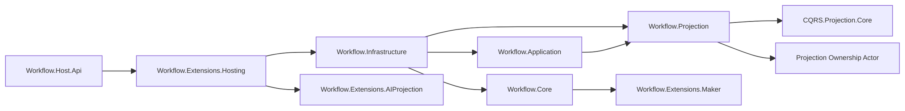

# Aevatar Workflow 子解决方案评分卡（2026-02-21，重算）

## 1. 审计范围与方法

1. 审计对象：`aevatar.workflow.slnf`（单一子解决方案）。
2. 评分规范：`docs/audit-scorecard/README.md`（100 分模型，6 维度）。
3. 证据来源：`slnf/csproj` 依赖、核心编排源码、测试源码、CI guard、本地命令结果。

## 2. 子解决方案组成

`aevatar.workflow.slnf` 覆盖 14 个项目，包含 Workflow 主干（`Core/Application/Projection/Infrastructure/Host`）、扩展（AIProjection/Hosting/Maker）与 3 个测试项目。  
证据：`aevatar.workflow.slnf:9`、`aevatar.workflow.slnf:12`、`aevatar.workflow.slnf:17`、`aevatar.workflow.slnf:18`。

## 3. 相关源码架构分析

### 3.1 分层与依赖方向

1. `Core` 保持领域编排职责（`WorkflowGAgent`、模块工厂），无 Host/Infrastructure 反向耦合。  
证据：`src/workflow/Aevatar.Workflow.Core/WorkflowGAgent.cs:33`、`src/workflow/Aevatar.Workflow.Core/WorkflowModuleFactory.cs:5`。
2. `Application` 依赖抽象层与基础能力，符合上层依赖抽象。  
证据：`src/workflow/Aevatar.Workflow.Application/Aevatar.Workflow.Application.csproj:10`、`src/workflow/Aevatar.Workflow.Application/Aevatar.Workflow.Application.csproj:11`。
3. `Projection` 依赖 `CQRS.Projection.*` 与 `Foundation.Projection`，由通用内核承载生命周期/订阅。  
证据：`src/workflow/Aevatar.Workflow.Projection/Aevatar.Workflow.Projection.csproj:11`、`src/workflow/Aevatar.Workflow.Projection/Aevatar.Workflow.Projection.csproj:13`。
4. `Host.Api` 保持薄宿主，通过扩展方法进行能力组合。  
证据：`src/workflow/Aevatar.Workflow.Host.Api/Program.cs:23`、`src/workflow/Aevatar.Workflow.Infrastructure/DependencyInjection/WorkflowCapabilityServiceCollectionExtensions.cs:18`。

### 3.2 统一 CQRS/Projection 主链路

1. 命令入口由 `WorkflowChatRunApplicationService` 统一编排（申请投影租约、执行、释放）。  
证据：`src/workflow/Aevatar.Workflow.Application/Runs/WorkflowChatRunApplicationService.cs:8`、`src/workflow/Aevatar.Workflow.Application/Runs/WorkflowChatRunApplicationService.cs:129`、`src/workflow/Aevatar.Workflow.Application/Runs/WorkflowChatRunApplicationService.cs:92`。
2. 投影链路统一注册 `SubscriptionRegistry/LifecycleService`，避免双轨读侧。  
证据：`src/workflow/Aevatar.Workflow.Projection/DependencyInjection/ServiceCollectionExtensions.cs:46`、`src/workflow/Aevatar.Workflow.Projection/DependencyInjection/ServiceCollectionExtensions.cs:51`。
3. AI 投影通过扩展包挂载，`Workflow.Projection` 文档与当前依赖模型已对齐。  
证据：`src/workflow/Aevatar.Workflow.Projection/README.md:18`、`src/workflow/Aevatar.Workflow.Projection/README.md:25`。

### 3.3 Projection 编排与会话语义

1. 投影端口使用显式 lease/session（`Ensure/Attach/Detach/Release`），符合句柄化生命周期。  
证据：`src/workflow/Aevatar.Workflow.Application.Abstractions/Projections/IWorkflowExecutionProjectionPort.cs:12`、`src/workflow/Aevatar.Workflow.Application.Abstractions/Projections/IWorkflowExecutionProjectionPort.cs:29`。
2. 运行时以 ownership + lease 协调生命周期，防并发重复启动。  
证据：`src/workflow/Aevatar.Workflow.Projection/Orchestration/WorkflowExecutionProjectionService.cs:50`、`test/Aevatar.Workflow.Host.Api.Tests/WorkflowExecutionProjectionServiceTests.cs:114`。
3. 订阅分发异常不再“静默失败”：背压/写入异常会发布 `WorkflowRunErrorEvent`。  
证据：`src/workflow/Aevatar.Workflow.Projection/Orchestration/WorkflowExecutionProjectionService.cs:333`、`src/workflow/Aevatar.Workflow.Projection/Orchestration/WorkflowExecutionProjectionService.cs:342`、`test/Aevatar.Workflow.Host.Api.Tests/WorkflowExecutionProjectionServiceTests.cs:290`。

### 3.4 子解结构图

### 3.5 命名语义与冗余清理

1. 关键项目保持 `项目名 = AssemblyName = RootNamespace` 一致，命名语义稳定。  
证据：`src/workflow/Aevatar.Workflow.Application/Aevatar.Workflow.Application.csproj:6`、`src/workflow/Aevatar.Workflow.Application/Aevatar.Workflow.Application.csproj:7`、`src/workflow/Aevatar.Workflow.Projection/Aevatar.Workflow.Projection.csproj:6`、`src/workflow/Aevatar.Workflow.Projection/Aevatar.Workflow.Projection.csproj:7`、`src/workflow/extensions/Aevatar.Workflow.Extensions.AIProjection/Aevatar.Workflow.Extensions.AIProjection.csproj:6`、`src/workflow/extensions/Aevatar.Workflow.Extensions.AIProjection/Aevatar.Workflow.Extensions.AIProjection.csproj:7`。
2. 缩写命名保持语义化大写（`CQRS/AI/AGUI`）并与模块职责对齐，未发现语义混淆命名。  
证据：`src/workflow/Aevatar.Workflow.Projection/DependencyInjection/ServiceCollectionExtensions.cs:27`、`src/workflow/Aevatar.Workflow.Host.Api/Program.cs:23`。
3. 已完成一处文档冗余/失配清理：`Workflow.Projection` README 依赖描述与实际扩展挂载模型对齐，不再保留“直接依赖 AI.Projection”的历史表述。  
证据：`src/workflow/Aevatar.Workflow.Projection/README.md:18`、`src/workflow/Aevatar.Workflow.Projection/README.md:25`、`src/workflow/Aevatar.Workflow.Projection/Aevatar.Workflow.Projection.csproj:10`。
4. Host 与 Infrastructure 未出现空转发壳层：Host 仅做组合入口，基础编排下沉到能力扩展。  
证据：`src/workflow/Aevatar.Workflow.Host.Api/Program.cs:23`、`src/workflow/Aevatar.Workflow.Infrastructure/DependencyInjection/WorkflowCapabilityServiceCollectionExtensions.cs:18`。

## 4. 客观验证结果

| 检查项 | 命令 | 结果 |
|---|---|---|
| 子解构建 | `dotnet build aevatar.workflow.slnf --nologo --no-restore --tl:off -m:1 -p:UseSharedCompilation=false -p:NuGetAudit=false` | 通过（0 warning / 0 error） |
| 子解测试 | `dotnet test aevatar.workflow.slnf --nologo --tl:off -m:1 -p:UseSharedCompilation=false -p:NuGetAudit=false --no-restore` | 通过（`101 passed / 0 failed`） |
| 架构门禁 | `bash tools/ci/architecture_guards.sh` | 通过 |
| 覆盖率采集 | `dotnet test aevatar.workflow.slnf ... --collect:"XPlat Code Coverage"` | 行覆盖率 `18.67%`，分支覆盖率 `9.61%` |

覆盖率证据：  
`test/Aevatar.Workflow.Application.Tests/TestResults/670ff2d2-a43a-427a-82e4-67ca8f00ac55/coverage.cobertura.xml:2`、  
`test/Aevatar.Workflow.Extensions.Maker.Tests/TestResults/09f0ae5f-9c8f-4ce4-b185-01650c7e083c/coverage.cobertura.xml:2`、  
`test/Aevatar.Workflow.Host.Api.Tests/TestResults/81fbd29c-ef8b-4470-aa40-e948ac73566a/coverage.cobertura.xml:2`。

## 5. 评分结果（100 分制）

**总分：98 / 100（A+）**

| 维度 | 权重 | 得分 | 说明 |
|---|---:|---:|---|
| 分层与依赖反转 | 20 | 20 | `Core/Application/Projection/Infrastructure/Host` 边界清晰，组合入口统一。 |
| CQRS 与统一投影链路 | 20 | 20 | `Command -> Event -> Projection -> ReadModel` 主链路统一，AI 扩展挂载清晰。 |
| Projection 编排与状态约束 | 20 | 20 | ownership + lease 语义完整，且无中间层事实态映射反模式证据。 |
| 读写分离与会话语义 | 15 | 15 | 命令与查询职责分离，live sink 异常已有显式回传，不再静默失败。 |
| 命名语义与冗余清理 | 10 | 10 | 命名与文档依赖描述已对齐当前架构。 |
| 可验证性（门禁/构建/测试） | 15 | 13 | build/test/guard 全绿，但覆盖率仍偏低，且未形成覆盖率阈值门禁。 |

## 6. 主要扣分项（按影响度）

### P1

1. 暂无 P1 阻断项。

### P2

1. 覆盖率偏低（行 18.67%，分支 9.61%），关键分支保护不足。  
证据：`test/Aevatar.Workflow.Application.Tests/TestResults/670ff2d2-a43a-427a-82e4-67ca8f00ac55/coverage.cobertura.xml:2`、`test/Aevatar.Workflow.Extensions.Maker.Tests/TestResults/09f0ae5f-9c8f-4ce4-b185-01650c7e083c/coverage.cobertura.xml:2`。
2. 分片测试门禁仅执行 `dotnet test`，尚未包含覆盖率阈值判定。  
证据：`tools/ci/solution_split_test_guards.sh:14`、`tools/ci/solution_split_test_guards.sh:39`。

## 7. 改进建议（优先级）

1. P1：补齐 `Workflow.Application` 与 `Workflow.Extensions.Maker` 的关键分支测试，并覆盖错误分支（例如 sink 写入失败 `RUN_SINK_WRITE_FAILED` 路径）。
2. P2：为 workflow 子解增加最低覆盖率门禁（建议 line/branch 双阈值），并纳入 `tools/ci/solution_split_test_guards.sh` 或独立 guard。
