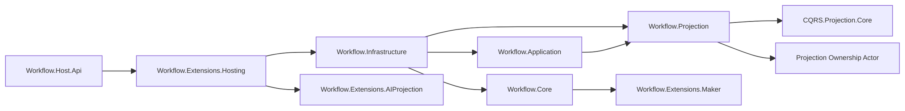

# Aevatar Workflow 子解决方案评分卡（2026-02-21，增量复核）

## 1. 审计范围与方法

1. 审计对象：`aevatar.workflow.slnf`（单一子解决方案）。
2. 评分规范：`docs/audit-scorecard/README.md`（100 分模型，6 维度）。
3. 证据来源：`slnf/csproj` 依赖、核心编排源码、测试源码、CI guard、本地命令结果。

## 2. 子解决方案组成

`aevatar.workflow.slnf` 覆盖 Workflow 主干（`Core/Application/Projection/Infrastructure/Host`）、扩展（AIProjection/Hosting/Maker）与 3 个测试项目。  
证据：`aevatar.workflow.slnf`。

## 3. 相关源码架构分析

### 3.1 分层与依赖方向

1. `Core` 保持领域编排职责（`WorkflowGAgent`、模块工厂），无 Host/Infrastructure 反向耦合。  
证据：`src/workflow/Aevatar.Workflow.Core/WorkflowGAgent.cs`、`src/workflow/Aevatar.Workflow.Core/WorkflowModuleFactory.cs`。
2. `Application` 依赖抽象层与基础能力，保持上层依赖抽象。  
证据：`src/workflow/Aevatar.Workflow.Application/Aevatar.Workflow.Application.csproj`。
3. `Projection` 依赖 `CQRS.Projection.*` 与 `Foundation.Projection`，由通用内核承载生命周期/订阅。  
证据：`src/workflow/Aevatar.Workflow.Projection/Aevatar.Workflow.Projection.csproj`。
4. `Host.Api` 保持薄宿主，通过扩展方法组合能力。  
证据：`src/workflow/Aevatar.Workflow.Host.Api/Program.cs`、`src/workflow/Aevatar.Workflow.Infrastructure/DependencyInjection/WorkflowCapabilityServiceCollectionExtensions.cs`。

### 3.2 统一 CQRS/Projection 主链路（本轮重点）

1. 命令入口编排职责已下沉拆分：  
`WorkflowChatRunApplicationService`（入口） +  
`WorkflowRunContextFactory`（上下文创建） +  
`WorkflowRunExecutionEngine`（执行/流转） +  
`WorkflowRunCompletionPolicy`（终态判定） +  
`WorkflowRunResourceFinalizer`（资源回收）。  
证据：`src/workflow/Aevatar.Workflow.Application/Runs/WorkflowChatRunApplicationService.cs`、`src/workflow/Aevatar.Workflow.Application/Runs/WorkflowRunExecutionEngine.cs`。
2. 投影端口实现拆分为 facade + 策略组件：  
`WorkflowExecutionProjectionService` +  
`WorkflowProjectionActivationService` +  
`WorkflowProjectionReleaseService` +  
`WorkflowProjectionLeaseManager` +  
`WorkflowProjectionSinkSubscriptionManager` +  
`WorkflowProjectionLiveSinkForwarder` +  
`WorkflowProjectionSinkFailurePolicy` +  
`WorkflowProjectionReadModelUpdater` +  
`WorkflowProjectionQueryReader`。  
证据：`src/workflow/Aevatar.Workflow.Projection/Orchestration/WorkflowExecutionProjectionService.cs`、`src/workflow/Aevatar.Workflow.Projection/Orchestration/WorkflowProjectionActivationService.cs`、`src/workflow/Aevatar.Workflow.Projection/Orchestration/WorkflowProjectionReleaseService.cs`、`src/workflow/Aevatar.Workflow.Projection/Orchestration/WorkflowProjectionLiveSinkForwarder.cs`。
3. 架构门禁新增编排类体量限制（行数/依赖数），防止职责反弹。  
证据：`tools/ci/architecture_guards.sh`。

### 3.3 Projection 编排与会话语义

1. 投影端口使用显式 lease/session（`Ensure/Attach/Detach/Release`），符合句柄化生命周期。  
证据：`src/workflow/Aevatar.Workflow.Application.Abstractions/Projections/IWorkflowExecutionProjectionPort.cs`。
2. ownership + lease 协调生命周期，防并发重复启动。  
证据：`src/workflow/Aevatar.Workflow.Projection/Orchestration/WorkflowProjectionLeaseManager.cs`、`test/Aevatar.Workflow.Host.Api.Tests/WorkflowExecutionProjectionServiceTests.cs`。
3. sink 背压/写入失败有显式异常策略与错误事件回传。  
证据：`src/workflow/Aevatar.Workflow.Projection/Orchestration/WorkflowProjectionSinkFailurePolicy.cs`、`test/Aevatar.Workflow.Host.Api.Tests/WorkflowProjectionOrchestrationComponentTests.cs`。

### 3.4 子解结构图

## 4. 客观验证结果

| 检查项 | 命令 | 结果 |
|---|---|---|
| 子解构建 | `dotnet build aevatar.workflow.slnf --nologo --tl:off -m:1 -p:UseSharedCompilation=false -p:NuGetAudit=false` | 通过（0 warning / 0 error） |
| 子解测试 | `dotnet test aevatar.workflow.slnf --nologo --tl:off -m:1 -p:UseSharedCompilation=false -p:NuGetAudit=false --no-build` | 通过（`188 passed / 0 failed`） |
| 架构门禁 | `bash tools/ci/architecture_guards.sh` | 通过 |
| 覆盖率采集（Workflow 程序集过滤） | `dotnet test aevatar.workflow.slnf ... --collect:"XPlat Code Coverage" + reportgenerator` | 行覆盖率 `64.3%`，分支覆盖率 `42.1%`，方法覆盖率 `72.8%` |

覆盖率证据（最近一次采集）：`artifacts/coverage/20260222-025047-workflow-slnf/report/Summary.json`。

## 5. 评分结果（100 分制）

**总分：98 / 100（A+）**

| 维度 | 权重 | 得分 | 说明 |
|---|---:|---:|---|
| 分层与依赖反转 | 20 | 20 | `Core/Application/Projection/Infrastructure/Host` 边界清晰。 |
| CQRS 与统一投影链路 | 20 | 19 | 主链路统一，编排职责拆分已落地。 |
| Projection 编排与状态约束 | 20 | 20 | facade + 激活/释放/转发/订阅组件分层明确，职责边界清晰。 |
| 读写分离与会话语义 | 15 | 15 | 命令与查询职责分离，lease/session 模型清晰。 |
| 命名语义与冗余清理 | 10 | 10 | 命名与职责基本一致。 |
| 可验证性（门禁/构建/测试） | 15 | 14 | build/test/guard 全绿；覆盖率仍有提升空间。 |

## 6. 主要扣分项（按影响度）

### P1

1. 暂无 P1 阻断项。

### P2

1. Workflow 子解覆盖率尚未进入高位区间（特别是分支覆盖率），建议继续补关键异常路径。  
证据：`artifacts/coverage/20260222-025047-workflow-slnf/report/Summary.json`。

## 7. 改进建议（优先级）

1. P1：为 workflow 子解增加覆盖率阈值门禁（line/branch 双阈值），并纳入 `tools/ci/solution_split_test_guards.sh` 或独立 guard。
2. P2：补齐投影异常路径与并发边界测试（sink 失败、lease 抢占、attach/detach 竞态）。
