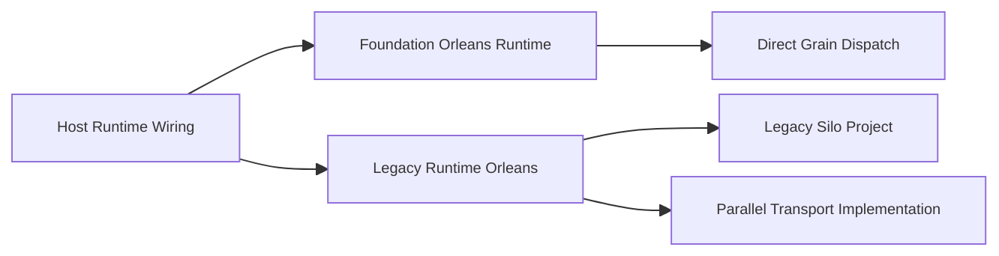
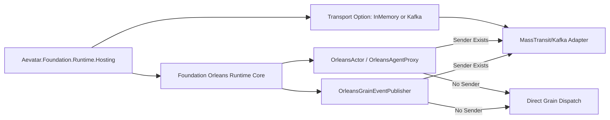
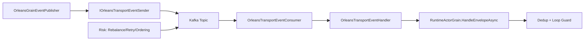

# Aevatar 未提交改动架构评分卡（2026-02-22 四次复评）

## 1. 审计结论

- 结论：`PASS`
- 分支：`feat/orleans-integration`
- 审计基线：`HEAD vs Working Tree`（未提交增量）
- 审计范围：`git diff --name-status HEAD`
- 审计时间：`2026-02-22`

## 2. 变更概览

- 变更文件数：`49`
- 变更类型：`A=12`、`M=13`、`D=24`
- 核心变更主题：
1. 删除合并带入的旧并行实现：`src/Aevatar.Runtime.Orleans/**`、`src/Aevatar.Silo/**`、`aevatar.sln`。
2. 在主干 Orleans 实现中新增可选 Kafka/MassTransit transport：`src/Aevatar.Foundation.Runtime.Implementations.Orleans/Transport/MassTransit/*`。
3. 将 transport 从“仅 DI 注册”收敛为“可执行分发路径”：`OrleansActor`、`OrleansAgentProxy`、`OrleansGrainEventPublisher`、`RuntimeActorGrain`。
4. 更新 Hosting 运行时选项与装配入口：`src/Aevatar.Foundation.Runtime.Hosting/*`。
5. 补齐对应测试与重构文档：`test/Aevatar.Foundation.Runtime.Hosting.Tests/*`、`docs/ORLEANS_RUNTIME_MERGE_REFACTOR_PLAN_2026-02-22.md`、`docs/ORLEANS_KAFKA_TRANSPORT_GUIDE.md`。

## 3. 综合评分

- 综合分：`98 / 100`（等级：`A+`）

| 维度 | 权重 | 得分 | 说明 |
|---|---:|---:|---|
| 分层与依赖反转 | 20 | 20 | 旧并行层已删除，Orleans transport 以插件形式挂载在实现层，Host 仅做配置装配。 |
| CQRS 与统一投影链路 | 20 | 20 | 本次增量未引入双轨投影/路由分叉，现有统一链路保持不变。 |
| Projection 编排与状态约束 | 20 | 20 | 未引入中间层事实态映射字典；拓扑转发仍由 runtime/registry 承载。 |
| 读写分离与会话语义 | 15 | 14 | dispatch 语义已收敛为“可选队列层转发”，但真实 broker 场景下重试/重平衡语义尚缺集成验证。 |
| 命名语义与冗余清理 | 10 | 10 | 清理 `Aevatar.Runtime.Orleans` 旧命名体系，主干统一到 `Aevatar.Foundation.Runtime.Implementations.Orleans`。 |
| 可验证性（门禁/构建/测试） | 15 | 14 | build/test/guards 全通过；Kafka transport 目前以单元测试为主，缺少真实集成压测证据。 |

## 4. 发现列表（按严重级别）

### P1（阻断）

- 未发现增量阻断问题。

### P2（需修复）

- 未发现增量 P2 问题。

### P3（改进项）

1. Kafka transport 缺少真实 broker + Orleans 集成回归测试。
   - 证据：
   - `test/Aevatar.Foundation.Runtime.Hosting.Tests/OrleansKafkaTransportServiceCollectionExtensionsTests.cs:10`（当前覆盖以 DI/注册断言为主）
   - `test/Aevatar.Foundation.Runtime.Hosting.Tests/OrleansActorTransportDispatchTests.cs:12`（当前覆盖以内存替身 sender 为主）
   - `rg -n "OrleansKafka|MassTransit|Kafka|IOrleansTransportEventSender|OrleansTransportEvent" test/Aevatar.Integration.Tests test/Aevatar.Workflow.Host.Api.Tests -g"*.cs"`（无命中）
   - 影响：broker 重平衡、重复投递、消费重试、顺序语义等生产风险尚无自动化证据。
   - 修复要求：新增至少 1 组 Kafka + Orleans 的端到端集成测试（建议 Testcontainers）。
   - 验收标准：覆盖 `A -> B` 远程转发、重复消息去重、消费失败重试三类场景并纳入 CI。

## 5. 关键证据（已关闭项）

1. 旧并行壳层已删除，主干单实现收敛。
   - 证据：`git diff --name-status HEAD` 中 `D src/Aevatar.Runtime.Orleans/*`、`D src/Aevatar.Silo/*`、`D aevatar.sln`。

2. Hosting 已提供 Orleans 可选 transport 配置入口与非法值保护。
   - `src/Aevatar.Foundation.Runtime.Hosting/AevatarActorRuntimeOptions.cs:10`
   - `src/Aevatar.Foundation.Runtime.Hosting/DependencyInjection/ServiceCollectionExtensions.cs:54`
   - `src/Aevatar.Foundation.Runtime.Hosting/DependencyInjection/ServiceCollectionExtensions.cs:65`

3. Orleans runtime 已接入“有 sender 走 transport、无 sender 走直连 grain”的统一分发策略。
   - `src/Aevatar.Foundation.Runtime.Implementations.Orleans/Actors/OrleansActor.cs:31`
   - `src/Aevatar.Foundation.Runtime.Implementations.Orleans/Actors/OrleansAgentProxy.cs:23`
   - `src/Aevatar.Foundation.Runtime.Implementations.Orleans/Actors/OrleansGrainEventPublisher.cs:157`
   - `src/Aevatar.Foundation.Runtime.Implementations.Orleans/Grains/RuntimeActorGrain.cs:210`

4. Kafka/MassTransit 适配层已落位并与 Silo 装配接通。
   - `src/Aevatar.Foundation.Runtime.Implementations.Orleans/Transport/MassTransit/MassTransitKafkaServiceCollectionExtensions.cs:9`
   - `src/Aevatar.Foundation.Runtime.Implementations.Orleans/DependencyInjection/ServiceCollectionExtensions.cs:44`

5. 回归测试已补齐关键入口。
   - `test/Aevatar.Foundation.Runtime.Hosting.Tests/AevatarActorRuntimeServiceCollectionExtensionsTests.cs:80`
   - `test/Aevatar.Foundation.Runtime.Hosting.Tests/OrleansKafkaTransportServiceCollectionExtensionsTests.cs:10`
   - `test/Aevatar.Foundation.Runtime.Hosting.Tests/OrleansActorTransportDispatchTests.cs:12`
   - `test/Aevatar.Foundation.Runtime.Hosting.Tests/OrleansGrainEventPublisherTests.cs:105`

## 6. 架构图（变更前/后/风险路径）

### 6.1 变更前（问题态）

### 6.2 变更后（当前态）

### 6.3 风险路径（待增强）

## 7. 分模块评分

| 模块 | 评分 | 结论 |
|---|---:|---|
| Foundation + Runtime + Orleans | 98 | 主干收敛与 transport 插件化完成，生产级集成测试仍需补齐。 |
| Hosting | 99 | 运行时 provider/transport 装配清晰，默认行为不回退。 |
| Docs + Guards | 99 | 重构计划与指引已同步，门禁全绿。 |

## 8. 门禁与验收命令

| 检查项 | 命令 | 结果 |
|---|---|---|
| 全量构建 | `dotnet build aevatar.slnx --nologo --no-restore -m:1 -nodeReuse:false --tl:off` | 通过（0 warning / 0 error） |
| 全量测试 | `dotnet test aevatar.slnx --nologo --no-build --no-restore -m:1 -nodeReuse:false --tl:off` | 通过（`561/561`） |
| 架构门禁 | `bash tools/ci/architecture_guards.sh` | 通过 |
| 路由映射门禁 | `bash tools/ci/projection_route_mapping_guard.sh` | 通过 |
| 分片构建门禁 | `bash tools/ci/solution_split_guards.sh` | 通过 |
| 分片测试门禁 | `bash tools/ci/solution_split_test_guards.sh` | 通过 |

## 9. 审计说明

- 是否发现增量缺陷：`否`
- 当前等级建议：`可合并（PASS）`
- 残余风险：Kafka transport 在真实多节点/真实 broker 下的重试与顺序语义尚无自动化证明。
