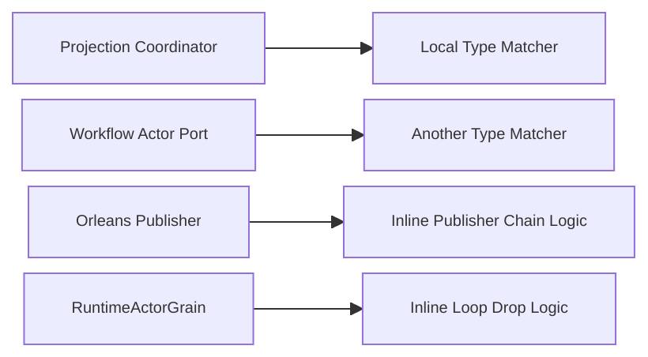
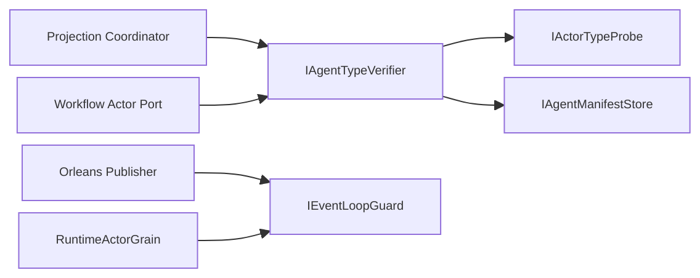
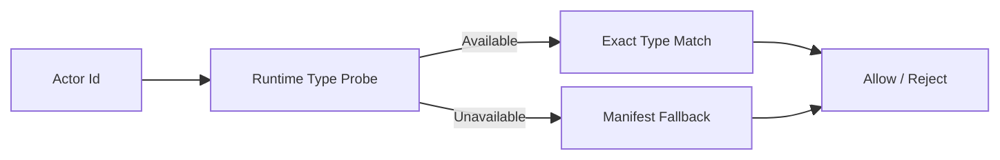

# Aevatar 未提交改动重评分卡（2026-02-22 三次复评）

## 1. 审计结论

- 结论：`PASS`
- 分支：`feat/orleans-integration`
- 审计基线：`HEAD vs Working Tree`（未提交增量复评）
- 审计范围：`git diff --name-only HEAD`
- 审计时间：`2026-02-22`

## 2. 变更概览

- 变更文件数：`24`
- 核心模块：
  - `Aevatar.Foundation.Abstractions/Core/Runtime`（类型验证统一抽象与实现）
  - `Aevatar.Foundation.Runtime.Implementations.Orleans`（loop guard 策略化）
  - `Aevatar.CQRS.Projection.Core`、`Aevatar.Workflow.Infrastructure`（业务入口收敛）
  - 对应测试项目：`Foundation.Core.Tests`、`Foundation.Runtime.Hosting.Tests`、`CQRS.Projection.Core.Tests`、`Workflow.Host.Api.Tests`
- 风险主题：`类型事实源统一`、`环路抑制策略统一`、`可验证性闭环`

## 3. 重评分结果

- 综合分：`98 / 100`（等级：`A+`）

| 维度 | 权重 | 得分 | 说明 |
|---|---:|---:|---|
| 分层与依赖反转 | 20 | 20 | 类型验证能力上提到 `Abstractions`，业务层仅依赖契约。 |
| CQRS 与统一投影链路 | 20 | 20 | `Projection ownership` 入口改为统一 verifier，不再各自维护类型判定。 |
| Projection 编排与状态约束 | 20 | 19 | 运行时类型探针优先，manifest 仅作补偿；一致性显著提升。 |
| 读写分离与会话语义 | 15 | 15 | Orleans publisher/receiver 共用 loop guard，Self/remote 语义统一。 |
| 命名语义与冗余清理 | 10 | 9 | 删除重复 `MatchesExpectedType`，但 type-name 仍以字符串为输入载体。 |
| 可验证性（门禁/构建/测试） | 15 | 15 | 全量构建/测试/门禁通过，新增 verifier 与 loop guard 测试矩阵。 |

## 4. 发现列表（按严重级别）

### P1（阻断）

- 未发现增量缺陷。

### P2（需修复）

- 未发现增量缺陷。

### P3（改进项）

- 未发现本次增量必须修复项。

## 5. 关键关闭项证据

1. 类型判定不再分散实现，已统一到 `IAgentTypeVerifier`。
   - 抽象：`src/Aevatar.Foundation.Abstractions/TypeSystem/IAgentTypeVerifier.cs:1`
   - 实现：`src/Aevatar.Foundation.Core/TypeSystem/DefaultAgentTypeVerifier.cs:19`
   - 业务接入：`src/Aevatar.CQRS.Projection.Core/Orchestration/ActorProjectionOwnershipCoordinator.cs:79`、`src/workflow/Aevatar.Workflow.Infrastructure/Runs/WorkflowRunActorPort.cs:51`

2. 类型事实源从“仅 manifest”升级为“runtime probe 优先 + manifest 回退”。
   - 本地探针：`src/Aevatar.Foundation.Runtime/TypeSystem/LocalActorTypeProbe.cs:17`
   - Orleans 探针：`src/Aevatar.Foundation.Runtime.Implementations.Orleans/Actors/OrleansActorTypeProbe.cs:17`
   - DI 注册：`src/Aevatar.Foundation.Runtime/DependencyInjection/ServiceCollectionExtensions.cs:66`、`src/Aevatar.Foundation.Runtime.Implementations.Orleans/DependencyInjection/ServiceCollectionExtensions.cs:27`

3. Orleans 环路抑制从局部特判改为统一策略。
   - 策略抽象：`src/Aevatar.Foundation.Runtime.Implementations.Orleans/Propagation/IEventLoopGuard.cs:1`
   - 策略实现：`src/Aevatar.Foundation.Runtime.Implementations.Orleans/Propagation/PublisherChainLoopGuard.cs:8`
   - 发布侧接入：`src/Aevatar.Foundation.Runtime.Implementations.Orleans/Actors/OrleansGrainEventPublisher.cs:112`
   - 接收侧接入：`src/Aevatar.Foundation.Runtime.Implementations.Orleans/Grains/RuntimeActorGrain.cs:81`

4. 回归测试覆盖已补齐。
   - verifier 矩阵：`test/Aevatar.Foundation.Core.Tests/AgentTypeVerifierTests.cs:11`
   - loop guard 矩阵：`test/Aevatar.Foundation.Runtime.Hosting.Tests/PublisherChainLoopGuardTests.cs:10`
   - Orleans/Projection/Workflow 入口回归：
     - `test/Aevatar.Foundation.Runtime.Hosting.Tests/OrleansGrainEventPublisherTests.cs:16`
     - `test/Aevatar.CQRS.Projection.Core.Tests/ProjectionOwnershipAndSessionHubTests.cs:11`
     - `test/Aevatar.Workflow.Host.Api.Tests/WorkflowInfrastructureCoverageTests.cs:179`

## 6. 架构图（变更前/后/风险路径）

### 6.1 变更前（问题态）

### 6.2 变更后（当前态）

### 6.3 风险路径（已收敛）

## 7. 门禁与验收命令

| 检查项 | 命令 | 结果 |
|---|---|---|
| 全量构建 | `dotnet build aevatar.slnx --nologo --no-restore -m:1 -nodeReuse:false --tl:off` | 通过（0 warning / 0 error） |
| 全量测试 | `dotnet test aevatar.slnx --nologo --no-build --no-restore -m:1 -nodeReuse:false --tl:off` | 通过（`536/536`） |
| 架构门禁 | `bash tools/ci/architecture_guards.sh` | 通过 |
| 路由映射门禁 | `bash tools/ci/projection_route_mapping_guard.sh` | 通过 |

## 8. 审计说明

- 是否发现增量缺陷：`否`
- 残余风险：`OrleansActorTypeProbe` 读取 grain 状态类型名，尚未补充多节点真实 Silo 集成压测。
- 测试空白：尚未覆盖“跨节点网络抖动 + 反复激活/失活”下的类型探针稳定性场景。
