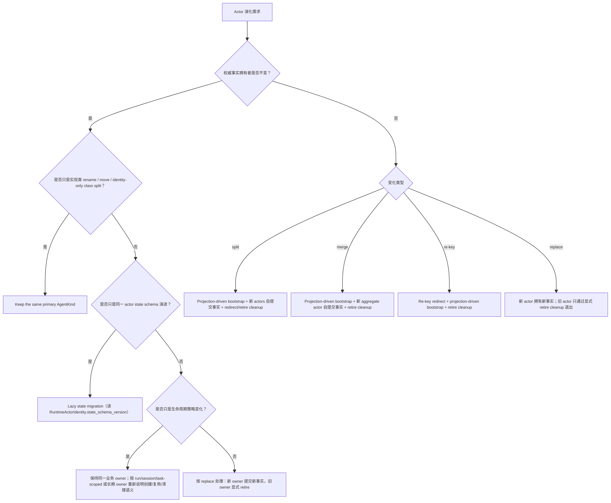

# Actor Evolution Canon Matrix

本文定义 actor 演化的判定树。它只固化当前 canon 口径，不新增 actor type、envelope kind、pipeline phase、proto field 或新的 actor topology。

## 1. 判定树

先判定业务事实归属，再判定 identity 与生命周期；不要先设计迁移框架。

## 2. Canon Matrix

| 演化模式 | 判定 | Canon 机制 | 完成判据 | 禁止替代 |
|---|---|---|---|---|
| Rename / move | `AgentKind` 表达的业务 entity 不变；只是 CLR 类型、命名空间、目录或实现位置变化 | 保持同一个 primary `AgentKind`；CLR 类型只作为诊断信息 | 旧 identity 的 `Identity.Kind` 能解析到当前实现；无业务 state mutation | 修改 actor id、改 kind token 当版本号、依赖 CLR 名称回退 |
| Identity-only class split | 一个旧实现类拆成多个实现类，但某个旧 `AgentKind` 的事实 owner 不变 | 旧 kind 继续由唯一新 owner 声明为 primary kind；其他新能力按各自 owner 独立建模 | 旧 kind 仍只解析到一个权威 owner；调用方不解析 CLR 名 | 把旧事实复制到多个 owner、用 projection 反向定义 owner |
| State schema change | 同一 actor id、同一 `AgentKind`、同一事实 owner，只是 state shape 演进 | Lazy state migration；版本轴来自 `RuntimeActorIdentity.state_schema_version` | 迁移后同一 actor 继续提交同一事实流；replay 同态保持 | 在业务 state proto 里塞版本、query-time replay、projection bootstrap |
| Split | 一个旧 owner 的业务事实被拆给多个新 owner | Projection-driven bootstrap 从旧 committed facts / committed state publication 生成 bootstrap 输入；新 actors 自己提交 domain event 成为权威 | 新 actors 的 committed version 可被 readmodel 观察；旧 actor redirect / retire cleanup 明确完成 | 在旧 actor state 内拼新 actor 事实、查询时读多个 event stream 临时拆分 |
| Merge | 多个旧 owner 聚合为一个新 owner | Projection-driven bootstrap 汇总旧 committed facts；新的 aggregate actor 提交自己的 domain event | 新 aggregate actor 拥有聚合事实；旧 actors/readmodels/indexes 明确 retire | query-time 聚合、readmodel 反向定义业务事实 |
| Lifecycle change | 权威事实 owner 不变，但创建、复用、清理窗口变化（长期 actor 与 run/session/task-scoped actor 的边界调整） | 先写清稳定归属、复用键、清理责任；若只改变运行策略，不迁移事实；若 owner 改变，升级为 split / merge / replace | actorId 对调用方仍不透明；旧运行态不会成为跨节点事实源 | 依赖进程内 registry、把 actorId 字符串模式当业务判断 |
| Re-key | `AgentKind` 不变或 owner 等价，但 actor id / key 改写 | Re-key redirect 显式记录旧 key 到新 key；必要时 projection-driven bootstrap；旧 key 显式退役 | 目标解析走 redirect 事实；readmodel 暴露新 owner 版本 | 把 `commandId` / `correlationId` 当 actorId、调用方解析 id 前缀 |
| Replace | 旧 owner 被新 owner 替换，语义不再是同一 actor 内演进 | 新 actor 提交新事实；旧 actor 通过 retire cleanup 退出；必要时提供明确 redirect | 新事实只由新 owner 定义；旧事实不会被 query path 临时兼容 | 空壳兼容、双写事实源、用弱 ACK 暗示新事实已可查 |

## 3. 机制边界

Lazy state migration 只适用于同一 actor 的内部 state schema 演进：

1. 输入只来自历史 state 与 `RuntimeActorIdentity.state_schema_version`。
2. 输出仍是同一 actor 的当前 state。
3. 迁移不得做 I/O、跨 actor 调用、projection 写入、readmodel 读取或创建其他 actor。
4. 迁移必须可重放同态、幂等、总定义；registry 只接受同一 Protobuf state contract 上从 `0` 到当前版本的完整连续链。
5. 每个 step 必须声明 exact fleet capability、contract id、reader contract version 与 required gate status。默认只接受 current membership 上的 fresh `OPEN` admission；只有命名明确的单向 bridge migration 可以接受 Authority 已提交的 historical `QUIESCED` evidence。runtime 在 agent 构造/激活前原子写入 snapshot、schema version 与带 exact evidence status 的 adoption receipt。
6. adoption receipt 是历史采用证据，不是永久 live grant；已采用 state 保持可读，需要启动新 logical mutation 的能力应使用同一 admission policy 重验当前 gate。`QUIESCED` receipt 只证明旧 contract 已终止，永远不能提升为新 rollout 的 OPEN grant。
7. 已激活 actor 在 gate OPEN 后仍可能持有旧 schema。宣称支持 schema activation seal 的 runtime 必须在每条 envelope 进入 agent handler 前检查 admitted migration：命中时结束本 turn、turnover activation，并让同一 envelope 可重投；下一 activation 必须先迁移再构造 agent。不能安全 turnover 的 runtime adapter 不得广播依赖该能力的 fleet contract。
8. 迁移写入失败或结果未知（store 可能已提交但 ACK 丢失）时 actor 必须不可用而不是部分迁移：观察到失败的这次 activation 不得构造、绑定或激活 agent，也不消费 inbox；不得假设“写抛异常即未提交”，重试前必须由新的 activation 重新读取 durable state 并按实际持久化的 schema 激活。Orleans（`RuntimeActorGrain` 丢弃 activation 并 rethrow）与 Local（`CompareExchange` 失败即 create 失败，下次 activation 重读）语义一致。
9. schema adoption 是 forward-only boundary：一旦任何 row 持久化新 schema，低于该 reader version 的 binary 不再是合法 rollback/member。若 dormant old-schema actor 没有批量迁移，部署准入仍必须保证它首次激活只会落在达到最低 reader version 的 runtime；不能把最终一致的 gate revoke 当作阻止旧 binary 重入的同步屏障。

Projection-driven bootstrap 只适用于 owner 变化：

1. 输入只来自 committed domain event、committed state publication 或同源 durable feed。
2. Bootstrap 输入不是新事实；新 actor 必须提交自己的 domain event 后才成为权威 owner。
3. Split / merge / re-key 的读侧切换以 readmodel 已物化的权威版本为准。
4. Projection 不承担业务状态机重算；它只物化 bootstrap 输入、覆盖写入、索引和分发。
5. Query path 不得执行 replay、bootstrap、projection activation、index repair 或 actor lifecycle 操作。

Retire cleanup 是演化协议的一部分：

1. 旧 actor、旧 readmodel、旧索引、旧 relay 或旧 redirect 窗口必须有明确清理责任。
2. 清理不得依赖 query path 的“如果旧数据还在就忽略”。
3. 删除旧 owner 前，必须确认新 owner 的 committed version 已经通过 readmodel 或观察链路可见。

## 4. Fleet rollout gate

Fleet rollout 由一个固定身份的长期 capability Authority actor、runtime-owned durable callback scheduler 和一个 current-state read model 构成。Authority 是唯一 gate 事实 owner；reserved reconcile slot 由 runtime scheduler 持有，业务代码不能修改。

```mermaid
%%{init: {"maxTextSize": 100000, "flowchart": {"useMaxWidth": false, "nodeSpacing": 10, "rankSpacing": 50}, "themeVariables": {"fontSize": "10px"}}}%%
flowchart LR
    SC["Runtime durable callback scheduler"] -->|"Persist one exact pending envelope before publish"| DS["Reserved reconcile slot"]
    DS -->|"Verified delivery + runtime-only attestation"| AU["Fixed capability Authority actor"]
    AU -->|"Committed-delivery acknowledgement"| DS
    AU -->|"Read and immediately reread exact membership"| MS["Trusted runtime membership source"]
    AU -->|"Commit observation + gate transitions"| AS["Authority committed state"]
    AS -->|"Committed current-state publication"| RM["Capability authority read model"]
    RM -->|"Materialize and query current state only"| AD["Migration and live-write admission"]
```

约束如下：

1. Runtime durable callback scheduler 是 reserved reconcile slot 的唯一 owner；它必须先持久化 exact pending delivery envelope，再发布到 Authority inbox。该 pending delivery 在 Authority 提交 reconcile 并以同一 runtime attestation 确认前保持不变，周期 tick 只能重发同一 envelope，不能在积压消费者前方持续前滚 verification window。通用 schedule、cancel、purge API 均不得修改或删除该 reserved slot。
2. Local 与 Orleans runtime ingress 必须根据 scheduler-owned durable delivery state 验证 reconcile envelope，并在本次处理上下文中绑定不可序列化的 runtime attestation。Authority 只接受携带该 attestation 且与当前 envelope 精确匹配的 reconcile；提交成功后必须确认该 attestation，重复 delivery 必须幂等重试确认。外部 publisher 不能直接 open/revoke gate，也不能伪造 scheduler delivery。
3. Authority 每次 reconcile 先读取 trusted exact membership，在 gate transition 前立即再次读取，并要求 `membership_epoch`、重算后的 `membership_digest` 与 `deployment_revision` 完全一致。任一次读取失败、证明变化、epoch 回退或同 epoch digest 冲突都 fail closed。
4. `Observed / Unavailable / Invalid / SourceFailed / RegressedOrConflicted` 是 typed observation outcome；除 `Observed` 外均撤销当前 open gates。Gate 仅在每个 active member 对 exact capability + contract id + minimum version 唯一达标时打开。
5. 每次 open/revoke 都基于已提交值单调增加 capability epoch；actor restart 不重置 epoch。Authority 不直接读写 read-model store，CQRS 只消费其 committed current-state publication 并物化、查询 current state。
6. Admission 只读 Authority 的 actor-scoped current-state replica，并同时核对 authority state version、capability epoch、freshness、membership/deployment digest、全员确认数，以及本地 member id + incarnation。缺失、过期或不一致全部 fail closed；query path 不触发 reconcile、projection priming 或 actor lifecycle。
7. Authority read model 是最终一致副本：live membership 的 epoch、digest、deployment revision 或本地 incarnation 一旦与副本不一致，admission 立即拒绝；同一 membership 下尚未投影的 revoke 只能在该 committed proof 的 `valid_until` 前形成 bounded stale-open window，到期必须拒绝。Orleans membership evidence 默认 TTL 为 30 秒，runtime policy 同时拒绝超过 `MaxMembershipEvidenceTtl` 的 proof；不得为消除该窗口在 query path 侧读 Authority actor。
8. Proof-gated observation 在 live proof 尚不可见时，必须把 exact failed envelope 持久化为 actor-owned durable continuation；持久化成功后 transport delivery 才可 ACK，随后以 delivery lineage 稳定的 callback id 重投直到 gate 可见。普通 retry budget 不得把这类等待降级为长期占住 broker offset 的 transport redelivery；只有 durable scheduler 写入失败时才保留原 delivery 未确认并传播原 handler failure。

## 5. 关联 canon

- `docs/canon/event-sourcing.md`：写侧事实源、replay 与 lazy migration 边界。
- `docs/canon/cqrs-projection.md`：Projection Pipeline、query-time replay/priming 禁止项。
- `docs/canon/architecture-vocabulary.md`：Lazy state migration、projection-driven bootstrap、retire cleanup、re-key redirect 术语。
