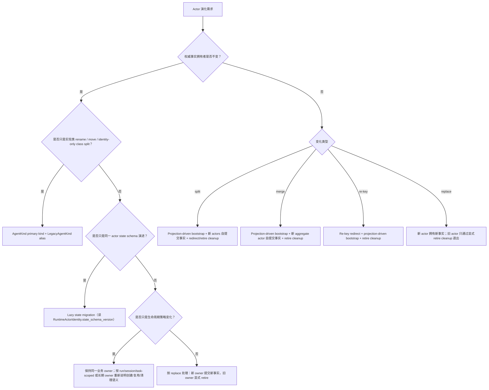

# Actor Evolution Canon Matrix

本文定义 actor 演化的判定树。它只固化当前 canon 口径，不新增 actor type、envelope kind、pipeline phase、proto field 或新的 actor topology。

## 1. 判定树

先判定业务事实归属，再判定 identity 与生命周期；不要先设计迁移框架。

## 2. Canon Matrix

| 演化模式 | 判定 | Canon 机制 | 完成判据 | 禁止替代 |
|---|---|---|---|---|
| Rename / move | `AgentKind` 表达的业务 entity 不变；只是 CLR 类型、命名空间、目录或实现位置变化 | 保持 primary `AgentKind`；必要时增加 `LegacyAgentKind` / legacy CLR alias 让旧 state 激活到新实现 | 旧 identity 能解析到当前实现；无业务 state mutation | 修改 actor id、改 kind token 当版本号、清理旧事实 |
| Identity-only class split | 一个旧实现类拆成多个实现类，但某个旧 `AgentKind` 的事实 owner 不变 | 旧 kind 由新 owner 声明 legacy alias；其他新能力按各自 owner 独立建模 | 旧 kind 仍只解析到一个权威 owner；调用方不解析 CLR 名 | 把旧事实复制到多个 owner、用 projection 反向定义 owner |
| State schema change | 同一 actor id、同一 `AgentKind`、同一事实 owner，只是 state shape 演进 | Lazy state migration；版本轴来自 `RuntimeActorIdentity.state_schema_version` | 迁移后同一 actor 继续提交同一事实流；replay 同态保持 | 在业务 state proto 里塞版本、query-time replay、projection bootstrap |
| Split | 一个旧 owner 的业务事实被拆给多个新 owner | Projection-driven bootstrap 从旧 committed facts / committed state publication 生成 bootstrap 输入；新 actors 自己提交 domain event 成为权威 | 新 actors 的 committed version 可被 readmodel 观察；旧 actor redirect / retire cleanup 明确完成 | 在旧 actor state 内拼新 actor 事实、查询时读多个 event stream 临时拆分 |
| Merge | 多个旧 owner 聚合为一个新 owner | Projection-driven bootstrap 汇总旧 committed facts；新的 aggregate actor 提交自己的 domain event | 新 aggregate actor 拥有聚合事实；旧 actors/readmodels/indexes 明确 retire | query-time 聚合、readmodel 反向定义业务事实 |
| Lifecycle change | 权威事实 owner 不变，但创建、复用、清理窗口变化（长期 actor 与 run/session/task-scoped actor 的边界调整） | 先写清稳定归属、复用键、清理责任；若只改变运行策略，不迁移事实；若 owner 改变，升级为 split / merge / replace | actorId 对调用方仍不透明；旧运行态不会成为跨节点事实源 | 依赖进程内 registry、把 actorId 字符串模式当业务判断 |
| Re-key | `AgentKind` 不变或 owner 等价，但 actor id / key 改写 | Re-key redirect 显式记录旧 key 到新 key；必要时 projection-driven bootstrap；旧 key 显式退役 | 目标解析走 redirect 事实；readmodel 暴露新 owner 版本 | 把 `commandId` / `correlationId` 当 actorId、调用方解析 id 前缀 |
| Replace | 旧 owner 被新 owner 替换，语义不再是同一 actor 内演进 | 新 actor 提交新事实；旧 actor 通过 retire cleanup 退出；必要时提供明确 redirect | 新事实只由新 owner 定义；旧事实不会被 query path 临时兼容 | 空壳兼容、双写事实源、用弱 ACK 暗示新事实已可查 |

## 3. 机制边界

Lazy state migration 只适用于同一 actor 的内部 state schema 演进：

1. 输入只来自历史 state 与 `RuntimeActorIdentity.state_schema_version`。
2. 输出仍是同一 actor 的当前 state。
3. 迁移不得做 I/O、跨 actor 调用、projection 写入、readmodel 读取或创建其他 actor。
4. 迁移必须可重放同态、幂等、总定义。
5. 具体 migration interface 与 guard 仍按后续真实迁移 case 落地；本文件不引入新 core surface。

Projection-driven bootstrap 只适用于 owner 变化：

1. 输入只来自 committed domain event、committed state publication 或同源 durable feed。
2. Bootstrap 输入不是新事实；新 actor 必须提交自己的 domain event 后才成为权威 owner。
3. Split / merge / re-key 的读侧切换以 readmodel 已物化的权威版本为准。
4. Projection 不承担业务状态机重算；它只物化 bootstrap 输入、覆盖写入、索引和分发。
5. Query path 不得执行 replay、bootstrap、projection activation、index repair 或 actor lifecycle 操作。

Retire cleanup 是演化协议的一部分：

1. 旧 actor、旧 readmodel、旧索引、旧 relay 或旧 redirect 窗口必须有明确清理责任。
2. 清理不得依赖 query path 的“如果旧数据还在就忽略”。
3. 删除旧 owner 前，必须确认新 owner 的 committed version 已经通过 readmodel 或观察链路可见。

## 4. 关联 canon

- `docs/canon/event-sourcing.md`：写侧事实源、replay 与 lazy migration 边界。
- `docs/canon/cqrs-projection.md`：Projection Pipeline、query-time replay/priming 禁止项。
- `docs/canon/architecture-vocabulary.md`：Lazy state migration、projection-driven bootstrap、retire cleanup、re-key redirect 术语。
