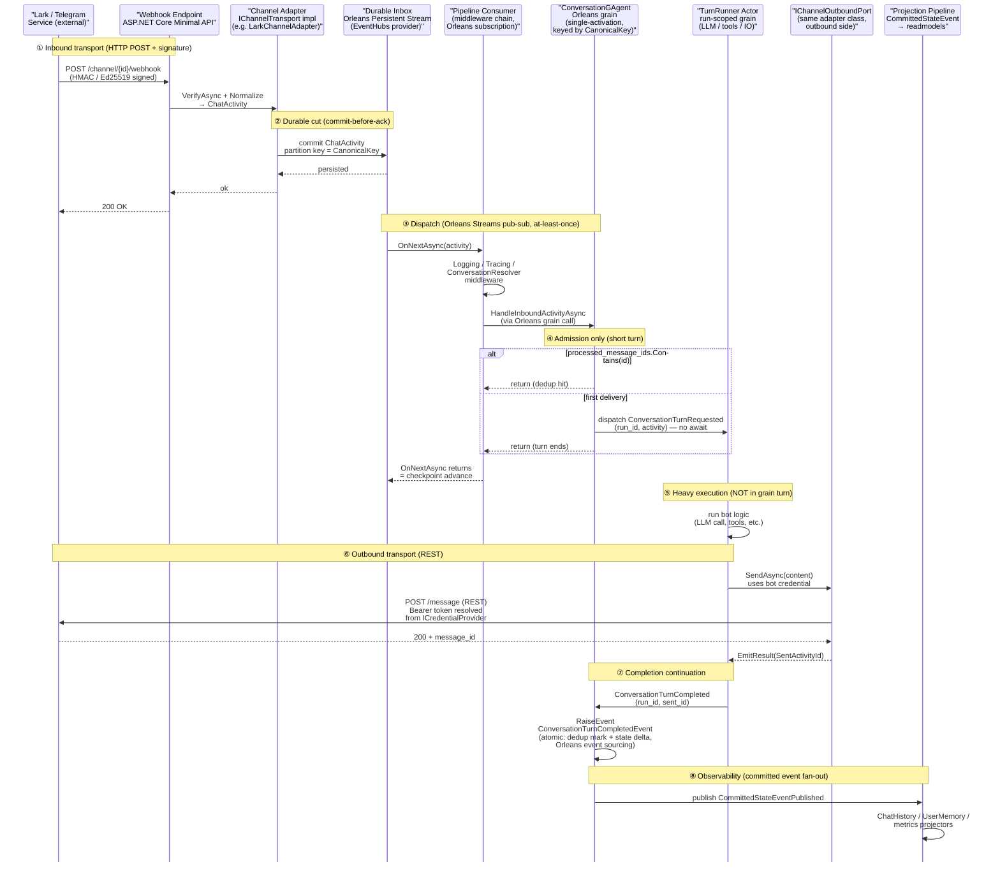

# Aevatar Chat — Multi-Channel Adapter Architecture

## 1. 背景与动机

`Aevatar.GAgents.ChannelRuntime` 目前承载两个 IM 渠道：Lark（主力）和 Telegram（shim 级）。基于当前产品规划，接入更多消息渠道（候选：Slack / Discord / 以及 gateway 类的 WeChat 个人 bot）是高概率的下一阶段目标。即便具体 channel 组合有变，**任何新 IM 接入都会面临相同的 transport / 消息形态异质性压力**——本 RFC 要解的就是这个抽象层问题，而不是绑死任何特定未来 channel。

这些渠道在两个维度上高度异质：

**Transport 模式**：

| 渠道 | Inbound | Outbound | 特征 |
|---|---|---|---|
| Lark | Webhook + signature | REST | 无状态 HTTP |
| Telegram | Webhook / Long-polling | REST | 双模式 |
| Slack | Events API / Socket Mode | REST | 双模式 |
| Discord | Gateway WebSocket + Interactions HTTP + REST | Gateway + REST | 持久连接 + 交互 3s window |
| WeChat iLink | Node.js gateway (wechaty) 长连接 | 同 gateway | 外挂进程 |

**消息形态**：Lark 卡片 / Telegram inline keyboard / Slack Block Kit / Discord Embed + Components / WeChat 富文本。能力也不对齐——Ephemeral / Thread / Modal / Action Buttons 各有支持/不支持。

**当前 ChannelRuntime 的状态**：57 个 `.cs` 源文件的 megamodule，职责糅合了 transport 适配、消息路由、agent 生命周期管理、调度执行、设备注册、agent 创作流。两个平台 adapter（`LarkPlatformAdapter` / `TelegramPlatformAdapter`）的扩展点已经显出不够用——`IPlatformAdapter` 当前只有 verification / parse / send text 三个 method，缺 lifecycle、inbound stream、update / delete、streaming、能力声明这些必要扩展点；Lark adapter 虽然能识别 `chat_type` 并按 `chat_id` 回发群聊消息，但 actor 层（`ChannelUserGAgent`）仍以 sender 为 grain key，群/线程/workspace 的会话彼此串联。

直接在这个大包里继续加 channel 会让边界进一步模糊。需要引入 **channel-agnostic 抽象层**，把业务逻辑和 channel 细节隔离，并把 ChannelRuntime 的多职责按概念拆成独立包。

## 2. 目标

1. **抽象层清晰**：新 channel = 实现一个接口 + 过一套 conformance 测试，即可进生产
2. **业务逻辑 channel-agnostic**：agent / conversation / 调度 / 创作 流程不感知 channel 具体形态，靠 capability 降级
3. **消除 megamodule**：ChannelRuntime 物理拆包，每个包单一职责
4. **修正会话身份**：`ConversationGAgent` 以 canonical key 存储会话，避免 sender-keyed 的串联 bug
5. **复用现有抽象**：projection / event-sourcing / streaming / hosted service 这些底层不重做

## 3. Non-goals

- **不引入 Microsoft.Bot.Builder 运行时依赖**。仅在 `ChatActivity` 字段命名上对齐 `Microsoft.Bot.Schema.Activity` 便于读者理解，**连 `Microsoft.Bot.Schema` 类型包也不 import**——保留运行时主权，避免 Microsoft DI 容器与 Orleans 生态的耦合压力。**代价需要知道**：自己维护 `ChatActivity` 及相关 DTO 的 schema、版本演进、序列化兼容。若未来出现 Azure Bot Service / Teams 等接入诉求，要么重新评估 types-only 中间态，要么在 adapter 层做一次翻译
- **不做 Adaptive Cards 或 universal card schema**。跨 channel 一致体验不是目标；"一致的 intent，native 的表达" 才是
- **不做跨 channel message mirroring**（Lark → Slack 消息同步这类 bridge 功能）
- **不在 channel 层做 multi-tenant 隔离**。租户/配额/scoping 是 NyxID 身份层的责任，channel 层仅处理 conversation 边界
- **不建 `IdentityResolver` 跨 channel 身份合并服务**。跨 channel 用户记忆合并由 `UserMemory` + NyxID 承担
- **不涵盖 WeChat 个人 bot**。WeChat 的 gateway 类 transport + 能力 gap 与其他 4 channel 差异过大，单独 RFC 承接，继承本 RFC 的 `IChannelTransport` + `IChannelOutboundPort` 契约
- **不涵盖非 IM 的 interaction modality**（Voice Presence / Console web chat / CLI / Direct HTTP API / DeviceRegistration sensor events）。详见 §12
- **不做业务行为变更**。全程零 behavior change，回归测试保证

## 4. 架构总览

### 4.1 主干流程（先看这张）

本 RFC 覆盖的主链路本质只有一条：**外部 IM service（Lark / Telegram / …）webhook 把事件推给 aevatar → aevatar 在 Orleans 内以 grain 处理完毕 → 通过同一 adapter 走 REST 推回 IM service**。下图把这条主干和各阶段采用的具体技术串起来，剩下 §5-§17 几乎全部是对这条主干边界情况的补全（3 秒 ack 窗口、group 热点、主动 proactive send、凭据生命周期、cutover drain 等）。



**各阶段的具体技术映射**：

| # | 阶段 | 技术 / 契约 | RFC 章节 |
|---|---|---|---|
| ① | Inbound HTTP + 签名 | ASP.NET Core Minimal API；Lark HMAC / Telegram secret token / Discord Ed25519 | §9.5 / §10 |
| ② | Durable cut | Orleans Persistent Stream（`Microsoft.Orleans.Streaming.EventHubs`），partition by `ConversationReference.CanonicalKey` | §9.5.2 / §9.5.6 |
| ③ | Dispatch | Orleans Streams pub-sub（`IAsyncStream<ChatActivity>.SubscribeAsync`），at-least-once | §5.8 |
| ④ | Admission + dedup | Orleans grain single-activation（per-conversation FIFO + mutual exclusion），`processed_message_ids` | §5.6.1 / §9.5.2 |
| ⑤ | Heavy work | run-scoped grain（不压在权威 grain 上），多 run 跨 silo 并行 | §5.6.1 |
| ⑥ | Outbound REST | `IChannelOutboundPort`（与 `IChannelTransport` 由同一 adapter 类实现）；凭据按 `credential_ref` 懒解析（`ICredentialProvider`） | §5.4 / §5.4.1 / §9.6 / §17.3 |
| ⑦ | Completion commit | Orleans event sourcing `RaiseEvent`；dedup mark + state delta 在同一 envelope atomic commit | §9.5.2 |
| ⑧ | Observability | 统一 Projection Pipeline（`CommittedStateEventPublished` → readmodels），符合 AGENTS.md "committed event 必须可观察" | §9.5.2 / §6 |

**主干之外的边界情况索引**（都在这条主干上长出来，不是平行系统）：

- Discord 3s interaction 窗口 → ①.5 pre-ack journal（§9.5.2.1）
- Group / thread 共享会话热点 → ⑤ runner 拆分（§5.6.1）
- 主动 proactive send（SkillRunner / workflow / admin broadcast）→ 从 ⑦ 之后反向走 actor-to-actor command 骨架（§5.4.2）
- Auth / credential 生命周期 → 贯穿 ①⑥（§9.6 / §17.3）
- v1→v2 cutover in-flight drain → ①②⑦（§11.1.1）

### 4.2 组件分层视图

```
┌────────────────────────────────────────────────────────────────────┐
│  业务逻辑 / Bot 实现 (channel-agnostic)                              │
│                                                                      │
│  IBot.OnActivityAsync(ITurnContext ctx)                             │
│      ↑                                                               │
│      │ ChatActivity + TurnContext (channel-aware)                   │
│      │                                                               │
│  ┌──────────────────────────────────────────────────────────────┐  │
│  │  ConversationGAgent (admission / dedup / completion)          │  │
│  │       ↓ dispatch                       ↑ completion command   │  │
│  │  TurnRunner run-scoped actor (LLM / tools / outbound)         │  │
│  │                                                                │  │
│  │  Middleware Pipeline (logging / tracing / resolver)           │  │
│  │                  ↑                                             │  │
│  │  Orleans Streams subscription (durable inbox consumer)        │  │
│  └──────────────────────────────────────────────────────────────┘  │
└────────────────────────────────────────────────────────────────────┘
                                                 ▲
                                 ┌───────────────┴──────────────┐
                                 │  Durable inbox (§9.5)         │
                                 │  Orleans Streams w/ persistent│
                                 │  provider (EventHubs default, │
                                 │  Kafka future / table dev)    │
                                 └───────────────▲──────────────┘
                                                 │ commit → then ack
                                                 │
┌────────────────────────────────────────────────┼───────────────────┐
│  IChannelTransport + IChannelOutboundPort + IMessageComposer        │
│  Lark / Telegram / Slack / Discord      intent → native payload     │
│                                                                      │
│  Inbound:  webhook/gateway → verify → commit to durable inbox → ack │
│  Outbound: ConversationReference + MessageContent + AuthContext →   │
│            native send                                               │
│  Capabilities: 声明可兑现/需降级/不支持                               │
└──────────────────────────────────────────────────────────────────────┘
```

**关键流向澄清**（和 §9.5 / §5.6.1 对齐）：adapter 的 inbound 路径是 `verify → commit to durable inbox → ack`；adapter 公共 surface 上**没有** `ChannelReader<T>` / `InboundStream` 契约（Codex v11 收窄，见 §5.4）；pipeline consumer 通过 Orleans Streams 订阅 durable inbox 消费。`ConversationGAgent` 只做权威顺序 + dedup + completion commit，**不在 grain turn 内跑 LLM / 外部 IO**——那些放在 run-scoped runner actor 里，防止 group 场景热点化。durability 由 durable inbox + `processed_message_ids` 两条 state 承担。

核心思想：**`ChatActivity` 是跨 channel 的统一消息表达，`IMessageComposer` 负责把 intent 翻译成各 channel 的 native payload，`ChannelCapabilities` 声明能力矩阵让业务层按能力降级**。

### 4.3 实施约束：跨边界类型 Proto 先行

本 RFC 的 C# record / interface 签名仅作**架构描述**，不是 implementation target。实施按 `AGENTS.md` 的强制约束：

> 所有序列化与反序列化操作统一使用 `Protobuf`，尤其是 `State`、领域事件、命令、回调载荷、快照、缓存载荷、跨 Actor/跨节点内部传输对象。新增状态对象、事件对象、持久化载荷时，**先定义 `.proto` 契约并生成类型，再接入实现**；禁止先写临时序列化结构、后补 `Protobuf`。

本 RFC 下列类型实施时必须先以 `.proto` 定义：

| Proto 归属 | 类型 |
|---|---|
| `agents/Aevatar.GAgents.Channel.Abstractions/protos/chat_activity.proto` | `ChatActivity` / `ConversationReference` / `ParticipantRef` / `MessageContent` / `AttachmentRef` / `AttachmentKind` (enum) / `ActionElement` / `CardBlock` / `MessageDisposition` / `ActivityType` / `ConversationScope` / `ChannelId` / `BotInstanceId` / `TransportMode` |
| `agents/Aevatar.GAgents.Channel.Abstractions/protos/channel_contracts.proto` | `EmitResult` / `ComposeCapability` / `ComposeContext` / `ChannelBotDescriptor` / `ChannelTransportBinding` / `ChannelCapabilities` / `StreamingSupport` / `AuthContext` / `PrincipalKind` / `StreamChunk` |
| `agents/Aevatar.GAgents.Channel.Abstractions/protos/schedule.proto` | `ScheduleState` / `ProjectionVerdict` |
| `agents/Aevatar.GAgents.Channel.Runtime/protos/conversation_events.proto` | `ConversationTurnCompletedEvent` / `ConversationContinueRequestedEvent` / `ConversationContinueRejectedEvent` / `ConversationContinueFailedEvent` / `ChannelBotRegistrationEntry` / `UserAgentCatalogEntry` / `DeviceRegistrationEntry`（含 `IsDeleted` flag 支持 tombstone retention）。详细 field schema 见 §4.3.1 |
| `agents/Aevatar.GAgents.Channel.Runtime/protos/session_store.proto` | `SessionState` / `LeaseToken`（见 §10.4。**注意 proto 映射**：`LeaseToken.Owner` 用 `bytes owner = 1;` 存 Guid 的 16 bytes；`LeaseToken.ExpiresAt` 用 `int64 expires_at_unix_ms = 2;` 不是 `google.protobuf.Timestamp`——avoid 时区歧义；`ScheduleState.ErrorCount` 用 `int32`） |
| `agents/Aevatar.GAgents.Channel.Runtime/protos/interaction_journal.proto` | `PreAckJournalEntry`（见 §9.5.2.1） |
| `agents/Aevatar.GAgents.Channel.Runtime/protos/payload_quarantine.proto` | `PlatformQuarantineEnvelope`（见 §9.6.1 breaker-open forensic path。注意：**quarantine envelope 只含 metadata + encrypted_blob_ref，不含明文 raw payload**；和 inbox 完全分离，不进 Projection Pipeline，属于 `AGENTS.md` 的 `artifact/export` 形态） |

**`ResolvedAuthContext` 不进 proto 清单**：§5.1b 的 `ResolvedAuthContext` 类型**仅在 adapter 进程内存中流转**，不跨 actor / 不跨节点 / 不持久化——是 non-serializable runtime-only 类型，不生成 proto（见 §5.1b 对"可序列化 `AuthContext` vs 不可序列化 `ResolvedAuthContext`"的区分）。

### 4.3.1 Proactive command events — field schemas

`ConversationContinueRequestedEvent` / `ConversationContinueRejectedEvent` / `ConversationContinueFailedEvent` 是 actor-to-actor proactive command 的 envelope payload (§5.4.2)，必须显式 proto field 契约（防止 proto/C# 漂移）：

```proto
// 入站 command：caller（SkillRunner / workflow / admin）发给 ConversationGAgent
message ConversationContinueRequestedEvent {
  string command_id        = 1;  // stable UUID（caller 生成，用于 dedup；同一逻辑操作重试 = 相同 id）
  string correlation_id    = 2;  // 追踪链路（SkillRunner schedule tick / workflow step / admin request id）
  string causation_id      = 3;  // 上一个 command id（可空）
  PrincipalKind kind       = 4;  // Bot | OnBehalfOfUser
  string principal_ref     = 5;  // 仅 kind=OnBehalfOfUser 非空；**opaque credential_ref，绝非 raw token**
  string on_behalf_of_user_id = 6;  // 仅 kind=OnBehalfOfUser 非空；用于 audit + conversation grain routing
  ConversationReference conversation = 7;
  MessageContent payload   = 8;
  int64 dispatched_at_unix_ms = 9;
}

// 出站（可观察）：grain turn 未执行到 outbound 就 reject（dedup / invalid target / credential 预检失败）
message ConversationContinueRejectedEvent {
  string command_id        = 1;  // 对齐 requested.command_id
  string correlation_id    = 2;
  string causation_id      = 3;
  RejectReason reason      = 4;  // DuplicateCommand | ConversationNotFound | CredentialRefInvalid | ...
  string reason_detail     = 5;  // sanitized summary（见 §9.6.1；禁含 raw token / vendor body）
  int64 rejected_at_unix_ms = 6;
}

enum RejectReason {
  REJECT_REASON_UNSPECIFIED         = 0;
  DUPLICATE_COMMAND                 = 1;
  CONVERSATION_NOT_FOUND            = 2;
  CREDENTIAL_REF_INVALID            = 3;
  CREDENTIAL_REVOKED_OR_EXPIRED     = 4;
  PRINCIPAL_NOT_AUTHORIZED          = 5;
}

// 出站（可观察）：grain turn 执行 outbound 时失败（adapter 拒绝 / 平台错误 / rate limit）
message ConversationContinueFailedEvent {
  string command_id        = 1;
  string correlation_id    = 2;
  string causation_id      = 3;
  FailureKind kind         = 4;  // TransientAdapterError | PermanentAdapterError | CredentialResolutionFailed | ...
  string error_code        = 5;  // EmitResult.ErrorCode
  string error_summary     = 6;  // sanitized
  // retry_policy 用 oneof 精确表达三态语义，避免 proto3 scalar default 0 引起的 null/0/>0 语义冲突
  // （Codex v9 HIGH：早期 "int64 retry_after_ms; 0 if not retryable" 在 proto3 不合法——
  //  default 0 既可能是 "立即可重试" 也可能是 "未设置"，消费者无法区分）
  oneof retry_policy {
    google.protobuf.Empty not_retryable = 7;  // permanent failure，caller MUST NOT 重试
    int64 retry_after_ms                = 8;  // transient failure；0 = 立即可重试，>0 = 等待毫秒
  }
  int64 failed_at_unix_ms  = 9;
}

enum FailureKind {
  FAILURE_KIND_UNSPECIFIED          = 0;
  TRANSIENT_ADAPTER_ERROR           = 1;  // 可重试（rate limit / 网络抖动）
  PERMANENT_ADAPTER_ERROR           = 2;  // 不可重试（content invalid / target deleted）
  CREDENTIAL_RESOLUTION_FAILED      = 3;  // dispatch 时 credential 还有效，grain turn 时撤销/过期
  PLATFORM_UNAVAILABLE              = 4;
}
```

**Rejected vs Failed 的区别**：`Rejected` = 没走到 outbound（grain 内 pre-check 拒绝）；`Failed` = 走到了 outbound 但失败（adapter 返回错误 / 平台拒）。两者都是 committed domain event，通过统一 `EventEnvelope<CommittedStateEventPublished>` 进入 Projection Pipeline，SkillRunner / workflow caller 订阅相应 readmodel 观察 outcome。

Adapter 特定的 native outbound payload（`LarkCardPayload` / `SlackBlockKitPayload` / `DiscordEmbedPayload`）**不需要** proto——它们只在 adapter 进程内作为 `IMessageComposer.Compose` 的返回对象存在，不跨节点、不持久化。

**Interface 不需要 proto**（proto 是数据契约不是服务契约）——`IChannelTransport` / `IChannelOutboundPort` / `IBot` / `IMessageComposer` / `ITurnContext` 直接以 C# 定义。

**Phase 0 前置**：proto 定义是 Phase 0（见 §13）的前置交付物，先于 C# 抽象层实现。

## 5. 核心接口设计

本节给出接口 surface，并解释**为什么是这个形状**。

**总纲**：任何新接口在提出之前，先检查是否与已有概念重合。如果只是改名，就复用；如果是真正的新抽象，就明确解释为什么已有的不够用。抽象层的每一条新接口都需要为自己的存在辩护——见 §6 对已有抽象的枚举。

### 5.1 `ChatActivity`

```csharp
namespace Aevatar.GAgents.Channel.Abstractions;

public record ChatActivity(
    string Id,                          // MUST be deterministic function of platform delivery key
                                        // (Lark event_id / TG update_id / Slack event_id /
                                        // Discord gateway seq+session or interaction.id).
                                        // Same inbound event retried by platform MUST produce same Id.
                                        // Violating this silently breaks durable dedup.
                                        //
                                        // Anti-patterns (adapter author MUST NOT do):
                                        //   Id = Guid.NewGuid()                      ← random per arrival
                                        //   Id = DateTime.UtcNow.Ticks.ToString()    ← arrival timestamp
                                        //   Id = request.Headers["X-Request-Id"]     ← gateway-generated,
                                        //                                              not platform-stable
                                        //   Id = incrementing sequence per adapter   ← breaks on restart
                                        // 平台重投同一事件时，以上写法都会产生不同 Id 穿透 dedup。
    ActivityType Type,                  // Message | Command | CardAction | Reaction | MembershipChange | Typing | AdapterLifecycle
    ChannelId ChannelId,                // Lark | Telegram | Slack | Discord
    BotInstanceId Bot,                  // which bot instance received it
    ConversationReference Conversation, // canonical conversation key
    ParticipantRef From,                // sender canonical id
    IReadOnlyList<ParticipantRef>? Mentions,
    DateTimeOffset Timestamp,
    MessageContent Content,             // Text + Attachments + Actions + Cards
    string? ReplyToActivityId,
    string? RawPayloadBlobRef           // 原始 payload 存储引用，逃生舱
);
```

**为什么字段命名对齐 BF**：未来如果要接入社区 BF adapter（例如 Teams），迁移/借鉴成本低。但我们**不 import 任何 `Microsoft.Bot.*` 包**。

**为什么没有 `ChannelData`**：早期草稿里有 `ChannelData : IReadOnlyDictionary<string, string>`，但 Slack event envelope / Discord interaction 带嵌套结构（user profile / guild member / team info），string→string 天然太窄；放宽到 `object` 又让调用方陷入动态类型。已有 `RawPayloadBlobRef` 作为 escape hatch（原始 payload 按需取），两套冗余的结构化索引反而让 adapter 作者"两边都想塞点东西"，抽象边界打糊。结论：**只留 `RawPayloadBlobRef`，不要 `ChannelData`**。

### 5.1b Supporting types

上面接口里出现的辅助类型：

```csharp
public record EmitResult(
    bool Success,
    string? SentActivityId,        // adapter 记住的 outbound activity id，
                                   // 用于后续 Update/Delete 定位（见 §5.4 关于 opaque token 的说明）
    ComposeCapability Capability,  // Exact / Degraded / Unsupported
    TimeSpan? RetryAfter,          // rate limit 回退建议（可空）
    string? ErrorCode,
    string? ErrorMessage
);

public enum ComposeCapability { Exact, Degraded, Unsupported }

public record ComposeContext(
    ConversationReference Conversation,
    ChannelCapabilities Capabilities,
    IReadOnlyDictionary<string, string>? Annotations   // per-call composer 注解，
                                                       // 例如 preferred surface (modal vs inline) 等
                                                       // 命名对齐 AGENTS.md bag 职责分类（Annotations / Headers / Items）
);

public record ParticipantRef(
    string CanonicalId,                          // MUST be derived from the platform's STABLE user id:
                                                 //   Lark      → open_id (not union_id / email / name)
                                                 //   Slack     → user_id (e.g. U01234ABCD, NOT @username alias)
                                                 //   Discord   → user_id (snowflake)
                                                 //   Telegram  → user.id (numeric, NOT @username handle)
                                                 //
                                                 // Anti-patterns (adapter author MUST NOT do):
                                                 //   CanonicalId = displayName / nickname   ← display 变，身份会串
                                                 //   CanonicalId = @username alias           ← Slack/TG username 可改
                                                 //   CanonicalId = phone / email             ← PII 且可变
                                                 //   CanonicalId = channel-join derived      ← 同人不同场景不同 id
                                                 //
                                                 // 业务层只通过 CanonicalId 寻址，不解析 channel-specific 结构
    string? DisplayName                          // UI 渲染用可选字段，可变，不用于寻址
    // 早期草稿有 ChannelSpecific : IReadOnlyDictionary<string, string>——被删。
    // 理由：业务层不应按 channel 分支解析 participant；channel-specific 字段如果业务需要，
    // 应当升为强类型 proto field（AGENTS.md 禁止通用 bag）；如果业务不需要，
    // 就是 dead data。两种情况都不保留。adapter 内部需要 platform-specific
    // 字段走 RawPayloadBlobRef（§5.1）按需取。
);

// 可序列化，可进 envelope / event store / projection（安全）
public record AuthContext(
    PrincipalKind Kind,           // Bot | OnBehalfOfUser
    string? UserCredentialRef,    // 仅 Kind=OnBehalfOfUser 时非空；opaque ref（secret manager vault key / credential_ref）。
                                  // **绝对不能是 raw token**——raw token 进 envelope 会随 event store / projection 落盘，
                                  // 违反 §9.6 "凭据本身不入 proto / projection"。真实 token 在 adapter 临发送时通过
                                  // ICredentialProvider.ResolveAsync(UserCredentialRef) 解析到 ResolvedAuthContext（见下）。
    string? OnBehalfOfUserId      // for audit + conversation grain routing：whose user identity this send is using
);

public enum PrincipalKind { Bot, OnBehalfOfUser }
// Bot kind 默认：adapter 使用 InitializeAsync 时注入的 bot credential（也是 credential_ref 解析来的，不是 raw token）

// 进程内 runtime-only 句柄（不跨 actor / 不入 envelope / 不落盘 / 不跨进程）
// 设计意图：把"可序列化 AuthContext（带 ref）"和"已解析 token bag"分成不同类型，
// **用多层实施约束共同守护**——RFC 不声称单靠类型系统就能做到严格 "stack-only"
// （async state machine 会把 local 变量 capture 到 heap；反射序列化 fallback 也绕不开），
// 实际保证靠下面列的 4 层约束组合：
public sealed class ResolvedAuthContext {
    public PrincipalKind Kind { get; }
    public string BotToken { get; }              // 从 credential_ref 解析后的 raw bot token
    public string? UserToken { get; }            // 仅 Kind=OnBehalfOfUser 时非空
    public string? OnBehalfOfUserId { get; }
    // 构造函数 `internal`——仅 ICredentialProvider 的实现可创建
    internal ResolvedAuthContext(...) { ... }
}

public interface ICredentialProvider {
    Task<ResolvedAuthContext> ResolveAsync(AuthContext ctx, CancellationToken ct);
    // 实现：按 ctx.Kind + ctx.UserCredentialRef 从 secret manager 取 raw token，组装 ResolvedAuthContext。
    // 失败（ref 无效 / 撤销 / 过期）抛 CredentialResolutionException——caller 需记录为
    // ConversationContinueRejectedEvent(CREDENTIAL_REF_INVALID) 或
    // ConversationContinueFailedEvent(CREDENTIAL_RESOLUTION_FAILED)（见 §4.3.1）。
}
```

**`ResolvedAuthContext` 的 "不泄露" 保证由 4 层实施约束共同守护（Codex v7 HIGH 修正）**：

| 层 | 约束 | 阻断的泄露路径 |
|---|---|---|
| **类型定义** | `internal` constructor；不实现 `[Serializable]` / `[DataContract]` / Protobuf contract；不声明 public serializer | 显式序列化 API 调用 |
| **Roslyn analyzer（§14.1 语义层）** | `ResolvedAuthContext` 参数不得出现在 Orleans grain 的 public method 签名；不得被 `RaiseEvent` / `IActorDispatchPort.DispatchAsync` 调用引用；不得被 `System.Text.Json.JsonSerializer.Serialize` / `XmlSerializer` 调用引用 | 反射序列化 fallback；async 跨 grain 泄露 |
| **runtime 约束** | adapter 实现中 `ResolvedAuthContext` 变量 MUST 在方法内创建 + 使用 + 随方法返回即 GC-eligible；禁止 `static` 字段 / `IMemoryCache` / instance field 保留 | 跨 request 内存驻留 |
| **RFC 文本约束** | "进程内 runtime-only" — 不承诺 "严格 stack-only"（async state machine heap allocation 事实存在）；但承诺 **不跨进程 / 不跨网络 / 不落盘 / 不入结构化 log** | 读者误以为"stack allocation guaranteed"的过强理解 |

**诚实承认**：`ResolvedAuthContext` 实例在 `await` 跨越时会被 C# compiler 捕获到 async state machine 的 heap-allocated object——这是 CLR 事实，不能靠 RFC 约定避免。但**实际威胁模型**的泄露面是 "对象离开 adapter 进程 / 落 durable store / 进 log stream"，前 3 层约束已经把这些堵死。debugger attach 和 memory dump 是另一层威胁，由 infra-level secrets management（secret manager 本身的 rotation + principle of least privilege）承担，不是本 RFC 抽象层的责任。

**为什么 `EmitResult` 要带 `SentActivityId`**：`UpdateAsync` / `DeleteAsync` / `StreamingHandle.CompleteAsync` 都需要**回指到具体发出的 message**。如果 adapter 发完消息不把平台 message id 回传，后续的 update 只能 best-effort。这是 RFC 早期版本的一个漏洞，明确写进契约。

**为什么 `RetryAfter` 是 `TimeSpan?`**：rate limit 触发时，adapter 应反馈"多久后重试"给上层的 RetryMiddleware（或 caller）。`null` 表示"没建议，立即可重试 / 不可恢复"——由 `ErrorCode` 区分。

**为什么 `AuthContext` 独立建模**：outbound 不一定是 reply。proactive send / admin broadcast / scheduled runner 没有 inbound turn，没有 sender 可推，必须显式传入使用哪个 bot identity / 哪个 user context——让 `ContinueConversationAsync` 的 auth 归属从"藏在 convention 里"变成 API surface 上显式的决策。`SendAsync` 在 `ITurnContext` 里调用时 adapter 可以从 `ctx.Activity.From` 隐式推 user-bound auth；proactive path 没有 turn 可推，只能显式。见 §5.2b 和 §5.4 的详细说明。

### 5.2 `ConversationReference` — 会话身份 canonical 化

```csharp
public record ConversationReference(
    ChannelId Channel,
    BotInstanceId Bot,
    string? Partition,        // Slack team_id / Discord guild_id / Lark tenant_key / null for single-partition
                              // 注意：这是查询维度，不是多租户隔离语义；
                              // 也和 CQRS partition / Orleans grain placement 概念无关，
                              // 仅用于 ops 场景按 workspace / guild / tenant 列 conversation
    ConversationScope Scope,  // DirectMessage | Group | Channel | Thread
    string CanonicalKey       // adapter-specific deterministic key，
                              // Partition 信息同时编进 CanonicalKey（grain id 唯一性所需）
);
```

Canonical key 规则：

| Channel | Scope | CanonicalKey 示例 |
|---|---|---|
| Lark DM | DirectMessage | `lark:dm:{open_id}` |
| Lark 群聊 | Group | `lark:group:{chat_id}` |
| Telegram 私聊 | DirectMessage | `tg:dm:{chat_id}` |
| Telegram 群/频道 | Group / Channel | `tg:group:{chat_id}` / `tg:channel:{chat_id}` |
| Slack DM | DirectMessage | `slack:{team}:im:{channel}` |
| Slack Channel | Channel | `slack:{team}:{channel}` |
| Slack Thread | Thread | `slack:{team}:{channel}:thread:{ts}` |
| Discord DM | DirectMessage | `discord:dm:{channel_id}` |
| Discord Guild Channel | Channel | `discord:{guild}:{channel}` |
| Discord Thread | Thread | `discord:{guild}:{channel}:thread:{thread_id}` |

`ConversationGAgent` 以 `CanonicalKey` 作为 Orleans grain primary key 持久化。

**为什么不用 sender 做 key（现状）**：今天 `ChannelUserGAgent` 以 sender id 为 key，对 Lark 1-1 能跑。一旦迁到 group / Slack thread / Discord guild，多条会话的 state 会串到同一个 actor。这是**正确性 bug**，不是优化空间。

**为什么 `Partition` 要做独立字段而不是只埋进 CanonicalKey 字符串**：CanonicalKey 解决**唯一性**（grain id 不重），`Partition` 字段解决**查询维度**（ops 场景：列出某个 Slack team 下所有 active conversation 做清理 / 整体通知 / 停用）。字符串前缀匹配不是 first-class 索引维度。**隔离语义不靠它**——那是 NyxID 身份层的事；但查询能力需要它，不能因为怕被误解成 tenancy 就砍查询。

### 5.2b 状态所有权：user grain vs conversation grain

当前 `ChannelUserGAgent` 同时持有**用户绑定态**（`nyxid_user_id` / `nyxid_access_token`，用于 outbound 发消息时 fallback 拿 token）和**会话态**（`pending_sessions` / `processed_message_ids`）。新架构下这两类状态必须分离：

| 状态 | 新 grain | key | 生命周期 |
|---|---|---|---|
| 用户绑定（nyxid token、preferences） | `ChannelUserBindingGAgent` | `{bot_instance_id}:{channel}:{sender_canonical_id}` | 跟用户 × bot instance 一致，可跨会话复用 |
| 会话态（pending、dedup、history） | `ConversationGAgent` | `ConversationReference.CanonicalKey` | 跟会话一致，可多个每用户 |

**为什么 binding key 带 `bot_instance_id`**：同一真人在不同 bot instance 下的绑定可能不同（例如同一 Lark 用户在 tenant A 绑 nyxid token X、tenant B 绑 token Y）。不带 `bot_instance_id` 会让两份绑定串到一个 grain，退化成另一种 sender-keyed bug。

**outbound 两条路径，auth 来源不同**：

- **Reply path（`ITurnContext.SendAsync` / `ReplyAsync`）** — 有 inbound turn，adapter 从 `ctx.Activity.From` sender canonical id 隐式 resolve 到 `ChannelUserBindingGAgent` 拿 user token（如果业务需要 user-bound send）；否则用 bot token（来自 adapter `InitializeAsync` 注入的 `ChannelTransportBinding.credential_ref` 解析结果）。业务层无感，不需要显式传 principal。
- **Proactive path（`IChannelOutboundPort.ContinueConversationAsync`）** — 没有 turn，没有 sender 可推，**caller 必须显式传 `AuthContext`**（见 §5.1b）决定用 bot 身份还是某个具体 user 身份发。`AuthContext` 中 `UserCredentialRef` **只是 opaque ref**（例如 `"lark-user:{open_id}"` 或 vault key），真实 token 在 adapter 临发送时通过 `ICredentialProvider.ResolveAsync(ref)` 解析。常见调用者：`SkillRunnerGAgent`（定时推送给 conversation owner → `AuthContext(OnBehalfOfUser, UserCredentialRef=owner credential ref, OnBehalfOfUserId=owner open_id)`）/ admin broadcast（→ `AuthContext(Bot, null, null)`）/ workflow trigger（→ `AuthContext(OnBehalfOfUser, initiator ref, initiator id)`）。**重要**：这些 actor-to-actor 的 proactive command 必须走命令骨架 `Normalize → Resolve → Build Envelope → Dispatch` 到 `ConversationGAgent` 而不是直接调 `IChannelOutboundPort`——见 §5.4.2。

无论哪条路径，**token 不复制进 conversation grain**——始终走 `ChannelUserBindingGAgent` 中心化管理。conversation grain 自己不持 token。

**Cache invalidation 约束**：`ConversationGAgent` 不得缓存 binding snapshot（token / user preferences）。每次 outbound 需要 user-bound token 时，通过 `ChannelUserBindingGAgent` grain call 实时解析。binding 侧 token 轮换 / unbinding 发生后立即对 conversation 侧可见——没有 stale 读路径。Orleans grain call 本身便宜（in-silo routing 通常亚毫秒），binding grain state 内联带 token，不构成热点问题。

**这不是"零 behavior change"**——之前的 RFC 措辞过于乐观。真正的 behavior 变化是：从单 grain 持两类 state 改成两 grain 职责分明。aevatar 当前无生产用户，硬切换无数据风险；但语义迁移本身必须显式承认，不能糖衣包装成"只是改个 grain key"。

### 5.3 `MessageContent` — 表达 intent，不表达 payload

```csharp
public record MessageContent(
    string? Text,
    IReadOnlyList<AttachmentRef>? Attachments,
    IReadOnlyList<ActionElement>? Actions,         // buttons / select / form
    IReadOnlyList<CardBlock>? Cards,               // rich layout intent
    MessageDisposition Disposition                 // Normal | Ephemeral | Silent | Pinned
);
```

**核心原则**：`MessageContent` 描述 "要表达什么"，不描述 "长什么样"。`IMessageComposer` 把它翻译成 channel-native 的具体 payload。

**为什么不做 universal card schema（Adaptive Cards 路线）**：universal schema 是 Level-3 抽象——为了一致性牺牲 native 表达力。Slack Block Kit 的嵌套 / Discord Embed 的字段限制 / Lark 卡片的交互模型各自有自己最自然的表达方式，强行统一会得到"处处一致但处处不好用"的结果。我们选 Level-2：intent 层统一，表达层 native，能力缺失就显式降级。

### 5.4 `IChannelTransport` + `IChannelOutboundPort` + `IMessageComposer`

**为什么不是一个 `IChannelAdapter`**：Codex v3 + 交叉对齐 `AGENTS.md` 的 `Runtime 与 Dispatch 必须分责` 强制原则——一个接口同时持有 lifecycle（Runtime） + inbound stream（Runtime 观察） + outbound send/update/delete（Dispatch） + capabilities 是典型"全能接口 anti-pattern"。拆分后上层 `IBot` / `SkillRunnerGAgent` 等依赖**投递契约** `IChannelOutboundPort`，不感知 transport 实现；pipeline 消费 inbound 依赖 `IChannelTransport`，不触达 outbound 路径——投递载体可替换（webhook / gateway / future MQ-based），不污染应用语义。

**Runtime 侧**（lifecycle only，不持 inbound stream 契约 — Codex v11 HIGH 收窄）：

```csharp
public interface IChannelTransport {
    ChannelId Channel { get; }
    TransportMode TransportMode { get; }    // Webhook | Gateway | LongPolling | Hybrid
    ChannelCapabilities Capabilities { get; }

    Task InitializeAsync(ChannelTransportBinding binding, CancellationToken ct);
    Task StartReceivingAsync(CancellationToken ct);
    Task StopReceivingAsync(CancellationToken ct);
}
```

**早期草稿（v10 之前）把 `ChannelReader<ChatActivity> InboundStream { get; }` 放在 `IChannelTransport` 上**——Codex v11 HIGH 抓出：这和 §9.5.2 "durable inbox 是唯一权威 ingress，`ChannelReader` 只是 consumer 内部 working buffer" 的定义直接冲突。公共契约同时暴露 "transport 层职责"（lifecycle + inbound 观察）和 "runtime 消费缓冲"（ChannelReader），边界不干净。**修正**：

- `IChannelTransport` 只负责 lifecycle + `Capabilities` 声明；adapter 实现在 `StartReceivingAsync` 之后负责把 inbound 事件**直接 commit 到 durable inbox**（Orleans persistent stream，见 §9.5.2），不再 publish 给 adapter 公共 surface 上的 `ChannelReader`
- 真正的 inbound 消费是 **pipeline consumer 订阅 durable inbox stream**（`IAsyncStream<ChatActivity>.SubscribeAsync`）；adapter 和 pipeline 之间**没有**跨抽象边界的 queue 契约
- `ChannelReader<ChatActivity>` 沦为 **pipeline consumer 内部实现细节**（`OnNextAsync` 入 bounded buffer → bot turn dispatcher 从 buffer 消费），**不出现在任何公共 interface**

这样 "transport 层" 和 "runtime 消费层" 的边界一刀切干净——transport 只管"收 + commit durable"，runtime 只管"订阅 durable + 消费"。

**Dispatch 侧**（outbound 投递）：

```csharp
public interface IChannelOutboundPort {
    ChannelId Channel { get; }
    ChannelCapabilities Capabilities { get; }    // 透传便于 composer / caller 查能力

    // 当前 turn 内回复——通常由 ITurnContext.SendAsync/ReplyAsync 代理调用，
    // 业务层不直接触达 IChannelOutboundPort（见 §5.6 ITurnContext）。
    // 直接调此方法默认用 adapter-init 注入的 bot credential（见 §5.4.1 auth 契约）。
    Task<EmitResult> SendAsync(ConversationReference to, MessageContent content, CancellationToken ct);

    // 修改/删除已发消息。activityId 是 adapter 自己发出时返回的 EmitResult.SentActivityId，
    // 是 opaque token（adapter 内部 encode，业务层不解析），
    // 例如 Slack 内部形态 "slack:{team}:{channel}:{ts}"，Discord "discord:{channel_id}:{message_id}"。
    Task<EmitResult> UpdateAsync(ConversationReference to, string activityId, MessageContent content, CancellationToken ct);
    Task DeleteAsync(ConversationReference to, string activityId, CancellationToken ct);

    // 从**没有 turn context** 的地方主动发起会话（scheduled runner / workflow
    // trigger / admin broadcast）。adapter 内部可能走不同 API path
    // （Slack 主动发 DM 需要 bot_token scope；Discord 需要已有 DM channel 或 guild 权限）。
    //
    // auth MUST be explicit: proactive send 无 turn context 可推 principal，
    // caller 必须显式决策用 bot identity 还是某个 user identity 发。见 §5.1b AuthContext。
    //
    // 注意：作为 actor-to-actor proactive command（SkillRunnerGAgent → ConversationGAgent
    // → IChannelOutboundPort），调用链必须遵循 AGENTS.md 命令骨架；见 §5.4.2。
    Task<EmitResult> ContinueConversationAsync(
        ConversationReference @ref,
        MessageContent content,
        AuthContext auth,
        CancellationToken ct);
}
```

**实现类同时 implement 两个 interface**（单一类，例如 `LarkChannelAdapter : IChannelTransport, IChannelOutboundPort`）：DI 容器把 `IChannelTransport` 和 `IChannelOutboundPort` **注册到同一 instance**。上层依赖各自的契约，实现类内部共享 init/auth/capabilities 状态。

**为什么不允许"独立两个类实现"**（Codex v5 HIGH）：init state（credentials from `ChannelTransportBinding`）、capabilities 声明、lifecycle 状态都需要在 transport side 和 outbound side 之间共享：
- `IChannelTransport.InitializeAsync` 注入的 bot credential 必须被 `IChannelOutboundPort.SendAsync` 使用（§5.4.1 auth 契约依赖此）
- `Capabilities` 在两个 interface 上都暴露——必须是同一对象，防止 drift
- Lifecycle ordering（Start 后才能 Send）需要共享 state 判断

Conformance Suite 的泛型约束 `where TAdapter : IChannelTransport, IChannelOutboundPort`（§8.1）直接 encodes "单类" 假设；双类方案过不了 suite。"interface 拆分" 的收益 captured 在**上层依赖方向**（`IBot` 依赖 `IChannelOutboundPort` 不依赖 transport / pipeline 依赖 `IChannelTransport` 不依赖 outbound），而不是实现类也拆。

**Composer**（payload 翻译，独立于 transport 和 outbound 路径）：

```csharp
public interface IMessageComposer {
    ChannelId Channel { get; }
    object Compose(MessageContent intent, ComposeContext ctx);
    ComposeCapability Evaluate(MessageContent intent, ComposeContext ctx);   // ctx 一并传，因为某些 capability 依赖 interaction surface
}
```

**为什么两个接口分开（而不是把 composer 合进 adapter）**：
- Slack 的 Events API（HTTP）和 Socket Mode（WebSocket）共用同一套 Block Kit payload 翻译 → 同一 `SlackMessageComposer` 被两个 transport 子类复用
- Adapter 的 transport 与 composer 的 payload 翻译变化频率不同：transport 稳定后 composer 还会随平台新原语（Slack 新 block 类型、Discord 新 component）演进
- Composer 单测不需要启 adapter fixture（见 §8.2）

但要承认：**Telegram adapter 今天的 payload 就是 text + reply_to，拆 composer 是为未来不是为当下**。如果后续发现 Telegram 始终没有复杂 payload 需求，可以把 Telegram adapter 的 composer 合回去，只保留 Lark / Slack / Discord 的拆分。

**为什么 `activityId` 是 opaque string 而不是结构化 `ActivityReference`**：保持接口窄。不同 channel 需要的组件数不同（Lark 只需 message_id；Slack 需 channel+ts；Discord 需 channel_id+message_id）。封在 adapter 内部编解码，业务层拿到 `SentActivityId` 只负责回传给同一 adapter 的 Update/Delete，不解析结构——防止业务层开始按平台写分支。

**为什么 adapter 和 pipeline 之间直接用 durable inbox（不插 `ChannelReader<T>`）**：Codex v11 HIGH 收窄后（见本节前面"早期草稿 v10 之前"的说明），adapter 的 inbound 路径是 "verify → commit Orleans persistent stream → ack"，pipeline consumer 通过 `IAsyncStream<ChatActivity>.SubscribeAsync` 订阅。诚实说明保证来源：
- **durable cut point 在 adapter 的 webhook handler**：Lark / Slack / Telegram 的 webhook 必须"同步 commit 到 durable inbox → 200"，而不是"收到就 200 + 异步 persist"（否则 ack 早于 durable 会丢事件）
- **durable replay 由 Orleans Streams persistent provider 提供**（EventHubs / Kafka，§9.5.6），`Channel<T>` 即便用也只是 pipeline consumer 内部的背压 buffer，不承载 durability
- 去重两段式保留：endpoint 层 TTL（防重放攻击）+ grain state 层 durable dedup（防漏处理）——见 §11 现状

这些 durable / exactly-once 的保证来自 **durable inbox（Orleans persistent stream）+ grain state**，不来自任何内存 queue。

**为什么 `ContinueConversationAsync` 不合并进 `SendAsync`**：两者语义不同——`SendAsync` 隐含"有 inbound turn context 拿到 token / signature 等"；`ContinueConversationAsync` 是 cold-start 主动推送，adapter 内部可能要走不同 API path（Slack 主动 DM 要求 bot token 有 scope；Discord 要先 create DM channel）。强行合并会让 caller 不清楚该不该带 turn context。

**为什么 `AuthContext` 只在 `ContinueConversationAsync` 签名里显式**：`SendAsync` 在 `ITurnContext` 里调用时 adapter 可以从 `ctx.Activity.From` 隐式推导 user-bound auth（§5.2b reply path）；`ContinueConversationAsync` 没有 turn 可推，**必须** caller 显式决策 "用 bot identity 还是某个 user identity 发"。这是同一个架构决策的两面——auth principal 在 reply path 可推、proactive path 不可推，API 分开是诚实的反映。Codex review 抓出这个契约漏洞——原 RFC 没有 `AuthContext` 参数导致 proactive path 的 auth 归属悬空（谁的 token？），会在实现时静默地"按惯例拿某个 token"，潜在用错身份发消息。

### 5.4.1 outbound auth 契约（硬约束）

`SendAsync` / `UpdateAsync` / `DeleteAsync` 是 `IChannelOutboundPort` 公开 surface，但签名不带 `AuthContext`——业务层绕过 `ITurnContext` 直接调时 auth 从哪来？Codex v3 抓出这个 gap（HIGH #4 PARTIAL）。硬契约：

- 这三个方法**默认使用 adapter-init 时注入的 bot credential**（来自 `ChannelTransportBinding.credential_ref` 解析的 bot token），这是 "bot says X" 语义，不是 user-bound send
- **user-bound auth 必须经 `ITurnContext`**（adapter 内部从 `ctx.Activity.From` resolve 到 `ChannelUserBindingGAgent` 拿 user token，然后用 user token 调 adapter 的私有 API path，不经过这三个公开方法）
- **proactive user-bound send 必须经 `ContinueConversationAsync(ref, content, AuthContext(Kind: OnBehalfOfUser, UserCredentialRef: "<vault ref>", OnBehalfOfUserId: "<user id>"), ct)`**——注意 `AuthContext` 只持 credential_ref，adapter 内部自行调 `ICredentialProvider.ResolveAsync` 解析为 `ResolvedAuthContext`；caller 永远不直接持 raw token

**Conformance Suite §8.3 `Send_BypassingTurnContext_UsesBotCredentialNotUser()` 测试这个契约**——业务层误用"直接调 `IChannelOutboundPort.SendAsync` 用 user 身份发"会在 CI 里立即 fail。

### 5.4.2 actor-to-actor proactive path 走命令骨架

`AGENTS.md` 强制约束：`标准命令生命周期应收敛为 Normalize -> Resolve Target -> Build Context -> Build Envelope -> Dispatch -> Receipt -> Observe`。

- **`ITurnContext.SendAsync` / `ReplyAsync` / `UpdateAsync` / `DeleteAsync`** 是 bot turn 内对**外部平台**的直接 side-effect（actor → external SDK），不是 actor-to-actor command；**不走** aevatar 命令骨架
- **`IChannelOutboundPort.ContinueConversationAsync`** 本身是 adapter 公开的投递方法，但**调用方**（如 `SkillRunnerGAgent`、workflow trigger、admin broadcast endpoint）向 `ConversationGAgent` 发起 "please continue / please relay 这条消息" 是 **actor-to-actor proactive command**——这部分**必须**走命令骨架：

  ```
  SkillRunnerGAgent turn:
    Normalize        : 输入归一化 (target canonical_key + message intent + auth_context with credential_ref)
    Resolve Target   : actorId = ConversationGAgent.BuildActorId(ConversationReference.CanonicalKey)
    Build Context    : 拿 ScheduleState / UserAgentCatalogEntry 等 actor-owned fact
    Build Envelope   : EventEnvelope<ConversationContinueRequestedEvent> 带必选字段:
                         - command_id       (stable UUID，caller 生成用于 dedup)
                         - correlation_id   (追踪 SkillRunner schedule tick / workflow step / admin request)
                         - causation_id     (上一个 command id，如果有)
                         - principal_ref    (AuthContext.UserCredentialRef 或 null 表示 bot)
                         - on_behalf_of     (AuthContext.OnBehalfOfUserId 如果适用)
                         - payload          (MessageContent intent + ConversationReference)
                       envelope **不带 raw token**——只带 principal_ref（见 §5.1b AuthContext 硬约束）
    Dispatch         : IActorDispatchPort.DispatchAsync(actorId, envelope, ct)
                       （aevatar 现有 API：src/Aevatar.Foundation.Abstractions/IActorDispatchPort.cs）
    Receipt          : accepted + command_id（ACK 诚实：仅承诺 accepted for dispatch，不承诺 committed）
    Observe          : committed state 走 projection 主链（ConversationTurnCompletedEvent 带 causation_id=command_id
                       见 §9.5.2）。SkillRunner 如需观察 outcome 订阅 projection 读取
  ```

  `ConversationGAgent` 消费这个 envelope：
  1. **Dedup check**：`command_id ∈ processed_command_ids` ? → RaiseEvent `ConversationContinueRejectedEvent(REJECT_REASON=DUPLICATE_COMMAND)` + return（不再处理）
  2. **Target check**：如果 conversation 不存在 / 已软删 → RaiseEvent `ConversationContinueRejectedEvent(CONVERSATION_NOT_FOUND)` + return
  3. **Dispatch outbound**：调 `IChannelOutboundPort.ContinueConversationAsync(ref, content, auth, ct)` 把**可序列化的 `AuthContext`**（带 credential_ref，不带 raw token）透传到 adapter；adapter 内部调 `ICredentialProvider.ResolveAsync(auth, ct)` 解析为 `ResolvedAuthContext`（含 raw token、进程内 runtime-only 句柄，**不跨进程 / 不跨网络 / 不落盘 / 不入结构化 log**，保证细节见 §5.1b 4 层约束）；`ResolvedAuthContext` **不回传 grain / 不落 envelope / 不走 event store**
  4. **Outbound 结果分发**（Codex v6 MED 要求）：
     - 成功 → RaiseEvent `ConversationTurnCompletedEvent { StateDelta, CausationCommandId = command_id, ... }` + 把 command_id 写入 `processed_command_ids`
     - `ICredentialProvider.ResolveAsync` 抛 `CredentialResolutionException`（dispatch 到 grain turn 之间凭据已撤销/过期）→ RaiseEvent `ConversationContinueFailedEvent(kind=CREDENTIAL_RESOLUTION_FAILED, retry_policy=not_retryable{})` + command_id 写入 `processed_command_ids`（不重试——凭据失效是 permanent state，需要 SkillRunner / workflow 观察该事件、re-auth 或 fail schedule）
     - adapter 返回 `EmitResult.Success=false` with `RetryAfter > 0`（transient，如 rate limit）→ RaiseEvent `ConversationContinueFailedEvent(kind=TRANSIENT_ADAPTER_ERROR, retry_policy=retry_after_ms:<N>)` + 不 mark command_id processed（允许 caller 重新 dispatch 同一 command_id 等待 retry 窗口）
     - adapter 返回 `EmitResult.Success=false` with permanent error（content invalid / target deleted）→ RaiseEvent `ConversationContinueFailedEvent(kind=PERMANENT_ADAPTER_ERROR, retry_policy=not_retryable{})` + mark command_id processed
     - **硬契约**：所有 permanent failure path（credential revocation / adapter permanent error / 其他 not-retryable 情形）MUST 显式设置 `retry_policy=not_retryable{}`；禁止发出 `RetryPolicyCase=None` 的 `ConversationContinueFailedEvent`——下游 caller 按 oneof 判断重试策略时，`None` 会让 "permanent 失败" 和 "emitter 漏填/bug" 无法区分，变成 silent retry bug。Conformance §8.3 `ProactiveCommand_PermanentFailure_SetsNotRetryable` 验证
  5. 所有 Raised events 都通过 `EventEnvelope<CommittedStateEventPublished>` 进入 Projection 主链（§9.5.2）；SkillRunner / workflow / admin broadcast 订阅相应 readmodel 观察 outcome（无通用 request-reply，§5.7 middleware 规则）

  调用方不直接调 `IChannelOutboundPort`，也不直接调 `ConversationGAgent` 的内部方法——全程经 envelope dispatch。
- **禁止**：`SkillRunnerGAgent` 直接调 `IChannelOutboundPort.ContinueConversationAsync`（跳过 `ConversationGAgent`），否则 `processed_message_ids` / `processed_command_ids` dedup + `ChatHistory` 集成 + observability 全部漏过
- **Dedup / retry 规则**：
  - **command_id 必须 stable**（caller 同一逻辑操作的重试必须用相同 command_id），否则 dedup 穿透
  - **SkillRunnerGAgent schedule tick** 生成 command_id = `hash(skill_runner_id, scheduled_run_at)`——同一次 tick 的多次 dispatch 尝试（进程重启 / 网络重试）dedup 正确
  - **Workflow trigger** 生成 command_id = `hash(workflow_run_id, step_id, branch)`
  - **Admin broadcast** 生成 command_id = admin request id
  - Conformance test `§8.3 ActorToActorCommand_DedupByStableCommandId()` 验证

**Discord 3s interaction window 不放在 composer**：这是 **transport contract**（收到 interaction 3 秒内 HTTP 200，否则 Discord 重投或标为 failed）。由 `DiscordChannelAdapter` 的 HTTP handler 走 §9.5.2.1 pre-ack journal：verify → 轻量 journal commit → 立即 200 + defer → 再 commit 到 durable inbox。真正的 response 后续通过 interaction token 走 follow-up 发出。composer 只负责最终 payload 的 Block Kit / Embed。详见 §10.4。

### 5.4.3 Optional plugin adapters（typing / reactions / mention normalization）

核心 `IChannelTransport` + `IChannelOutboundPort` 保持窄。**UX 级跨切能力**（typing indicator / ack reaction / mention 规范化）以**独立 opt-in 接口**形式提供，channel 可选择性 implement——参照 OpenClaw 7-channel 生产经验（`src/channels/typing.ts` / `ack-reactions.ts` / `plugins/group-mentions.ts`）。

**为什么不放进核心接口**：不是所有 channel 都支持（iMessage 没 typing indicator / Telegram 没 ephemeral / 部分 channel 无 reaction）。强塞进 `IChannelOutboundPort` 会让半数 channel 被迫 no-op 实现，且能力矩阵（§5.5）和接口实现关系割裂。opt-in 接口让 "支持 = 实现" 成为 1:1 不变量。

```csharp
// Typing indicator（可选）
public interface IChannelTypingAdapter {
    // 开始打字指示——返回后 adapter 内部负责 keepalive（平台 typing 3-8s 自动停）
    // 和 TTL 兜底（硬上限 60s 自动停，防 bot 卡死时 typing 永远亮着）
    // 幂等：同一 conversation 已在 typing 则 no-op
    Task StartTypingAsync(ConversationReference to, CancellationToken ct);

    // 停止打字指示。turn 结束 / AppendAsync 完成 / exception 都必须 call
    // 幂等：未 typing 也安全 call
    Task StopTypingAsync(ConversationReference to, CancellationToken ct);
}

// Ack reactions（可选）——bot 收到 inbound 后回发 ✓ / ✔︎ emoji 做进度反馈
public interface IChannelReactionAdapter {
    Task<EmitResult> SendReactionAsync(
        ConversationReference to,
        string activityId,
        string reaction,                         // Unicode emoji 或 channel-specific code（Slack ":white_check_mark:"）
        CancellationToken ct);

    Task<EmitResult> RemoveReactionAsync(
        ConversationReference to,
        string activityId,
        string reaction,
        CancellationToken ct);
}

// Mention 规范化（可选）——inbound 方向把 channel-specific mention 语法剥离
// 成 canonical form，outbound 方向把 ParticipantRef 渲染成 channel-native mention
public interface IChannelMentionAdapter {
    // 从 inbound raw text 里剥离指向本 bot 的 @mention 语法，得到业务层应看到的纯净 text。
    // 识别出的 mention 参与者已 populate 到 ChatActivity.Mentions。
    // 例："<@U012BOT> help me" → "help me"（Slack），"@aevatar_bot help" → "help"（TG）
    string StripMentions(string rawText, BotInstanceId botId);

    // outbound 方向：在 composer 需要渲染 @某人 时，生成 channel-native mention 字符串
    // 例：Lark → "<at user_id=\"open_id_xxx\"></at>"，Slack → "<@U0123>"，Discord → "<@123456789>"
    string FormatMention(ParticipantRef participant, ConversationReference context);
}
```

**能力声明契约（不变量）**：adapter 实现类 `is IChannelTypingAdapter` ⟺ `Capabilities.SupportsTyping == true`。runtime 查能力时：

```csharp
// middleware / bot 层使用示例
if (adapter is IChannelTypingAdapter typingAdapter
    && adapter.Capabilities.SupportsTyping)
{
    await typingAdapter.StartTypingAsync(conv, ct);
    // ... do work ...
    await typingAdapter.StopTypingAsync(conv, ct);
}
```

`is` check + capability bool 双重验证防止接口实现 / 能力声明漂移（implementer 加了接口忘了更 capability，或反之）。Conformance Suite §8.1 `Capabilities_ImplementedInterfaces_AreConsistent()` 硬 assertion。

**不做的事**：
- 不把这些接口塞进 `IChannelOutboundPort` 强制所有 adapter 实现（OpenClaw 的教训——半数 channel 被迫 no-op）
- 不做"自动 fallback"魔法：如果 adapter 不支持 typing，bot 层显式知道（capability false）而不是假装发了；progressive feedback 的降级策略由 bot 层决定（发不发 ack reaction 替代 typing 是业务决策）
- 不把 mention 规范化藏进 middleware：这是 adapter 的职责（adapter 最懂自己的 mention 语法），middleware 不应做 channel-specific 字符串处理

**为什么 Proto 覆盖**：这些接口本身是 C# 契约，不需要 proto（proto 是数据契约）。接口参数里的 `ConversationReference` / `ParticipantRef` 已经在 §4.3 proto 列表里。`IChannelMentionAdapter.StripMentions` 返回 string，不引入新 proto 类型。

### 5.5 `ChannelCapabilities` — 能力矩阵

| Capability | Lark | Telegram | Slack | Discord |
|---|---|---|---|---|
| SupportsEphemeral | ❌ | ❌ | ✅ | ✅ (interaction flag) |
| SupportsEdit | ✅ | ✅ | ✅ | ✅ |
| SupportsDelete | ✅ | ✅ | ✅ | ✅ |
| SupportsThread | ✅ (话题) | ❌ | ✅ | ✅ |
| **Streaming** | **Native** | **EditLoopRateLimited** | **EditLoopRateLimited** | **EditLoopRateLimited** |
| SupportsFiles | ✅ | ✅ | ✅ | ✅ |
| MaxMessageLength | 30k | 4096 | 40k (blocks) | 2000 |
| SupportsActionButtons | ✅ | ✅ (inline keyboard) | ✅ (block actions) | ✅ (components) |
| SupportsConfirmDialog | ✅ | ❌ | ✅ | ⚠️ modal 替代 |
| SupportsModal | ❌ | ❌ | ✅ (views) | ✅ (modal) |
| SupportsMention | ✅ | ✅ | ✅ | ✅ |
| **SupportsTyping** | ✅ (p2p.command) | ✅ (sendChatAction) | ✅ (typing event) | ✅ (POST /channels/*/typing) |
| **SupportsReactions** | ✅ | ✅ | ✅ | ✅ |
| RecommendedStreamDebounceMs | 200 | 3000 | 1500 | 1500 |
| **TypingKeepaliveIntervalMs** | 5000 | 4000 | 3000 | 8000 |
| **TypingTtlMs** | 60000 | 60000 | 60000 | 60000 |

```csharp
public enum StreamingSupport {
    None,                    // 不能 stream，只能发最终 message
    EditLoopRateLimited,     // 靠 edit 循环（editMessageText / chat.update / interaction followup），受平台 rate limit 约束
    Native                   // 原生 stream patch（Lark 卡片 stream 接口），低延迟
}
```

`IMessageComposer.Evaluate(intent, ctx)` 返回 `Exact` / `Degraded` / `Unsupported`。`ctx` 里带 `ConversationReference.Scope` + 可选 `Annotations`，因为某些 capability 依赖 runtime 条件（Slack `postEphemeral` 需 token scope `chat:write` + bot 是 channel member + target user 是 channel member；Discord ephemeral 仅对 interaction response 有效）——静态布尔表是起点，真正的降级判断发生在 composer 每次 compose 时。业务层如果需要 Ephemeral 而当前 surface 不支持，composer 降级为普通消息并在返回里标注。Slack `postEphemeral` 的约束细节见 §10.3。

**为什么 Streaming 用 enum 而不是 bool**：四个 channel 都"支持 streaming"，但实现路径截然不同。Lark 是 native 低延迟 stream patch；Telegram 是 `editMessageText` 硬上限 20/min per chat；Slack `chat.update` 较宽松；Discord interaction followup 有 15 分钟窗口约束。单 bool 会让上层业务层误以为 streaming 行为统一，实际上 adapter 行为完全不同——enum 让降级策略显式。

**为什么 `RecommendedStreamDebounceMs` 仍保留**：`Streaming` enum 告诉你**路径**，debounce ms 告诉你**节流强度**。两个维度都需要，缺一不可。

**能力动态化的口子**：当前能力矩阵是 channel 级静态表。未来如果需要 conversation-level / surface-level 动态能力（例如"这个 Slack DM 因 bot scope 不足不能用 postEphemeral"），`IMessageComposer.Evaluate(intent, ctx)` 的返回值里已经能承载 runtime 判断，不需要改 `ChannelCapabilities` 结构。

**Typing keepalive interval 取值理由**：各平台的 typing indicator 在无新事件时自动消失的窗口不同——Discord ~10s，Slack ~5s，Telegram ~6s，Lark ~6s。`TypingKeepaliveIntervalMs` 是 "下次重发 typing event" 的目标周期，取值略小于平台的自动消失窗口（留 safety margin）。`TypingTtlMs` 是 bot 层硬上限，避免业务逻辑 hang 时 typing 永远亮着（OpenClaw `src/channels/typing-lifecycle.ts` 的 60s 值经过 7 个 channel 生产验证）。

**SupportsTyping / SupportsReactions 的不变量**：与 §5.4.3 的 opt-in 接口严格对应——adapter 实现 `IChannelTypingAdapter` ⟺ `SupportsTyping == true`。Conformance Suite §8.1 硬 assertion。

### 5.6 `IBot` + `ITurnContext`

```csharp
public interface IBot {
    Task OnActivityAsync(ITurnContext ctx, CancellationToken ct);
}

public interface ITurnContext {
    ChatActivity Activity { get; }
    ChannelBotDescriptor Bot { get; }         // bot instance metadata（非 credential）
    IServiceProvider Services { get; }         // for DI lookups (logger / tracer / etc.)
    // 注意：**不暴露** IChannelOutboundPort / IChannelTransport / adapter 实例。
    // bot logic 通过下面的 SendAsync / ReplyAsync / UpdateAsync / DeleteAsync / BeginStreamingReplyAsync
    // 操作 outbound，内部由 runtime 注入 adapter 引用（runtime-only / internal visibility）。

    Task<EmitResult> SendAsync(MessageContent content, CancellationToken ct);
    Task<EmitResult> ReplyAsync(MessageContent content, CancellationToken ct);
    Task<StreamingHandle> BeginStreamingReplyAsync(MessageContent initial, CancellationToken ct);

    // 修改/删除 bot 自己发出的消息。activityId 来自之前 SendAsync / ReplyAsync 返回的
    // EmitResult.SentActivityId。内部用 Activity.Conversation 作为 target，自动附带 bot credential。
    // Delete 与 IChannelOutboundPort.DeleteAsync 对齐返回 Task：被删消息没有后继 activity id，
    // EmitResult.SentActivityId 语义不适用；失败由 adapter 以异常形式暴露。
    Task<EmitResult> UpdateAsync(string activityId, MessageContent content, CancellationToken ct);
    Task DeleteAsync(string activityId, CancellationToken ct);
}

public class StreamingHandle : IAsyncDisposable {
    public Task AppendAsync(string delta);              // LLM delta，adapter 内部 debounce
    public Task CompleteAsync(MessageContent final);
}
```

**为什么显式 `BeginStreamingReplyAsync`**：LLM 流式回复是 agent 体验的高频场景。不同 channel 的兑现路径差异很大（Lark 卡片 stream patch / Telegram editMessageText / Slack chat.update / Discord interaction followup）。统一接口，让业务层一次调用、各 adapter 按自己最优路径兑现（包括 debounce 合并 delta）。

**为什么 `ITurnContext` 不暴露 raw `IChannelOutboundPort`**（Codex v5 MED）：早期草稿有 `IChannelOutboundPort OutboundPort { get; }` 属性，但这让业务层可以绕过 `ctx.SendAsync/ReplyAsync`直接调 `ctx.OutboundPort.SendAsync`——边界靠约定而非类型系统。现在把 `OutboundPort` 从 `ITurnContext` 公开 surface 里删除，runtime 通过 `internal` 可见性注入 adapter 引用给 `TurnContextImpl`；bot logic 只能走 `SendAsync / ReplyAsync / UpdateAsync / DeleteAsync / BeginStreamingReplyAsync` 五个窄方法，自动附带 bot credential + `Activity.Conversation` 作为 target。bot logic 和 transport/outbound surface 完全解耦，用类型系统而不是约定强制。

### 5.6.1 `ConversationGAgent` 职责边界：权威顺序 + 去重，不做长耗时执行（Codex v11 MED-HIGH）

Codex v11 抓出：`ConversationGAgent` 现在同时承担 **admission / dedup / bot turn 执行 / outbound side-effect / proactive command / completion event source** 六件事。DM 场景下 grain single-activation 的串行代价可以吸收；但 **group / channel / thread 这类共享会话**，所有 mention / reply / 主动触发都落到同一个 canonical key，grain 会退化成 "热点串行执行容器"——只要 bot turn 里有 LLM 调用 / 外部 API，Slack / Discord 规模一上就会先撞吞吐和 tail latency。

**硬边界（本 RFC 规定）**：

| 职责 | 归属 | 理由 |
|---|---|---|
| 权威顺序：同 `CanonicalKey` 下消息串行 | `ConversationGAgent` | Orleans single-activation 天然兑现 per-conversation FIFO（§5.8） |
| 去重 authority：`processed_message_ids` / `processed_command_ids` | `ConversationGAgent` | single-grain atomic turn = mutual exclusion boundary（§9.5.2） |
| 准入 + dispatch 决策 | `ConversationGAgent` | 判定"这条 activity 是否要真跑"；已 seen 即返回 |
| **Bot turn 执行（LLM / 工具调用 / 外部 IO）** | **session/run-scoped runner actor**（`IConversationTurnRunner` 实现） | **不占 grain turn**；LLM 一次调用 10-60s，group 下会把 grain 锁死 |
| Outbound side-effect（adapter `SendAsync`） | **session/run-scoped runner actor** | 和 LLM / 执行一体；grain 不在热路径上 block outbound IO |
| `ConversationTurnCompletedEvent` 的 RaiseEvent | `ConversationGAgent` | runner 完成后回写 completion command → grain 内 RaiseEvent，仍是 atomic commit |

**执行模型（和 AGENTS.md 「Actor 执行模型」+「跨 actor 等待 continuation 化」对齐）**：

```
ConversationGAgent.HandleInboundActivityAsync(activity):
    if processed_message_ids.contains(activity.id): return          // dedup authority
    if active_runs.contains(activity.id): return                    // 已 dispatch，等 completion
    run_id = new()
    active_runs[run_id] = { activity_id = activity.id, started_at = now }
    dispatch ConversationTurnRequested(run_id, activity) → session-scoped runner actor
    return                                                           // grain turn 结束，不等 LLM

// 跨 actor：runner 执行 LLM + outbound，完成后 command 回：
ConversationGAgent.HandleTurnCompletedAsync(cmd: ConversationTurnCompleted):
    if !active_runs.contains(cmd.run_id): return                    // stale
    RaiseEvent(ConversationTurnCompletedEvent {                     // atomic commit
        ProcessedActivityId = active_runs[cmd.run_id].activity_id,
        SentActivityId = cmd.sent_activity_id,
        StateDelta = cmd.state_delta,
        ...
    })
    active_runs.remove(cmd.run_id)
```

**关键约束**：

- `ConversationGAgent` **不 await runner 执行**——dispatch → 立即返回 → 下一拍由 runner completion command 唤醒。不打破 per-conversation FIFO：runner 执行期间如果来下一条 inbound，grain turn 仍串行，dedup 走 `active_runs` 防二次 dispatch
- Runner actor 是 **run-scoped**（一次 activity 对应一个 run，生命周期跟 run 一致，run 结束即 deactivate）——不是 per-conversation 长生命周期 actor；多并发 run 可以在不同 silo 并行，group 规模扩展靠 runner 并发而非 grain 并发
- **dedup 原子性不变**：`processed_message_ids` 的 commit 仍发生在 `ConversationGAgent` 的 completion 事件里（atomic envelope），不在 runner 里。runner 只产出 "turn 结果"，dedup mark 由 grain 事件化落盘
- **重试 / timeout**：runner 未返回 → grain 按 AGENTS.md "延迟/超时事件化" 设 self-timeout；触发后查 runner 状态决定重发或标记 permanent failure（和 §9.5.2 的 at-least-once 语义一致）

**当前实现的 placeholder 解读**：`agents/Aevatar.GAgents.Channel.Runtime/Conversation/ConversationGAgent.cs` 的 `await runner.RunInboundAsync(activity, ...)` 是 Phase 0 的 inline call placeholder——runner 实现当前是 `NullConversationTurnRunner`，没有 LLM 调用因此没有热点问题。**Phase 1（Lark/Telegram 迁移）之前**必须把 inline call 改成"grain dispatch run → runner actor → completion command 回写"的 continuation 形态，否则 group 场景下第一次接入真实 LLM runner 就会暴露热点。

**为什么不退回到"一个 actor 拿全部职责"的方案**：AGENTS.md "Actor 即业务实体 / 单线程 actor 不做热点共享服务"。group conversation 天然是共享会话，让同一 grain 既扛串行顺序又扛 LLM 执行就是热点共享服务。拆成 "权威 grain（轻） + run-scoped runner（重）" 是在遵守 actor 边界的前提下让重负载水平扩展。

### 5.7 Middleware Pipeline（窄范围）

```csharp
public interface IChannelMiddleware {
    Task InvokeAsync(ITurnContext ctx, Func<Task> next, CancellationToken ct);
}
```

**重要**：middleware pipeline **不做**以下事——它们本来就归属别的层：

| 关注点 | 真正归属 | 理由 |
|---|---|---|
| webhook signature 验证 | HTTP ingress（endpoint 层） | 早于 `ChatActivity` 构造；validation 失败就 401，连 ChannelReader 都不进 |
| 两阶段 dedup（endpoint TTL + grain durable） | 保持现有两阶段（见 §11） | middleware 做 in-memory dedup 是第三阶段冗余，不增强 exactly-once |
| outbound retry / rate limit | outbound sender（adapter 内 `SendAsync` 实现） | retry 需要看 `EmitResult.RetryAfter`，是 adapter 内部行为，不是 pipeline 横切 |

**真正适合做 middleware 的横切**：

- `LoggingMiddleware` — inbound/outbound 审计（每个 adapter 都要，无状态）
- `TracingMiddleware` — OTEL span propagation（跨 adapter 一致）
- `ConversationResolverMiddleware` — 从 `ConversationReference` 解析出 `ConversationGAgent` grain 引用
- 可选：`ClassificationMiddleware` — 包装现有 `Aevatar.GAgents.ChatbotClassifier`

**为什么收窄 pipeline 范围**：早期草稿把 auth / dedup / retry / rate limit 全部塞进 middleware，是"pipeline pattern 万能化"的陷阱。实际上：
- **auth** 天然属于 HTTP/gateway ingress，早于 activity 构造
- **dedup** 现状是两阶段（endpoint TTL 防重放 + grain durable 防漏处理），第三阶段 middleware 去重徒增复杂度
- **retry / rate limit** 是 outbound 行为，依赖 `EmitResult` 里的信号——把它做成 pipeline middleware 语义反了

把边界弄模糊比没有 pipeline 更糟。middleware 只承担"真正的横切"——logging / tracing / conversation resolve / 可选分类——其他留给自然归属的层。

### 5.8 Interface Contracts（所有权 / 幂等 / 生命周期）

前面的接口签名只给了 surface，以下是**实施时必须遵守的行为契约**。Conformance Suite §8 对每条加硬 assertion。

#### `IChannelTransport` lifecycle + `IChannelOutboundPort` lifecycle

- `IChannelTransport.InitializeAsync` MUST 在 `StartReceivingAsync` 之前**恰好 call 一次**；再次调用抛 `InvalidOperationException`
- `StartReceivingAsync` / `StopReceivingAsync` pair 各恰好一次；`Start` 之前调 `IChannelOutboundPort.SendAsync` / `UpdateAsync` / `DeleteAsync` / `ContinueConversationAsync` 抛 `InvalidOperationException`（adapter 实现类通常同时持两个 interface，共享 init 状态）
- adapter 实现类生命周期和宿主 `IHostedService` 对齐：host 启动时 `Initialize` + `Start`，shutdown 时 `Stop`
- `Stop` MUST 同步完成 in-flight outbound + close transport；durable inbox 上未被 pipeline consumer 消费的事件由 Orleans Streams 持久保留，下次启动继续消费

#### Inbound 通路（adapter → durable inbox → pipeline consumer）

Codex v11 HIGH 收窄后，**adapter 公共 surface 上不再有 `InboundStream` 或 `ChannelReader<T>` 契约**（见 §5.4）。契约分三段：

1. **Adapter 实现 → durable inbox**：adapter 在 webhook handler / gateway supervisor 收到事件后，verify → normalize 成 `ChatActivity` → **commit 到 Orleans persistent stream（channel inbox stream）** → 再回 platform ack（详见 §9.5.2 / §9.5.2.1）。这段是 adapter 内部实现，不穿越公共 interface。
2. **Pipeline consumer → durable inbox**：middleware pipeline 在 host 启动时 `inbox.SubscribeAsync(OnNextAsync, OnErrorAsync)`（Orleans Streams pub-sub），per-conversation partition by `CanonicalKey`。
3. **Pipeline consumer 内部 working buffer**（实现细节，**不是公共契约**）：`OnNextAsync` 内部可用 `Channel<ChatActivity>`（bounded 1000，`FullMode = Wait`，producer 500ms timeout 升级成 `BackpressureException` → 不推进 checkpoint → provider redeliver）把 inbound 分发给 bot turn dispatcher。这个 `Channel<T>` **活在 pipeline consumer 内**，不出现在 `IChannelTransport` 或任何跨组件 interface 上。

**durable 来源**是 Orleans persistent stream（§9.5.6），**不是 `Channel<T>`**。`Channel<T>` 只是 consumer 内部的背压 buffer，adapter 看不见它，也不依赖它做 durability。

**Orleans Streams 订阅 / checkpoint 契约（Codex v5 HIGH #4 修正）**：早期草稿写的 `inbox.Claim(...) → ... → inbox.Ack(...)` 是 Kafka consumer group / SQS 式 "claim lease" 语义，**Orleans Streams 不提供这种 API**——Orleans Streams 是 pub-sub 模型，consumer 订阅 stream 后 provider 推 event 给 `OnNextAsync`，checkpoint 推进语义由 consumer 对 provider 的显式 commit 控制。正确语义：

```
// Consumer 订阅 durable inbox stream:
IAsyncStream<ChatActivity> inbox = streamProvider.GetStream<ChatActivity>(channelInboxStreamId);
await inbox.SubscribeAsync(OnNextAsync, OnErrorAsync);

// Consumer 的 OnNextAsync 处理（正确顺序 = process-then-commit）:
Task OnNextAsync(ChatActivity activity, StreamSequenceToken token) {
    // 1. 尝试入 working buffer（bounded Channel<T> with FullMode.Wait + 500ms timeout）
    var written = await channelReader.Writer.WaitToWriteAsync(ct, timeout: 500ms);
    if (!written) {
        throw new BackpressureException();   // 不 commit checkpoint → Orleans Streams 会 redeliver
    }
    await channelReader.Writer.WriteAsync(activity, ct);

    // 2. pipeline 消费 + bot turn 完成 + grain event commit（ConversationTurnCompletedEvent）
    await pipeline.ProcessAsync(activity, ct);

    // 3. 只有全部完成才返回——OnNextAsync 返回即 Orleans Streams 视为 acked，推进 subscription checkpoint
    //    OnNextAsync throw → Orleans Streams 按 provider 策略 retry（Kafka: 重新 poll；EventHubs: 按 offset replay）
}
```

**关键语义对齐**：
- Orleans Streams `OnNextAsync` 返回 = subscription checkpoint 推进
- 抛异常 = **不推进 checkpoint**，provider 重新投递（Orleans Streams persistent provider 的 at-least-once 语义）
- 没有显式 "Claim" / "Ack" 动作——checkpoint 推进**完全隐式在 OnNextAsync 返回语义里**
- `ChatActivity` grain 内的 dedup（`processed_message_ids`）承担 at-least-once 重投的去重

**错误顺序（会丢消息）**：先返回 `OnNextAsync`（等同于 checkpoint 推进）再处理 bot turn——如果 bot turn 崩溃，activity 从 Orleans Streams 视角已 acked，不重投。

**Working buffer saturation 的 back-pressure**：`channelReader.Writer.WaitToWriteAsync(timeout=500ms)` 失败 → 抛 `BackpressureException` → `OnNextAsync` 不返回 → subscription checkpoint 不推进 → provider（Kafka/EventHubs/table-storage）按配置重投。这是 bounded buffer saturation 的可恢复 back-pressure 语义，不是静默丢。

#### `StreamingHandle : IAsyncDisposable`

**签名修正（Codex v3 MED）**：早期草稿的 `AppendAsync(string delta)` 要求 "同一 delta 二次投递吞掉" 不可安全实现——裸 `string` 没有 chunk id，adapter 无法区分"真实重复 LLM 输出"（合法）vs"业务层 retry 重投"（应去重）。签名改为：

```csharp
public record StreamChunk(string Delta, long SequenceNumber);

public class StreamingHandle : IAsyncDisposable {
    public Task AppendAsync(StreamChunk chunk);         // 幂等 by SequenceNumber
    public Task CompleteAsync(MessageContent final);
}
```

契约：

- `AppendAsync(chunk)` 按 `chunk.SequenceNumber` **幂等**：同一 `SequenceNumber` 二次投递 adapter 内部吞掉；不同 `SequenceNumber` 即便 `Delta` 文本相同也各自发出（LLM 合法的连续 "and " 不被误吞）
- `SequenceNumber` 由 caller 递增（业务层 LLM streaming loop 的单调计数）；同一 handle 内严格单调
- `CompleteAsync(final)` 必须**恰好 call 一次**。未 call 直接 `DisposeAsync` = 异常终止，adapter 必须把已发的消息标为 incomplete（channel-specific：Lark 卡片改 "（回复被打断）" / Telegram editMessageText 追加 "⚠️ 中断" / Slack chat.update 追加 ephemeral 提示 / Discord interaction followup 发 interruption notice）
- `DisposeAsync` 是 `CompleteAsync` 的 safety net，**幂等**，允许在 `CompleteAsync` 之前/之后/之中的任意点调用

#### `EmitResult` 契约

- 成功 send（`Success: true`）MUST 带非空 `SentActivityId` —— 没有 id 后续 update/delete 就无从定位
- 失败 send（`Success: false`）MUST 带非空 `ErrorCode`（结构化 enum）+ 可选 `ErrorMessage`（sanitized 短文本，不含 vendor raw body，见 §9.6.1）
- 允许 "`Success: true + Capability: Degraded`"：消息发出去了但降级（例如 Ephemeral 不支持降级为普通消息），日志层说明降级了哪些 intent

#### Channel canonical key determinism

`IChannelTransport` 实现 MUST produce deterministic `ConversationReference.CanonicalKey` + `ChatActivity.Id` 对于同一平台事件。两次重投的同一事件 → 两次抽象化出的 `ChatActivity.Id` **相等**（否则 dedup 穿透）。

#### Per-conversation FIFO ordering

同一 `ConversationReference.CanonicalKey` 下的 activities MUST 按到达顺序**串行**投递给 `IBot.OnActivityAsync`——bot 作者不需要自己处理同会话内的并发。跨 conversation 的 activities 可以并发处理。

这条保证由 `ConversationGAgent` 的 Orleans grain turn-based concurrency 天然提供（grain 同时只处理一个消息）。**实施不得通过 per-conversation 手写队列 / 自定义 scheduler 重新发明这个语义**——Orleans grain 模型已经兑现了这条契约，再加一层队列是冗余且容易和 grain lifecycle 打架。

**例外**：streaming reply 的 `AppendAsync(delta)` 不走 grain turn（adapter 内部 debounce + async outbound），不受此保证约束。bot 发起 streaming 后，下一个 inbound activity 仍等 streaming 所在的 grain turn 退出才进入下一个 turn——turn-level 串行保证不打破。

#### `IChannelTypingAdapter` lifecycle 契约

typing indicator 是短效 UX 信号，平台自动过期。adapter 实现必须管好 keepalive + TTL，bot 层只调 Start / Stop。

硬契约：

- **Start 后 adapter 内部启动 keepalive timer**：每 `Capabilities.TypingKeepaliveIntervalMs` 发一次 typing event（平台 typing 一般 3-10s 自动消失，需要续期）
- **TTL 硬上限**：keepalive 累计 `Capabilities.TypingTtlMs`（默认 60s）后 adapter 自动 Stop——防 bot 层 hang 时 typing 永远亮着
- **Failure circuit breaker**：连续 2 次 keepalive 发送失败（rate limit / 网络错 / permission denied）→ adapter 自动 Stop + metric 记录，不无限重试
- **幂等**：Start/Stop 均幂等。Start 后再 Start 刷新 TTL 不重复发 typing；Stop 后 Stop no-op
- **自动清理**：`IChannelTransport.StopReceivingAsync` 必须 cancel 所有 outstanding typing keepalive——shutdown 不留 typing 永亮

**为什么 keepalive 放 adapter 不放 bot 层**：bot 层不该关心平台的 typing TTL 细节；不同 channel TTL 不一样（§5.5），放 bot 层会产生 per-channel 分支逻辑。OpenClaw 的 `createTypingCallbacks`（`src/channels/typing.ts`）7 channel 生产验证了这个层次划分。

#### `IChannelReactionAdapter` gating 语义

ack reaction（bot 收到 inbound 后回个 ✓ emoji）是 progressive feedback，但**不是所有场景都该发**——group 里给每条消息都贴 emoji 是噪音。gating 语义：

| Scope | 默认行为 | 说明 |
|---|---|---|
| DirectMessage | 发 | 1-1 对话，bot 存在感弱，ack 提示"收到了" |
| Group（非 mention） | 不发 | group 里 bot 不是消息对象，贴 emoji 打扰其他人 |
| Group（被 @mention） | 发 | 明确指向 bot，应答 |
| Thread | 发 | thread 天然是对 bot 的 scoped 对话 |
| Channel（Slack） | 取决于 `ChannelBotRegistration.ReactAckPolicy` | per-bot config |

gating 决策**不在 adapter 层**——adapter 只提供 `SendReactionAsync` 能力。gating 在 middleware 或 bot 层（取决于是否按 conversation 配置）。建议做成 `ReactionAckMiddleware`（可选挂载），读 `ChannelBotRegistration.ReactAckPolicy` + `ChatActivity.Conversation.Scope + Mentions` 决定是否发。

**失败处理**：`SendReactionAsync` 失败不 block bot turn——reaction 是锦上添花，失败只记 metric + log，不抛异常中断处理链。

#### Mention normalization 契约（`IChannelMentionAdapter`）

adapter 在构造 `ChatActivity` 时**必须**：

1. 识别 inbound raw text 里所有 @mention 语法
2. 提取参与者，populate `ChatActivity.Mentions : IReadOnlyList<ParticipantRef>`
3. 对**指向本 bot** 的 mention，从 `MessageContent.Text` 里**剥离**，使 bot logic 看到的 `Text` 是已去 bot-mention 的纯净文本
4. 对**指向其他参与者**的 mention，保留在 Text 里（业务层可能需要"谁该被提及"的语义），但 canonical id 通过 `Mentions` 字段可查

**为什么不全剥**：如果业务层需要 "user A 在消息里 @ 了 user B，agent 应该引用 B 的上下文"，全剥会丢这个语义。只剥 bot mention 是折中——业务层看到的是"用户对我说的话"，同时保留了 user-user mention 的语义。

**outbound 渲染对称**：composer 需要渲染 @某人时通过 `IChannelMentionAdapter.FormatMention` 生成 channel-native 语法。业务层只用 `ParticipantRef`，不按 channel 写 mention 字符串。

**Conformance `Mention_BotMention_StrippedFromTextButPresentInMentions()` 验证这个契约。**

#### `StreamingHandle` 内部状态机（Codex v3 新增 + OpenClaw draft-stream-loop 对标）

`AppendAsync` + `CompleteAsync` 的 adapter 实现内部有明确状态机，不是"每次 Append 都 edit 一次消息"。对齐 OpenClaw `src/channels/draft-stream-loop.ts` 的生产验证模式：

```
     StartStreaming
           │
           ▼
  ┌─────────────────┐  AppendAsync(chunk, seq=N)
  │      Idle       │ ───────────────────────┐
  │ (ready buffer)  │                         │
  └─────────────────┘                         │
           │                                  │
           │ 首次 Append 触发 initial send     │
           ▼                                  │
  ┌─────────────────┐  throttle timer 未到 ─┐ │
  │    Coalescing   │ ◄──────────────────────┘│
  │ (accumulating)  │ AppendAsync ─ merge 进 buffer
  └─────────────────┘                          │
           │                                   │
           │ throttle timer 到 ──────────────► ┘
           ▼
  ┌─────────────────┐
  │   Flushing      │  一次 Edit/Send flush buffered text
  │   (edit/send)   │
  └─────────────────┘
           │
           │ flush 完成 → 回 Coalescing
           │
           │ CompleteAsync(final) 进入 ────┐
           ▼                                │
  ┌─────────────────┐                      │
  │   Finalizing    │ ◄────────────────────┘
  │  (final edit)   │
  └─────────────────┘
           │
           │ 成功 → Terminal(Complete)
           │ Dispose 未 Complete → Terminal(Interrupted): 追加中断标注
           │ Connection lost → Terminal(Aborted): 尽力标记，metric 报错
           ▼
  ┌─────────────────┐
  │    Terminal     │
  │ (idempotent     │
  │  re-Dispose ok) │
  └─────────────────┘
```

硬契约：

- **Throttle**：`Coalescing` 状态下 adapter 内部计时器按 `Capabilities.RecommendedStreamDebounceMs` 合并 deltas；不是每个 chunk 一次 API call
- **Sequence number ordering**：`Coalescing` 内部以 `StreamChunk.SequenceNumber` 递增排列合并；out-of-order chunk（seq < 已 seen max）丢弃并 log
- **Abort 路径**：`DisposeAsync` 在 `Active/Coalescing/Flushing` 任意状态调用都能安全终止。adapter 尝试追加中断标注（§5.8 现有契约）；标注失败也不抛，进 `Terminal(Interrupted)`
- **Connection lost**：flush 时 transport 断 → 状态转 `Terminal(Aborted)`，metric 记录，不重连续流（bot 层应感知到 `CompleteAsync` 未返回并处理）

**为什么在 RFC 画状态机**：`AppendAsync` 幂等、`CompleteAsync` exactly-once、`DisposeAsync` safety net 三条硬契约（已在 §5.8 上方 StreamingHandle 小节）在复杂实现里容易被拆散。显式状态机让 adapter 作者看到整个生命周期，而不是逐条对着契约表拼实现。OpenClaw `createDraftStreamLoop` 的生产验证证明这个状态机能同时承载 Discord（edit 多次）+ Slack（edit + blocks）+ Telegram（editMessageText 限流）三种不同 edit 节奏。

## 6. 复用现有抽象（不重做）

这一节重要——避免"AI 时代新 failure mode"（新造轮子比 grep 更快）。以下是 aevatar 仓库里已有的抽象，本 RFC 直接复用：

**Projection / Event-sourcing 基础设施**：
- `IProjectionMaterializationContext`（`src/Aevatar.CQRS.Projection.Core.Abstractions/`）—— 现有签名只有两个字符串属性，base class 里的 materialization context 参数直接用它，不另起 `IMaterializationContext`
- `ICurrentStateProjectionMaterializer<T>`—— 三个现存 projector 都实现它（结构相似但**不是 byte-for-byte identical**，仅 loop body 逻辑相同）；`PerEntryDocumentProjector<TEntry, TDocument>` 组合它（见 §7.1 签名说明）
- `IProjectionWriteDispatcher<T>` / `IProjectionClock` —— projector constructor DI 现有模式
- **Phase 0 前置改动（已完成 — Codex v11 校对）**：原草稿声称当前 `IProjectionWriteDispatcher<T>` 只有 `UpsertAsync`、`DeleteAsync` 需要独立 PR 先合入。**实际代码现状**：`DeleteAsync` 已存在于 `IProjectionWriteDispatcher<T>`（见 `src/Aevatar.CQRS.Projection.Runtime.Abstractions/Abstractions/Stores/IProjectionWriteDispatcher.cs:8`）和 `IProjectionWriteSink<T>`（同 path `IProjectionWriteSink.cs:14`），那段前置 PR 事实上已合入。§7.1 `PerEntryDocumentProjector` 的 Tombstone 路径可直接使用。保留此条说明是为了解释**为什么**需要 `DeleteAsync`：entry 从 state 里物理移除后，base loop 只枚举 `ExtractEntries(state)`，枚举不到已删 entry，`Evaluate()` 不会 call，单靠 upsert tombstone document 无法让已删 entry 落 tombstone；必须由外层检测"state 中不再有 entry X 但 projection store 有"后显式 `DeleteAsync(key)`

**接口层**：
- `IPlatformAdapter`（`agents/Aevatar.GAgents.ChannelRuntime/IPlatformAdapter.cs`）—— 已有 Lark + Telegram 两个实现，但**只有 verification / parse / send text 三个 method**，且 outbound 走 Nyx proxy。新的 `IChannelTransport` + `IChannelOutboundPort` 扩展了 lifecycle / inbound stream / update / delete / capabilities / continue conversation——**这是 significant replacement，不是 rename**。迁移成本包括：outbound 路径重构（从 Nyx proxy 改为 adapter 直连）、inbound 从同步 dispatch 改为 durable inbox + `ChannelReader` 入队。两个实现要被显著改写

**IHostedService 精神**：
- `ChannelBotRegistrationStartupService` / `UserAgentCatalogStartupService` 已经是 IHostedService 模式，但它们只做 **projection warm-up**（host 启动时激活一次 singleton）。Discord gateway 的 IHostedService 角色完全不同——是**持久 WebSocket 连接 supervisor**，需要处理 per-silo 重复连接问题（见 §10.4 cluster-singleton）。不是"沿用同一精神"，是新起一个 hosted service 生命周期模型

**业务 GAgent（集成点现状）**：
- `Aevatar.GAgents.Household` —— 命名约定 / 文件数 / 职责单一度 的正面范本，物理拆包时对标
- `Aevatar.GAgents.ChatHistory` —— 独立 GAgent（`ChatConversationGAgent` / `ChatHistoryIndexGAgent`）。**但当前 ChannelRuntime 未集成它**；对话历史实际上是 `AIGAgentBase` 里的进程内 `ChatHistory`（见 `src/Aevatar.AI.Core/AIGAgentBase.cs`）。`ConversationGAgent` 要集成它是**新工作**，不是"复用现有集成"
- `Aevatar.GAgents.UserMemory` —— 同样独立 GAgent 存在，但当前无集成。`ConversationGAgent` 的 long-term memory 集成是新工作
- `Aevatar.GAgents.ChatbotClassifier` —— 按需包成 `ClassificationMiddleware`
- `Aevatar.GAgents.StreamingProxy` / `StreamingProxyParticipant` —— LLM streaming 底层可复用
- `Aevatar.GAgents.Registry` —— 平台级 GAgent registry，和拟改名的 `UserAgentCatalog` 各司其职（platform actor routing vs user agent metadata）

**诚实承认**：早期 RFC 版本措辞是 "必须调用 ChatHistory / UserMemory，不重复存"——暗示已有集成。实际上这些是**未来集成目标**，不是现状复用。本 RFC 实施时需要把这层集成**新建**出来，不要误以为是捡现成。

**已合入的 PR 代码资产**：
- PR #174 / #177 的 webhook 安全 + durable dedup —— 迁进 Lark adapter transport 内部
- Lark 卡片 stream patch 代码 —— 迁进 `LarkChannelAdapter.BeginStreamingReplyAsync`
- PR #193 的 Day One private-chat agent builder —— 迁进 `Aevatar.GAgents.Authoring` 后保留
- `RuntimeCallbackLease` —— scheduler 底层原语，不重造

（总纲已前置到 §5 开头。）

### 6.1 Observability contract（硬依赖，不是 optional）

本 RFC 的 durability / dedup / retry / resume 叙述全部隐式依赖统一可观测——没有统一 tracing，事故发生时无法判断"丢在哪一层"。从 §15 open question 升级为**硬性要求**。

**Mandatory dimensions**（每条 log entry / OpenTelemetry span 必须带）：

| 维度 | 含义 | 打在哪 |
|---|---|---|
| `activity_id` | 平台稳定 delivery key（§5.1） | 全链路 |
| `provider_event_id` | 原始平台 event id（如果 `activity_id` 做过变换） | ingress |
| `canonical_key` | `ConversationReference.CanonicalKey` | pipeline + bot turn + egress |
| `bot_instance_id` | 多 bot 路由维度 | 全链路 |
| `sent_activity_id` | outbound 成功后的 id（§5.1b `EmitResult`） | egress |
| `retry_count` | 平台 / adapter 内部 retry 次数 | ingress + egress |
| `raw_payload_blob_ref` | raw payload 的审计追溯 | ingress |
| `auth_principal` | bot / user canonical id（见 §5.1b AuthContext） | egress |

**Mandatory spans**（每个环节都要打，对齐 OpenTelemetry span name 约定）：

- `channel.ingress.verify` — signature / auth 验证
- `channel.ingress.commit` — durable inbox commit（§9.5 durable received）
- `channel.pipeline.dedup` — dedup check
- `channel.pipeline.resolve` — `ConversationGAgent` grain resolve
- `channel.bot.turn` — bot logic 执行
- `channel.egress.send` / `channel.egress.update` / `channel.egress.delete` — outbound
- `channel.egress.commit` — durable executed mark（§9.5 `processed_message_ids` commit）

**错误事件结构化**：`channel.ingress.error` / `channel.pipeline.error` / `channel.egress.error` 必须带 `error_code`（enum）+ `error_summary`（短文本）——**不得含 raw vendor response body**（见 §9.6.1）。

**实现路径**：复用 aevatar 现有 OpenTelemetry 集成。`LoggingMiddleware` / `TracingMiddleware` 是 span/log 发出的 owner；adapter 和 `ConversationGAgent` 在关键节点主动 emit。不是"未来再补"——这是 `IChannelTransport` / `IChannelOutboundPort` 实现和 `ConversationGAgent` 实现的一部分。

## 7. Base Class 抽取（消除重复）

### 7.1 `PerEntryDocumentProjector<TEntry, TDocument>`

当前 ChannelRuntime 里有三个 projector：`UserAgentCatalogProjector`（78 行）/ `ChannelBotRegistrationProjector`（77 行）/ `DeviceRegistrationProjector`（79 行），共 234 行。结构相似（都走"unpack state → enumerate entries → null-guard → build document → upsert"），但**不完全一致**——每个有自己的 state type、entry property path、document 字段映射。loop body 的逻辑相同但不是 byte-for-byte copy-paste。

抽基类，泛型签名遵循现有 `ICurrentStateProjectionMaterializer<TState, TDocument>` 的约定（两个泛型参数：state 和 document）：

```csharp
using Aevatar.CQRS.Projection.Core.Abstractions;

public abstract class PerEntryDocumentProjector<TState, TEntry, TDocument>
    : ICurrentStateProjectionMaterializer<TState, TDocument>    // 对齐现有接口签名
    where TState : class
    where TEntry : class
    where TDocument : class
{
    // adapter constructor 接受现有 IProjectionWriteDispatcher<TDocument> + IProjectionClock，
    // 和三个现 projector 的 DI 模式完全一致

    protected abstract IEnumerable<TEntry> ExtractEntries(TState state);
    protected abstract string EntryKey(TEntry entry);
    protected abstract TDocument Materialize(TEntry entry, IProjectionMaterializationContext ctx);
    protected virtual ProjectionVerdict Evaluate(TEntry entry) => ProjectionVerdict.Project;

    // shared loop:
    //   for each entry in ExtractEntries(state):
    //       switch Evaluate(entry):
    //           Project   => UpsertAsync(EntryKey(entry), Materialize(entry, ctx))
    //           Skip      => 跳过
    //           Tombstone => DeleteAsync(EntryKey(entry))   // 依赖 §6 加进 IProjectionWriteDispatcher 的 DeleteAsync
    //
    // **关键约束：state 层必须保留 tombstoned entries，而不是物理移除**。否则 loop
    // 枚举不到已删 entry，Tombstone verdict 永远不会触发，projection store 里的旧
    // document 永久残留。具体做法：UserAgentCatalog / ChannelBotRegistration /
    // DeviceRegistration 的 state 在 "delete" 事件发生时不物理移除 entry，而是置
    // IsDeleted=true 保留一段 retention，之后由 housekeeping job 清理。
    // ExtractEntries 返回 all entries（包括 tombstoned）；Evaluate 看到 IsDeleted=true
    // 返回 Tombstone。Housekeeping job 清掉 state 里 retention 过期的 tombstoned entry
    // 之前，projection 侧的 DeleteAsync 早已执行过，query store 不再含该 key。
    //
    // **Retention 值的硬性下限**：retention MUST ≥ max projector lag + safety margin。
    // 即 "state 标记 IsDeleted 的时刻" 到 "projector run 并触达这条 entry 的最晚时刻"
    // 之间的 P99 延迟。7 天是起步值，适用于 projection pipeline SLA ≤ 1 天的场景；
    // 必须监控 projector lag p99 和 pipeline backlog，超阈值时拉长 retention。
    // Retention 设得太短 = housekeeping 在 projector 跑之前清了 entry，
    // projection store 里的旧 document 永久残留，回到原 bug。
}

public enum ProjectionVerdict { Project, Skip, Tombstone }
```

三个 projector 各自 override：`ExtractEntries`（差异：`state.Entries` / `state.Registrations`，且都要 include tombstoned entries）、`EntryKey`、`Materialize`。234 行 → 每个 projector 收缩到 ~25-30 行 + 共享 base class 约 60 行 = 总量 ~140 行。

**为什么签名必须贴合现有接口**：之前 RFC 草稿写成 `ICurrentStateProjectionMaterializer<TDocument>`（单参数），实际 aevatar 代码里是 `ICurrentStateProjectionMaterializer<TState, TDocument>` 双参数。贴合现有 API 是 "grep-before-building" 原则的第一步——不贴合就重造，违背 §6 总纲。

**为什么用抽象基类而不是 delegate / code gen**：aevatar 已有的 `ICurrentStateProjectionMaterializer<TState, TDocument>` 就是接口模式，抽基类自然延伸。delegate 方案丢强类型约束；code gen 对单 repo 3 份重复过度工程。

**为什么 state 保留 tombstoned entries 而不是物理删**：event-sourcing 模型里"删除"本身就是一个事件——state replay 时必须能 reproduce 这个事件，才能 drive projector 的 `DeleteAsync`。如果 state 物理移除 entry，projector 的 loop 下次就看不到它了，projection store 里的旧文档永久残留。**这是 Codex review 抓出的架构漏洞**——早期草稿依赖"soft-delete via upsert tombstone document"的方案，既让 state 物理移除（loop 枚不到）又指望 projection 层有 tombstone 文档（实际不会写），两头不到岸。正确解是 §6 加 `IProjectionWriteDispatcher.DeleteAsync` + state 保留 tombstoned entries 组合。

### 7.1.1 Tombstone retention 与 projector watermark 协调（Codex v3 PARTIAL）

"state 保留 tombstoned entries 7 天然后 housekeeping 清" 本身还不够——Codex v3 抓出：**projector 的 broadcast 进度 vs housekeeping 清理时机必须协调**，否则长时间 lag 或全量 replay 会留下陈旧 document。

硬契约：

- **每个 projector 维护自己的 watermark**：已成功对哪些 state event sequence number 执行过 Project/Tombstone verdict。watermark 写在 projector 自己的 state（grain persistence）里，和 projection dispatcher 的 `UpsertAsync`/`DeleteAsync` 在**同一个 atomic commit** 里推进——保证"projection 已更新"和"watermark 已推进"不会漂移
- **Housekeeping 只清 `min(所有 projector watermarks)` 之前的 tombstoned entries**：如果系统里有 N 个 projector 订阅同一 state，housekeeping 取它们 watermark 的最小值作为安全清理边界。一个 projector lag 2 天，housekeeping 就停在 2 天前；一个 projector 坏死不推进，housekeeping 停——触发告警，不静默继续
- **全量 replay 场景**：新加一个 projector（或现有 projector 重建），watermark 从 0 开始。Housekeeping 此时的 min watermark 也退到 0 → 不清任何 tombstone → 新 projector replay 时能看到所有 tombstoned entries、广播完 DeleteAsync。replay 完成后 watermark 追上，housekeeping 恢复正常
- **Projector 永久坏死**：operator 显式从 "active projector set" 移除它，housekeeping 的 min 计算就不再等它。这是 **人工决策**——不能让代码自动"等太久就忽略"（会变成静默丢一致性）

**实现约束**：
1. Projection dispatcher（`UpsertAsync` / `DeleteAsync`）和 projector watermark 的更新必须 atomic（同一 grain event 或同一 transaction）
2. 全局 housekeeping job 查 "active projector set" 的 watermark min，不是固定 retention period
3. Conformance Suite §8.3 `Projector_LaggedBehindHousekeeping_DoesNotMissTombstone()` 验证这个契约

### 7.2 `ISchedulable` + `ScheduleState`（组合，不继承）

`SkillRunnerGAgent`（469 行）和 `WorkflowAgentGAgent`（421 行）各自持有相似的调度字段（`Cron` / `Timezone` / `NextRunAt` / `LastRunAt` / `ErrorCount`）和相似的调度逻辑（`ScheduleNextRunAsync` / `_nextRunLease` / enable/disable 事件处理），重复约 80-120 行。两边还都**硬编码 `Platform = "lark"`** 的 registry upsert（见 `SkillRunnerGAgent.cs:321` / `WorkflowAgentGAgent.cs:263`），这也是抽取时要一并解决的 legacy。

抽 state + interface 而不是 base class：

```csharp
public class ScheduleState {
    public bool Enabled { get; set; }
    public string? Cron { get; set; }
    public string? Timezone { get; set; }
    public DateTimeOffset? NextRunAt { get; set; }
    public DateTimeOffset? LastRunAt { get; set; }
    public int ErrorCount { get; set; }    // 累计执行失败（handler 抛异常 OR execute lease 超时）；
                                           // 成功执行时 reset 为 0。
                                           // adapter transport retry 不计入——那是 adapter 内部重试。
                                           // 业务层返回逻辑失败也不计入——那是业务语义，不是执行失败。
                                           // （与现有 proto error_count 语义对齐，同时把之前模糊的"失败"语义精确化）
}

public interface ISchedulable {
    ScheduleState Schedule { get; }
}

public class SkillRunnerState : ISchedulable {
    public ScheduleState Schedule { get; set; } = new();
    public string TargetSkillId { get; set; } = "";
}

// 伪代码（正式实现里会带具体 state / event 泛型参数和约束）：
public static class GAgentSchedulingExtensions {
    public static Task ScheduleNextRunAsync<TAgent>(
        this TAgent agent,
        IProjectionMaterializationContext ctx)
        where TAgent : ISchedulable
    {
        // 共享逻辑：读取 agent.Schedule，调用 SkillRunnerScheduleCalculator.TryGetNextOccurrence，
        // 更新 NextRunAt，通过 RuntimeCallbackLease 挂钩下次 tick
        // 实际约束需要根据最终 GAgentBase 继承形态确定
        throw new NotImplementedException();
    }
}
```

**关于 extension method 的泛型约束**：早期草稿写成 `where T : GAgentBase<?, ?>, ISchedulable`，这不是合法 C#（开放泛型不能用 `?` 占位）。实现时根据 `GAgentBase<TState, TEvent>` 的最终形态确定——要么约束 `where TAgent : ISchedulable` 不触碰 `GAgentBase`，要么约束到 `GAgentBase` 的具体 base interface。签名最终形态在 Phase 0 PR review 确定。

**为什么不继承**：Orleans `GAgentBase<TState, TEvent>` 的继承链已经够深。再加一层中间基类会让诊断/反射/序列化复杂化。composition over inheritance：`ISchedulable` 做 capability 标记，extension method 提供共享逻辑，`ScheduleState` 做数据容器。

### 7.3 `AgentRegistry → UserAgentCatalog` 改名

ChannelRuntime 里的 `AgentRegistryGAgent` 和平台级 `Aevatar.GAgents.Registry.GAgentRegistryGAgent` 命名冲突——前者是"用户所有 SkillRunner/WorkflowAgent 的执行状态目录"，后者是"平台 actor 类型注册表"。两者职责本来就不同，原命名是历史遗留。

这次重构不是“把所有持久化契约一起改名”，而是**把源码层语义改成 `UserAgentCatalog`，同时保留 durable storage contract 不变**。否则会直接切断旧事件、旧 snapshot 和旧 read model。

具体做法分成三层：

1. **源码层 rename**
   `AgentRegistryGAgent / AgentRegistryState / AgentRegistry*Event` 等手写 C# 与调用点统一收敛为 `UserAgentCatalog*`，让“用户拥有的 agent 目录”这个语义直接体现在类型名上。

2. **三个 durable anchor 保持原值**
   `WellKnownId` 继续指向 `agent-registry-store`；
   projection kind 继续使用 `agent-registry`；
   read model index 继续使用 `agent-registry`。
   这样 Orleans grain state、projection lease、document index 在升级后仍然可达，不需要 query-time priming 或临时迁移桥。

3. **wire-level back-compat 显式建模**
   新 protobuf 类型通过 `[LegacyProtoFullName]` / `[LegacyClrTypeName]` 保留旧 `AgentRegistry*` 标识；
   `ProtobufContractCompatibility`、`StateTransitionMatcher`、`CommittedStateEventEnvelope` 和 Orleans snapshot store 统一走这层兼容解析。
   结果是：新代码可以继续读取旧 `type.googleapis.com/aevatar.gagents.channelruntime.AgentRegistry*` 事件、旧 committed-state `Any` 和旧 CLR type name snapshot。

**为什么必须这样做而不是只改文档**：同一个 codebase 里有两个叫 Registry 的 GAgent，任何新人第一天就会踩；但如果只做“全量 rename”，又会破坏持久化兼容。正确模式不是二选一，而是“源码层改名 + durable anchor 保持稳定 + attribute-based back-compat”。

**后续同类 rename 的复用模式**：
- 先分清“源码语义名”和“持久化锚点名”，不要把二者绑定成一次性 rename。
- 没有明确迁移计划时，优先保留 actor id / projection kind / read-model index。
- 对 protobuf `Any.TypeUrl` 和 Orleans snapshot CLR type name，显式声明 legacy alias，不要依赖字符串特判。
- 至少补三类回归测试：projection/state unpack、event-sourcing transition、static handler dispatch。

## 8. Conformance Suite

`test/Aevatar.GAgents.Channel.Testing` 提供抽象测试基类库（注意：在 `test/` 下，不是 `agents/`——这是测试基础设施，不是 production code）。

### 8.1 `ChannelAdapterConformanceTests<TAdapter>`

```csharp
public abstract class ChannelAdapterConformanceTests<TAdapter>
    where TAdapter : IChannelTransport, IChannelOutboundPort
{
    protected abstract TAdapter CreateAdapter();
    protected abstract WebhookFixture? WebhookFixture { get; }
    protected abstract GatewayFixture? GatewayFixture { get; }

    [Fact] public async Task Inbound_Message_ProducesChatActivity() { ... }
    [Fact] public async Task Inbound_GroupMessage_HasDistinctConversationKey() { ... }
    [Fact] public async Task Inbound_Duplicate_IsDedupedByActivityId() { ... }
    [Fact] public async Task Outbound_SimpleText_SendsSuccessfully() { ... }
    [Fact] public async Task Outbound_WithActions_EmitsNativeActionsOrDegrades() { ... }
    [Fact] public async Task Outbound_Edit_UpdatesOrDegrades() { ... }
    [Fact] public async Task Outbound_Attachment_UploadsAndReferencesCorrectly() { ... }
    [Fact] public async Task Outbound_StreamingReply_CoalescesDeltasWithinRateLimit() { ... }
    [Fact] public async Task Lifecycle_StartStop_NoLeaks() { ... }
    [Fact] public async Task Capabilities_Declared_AreConsistent() { ... }
    [Fact] public async Task CapabilityGap_Degrades_Gracefully() { ... }
    [Fact] public async Task RateLimit_Respected_NoHardFailure() { ... }
    [Fact] public async Task ConversationReference_Roundtrip_IsDeterministic() { ... }

    // 同一 adapter 类型可以同时承载多个 bot instance（多 Slack workspace / 多 Discord guild
    // 共用一份 adapter 代码），inbound 必须正确路由到对应的 BotInstanceId
    [Fact] public async Task Inbound_MultipleBotInstances_RoutedCorrectly() { ... }

    // streaming 过程中 composer 可能对某些中间态 intent 返回 Degraded / Unsupported
    // （例如上下文动态变化导致能力降级）。handle 必须保证 CompleteAsync 总能到达
    // 终态，不被中间 Degraded 事件卡死
    [Fact] public async Task Streaming_ReachesTerminalState_EvenIfIntentDegrades() { ... }

    // adapter 实现 IChannelTypingAdapter ⟺ Capabilities.SupportsTyping == true
    // 实现 IChannelReactionAdapter ⟺ Capabilities.SupportsReactions == true
    // 防止接口声明 / 能力 bool 漂移（OpenClaw 教训：能力声明和实现割裂会让 bot 层盲调崩溃）
    [Fact] public async Task Capabilities_ImplementedInterfaces_AreConsistent() { ... }

    // ParticipantRef.CanonicalId 必须来自平台稳定 id。
    // 同一真人在同一 channel 的 N 次交互产生的 ParticipantRef.CanonicalId 全部相等，
    // 即便 DisplayName 在过程中改变
    [Fact] public async Task ParticipantRef_CanonicalId_StableAcrossDisplayNameChanges() { ... }

    // typing lifecycle（仅当 SupportsTyping 时测）：
    // - StartTypingAsync 触发平台 typing event
    // - adapter 内部 keepalive 周期发送，间隔 ≈ TypingKeepaliveIntervalMs
    // - TypingTtlMs 后自动 Stop（即便业务没 call）
    // - 连续 2 次 keepalive 失败 → circuit breaker 自动 Stop + metric
    // - Start/Stop 幂等；StopReceivingAsync 清理所有 outstanding typing
    [Fact] public async Task Typing_KeepaliveWithinInterval() { ... }
    [Fact] public async Task Typing_AutoStopsAfterTtl() { ... }
    [Fact] public async Task Typing_FailureCircuitBreakerAfterConsecutiveFailures() { ... }
    [Fact] public async Task Typing_StartStop_Idempotent() { ... }

    // ack reaction（仅当 SupportsReactions 时测）——测能力兑现，不测 gating 决策（gating 在 middleware/bot 层）
    [Fact] public async Task Reaction_SendAndRemove_Succeeds() { ... }

    // mention 规范化：指向本 bot 的 @mention 从 Content.Text 剥离且出现在 Mentions；
    // 指向其他参与者的 mention 保留在 Text
    [Fact] public async Task Mention_BotMention_StrippedFromTextButPresentInMentions() { ... }
    [Fact] public async Task Mention_OtherParticipantMention_PreservedInText() { ... }
}
```

### 8.2 `MessageComposerUnitTests<TComposer>`

```csharp
public abstract class MessageComposerUnitTests<TComposer>
    where TComposer : IMessageComposer
{
    protected abstract TComposer CreateComposer();

    [Fact] public void Compose_SimpleText_MatchesExpectedPayload() { ... }
    [Fact] public void Compose_WithActions_ProducesNativeActionsOrDegrades() { ... }
    [Fact] public void Compose_WithCards_EmitsNativeCardLayout() { ... }
    [Fact] public void Compose_OverflowsMaxLength_Truncates() { ... }
    [Fact] public void Evaluate_ReturnsCorrectCapability() { ... }
    [Fact] public void Evaluate_EphemeralOnNonSupportedChannel_ReturnsDegraded() { ... }
}
```

**为什么必须是两套**：Conformance Suite 是 integration 风格（adapter + fixture 组装起来端到端测），能发现 transport / lifecycle / dedup 层 bug；Composer unit tests 聚焦于 intent → native payload 的纯翻译逻辑（Slack Block Kit 嵌套结构 / Discord Embed 字段限制 / 降级判断），这些 bug 在 integration 层很难定位，必须单元级覆盖。

**为什么这是抽象的"可执行规范"**：自然语言 RFC 定的接口契约是 aspirational 的，真正保证契约的是这套 Suite。新 adapter 不是"看文档实现"，是"继承基类、fixture 插进去、过测试"。契约违反立即在 CI 里报出来，不等到生产才发现。

### 8.3 Fault Injection Suite

§8.1 和 §8.2 都测 happy path + capability degradation——但 §9.5 / §10.4 的 durability 和 resume 叙述**全部依赖失败场景行为正确**。Codex review 指出"Suite 全绿 ≠ 生产可靠"。以下 fault injection 是**验证 RFC 架构承诺**的可执行 checkpoint，缺了它们本 RFC 的 durability 条款就只是 aspirational text。

```csharp
public abstract class ChannelAdapterFaultTests<TAdapter>
    where TAdapter : IChannelTransport, IChannelOutboundPort
{
    // 验证 §9.5：durable received 之后 pipeline crash，重启后 bot 仍能执行这条 activity
    // （不是 ChannelReader 丢事件、不是 processed_message_ids 预 mark）
    [Fact] public async Task CommitCrashConsumeGap_BotStillExecutesActivityAfterRestart() { ... }

    // 验证 §9.5 + §5.1：平台同一事件重投 → ChatActivity.Id 相等 → dedup 只执行一次
    [Fact] public async Task Inbound_SamePayloadRetried_ProducesSameActivityId() { ... }
    [Fact] public async Task Inbound_DuplicateFromPlatformRetry_DedupedExactlyOnce() { ... }

    // 验证 §9.5：两个 silo 并发从 durable inbox 消费同一 activity → 只有一次 bot turn
    [Fact] public async Task Inbound_DuplicateFromConcurrentSilos_DedupedExactlyOnce() { ... }

    // 验证 §10.4：gateway RESUME 失败时 fallback IDENTIFY，不死循环
    [Fact] public async Task Gateway_ResumeInvalidated_FallsBackToIdentify() { ... }

    // 验证 §10.4：preStop 前未持久化最新 seq → 新 pod IDENTIFY → window 事件 detectable
    [Fact] public async Task Gateway_PreStopMissing_DetectsEventGap() { ... }

    // 验证 §5.8：pipeline consumer 内部 bounded buffer 饱和 → OnNextAsync 抛 BackpressureException
    // → Orleans Streams checkpoint 不推进 → provider redeliver；不静默 drop
    [Fact] public async Task PipelineConsumer_BufferSaturation_TriggersBackpressureRedeliver() { ... }

    // 验证 §9.6.1：raw payload blob / error message 不含 short-lived credentials
    [Fact] public async Task RawPayload_DoesNotLeakCredentials() { ... }
    [Fact] public async Task EmitResult_ErrorMessage_DoesNotContainVendorRawBody() { ... }

    // 验证 §5.8：StreamingHandle 未 CompleteAsync 就 DisposeAsync → adapter 标记消息 interrupted
    [Fact] public async Task Streaming_DisposedWithoutComplete_MarksMessageInterrupted() { ... }

    // 验证 streaming 中途 intent 降级 → 仍能到 terminal state，不卡住
    [Fact] public async Task Streaming_IntentDegradesMidway_ReachesTerminalState() { ... }

    // 验证 §7.1：state 里标记 IsDeleted 的 entry → projection 上真的走 DeleteAsync
    // （Codex HIGH #1：Tombstone verdict 早期草稿 broken）
    [Fact] public async Task Projector_TombstonedEntry_InvokesDispatcherDeleteAsync() { ... }

    // 验证 §7.1.1：projector lag 的场景下 housekeeping 不得越过 watermark 清理
    // （Codex v3 PARTIAL：retention window 不够，需要 watermark 协调）
    [Fact] public async Task Projector_LaggedBehindHousekeeping_DoesNotMissTombstone() { ... }

    // 验证 §10.4：两个 supervisor 同时尝试写同一 shard 的 session state → 只有 leader 赢
    // （Codex v3 新 MED：split-brain fault test 缺失）
    [Fact] public async Task Shard_DualSupervisor_OnlyLeaderWritesSessionState() { ... }

    // 验证 §10.4：stale writer 用过时的 lease epoch 写 session store → 被拒
    [Fact] public async Task ShardLeaderGrain_StaleWriteRejectedByLeaseEpoch() { ... }

    // 验证 §10.4：session state 的 last_seq 单调递增，不能被倒退覆盖
    [Fact] public async Task ShardLeaderGrain_LastSeqMonotonicallyIncreases() { ... }

    // 验证 §9.5.2：两个并发 consumer 同时从 durable inbox 读同一 activity →
    // ConversationGAgent single-grain atomic check 让只有一次真实 bot turn 发 outbound
    // （Codex v3 HIGH #2 PARTIAL：原 dedup 方案有 TOCTOU）
    [Fact] public async Task Dedup_AuthoritativeAtGrainNotAtPipeline_NoDoubleSideEffect() { ... }

    // 验证 §5.4：业务层绕过 ITurnContext 直接调 Adapter.SendAsync →
    // 必须用 bot credential 不是 user credential（HIGH #4 PARTIAL 修复）
    [Fact] public async Task Send_BypassingTurnContext_UsesBotCredentialNotUser() { ... }

    // 验证 §10.4：Discord interaction 的 ack-before-commit 场景下
    // pre-ack durable journal 保证事件不丢（新 HIGH：ack 顺序 §9.5.2 vs §10.4 打架）
    [Fact] public async Task DiscordInteraction_AckedButCommitCrashed_RecoveredFromJournal() { ... }

    // 验证 §5.8：StreamingHandle 的 AppendAsync 按 SequenceNumber 幂等，
    // 不按 Delta 内容去重（合法的连续相同文本不会被误吞）
    [Fact] public async Task StreamingHandle_IdempotentBySequenceNumber_NotByContent() { ... }

    // 验证 §5.8：working buffer 满 + timeout 时 consumer 不推进 inbox checkpoint
    // （Codex v3 新 MED：buffer saturation 的 checkpoint 语义）
    [Fact] public async Task WorkingBuffer_SaturationTimeout_DoesNotAdvanceInboxCheckpoint() { ... }

    // 验证 §9.6.1 fail-closed：IPayloadRedactor.RedactAsync 抛异常 →
    // 不得 blob 落盘 / 不得 inbox commit / 返 5xx 给平台
    // （Codex v6 MED：redact 失败安全模式）
    [Fact] public async Task RedactFailure_FailsClosed_NoCommit() { ... }

    // 验证 §5.4.2 credential revocation failure path：
    // dispatch 时 ref 有效，grain turn 时 ResolveAsync 抛 → RaiseEvent ConversationContinueFailedEvent(CREDENTIAL_RESOLUTION_FAILED)
    // command_id 写入 processed_command_ids 不重试（permanent failure）
    // （Codex v6 MED：credential revocation committed failure path）
    [Fact] public async Task ProactiveCommand_CredentialResolutionFailed_EmitsFailedEventPermanent() { ... }

    // 验证 §5.4.2 transient adapter error 保留重试窗口：
    // adapter 返 Success=false + RetryAfter>0 → RaiseEvent ConversationContinueFailedEvent(TRANSIENT_ADAPTER_ERROR)
    // 不 mark command_id processed（允许 caller 按同一 command_id 重试）
    [Fact] public async Task ProactiveCommand_TransientAdapterError_AllowsRetryBySameCommandId() { ... }
}
```

**为什么 fault injection 独立成 §8.3**：§8.1 约束"正常行为"、§8.2 约束"翻译正确性"——生产上把 adapter 按在地上摩擦的是 §9.5 durability 边界、§10.4 gateway resume、§7.1 tombstone 传播、§9.6.1 credential leak。没有 fault tests 就绿线通过的 RFC 承诺只是 aspirational。

## 9. 物理包结构

### 9.1 最终形态

**Production code 在 `agents/`，测试基础设施 + 测试 project 在 `test/`**（对齐 aevatar 现有平铺约定：`test/Aevatar.GAgents.ChannelRuntime.Tests/` 这类命名）。

```
agents/                                ← production code
├── Aevatar.GAgents.Channel.Abstractions/      ← 抽象层（新）
│   └── ChatActivity / ConversationReference / IChannelTransport / IChannelOutboundPort / IMessageComposer /
│     ITurnContext / IChannelMiddleware / ChannelCapabilities / PerEntryDocumentProjector /
│     ISchedulable + ScheduleState
├── Aevatar.GAgents.Channel.Runtime/           ← runtime（新）
│   └── ConversationGAgent / BotRegistration / MiddlewarePipeline / ActionRouter /
│     GatewaySupervisor
├── channels/                          ← 新 subdir，所有 channel-specific
│   ├── Aevatar.GAgents.Channel.Lark/
│   ├── Aevatar.GAgents.Channel.Telegram/
│   ├── Aevatar.GAgents.Channel.Slack/
│   └── Aevatar.GAgents.Channel.Discord/
│     (Aevatar.GAgents.Channel.WeChat 由独立 RFC 引入，同结构)
├── Aevatar.GAgents.Authoring/          ← 从 ChannelRuntime 拎出：AgentBuilderCardFlow +
│                                        Templates + Tool。职责 = 通过对话/模板创作 agent
├── Aevatar.GAgents.Scheduled/          ← 从 ChannelRuntime 拎出：SkillRunner + WorkflowAgent
│                                        + UserAgentCatalog
├── Aevatar.GAgents.Device/             ← 从 ChannelRuntime 拎出：DeviceRegistration
│
│   ┌── 以下为现有模块，本 RFC 不动 ──┐
├── Aevatar.GAgents.ChatbotClassifier/
├── Aevatar.GAgents.ChatHistory/       ← ConversationGAgent 与其集成（不重复存对话历史）
├── Aevatar.GAgents.ConnectorCatalog/
├── Aevatar.GAgents.Household/         ← 正面范本
├── Aevatar.GAgents.NyxidChat/
├── Aevatar.GAgents.Registry/          ← 平台级 registry
├── Aevatar.GAgents.RoleCatalog/
├── Aevatar.GAgents.StreamingProxy/
├── Aevatar.GAgents.StreamingProxyParticipant/
├── Aevatar.GAgents.UserConfig/
└── Aevatar.GAgents.UserMemory/        ← ConversationGAgent 与其集成

test/
├── Aevatar.GAgents.Channel.Testing/           ← Conformance + Composer 测试基类库
├── Aevatar.GAgents.Channel.Runtime.Tests/
├── Aevatar.GAgents.Channel.Lark.Tests/        ← 继承 ChannelAdapterConformanceTests
├── Aevatar.GAgents.Channel.Telegram.Tests/
├── Aevatar.GAgents.Channel.Slack.Tests/
├── Aevatar.GAgents.Channel.Discord.Tests/
├── Aevatar.GAgents.Authoring.Tests/
├── Aevatar.GAgents.Scheduled.Tests/
├── Aevatar.GAgents.Device.Tests/
│
│   ┌── 以下为现有 *.Tests，本 RFC 不动 ──┐
├── Aevatar.GAgents.Household.Tests/
├── Aevatar.Architecture.Tests/
├── Aevatar.Integration.Tests/
└── (其他 Aevatar.*.Tests/ 不动)
```

原 `agents/Aevatar.GAgents.ChannelRuntime/` 物理消失，57 个源文件按概念分到 8 个新包（WeChat 第 9 个由独立 RFC 引入）；原 `test/Aevatar.GAgents.ChannelRuntime.Tests/` 同步拆分。

### 9.1.1 Build slice 归属

aevatar 仓库按 slnf 分片构建（`aevatar.foundation.slnf` / `aevatar.ai.slnf` / `aevatar.cqrs.slnf` / `aevatar.workflow.slnf` / `aevatar.hosting.slnf` / `aevatar.distributed.slnf`），受 `solution_split_guards.sh` 守护。本 RFC 新增包的 slice 归属：

| 新包 | 归属 slnf | 理由 |
|---|---|---|
| `Aevatar.GAgents.Channel.Abstractions` | 新建 `aevatar.channel.slnf`（或并入 `aevatar.foundation.slnf`——Phase 0 决定） | 抽象层无跨 slice 依赖，可独立 slice；若并入 Foundation 减少 slnf 数量，需验证 Foundation slice 构建时间可接受 |
| `Aevatar.GAgents.Channel.Runtime` | `aevatar.channel.slnf` | 包含 `ConversationGAgent` 和 projection 订阅，依赖 CQRS projection abstractions |
| `Aevatar.GAgents.Channel.{Lark,Telegram,Slack,Discord}` | `aevatar.channel.slnf` | 依赖 Abstractions + Runtime + native SDK |
| `Aevatar.GAgents.{Authoring, Scheduled, Device}` | **新建 `aevatar.agents.slnf`** | agent-level 业务模块，**不应塞进 channel slice**（Codex v5 MED #9：channel slice 是 "IM channel 接入" 语义，Authoring/Scheduled/Device 是 agent 行为，不是 channel；塞进去会让 channel slice 退化成 "原 ChannelRuntime 的新容器"） |
| `Aevatar.GAgents.Channel.Testing`（test/） | 在 `aevatar.channel.tests.slnf` 内被各 `.Tests` project 引用；不进 production slnf | 测试基础设施 |

**Phase 0 决策点**：
- `aevatar.channel.slnf` 独立新增，还是并入现有 Foundation？取决于构建时长影响 — Phase 0 benchmark 后决定
- `solution_split_guards.sh` 和 `solution_split_test_guards.sh` 必须同步扩展 cover 新 slice

**依赖方向（csproj 层检查）**：
- `Abstractions` 不依赖任何新包（顶层）
- `Runtime` 依赖 `Abstractions` + `Aevatar.CQRS.Projection.Core.Abstractions`
- `channels/*` 依赖 `Abstractions` + `Runtime` + 各自 native SDK
- `Authoring` / `Scheduled` / `Device` 依赖 `Abstractions` + `Runtime`
- **禁止** `channels/*` → `Authoring/Scheduled/Device` 反向依赖（`tools/ci/architecture_guards.sh` 扩展覆盖）

### 9.2 为什么拆而不是保持 megamodule

- **依赖方向**：今天 ChannelRuntime 既被平台 caller 依赖，又依赖 ChatHistory / UserMemory / Classifier / Registry。拆包后 Authoring / Scheduled / Device 的依赖方向明确，循环依赖在 csproj 层就报错，而不是到运行期才显现
- **独立演化**：Authoring（agent 创作流）和 Scheduled（调度执行）本质是两个独立业务方向，放一起改 A 影响 B 的风险一直存在
- **Conformance Suite 定位**：Suite 放在 `test/Aevatar.GAgents.Channel.Testing/` 作为独立 test assembly，**不能**和 production abstractions 在同一包——否则 production 代码依赖测试框架，包污染
- **Device 和 Channel 的分离**：`DeviceRegistration` 虽然 transport 也是 webhook，但**业务语义是 sensor event，不是对话**。强行套 `IChannelTransport` + `IChannelOutboundPort` 会让 channel 抽象失焦。独立成 `Aevatar.GAgents.Device` 让两边各自清晰

### 9.3 集成契约（新包不能违反）

- `ConversationGAgent` 持久化对话历史**调用 `Aevatar.GAgents.ChatHistory`**（新集成，非现状复用）
- `ConversationGAgent` 用户长期记忆**调用 `Aevatar.GAgents.UserMemory`**（新集成）
- `ChatbotClassifier` 按需挂 `IChannelMiddleware`

### 9.4 `Aevatar.GAgents.Authoring` 的 Lark-specific 现状（必须处理）

RFC 把 `AgentBuilderCardFlow` / `AgentBuilderTool` / `FeishuCardHumanInteractionPort` 迁进独立的 `Aevatar.GAgents.Authoring` 包，职责是"通过对话/模板创作 agent"。

**但现状**：`AgentBuilderCardFlow.cs` 硬编码 `p2p` / `card_action` / Lark 卡片 action 名字；`FeishuCardHumanInteractionPort.cs` 只支持 Lark 卡片交互。这**不是 channel-agnostic**，直接"搬包"会把 Lark-specific 的交互模型埋进一个看似通用的包名里。

三个选项：
- (a) **Authoring 仅 Lark**：承认事实，包名改为 `Aevatar.GAgents.Authoring.Lark` 或 `Aevatar.GAgents.LarkAuthoring`，未来 Slack / Discord 的 authoring 各做各的
- (b) **抽通用 + 拎 Lark 实现**：`Aevatar.GAgents.Authoring.Abstractions`（`IAgentBuilderFlow` / `IHumanInteractionPort`）+ `Aevatar.GAgents.Authoring.Lark`（当前实现迁入）；后续 channel 实现各自 port
- (c) **本 RFC 暂不拎 Authoring**：Authoring 留在 ChannelRuntime 或迁到一个不误导的名字，等有第二个 channel 的 Day One 需求再拆

**本 RFC 推荐 (b)**：抽象 + 实现分包，成本适中，未来扩展不会撕裂。但要显式承认"Authoring 的 channel-agnostic 化是额外工作"，不是物理拎包就完事。

## 9.5 Durable ingress cut point（inbound 持久化契约）

webhook / gateway 收到事件时，**必须**先把事件 commit 到**持久化的 inbox**，再向平台 ack（webhook 200 / gateway 维持连接）。但只做"durable received"不够——还要保证事件**一定被 bot turn 执行过**。这是**两个独立的 durable state**：

| State | 语义 | 存储 |
|---|---|---|
| **durable received** | 平台事件已写入 inbox，可安全向平台 ack | Orleans Stream with persistent provider（Kafka / EventHubs / table-storage，aevatar 现有基础设施） |
| **durable executed** | bot turn 跑完 + outbound side-effect 决定完 + dedup 标记已持久化 | `ConversationGAgent` 的 `processed_message_ids` event commit |

### 9.5.1 早期草稿的错误（Codex 抓出）

早期草稿写 "webhook handler 同步走完 verify → persist activity → 入 `ChannelReader` → 200；pipeline 消费 `ChannelReader` 时是在 durable 点之后，middleware 失败不会丢事件（grain 重放可恢复）"。

**这个叙述没闭环。** `ChannelReader<T>` 是 **in-memory** bounded queue，不是 durable store——它**不提供 replay**。具体失败场景：

1. webhook handler 已 commit activity 到某个 "persist" 动作（原草稿未说清楚是什么）
2. webhook 已回 200，平台不会再重投
3. 进程在 consumer 真正跑 bot turn **之前** crash
4. 重启后 `ChannelReader` 里的 activity **已消失**（内存队列丢了）
5. 如果 dedup 放在 "pipeline 入口"：`processed_message_ids` 已 mark seen → bot 永远不跑这条事件，**静默丢消息**
6. 如果 dedup 放在 "bot turn 完成后"：`processed_message_ids` 没 mark → 但 activity 已没地方重新 consume → 同样静默丢

两种 dedup 位置都丢。问题出在把 "commit 到某个 thing" 等同于 "durable received"，但那个 thing 如果是 `ChannelReader` 就不算 durable。

### 9.5.2 正确做法（本 RFC 规定）

1. **Inbound durable cut**：webhook handler / gateway supervisor 收到事件 →
   a. verify signature / auth
   b. **commit 到 durable inbox**（**Orleans Stream with persistent provider**——复用 aevatar 现有基础设施 Kafka / EventHubs / table-storage）——这是 "durable received" 的**唯一来源**。**不新建 `InboxGAgent`**：早期草稿列过 `InboxGAgent` 作为备选，但这是 technical-function actor（inbox 不是业务实体），违反 `AGENTS.md` "Actor 即业务实体" 原则。durability 完全走 Orleans Streams 这条已有通路
   c. 回 ack（webhook 200 / gateway 无 per-event ack，仅维持 session，详见 §10.4）

2. **Pipeline consume**：middleware pipeline 的 consumer **从 durable inbox 读**（不是从 `ChannelReader`）。进程 crash 后 consumer 重启时从 inbox 上次 checkpoint 继续消费。`ChannelReader<ChatActivity>` 被降级为 "consumer 内部的 bounded working buffer"，**不承载 durability**。

3. **Execution durable mark**：bot turn 跑完 + outbound 完成 → `ConversationGAgent.processed_message_ids.Add(activityId)` 作为 grain event commit。这是 "durable executed" 的**唯一来源**。

4. **Dedup 的 authoritative location = `ConversationGAgent` single-grain atomic turn**（Codex v3 HIGH #2 PARTIAL 修复的核心）：

   - **authoritative check + dispatch 决策 + commit 发生在 grain turn 内**——Orleans single-activation 保证同一 grain key 不并发执行 turn，turn 是天然的 mutual exclusion boundary
   - **注意**：grain turn **不执行 bot logic 本身**（LLM / 外部 IO）——执行下放给 session/run-scoped runner actor（见 §5.6.1）。grain 只做 admission / dispatch / completion commit
   - grain turn 流程（atomic）：
     ```
     Admission turn (short):
       if processed_message_ids.Contains(activityId):  return   // seen in prior turn
       if active_runs.Contains(activityId):            return   // dispatch in flight
       active_runs.Add(run_id = new())
       dispatch ConversationTurnRequested(run_id, activity) → runner actor
       return                                                    // grain turn ends, no await

     Completion turn (triggered by runner completion command):
       if !active_runs.Contains(run_id): return                  // stale
       RaiseEvent(ConversationTurnCompletedEvent {               // atomic commit
           StateDelta,
           ProcessedActivityId,
           SentActivityId
       })
       active_runs.Remove(run_id)
     ```
   - **pipeline 入口的 check 是 optional fast-path**，**不是 authoritative**——它只避免 "route 到 grain 后才发现已 seen" 的无效 turn cost，但即便 fast-path check 漏过（两个并发 consumer 在 grain 还没更新时都看到 "not seen"），后续的 grain single-activation 会把两次调用序列化：Turn 1 执行 outbound + mark processed；Turn 2 看到 processed 直接 return，**不会产生第二次 outbound side-effect**
   - **Atomicity 约束**：`processed_message_ids.Add(activityId)` 和 bot turn 产生的 state change 必须是**同一个 grain event envelope**（如 `ConversationTurnCompletedEvent { StateDelta, ProcessedActivityId }`）。Orleans event sourcing 的 `RaiseEvent` 天然是一条 envelope 持久化——不能分两次 `RaiseEvent`，否则会出现"dedup mark 已持久化但 state change 失败"的半完成态，重放时 bot 以为没处理（state 未更新）但 dedup 表认为已处理（跳过不重放），state 和 dedup 漂移
   - **Outbound side-effect idempotency 限制**：grain turn 保证同一 grain key 的 outbound 只 emit 一次。但如果 outbound 本身 mid-call crash（发了一半 adapter 就挂了），grain turn 事务回滚（state/dedup 未 commit），重试时会**重新 emit outbound**——这层是 at-least-once，依靠平台侧 message idempotency（Slack `thread_ts` retry / Discord webhook `Idempotency-Key`）或业务层容忍重复。本 RFC 不提供 outbound exactly-once 保证，承认这是 distributed systems 的 FLP 边界
   - **`ConversationTurnCompletedEvent` 必须进入 Projection 主链**（`AGENTS.md` 强制）：作为 committed domain event，`ConversationTurnCompletedEvent` 必须通过统一 `EventEnvelope<CommittedStateEventPublished>` 送入 aevatar Projection Pipeline（和其他 committed events 一致）。下游消费者按需订阅：
     - `ChatHistory` projection 物化对话历史（见 §6 集成契约）
     - `UserMemory` projection 做长期记忆抽取
     - metrics / observability projection 聚合 `channel.bot.turn` 成功率和 latency
     - 审计 / 合规 projection 记录 bot outbound
     
     `AGENTS.md` 原则："committed domain event 必须可观察：write-side 一旦完成 committed domain event，必须把该事实送入统一 observation/projection 主链；禁止只落 event store / actor state 而不进入可观察流"。`ConversationGAgent` 不得让 `ConversationTurnCompletedEvent` 只落自己的 event store；一旦 commit 就走 projection dispatch。

### 9.5.2.1 Discord interactions 的 ack 顺序特例（pre-ack durable journal）

普通 webhook（Lark / Slack Events API / Telegram）的顺序是 **commit durable inbox → 200 ack**（commit-before-ack），safe。

但 **Discord interactions 有 3 秒硬窗口**（§10.4）：收到 interaction 3 秒内必须 200 + defer，否则 Discord 标为 failed，用户看到 "This interaction failed" 红字。Durable inbox commit 若要 2-300ms（Orleans stream persistent commit + replication），3 秒窗口够用；但不能为了保留窗口 margin 就让 commit 后于 ack。

Codex v3 抓出 §9.5.2 和原 §10.4 打架：§9.5.2 写 commit-before-ack，§10.4 写"立即 ack defer + 同时入 `ChannelReader`"——如果 ack 已发 commit 失败，事件丢且平台不重投。**此处必须走 pre-ack durable journal 模型**：

```
Discord interaction inbound flow（硬契约）:

1. HTTP handler 收到 interaction payload
2. verify signature (Ed25519)                          // <1ms
3. append to InteractionPreAckJournal (durable,         // <10ms, 独立轻量 journal store
    record: { interaction_id, token, received_at,       // Orleans stream 或 dedicated grain
    raw_payload_blob_ref })                             // journal 是 append-only，只存 interaction token + payload ref
4. respond 200 + defer (type=5)                         // 3s 窗口内
5. commit to durable inbox (normal path)
6. ack/drop journal entry after inbox commit acked

Crash recovery:
  on startup, scan InteractionPreAckJournal for unacked entries:
    for each entry:
      - fetch raw_payload from blob
      - commit to durable inbox
      - ack journal entry
  (幂等：inbox dedup 会处理 journal recovery 产生的重投)
```

**Journal 和 inbox 的区别**：
- Journal 是**轻量 durable append-only**，写入目标 <10ms（interaction token + blob ref，不含 pipeline 所需的 normalized `ChatActivity`）
- Inbox 是**正常 durable work queue**（Orleans stream），承载 normalized `ChatActivity`
- Journal 只用于 crash recovery 场景——正常 path ack-after-inbox-commit 时 journal 同步 drop
- Crash recovery 走 journal → 重建 `ChatActivity` → 入 inbox → 触发正常 pipeline 消费（靠 inbox + grain dedup 保证 exactly-once semantics）

**Slack interactions**（button / modal callback）**同样走 pre-ack journal**——Slack 也有 3s 响应窗口（见 §10.3）。普通 Events API message 走 commit-before-ack。

### 9.5.3 Gateway 类 adapter (Discord)

**无 HTTP 200 可发**，durable 机制不同——见 §10.4 的 session/seq 持久化 + RESUME 模型。**"grain commit 后 ack 到 gateway"** 这种 per-event ack 在 Discord gateway 协议里 **不存在**——早期 RFC 描述错误。Codex 抓出这个：gateway dispatch events（op 0）没有 per-event ack，client 只 ack heartbeat（op 11）。gateway 的可靠性靠 `session_id + last_seq` + 断线 `RESUME` 补发。

### 9.5.4 现状两阶段去重（保留）

- **endpoint 层 TTL 去重**：防 webhook 重放攻击（短窗口内 same `X-Signature` 或 same payload hash，`ChannelCallbackEndpoints.cs` 现有实现）
- **grain state durable dedup**：`ConversationGAgent.processed_message_ids`（迁自 `ChannelUserGAgent`）。`Activity.Id` 必须是 platform-stable delivery key（见 §5.1）才能正确 dedup

### 9.5.5 `ChannelReader<T>` 的修正角色（Codex v11 HIGH 再次收窄）

早期草稿把 `ChannelReader<ChatActivity>` 作为 `IChannelTransport` 公开成员（`InboundStream { get; }`），v10 review 已降级其语义为 "consumer 内部 bounded working buffer"。Codex v11 进一步指出：**如果语义已是 "consumer 内部 buffer"，就不该再出现在 adapter 的公共 interface 上**——把 transport 层职责和 runtime 消费缓冲重新揉成一层，边界不干净。

**本 RFC 采纳 v11 收窄**：

- `IChannelTransport` 公共 surface 上**不再有 `InboundStream` 成员**（见 §5.4）
- `ChannelReader<T>` 仅作为 **pipeline consumer 内部实现细节**存在——`OnNextAsync(durable-inbox-event)` 入 bounded `Channel<T>`，bot turn dispatcher 从 `Channel<T>` 取——全在 runtime internal 范围内，不暴露给 adapter 或业务层
- Adapter 和 pipeline 之间唯一的正式契约是 **Orleans persistent stream（durable inbox）**；没有第二条跨组件 queue 契约

**本 RFC 的 durability 承诺完全由 inbox（durable store）+ `processed_message_ids` 两个 state 承担，任何内存 queue（`ChannelReader` 或 `Channel<T>`）均不参与 durability 契约。**

### 9.5.6 Orleans Streams persistent provider 选型（Codex v6 MED）

本 RFC 把 durability 压在 Orleans Streams persistent provider 上，但三个候选 provider 的 ordering / backpressure / replay 语义差异显著——**不能让"任选一个"作为最终决定**。

| Provider | Ordering | Replay | 吞吐 | 延迟 | 运维复杂度 | 推荐 |
|---|---|---|---|---|---|---|
| **EventHubs** (Azure) | per-partition FIFO | 7 天 retention（默认，可 90 天） | 中高（20K msg/s per partition，100 partition） | ~50-150ms commit | 低（托管服务） | ✅ **默认起步**（aevatar 已在 Azure 生态） |
| **Kafka** | per-partition FIFO | 按 retention 配（天/周/月皆可） | 极高（100K+ msg/s）| ~5-30ms commit | 高（自运维或 Confluent Cloud）| 只有在 aevatar 已有 Kafka 集群 + 需要超高吞吐时选 |
| **Azure table-storage** | no global ordering per-row | 按 table retention | 低（~1K msg/s，极易触发 partition hot key）| ~30-100ms | 低 | ⚠️ **仅限 dev / 单元测试**，**不得用于生产 channel inbox**（throughput 撑不住 10x aevatar 规模 + hot partition 问题） |

**推荐（Phase 0 必须验证）**：本 RFC 初步选择 **EventHubs**（aevatar 已有的 Azure 基础设施 + 托管运维 + 7 天 retention 够 disaster recovery）。Kafka 作为 "未来 bot 数到 100K+ msg/s 时的升级路径"，不在本 RFC 范围。table-storage 仅作 dev fixture。

**最小保证要求**（provider 必须满足才能作为 channel inbox）：
- per-conversation FIFO（inbound activity 按 `ConversationReference.CanonicalKey` partition → 同一 conversation 内严格有序）
- At-least-once delivery（重投由 grain dedup 去重，§9.5.2）
- ≥ 24h retention（disaster recovery 窗口）
- `OnNextAsync` throw → provider redeliver（§5.8 Orleans Streams 订阅契约依赖此）

### 9.5.6.1 Phase 0 provider validation（Codex v7 MED，不能跳过）

**"OnNextAsync throw → provider redeliver" 是 Orleans Streams 通用语义，但具体 provider 实现行为未经 aevatar 实证**——不同 persistent provider（`Microsoft.Orleans.Streaming.EventHubs` / `Microsoft.Orleans.Streaming.Kafka` / table-storage-backed）的 checkpoint commit 时机可能有差异：

- 有的 provider 在 `OnNextAsync` 返回前就已异步 commit checkpoint → throw 不 redeliver → durability 破产
- 有的 provider 严格按 `return = commit, throw = no-commit` → 符合本 RFC 期望
- 有的 provider 提供 `ManualCheckpoint` 模式 → 需要 consumer 显式 commit

**Phase 0 必须做实证 validation**，不能跳过：

1. **部署 EventHubs namespace** + 配置 Orleans persistent stream provider（`Microsoft.Orleans.Streaming.EventHubs`）
2. **写最小 validation harness**：一个 consumer 订阅 stream，`OnNextAsync` 按 round-robin 分别 (a) 正常返回 (b) 抛异常，观察 "抛异常的 event 是否在下一次 Acquire / 重连后重新送达"
3. **判定准则**：
   - Throw → redeliver（期望行为）→ 可用于生产
   - Throw → commit checkpoint（行为不符）→ **EventHubs 不可作为 durable inbox provider**，必须 fallback 到 Kafka 或实现 manual-checkpoint wrapper
4. **如果 EventHubs provider 行为不符期望**：
   - 选项 A：切 Kafka（引入 Kafka 集群运维成本）
   - 选项 B：实现自定义 Orleans stream handler wrapper，手动管 checkpoint（throw 时跳过 commit）——complexity 可接受，分为一个 `Aevatar.Channel.Runtime.Infrastructure.DurableInboxStreamWrapper` 类
   - 选项 C：改用 Kafka-compatible EventHubs endpoint（EventHubs 支持 Kafka protocol）
5. **实证结果**作为 Phase 1 的前置 blocker：validation harness 测试成功后才开始 Phase 1 实际实现

**为什么不靠 vendor 文档**：Orleans Streams EventHubs provider 的 checkpoint semantics 在 MS docs / Orleans docs 有时不一致，且 provider 版本迭代会改行为。实证 >>= 文档。

Phase 0 落实步骤：部署 EventHubs → validation harness 过 → 配置 partition key = `ConversationReference.CanonicalKey` → 进 Phase 1。

## 9.6 Credentials / security boundary

当前注册模型把 `nyx_provider_slug` / `nyx_user_token` / Lark `encrypt_key` 存在 `ChannelBotRegistrationEntry` proto 里；公开 `ChannelBotRegistrationQueryPort` 已经对 `encrypt_key` 做脱敏，但 callback runtime 仍保留内部 `IChannelBotRegistrationRuntimeQueryPort` legacy fallback 来兼容旧 registration。新 channel 要加的 Slack `signing_secret` / `bot_token` / `user_token` / `app_token`、Discord `bot_token`、各类 webhook secret 体量更大敏感度更高，**绝对不能照抄同一路径**。

新架构下的 credentials 处理：

| 数据 | 存储 | 可见性 |
|---|---|---|
| 凭据本身（tokens, signing_secrets, app_tokens） | Secret manager（Azure Key Vault / AWS Secrets Manager / Kubernetes Secret） | 仅 adapter 运行时 inject，不入 proto / projection / query store |
| 凭据引用（secret ref / vault key） | `ChannelTransportBinding.credential_ref`（由 `ChannelBotRegistrationEntry.transport_binding` 持有） | 进 projection 可查，但解引用需要 adapter runtime 的 vault client |
| 非密敏感元数据（team_id / workspace_id / guild_id） | proto 正常字段 | ops 查询需要 |

具体实现：`ChannelBotRegistrationEntry` 持有 `transport_binding`，其中 `ChannelTransportBinding.credential_ref` 作为唯一凭据引用；运行时 `ICredentialProvider` 按 ref 拉凭据。`IChannelTransport.InitializeAsync` 只接收 `ChannelTransportBinding`，把解析后的 credential 放进 adapter instance 内存，**不回写 registration**。

**轮换策略**：凭据过期 / rotate 时，secret manager 更新 → adapter 下次 Initialize 或监听轮换事件 reload，不需要改 registration。

**现有 `encrypt_key` 处理**：Lark adapter 迁移时把 `encrypt_key` 从 proto 搬到 secret manager + `credential_ref`——属于本 RFC 的"顺手合规修复"。

### 9.6.1 Inbound payload 的敏感数据处理

凭据（§9.6）只是敏感数据的一类。inbound raw payload 常含**其他 short-lived 敏感数据** + PII，这类数据的泄露路径和 bot credentials 不同但严重程度不低。Codex review 抓出早期 RFC 只收紧了 credential boundary，没覆盖这一层。

**常见敏感载荷**：

- Slack event payload 里的 `response_url`（2 小时有效，能代表整个 workspace 发消息）
- Slack interaction payload 里的 `trigger_id`（3 秒有效，开 modal 用）
- Discord interaction payload 里的 `token`（15 分钟有效，代表当前 interaction）
- Lark 加密前的 payload（解密后才有业务数据）
- 用户 PII：email / phone / real_name / avatar url
- 平台 vendor error response body（可能含 request headers / intermediate tokens）

**处理契约（Conformance §8.3 强制验证）**：

1. **`RawPayloadBlobRef` 存储约束**
   - Blob MUST encrypted at rest（SSE）
   - TTL 默认 14 天，per-adapter config
   - 读取走审计 log，审计 metadata 含 `actor / time / reason`
   - Blob key 不可预测（random suffix）防枚举

2. **Adapter ingress 前做 channel-aware redaction（redact-then-commit 硬顺序）**
   - **顺序钉死：redaction MUST happen BEFORE durable inbox commit 和 BEFORE blob 落盘**——不是"commit 后再异步 redact"（那会留泄露窗口，若 redaction job 失败 = leak）
   - `IChannelTransport` 在解码 raw payload 后的**第一步**：从两份数据里都删除 short-lived credentials：
     - 待存 blob 的 raw 版本：**删除** `response_url` / `interaction.token` / `trigger_id` 等短期凭据（不是 mask，直接删——它们 15min-2h 就过期，留着只增加泄露面）
     - 待构造 `ChatActivity` 的 normalized 版本：保留 `activityId / sender_canonical_id / text / attachment_refs` 等业务必需字段
   - **特殊情况：Discord / Slack interaction 的 pre-ack journal**（§9.5.2.1）——journal 出于 recovery 需要必须持有 `interaction.token`。journal 写入时 token 保留；inbox commit 之后 journal entry drop，token 随之消失。journal store 独立加密 + 超短 TTL（默认 30 秒，比 interaction token 15min 有效期短得多）
   - User profile 字段（email / phone / avatar_url）按 per-channel schema 判断：NEEDED by bot logic 的保留，不 NEEDED 的删。默认 opt-out（全删）比 opt-in（全存）安全
   - **Fail-closed 强约束**：`IPayloadRedactor.RedactAsync` 抛异常时 adapter **必须 fail-closed**：
     - **禁止 blob 落盘**（即便"只是 raw version"——未脱敏的 raw 就是泄露面）
     - **禁止 inbox commit**（`ChatActivity` 不能构造 / 不得入 Orleans Stream）
     - **返回给平台的 HTTP response** 走 5xx 拒收（平台会按 §9.5 重投）或 sanitized 4xx（取决于 redaction 异常是否 retryable）——**绝不返 200**
     - `EmitResult.ErrorMessage` 只描述"redaction failed"类别，禁含原始 payload 片段
     - 不同实现者如果看到未脱敏 payload 就"先 commit 再 async redact"——**违反本契约**，由 Conformance Suite §8.3 `RedactFailure_FailsClosed_NoCommit` + Roslyn analyzer（§14.1 语义层）双重守护
   - **Circuit breaker + forensic quarantine**：单次 fail-closed 5xx 让平台重投——但如果 redactor 持续故障（下游 secret classifier service 挂了几小时），每次 retry 都 5xx → 平台 retry budget 烧光 + 日志风暴 + alerting 喊破。需要熔断。Codex v8 HIGH 抓出早期草稿的逻辑冲突：fail-closed 说 "禁止 blob 落盘"，却又说"写 raw payload blob ref 到 quarantine"——正面冲突。正确方案是**两条 data path 显式分离 + quarantine 只存加密 forensic envelope**：

     **Path 分离（关键，解决 Codex v8 HIGH 冲突）**：

     | Path | 何时 | 数据走向 | Fail-closed 语义 |
     |---|---|---|---|
     | **Normal path** | `RedactAsync` 成功 | redact → normalized `ChatActivity` → inbox commit → 200 | "禁止 blob 落盘 / 禁止 inbox commit" 仅约束这条 path 的 **未脱敏 blob**——redacted blob 可正常落盘 |
     | **Single-failure path** | `RedactAsync` 抛（breaker 未 open） | **不**写 quarantine，**不**写 blob，**不**入 inbox → 5xx 给平台 → 平台 retry | 完全 fail-closed |
     | **Breaker-open path** | 连续失败触发熔断 | redact 不再调 → 加密 forensic envelope 写 `ChannelPayloadQuarantine` → 5xx 给平台 → pageable alert | 见下方 quarantine envelope schema |

     关键：`ChannelPayloadQuarantine` **不是** inbox blob 的别名，**不含** 明文 raw payload，**不进** Projection Pipeline（对齐 `AGENTS.md` "timeline/audit/report 不是默认 readmodel" → quarantine 是 `artifact/export` 形态，不是 readmodel）。envelope schema：

     ```proto
     // agents/Aevatar.GAgents.Channel.Runtime/protos/payload_quarantine.proto
     message PlatformQuarantineEnvelope {
       string quarantine_id       = 1;  // UUID
       BotInstanceId bot          = 2;
       ChannelId channel          = 3;
       int64 received_at_unix_ms  = 4;
       string encrypted_blob_ref  = 5;  // 指向 SSE-at-rest 加密 blob store 的 ref；
                                        // 解密 key 由 secret manager 管控，ops 常规流程不解密
       string redactor_error_code = 6;  // e.g. DOWNSTREAM_CLASSIFIER_UNAVAILABLE
       // 不含：raw text / tokens / PII / user profile——所有敏感字段都在 encrypted_blob 内
     }
     ```

     **熔断行为**：
     - **熔断条件**：滑动窗口 60 秒内连续 ≥ 5 次 `RedactAsync` 失败 → breaker open
     - **breaker open 状态**：后续 webhook handler
       1. 不调 `RedactAsync`
       2. 把**原始 webhook body 的加密 blob**（ingress 第一步就用 ingress public key 加密——这层加密先于 redaction，和 redactor 独立）写入 forensic blob store，拿到 `encrypted_blob_ref`
       3. 构造 `PlatformQuarantineEnvelope`（见上），写入 `ChannelPayloadQuarantine` 独立 store（**不是 inbox，不进 Projection Pipeline**）
       4. 返 5xx + `ErrorCode=REDACTOR_UNAVAILABLE` 给平台
       5. 触发 pageable alert（channel ingress 完全不可用）
     - **容量边界（Codex v8 MED 修正）**：
       - `max_items_per_bot_instance = 1000` / `max_bytes_per_bot_instance = 100MB`（per bot instance，防止一个故障 bot 烧全平台存储）
       - 超限 overflow policy：**drop oldest + 记录 overflow counter**（旧的可诊断价值随 TTL 衰减，新的更可能和当前 incident 相关）
       - 告警阈值：80% 满触发 pageable alert（给 ops 介入窗口）
       - rate cap：`10 ops/s per bot`（防 redactor flapping 刷爆 quarantine）；超限仍 5xx + 直接丢弃（不入 quarantine + 记 metrics counter + secondary alert）——这时系统整体不可用，接受有损状态
     - **半开探测（Codex v9 MED 修正）**：早期草稿写的"合成 probe 调 `RedactAsync`"要求每个 channel adapter 能构造 "有效 synthetic payload"——但 `RedactAsync` 的输入是 **channel-aware raw payload**（Lark event envelope / Slack Events API body / Discord interaction），各 channel shape 不同，合成 payload 没有稳定 schema，实现者很可能用空对象 / 类型错误的 payload，导致半开探测的结果不可预测（探测总失败 / 总成功都不代表 redactor 恢复）。

       改为**独立 health-check contract**，不复用真实业务 redaction 路径：

       ```csharp
       public interface IPayloadRedactor {
           Task<RedactionResult> RedactAsync(ChannelId channel, byte[] rawPayload, CancellationToken ct);

           // 独立 health check：probe redactor 内部依赖（secret classifier service / vault connection /
           // regex engine 等）是否就绪，不需要真实 payload。实现可能是
           // ping downstream classifier + verify cache warm + ensure minimal rule set loaded
           Task<HealthStatus> HealthCheckAsync(CancellationToken ct);
       }

       public enum HealthStatus { Healthy, Degraded, Unhealthy }
       ```

       breaker open 后每 30s 调 `HealthCheckAsync`：`Healthy` → close breaker；`Degraded` → 继续 open + 告警；`Unhealthy` → 继续 open（现状）。**probe 不走 `RedactAsync`，不触及用户请求路径，也不计入失败率**——避免 v8 Codex 指出的"探测失败双计数"问题 + v9 Codex 指出的"合成 payload schema 未定义"问题。

       **`HealthCheckAsync` 异常语义（Codex v10 MED）**：实现若 throw exception / timeout 超过 `probe_timeout_ms`（默认 5000ms）/ `NotImplementedException` / 其他未预期错误——**统一视为 `Unhealthy`**：
       - breaker 保持 open 状态（不提前 close）
       - probe failure 计入独立 `redactor.healthcheck.failure` metric（不计入 `RedactAsync` 失败率，避免重复计数）
       - 连续 3 次 probe 失败触发 **secondary pageable alert**（和 "breaker-open" 初始 alert 独立，表明 "redactor 底层依赖完全死了，不只是业务 redaction 逻辑坏"）
       - **禁止**默认走 "假设 healthy" 或 "假设 degraded" —— 未知 = Unhealthy 是 fail-safe，和 §9.6.1 fail-closed 保持一致
       - Conformance §8.3 `HealthCheckAsync_ThrowsOrTimesOut_TreatedAsUnhealthy` 验证
     - **quarantine 的用途和生命周期**：
       - 用途：**forensic only**——breaker close 后**不自动 replay**到 inbox（平台已放弃 retry，事件对业务来说已经丢，重放会破坏 dedup 语义）。ops 事后发现 redactor bug 时可以 authorized decrypt + 人工决定是否发补偿事件
       - TTL：7 天，到期自动 shred（加密 blob + envelope 都删）
       - 解密访问：走 secret manager 的 audit log + multi-party approval；ops 常规无解密权限
     - Conformance Suite §8.3 `RedactorSustainedFailure_TripsBreakerWritesForensicQuarantine` + `QuarantineOverflow_DropsOldestAndAlerts` 验证

3. **`EmitResult.ErrorMessage` 内容约束**
   - 禁止承载 raw vendor error body（可能含 request headers / intermediate tokens）
   - 只放 sanitized summary，例如 `"Slack API error: rate_limited, retry_after=30s"`、`"Discord API error: 40005 Request entity too large"`
   - `ErrorCode` 是结构化 enum（可 switch / 编程判断），`ErrorMessage` 是可展示给 log / UI 的短文本

4. **日志 / tracing 契约**
   - `LoggingMiddleware` / `TracingMiddleware` **不得** emit raw payload 到 log stream
   - 仅落 `activityId / canonicalKey / botInstanceId / provider_event_id` 这类 identifier 维度（§6.1 observability）
   - 需要 raw payload 排查时，走 `raw_payload_blob_ref` + 审计读取

这些约束由 Conformance Suite §8.3 `RawPayload_DoesNotLeakCredentials` + `EmitResult_ErrorMessage_DoesNotContainVendorRawBody` 验证。契约违反立即在 CI 报错。

## 10. 每个 Channel 的 Adapter 细节

### 10.1 Lark（`agents/channels/Aevatar.GAgents.Channel.Lark`）

- **底层 SDK**：Larksuite 官方 .NET SDK（[oapi-sdk-dotnet](https://github.com/larksuite/oapi-sdk-dotnet)）
- **Transport（本轮实施）**：Webhook HTTP + signature verification + payload encryption。aevatar 生产部署有公网 endpoint（`aevatar-console-backend-api.aevatar.ai`），webhook 路径 stateless + 无 cluster-singleton 问题 + 和 Orleans grain 模型正交，是合适的默认选择
- **从现有 ChannelRuntime 迁移**：
  - `LarkPlatformAdapter` → `LarkChannelAdapter : IChannelTransport, IChannelOutboundPort`（单类同时实现两个契约；DI 分别注册到同一 instance）
  - `FeishuCardHumanInteractionPort` → `LarkMessageComposer`
  - 卡片模板系统保留；composer 把 intent 转卡片
  - **Group chat 支持**：Lark adapter 已识别 `chat_type` 并按 `chat_id` 回发，但 actor 层（`ChannelUserGAgent`）仍是 sender-keyed；迁移的核心是把 actor 换成 `ConversationGAgent + CanonicalKey`
  - Lark 卡片 stream patch 代码迁到 `BeginStreamingReplyAsync` 实现
- **Capability gap**：不支持 ephemeral / modal

#### 10.1.1 Transport 扩展口（预留，本 RFC 不实施）

Lark 同时提供长连接模式（WebSocket，SDK 主动建连到 Lark 服务器，Lark 推荐给无公网部署的开发者）。未来如果需要：

- **支持客户私有部署**（aevatar 部署在客户内网、无法开放公网 webhook endpoint）
- **收取仅长连接推送的特定事件**（若未来发现某些事件 webhook 模式收不到）

可新增 `LarkLongConnectionAdapter` 作为 `LarkChannelAdapter` 的第二种 transport 子类，共享 `LarkMessageComposer` 和 `ChannelTransportBinding` bootstrap contract（仅 credential 消费路径不同）。和 §10.3 Slack 的 Events API + Socket Mode 同构。

**绑定机制差异**（供未来实施参考）：

| 维度 | Webhook | Long connection |
|---|---|---|
| 绑定 | 单 endpoint + body 里 `app_id` 路由 | 一个 Lark app = 一条 WebSocket（建连时 `app_id + app_secret` 鉴权） |
| 多 bot 承载 | 一个 handler 处理 N 个 bot | N 条连接，每个 `BotInstanceId` 对应一条 |
| Aevatar 侧实现 | stateless HTTP handler | stateful `LarkGatewaySupervisor : IHostedService` 维护 `Dictionary<BotInstanceId, LarkWsSession>`（见下方 AGENTS.md 澄清） |

**实施约束（必须遵守）**：

- **长连接挂在 `IHostedService`，不挂 grain**。grain migration / deactivation / turn-based concurrency 与 WebSocket session 的 "stable / continuous I/O" 语义冲突——迁移断连、deactivate 断连、I/O 流被 turn 序列化都是真问题。grain 的职责始终是"处理 `ChatActivity`"，物理连接归进程级 supervisor
- **多 silo 部署面临 cluster-singleton 问题**：每进程各起 N 条连接会让 Lark 拒连或重复推事件。处理方式和 §10.4 Discord gateway 同一族（独立 deployment `replicas: 1` / Orleans `IGrainService` + lease），沿用即可
- **Supervisor 响应 BotRegistration 变化**：新 Lark bot registration 加入 → 启新 session；credential 轮换 → 重连；registration 失效 → 关 session。订阅 `ChannelBotRegistrationProjector` 的更新事件驱动
- **Bot 数量 × 连接数 × Lark 侧配额**：每个 app 一条连接是 Lark 的硬性限制，不能"共享一条"。aevatar bot 规模扩大时连接数线性增长

- **Supervisor 的 `Dictionary<BotInstanceId, LarkWsSession>` vs `AGENTS.md` "中间层状态约束"**：`AGENTS.md` 禁止 "在中间层维护 `entity/actor/workflow-run/session` 等 ID 到上下文或事实状态的进程内映射"。本 supervisor 的 in-memory `Dictionary` 不在禁令范围内，理由：
  - 字典持有的是 **per-process 网络连接资源对象**（TCP socket / WebSocket client instance），不是业务事实
  - 跨节点的**事实源**在 `ChannelBotRegistrationEntry` projection（`Aevatar.GAgents.Channel.Runtime`）+ 每 channel 的 durable session store（如 §10.4 `IShardLeaderGrain`）
  - Dictionary 本身是 supervisor 的 local state，跟 Socket object 一起生灭；supervisor 重启时从 `ChannelBotRegistrationEntry` projection rebuild 连接，不从 Dictionary replay 事实
  - 同 AGENTS.md 原则 "Actor 内部运行态集合可保留在内存；前提是不作为跨节点事实源" 的精神——supervisor 作为 IHostedService 扮演类似角色（cluster-singleton 通过 §10.4 (b) / (a) 方案保证），local connection map 不是 cross-node truth

本 RFC **不把这块做进 Phase 1**。Lark 主 transport 是 webhook；long connection 作为未来按需扩展的预留口，记在这里避免未来又被当作"新想法"从零讨论。

### 10.2 Telegram（`agents/channels/Aevatar.GAgents.Channel.Telegram`）

- **底层 SDK**：[Telegram.Bot](https://github.com/TelegramBots/Telegram.Bot)（11k+ stars，最成熟的 .NET Telegram library）
- **Transport**：Webhook 优先；long-polling 作为 fallback（开发模式）
- **迁移**：
  - `TelegramPlatformAdapter` → `TelegramChannelAdapter`
  - `TelegramMessageComposer`：intent → text + inline keyboard
  - Group / supergroup / channel 的区分
- **Capability gap**：不支持 ephemeral / thread / confirm dialog / modal

### 10.3 Slack（`agents/channels/Aevatar.GAgents.Channel.Slack`）

- **底层 SDK**：[SlackNet](https://github.com/soxtoby/SlackNet)（OSS，活跃维护）
- **Transport**：双模式
  - Events API (HTTP) —— 生产
  - Socket Mode (WebSocket) —— 开发 / 不能暴露 endpoint 的场景
  - 共享 `SlackMessageComposer`，只换 transport 子类
- **3s webhook 窗口**：Slack Events API 要求 inbound webhook **3 秒内返回 200**，否则 Slack 重投（最终标为 failed）。`SlackChannelAdapter` 的 HTTP handler 必须 `verify signature → commit to durable inbox → 200`（见 §9.5）——durable inbox commit 要在 3 秒内完成（Orleans stream persistent commit 一般 <100ms，不构成瓶颈）。阻塞在 LLM / grain turn 响应上会超时——bot turn 执行是 handler 返回 200 之后的事，由 pipeline consumer 从 durable inbox 读出来 drive。
- **新建**：
  - `BotRegistration` schema 加 Slack 字段：`workspace_id` / `credential_ref`（**凭据 `signing_secret` / `bot_token` / `user_token` / `app_token` 存 secret manager，不入 proto**，见 §9.6）
  - `SlackMessageComposer`：intent → Block Kit
  - Thread 支持（`thread_ts` 编码进 `ConversationReference.CanonicalKey`，且 `team_id` 进 `Partition` 字段）
  - Ephemeral 支持（`chat.postEphemeral`）——约束是 token scope (`chat:write`) + bot 是 channel member + target user 是 channel member；**不限于 interaction callback 场景**（Codex 指出早期 RFC 描述过严，会让 composer 错误降级）
- **Slack outbound error contract（非穷尽列表）**：Slack 对 `SendAsync` / `UpdateAsync` / `DeleteAsync` / `ContinueConversationAsync` 可能返以下平台错误；`SlackChannelAdapter` 必须映射到 `EmitResult.ErrorCode` 结构化 enum 而不是 opaque error message（见 §9.6.1 contract）。表列出常见场景，**不是完整 Slack 错误码清单**——未在表中的错误统一映射到 `PlatformErrorUnknown` 并走 transient/permanent 默认判断（transient 如 `service_unavailable` / permanent 如无法识别的 error code）：

| Slack platform error | `EmitResult.ErrorCode` | 出现场景 | 处理方式 |
|---|---|---|---|
| `not_in_channel` | `NotInChannel` | `chat.postMessage` / `chat.postEphemeral` 对 bot 未加入的 channel | adapter **不自动 auto-invite**（需要业务侧显式发起 bot-invite flow 或 fall back 到 DM）；返 `Failed` with permanent kind |
| `user_not_in_channel` | `TargetUserNotInChannel` | 既可能在 `chat.postEphemeral`（target user 不在 channel），**也可能在 `chat.postMessage` 的 IM channel 初始化 flow 中**（非 ephemeral 也能触发）——**不限 ephemeral 场景** | permanent for this target；composer 按上下文决定是否降级（ephemeral → 普通消息 / IM → `Rejected`） |
| `channel_not_found` | `ConversationNotFound` | channel id 无效 / 被归档 | permanent；caller 通常已经处理 `ConversationContinueRejectedEvent(CONVERSATION_NOT_FOUND)` 路径 |
| `is_archived` | `ConversationArchived` | target channel 已归档 | permanent；业务层需要决定是否 resurrect |
| `missing_scope` | `ScopeInsufficient` | bot token 缺少所需 OAuth scope | permanent；需要 admin re-install bot with additional OAuth scope——不是 runtime retry |
| `token_expired` / `invalid_auth` | `CredentialInvalid` | token 无效 / 已撤销 | permanent for this credential_ref；触发 §5.4.2 `ConversationContinueFailedEvent(CREDENTIAL_RESOLUTION_FAILED)` 路径 |
| `ratelimited` | `RateLimited` | Slack tier-based rate limit 触发 | transient；`RetryAfter` 取 response header `Retry-After`；caller 重试 |
| `msg_too_long` / `invalid_blocks` | `PayloadInvalid` | Block Kit payload 超限或结构错误 | permanent；不重试，bot logic 层面问题 |
| （未列出的其他 Slack error） | `PlatformErrorUnknown` | 未来 Slack 新增的错误码 / 未覆盖场景 | **Allowlist transient（Codex v10 MED 修正）**——Slack Web API 的正常错误形态是 `HTTP 200 + {ok:false, error:<code>}`（rate limit 走 `HTTP 429 + Retry-After`），**大部分 `200 + ok:false` 是 permanent**（如 `channel_not_found` / `invalid_auth` / `invalid_blocks`）。blanket 默认 transient 会烧 retry budget。判定流程：(1) `Retry-After` 头存在 → `retry_policy=retry_after_ms:<header value>`；(2) HTTP 5xx → `retry_policy=retry_after_ms:60000`（transient，Slack 服务端暂时问题）；(3) HTTP 200 + `ok:false` + `error` 在 **transient allowlist**（`internal_error` / `fatal_error` / `service_unavailable`）→ `retry_policy=retry_after_ms:60000`；(4) **其他所有未知 `200 + ok:false`** → `retry_policy=not_retryable{}`（默认 permanent，原样保留 `error_code` 供事后扩表）；(5) HTTP 4xx → `retry_policy=not_retryable{}`。对齐 §4.3.1 `ConversationContinueFailedEvent.retry_policy` oneof 字段 |

**不定义 "auto-invite" / "auto-open-DM" 等自动跨越 membership 的操作**：这些是业务决策（安全 implications），adapter 只负责 surface error；业务层决定是否 fallback 到其他 conversation target。

### 10.4 Discord（`agents/channels/Aevatar.GAgents.Channel.Discord`）

- **底层 SDK**：[Discord.Net](https://github.com/discord-net/Discord.Net)（26k+ stars，首选）
- **Transport**：Hybrid（最复杂）
  - Gateway WebSocket（persistent connection，2500 guild/shard）
  - Interactions HTTP（slash command + button 回调，3s window）
  - REST API（主动发消息）
- **关键架构决策**：**Gateway 跑在独立 `IHostedService`**，不在 silo grain 里。Inbound events → `ChannelReader<ChatActivity>` → middleware pipeline
  - **为什么不放 grain**：Discord Gateway 是持久 WebSocket 连接，grain 的 single-activation 模型与持久连接的生命周期不对齐。Grain 移动/重入会导致 WebSocket 断线
  - **为什么 aevatar 现有 IHostedService 先例不够**：`ChannelBotRegistrationStartupService` / `UserAgentCatalogStartupService` 只做 host 启动时的 projection warm-up（单个进程起一次就完），不是持久连接 supervisor。Discord gateway 的 hosted service 生命周期和负载模型完全不同——**新起一种 hosted service 角色**，而不是"沿用"
- **Cluster-singleton 问题（必须处理，否则不可部署）**：aevatar 运行在 Orleans distributed host 上，可能多 silo / 多进程。每个进程各起一个 Discord gateway `IHostedService` 会**每进程各起一条 WebSocket 连接**——Discord 会拒连或把事件重复投递。需要以下任一机制：
  - (a) Orleans cluster-wide `IGrainService` + lease：让 Discord gateway 的 supervisor 是 cluster singleton，leader 进程持有 WebSocket，follower 空闲
  - (b) 部署层保证：把运行 Discord hosted service 的 silo 部署成 `replicas: 1`（独立 StatefulSet / 独立 Deployment），和业务 silo 物理隔离
  - (c) Shard assignment：多 shard 场景下，用 Orleans consistent-hash placement 把每个 shard 固定到一个 silo，shard-to-silo 关系全集群一致
  - **本 RFC 推荐 (b) 起步**：单 shard、单独 deployment，避开 cluster-singlet 的实现复杂度；规模到 >500 guild 需要多 shard 时再引入 (c)
- **Gateway durable session state（必须持久化，否则 resume 不可能）**：Discord gateway 协议没有 per-event ack——client 靠 `session_id + last_seq` + `RESUME` 做可靠性。如果 session state 仅存 pod 内存（Discord.Net 默认行为），pod 重启 = session state 丢失，新 pod 只能 `IDENTIFY` 冷启，gateway **不会 replay** 之前事件——window 内消息**直接丢失**。Codex 抓出早期 RFC 严重低估了这个机制。
  - **必需持久化**：`session_id / last_seq / shard_id` 写入 external store（Redis / Orleans grain state / config map with watcher）
  - **preStop hook**：pod 终止前写入最新 session state（k8s `preStop` 执行 "flush last_seq → commit grain state"），避免终止时竞态
  - **新 pod 启动**：先 read session state → 尝试 `RESUME` → 成功则补发 window 内事件；`RESUME` 失败（session timeout > ~10min / gateway 判 `Invalid Session` op 9）→ fallback `IDENTIFY` 冷启，**window 内事件不可恢复**
  - **`Invalid Session` op 9 处理**：gateway 发 op 9 时 client 必须等 1-5s 随机 jitter 再 `IDENTIFY`，不能立即重连（协议要求）
  - **业务层不能依赖 gateway 一定补发**：要有 reconciliation 机制（例如按需 fetch 最近 guild messages 做 gap detection），对 interactive commands 场景必须有可观测"我丢了多少事件"指标

- **`IShardLeaderGrain` 契约（Codex v5 HIGH #5 完整化）**：原 §10.4 提的 "Orleans `IGrainService` per shard" 表述不对——`IGrainService` 是 cluster-singleton service，不是 per-shard 多 instance。实际用 **per-shard normal Orleans grain**，以 `ShardId` 做 grain key——**Orleans single-activation 保证同一 shard 只有一个 grain instance 全 cluster 内活跃，grain 本身就是 natural leader**，无需额外 leader election。硬契约：

```csharp
// Per-shard grain。Orleans 保证同一 ShardId 在 cluster 内 single activation。
public interface IShardLeaderGrain : IGrainWithStringKey {
    // Discord gateway supervisor 启动时调用 AcquireAsync 开始持有 shard。
    // 返回 LeaseToken（grain 自己在 state 里管理的 epoch counter）。
    // 若当前 grain activation 已有有效 lease（其他 supervisor 持有），返 null。
    Task<LeaseToken?> AcquireAsync(Guid ownerId, TimeSpan ttl);

    // 续租。epoch 不变，过期时间延长。lease mismatch（ownerId 不对）→ null。
    Task<LeaseToken?> RenewAsync(LeaseToken current);

    // 读 session state（任何人可读，不需持 lease）。
    Task<SessionState?> TryGetSessionStateAsync();

    // 写 session state MUST 持有有效 lease。
    // - lease mismatch (epoch 或 ownerId 不对) → StaleLeaseException
    // - state.UpdatedEpoch < 现有 record.UpdatedEpoch → StaleLeaseException
    // - state.LastSeq < 现有 record.LastSeq （同 epoch 内）→ SeqRollbackException
    Task UpdateSessionStateAsync(SessionState state, LeaseToken lease);

    // 显式 release（preStop 调用，加速 orphan lease 回收）。
    Task ReleaseAsync(LeaseToken lease);
}

public record LeaseToken(string ShardId, long Epoch, Guid Owner, DateTimeOffset ExpiresAt);
public record SessionState(string SessionId, long LastSeq, long UpdatedEpoch);
```

  - **Epoch 由 grain state 自增管理**：`AcquireAsync` 只有在"无 active lease" 或 "active lease 已过 TTL" 时才赋予新 lease，每次赋予时 `epoch++` 写回 grain state。Epoch 的权威是 grain state，不需要外部协调器
  - **Orleans single-activation = natural leader**：同一 `ShardId` 的 grain 在 cluster 内只有一个 activation；grain 自身作为 arbiter 决定谁持 lease，不需要 Paxos/Raft 外挂
  - **Shard reassignment 流程**：
    - 若 silo crash 导致 grain activation 迁到新 silo，Orleans grain deactivation callback 会触发（尽力保证；crash 场景可能不触发）
    - 旧 supervisor 的 `RenewAsync` 调用命中新 activation → `LeaseToken.Epoch` 和 grain state 里最新 epoch 不匹配 → 返 null → 旧 supervisor 知道 lease 丢失 → 停写 + 断 gateway 连接
    - 新 supervisor 调 `AcquireAsync` → epoch++ → 持新 lease → 读 `SessionState` → 尝试 `RESUME`
  - **Fencing 语义**：任何 `UpdateSessionStateAsync` 必须带 lease，grain 比对 lease.epoch 和 grain state 当前 epoch——stale lease 拒写（`StaleLeaseException`）。双 writer 窗口（网络 blip 导致 renew miss）被精确 fence
  - **Lease TTL 与 renew 状态机（Codex v6 MED 完整化）**：
    - **TTL = 30s，renew 间隔 = 8s**（改善自早期 "10s" 推荐——TTL/3 含 jitter 更稳妥，避免网络 p99 抖动误判）
    - **Acquire/Renew p99 latency budget = 3s**（Orleans in-silo grain RPC 通常 <50ms，跨 silo <500ms；超 3s 视为存储层不健康）
    - **Renew 失败状态机**：
      - 1 次 renew timeout/error：warning log，等下 8s 重试（单次抖动不判 lease 丢）
      - 连续 2 次（~16s）renew 失败：supervisor 保守进入 **lease-suspected-lost** 状态 → 立即停写（`UpdateSessionStateAsync` 不再调）+ 保持 gateway 连接（还有 TTL 剩 ~14s）
      - 连续 3 次（~24s）renew 失败 **或** TTL 过期：supervisor 判定 lease 丢失 → 关 gateway 连接 + trigger 重新 `AcquireAsync`（新 epoch）
    - **`Acquire` / `Update` 持久化写失败状态机**：
      - `Acquire` 存储写失败：supervisor 不认为自己持 lease，不启动 gateway 连接；按 `exponential backoff（1s, 2s, 4s, max 30s）` 重试；grain RPC 级错误和存储层错误分开对待——grain RPC 失败可能是 silo migration（重试），存储写失败是 persistent state 不健康（alerting）
      - `UpdateSessionStateAsync(session, lease)` 写失败：supervisor 保守认为该 update 未生效，**不得在后续 Renew 假设 grain state 已更新**；本地缓存回滚到上一次 known-persisted session + retry；`last_seq` 可能重复上报给平台（Discord gateway 重连后用 `RESUME` 附带 `seq`——gateway 视为正常 replay 即可）
      - 连续 `Update` 写失败超过 2 分钟 → 触发 alerting + supervisor 主动 release + 进入 IDENTIFY 冷启路径
  - **为什么不用 Redis Redlock**：Redis split-brain 语义本身有争议（Martin Kleppmann vs antirez 长文辩论），而且 aevatar 已在用 Orleans——复用 Orleans grain 比引入 Redis 锁协议更合理
  - Conformance Suite §8.3 `ShardLeaderGrain_StaleWriteRejectedByLeaseEpoch` + `ShardLeaderGrain_LastSeqMonotonicallyIncreases` + `Shard_DualSupervisor_OnlyLeaderWritesSessionState` 验证这些约束

- **`replicas: 1` 的 HA implication（诚实版）**：滚动更新理想情况 <30s 下线 + `RESUME` 成功 → 消息可补发。但任何一个前提打破——pod crash 没走 preStop（最新 seq 没持久化） / 下线超过 session timeout / gateway 判 Invalid Session ——期间事件丢失。aevatar bot 重启时用户可能看到"bot 遗忘了某些交互"。**升级触发条件**：>500 guild，或业务要求 <30s gateway 可用性 + 零消息丢失时，迁 (a) `IGrainService` + lease（需要实现 session state handoff protocol：leader 把 `session_id + last_seq` 通过 lease renewal 传给 follower，复杂度显著上升）

- **Sharding**：<100 guild 时单 shard 起步；>500 guild 切 auto-shard（Discord.Net 内建支持）。实际 sharding policy 留 config 开关

- **Interactions 3s ack 属于 transport contract（走 pre-ack durable journal，见 §9.5.2.1）**：Discord interactions（slash command / button 回调）要求 **3 秒内 HTTP 200 ack** 否则失败。这是 inbound transport contract，**`DiscordChannelAdapter` 的 HTTP handler 层**处理。顺序**严格按 §9.5.2.1 pre-ack journal 模型**，不是早期 RFC 的"立即 ack + 同时 commit"那种 race-prone 表述：
  - 收到 interaction → verify Ed25519 signature
  - **append 到 `InteractionPreAckJournal`**（durable append-only，独立轻量 store，<10ms）记录 { interaction_id, token, received_at, raw_payload_blob_ref }
  - 回 ack + defer（返回 type=5 "deferred channel message"）—— 3s 窗口内
  - commit 到 durable inbox（normalized `ChatActivity`）
  - journal entry drop / ack
  - 下游 pipeline 处理完、composer 产出最终 payload → adapter 用 interaction token 走 follow-up API 发响应
  - **Crash recovery**：启动时扫 `InteractionPreAckJournal` 未 drop 的 entry → 重建 `ChatActivity` 入 inbox → drop journal。Inbox 和 grain 的 dedup 保证 recovery 不重复处理
  - composer **只关心最终 Embed / Components payload**，不处理 3s 窗口（adapter transport 层已兑现）
  - 注意：interaction token 有 15 分钟 follow-up window，LLM + bot turn 总耗时必须在这个窗口内

- **新建**：
  - Shard supervisor + auto-reconnect + heartbeat + lease renewal loop
  - Session state persistence：`IShardLeaderGrain` per-shard Orleans grain（single-activation = natural leader），含 lease / fencing / last_seq 单调性（见前）
  - `InteractionPreAckJournal`：durable append-only store（Orleans stream 或专用轻量 grain），TTL 30s
  - preStop drain hook（flush last_seq + release lease）
  - `DiscordMessageComposer`：intent → Embed + Components（buttons / select menus / modals）

## 11. 已有用户数据的迁移考虑

今天 `ChannelUserGAgent` 以 sender id 为 grain key，state 包含 `pending_sessions` / `processed_message_ids` 等。迁到 `ConversationGAgent` 用 canonical key 之后，老 grain 的 state 需要处理。

前提是**确认 aevatar 是否已经有生产用户**：
- 如果**无生产用户**（当前状态），直接硬切换 grain key scheme，零 migration 脚本——老 `ChannelUserGAgent` state 废弃，重启即可
- 如果**已有用户**，需要 shadow 双写 / 灰度切换 / 数据迁移脚本其中之一

这个前提必须在实施前明确 confirm，不能默认某一种。

### 11.1 Cutover in-flight events（即便无存量数据也必须处理）

"无生产用户" ≠ "deploy window 内无风险"。Codex review 指出这个盲区。部署切换新架构的窗口里：

- 旧 pod 仍按 `ChannelUserGAgent` 响应 inbound
- 新 pod 启动按 `ConversationGAgent` 响应
- 平台（Lark / Slack / Telegram / Discord）在滚动更新窗口内可能对同一条消息做 retry（因 503 / timeout / 5s-10min 内的重试窗口）
- 旧 pod 处理过、新 pod 又处理一次 → **用户看到重复回复**，或 state 一半落旧路径、一半落新路径

**Cutover 策略（Codex v6 HIGH-6 修正）**：v5 尝试用"grain-level dedup 跨版本兜底"简化 cutover，但 Codex v6 抓出致命漏洞：**v1 用 `ChannelUserGAgent`（sender-keyed）v2 用 `ConversationGAgent`（canonical-keyed）——grain key space 不同，跨版本 dedup 不成立**。v5 方案前提破产，回退到正统 drain-based cutover：

**正确方案：硬 drain v1 再切 v2，不靠 cross-version dedup**

因为新旧 grain key space 不重合，cutover 必须保证"同一平台 activity 只流经 v1 OR v2，不同时流"。具体步骤：

1. **Deploy v2 adapter，但平台 webhook URL 仍指向 v1**：v2 idle（不接 inbound），v1 正常处理
2. **硬 drain v1**：
   - 通过 ingress controller / load balancer 给 v1 endpoint 返 **503 + `Retry-After: 60`**（Lark / Slack / Telegram 都按此重投）
   - 等 **max_platform_retry_window**（保守取 1 小时——Lark 30min / Slack 30min / Telegram 指数退避 ~1h / Discord interactions 15min follow-up）
   - 这段时间 v1 不接任何事件（都被 ingress 503 挡住）；平台自己按 retry 策略重投；**所有重投事件都进入"drain 窗口"**
3. **切平台 webhook URL 到 v2**：此时 v1 endpoint 已下线，ingress 把 v1 URL 永久 503；v2 endpoint 开始接 inbound
4. **窗口内的 retry 处理**：
   - v1 drain 开始前**已处理过**的 activity：v1 `ChannelUserGAgent.processed_message_ids` 有记录，但 v1 已停；平台若继续重投同一 id，ingress 503 挡住；超过平台 retry budget 后平台放弃——**这批 activity 从 v1 视角"已成功处理过"，不需要再由 v2 处理**（因为 bot 确实已经回复过用户）
   - v1 drain 开始后**新产生**的 platform activity：一部分在 webhook URL 切换前到达 → 被 ingress 503 挡 → 平台重投 → 直到 URL 切到 v2 → 由 v2 接收处理（`ConversationGAgent.processed_message_ids` 从空开始 dedup）；一部分在切换后到达 → 直接 v2 处理
5. **停 v1 pod** + 下个 release 移除 v1 code

**为什么必须硬 drain 不能 co-exist**：v1 和 v2 对同一 activity 落**不同 grain**（sender vs canonical），两边 dedup table 互相看不见——同时在线会产生重复回复。必须保证任意时刻只有一个版本 live。

**为什么 v5 的 "co-exist + grain dedup" 方案不成立**：grain dedup 依赖 "v1 和 v2 routing 到同一 grain"，但现实是 key 不同 = grain 不同 = dedup 不共享。Codex v6 HIGH-6 精准抓出这个假设错误。

**在 v2 内部（cutover 后）的 grain dedup 仍然正确**：一旦 v1 完全下线，所有 activity 只走 v2，`ConversationGAgent` single-activation + `processed_message_ids` dedup 承担所有去重——这是正常 steady state，不是 cutover 特殊语义。

**Dedup key 的跨版本一致性前提（硬约束）**：
- `ConversationReference.CanonicalKey` 生成函数 **deterministic**（§5.8） / `ChatActivity.Id` 是 platform delivery key 的确定性函数（§5.1 / §5.8）——保证 v2 内部 dedup 稳定。这两点已由 §5.8 + Conformance Suite 强制
- v1 的 dedup key scheme（sender_id）与 v2 无关——cutover 结束前不要指望 v1 和 v2 共享什么

**drain 窗口 SLA**：drain 1 小时期间平台 webhook 被 503 挡住——**这段时间 bot 对新事件完全无响应**。需要在 operational runbook 里定：
- 选低峰时段 cutover
- 用户端看到 "bot 暂时不可用" 行为——业务侧可以在其他 channel pin 公告或提前通告
- 若业务容忍度极低，可拆成 per-channel 错峰 cutover（先 Telegram 再 Lark）

### 11.1.1 In-flight request graceful drain barrier（Codex v7 MED）

Ingress 返 503 只挡 **未进入 v1 pod 的**新请求；但在 ingress 决定 503 之前已经进入 v1 HTTP handler 的请求仍在处理中。如果这时 v1 pod 被 SIGTERM → 请求异常终止 → 平台 retry → 重投（这部分 retry 被后续 ingress 503 挡住，最终平台放弃）→ **同一 user activity 可能已被 v1 partial-processed 且又没 durable commit = 静默丢**。

cutover 必须在 v1 pod 级加 graceful shutdown barrier，对齐 k8s `terminationGracePeriodSeconds`：

**两个独立 in-flight counter**（Codex v8 MED 修正）——早期草稿只算 HTTP handler in-flight，忽略了 bot turn 背景 task；pod 退出会截断 outbound + `RaiseEvent`，留下 partial-processed state：

| Counter | 增减时机 | 为什么必要 |
|---|---|---|
| `http_inflight_count` | webhook handler 进入 +1 / 返回 -1 | 保证 "verify → inbox commit → 200" 原子完成，不在 commit 前被杀 |
| `bot_turn_inflight_count` | `ConversationGAgent.OnActivity` 入口 +1 / 完成（outbound + `RaiseEvent`）-1 | 保证 bot turn 的 outbound side-effect + grain event commit 原子完成，不在 mid-call 被杀 |

两个 counter 都是 **silo-local operational metric**（不是 cross-node 事实源——符合 `AGENTS.md` 中间层状态约束例外："Actor 内部运行态集合可保留在内存，前提是不作为跨节点事实源"），通过 OpenTelemetry 暴露。

```
v1 cutover step 2 细化为：

2a. Ingress 开始返 503（拒新请求）
2b. Kubernetes 发 SIGTERM 给 v1 pod → v1 进入 "draining" state：
    - 不再从 durable inbox stream 订阅新消息（Unsubscribe）
    - 正在处理中的 HTTP webhook handler 继续完成（verify → inbox commit → 200）
    - 正在处理中的 bot turn 继续完成（bot logic → outbound → RaiseEvent）
    - **both counters > 0 时 pod 不退出**
2c. 等 (http_inflight_count = 0 AND bot_turn_inflight_count = 0) OR terminationGracePeriodSeconds 到期（推荐 120s）
2d. 如果 120s 超时仍有任一 counter > 0：强制 terminate + 告警 + 记录 counter 残留值用于事后诊断
2e. v1 pod 终止后再等 max_platform_retry_window (~1h)，让平台停止对已下线 v1 的 retry
```

**为什么 120s 够（不是 60s）**：Codex v8 指出 60s 对 LLM streaming bot turn 不够——LLM streaming 可能要 10-30s + outbound + RaiseEvent；偶发慢 turn 可能到 60-90s。120s 覆盖 99.9% 真实 bot turn + 留 30s margin。HTTP handler 本身仍 <1s；120s 主要服务 bot turn。

**为什么不无限等**：`terminationGracePeriodSeconds` 过长拖慢 k8s rolling update。120s 是 "deploy efficiency" vs "bot turn 完整性" 的 tradeoff。若业务有更长的 bot turn（例如 workflow 跑几分钟），operator 可调高 per-bot 设置。

**Orleans grain deactivation 配合**：SIGTERM 触发 silo `StopAsync`，Orleans 默认 graceful deactivate 所有 active grain——这个 silo-level 机制 cover 了 "bot turn 完成后 grain 才 deactivate" 的语义。`bot_turn_inflight_count` 作为 **额外的** gating 信号（万一 grain deactivate 漏掉某个 in-flight turn，counter 会阻止 pod 过早退出）。两层保护。

**Conformance tests §8.3**：
- `Cutover_HttpInflight_DrainsBeforeTermination`
- `Cutover_BotTurnInflight_DrainsBeforeTermination`（Codex v8 要求——断言 bot turn 完成 + RaiseEvent committed 后 pod 才退出，不出现 partial state）

**有生产用户场景**：`ChannelUserGAgent` state（用户绑定 token / preferences）需要迁移到 v2 的 `ChannelUserBindingGAgent`（§5.2b）——超出本 RFC scope，走独立 migration RFC + shadow 双写过渡方案。本 RFC 假设 `has-production-users=false`。

**Discord gateway cutover（特殊）**：gateway 无法像 webhook 那样 "返 503"。步骤改为：
1. 部署新 adapter（持 `IShardLeaderGrain`）但 supervisor 暂不起连接
2. 旧 supervisor 走 preStop：`RESUME` 状态 flush 到 `IShardLeaderGrain`、close gateway 连接
3. 新 supervisor 起来 → 从 `IShardLeaderGrain` 读取 → `RESUME`
4. 超出 session timeout 则 `IDENTIFY`，gap 内事件走业务层 reconciliation（§10.4）

**跳过这套流程的场景**：纯本地 dev 环境、全新部署（初次上线，旧 adapter 根本不存在）。

**为什么这套必需（即便 zero data）**：即便 grain state 无冲突，同一平台 message id 被两种 grain 各处理一次仍会产生 **用户可见的重复回复**——这是纯 ingress-side 的 race，和 data migration 是两个独立问题。

## 12. Non-channels（明确不纳入本 RFC 的交互模态）

以下是 aevatar 的其他入口，**明确不进入 `IChannelTransport` / `IChannelOutboundPort` / `ChatActivity` 抽象体系**：

| Modality | 入口 | 为什么不纳入 |
|---|---|---|
| **Voice Presence** | `VoicePresenceGAgent` | 语音是独立 modality：wake word / AEC / VAD / ASR / LLM / TTS 链路完全不同于 IM webhook 模型。Voice ↔ Chat 互通接口见 §15.5 open question |
| **Aevatar Console Web chat 框** | `apps/aevatar-console-web/` | Console 是 aevatar 自有前端 UI，直接调 HTTP API，不走外部 IM channel 链路 |
| **CLI** (`aevatar chat`, `aevatar invoke`) | `tools/Aevatar.Tools.Cli/` | 同上，CLI 直接调 HTTP API |
| **Direct HTTP API** | `/api/scopes/{scopeId}/...` | 同上 |
| **DeviceRegistration / HouseholdEntity 设备事件** | `Aevatar.GAgents.Device` + `Aevatar.GAgents.Household` | 设备事件是 sensor push，业务语义和对话无关。transport 虽然也是 webhook，但强行套 channel adapter 抽象会让 `IChannelTransport` / `IChannelOutboundPort` 失焦 |
| **WeChat 个人 bot** | — | transport + capability gap 差异过大，单独 RFC 承接，继承本 RFC 的 `IChannelTransport` + `IChannelOutboundPort` 契约 |

这是**显式的 scope 收缩**，避免抽象被"所有 aevatar 入口都要统一"的诱惑牵引而退化成 LCD（最小公约数）。

## 13. 实施顺序（逻辑依赖，无排期）

按依赖关系而非时间排列：

1. **抽象层 + base class 抽取**（前置）
   - `Aevatar.GAgents.Channel.Abstractions` 接口起草
   - `PerEntryDocumentProjector` / `ISchedulable` + `ScheduleState` 抽取
   - `AgentRegistry → UserAgentCatalog` 改名
   - Gate：接口稳定、base class PR merged

2. **Lark 作为 reference implementation**
   - `Aevatar.GAgents.Channel.Runtime` + `Aevatar.GAgents.Channel.Lark` 落地
   - 现有 Lark bot 在新抽象下跑通
   - Group chat 支持、streaming reply 重接
   - Gate：行为无回归

3. **Telegram + Conformance Suite**
   - `Aevatar.GAgents.Channel.Telegram` 落地
   - `ChannelAdapterConformanceTests<T>` + `MessageComposerUnitTests<T>` 基础设施
   - Lark + Telegram 都过 Suite
   - Gate：`ConversationReference` canonical key 测试全通过

4. **物理包拆分 + 命名迁移**
   - `Authoring` / `Scheduled` / `Device` 从 ChannelRuntime 拎出
   - caller 更新
   - Gate：独立 build、无循环依赖、deploy 无回归

5. **新 channel 计划（下一阶段）**
   - Slack / Discord 作为下一阶段 PR 陆续落地，顺序和优先级由项目排期决定
   - 硬性要求：必须过 Conformance Suite + Composer unit tests 才 merge
   - WeChat 独立 RFC，前置本 RFC 的前 4 步完成

**为什么这个顺序**：
- 抽象层先定：没有接口，adapter 无处落
- Lark 先迁：reference implementation 证明抽象真能承接现实 adapter
- Telegram 跟上 + Conformance Suite：证明抽象不是 Lark-specific，顺便把合约可执行化
- 物理拆包：前面三步完成后抽象边界真正稳定，物理拆包只是收尾
- 新 channel 最后：拆包后骨架稳定，新 adapter 落地时 code location 无歧义，review 边界清楚

## 14. Risks

| Risk | Likelihood | Impact | Mitigation |
|---|---|---|---|
| 抽象被某个 channel 的怪异需求牵引而失焦 | 中 | 高 | 严格 ref impl 顺序：Lark → Telegram 稳定后再开 Slack/Discord。Conformance Suite 是硬 merge gate |
| **Ref impl (Lark) 风格 overfit 进抽象** | **高** | **中** | Telegram 作为第二 adapter 本身就是抗 overfit 验证；Composer unit test 覆盖至少 2 个 channel 的 payload snapshot 对照；接口 surface 在 Lark 单 channel 完成后显式让另一人（非 Lark 实现者）先用 Telegram 走一遍再 merge |
| Gateway 类 channel（Discord）在 Orleans silo 内稳定性差 | 中 | 高 | 独立 `IHostedService` 进程，不进 silo grain；**cluster-singleton 问题**通过独立 deployment（§10.4 选项 b）起步 |
| 抽象层把已有 `IPlatformAdapter` / `IProjectionMaterializationContext` / `ICurrentStateProjectionMaterializer` 重做一遍 | 中 | 高 | 本 RFC §5 总纲 + §6 明确复用现有接口，review 重点检查 "为什么不 compose existing"，而不是"要不要造新的" |
| 团队多人并行但抽象未稳定，各 adapter 实现漂移 | 中 | 高 | Conformance Suite + Composer unit tests 双硬 gate。抽象未稳定前不开新 channel adapter |
| 跨包 caller 更新（物理拆包阶段）遗漏 | 中 | 中 | csproj 层循环依赖检查 + Architecture.Tests 守住边界 + 渐进 rename with type-forward |
| Authoring 包迁移时 Lark-specific 交互模型埋进通用包名 | 中 | 中 | 见 §9.4，按 (b) 方案拆 `Authoring.Abstractions` + `Authoring.Lark`；不做"搬包就完"的假迁移 |
| Credentials 按现有 proto 路径同步进 query store | 中 | 高 | §9.6 强制 `credential_ref` + secret manager；Slack/Discord 凭据绝不入 proto；Lark `encrypt_key` 顺手迁出 |
| Inbound raw payload / error message 旁路泄露 short-lived tokens 或 PII | 中 | 高 | §9.6.1 强制 adapter ingress 前 redact short-lived credentials；`RawPayloadBlobRef` blob 加密 + TTL + 审计；`EmitResult.ErrorMessage` 禁止 vendor raw body；Conformance §8.3 fault test 验证 |
| **Hot conversation 串行瓶颈**（活跃 Slack channel / Discord guild 所有消息挤一个 `ConversationGAgent`） | 中 | 中 | 10x 规模前可接受（Orleans grain turn-based concurrency 对普通 chat 足够）。监控 grain p99 turn latency + message arrival rate；超阈值时拆子 grain（thread / session / work-item 粒度）或把 ingress/dedup 和 bot turn execution 分离，ingress 水平扩 / bot turn 按 conversation 串行 |
| **Cutover 期间新旧 grain key space 分裂 + bot 1 小时不可用** | 高 | 中 | §11.1 硬 drain 策略：v1 ingress 503 + 等 max_platform_retry_window (~1h) + 切 webhook URL 到 v2 + 停 v1；drain 窗口内 bot 对新事件无响应是 accepted cost，需 operational runbook 选低峰时段 + 用户通告；不再尝试 "v1 v2 co-exist + cross-version grain dedup"（v5 方案前提破产——两版 grain key space 不同） |
| **Durable inbox 依赖 Orleans Streams with persistent provider** | 中 | 高 | Phase 0 前置：确认 Orleans streams persistent provider 已在 aevatar 生产配置中启用（Kafka / EventHubs / table-storage 其一）；否则本 RFC 的 durability 承诺无物理基础。**不退路**——`AGENTS.md` 禁止 technical-function `InboxGAgent` 兜底方案 |
| **Discord gateway session state 依赖 `IShardLeaderGrain`** | 中 | 中 | Phase 0 前置：实现 `IShardLeaderGrain` per-shard Orleans grain（不是 Redis / config map——那些方案有 split-brain 问题，见 §10.4）；preStop hook 在 k8s manifest 里显式配置；session_id 持久化失败的 fallback 走 `IDENTIFY` 冷启 |

### 14.1 CI Guards（分两层落地，对齐 `AGENTS.md` "治理前置"）

`AGENTS.md`：`架构规则必须可自动化验证（门禁、测试、文档一致性），避免依赖口头约定`。**bash grep 只能验证简单 textual 约束；语义级约束必须走 Roslyn analyzer 或 Architecture.Tests**（Codex v5 MED #10 抓出：早期草稿列了一批 bash 做不到的语义规则，最后会变成"名义有 guard 实际关掉"）。

**第一层：bash grep guards**（`tools/ci/*.sh`，集成到 `architecture_guards.sh`）

这类只做**纯字符串 / 简单正则扫描**，不做语义分析：

| Guard 脚本 | 约束（只需字符串匹配） | 扫描范围 |
|---|---|---|
| `channel_native_sdk_import_guard.sh` | 禁止 `using Larksuite.Oapi` / `using Telegram.Bot` / `using SlackNet` / `using Discord.*` 出现在 `src/**` 和 `agents/Aevatar.GAgents.*`（除 `agents/channels/**` 自身）的 .cs 文件 | grep `using SDK.Namespace;` 即可，无歧义 |
| `channel_mega_interface_guard.sh` | `agents/Aevatar.GAgents.Channel.Abstractions/**/*.cs` 里不得声明同时包含 `StartReceivingAsync` 和 `SendAsync` 方法的 `interface` | grep interface body |
| `channel_inbox_gagent_guard.sh` | 代码库内不得新增类名 `InboxGAgent` / `ChannelInboxGAgent` / 类似 technical-function actor | grep class 名 |
| `channel_tombstone_proto_field_guard.sh` | `UserAgentCatalogEntry` / `ChannelBotRegistrationEntry` / `DeviceRegistrationEntry` `.proto` 文件必须含 `bool is_deleted` 字段 | grep proto file |

**第二层：Roslyn analyzer + Architecture.Tests**（语义级）

以下约束涉及语义分析（call graph / type flow / method body structure），bash 做不到；必须靠 Roslyn analyzer 或 `Aevatar.Architecture.Tests`（已有基础设施，用 `NetArchTest` / 自定义 `CompilationUnitSyntax` walker）：

| 约束 | 落地方式 |
|---|---|
| `ConversationReference.CanonicalKey` 生成函数必须纯函数（禁止读 `DateTime.Now` / `Guid.NewGuid` / `Random`） | Roslyn analyzer：识别被 `[CanonicalKeyGenerator]` attribute 标记的方法，AST walk 禁止 `SystemTimeProvider` / `DateTime.Now` / `Guid.NewGuid` 调用 |
| `ChatActivity.Id` 必须来自 platform delivery key，禁止 `Guid.NewGuid` / `DateTime.UtcNow.Ticks` | 同上，`[ActivityIdGenerator]` attribute + analyzer |
| 业务层（非 adapter internal）调 `IChannelOutboundPort.SendAsync` 默认走 bot credential（非 user token） | `Architecture.Tests`：找所有调 `IChannelOutboundPort.SendAsync` 的 class，其 namespace 必须属于 `agents/channels/**`（adapter 内部）或经 `ITurnContext`；不允许业务 agent 类（`SkillRunnerGAgent` 等）直接调 |
| proactive caller 不得直接调 `IChannelOutboundPort.ContinueConversationAsync`（必须 dispatch envelope） | `Architecture.Tests`：`SkillRunnerGAgent` / `WorkflowAgentGAgent` / admin endpoint controllers 的 call graph 不得包含 `IChannelOutboundPort.ContinueConversationAsync` 直接调用 |
| Raw payload blob write 前必须经 redaction | Roslyn analyzer：`IBlobStore.WriteAsync(..., RawPayload, ...)` 类型流必须经过 `IPayloadRedactor.Redact` 类型转换 |
| durable inbox 实现依赖 `Orleans.Streams.IAsyncStream<ChatActivity>` | `Architecture.Tests`：实现 `IChannelDurableInbox` 契约的类必须依赖 `IAsyncStream<ChatActivity>` 抽象，不得直接使用内存 Channel / ConcurrentQueue 作为 durable store |

**为什么分两层**：

- bash grep 对纯字符串（`using` statement / 类名 / proto field）既准又快，零维护成本——这些规则落地
- 语义规则（call graph / type flow / AST 纯函数性）bash 做假阳性率不可接受，**只能靠 Roslyn analyzer / Architecture.Tests**——aevatar 已有这层基础设施（`Aevatar.Architecture.Tests` project），扩展成本可控
- 混在一起或都放 bash 会让 "guard" 纸面化——Codex v5 MED #10 精准抓出这个陷阱

**Phase 0 交付**：第一层 bash guards + 第二层 analyzer attributes 声明（具体 analyzer/test 实现随 Phase 1-6 逐步落地）。

这些 guard 和现有 `tools/ci/architecture_guards.sh` / `tools/ci/query_projection_priming_guard.sh` 等**集成到统一 CI 门禁入口**，不单独 run。Phase 0 定接口 + 定 guard 脚本骨架；Phase 1-6 跟随实施逐步启用。

**RFC 不落地具体 bash 脚本实现**——实施 PR 按 aevatar 现有 CI guard 模板写出来。

## 15. Open Questions

本 RFC 明确有以下问题**需要 comment 讨论**：

1. **Message retention**：inbound raw payload 存多久？合规要求？`RawPayloadBlobRef` 指向 S3 / OSS / Orleans streams 哪一个？
2. **Rate limit 架构**：两级 limiter（per-bot-instance + global）用什么实现？Polly / Orleans grain / Redis？
3. ~~**Ops / monitoring**：多个 adapter 的健康度 dashboard / alerting / trace correlation 怎么做？统一 emit `ChannelAdapterMetrics`？接 OpenTelemetry？~~ → **已升级为硬性要求，见 §6.1 Observability contract**。残余问题仅剩 dashboard 层选型（Grafana / Datadog / custom）——实现细节，不是 RFC 问题
4. **Discord Gateway 的部署方式**：独立进程；sharding 策略 config 开关如何 tune？
5. **Voice ↔ Chat 互通接口**：本 RFC 不涵盖 Voice，但未来 voice transcript 触发 `ConversationGAgent` 响应的接口形态，是否需要本 RFC 预留字段？
6. **Credential rotation 触发机制**：§9.6 明确凭据存 secret manager + `credential_ref`，但 secret 更新后 adapter 怎么感知？候选路径：(a) K8s Secret 热重载（adapter 周期性 re-read 文件） / (b) secret manager SDK 推事件（AWS Secrets Manager rotation notification / Azure Key Vault event grid） / (c) admin API `POST /admin/bots/{id}/reload-credentials` 主动触发 / (d) adapter initialize 时订阅 `ICredentialProvider` 的 change stream。选哪个取决于部署形态（K8s vs self-hosted）和 secret manager 选型

## 16. 结论

本 RFC 提出一个 channel-agnostic 的抽象层，把业务逻辑和 channel 细节隔离；通过 `IChannelTransport` / `IChannelOutboundPort` / `IMessageComposer` / `ChannelCapabilities` / `ConversationReference` 五组核心类型统一 surface（Runtime/Dispatch 分责，对齐 `AGENTS.md`）；以 Conformance Suite + Composer unit tests + Fault Injection Suite 作为契约的可执行规范；并借物理拆包消除 `ChannelRuntime` megamodule 的职责耦合。

抽象选择的核心原则是：
- **不追求跨 channel 体验统一**，追求 intent 统一、表达 native、能力显式降级
- **复用已有抽象**（Projection / CQRS / IHostedService / ChatHistory / UserMemory），不重建底层
- **逃生舱**（`RawPayloadBlobRef` / `IMessageComposer.Evaluate(intent, ctx)`）让抽象失焦时业务层仍可兜底
- **Suite 即合约**，契约违反在 CI 报错，不到生产才发现

欢迎 comment 讨论 §15 的开放问题，以及对接口 surface 的结构性意见。

## 17. Framework Promotion Proposals

本 RFC 里有若干抽象跨 chat domain 之外也有价值。本节列出**经独立 Codex v6 review 认可**的框架化方向，作为 chat 层实施时**顺手推进 aevatar core** 的改动清单。Codex review 全部 grounded 在 aevatar 现有代码（file:line），本节每条 refined 形状都贴合已有基础设施，不重造轮子。

**总览**：6 条提案，5 accept-with-refinement + 1 reject。Refine = Codex 同意方向但 refined 了具体形状（raw chat-flavored form 有 domain pollution 风险）。

| # | 提案 | 判决 | Phase |
|---|---|---|---|
| 17.1 | Projection per-entry current-state materializer（`DeleteAsync` 已合入仓库） | Refine | 随 §7.1 实现（不再独立 PR） |
| 17.2 | Recurring schedule state + next-fire helper | Refine | Phase 7 并行 |
| 17.3 | Principal-aware `AuthContext` + `ICredentialProvider` + credential_ref | Refine | **Phase 0 前置**（独立 PR） |
| 17.4 | Tracing dimension contract + `IErrorRedactor` policy | Refine | **Phase 0 前置**（活跃泄露先修） |
| 17.5 | Orleans grain-based cluster-singleton primitive | Refine | Phase 后续（第二 long-conn 场景触发） |
| 17.6 | Durable Inbox 通用子系统 | **Reject** | 不做——§9.5 / §9.5.2.1 窄口已覆盖 |

### 17.1 Projection per-entry current-state materializer（P0 — Codex v11 更新）

**代码现状（Codex v11 指出，原 RFC 描述已过时）**：`IProjectionWriteDispatcher<T>.DeleteAsync` 和 `IProjectionWriteSink<T>.DeleteAsync` **已经合入仓库**（见 `src/Aevatar.CQRS.Projection.Runtime.Abstractions/Abstractions/Stores/IProjectionWriteDispatcher.cs:8` + `IProjectionWriteSink.cs:14`）。早期 v6 review 时的 "只有 `UpsertAsync`" 判断**不再有效**——那段 Phase 0 前置 PR 事实上已完成。`ProjectionStoreDispatcher.cs` 透传到 sink；`ChannelBotRegistrationProjector.cs` 和 `DeviceRegistrationProjector.cs` 注释里提到的"孤儿文档残留" workaround 现在可以切到真正的 `DeleteAsync` 走法；`UserAgentCatalogGAgent.cs:63-81,121-130` 已经做逻辑 tombstone，`UserAgentCatalogProjector.cs:42-75` 按 per-entry 做 tombstone decision——模式已经成形，只是没有共享基类。

**仍然缺**：per-entry current-state materializer 的**框架级基类**。`ChannelBotRegistrationProjector` / `DeviceRegistrationProjector` / `UserAgentCatalogProjector` 各自实现 "entry-scoped tombstone + projection write" 模式，没有共享基类；本 RFC §7.1 `PerEntryDocumentProjector<TEntry, TDocument>` 就是为此提出。

**Refined 形状**（Codex v6 HIGH + v11 代码状态校对）：

1. ~~`IProjectionWriteDispatcher<T>` + `IProjectionWriteSink<T>` 加 `DeleteAsync`~~ — **已完成**（Codex v11 校对）
2. Per-entry current-state base class **继承已有 `ICurrentStateProjectionMaterializer<TContext>`**（不另起 `TState→TDocument` 宇宙——那会脱离 projection runtime，违背"贴已有抽象"原则）
3. Read model 继续用 `IProjectionReadModel`（`src/Aevatar.CQRS.Projection.Stores.Abstractions/.../IProjectionReadModel.cs:5-15`，带 `Id / ActorId / StateVersion`）
4. **Tombstone 清理不引入新 watermark**——复用 `ProjectionScopeWatermarkAdvancedEvent` + `last_observed_version` / `last_successful_version`（`src/Aevatar.CQRS.Projection.Core/projection_scope_messages.proto:14-26,71-79` + `ProjectionScopeGAgentBase.cs:168-174`）。物理清理条件：scope watermark **跨过 state 版本** AND **超过 projector lag + safety margin**

**Phase 0 前置（修正）**：`DeleteAsync` 已合入，Phase 0 实际 delta = **§7.1 `PerEntryDocumentProjector` 基类抽取 + 3 个 existing projector（ChannelBotRegistration / DeviceRegistration / UserAgentCatalog）refactor 到基类**。预估 ~150 行（比原 200 行估值下调，因接口改动已不在范围内），**不再是独立 PR 前置**，可随本 RFC §7.1 实现一起落地。

### 17.2 Recurring schedule state + next-fire helper（P1）

**现状（已 framework）**：`IActorRuntimeCallbackScheduler.cs:7-24` 已定义 schedule/cancel；`RuntimeCallbackLease.cs:3-7` 已有 lease；`GAgentBase.cs:299-355` 在 actor base 暴露调度；`IEventHandlerContext.cs:21-41` 挂进 handler context。实现侧 `OrleansActorRuntimeDurableCallbackScheduler.cs:18-87` + `RuntimeCallbackSchedulerGrain.cs:32-214` 是 persistent scheduler——**不是 stub**。跨 domain 已在用：`DelayModule.cs:94-105,156-162` / `WaitSignalModule.cs:105-110` / `RoleGAgent.cs:302-336`。

**缺口**：recurring schedule 的**状态形状 + 重挂 callback 逻辑**在业务层重复。`SkillRunnerGAgent.cs:263-296,321-349` + `WorkflowAgentGAgent.cs:195-228,263-291` 各自实现"定时运行 agent"语义，而且两边都把 `Platform = "lark"` 硬编码进 registry upsert——domain pollution 说明抽象不到位。

**Refined 形状**（Codex v6 MED）：

1. 极薄 `ScheduleState` 契约（`Enabled / Cron / Timezone / NextRunAt / LastRunAt / ErrorCount`）——**无任何 platform-specific 字段**
2. Foundation 或 `IEventHandlerContext` 相邻层提供 "根据 cron 计算 next-fire + 重挂 callback" 的 helper extension method（组合已有 `IActorRuntimeCallbackScheduler`，不新起 scheduler primitive）
3. **不升**：`Platform = "lark"` 之类 platform-specific registry upsert 留在业务层。抽取时顺手把 channel runtime 的 `SkillRunner` / `WorkflowAgent` 里的 platform pollution 剥到 chat 层，不进框架契约

**明确不做**：新 scheduler primitive——现有 `IActorRuntimeCallbackScheduler` 已满足底层需求；再造一个会让两套调度并行存在。

### 17.3 Principal-aware `AuthContext` + credential reference + late resolution（P1）

**缺口（跨域 severe）**：

- Channel runtime 直接把 raw token 写进 state proto：`channel_runtime_messages.proto:9-19` 有 `nyx_user_token` / `encrypt_key`；`channel_runtime_messages.proto:27-37` 有 `nyxid_access_token`。`ChannelBotRegistrationGAgent.cs:35-45` 持久化 `NyxUserToken`；`ChannelCallbackEndpoints.cs:319-365` 的注册入口要求传 `nyx_user_token`
- LLM 域：`LLMRequestMetadataKeys.cs:7-9` 有 `nyxid.access_token` metadata key；`NyxIdLLMProvider.cs:207-217` 通过 metadata 或 provider accessor 取 token
- Hosting / connector 域：`ScopeWorkflowEndpoints.cs:525-530` 和 `ScopeServiceEndpoints.cs:1910-1915` 直接把 bearer token 注进 request metadata 或 connector authorization
- 已经有 ad hoc 跨域 fallback：`NyxIdProxyTool.cs:106-120,179-200` 做 "优先用户 token，没有退回组织 token"——证明需要统一 principal/credential resolution 语义

**已有相关基础**（Codex 抓出的 precedent）：

- 治理 proto `src/platform/Aevatar.GAgentService.Governance.Abstractions/Protos/service_binding.proto:26-40` **已经有 `secret_ref` 字段**
- `IConnectorRequestAuthorizationProvider.cs:7-9` + `ClientCredentialsConnectorAuthorizationProvider.cs:26-119` 做 connector auth
- Secret store：`IAevatarSecretsStore.cs:3-10` + `src/Aevatar.AI.Core/Secrets/SecretManager.cs:11-84`

方向在代码里已经萌芽，只是没有统一 contract。

**但现状诚实讲——基础比早期乐观评估更单薄**（Codex v11 MED 校对）：

- `SecretManager.cs` 是 **env/file 解析器 + `${VAR}` 替换器**，不是带 rotation / audit / late resolution 语义的 secret boundary：只有 `LoadFromFile` / `LoadFromEnvironment` / `Resolve(input)` / `Get(key)` / `Set(key, val)`，**无 vault 后端、无凭据 versioning、无"按 ref 懒解析"契约**。
- Raw token 仍在 **proto / actor state / LLM metadata** 里活跃流动：
  - `agents/Aevatar.GAgents.ChannelRuntime/channel_runtime_messages.proto:9-51` 仍持有 `nyx_user_token` / `encrypt_key` / `nyxid_access_token`；不过 `credential_ref` 已经接入 `ChannelCallbackEndpoints` / `ChannelRegistrationTool` caller surface，并由 `LarkConversationAdapterRegistry` + legacy `LarkPlatformAdapter` 在 Lark callback runtime 路径实际解析消费；公开 query 已脱敏 `encrypt_key`，同时 callback runtime 通过内部 read port 保留旧数据 fallback；新的 registration write path 也不再持久化 raw `encrypt_key`
  - `src/Aevatar.AI.Abstractions/LLMProviders/LLMRequestMetadataKeys.cs:7-8` 仍通过 metadata key 传 `nyxid.access_token` / `nyxid.org_token`
  - `ChannelBotRegistrationGAgent` / `ChannelCallbackEndpoints` 注册入口直接接收 raw token
- `IAevatarSecretsStore` 是已有 interface 但**实现面极窄**——不是"插上就能用"的 secret boundary 抽象。

**这意味着 `AuthContext` + `credential_ref` 不是"轻量前置 PR"**。实际需要的 core delta：

1. **`ICredentialProvider` + `AuthContext` 契约**（core abstraction 层）——RFC 当前估值覆盖
2. **`SecretManager` 升级或替代**：要么扩它加 vault 后端 + versioning + 懒 resolve 语义；要么定一个新 `ICredentialStore` 抽象，把 `SecretManager` 降级为 dev 实现。**这部分原 17.7 估值漏掉了**
3. **Raw token 迁移**：proto 字段标记 deprecated → caller surface 改受 `credential_ref` → consumer（Lark adapter / NyxIdLLMProvider / connector）按 ref 走 provider 解析 → raw 字段最终删除。跨域调用点 10+ 处
4. **LLM metadata key 迁移**：`LLMRequestMetadataKeys.NyxIdAccessToken/NyxIdOrgToken` 改成 `CredentialRef` 形态；LLM provider 在调用前 resolve，不让 caller 直接塞 token
5. **Registration admin surface（tools / endpoints）**：Channel runtime 的 bot registration 入口已切到 `credential_ref`，剩余 raw token surface 主要集中在 Nyx / LLM metadata 相关路径

**修订后的估值**：~400 行（原估值）**偏低**，实际预估 **~800-1000 行 + 跨 3-4 个 PR 渐进**：
- PR-A：`ICredentialProvider` + `AuthContext` 契约 + `SecretManager` 升级或 `ICredentialStore` 抽象（~300 行）
- PR-B：Channel proto raw token → `credential_ref` 的 caller surface + consumer 迁移（~250 行）
- PR-C：LLM metadata key 迁移 + NyxIdLLMProvider 走 provider resolve（~200 行）
- PR-D：connector auth / admin surface 收尾（~150 行）

**Phase 0 只要 PR-A 合入**即可解锁 RFC §5.1b / §9.6 按 "principal-aware" 语义落地；PR-B/C/D 可与 RFC Phase 1/2 的 chat 迁移并行推进，不阻塞 RFC 主线。

**Refined 形状**（Codex v6 HIGH）：

```csharp
public record AuthContext(
    AuthPrincipal Principal,        // Bot | User(userId) | OnBehalfOf(userId)
    string? CredentialRef,          // late resolution；不是 raw token
    string? OnBehalfOfUserId        // audit（whose context this send uses）
);

public interface ICredentialProvider {
    Task<string> ResolveAsync(string credentialRef, CancellationToken ct);
}
```

**关键**：contract 里只带 `CredentialRef`，真正 secret 解析在 **provider 边界层**——和已有 `service_binding.proto.secret_ref` + `IAevatarSecretsStore` 对齐。

**明确不升**：当前 `ChannelBotRegistration.nyx_user_token` 式 raw token 持久化——这是过渡性妥协，**不应被框架认证为 best practice**。如果升它，等于把最坏的做法冻结成平台契约。

**连带顺手修复（本 RFC 内）**：`channel_runtime_messages.proto` 里密钥字段统一改 `credential_ref`，secret 走 `IAevatarSecretsStore`。这也是 §9.6 credentials boundary 契约的框架层兑现。

**Phase 0 前置**：`AuthContext` record + `ICredentialProvider` 独立 PR；§5.1b + §9.6 依赖它才能按 "principal-aware" 落地，否则只是换了个字段名的 raw token bag。

### 17.4 Tracing dimension contract + `IErrorRedactor` policy（P1）

**现状（已 framework）**：`AevatarActivitySource.cs:15-179` 定义 activity source + 通用 tags；`EventHandleScope.cs:37-68` event scope；`TracingContextHelpers.cs:39-48` 统一 trace/correlation/causation log scope；`RuntimeActorGrain.cs:224-245` 在用；AI 域有 `GenAIObservabilityMiddleware.cs:17-162`。**观察性基础设施齐全**。

**缺口 1**：无"**哪些 dimension 必须带 / 什么时候必须 emit / 错误内容怎么统一脱敏**"的 contract。框架有能力打点，但没有 normative convention——每个 domain 自己决定打什么。

**缺口 2（活跃线上风险）**：

- `src/Aevatar.AI.LLMProviders.NyxId/NyxIdLLMProvider.cs:108-115` 在 provider 调用失败时**把 raw vendor response body 写日志并拼到异常信息里**
- `src/Aevatar.Bootstrap/Connectors/HttpConnector.cs:259-289` 回退 raw body preview

这两处都是**当前线上实风险**——平台会经过外部 LLM / connector / 第三方 API，raw body 直出等于外部 provider 的错误信息里可能含 request headers / intermediate tokens 全都进 log 流。

**Refined 形状**（Codex v6 HIGH）：

1. Foundation / Observability 层定义 **tracing dimension contract**：
   - 跨域必带维度：`actor_id / event_type / message_id / trace_id / correlation_id / causation_id / provider_request_id`
   - 扩展点：各 domain 在 contract 上加自己的维度（channel 层加 `canonical_key / bot_instance_id / sent_activity_id` 等，AI 层加 `model_id / token_count` 等）——不把 chat-specific vocabulary 升为平台规范
2. 统一 `IErrorRedactor` policy：
   ```csharp
   public interface IErrorRedactor {
       string Redact(string rawErrorBody);  // strip vendor raw body, sanitize
   }
   ```
   **所有外部错误体 / 模型 raw response / connector body preview 进入日志或异常前必须经过 `IErrorRedactor`**
3. **先修现有泄露**（`NyxIdLLMProvider.cs:108-115` + `HttpConnector.cs:259-289`）——这不是"未来补"，是当前线上实修

**明确不升**：RFC §6.1 列的具体 span name（`channel.ingress.verify` / `channel.bot.turn` / `channel.egress.send` 等）留 chat domain 自己用，**不升为平台规范**。升 vocabulary 等于把一个域的 span 命名习惯锁死成 global standard。升 contract + 扩展点——让每个域按自己 vocabulary 落地。

**Phase 0 前置**：`IErrorRedactor` + dimension contract 独立 PR + `NyxIdLLMProvider` / `HttpConnector` 的 raw body 直出修复。本 RFC §6.1 按 refined contract 定 chat-specific dimension 扩展。

### 17.5 Orleans grain-based cluster-singleton primitive（P2 — 第二 long-conn 场景触发）

**缺口**：aevatar 缺"**集群唯一持有某个外部长连接/会话所有权**"的通用做法。现有"well-known singleton actor" 模式（`RoleCatalogGAgent.cs:14` / `ConnectorCatalogGAgent.cs:14` / `StreamingProxyParticipantGAgent.cs:13` / `ChannelBotRegistrationGAgent.cs:15` / `DeviceRegistrationGAgent.cs:15`）是**被动 actor**——只要 grain id 固定就行，没有 lease / epoch fencing / failover ownership 语义。

现有 hosted service（`UserAgentCatalogStartupService.cs:22-60` / `ChannelBotRegistrationStartupService.cs:33-72`）是 **node-local startup/warmup**——host 启动时 poke 一下 grain 让它 activate，不是 cluster-wide supervisor。

VoicePresence 里（`src/Aevatar.Foundation.VoicePresence/VoicePresenceStateMachine.cs`）有 epoch/fence 的雏形，但是 voice/session 语境下的专用状态机，不是可复用 primitive。

**Refined 形状**（Codex v6 MED）：

1. **明确承认这是 Orleans-specific runtime capability**——不装 backend-neutral abstraction。grain state 是 source of truth，hosted service 只是 node-local runner
2. 先做 `ILeaderLeaseGrain<TSessionState>` primitive（per-key grain，Orleans single-activation = natural leader，grain state 管 lease epoch + fenced token + last_seq 单调）——直接从 §10.4 `IShardLeaderGrain` 泛化出形状
3. `ClusterSingletonHostedService<TSession>` 基类做 "AcquireAsync → 周期 RenewAsync → 读 session → on lease loss close connection" 的 loop——但真相源始终在 grain
4. **明确区分**两类 actor：
   - "被动 well-known singleton grain"（当前 `RoleCatalogGAgent` 类）：只要 grain id 固定即可
   - "主动独占外部 session 的 exclusive owner"（新 primitive）：必须有 lease / renew / fencing / 防脑裂 / 接管语义
   - 这个差别写进框架边界文档，不让"单例 actor"一词继续混用

**明确不做（现在）**：本 RFC 阶段不抽出——`IShardLeaderGrain` 只在 chat §10.4 Discord 用。等**第二个 long-conn 场景**出现（WeChat gateway / Lark long-conn / MQTT 等）时再泛化。Codex 同意这个时机——单一场景下抽框架 primitive 会 overfit。

**Phase 后续**：保留 §10.4 `IShardLeaderGrain` 为 chat-specific 实现，**保留未来 refactor 的口子**。命名刻意带 `Shard` 前缀提示它是 chat-specific，不给外部误以为是 framework primitive。

### 17.6 明确不做 — Durable Inbox 通用子系统（Codex v6 **REJECT**）

前期考虑过把 §9.5 durable inbox 抽成平台级 `IDurableInbox<TEnvelope>` / `IPreAckJournal<TEntry>` 子系统覆盖 chat + device + OAuth + webhook 所有 inbound 场景。**Codex v6 REJECT，本 RFC 采纳 reject**。

**理由（grounded）**：

1. **aevatar 已有 actor inbox，不是缺**：
   - `IEventPublisher.cs:23-27` 的 `SendToAsync` = 投递 target actor inbox
   - `OrleansActor.cs:29-34` 的 `HandleEventAsync` 发布到 actor stream
   - `ServiceCollectionExtensions.cs:88-100,119-132` 说明 stream backend 可切 persistent Kafka provider（或 memory provider for dev）
   - `OrleansStreamProviderAdapter.cs:30-44` 是 stream adapter
   - actor 消息平面本身就是 framework-level，已和 Orleans streams 绑定

2. **Actor 侧已做 continuation 耐久化**：
   - `ChannelUserGAgent.cs:20-35` state 持 continuation
   - `ChannelUserGAgent.cs:65-95` activation 时恢复 pending sessions
   - `ChannelUserGAgent.cs:157-213` 处理消息时持久化 pending session + processed message ids
   - `channel_runtime_messages.proto:35-56` 反映这个 state shape

3. **真正缺口更窄**——仅在"HTTP ack 之前缺 durable receipt"：
   - `ChannelCallbackEndpoints.cs:113-131` 只用 `IMemoryCache` 做 dedup（代码注释里承认 phase 2 才做 durable）
   - `DeviceEventEndpoints.cs:100-112` 同步 dispatch 后回 202/502
   - `MemoryCacheDeduplicator.cs:11-25` 内存 dedup
   - 窄口已由 RFC §9.5 durable inbox 契约 + §9.5.2.1 pre-ack journal 覆盖——**是 chat / ingress layer 的事**，不需要平台新起 inbox 子系统

4. **做了会三层语义叠加** = ownership / idempotency 责任模糊：
   - 外部平台 retry + 新 inbox claim/ack + aevatar actor inbox / stream / event sourcing
   - 到底谁保证 once/at-least-once，谁做 dedup，谁做 replay——各层都说"我做了一部分"，实际每层都不完整

**做的**：把 §9.5.2.1 `InteractionPreAckJournal` 保留为 **chat ingress 的局部 primitive**——不向框架 promote。

**未来的 off-ramp**：如果未来 device / OAuth / webhook 发现同样 3s ack 窗口痛点，以 "ingress receipt store" 的窄形态（**pre-ack journal 级别，不是 inbox 级别**）在该 domain 独立抽出；和 actor inbox 解耦，不重复造轮子。

### 17.7 框架化工作量估算（Codex v11 校对后）

| Proposal | 代码现状 | 估算 delta | 实施风险 |
|---|---|---|---|
| 17.1 per-entry materializer（`DeleteAsync` 已合入仓库） | `DeleteAsync` ✅；基类未抽 | ~150 行（基类 + 3 个 projector refactor） | 低——贴现有抽象 |
| 17.3 `AuthContext` + `ICredentialProvider` + `SecretManager` 升级 | 契约无；`SecretManager` 仅 env/file 解析 | **~800-1000 行**，跨 3-4 个 PR 渐进 | 中-高——跨域调用点 10+，需 `SecretManager` 本身升级 |
| 17.4 Tracing dimension contract + `IErrorRedactor` + 活跃泄露修复 | 观察性基建齐全；无 contract；两处 raw body 直出 | ~300 行（contract + redactor + 2 处 fix） | 中——redactor policy 需跨 domain 对齐 |
| 17.2 Recurring schedule state + next-fire helper | 现有 scheduler 齐全；state shape 重复 | ~150 行 | 低 |
| 17.5 Cluster-singleton primitive | 单场景不抽 | Phase 后续 | N/A——等第二 long-conn 场景 |
| 17.6 Durable Inbox 通用子系统 | REJECT | 不做 | — |

**修订后的总工作量**：约 **1250-1450 行**（17.1 可随 RFC §7.1 内化；17.3 是主要增量；17.4 独立 PR）。比原估值（900 行）上调，主要来自 17.3 的诚实重估——`SecretManager` 升级 + raw token 迁移不是轻量前置。

### 17.8 实施切片：单 RFC，分 PR 落地（保留 RFC 完整性）

**Codex v11 再次建议拆成 RFC-Core / RFC-Channel 两份发布。本 RFC 采纳其技术点（边界收窄、SecretManager 现状、DeleteAsync 已合），但**不采纳**拆文档的建议——维持单一 RFC 作为权威文档**，原因：

1. chat 域抽象 + core 域补强**同根同源**：principal-aware auth / projection delete / error redaction 的动机在 chat 场景里最清晰（proactive send / tombstone / provider raw body），拆文档会让 core 侧 review 缺乏 grounding context
2. 单 RFC 保留"跨 domain 投资决策"的完整链条——审阅者看到的是一个打通的路线图，而不是两份互相指向的文档
3. PR 切片足以解决 review 负荷问题——见下方 PR 序列

**PR 切片序列**（对应 §13 实施顺序的物理映射）：

| PR 序号 | 范围 | 依赖 | 审阅面 |
|---|---|---|---|
| **PR-Core-A** | `ICredentialProvider` + `AuthContext` 契约 + `SecretManager` 升级（或 `ICredentialStore`） | 无 | platform team |
| **PR-Core-B** | `IErrorRedactor` + tracing dimension contract + `NyxIdLLMProvider` / `HttpConnector` 活跃泄露修复 | 无 | platform + AI team |
| **PR-Proto**（已完成：#268） | 7 proto schema 定义 | 无 | schema review |
| **PR-Abstractions**（已完成：#272） | `Aevatar.GAgents.Channel.Abstractions` package（窄契约） | PR-Core-A | channel team |
| **PR-Runtime**（已完成：#279） | `ConversationGAgent` 骨架 / `ChannelUserBindingGAgent` / middleware pipeline / durable inbox 订阅 | PR-Abstractions | channel team |
| **PR-Runner**（新增 — §5.6.1 要求） | 把 `ConversationGAgent` inline `IConversationTurnRunner` call 切成 "dispatch → run-scoped runner actor → completion command 回写" | PR-Runtime | channel team |
| **PR-Projector** | §7.1 `PerEntryDocumentProjector` 基类 + 3 个 existing projector refactor | 无 | projection team |
| **PR-Credential-Migration** | Channel proto raw token → `credential_ref`；admin surface / LLM metadata key 迁移 | PR-Core-A | channel + AI team |
| **PR-Lark/Telegram** | adapter 迁移到新契约；conformance suite 过 | PR-Abstractions + PR-Runner | channel team |
| **PR-Split** | 物理拆包（Authoring / Scheduled / Device） | PR-Lark/Telegram | channel team |

**"两 RFC 拆分" 和 "单 RFC 多 PR" 的等价性**：Codex 的 review 负担 concern（chat reviewer 不想分心看 core projection 改动）由 PR 层面的 reviewer 分派解决——PR-Core-A/B 指派给 platform team review，PR-Runtime/Lark/Telegram 指派给 channel team review，两个审阅面在 PR 级别自然分离。RFC 作为**共享的权威设计文档**不动，避免因拆成两份后 "边界有微小语义 drift" 的维护负担。
