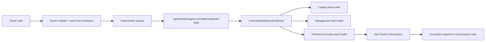
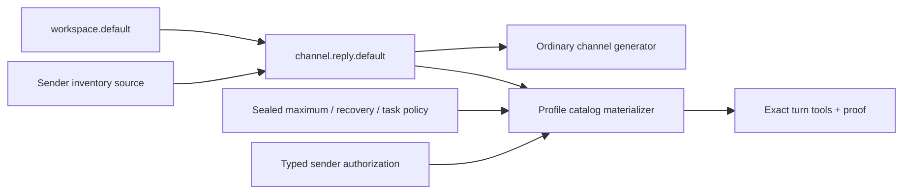

# Agent Profile Publication And Rollout

Agent Profile 是 owner-scoped、可编辑、可发布的持久化业务资源。它不是 Host 启动配置、部署文件或进程内注册项。每个 typed owner 有一个长期 `AgentProfileNamespaceGAgent`，每个 opaque `profileId` 有一个独立 `AgentProfileGAgent`；committed actor state 是唯一权威事实，read model 只是查询副本。

## 权威链路



Owner 通过受控的 `draft -> validate -> publish` 流程提交 Profile 内容。Validate 是 non-mutating preview；Publish 必须重新解析 exact Ornn GUID 与 literal version，并核对 name、publisher、declared tools、typed assets 和 policy bounds。`AgentProfileGAgent` 最终核对当前 draft revision/digest 与 canonical sealed snapshot 后才提交 published revision。

Publish API 返回 `202 Accepted` 只表示命令已进入 dispatch 边界。客户端必须回读 management/protected read model，观察到 matching operation outcome、published revision 和 digest 后，才能显示已发布或允许绑定。

三类 actor-scoped current-state read model 的职责固定如下：

| Read model | 消费方 | 内容边界 |
|---|---|---|
| Catalog | 列表、slug 解析、default binding | owner、profileId、slug、公开摘要、binding |
| Management | owner/Admin 编辑器 | draft、revision/digest、published 摘要、mutation outcome |
| Protected execution | 新实例 resolver | 完整 immutable published snapshot |

查询只读 read model，不在请求路径 replay event、prime projection、activate Actor 或访问 Ornn。所有版本来自权威 actor committed version；旧版本不能覆盖新版本，重复写入幂等，equal-version conflicting payload 必须报错。

## Binding 与新实例 rollout

Profile 选择只发生在新建 `nyxid.chat` Conversation 时，优先级固定为：

```text
create request 显式 caller/system reference
  -> 当前 scope 对 nyxid.chat 的默认 binding
  -> system 对对应 agent kind 的默认 binding（enabled + candidate/previous cohort admission）
  -> genuinely unprofiled
```

用户 default binding 只能引用自己的 Profile 或已发布的 `system/` Profile，并固定为 full cohort。只有 system default binding 可以配置 `enabled` 与 `cohortBasisPoints`。合法阶段固定为 `500 -> 2500 -> 10000` basis points。System binding 的 actor-owned state 同时持有 candidate `target` 和 `previous_reviewed_target`；cohort 未命中的新实例使用 previous reviewed snapshot，而不是 unprofiled。Partial rollout 缺上一版 baseline 或跳阶段都 fail closed。Cohort 只控制之后创建的实例，不改变已有实例。

如果某一级存在明确 binding，但目标 unpublished、disabled、不可见、protected read model 尚未物化或 digest 无效，创建必须返回 typed `AGENT_PROFILE_UNAVAILABLE` 或 `AGENT_PROFILE_INTEGRITY_FAILURE`。不得降级到下一优先级，也不得进入 unrestricted path。只有完全没有 binding 才是 genuinely unprofiled。

Conversation 创建时从 protected execution read model 读取一次 snapshot，并把 clone 固化到自己的 Protobuf state。Profile revision B 只影响之后创建的 Conversation；已经绑定 revision A 的实例不 hot-upgrade、不 lazy rebind、不 replay/backfill。Host/Actor 重启恢复 actor state 与持久化 read model，不需要 Profile 文件，也不在 create/turn 路径重新访问管理 API 或 Ornn。Turn-time 对已固化 exact skill 的受限读取仍遵循既有 `AgentTurnToolCatalogMaterializer` 契约，不改变这里的 create-time 权威边界。

## Route admission、shadow 与 rollout

系统默认 binding 只负责选择 sealed Profile，不得通过改写所有 caller 的 route policy 或扩大
`workspace.default` 来模拟 Profile。新 Conversation 的 direct-chat route 按以下规则与已选 Profile 对账：

- projected `ForwardToModel` 未写 `toolSetRef` 时，由 Profile `routeToolSetRef` 填充；
- route snapshot 缺失时，Profile route 只替换 Host fallback 的隐式 tool set，并在 clone 后修改；
- route policy 显式写出的 tool set 不被覆盖，任何 drift 都 fail closed；
- 未选 Profile 的创建请求保持既有 fallback 行为。

Shadow Profile 会计算候选 exact catalog、schema bytes 和 digest 并写入 shadow telemetry，但不改变模型 schema、prompt layer 或 executor exact objects。进入 enforced rollout 前，必须先有一个 100% reviewed baseline；新 candidate 依次按 `5% -> 25% -> 100%` 推进，每一步都用真实新 Conversation 验证 typed tool call 与 terminal receipt。未命中的新 Conversation 固定到 `previous_reviewed_target`。Rollback 只能把 candidate 切回 previous reviewed target 并设为 100%，不得清空 binding 或回到 unrestricted。

scope default binding 继续高于 system default。Published revision 与 Conversation snapshot 都不可原地修改，因此每次发布或 binding 变更后的验证都必须创建新 Conversation，旧 Conversation 不代表 rollout 结果。完整 catalog/预算、telemetry 和生产矩阵见 [agent-turn-tool-catalog.md](agent-turn-tool-catalog.md)。

Route/Profile admission 失败统一返回 `ADMISSION_UNAVAILABLE`；只有 observation/projection lifecycle
确实不可用时才返回 `PROJECTION_UNAVAILABLE`。这两个错误不得互相兜底或复用文案。

## Tool 权限

Profile 只能缩权：

```text
runtime registered tools
INTERSECT chat route tool set
INTERSECT Profile maximum/recovery/task policy
INTERSECT caller authorization
INTERSECT platform safety policy
MINUS deny policy
```

`routeToolSetRef` 只能引用 Host 静态注册且该 agent kind 支持的 tool set。Profile draft、Admin 页面或 published state 都不能动态创建 tool set、注入 tool instance、授予 credential/scope 或扩张 caller authority。

`maximum/recovery/task` policy 可以把 literal tool name、tool-set ref 与 `connectedServiceSelectors` 相加。selector 以 canonical `catalogServiceSlug` 和非空 `allowedRisks`（仅 `READ_ONLY/WRITE`）表达 connected-service operation 类别；它只匹配本 turn 已由 route discovery 和 caller authorization 准入的工具，并读取 exact typed admission 中 server-sealed 的 catalog slug 与 risk。`serviceInstanceId`、opaque `nyxop_*` 名称、展示 descriptor、method/path 都不是 selector 权威。多个同类 exact connection 会全部匹配，但每个工具仍保留自己的 exact execution admission；未匹配 selector 不会使其他显式允许项失效。

Task/recovery selector 必须按 catalog slug 被 maximum selector 的 risk 集覆盖；selector 不能触发 rediscovery、创建连接、改变 credential，或扩大静态 route ceiling。validate/publish 会拒绝非法 slug、空/未知/破坏性 risk 与 policy 内重复 slug，canonical sealing 会稳定排序 selector 与 risk。maximum 拒绝掉动态 operation 时 runtime 只记录按 typed presentation kind 聚合的 bounded count，不记录工具名、连接或 endpoint 身份。

发布契约固定使用 `15000ms` classifier budget 与 `15000ms` exact-skill fetch budget。前者覆盖
streaming LLM classification 的正常网络/首 token 时延，后者覆盖经 NyxID proxy 的 exact Ornn
读取；两者超时都继续 fail closed。不得用亚秒 classifier budget 发布 Profile，因为 timeout 会在
request-local connected-service tools 已成功发现后把 authority 降为 empty recovery，看起来像“连接
存在但没有工具”。Selected skill body 固定为 `65536` UTF-8 bytes ceiling；validate/publish 必须用
exact Ornn package 中唯一 `SKILL.md` 的实际字节数校验，超限 Profile 不得发布，不能把错误延迟到
turn-time materialization。预算调整属于 immutable Profile 内容变更，必须重新 validate/publish，
并用新 Conversation 验证。

ROUTED member 的 `explicitTriggerAliases` 是 classifier 之前的确定性触发项。每个 alias 按
case-insensitive、完整 token/phrase boundary 在整条用户消息中匹配，而不是只检查消息前缀；因此
`github` 可以命中 “issues assigned to me on my GitHub”，但不能命中 `githubish`。一个 alias 只可
归属一个 member；同一消息命中多个 member 时仍按 collision fail closed，不能靠 member 顺序或
classifier 猜测。Profile 作者应使用稳定服务/能力词作为 natural-language alias，slash command
alias 继续遵守同一 boundary 规则。

## Channel reply 与发送者 inventory

`channel.reply` 推荐使用 `channel.reply.default`：Host 组合 `workspace.default` 与
`ChannelNyxIdConnectedServiceInventoryToolSource`。`use_skill` 来自 workspace 的
`skill.runtime`，`nyxid_service_inventory` 来自 channel sender wrapper。
`nyxid_services` 属于 NyxID Assistant 的 management surface，不包含在该 channel set 中。



Relay ingress 的 `ForwardToModel` 若选择 channel Profile 且 policy 未显式指定 tool set，
resolver 保留空 `ToolSetRef`，由 AgentRun executor 使用 resolved 或 conversation-pinned
sealed Profile 的 `routeToolSetRef`。Host fallback 中的默认 tool set 也是隐式值，必须在
clone 上移除；不能把它当成显式 channel policy。显式 projected route 仍保留，和 Profile
route 不一致时在模型执行前 fail closed。未绑定 Profile 的 channel AgentRun 仍为
restricted-empty catalog。

`workspace.default` 继续作为 channel Profile 可选的较窄工具上限；已封存的旧版本和旧
Conversation 可继续运行。它不会被 alias 或自动升级为 `channel.reply.default`。
只有更新并发布 Profile route，才会让新 Conversation 使用新工具面。

从引用 `workspace.default` 的 `channel-reply-default` 迁移时：

1. 先通过正常源码交付与 CI/CD 部署含 `channel.reply.default` 注册项的 Host。
2. 回读当前 Profile draft，复制为独立 candidate Profile（不同 `profileId` / slug，例如
   `channel-reply-inventory`）。保留 instructions、members、workflow policies 和预算，
   把 candidate 的 `routeToolSetRef` 改为 `channel.reply.default`，确保 maximum 和
   recovery 的 `toolNames` 同时包含 `use_skill`、`nyxid_service_inventory`，移除无效的
   `nyxid_services` 名称。validate、publish candidate，并回读确认 published revision。
3. 回读 `channel.reply` system binding，使用它自己的最新 authority version 切换到 candidate，
   按 `500 -> 2500 -> 10000` 推进 cohort。每步都观察 committed mutation outcome；Profile
   的 published revision 不能用作 binding 的 `expectedVersion`。
4. 在新的 channel Conversation 验证最终工具 schema 和真实 sender inventory receipt。
   已固定旧 Profile 的 Conversation 不会因默认 binding 更新而自动切换。

当前 resolver 的既有限制要求 binding target 与该 Profile catalog entry 的最新
published revision/digest 完全一致。因此在同一 `profileId` 上直接发布新 revision，
会使仍指向旧 revision 的 binding 或 `previous_reviewed_target` 返回
`ProfileNotPublished`。上述独立 candidate 保留旧 `channel-reply-default` 的已发布
v2 作为可解析的灰度基线；在此限制修复前，不要用同 Profile 原地发布实现无中断灰度。

生产 API 使用 NyxID proxy；mutation precondition 使用回读得到的 strong ETag，或官方
body `expectedVersion` 与唯一 `idempotencyKey`。不得提前在尚不支持新 tool set 的 Host 上
切换线上 Profile，也不得以生产 pod 变更代替标准源码部署。

## Legacy 删除

以下链路不再是生产事实源，也不得回归：

- `ReviewedProfilePath`、完整 Profile options payload 和 Host 启动文件读取；
- `MainnetAgentProfileRolloutSelector` 与本地 sealed clone source；
- 文件驱动的动态 route tool-set 注册；
- `Aevatar.Tools.AgentProfileRollout` CLI、reviewed release spec、packages 和 resolved Profile artifacts；
- Actor-backed read model 不可用时回退本地文件的双轨逻辑。

治理门禁 `tools/ci/agent_profile_governance_guard.sh` 校验 committed authority、protected execution reader、静态 route tool set，并拒绝 legacy config/class、runtime Profile 文件读取、进程内 Profile registry、动态 Profile tool-set 和逐消息 Profile override 回归。`tools/ci/agent_turn_tool_catalog_guard.sh` 另外固定 shadow candidate proof、5%→25%→100% 阶段和 `previous_reviewed_target` rollback 语义。
