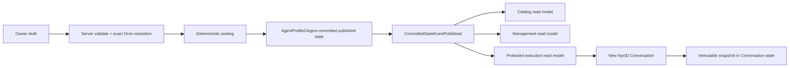

# Agent Profile Publication And Rollout

Agent Profile 是 owner-scoped、可编辑、可发布的持久化业务资源。它不是 Host 启动配置、部署文件或进程内注册项。每个 typed owner 有一个长期 `AgentProfileNamespaceGAgent`，每个 opaque `profileId` 有一个独立 `AgentProfileGAgent`；committed actor state 是唯一权威事实，read model 只是查询副本。

## 权威链路



Owner 通过受控的 `draft -> validate -> publish` 流程提交 Profile 内容。Validate 是 non-mutating preview；Publish 必须重新解析 exact Ornn GUID 与 literal version，并核对 name、publisher、declared tools、typed assets 和 policy bounds。`AgentProfileGAgent` 最终核对当前 draft revision/digest 与 canonical sealed snapshot 后才提交 published revision。

Publish API 返回 `202 Accepted` 只表示命令已进入 dispatch 边界。客户端必须回读 management/protected read model，观察到 matching operation outcome、published revision 和 digest 后，才能显示已发布或允许绑定。

三类 actor-scoped current-state read model 的职责固定如下：

| Read model | 消费方 | 内容边界 |
|---|---|---|
| Catalog | 列表、slug 解析、default binding | owner、profileId、slug、公开摘要、binding |
| Management | owner/Admin 编辑器 | draft、revision/digest、published 摘要、mutation outcome |
| Protected execution | 新实例 resolver | 完整 immutable published snapshot |

查询只读 read model，不在请求路径 replay event、prime projection、activate Actor 或访问 Ornn。所有版本来自权威 actor committed version；旧版本不能覆盖新版本，重复写入幂等，equal-version conflicting payload 必须报错。

## Binding 与新实例 rollout

Profile 选择只发生在新建 `nyxid.chat` Conversation 时，优先级固定为：

```text
create request 显式 caller/system reference
  -> 当前 scope 对 nyxid.chat 的默认 binding
  -> system 对 nyxid.chat 的默认 binding（enabled + cohort admission）
  -> genuinely unprofiled
```

用户 default binding 只能引用自己的 Profile 或已发布的 `system/` Profile，并固定为 enabled + full cohort。只有 system default binding 可以配置 `enabled` 与 `cohortBasisPoints`。Cohort 只控制之后创建的实例，不改变已有实例。

如果某一级存在明确 binding，但目标 unpublished、disabled、不可见、protected read model 尚未物化或 digest 无效，创建必须返回 typed `AGENT_PROFILE_UNAVAILABLE` 或 `AGENT_PROFILE_INTEGRITY_FAILURE`。不得降级到下一优先级，也不得进入 unrestricted path。只有完全没有 binding 才是 genuinely unprofiled。

Conversation 创建时从 protected execution read model 读取一次 snapshot，并把 clone 固化到自己的 Protobuf state。Profile revision B 只影响之后创建的 Conversation；已经绑定 revision A 的实例不 hot-upgrade、不 lazy rebind、不 replay/backfill。Host/Actor 重启恢复 actor state 与持久化 read model，不需要 Profile 文件，也不在 create/turn 路径重新访问管理 API 或 Ornn。Turn-time 对已固化 exact skill 的受限读取仍遵循既有 `AgentProfileTurnCatalogMaterializer` 契约，不改变这里的 create-time 权威边界。

## Tool 权限

Profile 只能缩权：

```text
runtime registered tools
INTERSECT chat route tool set
INTERSECT Profile maximum/recovery/task policy
INTERSECT caller authorization
INTERSECT platform safety policy
MINUS deny policy
```

`routeToolSetRef` 只能引用 Host 为 `nyxid.chat` 静态注册的 tool set。Profile draft、Admin 页面或 published state 都不能动态创建 tool set、注入 tool instance、授予 credential/scope 或扩张 caller authority。

## Legacy 删除

以下链路不再是生产事实源，也不得回归：

- `ReviewedProfilePath`、完整 Profile options payload 和 Host 启动文件读取；
- `MainnetAgentProfileRolloutSelector` 与本地 sealed clone source；
- 文件驱动的动态 route tool-set 注册；
- `Aevatar.Tools.AgentProfileRollout` CLI、reviewed release spec、packages 和 resolved Profile artifacts；
- Actor-backed read model 不可用时回退本地文件的双轨逻辑。

治理门禁 `tools/ci/agent_profile_governance_guard.sh` 校验 committed authority、protected execution reader、静态 `agent-profile.nyxid-chat` tool set，并拒绝 legacy config/class、runtime Profile 文件读取、进程内 Profile registry、动态 Profile tool-set 和逐消息 Profile override 回归。
