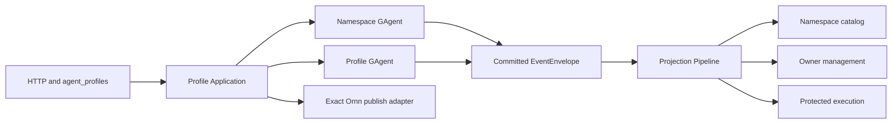

# Agent Profiles

## 1. Purpose And Scope

An Agent Profile is an owner-scoped, versioned resource for an agent's purpose,
instructions, tool-policy restriction, and exact Ornn skill bindings. It is not
a workflow identity, a service identity, a channel registration, or a credential
container.

This canon describes the Phase 1 authority and management delivery. Phase 1
does not make Chat, WebSocket, NyxID conversation, Studio, member, or channel
runtime paths select a Profile. Those integrations remain later rollout phases
and must reuse the authority and read models defined here.

## 2. Identity And Authority

The identity model keeps human lookup, authorization, and actor addressing
separate:

| Identity | Meaning | Authority use |
|---|---|---|
| `ownerHandle/profileSlug` | Human-readable reference carried as two typed fields. | Lookup and display only. It never grants authority. |
| `profileId` | Opaque immutable Profile identity. | Stable resource and Profile Actor identity input. Callers do not derive it from a route or prefix. |
| `AgentProfileOwnerIdentity.user` | Stable authenticated user identity. | Authorizes an ordinary owner Profile together with its separate `owningScopeId`. |
| `AgentProfileOwnerIdentity.system` | Platform-owned system identity. | Reserved for built-in Profiles. Ordinary principals cannot claim `system/*`. |
| `owningScopeId` | Scope boundary for an ordinary Profile. | Compared independently from owner identity. It is empty for system Profiles. |

`AgentProfileNamespaceGAgent` is the single authority for owner-handle and
reference uniqueness, provisioning status, and published discovery summaries.
`AgentProfileGAgent` is the authority for one Profile's immutable identity,
draft, exact bindings, mutation outcomes, and published snapshot. Committed
event store plus actor state is the truth; every read model is a query replica.

The management route derives owner and scope from the authenticated caller.
Bodies and tool schemas cannot supply an owner subject, scope id, Profile id,
system authority, sealed content, or credentials. Discovery by human reference
is authenticated and returns not found when the caller cannot see the resource.

## 3. Architecture



Host endpoints parse HTTP, authenticate, and map boundary contracts. Application
normalizes input, resolves read-side identity, validates or seals publish input,
builds typed commands, and returns an honest dispatch receipt. Actors alone
commit Profile facts. The existing Projection Pipeline fans those facts out to
the declared read models and audit artifacts.

## 4. Phase 1 Management Contract

### HTTP API

| Method and route | Contract |
|---|---|
| `POST /api/scopes/{scopeId}/agent-profiles` | Create an ordinary owner Profile. Requires an idempotency key. |
| `GET /api/scopes/{scopeId}/agent-profiles/{profileSlug}` | Read the authenticated owner's management view and strong ETag. |
| `PUT /api/scopes/{scopeId}/agent-profiles/{profileSlug}/draft` | Replace the mutable draft surface under `If-Match`. |
| `PUT /api/scopes/{scopeId}/agent-profiles/{profileSlug}/draft/skills/{bindingId}` | Upsert one exact skill binding under `If-Match`. |
| `DELETE /api/scopes/{scopeId}/agent-profiles/{profileSlug}/draft/skills/{bindingId}` | Remove one binding under `If-Match`. |
| `POST /api/scopes/{scopeId}/agent-profiles/{profileSlug}:validate` | Validate the complete canonical draft without committing a mutation. |
| `POST /api/scopes/{scopeId}/agent-profiles/{profileSlug}:publish` | Resolve, seal, and dispatch a publish mutation under `If-Match`. |
| `GET /api/agent-profiles/{ownerHandle}/{profileSlug}` | Resolve the authenticated caller's visible discovery summary. |

The strong ETag is the Profile Actor's committed authority state version. It is
not a local projection counter. A known-stale management mutation is rejected;
the actor remains the final authority for version and idempotency decisions.

### `agent_profiles` tool

The tool actions are exactly `create`, `get`, `update_draft`, `upsert_skill`,
`remove_skill`, `validate`, and `publish`. Every action takes `profile_slug`.
The caller owner and scope are implicit. Mutations use the quoted strong `etag`
returned by `get`; create uses an idempotency key.

An upsert carries a `skill` object with exactly these stable facts:

- `skill_guid`
- `literal_version`
- `expected_name`
- `expected_publisher_id`

The tool never accepts a name-only or `latest` reference, inline skill content,
sealed package content, credentials, another owner, or another scope. Caller
credentials needed at publish time stay in transient caller context rather than
model-authored arguments.

## 5. Exact Ornn Publish Path

Ornn is a publish-side provider boundary, not a Profile Actor dependency. The
Application sealing service accepts only `ExactOrnnSkillReference` and invokes
`IExactOrnnSkillResolver`. The concrete provider reads both exact upstream forms
through the NyxID proxy:

```text
/api/v1/skills/{guid}?version={literalVersion}
/api/v1/skills/{guid}/json?version={literalVersion}
```

The adapter verifies the returned GUID, literal version, canonical name, and
publisher id against the requested reference. It validates and maps the package,
computes deterministic content and snapshot digests, and returns typed sealed
content to Application. Only then may the Profile Actor commit a published
snapshot and authoritative published revision.

The path never calls skill search, `IRemoteSkillFetcher`, or the name-capable
`GetSkillJsonAsync`. It does not fall back to another version. A missing token,
inaccessible exact version, identity mismatch, publisher mismatch, or invalid
package produces a bounded safe diagnostic and no publish commit.

## 6. Accepted And Observed Semantics

A successful command response means `accepted for dispatch` and carries stable
operation, command, correlation, actor, and resource identifiers. It does not
claim that an event committed or that a read model is current.

The completion sequence is:

1. Application validates the request and dispatches a typed command.
2. The target actor serially decides and commits a typed domain event.
3. The committed `EventEnvelope<CommittedStateEventPublished>` enters the
   shared Projection Pipeline.
4. Projectors monotonically overwrite read models using the actor's committed
   state version.
5. Clients reread the canonical management or discovery surface until the
   expected operation, version, revision, or digest is visible.

Queries never create actors, activate or prime projections, replay the event
store, or synchronously wait for a command reply. Eventual visibility is stated
honestly through authority state versions and committed digests.

## 7. Read Models And Audit

| Read model | Stable consumer | Exposed content |
|---|---|---|
| Namespace catalog | Owner lookup, discovery resolution, provisioning, and system readiness. | Reference, typed owner, owning scope, provisioning status, Profile id, and safe published summary. |
| Owner management | Authenticated management API/tool and system reconciliation. | Canonical draft, exact references, revisions, digests, safe diagnostics, and authority state version. |
| Protected execution | Future shared runtime resolver and current system readiness. | Server-sealed published snapshot, exact packages, published revision, digest, and authority state version. It is not returned by public management or discovery APIs. |

All three models are actor-scoped current-state replicas. Namespace events feed
the namespace catalog. Profile events feed owner management and protected
execution. Projectors do not recompute a second Profile state machine and do not
read an older same-kind model before writing.

Committed-fact audit translators use exact event TypeUrls and record only safe
identity, operation, reference, exact-reference, revision, digest, outcome, and
stable failure-code facts. Audit materialization is attached to namespace and
owner contexts only. The execution fan-out does not create duplicate audit
records. Draft instructions, sealed instructions/assets, owner subject ids,
credentials, and raw dependency errors are structurally omitted.

Audit partitioning does not rewrite domain identity. A valid user Profile keeps
its `owningScopeId` as the audit scope. The fully valid canonical
`system/aevatar` identity uses the reserved `platform:aevatar` audit scope.
Committed Profile failures whose identity is missing or invalid are quarantined
in that same reserved audit scope so the governance fact is retained; quarantine
does not grant system authority or repair the invalid domain identity. A
quarantine record uses a stable non-input-derived target and omits every
unvalidated identity/reference field while retaining the stable failure code.
`platform:aevatar` is never an ordinary Profile `owningScopeId`. Query and export
access to it always requires platform-admin authorization, even when a caller's
`scope_id` claim has the same literal value.

## 8. System Profile Bootstrap And Health

Hosts may contribute `ISystemAgentProfileDefinitionSource` implementations.
The bootstrap hosted service performs one reconciliation pass at startup and
then wakes on a bounded signal. Each pass rereads definitions and all three read
models and dispatches at most the next required command. The signal is only a
wake mechanism; no service-level id-to-state registry becomes authoritative.

`ISystemAgentProfileOrnnAccessTokenProvider` is replaceable by the host. The
default provider returns unavailable. Exact skills are published only when the
host supplies a token through that boundary.

The readiness service independently compares each required definition with its
namespace, owner, and protected execution replicas. A required Profile is ready
only when the desired draft and published digests match and the protected
execution snapshot has the same published revision and digest. No registered
definitions means ready, so Phase 1 does not change startup behavior by itself.
Capability health reports bounded reference/status/reason details and never
reports credentials, sealed content, or raw remote errors.

## 9. Security And Observability Boundary

- Internal state, commands, events, snapshots, and read models use Protobuf.
- Profile and skill content cannot grant tools, OAuth scopes, permissions, or
  credentials. Tool policy only intersects the caller and route maximum.
- Owner-authored draft text is returned only on the authorized management
  surface. Protected sealed content remains server-side.
- Audit and health use allowlisted safe fields; raw diagnostics are excluded.
- Activity spans may carry resource correlation facts. Metric labels are
  limited to ingress, operation, outcome/failure class, activation mode, and
  required-system readiness; Profile/resource ids are not metric labels.
- Core and Projection do not reference Ornn/HTTP implementations. Application
  depends on exact typed ports. Concrete provider selection belongs to Host.

## 10. Rollout Boundary

| Phase | Status in this canon | Included | Explicitly not active |
|---|---|---|---|
| Phase 1: authority and management | Current | Typed contracts, two authorities, three read models, HTTP/tool management, exact Ornn publish adapter, committed audit, telemetry surface, system bootstrap/readiness, and boundary guards. | No existing runtime ingress consumes a Profile. |
| Phase 2: unified runtime and Studio | Later | Shared resolver, immutable turn stamp, prompt/tool composition, typed Chat/NyxID inputs, and `system/studio`. | Not implemented or implied by Phase 1 routes, DI, or health. |
| Phase 3: channel binding and migration | Later | Typed channel binding, stop-new-write policy, and durable migration from legacy default-skill data. | No channel/member binding or legacy inference exists in Phase 1. |
| Phase 4: removal and enforcement | Later | Resolve migration blocks, remove and reserve legacy fields, enable later-phase forbidden-term checks, and update runtime canon. | Phase 1 guards do not prematurely forbid legacy paths still owned by later migrations. |

Every later phase must consume the Phase 1 identity, authority, exact publish,
and read-model contracts. It must not introduce a second Profile model, infer
identity from strings, or restore runtime Ornn lookup.
