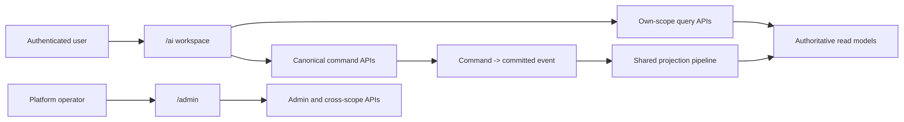

# AI Workspace

本文定义 Aevatar `/ai` 用户工作区的产品、身份、API 和迁移边界。GitHub issue
[#3486](https://github.com/aevatarAI/aevatar/issues/3486) 是需求来源；本文是实现后的仓库内权威口径。

## 1. 产品边界

`/ai` 是已认证用户使用、配置和调试自己可访问 AI 资源的入口。`/admin` 继续负责平台级治理、跨 scope
查询、基础设施诊断和全局策略。新增 `/ai` 不会重命名或接管 `/admin`，也不会创建第二套 Chat、Activity、
Audit 或 Observatory runtime。

- `/ai`：当前认证 scope 的 Chat、Agent Profile、模型、Channel、Capability 和 Activity。
- `/admin`：平台 Fleet、CQRS/Projection、跨 scope Observatory/Audit、系统 Agent 发布、平台模型策略和事故处置。
- Team Member Workflow 仍属于
  `/scopes/:scopeId/teams/:teamId/members/:memberId/workflow`，不是 `/ai/chat` 的 workflow identity。

## 2. Host 与路由

Mainnet Host 直接同源托管 `/ai` 和 `/ai/{**path}`，浏览器最终地址保持在 Mainnet origin；生产默认入口是
`https://aevatar-console-backend-api.aevatar.ai/ai`，不会跳转到另一个 Console origin。Mainnet 镜像构建
console-web 时保持 router base 为 `/`，把静态资源 public path 固定为 `/ai-assets/`，并将产物复制到
`Aevatar:AIWorkspace:StaticAssetsPath`（镜像默认 `AIWorkspaceWeb`）。Host 同时服务 `/login`、
`/auth/callback`、legacy `/chat`、全局 Teams 导航使用的 `/scopes/**` 和 Models 当前使用的
`/settings` SPA entry，OAuth/PKCE storage 与
`/api/*` 请求因此保持同源。

缺少 `index.html` 或部署产物时，页面与资源请求返回 `503 AI_CONSOLE_UNAVAILABLE`；产物存在但具体资源
不存在时返回 `404`。Host 不回退到 `/admin`、临时 HTML、iframe 或另一个 Assistant。`/admin` 继续使用
原有 embedded asset，路由与功能均不受这条托管链影响。

console-web 使用认证后的 history routes：

| 页面 | 路由 | 交付状态 |
| --- | --- | --- |
| Overview | `/ai` | 已交付；分来源展示 Agents、Conversations、Runs 摘要 |
| Chat | `/ai/chat` | 已交付；复用现有 React Chat 主链 |
| Agents | `/ai/agents` | 基础查询已交付；分页展示 own-scope profiles 与只读 system templates |
| Models | `/ai/models` | 基础查询已交付；personal default 与 scope catalog 分区展示 |
| Channels | `/ai/channels` | 规划中；不进入当前路由和导航 |
| Capabilities | `/ai/capabilities` | 规划中；不进入当前路由和导航 |
| Activity | `/ai/activity` | 后端 query facade 已交付，页面规划中；不进入当前导航 |
| Run Detail | `/ai/activity/runs/:runId` | 后端 query facade 已交付，页面规划中 |

`/chat` 只保留到 `/ai/chat` 的兼容跳转。未实现或没有真实 authority 的目的地不得进入导航。Agent
create/clone/draft edit/validate/test/publish/default 与 Models 独立保存流程尚未接入本轮 UI，不属于当前交付。

## 3. 身份与授权

所有 `/api/ai/*` endpoint 都要求认证。scope 只能来自服务端验证过的唯一 `scope_id` 或
`workflow.scope_id` claim；API 不接受 route/query/body 中由浏览器声明的 scope。缺少唯一 scope 时返回
`401` 或 `403`，不能猜测个人 scope，也不能使用 display name 或 ID 前缀匹配。

`conversationId`、`turnId`、`taskId`、`runId`、`profileId`、Agent Profile revision、`memberId`、
`workflowId` 和 `publishedServiceId` 始终是独立身份。API 可以返回 typed link，但不能从字符串规则推导转换。
Run Detail 只能按 current-state read model 的 typed `runId` 精确查询；内部 `actorId` 只用于读取同一快照关联的
artifact，不得作为 `runId` fallback，也不得进入浏览器响应。

## 4. Query API

AI workspace query facade 只调用现有 query/read-model port。它不读取 Actor 内部 state、不 replay event、
不 prime projection，也不在 Host 保存 session/actor/resource 注册表。

| 状态 | Method | Path | Authority 与返回语义 |
| --- | --- | --- | --- |
| 已交付 | `GET` | `/api/ai/context` | 已认证 scope 与已实现页面 links |
| 已交付 | `GET` | `/api/ai/overview` | 小窗口分来源摘要；每个 section 独立声明 source/freshness |
| 已交付 | `GET` | `/api/ai/agents?ownedCursor=&systemCursor=&take=` | scope-owned Agent Profiles 与 read-only system templates，各自带 authority |
| 已交付 | `GET` | `/api/ai/models` | personal default 与 scope catalog 两个独立对象，声明 `independent_authorities` |
| 规划中 | `GET` | `/api/ai/channels` | 当前 scope 的 Channel registration read model，移除 credential/webhook secret |
| 规划中 | `GET` | `/api/ai/capabilities` | Skills、Workflows、Tools、Connectors 分 catalog 返回，不伪装单一事务 |
| 已交付 | `GET` | `/api/ai/activity` | Conversations 与 Runs 分 source 返回，不按浏览器时间合并成 unified feed |
| 已交付 | `GET` | `/api/ai/activity/conversations` | conversation current-state/read-model 分页 |
| 已交付 | `GET` | `/api/ai/activity/runs` | own-scope Workflow Observatory activity-run 分页 |
| 已交付 | `GET` | `/api/ai/activity/runs/{runId}` | own-scope run detail；未知或越权一律 `404` |

集合响应必须保持来源诚实。可用时返回 authority `stateVersion` 与 `updatedAtUtc`；来源没有统一版本时省略，
不得用 HTTP receipt time、本地计数或另一份 read model 的版本代替。跨来源响应使用
`consistency: "independent_read_models"` 或更具体的独立一致性值。

### 4.1 Agents

`Agents` 是 Agent Profile 的用户名称，内部 `AgentProfile` identity 和 contract 不变。

- `owned` 来自当前 scope 的 `AgentProfileCatalog` read model。
- `systemTemplates` 来自 system owner catalog，只读返回。
- `profileId` 与 `profileSlug` 都按后端 contract 返回；UI 不从一个推导另一个。
- `published` 只表达发布事实，不等价于 runtime execution readiness；缺少独立执行可用性 read model 时不得显示为“可执行”。
- 已发布 revision 不可变，历史 Conversation/Run 必须继续指向原 revision。

写操作继续走 canonical Agent Profile resource API：

- `POST /api/scopes/{scopeId}/agent-profiles`
- `PUT /api/scopes/{scopeId}/agent-profiles/{profileSlug}/draft`
- `POST /api/scopes/{scopeId}/agent-profiles/{profileSlug}:validate`
- `POST /api/scopes/{scopeId}/agent-profiles/{profileSlug}:publish`

这些 endpoint 仍校验认证 scope 与 route scope 相同，并保留 `Idempotency-Key`、`If-Match`、`202 Accepted`
和后续 read-model observation 语义。当前 `/ai/agents` 只消费查询 facade；create、clone、draft edit、
validate、test、publish、default 和 revision detail 是下一阶段 UI 工作，不得把列表页描述为已具备这些操作。

### 4.2 Models

Models 页面同时展示但不合并以下 authority：

- personal default：`GET/PUT /api/user-config/llm`；
- scope catalog policy：`GET/PUT/DELETE /api/scopes/{scopeId}/llm-model-catalog`；
- provider candidates：`GET /api/scopes/{scopeId}/llm-model-catalog/candidates`。

personal default 与 scope catalog 必须使用不同表单、不同 command 和不同 pending/observed 状态。平台 catalog
policy 仍只能在 `/admin` 修改。当前 `/ai/models` 只提供分区查询并将 personal 修改导向现有 Settings；
独立 personal/scope save 交互尚未交付。

模型来源身份必须按上游真实 contract 返回。历史或未知来源允许缺少 `serviceSlugSnapshot`，未知 source subtype
也允许同时缺少 `catalogServiceId` 与 `userServiceId`，但两种 typed service ID 绝不能同时出现。浏览器应显示
`Service unavailable` / `Unknown source`，不得把 `sourceId`、slug、名称或字符串前缀冒充 typed service identity。

### 4.3 Channels 与 Capabilities

Channels query 复用 Channel registration projection。注册、repair、test 和 delete 继续使用
`/api/channels/registrations*` 的现有 command contract。返回值不得包含 App Secret、Verification Token、
Encrypt Key、bearer、webhook secret 或内部 transport address。

Capabilities 是多个独立 catalog 的呈现，不是新的 runtime authority。built-in 与 user-provided capability
使用同一 typed descriptor 时，至少保留 kind、stable identity、version/revision、publisher、digest、trust、
effects、permissions、compatibility 和 availability。缺失的 provenance 必须显示 unavailable，不能从名称补齐。

### 4.4 Activity

Activity 的 Conversations 与 Runs 保持独立来源；未来若加入 own-subject Audited Actions，也必须作为
独立来源而不是复用 admin audit trail。只有后端明确返回 typed
`conversationId`、`turnId`、`runId`、`taskId`、`stepId` 或 `callId` 关系时才建立链接。浏览器不得用时间、
文本、数组位置或相似名称合并记录。真正统一的 durable feed 必须先由 aggregate Actor/read model 拥有。

Run Detail 返回 `reportVersion`，并为 Overview、Steps、Timeline 与 Execution Path 分别返回 detail/source
state version、`unknown / aligned / unavailable / version_mismatch` 状态及可选原因。消费方必须据此区分
“权威空结果”“尚未物化”和“版本不一致”，不得因为 section 数组为空或非空就推断完整性；这些字段也不得
通过暴露内部 `actorId`、raw reasoning、tool arguments/results 或 provider error 来补齐。

## 5. 状态与错误

- `202 Accepted` 只表示 command 已接受并提供稳定 operation/command identity。
- `committed` 与 `projected/observed` 必须由后续事件或 read model 明确证明。
- `401/403` 显示重新认证或权限边界，不回退到跨 scope 查询。
- `404` 同时保护未知与越权 resource，避免 scope 枚举。
- `409/412/428` 保留并发更新和前置条件语义。
- `503` 显示具体 unavailable source，并保留其他独立来源的稳定结果。

所有 diagnostics 默认折叠并执行字段级脱敏。raw reasoning、credential、token、内部地址和未经清洗的 provider
error 永远不进入 browser response。

## 6. 迁移规则

1. `/ai/chat` 成为唯一 React Assistant Chat owner，`/chat` 兼容跳转。
2. `/admin` 原功能在本次交付中保持不变。
3. 只有当 `/ai` 对应能力达到命令、查询、错误与恢复 parity 后，旧 Admin 用户入口才改为 link/redirect。
4. 迁移后删除重复 renderer/state machine；共享 own-scope/Admin 数据时复用 typed adapter 和 presentation，
   通过显式 authorization mode 区分权限。
5. `/admin#/studio` 的最终退役是独立 parity 工作，不在缺少历史 trajectory contract 时提前删除。
