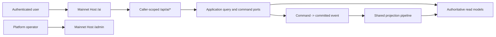

# Aevatar AI Application

本文定义 Mainnet Backend 上 `/ai` 的产品、页面、认证和 Web API 边界。GitHub issue
[#3486](https://github.com/aevatarAI/aevatar/issues/3486) 是需求来源；本文是实现后的仓库内权威口径。

## 1. 产品语义

`/ai` 是 Mainnet Backend 自己拥有、自己托管的独立 AI 应用，与 `/admin` 平行。它不是
`apps/aevatar-console-web` 的路由、主题或部署变体，也不复用 Console 的页面壳、导航、缓存、登录页或
Team 产品模型。

- `/ai` 面向认证用户，提供 AI 资源的日常查看、配置与授权范围内的运行诊断。
- `/admin` 继续负责平台治理、跨授权分区查询、基础设施诊断和全局策略；本次不修改其现有功能。
- `/ai` 可以复用 `/admin` 的深色导航轨、浅色工作区等视觉语言，以及 Mainnet Host 已有的 OIDC/PKCE
  和 embedded asset 基础设施；这些共享设施不改变两个产品面的所有权。
- 服务端验证过的 `scope_id` 只是不透明的授权分区。浏览器不能选择、提交、拼接或展示它，也不能由它
  推导 Team、Agent、Conversation、Run 或其他产品身份。

## 2. 页面宿主与导航

Mainnet Host 将 `AI/ai.html` 编译为 embedded resource，并只在 `GET|HEAD /ai` 返回该页面。页面使用 hash
路由，因此刷新和深链始终命中同一个 Mainnet-owned asset，不需要接管 `/login`、`/auth/callback`、
`/chat`、`/settings` 或 `/scopes/**`。

| 页面 | 地址 | 当前职责 |
| --- | --- | --- |
| Overview | `/ai#/overview` | 分来源展示 Agent、Conversation 和 Run 摘要 |
| Agents | `/ai#/agents` | Agent Profile 查询、创建、draft 编辑、校验和发布 |
| Models | `/ai#/models` | 个人默认模型与模型目录策略的独立查看和保存 |
| Activity | `/ai#/activity` | Conversation、Run 列表与 typed `runId` detail |

导航只显示这四个已实现且有真实后端 authority 的页面。Chat、Channels 和 Capabilities 在拥有独立契约与
可用页面前不显示占位入口。尤其不能为了增加 Chat 导航而复制 Console Chat 或 `/admin#/studio` 的状态机。

## 3. 登录与浏览器会话

`/ai` 页面本身允许匿名读取；未登录时由 `ai.html` 渲染 Aevatar AI 自己的登录画面。页面不跳转到
Console 登录路由。

1. 页面从注入的 Mainnet OIDC 配置读取 authority、client ID、scope 和 AI 专属 storage key；该 key 由
   Admin 基础 key 派生为 `base:ai`，不会读取、覆盖或清理 Admin token/PKCE。
2. 登录使用 Authorization Code + PKCE，redirect URI 为共享的 `/auto/callback`，return path 始终是
   `/ai` 加受约束的 hash route。回调只检查 Admin 与 AI 两个服务端注入的固定 PKCE 槽位，并按 OAuth
   `state` 精确选择；不接受 pending payload 自报 storage key。
3. 普通登录通过 `/api/auth/nyxid/finalize` 完成，以保留 NyxID binding 的 committed 语义。
4. access token 保存于 AI 专属 namespaced local storage；所有 `/api/ai/*` 请求显式发送 Bearer，AI logout
   只清理 AI 会话。
5. `401` 清理失效会话并回到 `/ai` 登录画面；`403` 显示授权边界，不回退到 Admin 或跨分区 API。

页面可匿名打开不等于 API 已认证。所有 `/api/ai/*` endpoint 都必须要求认证并 fail closed。

## 4. Web API

### 4.1 Context 与查询入口

| Method | Path | 语义 |
| --- | --- | --- |
| `GET` | `/api/ai/context` | 当前 account、已实现页面和纯 `/api/ai/*` links；不返回内部授权分区 ID |
| `GET` | `/api/ai/overview` | 独立 read model 的小窗口摘要，不伪造统一版本 |
| `GET` | `/api/ai/agents` | 当前调用方可管理的 Agents 与只读 system templates |
| `GET` | `/api/ai/models` | personal default 与 model catalog 两个独立 authority |
| `GET` | `/api/ai/activity` | Conversations 与 Runs 两个独立来源 |
| `GET` | `/api/ai/activity/conversations` | Conversation current-state 分页 |
| `GET` | `/api/ai/activity/runs` | 授权范围内的 Workflow Observatory run 分页 |
| `GET` | `/api/ai/activity/runs/{runId}` | typed `runId` detail；未知和越权都返回 `404` |

`/api/ai/context` 的 account identity 来自已验证 principal 的 `uid/sub/nameidentifier`，display name 只用于
呈现。返回的 page links 使用 `/ai#/...`，API links 不得包含 `/api/scopes/{scopeId}/...`。
所有 `/api/ai/*` response DTO 都不得返回授权分区 ID 或 kind；该身份只存在于服务端认证和授权调用链。

`/api/ai` 自己拥有 caller-facing 错误词汇。Endpoint 返回的 JSON 错误固定为
`{"code":"...","message":"..."}`，不得追加内部 `diagnostics`，也不得透传底层 Scope、Team、owner、
authority 或 catalog exception 文案。`/api/admin/*` 与 `/api/scopes/*` 的既有错误契约不因 facade 改变。

集合响应必须保持来源诚实。来源提供 authority version 或更新时间时原样返回；来源没有统一版本时保持
`independent_read_models`，不得用 HTTP receipt time、本地计数或另一份 read model 的版本代替。

### 4.2 Agents

`Agents` 是 Agent Profile 的产品名称，内部强类型 identity、actor ownership 和 immutable published revision
保持不变。当前调用方的授权 owner 只由服务端 principal 解析，API 不接受 owner/scope route、query 或 body。

| Method | Path | 语义 |
| --- | --- | --- |
| `POST` | `/api/ai/agents` | 创建 caller-owned draft resource，支持幂等 identity |
| `GET` | `/api/ai/agents/editor-options` | 返回 canonical authoring/validation options |
| `GET` | `/api/ai/agents/{profileSlug}` | management detail、ETag、draft/published revision |
| `PUT` | `/api/ai/agents/{profileSlug}/draft` | 以 `If-Match` 和 idempotency 语义更新 draft |
| `POST` | `/api/ai/agents/{profileSlug}:validate` | 使用真实 model/capability authority 校验 draft |
| `POST` | `/api/ai/agents/{profileSlug}:publish` | 接受发布 command；不把 accepted 冒充 committed/projected |
| `GET|PUT|DELETE` | `/api/ai/agents/default/{agentKind}` | 管理当前授权 owner 的默认 binding |

editor options 对 Agent 引用只暴露闭集 `my_agents | system_agents`。默认绑定请求使用
`agentProfile: { source, profileSlug }`；`ownerKind` 是底层授权词汇，`/api/ai` 不接受也不回显。
system templates 对普通调用方只读。响应不暴露 actor ID、内部 transport、credential 或 runtime state。
Clone、immutable revision history、test run 和 archive 在形成 typed Application contract 前不声明为已实现。

### 4.3 Models

Models 页面同时呈现两个 authority，但绝不把它们合并成一个对象或一次原子保存：

- personal default 由 UserConfig authority 拥有；
- model catalog policy 由当前服务端授权分区的 LLM catalog authority 拥有。

页面只调用 caller-scoped facade，不读取或拼接 `/api/scopes/{scopeId}/...`：

| Method | Path | 语义 |
| --- | --- | --- |
| `GET|PUT` | `/api/ai/models/personal-default` | 读取设置；按 `{routeValue, modelId}` 保存真实 typed selection |
| `GET|PUT|DELETE` | `/api/ai/models/catalog` | 读取、replace 或 reset catalog policy |
| `GET` | `/api/ai/models/catalog/candidates` | 可用 provider/service candidates |
| `GET` | `/api/ai/models/catalog/candidates/{userServiceId}/models` | exact service identity 的模型发现 |

personal default 的现有 authority 没有 expected-version/idempotency 字段，facade 不伪造也不静默忽略这些
保证。catalog mutation 则保留 `expectedVersion -> expectedStateVersion` 与
`idempotencyKey -> mutationId` 的精确映射，并返回诚实的 `202 Accepted` receipt。

### 4.4 Activity

Activity 不制造统一 feed。Conversation history 和 Workflow Observatory runs 分区渲染、独立分页、独立显示
availability/freshness。只有后端明确返回 typed `conversationId`、`runId`、`taskId`、`stepId` 或 `callId`
关系时才建立链接；浏览器不得按时间、文本、数组位置或 display name 猜测关联。

Run detail 只按 typed `runId` 查询 current-state read model。Overview、Steps、Timeline 和 Execution Path
分别保留 source version 与 `unknown/aligned/unavailable/version_mismatch` 状态；内部 actor ID、raw reasoning、
tool secret 和未清洗 provider error 不进入响应。

Conversation 只返回闭集 `conversationKind: assistant | workflow | other`，不暴露底层 `serviceKind` 或
无稳定消费场景的 service identity。Run 只返回
`runOrigin: interactive | integration | automation | development | other`；`origins` 查询参数只接受前四个
可准确筛选的值。底层 Console、Team 或 workflow runtime origin 只能在 Application adapter 内映射，不能
成为 `/api/ai` 的请求或响应词汇。

## 5. 状态与架构约束

- Command 只返回真实达到的 ACK 阶段；`202 Accepted` 不表示 committed 或 projected。
- Query 只读取 read model，不 replay event、不 prime projection、不侧读 actor state。
- Host endpoint 只做认证 identity 解析、wire DTO 映射和 Application port 调用，不保存 resource/session 映射。
- `profileId`、`profileSlug`、revision、`conversationId` 和 `runId` 是独立 identity，不能靠字符串规则转换。
- browser local storage 只保存认证 token，不成为 Agent、Model、Conversation 或 Run 的事实源。
- diagnostics 默认次级展示并脱敏；credential、bearer、raw reasoning 和内部地址永不进入浏览器响应。

## 6. 迁移与验证

`apps/aevatar-console-web` 保持 issue 3486 之前的路由和产品职责；Mainnet Docker image 不再构建或复制
Console bundle。旧 `/chat`、`/login`、`/settings` 和 `/scopes/**` 继续由各自既有 owner 处理，`/ai`
不得抢占。

变更必须验证：

- `/ai` 返回 injected embedded HTML，且页面不包含 Console/Team/scope 选择语义；
- `/admin` endpoint、asset 与既有功能测试保持不变；
- 未认证、缺少唯一授权分区、歧义授权分区全部 fail closed；
- Agents/Models mutation 保留 typed identity、ETag/version、idempotency 和 honest ACK；
- Activity 继续使用现有 projection/read-model 主链；
- 页面在 desktop/mobile 上无空白、溢出和控件重叠。
