# Conversation, Execution, Prompt Context, and User Memory

本文是 conversation transcript、execution state、prompt context 与 user memory
四类语义的唯一权威规范。其他 canon 只能引用本文，不得重新发明“三层记忆”、
“短期记忆”或一条统一 memory 生命周期。

## 1. 产品语义决策

四类状态彼此独立，不是同一对象的不同保存层级：

| 稳定术语 | 权威 owner | producer / consumer | 事实类型与查询入口 |
|---|---|---|---|
| Execution state | 执行当前 turn/session/run 的 actor；NyxID Assistant 分别由 conversation controller、`NyxIdChatTurnGAgent` 和被调度的 `RoleGAgent` session 持有各自边界内的状态 | typed command、LLM/tool progress 和 actor handler 生产；control、recovery、current-state projection 与 realtime projection 消费 | committed actor state、terminal fact 与 recovery waterline；查询只读对应 current-state readmodel |
| Prompt context | 无长期事实 owner；它由发起下一次 LLM 调用的执行模块临时派生 | continuation selector、`UserMemoryPromptContextProvider` 与 `ChatRuntime` 生产；下一次 `ChatStreamAsync` 消费 | 有界、可丢弃的执行输入，不是 committed fact，不提供独立 query API |
| Conversation transcript | 每个 conversation 的 `ChatConversationGAgent` | terminal history delivery command 生产；conversation history API 与 prompt-context selector 消费 | committed conversation fact，经 `ChatConversationCurrentStateDocument` 和正式 transcript query port 查询 |
| User memory | 每个用户 scope 的 `UserMemoryGAgent` | 经过授权的 typed add/remove/clear command 生产；`IUserMemoryQueryPort` 与 prompt-context provider 消费 | 跨 conversation 的 committed user fact，经 `UserMemoryCurrentStateDocument` 查询 |

`conversationId`、`sessionId/turnId` 与 user-memory owner scope 是隔离身份。代码、
route helper 和测试不得假设它们相等，也不得从 actor ID 前缀推导另一类身份。fixture
应使用不同形态，例如 `conversation-alpha`、`session-beta`、`user-gamma`。

## 2. 生命周期与 retention

| 状态 | 生命周期 | retention | 清理责任 |
|---|---|---|---|
| Execution state | 从 typed admission/start 到 terminal/reconciled；只覆盖该 turn、session 或 run | 只保留恢复、幂等和终态查询所需的 actor-owned waterline；例如 `RoleGAgent` 只跟踪有界的已完成 session，NyxID turn actor 只保留有界 delivery evidence | 执行 owner 在 terminal/delivery 已安全后按自己的 typed policy 清理；不得把 checkpoint 复制到 transcript 或 user memory |
| Prompt context | 单次 LLM call 或当前执行 turn | 受 message/token/character budget 限制；调用结束即可丢弃 | 构建它的执行模块；截断只改变下一次调用输入，不删除任何权威事实 |
| Conversation transcript | conversation 初始化后持续存在，并可继续 append | 按 #3141：所有 committed turns 在显式删除整个 conversation 前可查询；无 per-turn TTL、silent rolling eviction 或隐式 archive | `ChatConversationGAgent` 通过 typed whole-conversation deletion fact 清理；projection 只物化该事实 |
| User memory | 用户 scope 存续期间跨 conversation 存在 | 当前 actor 上限为 50 条；新增超限时优先淘汰同 category 最旧项，再淘汰全局最旧项；也可显式 remove/clear | `UserMemoryGAgent` 在 command handler 内决定 eviction/remove/clear 并提交 event；prompt builder 和 query adapter不得清理 |

如果未来需要 transcript archive、user-memory 向量检索或不同 retention，必须先定义新的
owner、typed lifecycle 和正式 query contract；不得在 prompt 截断或 query adapter 中静默实现。

## 3. Protobuf 与写侧契约

内部事实、命令、事件和 actor state 全部使用 Protobuf：

1. Execution state 使用各 execution owner 的 typed state/event，例如
   `NyxIdChatTurnGAgentState`、`RoleChatSessionState`、typed operation key、phase、terminal
   outcome 和 recovery signal。credential、raw provider body 与临时 execution capability
   不得持久化。
2. Transcript 使用 `ChatConversationState`、`ChatTurn`、
   `InitializeChatConversationCommand`、`AppendChatTurnCommand` 及其 domain events。
3. User memory 使用 `UserMemoryState`、typed `UserMemoryCategory`、typed
   `UserMemorySource`，以及 `AddUserMemoryEntryCommand`、
   `RemoveUserMemoryEntryCommand`、`ClearUserMemoryEntriesCommand`。actor 校验 command，
   再提交 `MemoryEntryAddedEvent`、`MemoryEntryRemovedEvent` 或
   `MemoryEntriesClearedEvent`；domain event 不再冒充 command。
4. Prompt context 通过 typed LLM request/control 字段传递；`user_memory_prompt` 是已经
   派生、受限长控制的 prompt 输入，不是 user-memory persistence contract。只有最终文本
   拼装可以是字符串；category、source、identity、control 和 recovery policy 不得降级到
   `Metadata` bag。

User-memory 产品 contract 位于 Application abstractions，不属于
`Aevatar.AI.Abstractions.LLMProviders`。LLM provider 只消费已经构造好的 request，既不拥有
user-memory lifecycle，也不能写 user memory。

## 4. Projection 与查询边界

三类可查询事实都遵循唯一主干：

```mermaid
%%{init: {"maxTextSize": 100000, "flowchart": {"useMaxWidth": false, "nodeSpacing": 10, "rankSpacing": 50}, "themeVariables": {"fontSize": "10px"}}}%%
flowchart LR
    C["Typed command"] --> A["Authoritative actor"]
    A --> E["Committed domain event and state"]
    E --> P["Projection Pipeline"]
    P --> R["Actor-scoped current-state readmodel"]
    R --> Q["Narrow query port"]
    Q --> X["Query response or derived prompt context"]
```

强制约束：

1. `IUserMemoryQueryPort` 只读 `UserMemoryCurrentStateDocument`，并返回 actor source
   `StateVersion`；它没有 save/add/remove 方法。
2. Transcript query 只读 `ChatConversationCurrentStateDocument`；prompt-context selection
   可以消费该 readmodel，但不能改变 transcript retention。
3. Execution current-state query 只读 execution owner 的 readmodel；readmodel 可最终一致，
   但必须诚实携带 source version 或刷新戳。
4. 任何 query 都不得 ensure/activate actor、启动 projection、prime readmodel、读取 event
   store、replay events 或隐式写入。
5. Prompt context 缺失或 readmodel 暂不可用时，当前调用可以无 memory context 降级；
   这种降级不是删除、空写或新的权威事实。

统一词汇不等于统一 module。禁止新增全局 `MemoryManager`、generic memory pipeline、
第二套 event store，或把四类状态塞进同一个 document。系统仍只有
`Actor -> committed event/state publication -> Projection -> ReadModel` 主干。

## 5. Streaming 与 recovery

LLM 对话主链只使用 `ChatStreamAsync`。stream 中的 text、reasoning、tool、usage 和
terminal frame 是执行观察；只有 execution owner 提交的 typed progress/terminal event
才是可恢复和可投影的事实。prompt context 本身不通过 realtime stream 宣称为事实，
user memory 也不因被注入 system prompt 而变成 transcript。

#3138 的 replay-safe recovery 只依赖 committed execution checkpoint：

1. 安全 retry/reconcile 必须由 typed operation key、replay policy 与已提交 effect evidence
   决定，不能从 transcript、prompt text 或 user memory 猜测。
2. 外部副作用结果不确定时进入 `OUTCOME_UNCERTAIN`，不得为了“补记忆”重放调用。
3. 已 committed tool result 可用于恢复执行，但不自动进入 user memory 或 transcript；只有
   各自 owner 接收正式 typed command 后才能产生对应事实。
4. terminal 后，执行 owner 清理不再需要的 checkpoint；长期可查询文本由 transcript
   owner 按 #3141 保留。

#3141 的 transcript retention 与 streaming buffer、`ChatHistory.MaxMessages`、continuation
message window、`RoleGAgent` session tracking limit、user-memory 50 条上限均无继承关系。
任何一个限制触发都不能删除或缩窄另一 owner 的事实。

## 6. Review checklist

1. 这个值究竟是 execution state、derived prompt context、transcript 还是 user memory？
2. owner actor、typed command/event、current-state readmodel 和 query port 是否一致？
3. query 是否严格只读 readmodel，且完全不触发 lifecycle/priming/replay/write？
4. retention 或截断是否只作用于本 owner，且有明确清理责任？
5. fixture 是否使用不同的 conversation/session/user identity？
6. 是否把核心 category/source/recovery/control 语义建模为 Protobuf，而非 generic bag？
7. 是否意外新增了统一 memory framework 或 LLM provider 对 user-memory lifecycle 的所有权？
