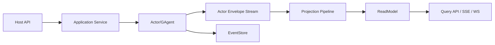

# Aevatar CQRS 架构（Maker 插件化后）

## 1. 目标

定义当前 CQRS 基线：

1. 写侧：`Application Command -> Actor Mailbox Message(EventEnvelope) -> Domain Event`
2. 读侧：`Projection -> ReadModel -> Query`
3. 插件：Maker 仅扩展 Workflow 模块，不新增第二套 CQRS 主链路

## 2. 顶层原则

1. Host 只做协议与组合，不做业务编排。
2. 命令执行必须走 CQRS Core 标准命令骨架，不允许每个 capability 私自拼一套 `resolve/ack/observe/finalize` 生命周期；同时不引入与 runtime 平行的命令总线壳层。
3. 读写分离保持单一事实源：`EventStore` 中的领域事件 + 投影读模型。
4. 中间层禁止维护 actor/run/session 事实态内存映射。

## 3. 项目分层

| 层 | 项目 | 职责 |
|---|---|---|
| CQRS Core | `Aevatar.CQRS.Core*` | 标准命令管线抽象、interaction/observation 模板、上下文策略、envelope/dispatch/receipt contract、输出流抽象 |
| Projection Core | `Aevatar.CQRS.Projection.*` | 投影生命周期、订阅、分发、协调 |
| Foundation/AI Projection | `Aevatar.Foundation.Projection` / `Aevatar.AI.Projection` | 通用读模型能力与 AI reducer |
| Workflow Projection | `src/workflow/Aevatar.Workflow.Projection` | Workflow 领域读模型与投影 |
| Maker Extension | `src/workflow/extensions/Aevatar.Workflow.Extensions.Maker` | 通过 `IWorkflowModulePack` 扩展模块，不承载独立 CQRS |

## 4. 主链路

口径澄清：

1. `EventEnvelope Stream` 是 runtime message stream，不是 Event Sourcing 的事实流。
2. Command 进入 Application 后，会被包装成 `EventEnvelope` 投递到目标 Actor 邮箱。
3. Actor 在自己的串行上下文里做决策，只有显式持久化的领域事件才进入 `EventStore`。
4. Projection 当前消费的是 Actor envelope 流，并把其中有业务语义的 payload 映射为 read model 与实时输出。

### 4.1 CQRS Core 统一命令骨架

CQRS 不应只提供零散 helper，而应定义所有 capability 复用的标准命令处理逻辑：

1. `Normalize Command`
   Host/Adapter 负责协议解析、鉴权、限流、基础校验，并把外部请求收敛为应用命令模型。
2. `Resolve Target`
   根据命令解析目标 actor 身份、创建/复用策略与必要的资源语义。
3. `Create CommandContext`
   统一分配 `commandId / correlationId / headers`，避免各子系统各自生成追踪语义。
4. `Build Envelope`
   把应用命令映射成统一 `EventEnvelope`，但 payload 的业务语义仍由 capability 自己定义。
5. `Dispatch via IActorDispatchPort`
   通过 `IActorDispatchPort` 完成 mailbox 语义下的 envelope 投递；目标 actor 的获取/创建与拓扑仍由 `IActorRuntime` 负责。
6. `Create Accepted Receipt`
   统一返回 `Accepted + commandId (+ actorId/correlationId)`，只承诺可追踪，不承诺 committed / observed。
7. `Observe Result`
   后续完成态统一走 read model 或 actor/session stream 观察，而不是在 command API 内私自拼装会话生命周期。

职责归属：

1. CQRS Core 应拥有 `Resolve Target / Context / Envelope / Dispatch / Receipt` 的通用抽象与默认实现。
2. Capability 只提供领域命令模型、目标解析规则、payload 映射与领域特有的观察模型。
3. Projection Core 只负责写后传播、读模型与实时观察，不回流承担命令入口语义。

现状映射：

1. `ICommandContextPolicy`、`ICommandEnvelopeFactory<TCommand>` 已经是 CQRS Core 抽象。
2. `DefaultCommandDispatchPipeline<TCommand, TTarget, TReceipt, TError>` 已把 `Resolve Target -> Context -> Envelope -> Dispatch via IActorDispatchPort -> Accepted Receipt` 串成标准命令骨架。
3. `ActorCommandTargetDispatcher<TTarget>` 通过 `IActorDispatchPort` 落地 runtime-neutral envelope 投递；`IActorRuntime` 继续负责目标 actor 的获取/创建与拓扑语义；对外交互入口统一收敛为 target-erased 的 `ICommandInteractionService<...>`。

### 4.2 下一阶段蓝图（IActorDispatchPort 投递 + CQRS Core 统一命令骨架）

当前基线仍是 `Host -> Application -> Actor` 直连执行。  
如果要继续按最佳实践演进，目标方向是：

1. `Endpoint` 只做 normalize / validate / auth / 应用层组合。
2. 外部命令继续使用统一 `Envelope` 载体，不强制拆不同物理 envelope 类型。
3. CQRS Core 统一承载 target resolve / command context / envelope build / dispatch port / accepted receipt。
4. Infrastructure 通过 `IActorRuntime` 获取/创建目标 actor，并通过 `IActorDispatchPort` 投递 envelope。
5. 命令主链路不再额外引入 ingress queue/stream。
6. 对外同步 ACK 只表示 dispatch 成功，不承诺 committed / observed。
7. 实时输出与读侧仍然通过 actor envelope stream + projection 观察。

详细蓝图见：

- [2026-03-09-cqrs-command-actor-receipt-projection-blueprint.md](architecture/2026-03-09-cqrs-command-actor-receipt-projection-blueprint.md)

## 5. 投影约束

1. CQRS 与 AGUI/SSE/WS 共用统一 Projection 输入链路。
2. 事件订阅以 reducer 的 `EventTypeUrl` 精确匹配为准。
3. 未命中 reducer 的事件必须为 no-op。
4. Workflow 投影生命周期通过 lease/session 句柄管理，不允许 `actorId -> context` 反查。
5. 同一 `EventEnvelope` 分发到多个 projector 时采用“一对多全分支尝试”语义：单个 projector 失败不阻断其他 projector 执行，最终以聚合异常统一回传。
6. 禁止 `Projection:ReadModel:Bindings` 与任何 BindingResolver 路由；投影存储路由统一由 `IProjectionStoreDispatcher` + Store Binding (`IProjectionDocumentStore` / `IProjectionGraphStore`) 决策。
7. Host 组合层按配置仅注册所需 provider 组合，不允许无条件并列注册 InMemory/Elasticsearch/Neo4j。
8. Projection materialization turn 只负责 committed fact 的 read model / artifact 物化；业务 continuation 不得注册进 materializer pipeline。需要由 committed fact 推进业务协议时，必须在业务模块内建模独立 observer/continuation actor，并通过标准 dispatch port 派发 command。

## 5.1 编排减重落地（当前实现）

1. CQRS 命令侧已统一为：
   `ICommandDispatchService<TCommand, TReceipt, TError>`（宿主入口） +  
   `DefaultCommandDispatchPipeline<TCommand, TTarget, TReceipt, TError>`（标准骨架） +  
   `ICommandTargetResolver<TCommand, TTarget, TError>`（目标解析） +  
   `ICommandTargetBinder<TCommand, TTarget, TError>`（target 绑定） +  
   `ActorCommandTargetDispatcher<TTarget>`（`IActorDispatchPort` dispatch） +  
   `ICommandReceiptFactory<TTarget, TReceipt>`（accepted receipt）。
2. Workflow 命令侧在此骨架上提供领域特化：
   `WorkflowRunCommandTargetResolver`（workflow source 解析） +  
   `WorkflowRunCommandTargetBinder`（projection/live sink 绑定） +  
   `WorkflowRunAcceptedReceiptFactory`（receipt） +  
   `ICommandInteractionService<WorkflowChatRunRequest, WorkflowChatRunAcceptedReceipt, WorkflowChatRunStartError, WorkflowRunEventEnvelope, WorkflowProjectionCompletionStatus>`（SSE/WS 交互入口） +  
   `DefaultDetachedCommandDispatchService<WorkflowChatRunRequest, WorkflowRunCommandTarget, WorkflowChatRunAcceptedReceipt, WorkflowChatRunStartError, WorkflowRunEventEnvelope, WorkflowRunEventEnvelope, WorkflowProjectionCompletionStatus>`（accepted-only facade，复用同一 command skeleton） +  
   `ICommandDispatchService<WorkflowResumeCommand, WorkflowRunControlAcceptedReceipt, WorkflowRunControlStartError>` / `ICommandDispatchService<WorkflowSignalCommand, WorkflowRunControlAcceptedReceipt, WorkflowRunControlStartError>`（run control 命令入口）。
3. Scripting 命令侧已形成同一套 CQRS 接入模型：
   `RuntimeScriptEvolutionInteractionService`（generic interaction facade） +  
   `ICommandInteractionService<ScriptEvolutionProposal, ScriptEvolutionAcceptedReceipt, ScriptEvolutionStartError, ScriptEvolutionSessionCompletedEvent, ScriptEvolutionInteractionCompletion>`（演化提案入口） +  
   `ScriptEvolutionCommandTargetResolver` / `ScriptEvolutionCommandTargetBinder` / `ScriptEvolutionEnvelopeFactory` / `ScriptEvolutionDurableCompletionResolver`（领域特化策略） +  
   `ScriptingActorCommandTarget + AddSimpleScriptingCommandDispatch<...>`（definition/runtime/catalog 命令统一骨架） +  
   `IScriptRuntimeProvisioningPort + RuntimeScriptProvisioningService`（runtime lifecycle 归 runtime 端口，命令链只负责 dispatch）。
4. Projection 端口实现已拆分为：
   `WorkflowExecutionProjectionPort`（投影端口） +  
   `WorkflowExecutionCurrentStateQueryPort` / `WorkflowExecutionArtifactQueryPort`（查询端口实现） +  
   `EventSinkProjectionLifecyclePortBase<>`（通用 session port 基类） +  
   `ProjectionSessionScopeActivationService<WorkflowExecutionRuntimeLease, WorkflowExecutionProjectionContext, WorkflowExecutionSessionScopeGAgent>`（激活） +  
   `ProjectionSessionScopeReleaseService<WorkflowExecutionRuntimeLease, WorkflowExecutionSessionScopeGAgent>`（释放） +  
   `ProjectionMaterializationScopeActivationService<WorkflowExecutionMaterializationRuntimeLease, WorkflowExecutionMaterializationContext, WorkflowExecutionMaterializationScopeGAgent>`（durable 激活） +  
   `ProjectionMaterializationScopeReleaseService<WorkflowExecutionMaterializationRuntimeLease, WorkflowExecutionMaterializationScopeGAgent>`（durable 释放） +  
   `ProjectionSessionEventHub<WorkflowRunEventEnvelope>`（session stream hub） +  
   `WorkflowProjectionReadModelUpdater`（读模型元信息） +  
   `WorkflowExecutionCurrentStateQueryPort` / `WorkflowExecutionArtifactQueryPort`（查询映射；query 直接实现 read adapter，不再复用通用 query-port 基类）。
5. CI 增加编排类体量守卫与 capability 边界守卫：关键编排类的非空行数与直接依赖数有上限，`workflow/scripting` 外部入口不得回退到私有 lifecycle 主链。

## 5.2 Envelope / Annotation 口径（防理解偏差）

1. `EventEnvelope.Propagation` 与 `EventEnvelope.Runtime` 属于包络级上下文，用于传播/追踪/投递，不作为业务完成语义主来源。
2. `StepCompletedEvent.Annotations` 属于业务事件注解，Maker/Connector/Parallel 等模块信息写入此处。
3. ReadModel 聚合使用 `StepCompletedEvent.Annotations`，并落到 step `CompletionAnnotations` 与 timeline `Data`；控制流语义则走 typed 字段。
4. 实时输出是否带业务 annotations 由 mapper 明确定义；当前默认不自动透传 `StepCompletedEvent.Annotations` 全量字段。

## 6. 宿主接入规范

当前宿主：

1. `src/Aevatar.Mainnet.Host.Api/Program.cs`
2. `src/workflow/Aevatar.Workflow.Host.Api/Program.cs`

接入约束：

1. 必须使用 `AddAevatarDefaultHost(...)` + `UseAevatarDefaultHost()`。
2. Mainnet 与 Workflow Host 必须接入 `builder.AddAevatarPlatform(...)`（统一装配 Workflow capability、Scripting capability、AI features 与 Workflow AI projection extension）。
3. Mainnet 通过 `builder.AddAevatarPlatform(options => { options.EnableMakerExtensions = true; })` 启用 Maker 插件。
4. 禁止 `AddMakerCapability()` 与 `/api/maker/*` 独立路由模型。

## 7. Runtime 口径

1. 当前默认 `ActorRuntime:Provider=InMemory`（开发/测试）。
2. `ActorRuntime` 不是额外的“第二套通道”，而是构建在 stream 之上的 Actor 语义层，负责寻址、激活、邮箱串行与拓扑。
3. 生产目标：分布式 Actor Runtime + 非 InMemory 持久化（state/event/read model）。
4. 本口径下 `InMemory` 与 `Actor Local` 均不作为架构扣分项。

## 8. 门禁与验证

最低验证：

1. `bash tools/ci/architecture_guards.sh`
2. `dotnet build aevatar.slnx --nologo`
3. `dotnet test aevatar.slnx --nologo`
4. `bash tools/ci/test_stability_guards.sh`

关键门禁：

1. 禁止 `GetAwaiter().GetResult()`
2. 禁止 `TypeUrl.Contains(...)` 路由
3. 禁止 Host/Infrastructure 直接 `AddCqrsCore(...)`
4. 禁止独立 Maker Capability 工程与路由回流
5. 强制 Mainnet 插件化装配 Maker
6. 默认全量测试只承载快速主链路；分钟级脚本自治演化回归独立执行，避免把慢测静默耗时混入常规门禁。
