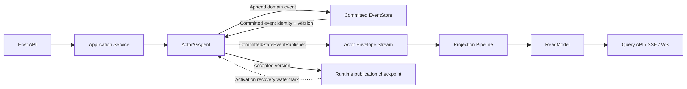

# Aevatar CQRS 架构（Maker 插件化后）

## 1. 目标

定义当前 CQRS 基线：

1. 写侧：`Application Command -> Actor Mailbox Message(EventEnvelope) -> Domain Event`
2. 读侧：`Projection -> ReadModel -> Query`
3. 插件：Maker 仅扩展 Workflow 模块，不新增第二套 CQRS 主链路

## 2. 顶层原则

1. Host 只做协议与组合，不做业务编排。
2. 命令执行必须走 CQRS Core 标准命令骨架，不允许每个 capability 私自拼一套 `resolve/ack/observe/finalize` 生命周期；同时不引入与 runtime 平行的命令总线壳层。
3. 读写分离保持单一事实源：`EventStore` 中的领域事件 + 投影读模型。
4. 中间层禁止维护 actor/run/session 事实态内存映射。

## 3. 项目分层

| 层 | 项目 | 职责 |
|---|---|---|
| CQRS Core | `Aevatar.CQRS.Core*` | 标准命令管线抽象、interaction/observation 模板、上下文策略、envelope/dispatch/receipt contract、输出流抽象 |
| Projection Core | `Aevatar.CQRS.Projection.*` | 投影生命周期、订阅、分发、协调 |
| Foundation/AI Projection | `Aevatar.Foundation.Projection` / `Aevatar.AI.Projection` | 通用读模型能力与 AI reducer |
| Workflow Projection | `src/workflow/Aevatar.Workflow.Projection` | Workflow 领域读模型与投影 |
| Maker Extension | `src/workflow/extensions/Aevatar.Workflow.Extensions.Maker` | 通过 `IWorkflowModulePack` 扩展模块，不承载独立 CQRS |

## 4. 主链路

```mermaid
%%{init: {"maxTextSize": 100000, "flowchart": {"useMaxWidth": false, "nodeSpacing": 10, "rankSpacing": 50}, "themeVariables": {"fontSize": "10px"}}}%%
flowchart LR
    API["Host API"] --> APP["Application Service"]
    APP --> ACT["Actor/GAgent"]
    ACT -->|"Append domain event"| ES["Committed EventStore"]
    ES -->|"Committed event identity + version"| ACT
    ACT -->|"CommittedStateEventPublished"| EVT["Actor Envelope Stream"]
    ACT -->|"Accepted version"| CP["Runtime publication checkpoint"]
    CP -.->|"Activation recovery watermark"| ACT
    EVT --> PROJ["Projection Pipeline"]
    PROJ --> RM["ReadModel"]
    RM --> Q["Query API / SSE / WS"]
```

口径澄清：

1. `EventEnvelope Stream` 是 runtime message stream，不是 Event Sourcing 的事实流。
2. Command 进入 Application 后，会被包装成 `EventEnvelope` 投递到目标 Actor 邮箱。
3. Actor 在自己的串行上下文里做决策，只有显式持久化的领域事件才进入 `EventStore`。
4. Projection 当前消费的是 Actor envelope 流，并把其中有业务语义的 payload 映射为 read model 与实时输出。
5. committed domain event 必须先进入 EventStore，再以 `EventEnvelope<CommittedStateEventPublished>` 进入同一 projection 主链；Runtime publication checkpoint 只记录投递进度，不定义业务事实。
6. activation 可在 checkpoint 后补发 committed fact；这是 write/runtime recovery，不是 query-time replay 或 projector 计算。

### 4.1 CQRS Core 统一命令骨架

CQRS 不应只提供零散 helper，而应定义所有 capability 复用的标准命令处理逻辑：

1. `Normalize Command`
   Host/Adapter 负责协议解析、鉴权、限流、基础校验，并把外部请求收敛为应用命令模型。
2. `Resolve Target`
   根据命令解析目标 actor 身份、创建/复用策略与必要的资源语义。
3. `Create CommandContext`
   统一分配 `commandId / correlationId / headers`，避免各子系统各自生成追踪语义。
4. `Build Envelope`
   把应用命令映射成统一 `EventEnvelope`，但 payload 的业务语义仍由 capability 自己定义。
5. `Dispatch via IActorDispatchPort`
   通过 `IActorDispatchPort` 完成 mailbox 语义下的 envelope 投递；目标 actor 的获取/创建与拓扑仍由 `IActorRuntime` 负责。具体 runtime adapter 默认不得在 dispatch 内追加目标 grain 存在性调用；例如 Orleans adapter 在 stream handoff 完成后即可返回 accepted，由 Orleans 在消费侧解析当前 activation。仅 recovery/control command 可通过强类型 `EnvelopeDispatchControl.RequireTargetActorAdmission` 要求 adapter 先进入目标 actor turn，并确认 inbox subscription，再执行 durable stream handoff；该模式只加强 admission 证据，不把 ACK 提升为 handled/committed/observed。
6. `Create Accepted Receipt`
   统一返回 `Accepted + commandId (+ actorId/correlationId)`，只承诺可追踪，不承诺 committed / observed。
7. `Observe Result`
   只有交互式 SSE/WS 等需要实时输出的入口才启动 `ICommandObservationLifecycle<TCommand,TTarget,TReceipt,TError>`。该阶段在 dispatch 前仅 attach 到已经存在、可确定寻址的 projection session/lease；不得同步 ensure/activate projection。cold session 或 attach 不可用时返回既有 projection pending/unavailable/disabled 类错误，命令不得进入 actor inbox，也不得发出 accepted receipt。dispatch-only 命令不启动 live observation，后续完成态统一走 read model 或 actor/session stream 观察，而不是在 command API 内私自拼装会话生命周期。

职责归属：

1. CQRS Core 应拥有 `Resolve Target / Context / Envelope / Dispatch / Receipt` 的通用抽象与默认实现。
2. Capability 只提供领域命令模型、目标解析规则、payload 映射、accepted receipt 映射与领域特有的观察模型。命令准备阶段不得启动 projection/read-model activation、live sink attach 或 session lease；`ICommandObservationLifecycle` 也只能 attach 已存在 session，不能 ensure/activate projection。
3. Projection Core 只负责写后传播、读模型与实时观察，不回流承担命令入口语义。

现状映射：

1. `ICommandContextPolicy`、`ICommandEnvelopeFactory<TCommand>` 已经是 CQRS Core 抽象。
2. `DefaultCommandDispatchPipeline<TCommand, TTarget, TReceipt, TError>` 已把 `Resolve Target -> Context -> Envelope -> Dispatch via IActorDispatchPort -> Accepted Receipt` 串成标准命令骨架；`PrepareAsync` 不做 projection/session attach。
3. `DefaultCommandInteractionService<TCommand,...>` 已把交互式入口串成 `Prepare -> Observe -> DispatchPrepared -> Accepted callback -> Pump -> Release`。`Observe` 使用 `ICommandObservationLifecycle<,,,>` attach 既有 observation session，失败时返回 start failure 且不 dispatch；dispatch 失败时由 target cleanup 释放已经附着的 observation。
4. `ActorCommandTargetDispatcher<TTarget>` 通过 `IActorDispatchPort` 落地 runtime-neutral envelope 投递；`IActorRuntime` 继续负责目标 actor 的获取/创建与拓扑语义；对外交互入口统一收敛为 target-erased 的 `ICommandInteractionService<...>`。

### 4.2 下一阶段蓝图（IActorDispatchPort 投递 + CQRS Core 统一命令骨架）

当前基线仍是 `Host -> Application -> Actor` 直连执行。  
如果要继续按最佳实践演进，目标方向是：

1. `Endpoint` 只做 normalize / validate / auth / 应用层组合。
2. 外部命令继续使用统一 `Envelope` 载体，不强制拆不同物理 envelope 类型。
3. CQRS Core 统一承载 target resolve / command context / envelope build / dispatch port / accepted receipt。
4. Infrastructure 通过 `IActorRuntime` 获取/创建目标 actor，并通过 `IActorDispatchPort` 投递 envelope。
5. 命令主链路不再额外引入 ingress queue/stream。
6. 对外同步 ACK 只表示 dispatch 成功，不承诺 committed / observed。
7. 实时输出与读侧仍然通过 actor envelope stream + projection 观察。

详细蓝图见：

- [2026-03-09-cqrs-command-actor-receipt-projection-blueprint.md](architecture/2026-03-09-cqrs-command-actor-receipt-projection-blueprint.md)

## 5. 投影约束

1. CQRS 与 AGUI/SSE/WS 共用统一 Projection 输入链路。
2. 事件订阅以 reducer 的 `EventTypeUrl` 精确匹配为准。
3. 未命中 reducer 的事件必须为 no-op。
4. Workflow 投影生命周期通过 lease/session 句柄管理，不允许 `actorId -> context` 反查。
5. 同一 `EventEnvelope` 分发到多个 projector 时采用“一对多全分支尝试”语义：单个 projector 失败不阻断其他 projector 执行，最终以聚合异常统一回传。
6. 禁止 `Projection:ReadModel:Bindings` 与任何 BindingResolver 路由；投影存储路由统一由 `IProjectionStoreDispatcher` + Store Binding (`IProjectionDocumentStore` / `IProjectionGraphStore`) 决策。
7. Host 组合层按配置仅注册所需 provider 组合，不允许无条件并列注册 InMemory/Elasticsearch/Neo4j。
8. 持久投影 scope 的激活由 committed-state publication owner hook 触发：Actor 完成 domain event commit 并构造 `EventEnvelope<CommittedStateEventPublished>` 前，Foundation 调用 `ICommittedStatePublicationHook`，Projection Core 根据精确的 actor type 与 state event descriptor 生成 `ProjectionScopeStartRequest` 并分发给已有 `IProjectionScopeActivationService<TLease>`。命令入口不得同步调用 projection activation facade，也不得新增 actor/lifecycle phase 来“预热”读模型。warm path 只能信任绕过进程内缓存的 authoritative source+target relay evidence；该 evidence 必须精确匹配 `HandleThenForward`、空 direction filter、唯一 `CommittedStateEventPublished` filter、scope actor 实际 kind，以及 actor-owned 的非零 activation generation，命中后不得再调用 actor runtime、kind verifier 或 dispatch ensure。cold path 必须同步创建/修复 scope、验证 kind、投递 ensure 并等待同一 exact evidence 可见，任何失败都 fail closed，不得 fire-and-forget 或 timeout 后继续 publication。唯一滚动兼容例外是旧节点写入、尚无 kind/generation 字段的 relay：它不得命中 warm path，且必须先由当前调用通过 expected kind 创建或 verifier 获得 ownership proof；若 authoritative legacy evidence 在 dispatch 前已经存在，当前节点先用唯一 `LeaseId` challenge 覆写同一转发形态，只有 scope owner 随后的 activate/ensure 把 challenge 重写回空 `LeaseId` legacy 形态，或写出 exact evidence，才可返回。单纯 dispatch admission 不是 handled/committed proof；后续调用继续走 cold path，直到兼容节点把 relay 收敛为 exact evidence。Orleans topology grain 的既有 RPC surface 不得为该 lookup 增加方法；authority 必须通过无进程缓存的既有 snapshot RPC 读取。active durable scope 的分布式 observation relay 必须跨普通 runtime deactivate 保留，只能由显式 scope release 删除；release 返回前必须通过同一 authoritative source+target lookup 确认 evidence 已消失。activation 或 relay publish 失败必须向 committed publication 回传，使 durable checkpoint 不前移并保留同一 committed event identity 的恢复机会。
9. Projection scope 的 repair backlog 由 scope actor 权威持有，完整失败记录、异常原因与 `EventEnvelope` 只允许保留在 actor state / event store 中供 replay，不得进入 committed-state observation。对外发布 `CommittedStateEventPublished` 前，publication hook 必须在副本中从权威 failure 列表重新计算强类型 `ProjectionScopeFailureSummary`，清除失败事件的 reason/envelope，并把每条 `ProjectionScopeState.failures` 替换为只含重试状态与最早时间的等量滚动升级兼容占位；新 status projector 必须优先读取 summary，旧消息无 summary 时才从 failures 回退。单次滚动发布期间不得截断该兼容列表，否则旧 projector 会持久化错误计数；只有所有 reader 已支持 summary 后，后续版本才可移除该兼容编码。该净化不得回写或裁剪权威 backlog。历史 pending publication 必须在同一 event id / version 下经过相同净化后重试并推进原 checkpoint，禁止为绕过超限伪造新版本。scope 激活或 committed publication 恢复后若仍有未耗尽自动重试的 retained failures，actor 必须向自身 inbox 发布 `ReplayProjectionFailuresCommand` continuation 并自动重放该批 envelope；已经耗尽的 failure 只允许通过显式 operator replay 再次尝试，不得在每次激活时形成自动重试循环。一次 failure replay 若成功物化 exact `sourceActorId + sourceVersion + eventId`，必须同时清除该坐标下所有重复 failure，包括其中已耗尽的重复记录；不得跨坐标清 hole。部署不会枚举 dormant scope，因此 host-owned failure recovery reconciler 必须逐页扫描 `ProjectionScopeStatusDocument` 中 active、未 release 且存在 unresolved failure 的候选，直到 reader cursor 结束，再向 scope actor 投递 typed automatic replay command；不得使用 restart-at-zero 的全局候选上限让尾部 scope 饥饿。readmodel 只负责候选发现，是否 replay 仍由 actor state 决定，query API 不得触发该 reconciler 或 activation。若 actor-owned manifest 出现领域转换无法产生的 `active=false + released=false`，automatic replay 也只能在同一 actor 同时持有 durable mode、完整 staged source/envelope、retained failures 与非空 scope identity 时，通过新的 committed `ProjectionScopeStartedEvent` 递增 activation generation、重建 relay/attachment 后继续 in-flight recovery；released、session mode、身份或 staged evidence 不完整时必须 fail closed，禁止把 readmodel 的 active 标志反写为权威事实。若 runtime identity 与 durable relay kind evidence 同时不可用，replay service 只能在 authoritative relay 确认无记录时采用能力模块显式注册、与 exact `ProjectionKind + Mode` 匹配且结果唯一一致的 Agent Kind 恢复 projection scope；非空 relay 形态无效、resolver 缺失或结果冲突时必须 fail closed，禁止从 actor id 字符串或 readmodel 内容猜测实现类型。自动 replay 以候选观察到的 scope committed `StateVersion` 为 actor-owned admission token，同一版本只消费一次；admission event 与每条 replay 结果都会推进权威版本，使 admission 后崩溃或超过单批上限的 backlog 可由后续版本继续。不得要求运维或用户手工 replay 才能让仍可自动恢复的已提交终态进入 readmodel。若基础设施恢复后仍残留唯一坐标的 exhausted failure，只能由管理员经审计 POST 发送独立 TypeUrl 的 `ReplayRetryExhaustedProjectionFailuresCommand`；Host endpoint 只负责鉴权、HTTP DTO 与状态码适配，readmodel manifest 预检、canonical scope identity 校验和 command dispatch 必须收口到 CQRS repair service。命令必须携带 expected scope version、unresolved/exhausted count、batch size、request id、reason 与 requester subject，scope actor 在同一 turn 以权威状态逐项精确校验后才允许只重放 exhausted failure，HTTP 同步回执仅承诺 accepted for dispatch。
10. Elasticsearch projection schema-drift 的唯一权威是 provider 生成的 augmented mapping fingerprint 与稳定 alias lifecycle。query resolver / query reader / consistency probe 不得读取 live ES mapping 作为第二真相，也不得触发 repair / reindex；write-side `UpsertAsync -> EnsureIndexAsync` 只处理 greenfield / legacy bare lifecycle，遇到单一旧 fingerprint 或多 backing drift 必须 fail closed，不能 `_reindex` 或切 alias。alias 指向单一旧 fingerprint physical index 的 clean migration 只能由静态 provider-local startup reconcile（`IProjectionIndexReconcileTarget.ReconcileIndexAsync`）创建 expected physical、执行 old-to-new reindex、确认无 failures / timeout 后用一次 `_aliases` 原子切换；dynamic index scope 不参与 startup reconcile，不获得 clean drift migration。alias 多 backing、source 缺失、不兼容 mapping、reindex failure / timeout、partial copy 或非 static reconcile 路径仍必须 fail closed。
11. commit publication 是 at-least-once：current-state projector 必须以 `actorId + authoritative StateVersion` 做单调幂等覆盖，artifact/audit consumer 必须以 committed event identity 做幂等键；不得依赖 envelope 只出现一次。
12. Runtime fleet capability gate 只由固定 Authority actor 的 committed state 投影为 actor-scoped current-state document。Admission reader 只能读取该 document，验证唯一 exact gate、authoritative state version、membership freshness/digest/deployment 与所有 active member 的 typed capability advertisement，再产生 freshness-bearing admission proof；query/read path 不得回调 Authority、读取 runtime 偶然结构、触发 reconcile 或 projection priming。
13. Projection graph 当前采用明确的无限期保留契约：workflow run 与 script-native graph 在其 committed facts 保留期间持续可查询，archive/terminal 不触发删除，也不存在 query-time cleanup。容量、增长预测、告警阈值和未来有限保留的 hard gate 见 [Projection Graph Retention and Capacity](../operations/projection-graph-retention.md)。有限保留若被批准，必须由 typed committed retirement fact 和 durable actor-owned cleanup 驱动，禁止用字符串状态、进程内 owner registry 或读路径副作用实现。
14. `ProjectionScopeStatusDocument` 的写入者继续由 source projection scope actor 的 `ProjectionScopeState.status_route` 权威决定，status document 只复制该决定，writer 不得反读 document 选择路由。#3476 采用 **Phase-A quiescence bridge + Phase-B activation seal** 的前滚 cutover：
    1. 已持久化 route contract 保持 `PROJECTION_SCOPE_STATUS_TERMINAL_V2` / `aevatar.projection.scope-status-terminal.v2` / version 2；Phase-A 二进制不再广播该 live-admission contract，而是对同一 capability 精确广播独立 bridge contract `aevatar.projection.scope-status-terminal.quiescence.v1` / reader 3。reader-2 V2 与 reader-3 bridge 的混合 fleet 在旧、新 Authority 上都不能形成 exact unanimity，既有 V2 OPEN 必须关闭；只有全部 active member 精确广播 bridge contract 时，新 Authority 才先提交 `REVOKED` / `capability_epoch = long.MaxValue` compatibility tombstone，再提交 typed `QUIESCED` / max marker。`PROJECTION_SCOPE_STATUS_TERMINAL_V3` 在 Phase-A artifact 中仅作 Phase-B 协议预声明，不 advertise、不 manage，也不形成 OPEN admission。
    2. Authority 对有效 membership 的 committed publication 顺序必须是全部 gate close/refresh/open transition → reconciliation record → membership observation；membership 缺失或无效时必须是 revocation → reconciliation record。每个 event 都带独立 `state_root`，因此禁止先发布 reconciliation/membership 再关闭旧 OPEN gate。
    3. `RuntimeFleetCapabilityAdmission` 只表达当前 membership 上 freshness-bearing 的 OPEN grant。`QUIESCED` 通过独立 `RuntimeFleetCapabilityQuiescenceEvidence` reader 暴露：它必须来自 Authority state 中 typed QUIESCED marker，历史 `REVOKED/max` tombstone 不可推导成 receipt。该 evidence 包含 Authority id/state version、max epoch、精确 bridge contract、reader 3，以及 quiesce 时的 membership/transition 信息；current membership/deployment revision 变化后仍可读，但绝不充当 Phase B 的 live admission。
    4. Phase A 不创建、不升级、不回滚任何新的 status route。无 route 或 legacy steady state 只 ensure legacy writer；ACTIVE/phase-less terminal route 继续服务并只修复当前 relay/materializer，`REVOKED` 不触发 rollback。既有 WARMING/BLOCKED route 在 receipt 前冻结，writer 不得发送可推进 continuation；receipt 后仅恢复这些已持久化 cutover：WARMING 重建 candidate relay/writer，首次提交独立 `warming_probe_version` 并清除旧 caught-up proof，后续 retry 只重发同一持久化 fence，避免延迟的 exact writer/direct publisher 报告永远追不上移动水位；BLOCKED 同时重建 candidate 与 previous writer、恢复 source-owned relays，保留原始 `blocked_version`，首次提交独立 `drain_probe_version` 并清除旧 release flag，后续 retry 同样只重发该 fence。release command 必须携带 exact writer identity、route epoch 与 `max(blocked_version, drain_probe_version)`；只有 previous writer 已持久化 drain 且返回认证 confirmation 后才移除其 relay 并切为 ACTIVE。release 先于 forwarded probe、actor/relay 缺失、confirmation 丢失或重启都通过同一 receipt-gated repair 重试，不能把 dispatch acceptance 当 drain proof。source 的 BLOCKED observation 继续以 runtime-retryable failure 拒绝。
    5. Phase A 只能按前滚顺序部署：typed QUIESCED 提交后禁止重新引入 reader-2 Authority/source binary。旧 Authority replay 会忽略未知 typed event，只重建 `REVOKED/max` 并可能把该降级状态 snapshot/compact；其 checked reopen 会 overflow 并阻断整批 reconciliation。旧 source binary 若在 mixed rollout 期间继续持有已有 WARMING/BLOCKED actor，或在 quiescence 后被重新引入，仍可能执行旧 continuation；当前 artifact 没有能从新二进制一侧完全封死该行为的 activation/placement seal。Phase B 必须先证明 fleet 中不存在可激活旧 Authority/source 的 binary，以 V3 的精确新 contract 获取 fresh OPEN gate，再启用新 route adoption、upgrade、rollback 与 cleanup；不得把 Phase A 表述成 rollback-safe 或 issue 已修复。
    6. 既有 writer-side safety 不因 Phase A 降级：`ProjectionScopeStatusDocument` 的 route epoch fence 仍在同一 source version 上只允许更高 epoch takeover；terminal steady-state 只消费 source 的 `CommittedStateEventPublished`，transient failure 先提交 actor-owned deferred write；Conflict/Gap 在 observed path 作为 runtime-retryable failure 穿透 provider boundary，不能静默推进 checkpoint；retry callback 必须同时匹配 source coordinate 与 exact attempt。
    7. Phase B 不改变已持久化的 V2 route contract；它新增独立的 live capability `PROJECTION_SCOPE_STATUS_TERMINAL_V3` / `aevatar.projection.scope-status-terminal.activation-seal.v1` / reader 4。只有同时具备 active older-schema turnover 的 runtime adapter 才能广播该 capability：Orleans 支持并广播，Local runtime 不广播。Authority schema 0 只管理并完成 V2 bridge quiescence，绝不管理 V3；其 runtime identity 以 exact V2 QUIESCED evidence 原子迁移到 schema 1 后，Authority 才可在 committed V2 prerequisite 仍成立且 active membership 对 reader 4 精确全员一致时 OPEN V3。fresh cluster 因此先产生 quiescence、再 turnover/migrate Authority、最后打开 V3，不形成自举循环。
    8. Phase-B schema seal 绑定 runtime identity，不修改业务 state shape：普通 durable materialization source 与 legacy shadow writer 采用 schema 1，terminal writer 采用 schema 1；已经占用 schema 1 做 incremental-graph adoption 的 workflow execution source 采用连续的 `0 -> 1 -> 2` migration。每个 migration receipt 必须记录 exact capability、contract、reader revision 与 `OPEN`/`QUIESCED` evidence status；只有 Authority bridge migration 可以消费 historical QUIESCED evidence，其余 status actors 必须消费 fresh V3 OPEN admission。
    9. Orleans 在 active actor 处理下一条 envelope 前重验是否存在 admitted migration；若 actor 仍是旧 schema，则本 turn 不进入 agent handler，而是请求 deactivate 并以 runtime-retryable turnover failure 让原 envelope 重投。下一 activation 先原子写入 migrated snapshot/schema/receipt，再构造 agent。旧 binary 读取到高于自身支持版本的 sealed row 必须 fail closed；不得反序列化或运行旧 handler。
    10. 新建或恢复 status cutover 前，source 必须先持久化 preparation，并收齐 source、legacy writer、terminal writer 三个 exact actor-role seal。source seal 来自自身 runtime schema context；两个 writer seal 只能由 exact direct publisher 在 handler 中读取各自 schema context后回复，dispatch acceptance 不算 ready。seals 的 actor id、agent kind、schema version、receipt capability/contract/revision/evidence 必须全部匹配；随后 source 重新读取 fresh V3 admission 与 V2 quiescence，才可新建 WARMING route，或把 seals 绑定到历史 WARMING/BLOCKED route 后继续。任一 reader/runtime/dispatch/registry 依赖缺失、receipt spoof/stale、membership change 或 V3 revoke 都 fail closed 并保留原 route/relay。
    11. V3 schema adoption 是 forward-only deployment boundary。任一 Authority/source/writer row 已写入 Phase-B schema receipt 后，reader 4 binary 成为该环境永久最低回滚版本；Phase-A reader 3、旧 reader 2 及更早 binary 均不得重新加入 membership，也不得作为 rollback target。合法 rollback 只允许仍实现 exact reader-4 activation seal、active-turnover 和 newer-schema refusal 的 V3+ binary。dormant schema-0 source 无需全量扫描，但首次收到 envelope 时必须只落到 V3+ runtime 并在 handler 前迁移；部署系统必须把低于该 floor 的 image/member admission 作为硬拒绝，而不是依赖 V3 gate 的最终一致 revoke。若该准入门禁无法保证，禁止启用 Phase-B cutover。
    12. Phase-B seal 只解决 binary/schema ownership，不替代 per-source route authority、drain watermark、same-version epoch takeover 或 provider redelivery。ACTIVE terminal route、历史 WARMING/BLOCKED repair、legacy cleanup 与 rollback 仍必须服从同一 source-owned route epoch；Conflict/Gap、unproved route mismatch 和基础设施失败仍须越过 runtime boundary 触发 redelivery，或先提交 actor-owned durable retry。

### 5.1 Projection-driven Split / Merge / Re-key

Projection-driven bootstrap 只服务 actor 事实拥有者变化的演进：split、merge、re-key、replace。它不是查询优化，也不是 lazy state migration 的替代品。完整 actor 演进判定树见 [actor-evolution.md](actor-evolution.md)。

v1 non-goal：复杂 owner-change bootstrap（split / merge / re-key / replace 的生产级编排、批量迁移、回滚与清理策略）不在 v1 范围内，延后到 v2 设计。v1 只锁定边界：查询与 read adapter 不允许通过 query-time replay、临时 state rebuild、projection materialization 或 projection priming 来补齐这类 owner-change 场景。

口径：

1. Split：旧 actor 的 committed fact 通过 projection materialize 出 bootstrap 输入；新 actor 必须提交自己的 domain event 后才成为新事实拥有者。
2. Merge：多个旧 actor 的 committed fact 只能作为 bootstrap 输入；聚合后的事实必须由新的 aggregate actor 拥有。
3. Re-key：旧 key 到新 key 的关系必须显式建模为 re-key redirect；调用方不得解析 actorId 字符串或把追踪 ID 当目标身份。
4. Replace：旧 owner 不再承载当前业务事实时，新 actor 必须提交自己的 domain event；旧 actor 只能通过显式 retire cleanup 退出。
5. Retire cleanup：旧 actor / 旧 readmodel / 旧索引的退役必须有显式清理语义，不能留给 query path 做“如果旧数据还在就忽略”的临时判断。
6. Bootstrap 输入只来自 committed domain event、committed state publication 或同源 durable feed；不得订阅 command、self continuation 或 actor 内部 state mirror 临时结构推测完成态。

禁止项：

1. 禁止 query-time replay / bootstrap：query 方法不得读取 `IEventStore`、重放事件、临时重建 actor state 或补跑 projection 后再返回。
2. 禁止 query-time priming：query/read adapter 不得激活 projection、ensure session、创建 actor、修复 index 或触发生命周期操作。
3. 禁止把 bootstrap 当成新的 core phase：本口径不新增 envelope kind、pipeline phase、actor 类型或 proto 字段；它只约束现有 projection materialization 与 actor-owned fact 的使用方式。
4. 禁止用 readmodel 反向定义业务事实：readmodel 只证明某个权威版本已物化可见，不决定 split / merge / re-key 的业务完成。

## 5.2 编排减重落地（当前实现）

1. CQRS 命令侧已统一为：
   `ICommandDispatchService<TCommand, TReceipt, TError>`（宿主入口） +
   `DefaultCommandDispatchPipeline<TCommand, TTarget, TReceipt, TError>`（标准骨架） +
   `ICommandTargetResolver<TCommand, TTarget, TError>`（目标解析） +
   `ICommandObservationLifecycle<TCommand, TTarget, TReceipt, TError>`（交互式 live observation 启动） +
   `ActorCommandTargetDispatcher<TTarget>`（`IActorDispatchPort` dispatch） +
   `ICommandReceiptFactory<TTarget, TReceipt>`（accepted receipt）。
2. Workflow 命令侧在此骨架上提供领域特化：
   `WorkflowRunCommandTargetResolver`（workflow source 解析） +
   `WorkflowRunObservationLifecycle`（attach-only projection/live sink 绑定；不做 pre-dispatch activation） +
   `WorkflowRunAcceptedCommandTargetResolver`（accepted-only receipt 路径） +
   `WorkflowRunAcceptedReceiptFactory`（receipt） +
   `ICommandInteractionService<WorkflowChatRunRequest, WorkflowChatRunAcceptedReceipt, WorkflowChatRunStartError, WorkflowRunEventEnvelope, WorkflowProjectionCompletionStatus>`（SSE/WS 交互入口） +
   `DefaultCommandDispatchService<WorkflowChatRunRequest, WorkflowRunAcceptedCommandTarget, WorkflowChatRunAcceptedReceipt, WorkflowChatRunStartError>`（accepted-only facade，复用同一 command skeleton，不持有 live sink） +
   `ICommandDispatchService<WorkflowResumeCommand, WorkflowRunControlAcceptedReceipt, WorkflowRunControlStartError>` / `ICommandDispatchService<WorkflowSignalCommand, WorkflowRunControlAcceptedReceipt, WorkflowRunControlStartError>`（run control 命令入口），以及 `ICommandDispatchService<WorkflowForkRunCommand, WorkflowForkRunAcceptedReceipt, WorkflowForkRunStartError>`（fork/run resume-from-step 命令入口）。
3. Scripting 命令侧已形成同一套 CQRS 接入模型：
   `RuntimeScriptEvolutionInteractionService`（generic interaction facade） +
   `ICommandInteractionService<ScriptEvolutionProposal, ScriptEvolutionAcceptedReceipt, ScriptEvolutionStartError, ScriptEvolutionSessionCompletedEvent, ScriptEvolutionInteractionCompletion>`（演化提案入口） +
   `ScriptEvolutionCommandTargetResolver` / `ScriptEvolutionObservationLifecycle` / `ScriptEvolutionEnvelopeFactory` / `ScriptEvolutionDurableCompletionResolver`（领域特化策略） +
   `ScriptingActorCommandTarget + AddSimpleScriptingCommandDispatch<...>`（definition/runtime/catalog 命令统一骨架） +
   `IScriptRuntimeProvisioningPort + RuntimeScriptProvisioningService`（runtime lifecycle 归 runtime 端口，命令链只负责 dispatch）。
4. Projection 端口实现已拆分为：
   `WorkflowExecutionProjectionPort`（投影端口） +  
   `WorkflowExecutionCurrentStateQueryPort` / `WorkflowExecutionArtifactQueryPort`（查询端口实现） +  
   `EventSinkProjectionLifecyclePortBase<>`（通用 session port 基类） +  
   `ProjectionSessionScopeActivationService<WorkflowExecutionRuntimeLease, WorkflowExecutionProjectionContext, WorkflowExecutionSessionScopeGAgent>`（激活） +  
   `ProjectionSessionScopeReleaseService<WorkflowExecutionRuntimeLease, WorkflowExecutionSessionScopeGAgent>`（释放） +  
   `ProjectionMaterializationScopeActivationService<WorkflowExecutionMaterializationRuntimeLease, WorkflowExecutionMaterializationContext, WorkflowExecutionMaterializationScopeGAgent>`（durable 激活） +  
   `ProjectionMaterializationScopeReleaseService<WorkflowExecutionMaterializationRuntimeLease, WorkflowExecutionMaterializationScopeGAgent>`（durable 释放） +  
   `ProjectionSessionEventHub<WorkflowRunEventEnvelope>`（session stream hub） +  
   `WorkflowProjectionReadModelUpdater`（读模型元信息） +  
   `WorkflowExecutionCurrentStateQueryPort` / `WorkflowExecutionArtifactQueryPort`（查询映射；query 直接实现 read adapter，不再复用通用 query-port 基类）。
   `WorkflowExecutionMaterializationScopeGAgent` 保持既有 materialization kind，并以 schema v1 的纯 clone migration 绑定 `ProjectionIncrementalGraphV1` fleet admission；durable in-flight observation recovery 只在 runtime-owned schema context 含唯一 exact v1 adoption receipt 时启用。任何后续普通 observation 在准入前，都必须由 scope actor 使用持久化 envelope 在当前串行 turn 内先恢复已有 in-flight observation 并推进 watermark；不得依赖 transport redelivery 顺序或等待 actor 重新激活。adoption receipt 只充当 activation fence；graph route 与 cutover phase 仍由 scope actor 的 protobuf 持久态唯一拥有。通过 fence 后，scope actor 才能推进 `Requested -> CandidateBuilt -> GoldenVerified -> Activated`：在隔离的 v2 physical namespace 做有界 full candidate、校验 report 的精确 `StateVersion + LastEventId` 与 golden graph、重新读取 fresh fleet admission proof，最后以 committed scope event 单调切换 route epoch。candidate 过期会回到 `Requested`，不会在 query path 修复。显式 rollback 复用同一 saga：`RequestProjectionMaterializationCutoverCommand` 只能指定不同的 versioned physical namespace 和紧邻的下一 route epoch；目标 namespace 必须重新追平当前 authoritative report 并通过 golden/fleet 校验后才能成为唯一 active route。
   激活后，report 与 graph 是同一 committed-event Projection Pipeline 内的两个独立完成条件：report 继续按已发布的权威版本物化；graph 使用 owner-scoped `ProjectionGraphDelta` 原子提交 mutation 与 source coordinate。actor 的一次 committed state publication 可以在批量提交后合法跨越多个 state version，因此 graph normal delta 遇到 `Gap` 时不得无限重放同一增量，也不得放宽 store 的连续增量门禁；materializer 必须从当前已提交 report 构造有界 `RepairOrCutover` full candidate，在同一投影 turn 内完整覆盖到该权威版本。若 full candidate 已提交但 scope watermark 尚未提交，重放先生成 normal delta 时会因相同 event id 已绑定 full candidate 而得到 `EventIdConflict`；materializer 只能重建同一 full candidate，并且只有 store 返回 `ExactDuplicate` 才可视为已收敛，候选内容不同仍保持 conflict。report exact duplicate 不得跳过 graph 重试，graph exact duplicate 用于恢复“graph 已提交、scope watermark 尚未提交”的 crash boundary；所有修复都留在 committed-event materialization 路径，query 不得触发。普通非图事件只更新 run/version node；step/topology 事件只更新被触及的有界节点/边；未触及元素保留此前 timestamp，candidate 初建元素统一采用该 report 的 `UpdatedAt`。`NEXT` 使用 source-step 稳定 edge id，目标缺失时以 typed pending edge 保存，并在目标节点出现后 promotion；rewire 复用同一 edge id。
   Graph export query 由 scope actor 的 committed route（物化在 `ProjectionScopeStatusDocument.active_materialization_route`）决定读哪一个 store，这是 route-directed read，不是 fallback：status document 缺失或 route 仍是 compatibility/legacy route，说明该 owner 从未 cutover，其 graph 只存在于 legacy scope graph store，query 继续从 legacy `IProjectionGraphStore` 读取（与 incremental route 出现前完全一致，返回 DTO 不带 route fingerprint）；route 是 incremental route 时先读 atomic owner snapshot、再复读 status route，route epoch 变化、snapshot route 不匹配、source provenance 缺失或 snapshot 缺失都 fail closed，禁止回退 legacy graph、dual-read merge、query-time replay、priming 或 repair。incremental route 下返回 DTO 显式携带 route fingerprint 与精确 source coordinate。versioned subgraph 的 `take` 是 edge 预算：按 snapshot 稳定 edge id 顺序逐层（BFS，按 inbound / outbound / both 方向）选取至多 `take` 条端点均存在于 snapshot 的 edge，返回 nodes 恰为 root 加所有已返回 edge 的端点（至多 `take + 1` 个），任何返回 edge 的 `fromNodeId` / `toNodeId` 都必须出现在返回 nodes 中，遍历结果确定。
   Incremental delta 每次都幂等 upsert root actor node、run node 与 `OWNS` edge（有界常量），因此在 scope 已 cutover 之后开始的新 run 也能从其 actor 可达；`WorkflowCommandObservedEvent` 是唯一改变 `LastCommandId`（因而重键整张 owner graph）的 committed fact，incremental route 在该事件上执行一次 bounded full replacement（`RepairOrCutover` mode），其余事件保持 O(touched) delta。`RepairOrCutover` delta 的语义是“upsert 集合即完整期望 owner graph”：store 在同一 apply 事务内（owner-state lock 之下）删除该 owner 所有不在期望集合中的 node / live edge / pending edge（node id 与 edge id 是各自独立的身份空间，同一 token 可同时命名一个 node 和一个 edge，按类别分别对账），并在形成 effective delta 之后、任何 mutation 之前校验 upserts + explicit deletes + 生成的 stale deletes 的总数不超过 `ProjectionGraphDeltaContract.MaximumRepairOrCutoverMutationCount`（20 000，materializer 与 store 单一常量）：超限以 `MutationBoundExceeded` 原子拒绝（watermark、snapshot、event id 绑定均不变；duplicate / conflict 判定仍先于该校验执行），producer 不得读 pre-write snapshot 推导 delete 列表——delta fingerprint 因此只由 report 等稳定输入决定，graph 已提交但 scope watermark / CandidateBuilt phase 未落盘时的重放收敛为 `ExactDuplicate`，同一 eventId 但期望 graph 不同仍为 `EventIdConflict`；InMemory 与 Neo4j 语义一致（conformance suite `AssertRepairReplacementAsync`）。Neo4j provider 为 relationship 建立 `(scope, edgeId)` RANGE index，使 delta 内按 edge id 的读取/删除/rewire 都是 index seek；为 EdgeIdentity 建立并等待 ONLINE 的 `(physicalNamespace, projectionOwnerId)` RANGE index，使 repair/cutover 的 owned-element 读取与 owner snapshot 读取按 owner seek；`ApplyDeltaAsync` 与 legacy write 一样经过 provider-local write telemetry（operation=`apply_delta`，result 为有界 disposition 名），nodeCount/edgeCount 为本次 delta 的 mutation 数。
5. CI 增加编排类体量守卫与 capability 边界守卫：关键编排类的非空行数与直接依赖数有上限，`workflow/scripting` 外部入口不得回退到私有 lifecycle 主链。

## 5.3 Envelope / Annotation 口径（防理解偏差）

1. `EventEnvelope.Propagation` 与 `EventEnvelope.Runtime` 属于包络级上下文，用于传播/追踪/投递，不作为业务完成语义主来源。
2. `StepCompletedEvent.Annotations` 属于业务事件注解，Maker/Connector/Parallel 等模块信息写入此处。
3. ReadModel 聚合使用 `StepCompletedEvent.Annotations`，并落到 step `CompletionAnnotations` 与 timeline `Data`；控制流语义则走 typed 字段。
4. 实时输出是否带业务 annotations 由 mapper 明确定义；当前默认不自动透传 `StepCompletedEvent.Annotations` 全量字段。

## 5.4 Workflow normalized fork seed

`WorkflowExecutionCurrentStateDocument.normalized_fork_seed` 是 `workflow.run` committed normalized execution state 的 typed 查询副本。Projector 只 capture actor 已提交的 canonical values、bindings、completed ledger 与 current input reference，不在读侧推导第二套执行状态机。

1. Normalized document 的 query mapper 可以展开兼容 `Variables / CompletedStepIds` 供既有查询 DTO 使用，但 fork command handoff 必须保留 typed seed，不能把展开后的字符串 map 当权威输入。
2. Caller overrides 与 normalized seed 分字段传输；目标 kernel 验证引用完整性后应用 overrides，禁止同一 fork seed 同时携带 normalized values 与 expanded legacy variables。
3. Legacy document 未携带 `normalized_fork_seed` 时，继续读取既有 fork seed variables/completed ids。Projection 不为 legacy state 制造 canonical value identity 或 provenance。
4. 该扩展仍遵守 current-state 单调覆盖与 query-time priming 禁止项；fork 查询只读已物化的权威版本，不同步 replay actor events 或刷新投影。

## 5.5 Workflow read model 显式 index mapping

Workflow read model 的 Elasticsearch mapping 由各自的 `IProjectionDocumentMetadataProvider`（`src/workflow/Aevatar.Workflow.Projection/Metadata/`）显式声明，不依赖 dynamic mapping 碰巧得到可查询的字段：query port / reconciler / startup guard 会 filter、search 或 sort 的字段一律显式 `keyword` / `date`（proto enum 以 protobuf-JSON 名称存储并按 `keyword` 精确匹配，filter 值必须用 `ProjectionDocumentValue.FromProtoEnum` 生成同一形式，InMemory 与 Elasticsearch 由此口径一致）；opaque payload 文本（workflow yaml、input / output / error、prompt、tool arguments 等）`text` + `index:false`，只进 `_source` 不进倒排；从不查询的子树（admission plan、connector approval、input file refs、failed attempt / vote / file 材料）与所有 proto map 是 `object` + `enabled:false`。任何 mapping 变化都会改变 provider 的 schema fingerprint，并只通过既有 fingerprint / reindex / alias lifecycle（startup reconcile）滚动上线，禁止 query-time 修复；`test/Aevatar.Workflow.Host.Api.Tests/WorkflowReadModelEffectiveMappingTests.cs` 审计 augmented 后的有效 mapping 并 pin 当前 fingerprint。

## 6. 宿主接入规范

当前宿主：

1. `src/Aevatar.Mainnet.Host.Api/Program.cs`
2. `src/workflow/Aevatar.Workflow.Host.Api/Program.cs`

接入约束：

1. 必须使用 `AddAevatarDefaultHost(...)` + `UseAevatarDefaultHost()`。
2. Mainnet 与 Workflow Host 必须接入 `builder.AddAevatarPlatform(...)`（统一装配 Workflow capability、Scripting capability、AI features 与 Workflow AI projection extension）。
3. Mainnet 通过 `builder.AddAevatarPlatform(options => { options.EnableMakerExtensions = true; })` 启用 Maker 插件。
4. 禁止 `AddMakerCapability()` 与 `/api/maker/*` 独立路由模型。

## 7. Runtime 口径

1. 当前默认 `ActorRuntime:Provider=InMemory`（开发/测试）。
2. `ActorRuntime` 不是额外的“第二套通道”，而是构建在 stream 之上的 Actor 语义层，负责寻址、激活、邮箱串行与拓扑。
3. 生产目标：分布式 Actor Runtime + 非 InMemory 持久化（state/event/read model）。
4. 本口径下 `InMemory` 与 `Actor Local` 均不作为架构扣分项。

## 8. 门禁与验证

最低验证：

1. `bash tools/ci/architecture_guards.sh`
2. `dotnet build aevatar.slnx --nologo`
3. `dotnet test aevatar.slnx --nologo`
4. `bash tools/ci/test_stability_guards.sh`

关键门禁：

1. 禁止 `GetAwaiter().GetResult()`
2. 禁止 `TypeUrl.Contains(...)` 路由
3. 禁止 Host/Infrastructure 直接 `AddCqrsCore(...)`
4. 禁止独立 Maker Capability 工程与路由回流
5. 强制 Mainnet 插件化装配 Maker
6. 默认全量测试只承载快速主链路；分钟级脚本自治演化回归独立执行，避免把慢测静默耗时混入常规门禁。
