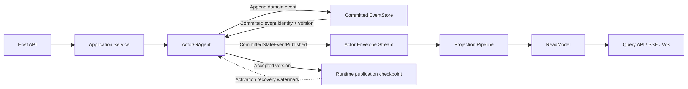

# Aevatar CQRS 架构（Maker 插件化后）

## 1. 目标

定义当前 CQRS 基线：

1. 写侧：`Application Command -> Actor Mailbox Message(EventEnvelope) -> Domain Event`
2. 读侧：`Projection -> ReadModel -> Query`
3. 插件：Maker 仅扩展 Workflow 模块，不新增第二套 CQRS 主链路

## 2. 顶层原则

1. Host 只做协议与组合，不做业务编排。
2. 命令执行必须走 CQRS Core 标准命令骨架，不允许每个 capability 私自拼一套 `resolve/ack/observe/finalize` 生命周期；同时不引入与 runtime 平行的命令总线壳层。
3. 读写分离保持单一事实源：`EventStore` 中的领域事件 + 投影读模型。
4. 中间层禁止维护 actor/run/session 事实态内存映射。

## 3. 项目分层

| 层 | 项目 | 职责 |
|---|---|---|
| CQRS Core | `Aevatar.CQRS.Core*` | 标准命令管线抽象、interaction/observation 模板、上下文策略、envelope/dispatch/receipt contract、输出流抽象 |
| Projection Core | `Aevatar.CQRS.Projection.*` | 投影生命周期、订阅、分发、协调 |
| Foundation/AI Projection | `Aevatar.Foundation.Projection` / `Aevatar.AI.Projection` | 通用读模型能力与 AI reducer |
| Workflow Projection | `src/workflow/Aevatar.Workflow.Projection` | Workflow 领域读模型与投影 |
| Maker Extension | `src/workflow/extensions/Aevatar.Workflow.Extensions.Maker` | 通过 `IWorkflowModulePack` 扩展模块，不承载独立 CQRS |

## 4. 主链路

```mermaid
%%{init: {"maxTextSize": 100000, "flowchart": {"useMaxWidth": false, "nodeSpacing": 10, "rankSpacing": 50}, "themeVariables": {"fontSize": "10px"}}}%%
flowchart LR
    API["Host API"] --> APP["Application Service"]
    APP --> ACT["Actor/GAgent"]
    ACT -->|"Append domain event"| ES["Committed EventStore"]
    ES -->|"Committed event identity + version"| ACT
    ACT -->|"CommittedStateEventPublished"| EVT["Actor Envelope Stream"]
    ACT -->|"Accepted version"| CP["Runtime publication checkpoint"]
    CP -.->|"Activation recovery watermark"| ACT
    EVT --> PROJ["Projection Pipeline"]
    PROJ --> RM["ReadModel"]
    RM --> Q["Query API / SSE / WS"]
```

口径澄清：

1. `EventEnvelope Stream` 是 runtime message stream，不是 Event Sourcing 的事实流。
2. Command 进入 Application 后，会被包装成 `EventEnvelope` 投递到目标 Actor 邮箱。
3. Actor 在自己的串行上下文里做决策，只有显式持久化的领域事件才进入 `EventStore`。
4. Projection 当前消费的是 Actor envelope 流，并把其中有业务语义的 payload 映射为 read model 与实时输出。
5. committed domain event 必须先进入 EventStore，再以 `EventEnvelope<CommittedStateEventPublished>` 进入同一 projection 主链；Runtime publication checkpoint 只记录投递进度，不定义业务事实。
6. activation 可在 checkpoint 后补发 committed fact；这是 write/runtime recovery，不是 query-time replay 或 projector 计算。

### 4.1 CQRS Core 统一命令骨架

CQRS 不应只提供零散 helper，而应定义所有 capability 复用的标准命令处理逻辑：

1. `Normalize Command`
   Host/Adapter 负责协议解析、鉴权、限流、基础校验，并把外部请求收敛为应用命令模型。
2. `Resolve Target`
   根据命令解析目标 actor 身份、创建/复用策略与必要的资源语义。
3. `Create CommandContext`
   统一分配 `commandId / correlationId / headers`，避免各子系统各自生成追踪语义。
4. `Build Envelope`
   把应用命令映射成统一 `EventEnvelope`，但 payload 的业务语义仍由 capability 自己定义。
5. `Dispatch via IActorDispatchPort`
   通过 `IActorDispatchPort` 完成 mailbox 语义下的 envelope 投递；目标 actor 的获取/创建与拓扑仍由 `IActorRuntime` 负责。
6. `Create Accepted Receipt`
   统一返回 `Accepted + commandId (+ actorId/correlationId)`，只承诺可追踪，不承诺 committed / observed。
7. `Observe Result`
   只有交互式 SSE/WS 等需要实时输出的入口才启动 `ICommandObservationLifecycle<TCommand,TTarget,TReceipt,TError>`。该阶段在 dispatch 前仅 attach 到已经存在、可确定寻址的 projection session/lease；不得同步 ensure/activate projection。cold session 或 attach 不可用时返回既有 projection pending/unavailable/disabled 类错误，命令不得进入 actor inbox，也不得发出 accepted receipt。dispatch-only 命令不启动 live observation，后续完成态统一走 read model 或 actor/session stream 观察，而不是在 command API 内私自拼装会话生命周期。

职责归属：

1. CQRS Core 应拥有 `Resolve Target / Context / Envelope / Dispatch / Receipt` 的通用抽象与默认实现。
2. Capability 只提供领域命令模型、目标解析规则、payload 映射、accepted receipt 映射与领域特有的观察模型。命令准备阶段不得启动 projection/read-model activation、live sink attach 或 session lease；`ICommandObservationLifecycle` 也只能 attach 已存在 session，不能 ensure/activate projection。
3. Projection Core 只负责写后传播、读模型与实时观察，不回流承担命令入口语义。

现状映射：

1. `ICommandContextPolicy`、`ICommandEnvelopeFactory<TCommand>` 已经是 CQRS Core 抽象。
2. `DefaultCommandDispatchPipeline<TCommand, TTarget, TReceipt, TError>` 已把 `Resolve Target -> Context -> Envelope -> Dispatch via IActorDispatchPort -> Accepted Receipt` 串成标准命令骨架；`PrepareAsync` 不做 projection/session attach。
3. `DefaultCommandInteractionService<TCommand,...>` 已把交互式入口串成 `Prepare -> Observe -> DispatchPrepared -> Accepted callback -> Pump -> Release`。`Observe` 使用 `ICommandObservationLifecycle<,,,>` attach 既有 observation session，失败时返回 start failure 且不 dispatch；dispatch 失败时由 target cleanup 释放已经附着的 observation。
4. `ActorCommandTargetDispatcher<TTarget>` 通过 `IActorDispatchPort` 落地 runtime-neutral envelope 投递；`IActorRuntime` 继续负责目标 actor 的获取/创建与拓扑语义；对外交互入口统一收敛为 target-erased 的 `ICommandInteractionService<...>`。

### 4.2 下一阶段蓝图（IActorDispatchPort 投递 + CQRS Core 统一命令骨架）

当前基线仍是 `Host -> Application -> Actor` 直连执行。  
如果要继续按最佳实践演进，目标方向是：

1. `Endpoint` 只做 normalize / validate / auth / 应用层组合。
2. 外部命令继续使用统一 `Envelope` 载体，不强制拆不同物理 envelope 类型。
3. CQRS Core 统一承载 target resolve / command context / envelope build / dispatch port / accepted receipt。
4. Infrastructure 通过 `IActorRuntime` 获取/创建目标 actor，并通过 `IActorDispatchPort` 投递 envelope。
5. 命令主链路不再额外引入 ingress queue/stream。
6. 对外同步 ACK 只表示 dispatch 成功，不承诺 committed / observed。
7. 实时输出与读侧仍然通过 actor envelope stream + projection 观察。

详细蓝图见：

- [2026-03-09-cqrs-command-actor-receipt-projection-blueprint.md](architecture/2026-03-09-cqrs-command-actor-receipt-projection-blueprint.md)

## 5. 投影约束

1. CQRS 与 AGUI/SSE/WS 共用统一 Projection 输入链路。
2. 事件订阅以 reducer 的 `EventTypeUrl` 精确匹配为准。
3. 未命中 reducer 的事件必须为 no-op。
4. Workflow 投影生命周期通过 lease/session 句柄管理，不允许 `actorId -> context` 反查。
5. 同一 `EventEnvelope` 分发到多个 projector 时采用“一对多全分支尝试”语义：单个 projector 失败不阻断其他 projector 执行，最终以聚合异常统一回传。
6. 禁止 `Projection:ReadModel:Bindings` 与任何 BindingResolver 路由；投影存储路由统一由 `IProjectionStoreDispatcher` + Store Binding (`IProjectionDocumentStore` / `IProjectionGraphStore`) 决策。
7. Host 组合层按配置仅注册所需 provider 组合，不允许无条件并列注册 InMemory/Elasticsearch/Neo4j。
8. 持久投影 scope 的激活由 committed-state publication owner hook 触发：Actor 完成 domain event commit 并构造 `EventEnvelope<CommittedStateEventPublished>` 前，Foundation 调用 `ICommittedStatePublicationHook`，Projection Core 根据精确的 actor type 与 state event descriptor 生成 `ProjectionScopeStartRequest` 并分发给已有 `IProjectionScopeActivationService<TLease>`。命令入口不得同步调用 projection activation facade，也不得新增 actor/lifecycle phase 来“预热”读模型。
9. Elasticsearch projection schema-drift 的唯一权威是 provider 生成的 augmented mapping fingerprint 与稳定 alias lifecycle。query resolver / query reader / consistency probe 不得读取 live ES mapping 作为第二真相，也不得触发 repair / reindex；write-side `UpsertAsync -> EnsureIndexAsync` 只处理 greenfield / legacy bare lifecycle，遇到单一旧 fingerprint 或多 backing drift 必须 fail closed，不能 `_reindex` 或切 alias。alias 指向单一旧 fingerprint physical index 的 clean migration 只能由静态 provider-local startup reconcile（`IProjectionIndexReconcileTarget.ReconcileIndexAsync`）创建 expected physical、执行 old-to-new reindex、确认无 failures / timeout 后用一次 `_aliases` 原子切换；dynamic index scope 不参与 startup reconcile，不获得 clean drift migration。alias 多 backing、source 缺失、不兼容 mapping、reindex failure / timeout、partial copy 或非 static reconcile 路径仍必须 fail closed。
10. commit publication 是 at-least-once：current-state projector 必须以 `actorId + authoritative StateVersion` 做单调幂等覆盖，artifact/audit consumer 必须以 committed event identity 做幂等键；不得依赖 envelope 只出现一次。

### 5.1 Projection-driven Split / Merge / Re-key

Projection-driven bootstrap 只服务 actor 事实拥有者变化的演进：split、merge、re-key、replace。它不是查询优化，也不是 lazy state migration 的替代品。完整 actor 演进判定树见 [actor-evolution.md](actor-evolution.md)。

v1 non-goal：复杂 owner-change bootstrap（split / merge / re-key / replace 的生产级编排、批量迁移、回滚与清理策略）不在 v1 范围内，延后到 v2 设计。v1 只锁定边界：查询与 read adapter 不允许通过 query-time replay、临时 state rebuild、projection materialization 或 projection priming 来补齐这类 owner-change 场景。

口径：

1. Split：旧 actor 的 committed fact 通过 projection materialize 出 bootstrap 输入；新 actor 必须提交自己的 domain event 后才成为新事实拥有者。
2. Merge：多个旧 actor 的 committed fact 只能作为 bootstrap 输入；聚合后的事实必须由新的 aggregate actor 拥有。
3. Re-key：旧 key 到新 key 的关系必须显式建模为 re-key redirect；调用方不得解析 actorId 字符串或把追踪 ID 当目标身份。
4. Replace：旧 owner 不再承载当前业务事实时，新 actor 必须提交自己的 domain event；旧 actor 只能通过显式 retire cleanup 退出。
5. Retire cleanup：旧 actor / 旧 readmodel / 旧索引的退役必须有显式清理语义，不能留给 query path 做“如果旧数据还在就忽略”的临时判断。
6. Bootstrap 输入只来自 committed domain event、committed state publication 或同源 durable feed；不得订阅 command、self continuation 或 actor 内部 state mirror 临时结构推测完成态。

禁止项：

1. 禁止 query-time replay / bootstrap：query 方法不得读取 `IEventStore`、重放事件、临时重建 actor state 或补跑 projection 后再返回。
2. 禁止 query-time priming：query/read adapter 不得激活 projection、ensure session、创建 actor、修复 index 或触发生命周期操作。
3. 禁止把 bootstrap 当成新的 core phase：本口径不新增 envelope kind、pipeline phase、actor 类型或 proto 字段；它只约束现有 projection materialization 与 actor-owned fact 的使用方式。
4. 禁止用 readmodel 反向定义业务事实：readmodel 只证明某个权威版本已物化可见，不决定 split / merge / re-key 的业务完成。

## 5.2 编排减重落地（当前实现）

1. CQRS 命令侧已统一为：
   `ICommandDispatchService<TCommand, TReceipt, TError>`（宿主入口） +
   `DefaultCommandDispatchPipeline<TCommand, TTarget, TReceipt, TError>`（标准骨架） +
   `ICommandTargetResolver<TCommand, TTarget, TError>`（目标解析） +
   `ICommandObservationLifecycle<TCommand, TTarget, TReceipt, TError>`（交互式 live observation 启动） +
   `ActorCommandTargetDispatcher<TTarget>`（`IActorDispatchPort` dispatch） +
   `ICommandReceiptFactory<TTarget, TReceipt>`（accepted receipt）。
2. Workflow 命令侧在此骨架上提供领域特化：
   `WorkflowRunCommandTargetResolver`（workflow source 解析） +
   `WorkflowRunObservationLifecycle`（attach-only projection/live sink 绑定；不做 pre-dispatch activation） +
   `WorkflowRunAcceptedCommandTargetResolver`（accepted-only receipt 路径） +
   `WorkflowRunAcceptedReceiptFactory`（receipt） +
   `ICommandInteractionService<WorkflowChatRunRequest, WorkflowChatRunAcceptedReceipt, WorkflowChatRunStartError, WorkflowRunEventEnvelope, WorkflowProjectionCompletionStatus>`（SSE/WS 交互入口） +
   `DefaultCommandDispatchService<WorkflowChatRunRequest, WorkflowRunAcceptedCommandTarget, WorkflowChatRunAcceptedReceipt, WorkflowChatRunStartError>`（accepted-only facade，复用同一 command skeleton，不持有 live sink） +
   `ICommandDispatchService<WorkflowResumeCommand, WorkflowRunControlAcceptedReceipt, WorkflowRunControlStartError>` / `ICommandDispatchService<WorkflowSignalCommand, WorkflowRunControlAcceptedReceipt, WorkflowRunControlStartError>`（run control 命令入口），以及 `ICommandDispatchService<WorkflowForkRunCommand, WorkflowForkRunAcceptedReceipt, WorkflowForkRunStartError>`（fork/run resume-from-step 命令入口）。
3. Scripting 命令侧已形成同一套 CQRS 接入模型：
   `RuntimeScriptEvolutionInteractionService`（generic interaction facade） +
   `ICommandInteractionService<ScriptEvolutionProposal, ScriptEvolutionAcceptedReceipt, ScriptEvolutionStartError, ScriptEvolutionSessionCompletedEvent, ScriptEvolutionInteractionCompletion>`（演化提案入口） +
   `ScriptEvolutionCommandTargetResolver` / `ScriptEvolutionObservationLifecycle` / `ScriptEvolutionEnvelopeFactory` / `ScriptEvolutionDurableCompletionResolver`（领域特化策略） +
   `ScriptingActorCommandTarget + AddSimpleScriptingCommandDispatch<...>`（definition/runtime/catalog 命令统一骨架） +
   `IScriptRuntimeProvisioningPort + RuntimeScriptProvisioningService`（runtime lifecycle 归 runtime 端口，命令链只负责 dispatch）。
4. Projection 端口实现已拆分为：
   `WorkflowExecutionProjectionPort`（投影端口） +  
   `WorkflowExecutionCurrentStateQueryPort` / `WorkflowExecutionArtifactQueryPort`（查询端口实现） +  
   `EventSinkProjectionLifecyclePortBase<>`（通用 session port 基类） +  
   `ProjectionSessionScopeActivationService<WorkflowExecutionRuntimeLease, WorkflowExecutionProjectionContext, WorkflowExecutionSessionScopeGAgent>`（激活） +  
   `ProjectionSessionScopeReleaseService<WorkflowExecutionRuntimeLease, WorkflowExecutionSessionScopeGAgent>`（释放） +  
   `ProjectionMaterializationScopeActivationService<WorkflowExecutionMaterializationRuntimeLease, WorkflowExecutionMaterializationContext, WorkflowExecutionMaterializationScopeGAgent>`（durable 激活） +  
   `ProjectionMaterializationScopeReleaseService<WorkflowExecutionMaterializationRuntimeLease, WorkflowExecutionMaterializationScopeGAgent>`（durable 释放） +  
   `ProjectionSessionEventHub<WorkflowRunEventEnvelope>`（session stream hub） +  
   `WorkflowProjectionReadModelUpdater`（读模型元信息） +  
   `WorkflowExecutionCurrentStateQueryPort` / `WorkflowExecutionArtifactQueryPort`（查询映射；query 直接实现 read adapter，不再复用通用 query-port 基类）。
5. CI 增加编排类体量守卫与 capability 边界守卫：关键编排类的非空行数与直接依赖数有上限，`workflow/scripting` 外部入口不得回退到私有 lifecycle 主链。

## 5.3 Envelope / Annotation 口径（防理解偏差）

1. `EventEnvelope.Propagation` 与 `EventEnvelope.Runtime` 属于包络级上下文，用于传播/追踪/投递，不作为业务完成语义主来源。
2. `StepCompletedEvent.Annotations` 属于业务事件注解，Maker/Connector/Parallel 等模块信息写入此处。
3. ReadModel 聚合使用 `StepCompletedEvent.Annotations`，并落到 step `CompletionAnnotations` 与 timeline `Data`；控制流语义则走 typed 字段。
4. 实时输出是否带业务 annotations 由 mapper 明确定义；当前默认不自动透传 `StepCompletedEvent.Annotations` 全量字段。

## 6. 宿主接入规范

当前宿主：

1. `src/Aevatar.Mainnet.Host.Api/Program.cs`
2. `src/workflow/Aevatar.Workflow.Host.Api/Program.cs`

接入约束：

1. 必须使用 `AddAevatarDefaultHost(...)` + `UseAevatarDefaultHost()`。
2. Mainnet 与 Workflow Host 必须接入 `builder.AddAevatarPlatform(...)`（统一装配 Workflow capability、Scripting capability、AI features 与 Workflow AI projection extension）。
3. Mainnet 通过 `builder.AddAevatarPlatform(options => { options.EnableMakerExtensions = true; })` 启用 Maker 插件。
4. 禁止 `AddMakerCapability()` 与 `/api/maker/*` 独立路由模型。

## 7. Runtime 口径

1. 当前默认 `ActorRuntime:Provider=InMemory`（开发/测试）。
2. `ActorRuntime` 不是额外的“第二套通道”，而是构建在 stream 之上的 Actor 语义层，负责寻址、激活、邮箱串行与拓扑。
3. 生产目标：分布式 Actor Runtime + 非 InMemory 持久化（state/event/read model）。
4. 本口径下 `InMemory` 与 `Actor Local` 均不作为架构扣分项。

## 8. 门禁与验证

最低验证：

1. `bash tools/ci/architecture_guards.sh`
2. `dotnet build aevatar.slnx --nologo`
3. `dotnet test aevatar.slnx --nologo`
4. `bash tools/ci/test_stability_guards.sh`

关键门禁：

1. 禁止 `GetAwaiter().GetResult()`
2. 禁止 `TypeUrl.Contains(...)` 路由
3. 禁止 Host/Infrastructure 直接 `AddCqrsCore(...)`
4. 禁止独立 Maker Capability 工程与路由回流
5. 强制 Mainnet 插件化装配 Maker
6. 默认全量测试只承载快速主链路；分钟级脚本自治演化回归独立执行，避免把慢测静默耗时混入常规门禁。
