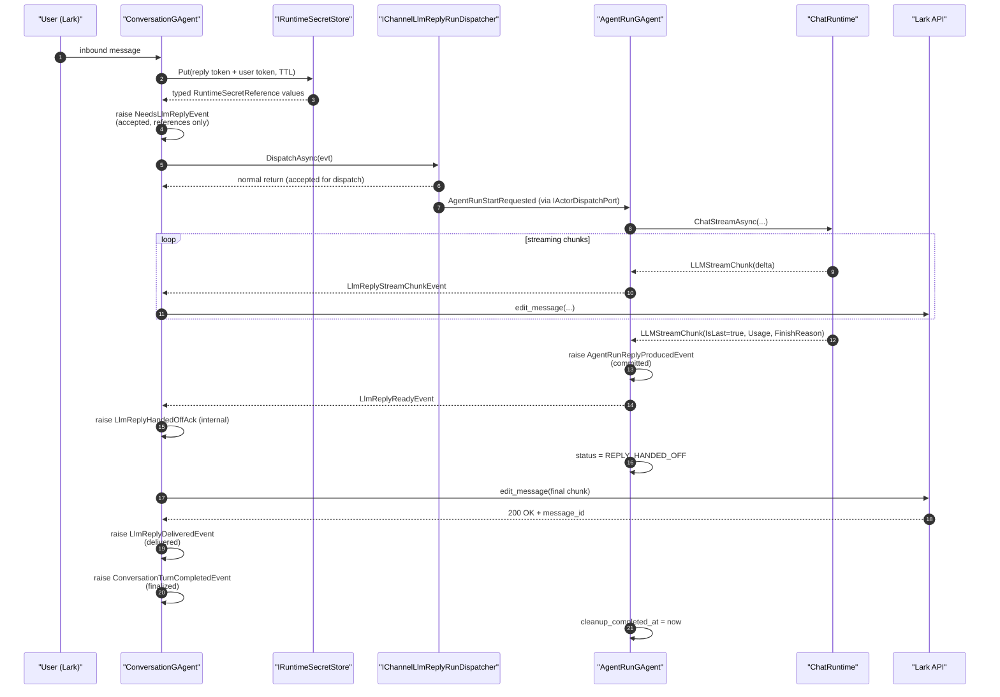
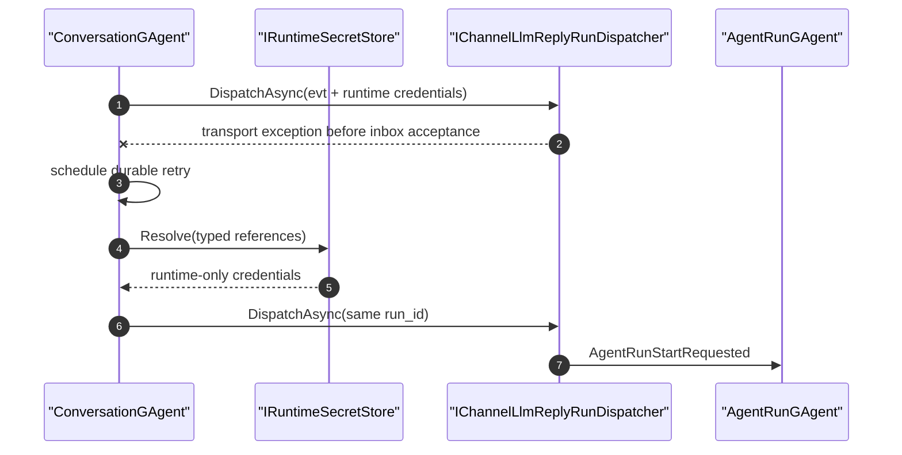
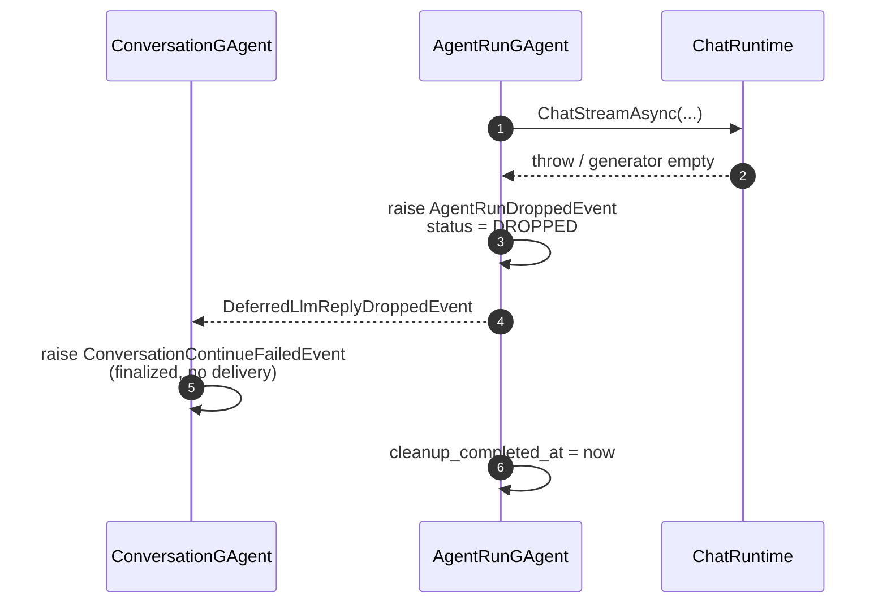
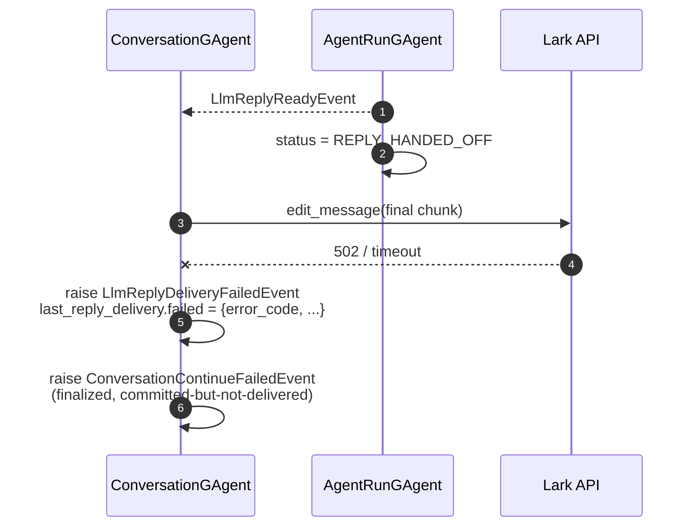
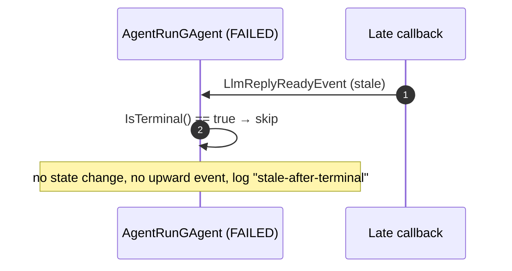
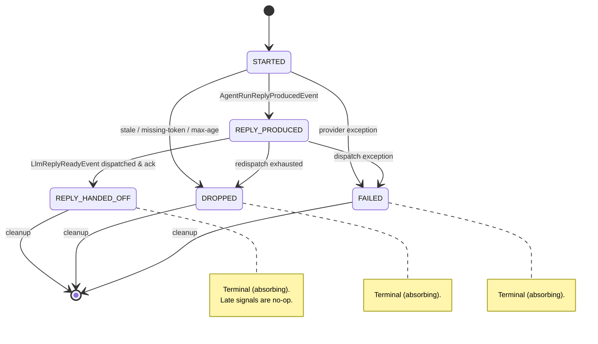
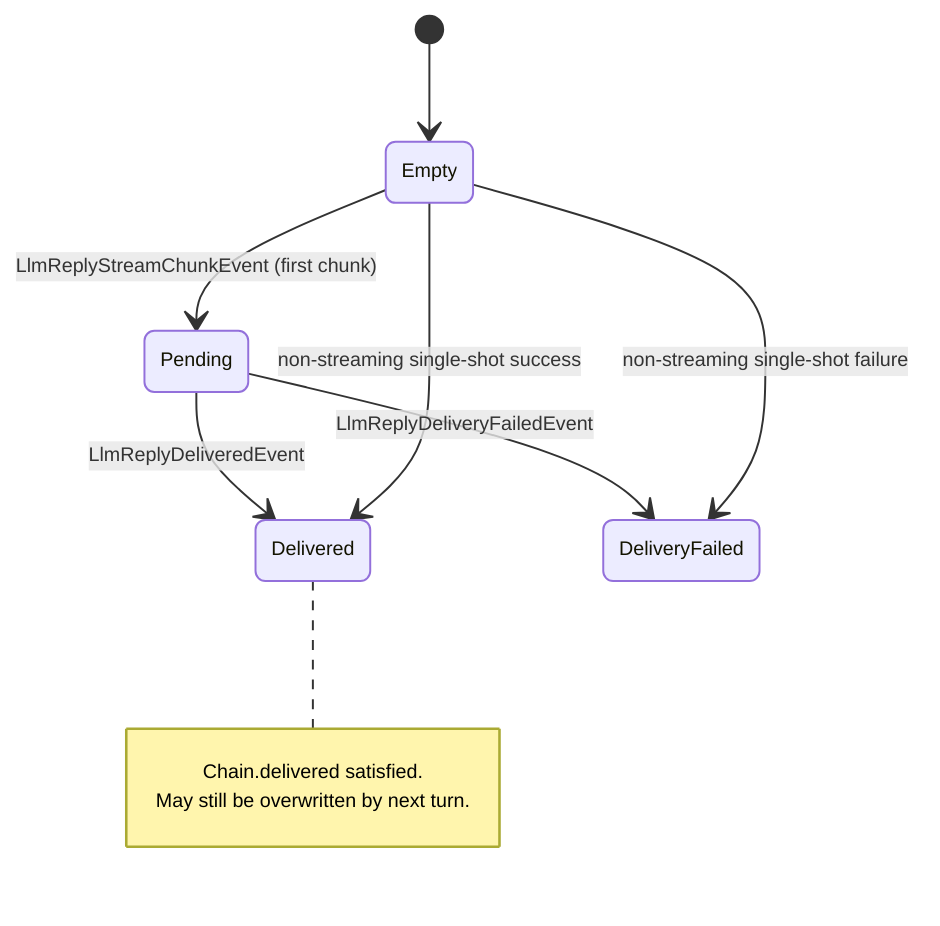

# Lark Reply Chain Completion Semantics

ADR-0021 决策的工程参考。本文档面向实现者，给出每个阶段的可观察 state、事件时序、故障矩阵、状态机图与实现 checklist。基础决策见 [`docs/adr/0021-lark-reply-chain-completion-semantics.md`](../adr/0021-lark-reply-chain-completion-semantics.md)；dispatcher plain `Task` handoff 修订见 [`docs/adr/0027-lark-reply-run-dispatcher-plain-task-handoff.md`](../adr/0027-lark-reply-run-dispatcher-plain-task-handoff.md)。

## 1. 链路与四阶段定位

```
ConversationGAgent ──► IChannelLlmReplyRunDispatcher ──► AgentRunGAgent ──► ConversationReplyGenerator ──► ChatRuntime
       ▲                          │                            │                       │                       │
       │                          │                            ▼                       ▼                       │
       │                       accepted                    committed             (chunk stream)                │
       │                                                                                                       │
       └──────────────── delivered (channel sink ack) ◄── handed_off ◄────────────────────────────────────────┘
                              │
                              ▼
                          finalized (terminal status + cleanup_completed_at)
```

## 2. 可观察 State 表

每个阶段必须可通过下列字段/事件**单一**可观察。任何"靠 X 推断 Y"都视为契约违反。

| 阶段 | 推进 actor | state 字段 | trigger event | 反例（不可作为观察源） |
|---|---|---|---|---|
| **accepted** | dispatcher → ConversationGAgent | `ConversationState.pending_llm_reply.{command_id, requested_at_unix_ms}` | `NeedsLlmReplyEvent` appended | dispatcher log line、内存计数器 |
| **committed** | AgentRunGAgent | `AgentRunState.status = REPLY_PRODUCED`<br/>`AgentRunState.reply_produced_at_unix_ms` | `AgentRunReplyProducedEvent` persisted | LLM provider 返回值、stream channel close |
| **delivered** | ConversationGAgent + channel sink | `ConversationState.last_reply_delivery.delivered.{acked_at_unix_ms, channel_message_id}` | `LlmReplyDeliveredEvent` | lark API 返回 200 但未 raise event、日志行 |
| **finalized** | AgentRunGAgent + ConversationGAgent | `AgentRunState.status ∈ {DROPPED, FAILED, REPLY_HANDED_OFF}`<br/>`AgentRunState.cleanup_completed_at != 0`<br/>`ConversationTurnCompletedEvent` 已 raise | 终态事件 + `AgentRunCleanupCompletedEvent`（可选） | 进程内 dictionary、回调"已 schedule" |

> 注：`REPLY_HANDED_OFF` 不直接证明 `chain.delivered` — 还需 `last_reply_delivery.delivered != null`。本表把它列在 finalized 列是因为 finalized 是 AgentRunGAgent 视角的终态。

## 2.1 用户可见投递 Ledger

`last_reply_delivery` 只描述最近 reply 的链路快照，不是跨请求查询事实源。每一次用户可见出站投递必须由权威 actor 提交共享 `DeliveryProducedEvent`：`ConversationGAgent` 在 text/card 发送成功、pre-send 失败、post-send 失败边界提交；`AgentRunGAgent` 在 streaming card 终态批次里提交并维护 run 自身 ledger。

Conversation state 维护 bounded `recent_deliveries` 与 `last_successful_delivery`。读侧通过 `ConversationDeliveryCurrentStateDocument` 覆盖复制这些字段，并由 `ConversationDeliveryQueryPort` 读取 current-state read model；不得在 query path 读取 event store、重放事件或启动 projection priming 来推断投递完成态。

## 3. 时序图：Happy Path（streaming）



## 4. 时序图：Failure Paths

### 4.1 Actor inbox handoff 瞬时失败



`NeedsLlmReplyEvent` 只持久化引用，不持久化 raw token。retry clone 在进入
`IActorDispatchPort` 前恢复凭据；引用缺失或过期时提交明确失败事实，禁止静默丢 turn。

### 4.2 LLM 产出失败（committed 前 dropped）



### 4.3 Lark sink 失败（committed 后、delivered 失败）



### 4.4 Stale signal 到达终态 actor（必须 no-op）



## 5. 故障矩阵

阶段 × 故障类型 → 最终落点。

| 故障发生时所处阶段 | 故障类型 | 终态 status | last_reply_delivery | 上抛事件 | 责任 actor |
|---|---|---|---|---|---|
| accepted → committed | initial actor inbox handoff exception | pending; same `run_id` durable retry | `null` | runtime-secret reference resolve + redispatch | ConversationGAgent |
| accepted → committed | duplicate run start | 不变（terminal duplicate no-op / retry path keeps `REPLY_PRODUCED`） | 不变 | log only or persisted retry handoff | AgentRunGAgent |
| accepted → committed | stale run age > MaxRunRequestAgeMs | `AgentRunStatus.DROPPED` | `null` | `AgentRunDroppedEvent` + `DeferredLlmReplyDroppedEvent` | AgentRunGAgent |
| accepted → committed | LLM provider error | `AgentRunStatus.FAILED` | `null` | `AgentRunFailedEvent` + `ConversationContinueFailedEvent` | AgentRunGAgent |
| accepted → committed | run age > MaxRunRequestAgeMs | `AgentRunStatus.DROPPED` | `null` | `AgentRunDroppedEvent` + `DeferredLlmReplyDroppedEvent` | AgentRunGAgent |
| accepted → committed | missing relay reply_token | `AgentRunStatus.DROPPED` | `null` | `AgentRunDroppedEvent` | AgentRunGAgent |
| committed → handed_off | dispatch `LlmReplyReadyEvent` 失败 | `AgentRunStatus.REPLY_PRODUCED` (持续 redispatch) | `null` | redispatch retry (in cs:126-141) | AgentRunGAgent |
| handed_off → delivered | lark API 4xx | `AgentRunStatus.REPLY_HANDED_OFF` | `failed{error_code}` | `LlmReplyDeliveryFailedEvent` + `ConversationContinueFailedEvent` | ConversationGAgent |
| handed_off → delivered | lark API 5xx / timeout | `AgentRunStatus.REPLY_HANDED_OFF` | `failed{error_code}` | 同上 | ConversationGAgent |
| 任意已 terminal 后 | 重复 ready/dropped/failed | 不变 | 不变 | log only | actor 入口 short-circuit |
| 任意已 terminal 后 | late cleanup callback | 不变（`cleanup_completed_at != 0`） | 不变 | log only | AgentRunGAgent |

## 6. AgentRunStatus 状态机



## 7. ConversationState.last_reply_delivery 转换



## 8. Streaming Closeout 契约（#648 实现侧）

`ChatRuntime.ChatStreamAsync` 对消费方（`ConversationReplyGenerator`）的契约：

- **Stream-local terminal**：消费方在一次 `ChatStreamAsync` 调用中**只见一次** `LLMStreamChunk { IsLast = true }`。multi-round tool use 的 round-level terminal **不向外暴露**，runtime 内部 fold。
- **Usage / FinishReason 挂位**：必须挂在最后一个 chunk 上（即 `IsLast = true` 的 chunk）。
- **Provider 早发 Usage 的处理**：若 provider 在 round 中段先发了 `Usage` 而 `IsLast = false`，runtime 必须**重排**：暂存 Usage，向消费方先发 delta chunks，待真正结束再合并到最后一个 `IsLast = true` chunk。
- **Warning 不视为 terminal**：长度截断 (`ToolCallLoop.IsLengthTruncated`) 是 round-level 信号，由 runtime 决定后续行为，不映射到外部 IsLast。
- **Tool-result chunk 不视为 terminal**：每轮 round 间的 `\n\n` separator chunk 与 tool-call payload chunk 都 `IsLast = false`。
- **Closeout 路径单一**：channel writer close 必须先 emit 最后一个 `IsLast = true` chunk 再 close，**不允许**靠"reader 见底"隐式终结。

## 9. Terminal Idempotency 契约（#649 实现侧）

`AgentRunGAgent` 所有 handler 入口必须遵守：

```csharp
internal static bool IsTerminal(AgentRunState s) =>
    s.Status == AgentRunStatus.Dropped
 || s.Status == AgentRunStatus.Failed
 || s.Status == AgentRunStatus.ReplyHandedOff;
```

**入口规则**：
1. `HandleAgentRunStartRequested`：终态 → schedule cleanup（不重启 LLM），return
2. `HandleLlmReplyReadyAsync` 内部 ack handler：终态 → log "stale-after-terminal"，return
3. `HandleAgentRunDroppedAsync` / `HandleAgentRunFailedAsync`：终态 → log，return
4. `ScheduleTerminalCleanupAsync`：`cleanup_completed_at != 0` → no-op
5. `ReDispatchProducedReplyAsync`：终态 → 取消未来 retry，return

**Stale signal 判定**：
- 通过 `runId` 不一致 → 视为 stale
- 通过 `nowMs - request.RequestedAtUnixMs > MaxRunRequestAgeMs` → 视为 stale，但仅在 STARTED 入口检查

**禁止**：
- 在终态 actor 上推进任何 state machine 边
- 在终态 actor 上发起新的 redispatch / callback schedule
- 通过 `lock` / `ConcurrentDictionary` 维护 "is this signal stale" 的内存字典（破坏 Actor 单线程事实源）

## 10. Workflow channel 后台投递契约

channel chat turn 中的 `aevatar_start_workflow`（`wait=ack` / `wait=stream`）只承诺 workflow run command 已 accepted，并返回 typed `WorkflowRunBackgroundDeliveryReceipt`。聊天轮必须 ack-fast 结束，不能挂住原 LLM turn 等 workflow terminal，也不能依赖一次性 report artifact 或用户 relay token 作为后续完成态投递依据。

AgentRun/NyxidChat 侧为每个 workflow command 预留一个 run-scoped `WorkflowRunDeliveryGAgent`。dispatcher 必须在 workflow command 进入目标 inbox 前完成 `ReserveAsync`，把 delivery actor id、delivery id 与截止时间作为强类型 `WorkflowCompletionNotificationTarget` 随 `WorkflowChatRunRequest` 发送；accepted receipt 返回后，`RegisterAsync` 只补齐 workflow actor/run/correlation identity。terminal notification 可以早于 accepted receipt 或 registration 到达，delivery actor 必须先持久化并在 reservation/binding 可对账后继续处理，不能依赖跨 actor 的偶然执行顺序。

`delivery_id` 是一次后台回投的业务身份，`delivery_actor_id` 是 runtime address，二者禁止共用同一个字段或假设字符串相等。只有 registration infrastructure 可以从完整 delivery id 稳定派生 opaque actor address；dispatcher、workflow actor 与测试 fixture 都必须显式携带两种身份，不得解析 actor id 前缀反推业务事实。

`WorkflowRunGAgent` 是 workflow 终态语义与通知 outbox 的权威拥有者。completion/failure/stopped 已提交后，它先把强类型 `WorkflowRunTerminalNotification` 持久化到自身 Protobuf state，再通过标准 actor inbox 投递给 reservation target；发送失败优先通过 durable self-timeout 触发重试，scheduler 不可用时只允许发布标准 self continuation，callback 携带 delivery id、workflow command id 与 attempt 并由 actor 对账。激活恢复必须能从已提交 terminal state 重建缺失 outbox，重复发送由 delivery actor 按稳定身份幂等吸收。

该业务通知协议不创建 `ExecutionSession`，也不 attach live projection sink。Projection Pipeline 继续只消费 committed state、物化 actor-scoped current-state readmodel，并服务显式 SSE/WS 交互观察；不得用 query-time replay/priming、detached in-process sink 或 `actorId -> context` registry 补偿后台投递。accepted-only command、actor 业务通知与 readmodel 查询是三个独立契约，不能互相冒充。

Nyx relay terminal reply 必须经 channel-relay `/reply` 使用长效 bot agent key 投递到同一 reply target。用户 inbound relay token 过期不得影响后台 terminal delivery；短命用户凭据只属于原入站 turn，不能进入 `WorkflowRunDeliveryGAgentState`。

### 10.1 Delivery credential：typed vault handle + fail closed（#2675）

- **凭据来源唯一**：Lark provisioning 在创建 relay api key 时捕获 NyxID 一次性 `full_key`，立即写入分布式 `ISecretVault`（purpose `channel.workflow-result-delivery-agent-key`，owner scope = registration scope，subject = `nyx_agent_api_key_id`）。raw key 不进入 Protobuf state、event、read model、result 或日志；mainnet 只读 secrets store 不参与。
- **强类型 handle 贯穿链路**：`ChannelBotRegistrationEntry.workflow_result_delivery_credential`（vault `SecretReference`）→ registration read model → `AgentToolChannelContext.WorkflowResultDeliveryCredential`（`SecretReference` + subject）→ `WorkflowRunBackgroundDeliveryReservation` → `WorkflowRunDeliveryGAgentState`。`WorkflowRunDeliveryStartRequested` 只绑定 accepted workflow identity，不再重复承载 credential。泛化字符串 `nyx_reply_credential_ref` / `durable_reply_credential_ref` 字段已 reserved 删除。
- **窄解析边界**：终态回投经 `IWorkflowResultDeliveryCredentialResolver` 在 actor turn 内解析，固定 purpose + handle 自带 owner scope + api-key subject；purpose/owner/subject 不匹配、vault 未命中或 revoked 一律 fail closed 且不发出 HTTP。raw bearer 只进入 `NyxIdRelayOutboundPort` adapter 调用。
- **身份与凭据分离**：`ConversationReference.BotInstanceId` 使用稳定 `bot_registration_id`；secret handle 只负责授权解析。缺 registration id 的历史 delivery 用 `"nyx-relay-bot"` 共享别名。
- **channel 后台回投 + fail closed**：channel skill 触发 workflow 且无可用 handle 时，dispatcher 在 dispatch 前返回产品级 `channel_workflow_delivery_unavailable`（不泄漏 credential 细节），不创建注定丢失终态结果的 run；reservation actor 对 typed handle、command identity 与 channel target 做第二道校验。pre-dispatch `ReserveAsync` 未 accepted 时禁止 dispatch workflow；workflow command 已 accepted 后，`RegisterAsync` 只补充 accepted workflow identity，失败不得把已运行的 workflow 伪装成 tool failure，也不得 abandon reservation，而应返回 reservation-backed accepted receipt 并记录 `binding_degraded`。内部日志用 typed reason 区分 `credential_handle_missing` / `resolver_unavailable` / `workflow_background_delivery_reservation_failed` / `binding_degraded`。
- **存量 registration 原地修复**：NyxID `full_key` 只在 create/rotate 时返回，无法回读；缺 handle 的 Lark registration 保持 fail closed，owner 在 `/channels` 对原 registration 执行 `Repair workflow replies`。该命令保留 `registration_id`、NyxID channel bot id、conversation route id、webhook URL、scope 与 `default_skill_name`，不要求修改 Lark developer console；只有 active agent key id 与 typed vault handle 在完成事件提交后更新。
- **forward-only 顺序**：repair request 先由 `ChannelBotRegistrationGAgent` commit；application service 随后 rotate 当前 NyxID agent key，把一次性 `full_key` 立即写入 `ISecretVault`，再向 actor commit `CREDENTIAL_PREPARED`，更新**现有** conversation route 到新 key id，最后 commit complete。rotate 会立即停用旧 key，因此 vault-first prepare 之后只能前滚，不能把旧 key 当回滚目标。
- **中断恢复**：`REQUESTED`、`CREDENTIAL_PREPARED`、`FAILED` 及 typed phase/reason 都由 registration actor 持有。prepared 后重试复用同一个 typed `SecretReference`，只重做幂等 route update + actor completion；vault write 失败可从已记录的 rotated key 前滚再 rotate。处于 requested 状态时先查询 NyxID active keys：若 expected original key 仍明确 active，说明 rotation 尚未发生，可以继续 rotate；否则只能按确定性 key name 与 `requested_at` 恢复唯一 active replacement。expected key 已 inactive 且没有 replacement，或存在多个 replacement，都返回 `AMBIGUOUS_ROTATED_KEY_RECOVERY`，禁止猜测。禁止 query-time repair、event replay priming 或进程内 repair registry。
- **配置失败不是 skill 失败**：`channel_workflow_delivery_unavailable` 是 exact typed `ConfigurationRequired` outcome。`SkillRecoveryPlanner` 必须停止 `ornn_search_skills`，并引导 owner 到 `/channels` 执行原地修复；不能因为展示文本相似就改变分类，其他 error code 仍走既有 recovery 规则。
- **secret 边界不变**：禁止把短期 inbound reply token 冒充 delivery credential。raw bearer / `full_key` 不进入 command、event、actor state、read model、repair result、HTTP response、audit summary 或日志；browser 只看到 capability status、typed failure phase/reason 与非敏感 key id。vault revoke/rotate 基建见 #2689；provisioning 失败补偿会尽力 revoke vault 记录并回滚 NyxID api key。

## 11. 实现 Checklist

- [ ] `agents/Aevatar.GAgents.NyxidChat/Protos/agent_run.proto`：扩 `AgentRunStatus` 加 `REPLY_HANDED_OFF`；`reply_dispatched` 标 `reserved`；加 `cleanup_completed_at`、`reply_produced_at_unix_ms`
- [ ] `agents/Aevatar.GAgents.Channel.Runtime/Protos/conversation_state.proto`：新增 `ReplyDeliveryStatus` 消息 + `ConversationState.last_reply_delivery` 字段
- [ ] 新增 domain event：`LlmReplyDeliveredEvent` / `LlmReplyDeliveryFailedEvent`（在 `Aevatar.GAgents.Channel.Runtime`）
- [x] `IChannelLlmReplyRunDispatcher.DispatchAsync` 返回 plain `Task`；删除 `DispatchOutcome` / `DispatchPhase`
- [x] `AgentRunDispatcher` 仅创建 run actor 并通过 `IActorDispatchPort.DispatchAsync` handoff；不做 dispatcher-local stale / duplicate admission
- [ ] `AgentRunGAgent`：
  - [ ] 新增 `IsTerminal()` helper
  - [ ] 替换 cs:114-124 隐式终态判定
  - [ ] 所有 handler 入口加 `IsTerminal()` short-circuit
  - [ ] `reply_dispatched` bool 读改 `Status == REPLY_HANDED_OFF`；写复用既有 `AgentRunReplyDispatchedEvent`（state matcher 升级 `status = REPLY_HANDED_OFF`，无需新事件）
  - [ ] `ScheduleTerminalCleanupAsync` 完成时 raise `AgentRunCleanupCompletedEvent`，state matcher 写入 `cleanup_completed_at_unix_ms`
- [ ] `ConversationGAgent`：
  - [ ] `RunLlmReplyAsync` (cs:458) 成功后 raise `LlmReplyDeliveredEvent`，失败 raise `LlmReplyDeliveryFailedEvent`
  - [ ] streaming chunk path (cs:532, cs:546) 在 final chunk 编辑成功后 raise `LlmReplyDeliveredEvent`
  - [ ] handler `HandleLlmReplyReadyAsync` (cs:422) 收到事件后短路重复 ack
- [ ] `ChatRuntime.ChatStreamAsync` (`src/Aevatar.AI.Core/Chat/ChatRuntime.cs:208`)：
  - [ ] 实现 Usage 重排（early-usage buffer + merge to last chunk）
  - [ ] 保证 stream-local 唯一 `IsLast = true` chunk
- [ ] 测试：
  - [x] dispatcher handoff 测试：typed `run_id` 派生 actor id / envelope id / delivery operation id
  - [x] duplicate / stale admission 测试落在 `AgentRunGAgent`
  - [ ] AgentRunGAgent terminal short-circuit 五类 late signal 各 1 测试
  - [ ] `ConversationGAgent` 失败 delivery 路径测试（lark 4xx / 5xx）
  - [ ] `ChatRuntime` Usage 重排测试（provider 中段发 Usage）
  - [ ] reply chain happy path 端到端断言新事件序列

## 12. 反例（implementation smells）

下列模式视为契约违反，应在 review 时拒收：

- 调用方依赖 `DispatchAsync` 正常返回推断 run admitted / committed / delivered
- 任何 handler 内通过 `_pendingRuns.ContainsKey(runId)` 或类似进程内字典判断 stale
- 在 `ConversationGAgent` 内直接调用 lark API 但不 raise delivery event
- `AgentRunGAgent` 在 `Status == DROPPED` 后仍执行 `ScheduleTerminalCleanupAsync` 内部副作用
- `ChatRuntime` 对外暴露多个 `IsLast = true` chunk（multi-round 时各 round 都发 terminal）
- 用 `reply_dispatched` bool 替代 `Status == REPLY_HANDED_OFF` 做新代码判断
- `wait=stream` 后仍阻塞聊天轮等待 workflow terminal
- 后台 workflow terminal delivery 读取 report artifact 或 event store replay 拼装完成态
- accepted-only workflow dispatch 后再临时创建 projection session 或 attach non-replay live sink 来猜测 terminal
- workflow terminal 已提交但没有进入 actor-owned pending notification outbox
- 使用用户 relay token 而不是 bot agent key 执行后台 channel-relay reply

## 13. 参考

- ADR-0021 [`docs/adr/0021-lark-reply-chain-completion-semantics.md`](../adr/0021-lark-reply-chain-completion-semantics.md)
- ADR-0027 [`docs/adr/0027-lark-reply-run-dispatcher-plain-task-handoff.md`](../adr/0027-lark-reply-run-dispatcher-plain-task-handoff.md)
- Issue #647 / #648 / #649
- 关联 ADR-0009 channel-bot-callback-architecture（callback 流上下游）
- 关联 ADR-0014 interactive-reply-abstraction
- 关联 Issue #596 run-actor continuation / #560 StreamSessionGAgent RFC（重构需在本契约下推进）
