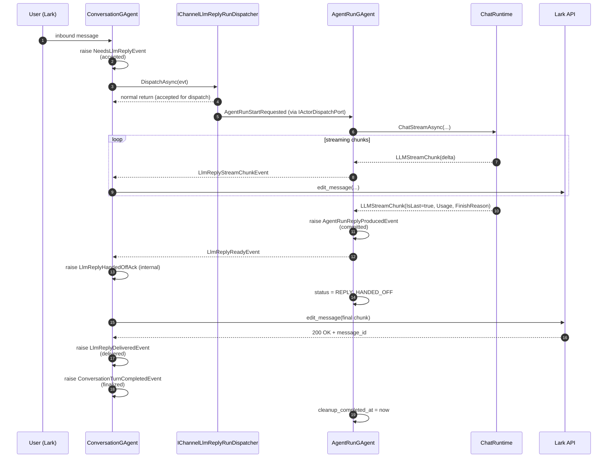
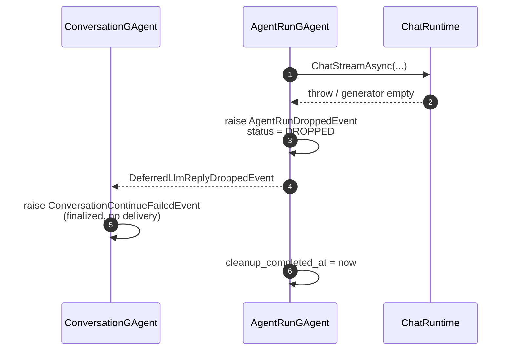
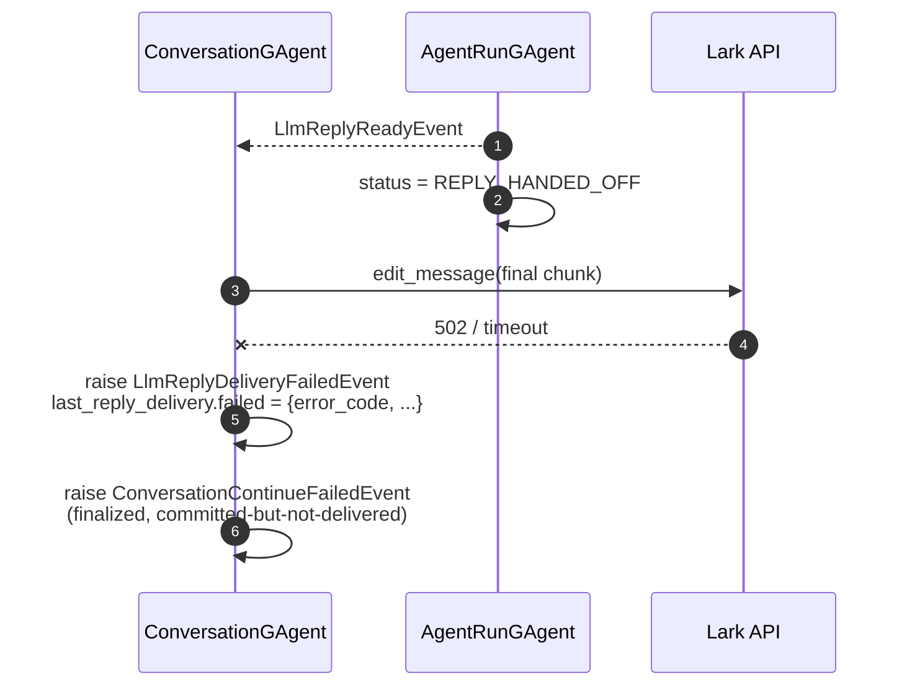
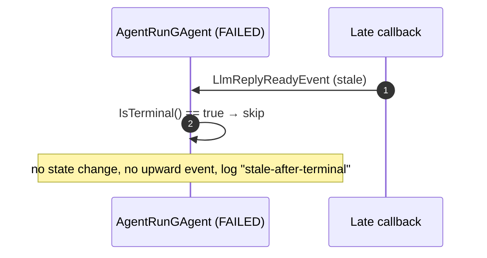
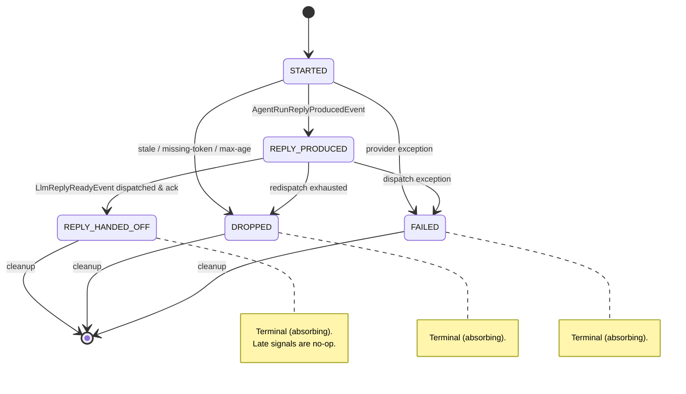
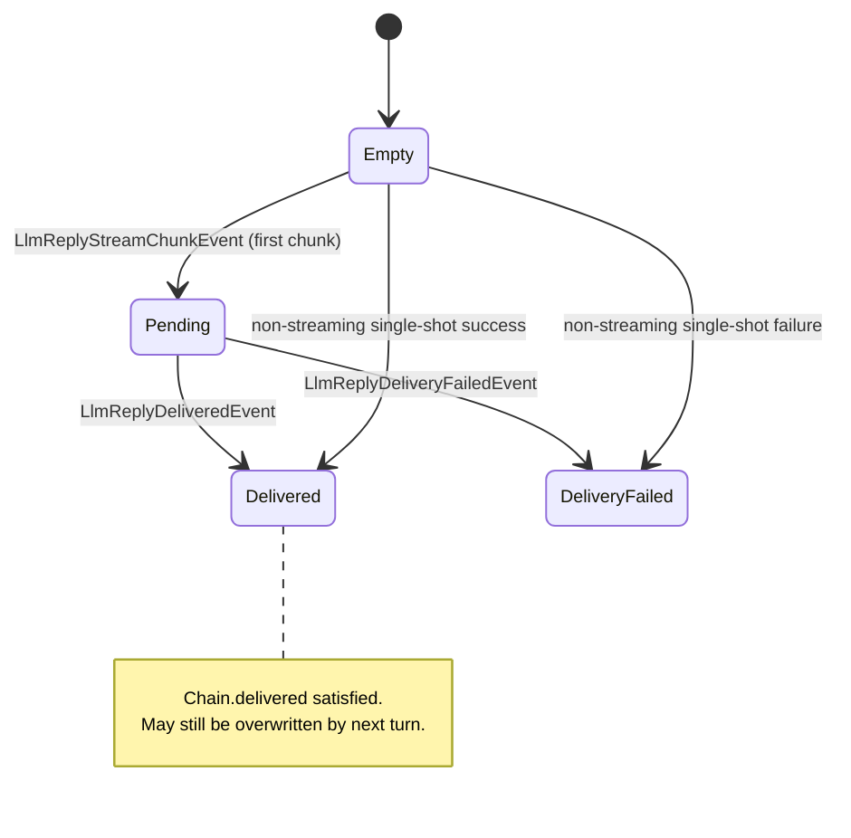

# Lark Reply Chain Completion Semantics

ADR-0021 决策的工程参考。本文档面向实现者，给出每个阶段的可观察 state、事件时序、故障矩阵、状态机图与实现 checklist。基础决策见 [`docs/adr/0021-lark-reply-chain-completion-semantics.md`](../adr/0021-lark-reply-chain-completion-semantics.md)；dispatcher plain `Task` handoff 修订见 [`docs/adr/0027-lark-reply-run-dispatcher-plain-task-handoff.md`](../adr/0027-lark-reply-run-dispatcher-plain-task-handoff.md)。

## 1. 链路与四阶段定位

```
ConversationGAgent ──► IChannelLlmReplyRunDispatcher ──► AgentRunGAgent ──► ConversationReplyGenerator ──► ChatRuntime
       ▲                          │                            │                       │                       │
       │                          │                            ▼                       ▼                       │
       │                       accepted                    committed             (chunk stream)                │
       │                                                                                                       │
       └──────────────── delivered (channel sink ack) ◄── handed_off ◄────────────────────────────────────────┘
                              │
                              ▼
                          finalized (terminal status + cleanup_completed_at)
```

## 2. 可观察 State 表

每个阶段必须可通过下列字段/事件**单一**可观察。任何"靠 X 推断 Y"都视为契约违反。

| 阶段 | 推进 actor | state 字段 | trigger event | 反例（不可作为观察源） |
|---|---|---|---|---|
| **accepted** | dispatcher → ConversationGAgent | `ConversationState.pending_llm_reply.{command_id, requested_at_unix_ms}` | `NeedsLlmReplyEvent` appended | dispatcher log line、内存计数器 |
| **committed** | AgentRunGAgent | `AgentRunState.status = REPLY_PRODUCED`<br/>`AgentRunState.reply_produced_at_unix_ms` | `AgentRunReplyProducedEvent` persisted | LLM provider 返回值、stream channel close |
| **delivered** | ConversationGAgent + channel sink | `ConversationState.last_reply_delivery.delivered.{acked_at_unix_ms, channel_message_id}` | `LlmReplyDeliveredEvent` | lark API 返回 200 但未 raise event、日志行 |
| **finalized** | AgentRunGAgent + ConversationGAgent | `AgentRunState.status ∈ {DROPPED, FAILED, REPLY_HANDED_OFF}`<br/>`AgentRunState.cleanup_completed_at != 0`<br/>`ConversationTurnCompletedEvent` 已 raise | 终态事件 + `AgentRunCleanupCompletedEvent`（可选） | 进程内 dictionary、回调"已 schedule" |

> 注：`REPLY_HANDED_OFF` 不直接证明 `chain.delivered` — 还需 `last_reply_delivery.delivered != null`。本表把它列在 finalized 列是因为 finalized 是 AgentRunGAgent 视角的终态。

## 3. 时序图：Happy Path（streaming）



## 4. 时序图：Failure Paths

### 4.1 LLM 产出失败（committed 前 dropped）



### 4.2 Lark sink 失败（committed 后、delivered 失败）



### 4.3 Stale signal 到达终态 actor（必须 no-op）



## 5. 故障矩阵

阶段 × 故障类型 → 最终落点。

| 故障发生时所处阶段 | 故障类型 | 终态 status | last_reply_delivery | 上抛事件 | 责任 actor |
|---|---|---|---|---|---|
| accepted → committed | duplicate run start | 不变（terminal duplicate no-op / retry path keeps `REPLY_PRODUCED`） | 不变 | log only or persisted retry handoff | AgentRunGAgent |
| accepted → committed | stale run age > MaxRunRequestAgeMs | `AgentRunStatus.DROPPED` | `null` | `AgentRunDroppedEvent` + `DeferredLlmReplyDroppedEvent` | AgentRunGAgent |
| accepted → committed | LLM provider error | `AgentRunStatus.FAILED` | `null` | `AgentRunFailedEvent` + `ConversationContinueFailedEvent` | AgentRunGAgent |
| accepted → committed | run age > MaxRunRequestAgeMs | `AgentRunStatus.DROPPED` | `null` | `AgentRunDroppedEvent` + `DeferredLlmReplyDroppedEvent` | AgentRunGAgent |
| accepted → committed | missing relay reply_token | `AgentRunStatus.DROPPED` | `null` | `AgentRunDroppedEvent` | AgentRunGAgent |
| committed → handed_off | dispatch `LlmReplyReadyEvent` 失败 | `AgentRunStatus.REPLY_PRODUCED` (持续 redispatch) | `null` | redispatch retry (in cs:126-141) | AgentRunGAgent |
| handed_off → delivered | lark API 4xx | `AgentRunStatus.REPLY_HANDED_OFF` | `failed{error_code}` | `LlmReplyDeliveryFailedEvent` + `ConversationContinueFailedEvent` | ConversationGAgent |
| handed_off → delivered | lark API 5xx / timeout | `AgentRunStatus.REPLY_HANDED_OFF` | `failed{error_code}` | 同上 | ConversationGAgent |
| 任意已 terminal 后 | 重复 ready/dropped/failed | 不变 | 不变 | log only | actor 入口 short-circuit |
| 任意已 terminal 后 | late cleanup callback | 不变（`cleanup_completed_at != 0`） | 不变 | log only | AgentRunGAgent |

## 6. AgentRunStatus 状态机



## 7. ConversationState.last_reply_delivery 转换



## 8. Streaming Closeout 契约（#648 实现侧）

`ChatRuntime.ChatStreamAsync` 对消费方（`ConversationReplyGenerator`）的契约：

- **Stream-local terminal**：消费方在一次 `ChatStreamAsync` 调用中**只见一次** `LLMStreamChunk { IsLast = true }`。multi-round tool use 的 round-level terminal **不向外暴露**，runtime 内部 fold。
- **Usage / FinishReason 挂位**：必须挂在最后一个 chunk 上（即 `IsLast = true` 的 chunk）。
- **Provider 早发 Usage 的处理**：若 provider 在 round 中段先发了 `Usage` 而 `IsLast = false`，runtime 必须**重排**：暂存 Usage，向消费方先发 delta chunks，待真正结束再合并到最后一个 `IsLast = true` chunk。
- **Warning 不视为 terminal**：长度截断 (`ToolCallLoop.IsLengthTruncated`) 是 round-level 信号，由 runtime 决定后续行为，不映射到外部 IsLast。
- **Tool-result chunk 不视为 terminal**：每轮 round 间的 `\n\n` separator chunk 与 tool-call payload chunk 都 `IsLast = false`。
- **Closeout 路径单一**：channel writer close 必须先 emit 最后一个 `IsLast = true` chunk 再 close，**不允许**靠"reader 见底"隐式终结。

## 9. Terminal Idempotency 契约（#649 实现侧）

`AgentRunGAgent` 所有 handler 入口必须遵守：

```csharp
internal static bool IsTerminal(AgentRunState s) =>
    s.Status == AgentRunStatus.Dropped
 || s.Status == AgentRunStatus.Failed
 || s.Status == AgentRunStatus.ReplyHandedOff;
```

**入口规则**：
1. `HandleAgentRunStartRequested`：终态 → schedule cleanup（不重启 LLM），return
2. `HandleLlmReplyReadyAsync` 内部 ack handler：终态 → log "stale-after-terminal"，return
3. `HandleAgentRunDroppedAsync` / `HandleAgentRunFailedAsync`：终态 → log，return
4. `ScheduleTerminalCleanupAsync`：`cleanup_completed_at != 0` → no-op
5. `ReDispatchProducedReplyAsync`：终态 → 取消未来 retry，return

**Stale signal 判定**：
- 通过 `runId` 不一致 → 视为 stale
- 通过 `nowMs - request.RequestedAtUnixMs > MaxRunRequestAgeMs` → 视为 stale，但仅在 STARTED 入口检查

**禁止**：
- 在终态 actor 上推进任何 state machine 边
- 在终态 actor 上发起新的 redispatch / callback schedule
- 通过 `lock` / `ConcurrentDictionary` 维护 "is this signal stale" 的内存字典（破坏 Actor 单线程事实源）

## 10. 实现 Checklist

- [ ] `agents/Aevatar.GAgents.NyxidChat/Protos/agent_run.proto`：扩 `AgentRunStatus` 加 `REPLY_HANDED_OFF`；`reply_dispatched` 标 `reserved`；加 `cleanup_completed_at`、`reply_produced_at_unix_ms`
- [ ] `agents/Aevatar.GAgents.Channel.Runtime/Protos/conversation_state.proto`：新增 `ReplyDeliveryStatus` 消息 + `ConversationState.last_reply_delivery` 字段
- [ ] 新增 domain event：`LlmReplyDeliveredEvent` / `LlmReplyDeliveryFailedEvent`（在 `Aevatar.GAgents.Channel.Runtime`）
- [x] `IChannelLlmReplyRunDispatcher.DispatchAsync` 返回 plain `Task`；删除 `DispatchOutcome` / `DispatchPhase`
- [x] `AgentRunDispatcher` 仅创建 run actor 并通过 `IActorDispatchPort.DispatchAsync` handoff；不做 dispatcher-local stale / duplicate admission
- [ ] `AgentRunGAgent`：
  - [ ] 新增 `IsTerminal()` helper
  - [ ] 替换 cs:114-124 隐式终态判定
  - [ ] 所有 handler 入口加 `IsTerminal()` short-circuit
  - [ ] `reply_dispatched` bool 读改 `Status == REPLY_HANDED_OFF`；写复用既有 `AgentRunReplyDispatchedEvent`（state matcher 升级 `status = REPLY_HANDED_OFF`，无需新事件）
  - [ ] `ScheduleTerminalCleanupAsync` 完成时 raise `AgentRunCleanupCompletedEvent`，state matcher 写入 `cleanup_completed_at_unix_ms`
- [ ] `ConversationGAgent`：
  - [ ] `RunLlmReplyAsync` (cs:458) 成功后 raise `LlmReplyDeliveredEvent`，失败 raise `LlmReplyDeliveryFailedEvent`
  - [ ] streaming chunk path (cs:532, cs:546) 在 final chunk 编辑成功后 raise `LlmReplyDeliveredEvent`
  - [ ] handler `HandleLlmReplyReadyAsync` (cs:422) 收到事件后短路重复 ack
- [ ] `ChatRuntime.ChatStreamAsync` (`src/Aevatar.AI.Core/Chat/ChatRuntime.cs:208`)：
  - [ ] 实现 Usage 重排（early-usage buffer + merge to last chunk）
  - [ ] 保证 stream-local 唯一 `IsLast = true` chunk
- [ ] 测试：
  - [x] dispatcher handoff 测试：typed `run_id` 派生 actor id / envelope id / dedup operation id
  - [x] duplicate / stale admission 测试落在 `AgentRunGAgent`
  - [ ] AgentRunGAgent terminal short-circuit 五类 late signal 各 1 测试
  - [ ] `ConversationGAgent` 失败 delivery 路径测试（lark 4xx / 5xx）
  - [ ] `ChatRuntime` Usage 重排测试（provider 中段发 Usage）
  - [ ] reply chain happy path 端到端断言新事件序列

## 11. 反例（implementation smells）

下列模式视为契约违反，应在 review 时拒收：

- 调用方依赖 `DispatchAsync` 正常返回推断 run admitted / committed / delivered
- 任何 handler 内通过 `_pendingRuns.ContainsKey(runId)` 或类似进程内字典判断 stale
- 在 `ConversationGAgent` 内直接调用 lark API 但不 raise delivery event
- `AgentRunGAgent` 在 `Status == DROPPED` 后仍执行 `ScheduleTerminalCleanupAsync` 内部副作用
- `ChatRuntime` 对外暴露多个 `IsLast = true` chunk（multi-round 时各 round 都发 terminal）
- 用 `reply_dispatched` bool 替代 `Status == REPLY_HANDED_OFF` 做新代码判断

## 12. 参考

- ADR-0021 [`docs/adr/0021-lark-reply-chain-completion-semantics.md`](../adr/0021-lark-reply-chain-completion-semantics.md)
- ADR-0027 [`docs/adr/0027-lark-reply-run-dispatcher-plain-task-handoff.md`](../adr/0027-lark-reply-run-dispatcher-plain-task-handoff.md)
- Issue #647 / #648 / #649
- 关联 ADR-0009 channel-bot-callback-architecture（callback 流上下游）
- 关联 ADR-0014 interactive-reply-abstraction
- 关联 Issue #596 run-actor continuation / #560 StreamSessionGAgent RFC（重构需在本契约下推进）
