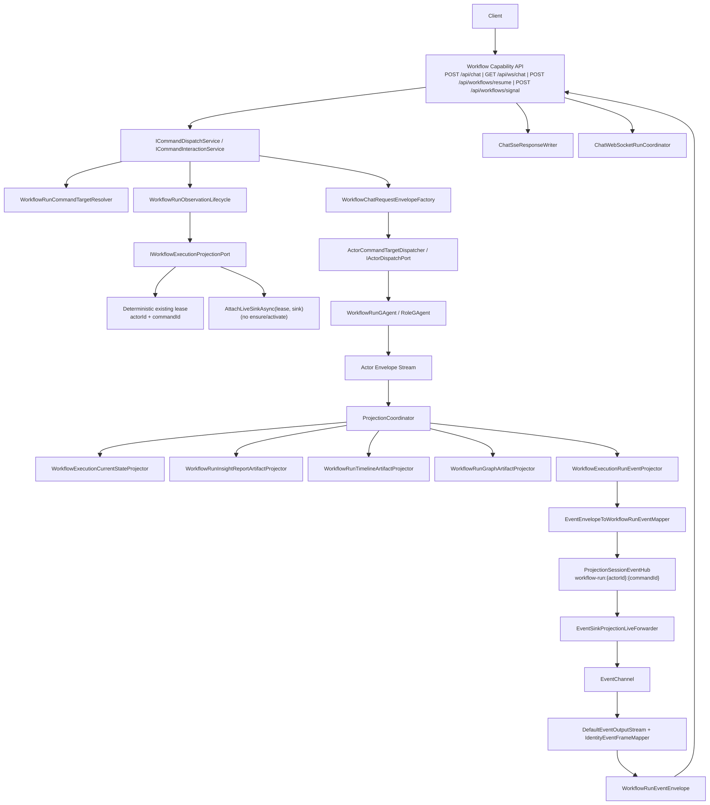
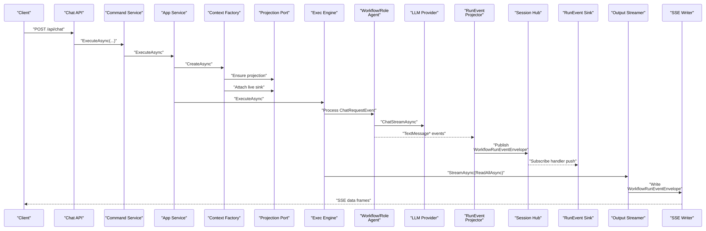
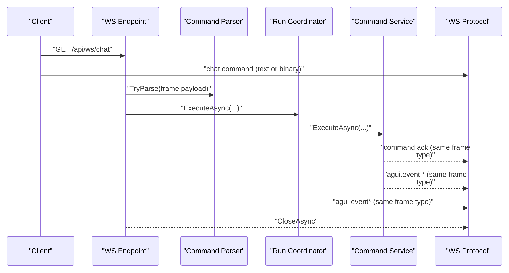
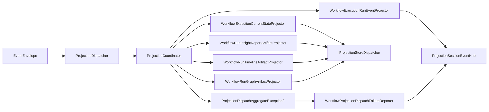
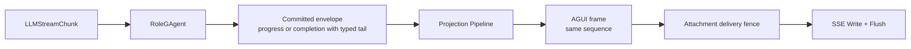
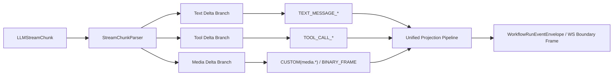

# Workflow LLM 流式链路详细架构文档（2026-02-25）

## 1. 目标与范围

本文档描述 Workflow 能力中 LLM 流式与多模态输入输出的完整技术链路，覆盖：

1. `Host -> Application -> Domain -> Projection -> SSE/WS` 端到端执行路径。
2. 会话语义（`actorId/commandId/sessionId/messageId`）与事实源落点。
3. 统一投影链路中的分支协作（读模型分支 + workflow run-event 实时分支）。
4. 当前支持的流类型、多模态输入输出与后续演进路径。

不包含内容：

1. Workflow YAML 业务编排语义细节（由 Workflow Core 文档负责）。
2. Provider SDK 内部实现细节（由 Provider 模块文档负责）。

## 2. 架构约束（本链路必须满足）

1. Host 只做协议适配与依赖组合，不承载业务状态机。
2. `Application Command -> EventEnvelope -> Domain Event` 与 `Query -> ReadModel` 严格分离。
3. CQRS/readmodel 与 workflow run-event 实时输出（SSE/WS）共享同一 Projection 输入链路，禁止双轨实现。
4. 投影运行态通过 lease/session 显式句柄管理，禁止中间层 `actorId -> context` 事实态反查。
5. 跨请求一致性事实必须落在 Actor 持久态/分布式状态，不依赖中间层进程内字典。
6. 用户可见 realtime 生命周期统一由 `IRealtimeSession<TInbound,TReceipt,TStartError,TOutboundFrame,TCompletion>` 表达；文本/AGUI 与 voice control/transcript 共享 `accepted/error -> outbound frames -> completion` 语义。

补充口径：

- 本文里的 `EventEnvelope` 是 runtime message envelope。
- LLM streaming 链路消费的是 actor envelope 流；Event Sourcing 领域事件仍由 Actor 显式持久化。
- Voice control/transcript frame 属于 projection-backed realtime stream；raw PCM 只有一条运行时路径：当前 transport lease 内的 `IVoiceVolatileMediaStreamPort` volatile relay 在 `IVoiceTransport` 与 `IRealtimeVoiceProvider` session 之间转发。raw PCM 不进入 actor/proto `VoiceModuleSignal`、`EventEnvelope`、projection、readmodel 或 committed event。

### 2.1 Responses LlmSession 流式执行边界

NyxID direct Responses / Messages / Chat Completions 的 `LlmSessionGAgent` 使用同一条 actor-owned run 记录语义；live provider stream 由短生命周期执行 actor/service 连续消费，不能占用 session actor command turn：

1. `LlmSessionGAgent` 在 actor turn 内接受 `LlmRunRequested`、持久化 `LlmRunStartedEvent`，并保持 `responseId + runId + sequence` 的权威状态。
2. `LlmSessionGAgent` 持久化 `LlmRunExecutionReadyEvent` 后，在自身 turn 内通过 `ILlmRunExecutionScheduler` 将 run **非阻塞入队**到进程内有界 `ILlmRunExecutionQueue`（队列满则抛 `LlmRunExecutionQueueFullException`，由 actor 落 `execution_dispatch_failed` 终态，绝不阻塞 actor turn）。host 注册的 `LlmRunExecutionWorker`（`BackgroundService`）从队列取出请求，通过 `ILlmRunExecutionService` / `ILlmRunExecutor` 调用 `ILlmRunCore`，在**任何 Orleans grain/event-handler turn 之外**（普通线程池任务）连续消费 live provider `ChatStreamAsync` / `IAsyncEnumerable<LLMStreamChunk>`。执行绝不放进 grain：grain handler 内 `await` 整段流式 run 会占满其 `DeliverBatch` turn、触发 Orleans 30s 流投递超时并与自身等待的投递自死锁（这正是被替换的 transient execution grain 的缺陷）。
3. 执行侧 `DispatchingLlmRunSink` 不直接改写 session 状态；每个观察到的 provider fact 都通过 `IActorDispatchPort` 进入 session actor inbox，并由 actor handler 持久化为 typed recorder event：`LlmStreamChunkObserved`、`LlmToolCallObserved`、`LlmSessionForwardedToolCallEmittedEvent`、`LlmRunCompleted`、`LlmRunFailed`、`LlmRunCancelled`。
4. actor 对 recorder event 只按 typed run identity 与 monotonic `sequence` 接受事实；重复 chunk、晚到 chunk、重复 terminal dispatch、terminal 后 failed/cancelled flush 都是幂等 no-op，不用文本内容相等做 duplicate heuristic，也不用执行侧或进程内 counter 冒充事实源。
5. terminal event 是 actor-owned finalizer：它可以跨过已丢失的中间 recorder event 完成 run，但 terminal 后不再接受新的 chunk/tool/failure 覆盖。
6. cancel flush 必须写入 `LlmRunCancelled` typed fact；取消 token 只取消 provider stream，不应阻止 recorder sink 记录最终取消事实。

不能把 live provider stream 拆成 session actor self-continuation 小步恢复，也不能把 stream ownership 放进无权威状态的 `Task.Run` callback。`IAsyncEnumerable<LLMStreamChunk>` 的枚举器持有 HTTP 连接、provider SDK 状态和当前 async frame；actor self-message 只能持久化“下一拍需要处理的稳定事实”，不能持久化或恢复该枚举器。当前边界把 provider consumption 建模为 **off-grain hosted run executor**（`LlmRunExecutionWorker` 驱动 `ILlmRunCore`，不是 grain、不拥有权威状态、不占用任何 grain turn），session actor 仍是 sequence/watermark、retry、cancellation 和 terminal facts 的唯一权威接受方。crash/abandon 兜底由 session actor 自持久 run-timeout finalizer 负责（run 超时与 24h session TTL 解耦，按分钟级 finalize），不依赖执行侧存活。worker 与队列是 per-host 运行机制（每个可承载 `LlmSessionGAgent` 的 silo 都注册 worker），并发上限按 host 计；若未来继续拆分执行器，新的执行组件必须保持同样的 typed recorder command、actor-owned finalizer 契约，且不得占用 grain turn。

相关架构基线：

1. `docs/canon/cqrs-projection.md:43`
2. `docs/canon/cqrs-projection.md:46`
3. `docs/canon/overview.md:79`

## 3. 组件与分层

| 层 | 组件 | 职责 |
|---|---|---|
| Host | `WorkflowCapabilityEndpoints`、`ChatSseResponseWriter`、`ChatWebSocketRunCoordinator` | 协议适配（HTTP/SSE/WS），不编排业务 |
| Application | `ICommandInteractionService<WorkflowChatRunRequest, WorkflowChatRunAcceptedReceipt, WorkflowChatRunStartError, WorkflowRunEventEnvelope, WorkflowProjectionCompletionStatus>`、`WorkflowRunCommandTargetResolver`、`WorkflowRunObservationLifecycle` | 命令目标解析、observation lifecycle、dispatch 编排、输出帧流化 |
| Domain/AI | `WorkflowGAgent`、`LLMCallModule`、`RoleGAgent`、`ChatRuntime` | 触发 LLM 调用、发布文本/工具/媒体事件 |
| Projection | `WorkflowExecutionCurrentStateProjector`、`WorkflowRunInsightReportArtifactProjector`、`WorkflowRunTimelineArtifactProjector`、`WorkflowRunGraphArtifactProjector`、`WorkflowExecutionRunEventProjector` | committed observation 到 current-state + durable artifacts 的物化 + workflow run-event 实时分发 |
| Streaming | `ProjectionSessionEventHub<WorkflowRunEventEnvelope>`、`EventChannel<WorkflowRunEventEnvelope>` | 会话事件总线与 live sink 通道 |

Voice presence follows the same realtime control shape for `VoiceRealtimeFrame`
control/transcript output. Raw audio is intentionally outside this table: it is
handled only by the lease-scoped `IVoiceVolatileMediaStreamPort` relay between
the transport and provider session, and never becomes an actor signal,
projection event, readmodel input, or `EventEnvelope` payload.

关键代码锚点：

1. `src/workflow/Aevatar.Workflow.Infrastructure/CapabilityApi/ChatEndpoints.cs:17`
2. `src/Aevatar.CQRS.Core/Interactions/FallbackCommandInteractionService.cs`
3. `src/workflow/Aevatar.Workflow.Application/Runs/WorkflowRunObservationLifecycle.cs`
4. `src/Aevatar.AI.Core/RoleGAgent.cs:106`
5. `src/Aevatar.AI.Core/Chat/ChatRuntime.cs:89`
6. `src/workflow/Aevatar.Workflow.Presentation.AGUIAdapter/WorkflowExecutionRunEventProjector.cs`
7. `src/workflow/Aevatar.Workflow.Presentation.AGUIAdapter/EventEnvelopeToWorkflowRunEventMapper.cs`
8. `src/Aevatar.CQRS.Projection.Core/Streaming/ProjectionSessionEventHub.cs`

`AGUIEvent` CLR protobuf contracts are generated by `Aevatar.AGUI.Contracts`; `Aevatar.GAgentService.Hosting.Sse` owns AGUI SSE emission for the hosting endpoints that consume those contracts.

## 4. 整体拓扑图



## 5. 端到端执行链路

<style>
.seq-wide {
  overflow-x: auto;
  -webkit-overflow-scrolling: touch;
}
.seq-wide .mermaid svg {
  display: block;
  max-width: 100% !important;
  width: 100% !important;
  min-width: 0 !important;
  height: auto !important;
}
</style>

### 5.1 SSE 路径（`POST /api/chat`）

<div class="seq-wide">



</div>

链路锚点：

1. `src/workflow/Aevatar.Workflow.Infrastructure/CapabilityApi/ChatEndpoints.cs:44`
2. `src/Aevatar.CQRS.Core/Interactions/FallbackCommandInteractionService.cs`
3. `src/workflow/Aevatar.Workflow.Application/Runs/WorkflowRunObservationLifecycle.cs`
4. `src/Aevatar.AI.Core/RoleGAgent.cs:122`
5. `src/workflow/Aevatar.Workflow.Presentation.AGUIAdapter/WorkflowExecutionRunEventProjector.cs`
6. `src/workflow/Aevatar.Workflow.Infrastructure/CapabilityApi/ChatSseResponseWriter.cs:45`

### 5.2 WebSocket 路径（`GET /api/ws/chat`，text/binary 类型化帧）

<div class="seq-wide">



</div>

链路锚点：

1. `src/workflow/Aevatar.Workflow.Infrastructure/CapabilityApi/ChatEndpoints.cs:152`
2. `src/workflow/Aevatar.Workflow.Infrastructure/CapabilityApi/ChatWebSocketProtocol.cs:16`
3. `src/workflow/Aevatar.Workflow.Infrastructure/CapabilityApi/ChatWebSocketCommandParser.cs:20`
4. `src/workflow/Aevatar.Workflow.Infrastructure/CapabilityApi/ChatWebSocketRunCoordinator.cs:22`
5. `src/workflow/Aevatar.Workflow.Infrastructure/CapabilityApi/ChatCapabilityModels.cs:1`

分层说明：

1. `chat.command` 协议输入模型（`ChatInput`/`ChatWsCommand`）已下沉到 `Infrastructure/CapabilityApi`。
2. `Application.Abstractions` 保留运行编排契约，不再承载宿主传输协议 DTO。

### 5.3 人工交互回传路径（`POST /api/workflows/resume` / `POST /api/workflows/signal`）

该路径用于 `human_input` / `human_approval` / `wait_signal` 的外部回传，约束如下：

1. 请求必须显式携带 `actorId + runId`（无中间层 `runId -> actorId` 内存映射）。
2. `resume` 还需携带 `stepId`；`signal` 还需携带 `signalName`。
3. Endpoint 通过 `IWorkflowRunActorPort` 定位 actor 后，分别投递 `WorkflowResumedEvent` / `SignalReceivedEvent`。
4. `wait_signal` 的 runId 以 `WaitingForSignalEvent.run_id` 为准，不再通过 `CorrelationId` 推断。

最小请求示例：

```json
POST /api/workflows/resume
{
  "actorId": "wf-2f3f...",
  "runId": "run-8b34...",
  "stepId": "approval_gate",
  "approved": true,
  "userInput": "LGTM"
}
```

```json
POST /api/workflows/signal
{
  "actorId": "wf-2f3f...",
  "runId": "run-8b34...",
  "signalName": "ops_window_open",
  "payload": "window=2026-02-25T21:00Z"
}
```

## 6. 统一投影分支与一对多分发

`ProjectionCoordinator` 按注册顺序调用多个 projector；单分支失败会聚合后统一上抛，不阻断其他分支尝试。



关键锚点：

1. `src/Aevatar.CQRS.Projection.Core/Orchestration/ProjectionCoordinator.cs:19`
2. `src/Aevatar.CQRS.Projection.Core/Orchestration/ProjectionCoordinator.cs:40`
3. `src/workflow/Aevatar.Workflow.Projection/Projectors/WorkflowExecutionCurrentStateProjector.cs`
4. `src/workflow/Aevatar.Workflow.Presentation.AGUIAdapter/WorkflowExecutionRunEventProjector.cs`
5. `src/workflow/Aevatar.Workflow.Projection/Orchestration/WorkflowProjectionDispatchFailureReporter.cs:38`

## 7. 会话语义与状态事实源

### 7.1 关键标识

| 标识 | 生成位置 | 语义范围 | 事实源 | 主要消费点 |
|---|---|---|---|---|
| `actorId` | `WorkflowRunActorResolver` / run control request | Workflow Actor 地址维度；run control 中只用于定位目标 Actor | Actor Runtime / `WorkflowActorBinding.ActorId` | 投影上下文、查询接口、run control dispatch target |
| `runId` | Workflow run binding / run control request | Workflow run 业务执行维度；不作为 Actor 地址或 command/session identity | `WorkflowActorBinding.RunId` | `WorkflowRunControlCommandTarget.RunId`、`WorkflowResumedEvent.RunId`、`SignalReceivedEvent.RunId`、`WorkflowStoppedEvent.RunId` |
| `commandId` | `DefaultCommandContextPolicy` | 一次 run 命令维度；run control 中作为 accepted command / envelope identity | Application CommandContext | `workflow-run:{actorId}:{commandId}` 会话流、`WorkflowRunControlAcceptedReceipt.CommandId`、`EventEnvelope.Id` |
| `correlationId` | `DefaultCommandContextPolicy` | 命令追踪维度；默认可与 `commandId` 同值，但语义独立 | Application CommandContext | `EventEnvelope.Propagation.CorrelationId`、`WorkflowRunControlAcceptedReceipt.CorrelationId` |
| `sessionId` | `WorkflowChatRunRequest.SessionId` + `WorkflowChatRequestEnvelopeFactory` fallback | 本次 chat 会话维度 | Command payload | `ChatRequestEvent.SessionId` |
| `chatSessionId` | `ChatSessionKeys.CreateWorkflowStepSessionId` | 单 workflow step 维度 | `scopeId:stepId` 规则 | `LLMCallModule` pending 匹配 |
| `messageId` | run-event mapper | 单消息流维度 | `msg:{sessionId}` 或 `msg:{envelopeId}` | 文本增量拼装 |

锚点：

1. `src/Aevatar.CQRS.Core/Commands/DefaultCommandContextPolicy.cs:7`
2. `src/workflow/Aevatar.Workflow.Application/Runs/WorkflowRunAcceptedReceiptFactory.cs`
3. `src/workflow/Aevatar.Workflow.Application/Runs/WorkflowChatRequestEnvelopeFactory.cs:13`
4. `src/Aevatar.AI.Abstractions/ChatSessionKeys.cs:8`
5. `src/workflow/Aevatar.Workflow.Core/Modules/LLMCallModule.cs:58`
6. `src/workflow/Aevatar.Workflow.Presentation.AGUIAdapter/EventEnvelopeToWorkflowRunEventMapper.cs`

### 7.2 运行态约束

1. live sink 订阅通过 `lease + sink` 显式绑定；command binder 只 attach 到 deterministic existing session，不在 dispatch 前 ensure/activate projection。
2. 会话事件分发按 `scopeId=session actorId` 和 `sessionId=commandId` 二元键，不依赖中间层全局 `actorId->context` 映射。
3. sink 写入失败会按策略 detach，并尝试发布 run error 遥测事件。

锚点：

1. `src/workflow/Aevatar.Workflow.Projection/Orchestration/WorkflowExecutionRuntimeLease.cs:22`
2. `src/Aevatar.CQRS.Projection.Core/Orchestration/EventSinkProjectionSessionSubscriptionManager.cs:26`
3. `src/Aevatar.CQRS.Projection.Core/Streaming/ProjectionSessionEventHub.cs:77`
4. `src/workflow/Aevatar.Workflow.Projection/Orchestration/WorkflowProjectionSinkFailurePolicy.cs:39`

## 8. 事件模型与输出契约

### 8.1 LLM/AI 事件（Domain 侧）

| 事件 | 生产者 | 说明 |
|---|---|---|
| `TextMessageStartEvent` | `RoleGAgent` | 文本消息开始 |
| `TextMessageContentEvent` | `RoleGAgent` | 文本增量（delta） |
| `TextMessageEndEvent` | `RoleGAgent` | 文本消息结束（含完整 content） |
| `MediaContentEvent` | `RoleGAgent` | 多模态媒体分片（image/audio/video） |
| `ToolCallEvent` | `RoleGAgent`、`ToolCallModule` | 流式工具调用（LLM delta）与模块级工具调用 |
| `ToolResultEvent` | `ToolCallModule` | 工具执行结果 |
| `ChatResponseEvent` | `WorkflowGAgent` 等 | 非流式回退路径 |

NyxIdChat 的用户可见 live path 不直接投影上述 transient publications。`RoleGAgent` 在每个 chunk 上提交 `RoleChatSessionProgressedEvent(session_id, sequence, typed payload)`，NyxIdChat session projector 只消费该 committed `EventEnvelope`。typed payload 覆盖 text、reasoning、media、tool start/result、tool approval、usage、authorization、terminal 与 explicit replay；actor sequence 是该 turn 的唯一展示顺序水位。Projection scope 另按 origin actor 持久化 source-version watermark，拒绝 normal observation 中 fan-out 前的 broker 重投或乱序旧 envelope；已记录 projection failure 的显式 replay 绕过该 fence，避免 N 失败、N+1 成功后 N 永久不可恢复。每个显式 sink attachment 再用 latest sequence + protobuf bytes fence 拒绝 fan-out 后的重复帧。该 fence 随 attachment 释放，同一 replay sequence 下内容不同的多帧仍全部投递。

`RoleChatSessionCompletedEvent` 仍是 terminal/final authority，并在同一个 committed fact 内嵌尚未 live 投递的 final text、usage、text end、authorization 与唯一 terminal typed tail。normal projector 只展开该 tail，不读取 completion snapshot 合成全文，因此 completed authority 与 terminal presentation 不会被逐事件发布失败拆开，也不会重复已流式投递的内容。显式 replay 才能把 committed completion snapshot 按 tool、reasoning、media、text、usage、terminal 的展示顺序完整展开。不同输入复用同一 turn id 时，新 producer 提交带独立 command attempt id 的 rejection，不推进已完成 session 的 progress sequence；projection 在滚动升级期间仍兼容旧 `RoleChatSessionConflictEvent` TypeUrl。provider-native tool、text-parsed tool 与 initial skill recovery 都使用同一个 start-before-execution/result lifecycle；`use_skill` 在 start snapshot 时从结构化参数解析实际 skill identity。

Actor activation 对 durable session 只做候选发现：每个未终态 session 通过 typed `RoleChatIncompleteSessionFinalizationRequested(session_id, expected_last_progress_sequence)` self-message 进入下一次 actor turn，再与权威 state 对账。当前恢复契约不持久化 LLM credential、tool context 或完整 tool intent，因此 activation 和 caller retry 都不得自动重放 provider/tool 调用；started-only session 提交 `FAILED + SESSION_ORPHANED`，已有 committed progress 的 session 提交 `OUTCOME_UNCERTAIN + SESSION_OUTCOME_UNCERTAIN`。两者都复用唯一的 `RoleChatSessionCompletedEvent + terminal_progress + completion notification` 主链。completion notification 的 activation recovery 按 session 隔离失败，单个 outbox 故障不得阻断其余 pending delivery 或 incomplete-session sweep。

重复、陈旧 signal 幂等忽略，等待 typed tool approval continuation 的 session 不参与该 sweep。session retention 只在新 session admission 时回收已终态、completion notification 已完成且 transcript history 不处于 `Prepared` 的记录；terminal/progress/delivery reducer 不得隐式 trim。容量已满且没有安全可回收记录时，actor 提交 typed `CAPACITY_EXHAUSTED` rejection，且不得启动 LLM/tool。`OUTCOME_UNCERTAIN` 不是失败别名：它只允许由同一 authoritative session 的明确 `COMPLETED` 或 `FAILED` fact 对账；后两者是吸收态。合法对账复用 session identity，重置 completion outbox，并用包含 typed outcome 的 deduplication operation id 重新投递一次。



锚点：

1. `src/Aevatar.AI.Abstractions/ai_messages.proto:8`
2. `src/Aevatar.AI.Abstractions/ai_messages.proto:12`
3. `src/Aevatar.AI.Core/RoleGAgent.cs:114`
4. `src/workflow/Aevatar.Workflow.Core/Modules/ToolCallModule.cs:53`
5. `src/Aevatar.AI.Abstractions/ai_messages.proto:34`

### 8.2 WorkflowRunEvent（输出统一事件）

支持类型：

1. `RUN_STARTED / RUN_FINISHED / RUN_ERROR`
2. `STEP_STARTED / STEP_FINISHED`
3. `TEXT_MESSAGE_START / TEXT_MESSAGE_CONTENT / TEXT_MESSAGE_END`
4. `TOOL_CALL_START / TOOL_CALL_END`
5. `STATE_SNAPSHOT / CUSTOM`

锚点：

1. `src/workflow/Aevatar.Workflow.Application.Abstractions/Runs/WorkflowRunEventTypes.cs:3`
2. `src/workflow/Aevatar.Workflow.Application.Abstractions/Runs/WorkflowRunEventContracts.cs:13`
3. `src/Aevatar.CQRS.Core/Streaming/DefaultEventOutputStream.cs:5`
4. `src/workflow/Aevatar.Workflow.Projection/Orchestration/WorkflowRunEventSessionCodec.cs:17`

### 8.3 支持矩阵（当前实现）

| 流类型 | 当前状态 | 说明 |
|---|---|---|
| 文本增量流（delta text） | 已支持 | 主链路能力 |
| 工具调用结果流 | 已支持 | 通过 workflow run-event ToolCall 映射进入统一输出 |
| 状态快照流 | 已支持 | `STATE_SNAPSHOT` 统一携带 `actorId/commandId/projectionCompletion*` 与可选 projection snapshot |
| 人工交互事件流 | 已支持 | `CUSTOM` 事件输出 `aevatar.step.request` / `aevatar.step.completed` / `aevatar.workflow.waiting_signal`（含显式 runId），用于 UI 渲染与回传 |
| 流式 `DeltaToolCall` | 已支持 | Provider -> `ChatRuntime` -> `RoleGAgent` 贯通，转为 `ToolCallEvent` |
| WS 二进制命令/事件帧 | 已支持 | `ChatWebSocketProtocol` + `ChatWebSocketMessageContracts` 统一 text/binary 与 `ack/event/error` 强类型出站 |
| 多模态业务事件（音频/图像/video） | 已支持 | `ChatInput.inputParts` -> `ChatRequestEvent.input_parts` -> Provider `ContentPart` -> `MediaContentEvent`，输出侧映射为 `CUSTOM(aevatar.media.chunk)` |

锚点：

1. `src/Aevatar.AI.Abstractions/LLMProviders/LLMResponse.cs:34`
2. `src/Aevatar.AI.Core/Chat/ChatRuntime.cs:89`
3. `src/workflow/Aevatar.Workflow.Infrastructure/CapabilityApi/ChatWebSocketProtocol.cs:16`
4. `src/workflow/Aevatar.Workflow.Infrastructure/CapabilityApi/ChatWebSocketMessageContracts.cs:5`
5. `src/workflow/Aevatar.Workflow.Infrastructure/CapabilityApi/ChatWebSocketRunCoordinator.cs:20`

## 9. 失败处理与收敛语义

1. run 完成判定基于输出帧类型：`RUN_FINISHED -> Completed`，`RUN_ERROR -> Failed`。
2. Projection dispatch 失败会写入 `PROJECTION_DISPATCH_FAILED` 运行错误事件。
3. sink 背压/写入异常触发 detach，避免阻塞主处理链路，并以 best-effort 发布运行错误。
4. 收尾阶段固定执行：detach sink -> await processing -> release projection -> complete/dispose sink。

锚点：

1. `src/workflow/Aevatar.Workflow.Application/Runs/WorkflowRunCompletionPolicy.cs:12`
2. `src/workflow/Aevatar.Workflow.Projection/Orchestration/WorkflowProjectionDispatchFailureReporter.cs:40`
3. `src/workflow/Aevatar.Workflow.Projection/Orchestration/WorkflowProjectionSinkFailurePolicy.cs:39`
4. `src/workflow/Aevatar.Workflow.Application/Runs/WorkflowRunResourceFinalizer.cs:25`

## 10. 演进设计：扩展到多模态业务流

当前实现已经支持多模态输入和媒体输出，不再停留在“待扩展”阶段。后续演进目标是把媒体输出从 `CUSTOM(aevatar.media.chunk)` 进一步收敛为更稳定的专用输出事件类型，并在 WS 边界增加可选的二进制载荷协商。



当前收敛方式：

1. 输入侧统一使用 `ChatInput.inputParts` / `WorkflowChatRunRequest.InputParts` / `ChatRequestEvent.input_parts` 传递 `text/image/audio/video`。
2. Provider 通过 `ILLMProvider.Capabilities` 声明支持的输入/输出模态与流式能力，failover 仅在兼容能力集合内切换。
3. 运行时把媒体增量归一化为 `LLMStreamChunk.DeltaContentPart`，`RoleGAgent` 发布 `MediaContentEvent`，投影侧映射到统一输出链路。

后续建议：

1. 为媒体输出增加显式 `WorkflowRunEvent` 类型常量，减少消费方对 `CUSTOM` 名称的分支判断。
2. 在 WS 边界增加元数据帧 + 二进制附件帧协商，减少大体积 base64 传输的开销。

本次重构已完成：

1. `ChatRuntime.ChatStreamAsync` 已接入 `DeltaToolCall` 聚合与透传。
2. `RoleGAgent` 已把流式工具调用转为 `ToolCallEvent` 发布到上行事件链路。
3. CQRS generic interaction service 已在 run 收敛后统一触发 `WorkflowRunFinalizeEmitter` 发出 `STATE_SNAPSHOT` 输出帧。
4. `ChatWebSocketProtocol`/`ChatWebSocketCommandParser` 已支持 text/binary 类型化帧输入输出，且回包帧类型与命令入帧一致。
5. `ChatWebSocketMessageContracts` 已统一 `command.ack / agui.event / command.error` 出站契约，移除匿名对象拼装分支。
6. `WorkflowRunEventTypes` 已成为 `Application/Projection` 共享的唯一事件类型常量源，消除跨层硬编码字符串漂移。
7. `ChatInput`/`ChatWsCommand` 已从 `Application.Abstractions` 移至 `Infrastructure/CapabilityApi`，恢复宿主协议与应用契约的边界分层。

## 11. 验证建议

最低验证命令：

1. `bash tools/ci/architecture_guards.sh`
2. `bash tools/ci/projection_route_mapping_guard.sh`
3. `dotnet test test/Aevatar.Workflow.Host.Api.Tests/Aevatar.Workflow.Host.Api.Tests.csproj --nologo`

推荐测试关注点：

1. SSE 文本增量顺序、终止帧与错误帧。
2. WS `command.ack -> agui.event*` 顺序稳定性（text/binary 两种帧类型）。
3. `commandId` 会话隔离（同 actor 多 command 并发）。
4. sink 背压异常下的 detach 与 run error 遥测。
5. Responses `LlmSession` run 验收矩阵：duplicate chunks、late recorder commands、cancel flush、terminal dispatch retry、interleaving、no-terminal timeout/cancel。对应本地测试为 `LlmRunCoreTests`、`LlmRunEndToEndAcceptanceTests`、`LlmSessionGAgentTests`。
