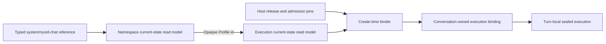

# NyxID Chat Agent Profile Binding

A direct NyxID conversation may receive one Agent Profile only while the
conversation Actor is being created. The Profile Actor's committed state is the
sole authority for Profile instructions, sealed member bodies, routing policy,
and Profile tool policy. Mainnet Host owns release selection and admission pins,
not Profile content.

## Identity And Authority

The rollout reference is the typed `AgentProfileReference` with
`owner_handle = "system"` and `profile_slug = "nyxid-chat"`. This human reference
is lookup input only. The Profile id is opaque and must be resolved from the
namespace current-state read model; no caller or Host derives it from the
reference, route, prefix, or Actor id.

`AgentProfileRolloutReleaseSpec` is the Host-owned strict ProtoJSON contract. It
contains release/stage identity, activation mode, cohort inputs, fixed runtime
bounds, the typed Profile reference, the expected published revision and
snapshot digest, and the expected exact Ornn identity closure. It contains no
Profile instructions, member bodies, routing policy, Profile tool policy, or
opaque Profile id. `NyxIdChatAgentProfileOptions` carries only the enablement
switch and release-spec path.

## One Create-Time Resolution

For a conversation selected into the rollout cohort, the binder performs this
single read sequence before Actor creation:

1. Read the namespace current-state model once by the typed
   `system/nyxid-chat` reference.
2. Validate the active namespace entry and obtain its opaque Profile id.
3. Read the protected execution current-state model once by that opaque id.
4. Validate namespace/execution identity and version agreement, the published
   revision and digest, the exact skill closure, release/runtime pins, and route
   admission.
5. Map and seal one deterministic `AgentProfileExecutionBinding`.

The binder queries only read models. It never creates or primes a projection,
replays committed events, reads Profile Actor state or an event store, waits for
an Actor reply, or calls Ornn/HTTP.

Binding outcomes are strict:

| Status | Creation result |
|---|---|
| `NotSelected` | Create an unprofiled conversation Actor. This is the only status that permits unprofiled creation. |
| `Bound` | Put the complete sealed binding on the create command, then create the Actor. |
| `ProfileUnavailable` | Fail admission before Actor creation. Missing or mutually stale read models do not fall back to unprofiled creation. |
| `AdmissionMismatch` | Fail admission before Actor creation. Identity, digest, closure, pin, or route mismatch does not fall back to unprofiled creation. |

## Immutable Conversation Fact

The new Actor verifies the deterministic binding digest and commits one
`AgentProfileBoundEvent`.
`NyxIdChatConversationGAgentState.agent_profile_binding` is the canonical
conversation's authoritative current binding. Repeating the same deterministic
bytes is idempotent; removing or replacing an existing binding is rejected.

Wire evolution is additive: `NyxIdChatConversationCreateCommand` carries
`agent_profile_binding = 4`; `AgentProfileBoundEvent` carries `binding = 2`;
and `NyxIdChatConversationGAgentState` carries `agent_profile_binding = 4` plus
`agent_profile_turn_authority = 19`. `RoleGAgentState` retains its binding and
turn-authority fields only for the legacy `nyxid.chat.legacy` route; it is not
the canonical direct-chat authority. The removed `agent_profile` tags remain
reserved.

Every newly committed turn authority carries
`AgentProfileTurnAuthorityState.binding_identity = 7`. The typed identity holds
the complete source provenance plus the deterministic execution-binding digest,
so Recovery and RestrictedEmpty authority remain fenced to one exact binding
even when no route candidate exists. Candidate identity is additional selected
route provenance, not the binding fence. Identity-less RestrictedEmpty is
accepted only for historical `LegacyAuthorityMissing` replay.

The binding preserves two separate provenance domains:

- source provenance identifies the opaque Profile id, Profile authority state
  version, published revision, and published snapshot digest; and
- admission provenance identifies release, stage, SHADOW/ENFORCED mode, route
  tool-set reference, and the digest of the Host release/admission spec.

It also contains the sealed Profile instructions, effective Profile maximum and
recovery policies, runtime bounds, ordered sealed members, and its own
deterministic digest. Content is copied from the protected execution replica;
Host admission data does not become a second content source.

Configuration or Profile publication changes affect later conversation
creation only. Existing conversations are never replayed, backfilled, lazily
bound, rebound, or hot-upgraded. Every later turn and replay uses the persisted
binding with zero Profile queries and zero Ornn reads.

## Turn-Local Sealed Execution

Each profiled turn verifies the persisted binding, resolves only the route-owned
local tool capabilities, narrows policy, and selects from sealed members already
inside the binding. The conversation controller commits the typed turn authority
before it dispatches work to the turn Actor. That dispatch carries both the
typed binding and typed authority; the turn does not rediscover either identity
from routes, strings, or process-local context.

The turn executor materializes one exact `AgentProfileTurnCatalog` from those
typed values for a fresh attempt and keeps it only in the transient execution
session. The same catalog object fences the initial request, every later model
round, tool continuations, and same-attempt recovery. A continuation whose key,
binding, or committed authority drifts is rejected before model or tool
invocation. A fresh retry with newly committed authority discards the prior
transient catalog and materializes a new one. An exact skill reference is
provenance and candidate fencing, not a runtime fetch instruction.

For profiled work, `reconciliation_key.attempt` is the turn-wide Profile
attempt, not a per-step operation generation. A fresh profiled LLM dispatch
captures that value as `agent_profile_attempt_source`; successor tool and
continuation LLM commands inherit the same exact source even though each new
step starts with its own `operation_generation = 1`. Dispatch and execution
fence the source against the committed authority and transient catalog, while
the normal operation key independently fences each step.

`RetryStarted` clones the entire committed authority and advances the Profile
attempt exactly once, whether the active authority is Selected, Recovery, or
RestrictedEmpty. The retried step advances its own operation generation under
the normal step policy; later successor steps inherit the new Profile attempt
without advancing it again. Retry and Reconcile cannot replace the binding
identity.

Completed replay returns the already-committed terminal result. Incomplete-turn
recovery may reconcile only against the persisted binding and committed turn
authority. Neither path queries a Profile read model, reads Ornn, reconstructs a
body from an exact reference, or introduces a second chat pipeline.

### Member Activation

- `ALWAYS` members are Profile-level prompt procedures. Every procedure enters
  every Profile prompt in authoritative published order, in both SHADOW and
  ENFORCED. An `ALWAYS` member has no route candidate or task-tool authority and
  never widens the available tools.
- `ROUTED` members participate in exact-alias and bounded-classifier selection.
  A unique routed alias wins without classifier I/O; routed selection takes
  precedence over the default member.
- `DEFAULT_FOR_UNMATCHED_TURN` is selected only after a true classifier
  no-match, or when there are zero routed candidates. Classifier failure,
  timeout, alias collision, or unknown intent fails closed to recovery and does
  not select the default.

Raw Profile `instructions` retain their exact 32,768-byte UTF-8 bound. The
materialized Profile prompt layer has an exact 65,536-byte UTF-8 bound including
all canonical `<always-skill-procedure>` wrappers and separators. A layer over
that rendered bound is rejected as a whole.

### Rollout Modes

SHADOW may run the bounded classifier and record a candidate plus safe
observation. It does not inject a routed selected body and it keeps recovery
authority. Profile instructions and `ALWAYS` procedures still apply because
they are Profile-level prompt content, not routed selection.

ENFORCED may inject the selected member's sealed instruction body after
deterministic selection and committed authority. The body comes directly from
the conversation binding. Neither mode performs a remote content read.

### Tool Authority

Tools are object capabilities owned by the selected chat route, not names that a
Profile can manufacture. The outer eligible set is the narrowing intersection
of route-owned tools, caller visibility and eligibility, the Host admission
ceiling, and the Profile maximum policy. Recovery further applies the recovery
policy. An ENFORCED selected route may admit the union of recovery and selected
task policy only inside every preceding ceiling. `ALWAYS` content never adds a
tool.

Route and Actor registrations with the same tool name must refer to the same
object capability. A name collision removes that capability and degrades
authority. Middleware may narrow the final request again but cannot substitute a
same-named object. Model schema exposure and execution therefore use the same
request-local exact tool objects. Missing policy, discovery failure, collision,
classifier failure, or invalid binding can only degrade to recovery or
restricted-empty; no failure restores unrestricted tools.

## Canonical Telemetry Seams

Canonical direct chat emits Agent Profile telemetry through the existing
`Aevatar.GenAI` source at four bounded seams:

- `route` and `materialize` surround typed authority selection and its durable
  commit in the conversation controller;
- `first_stream_output` is one-shot for the transient execution session, even
  when the same attempt spans multiple continuation rounds; and
- `plan_handoff` is emitted only after
  `NyxIdChatOperationReconciledEvent` commits the final typed lifecycle result,
  and only when no successor command remains.

The lifecycle outcome is closed and typed: `completed`, `handoff_pending`,
`failed`, `stopped`, or `blocked`. Browser-action authorization remains its own
typed flow and is not reported as the legacy approval handoff seam. Telemetry
may record safe provenance, mode, outcome, counts, and duration, but never user
content, classifier prose, sealed instructions, raw tool arguments, tokens,
headers, or credentials.

## Deployment And Compatibility Boundary

The checked-in release pins remain dormant while rollout is disabled and no
release path is configured. Enabling rollout requires the real committed Profile
revision and digest and real exact Ornn identities. The deployment verification
tool may exact-read those identities and emit one canonical pin-only
`reviewed-release.json`; it does not publish packages, create skillsets, or emit
copies of complete Profile content.

Runtime never executes `protoc`, calls the deployment tool, or reads an exact
Ornn endpoint. Old conversation bytes without `agent_profile_binding` remain
unprofiled. Workflow, Studio, relay, Household, Scheduled, and other non-profile
consumers must continue to pass an explicit unprofiled value until they adopt
this same typed binding contract; they may not infer or reconstruct one.
