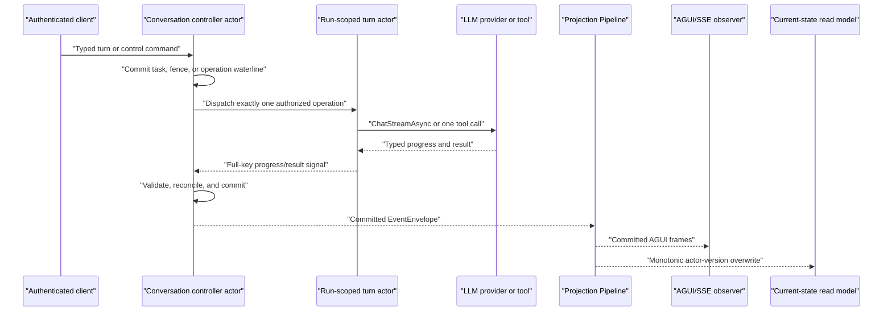

# NyxID Assistant Chat v1 Contract

This document is the canonical Aevatar contract for NyxID Assistant Chat v1. It covers conversation and turn identity, actor-owned task execution, live AGUI observation, pending input and approval decisions, stop and steering controls, browser-action handoff, conditional current-state reads, recovery, and the secret boundary. The needs-you contract is implemented by [Aevatar #3131](https://github.com/aevatarAI/aevatar/issues/3131) and its authoritative continuation completion [Aevatar #3154](https://github.com/aevatarAI/aevatar/issues/3154) for the upstream [nyxid-chat #6](https://github.com/eanz17/nyxid-chat/issues/6) milestone requirement.

The ownership and retention distinction between execution state, derived prompt context,
conversation transcript, and cross-conversation user memory is canonical in
[conversation-context-and-memory.md](conversation-context-and-memory.md).

The canonical client surface is Mainnet `POST /api/chat` plus `/api/chat/conversations/**`. Assistant commands are selected only by one of the eight explicit `type` discriminators: `text`, `input.resolve`, `action.continue`, `approval.resolve`, `task.stop`, `task.steer`, `step.retry`, and `step.skip`. The public routes never accept `scopeId`; they derive one unambiguous scope from the authenticated principal and fail closed otherwise.

The authoritative runtime is one durable conversation-controller actor plus a run-scoped turn actor that executes one authorized operation at a time. The controller's committed protobuf state is the task authority. AGUI and the current-state query are two consumers of the same committed Projection Pipeline; neither endpoint nor projector reconstructs task truth.

## Architecture and ownership



The conversation controller owns active/latest turns, task and step status, operation generations, effect evidence, approval/action correlation, stop/steering fences, continuation admission, and available actions. It remains responsive while provider or tool I/O is pending.

`NyxIdChatTurnGAgent` is short-lived. Its opaque actor address is a server-owned reuse key and has no client-visible meaning. It records only admission/completion/delivery waterlines and safe effect evidence, runs one LLM or tool operation, and reports back to the controller. It never owns conversation truth and never performs a second operation without a new controller authorization.

One NyxID Chat LLM operation admits at most one tool call. The turn executor carries this as the typed `AllowMultipleToolCalls = false` request constraint and provider adapters must preserve it through routing, request copies, and tool-round construction. Providers that support the constraint map it to their native option. The actor still fails closed with `NYXID_CHAT_MULTIPLE_TOOL_CALLS_UNSUPPORTED` if a provider violates the contract; ordinary non-NyxID chat requests leave the nullable option unset and retain their provider default.

The Host authenticates, validates identities, dispatches commands, and maps typed results. It does not decide task transitions. Projection consumes committed controller facts only. Query reads `NyxIdChatConversationCurrentStateDocument` only; it does not activate an actor, read the event store, attach or prime a projection, replay events, or create a turn.

Conversation creation has three deliberately separate authorities:

| Concern | Authority | Query surface |
|---|---|---|
| Admission and transcript index | Existing registry/history projections | `GET /api/chat/conversations` |
| Task, turn, and control state | `NyxIdChatConversationGAgent` | `GET /api/chat/conversations/{conversationId}/state` |
| Durable transcript | `ChatConversationGAgent` | `GET /api/chat/conversations/{conversationId}` |

The HTTP endpoint owns only authentication/protocol adaptation, serialized SSE writes, and the wall-clock connection deadline. No one surface implies synchronous visibility in the other two.

## Identity model

| Identity | Owner and lifetime | Meaning |
|---|---|---|
| `scopeId` | Authenticated resource scope | Ownership/admission boundary for the conversation. |
| `conversationId` / actor `actorId` | Server-created, conversation lifetime | One exact identity for the existing conversation-controller actor and public thread. There is no mapping table or second ID. |
| `turnId` | Server-created, one normal submission or continuation | One observed run. It is not the conversation actor ID. |
| `taskId` | Conversation actor, one task plan | Actor-owned task identity. It is distinct from `turnId`. |
| `planId` | Conversation actor, one frozen semantic plan | Exact plan identity. It is not `taskId`, a revision, or a route-derived value. |
| `stepId` | Conversation actor, one task step | Selects a typed step inside `taskId`. |
| `operationId` | Conversation actor, one logical operation | Correlates one LLM, tool, or postcondition operation. |
| `operationGeneration` | Conversation actor, monotonically renewed for a step | Rejects stale progress/results and fences retries. |
| `clientRequestId` | Caller-created, one transport retry identity | Makes an identical request replayable. It is not a resource identity. |
| `commandId` | Command pipeline, one dispatch | Tracks accepted dispatch. It does not imply commit or read-model visibility. |
| `correlationId` | Command pipeline, one trace chain | Correlates transport and observation independently of resource IDs. |
| `stopRequestId` / `steeringId` | Caller-created control identity | Makes one stop or steering intent idempotent. |
| `retryRequestId` / `skipRequestId` | Caller-created step-control identity | Makes one exact step control idempotent. |
| input `requestId` | Conversation actor | Selects the exact pending input fact; it is distinct from the caller's `clientRequestId`. |
| approval `requestId` | Conversation actor | Selects a pending Aevatar tool approval; it is not a browser-action ID. |
| `actionRequestId` | Conversation actor | Correlates one NyxID browser journey and its reports. |
| `connectedServiceId` | NyxID connected-service inventory | One exact connected UserService instance; it is not a route or readiness identity. |
| `serviceSlug` | NyxID route contract | The exact route slug for the admitted operation; it is not a connected-service ID. |
| `catalogServiceSlug` | NyxID catalog | The catalog family that authored the operation descriptor; it is not a route slug or readiness identity. |
| `readinessCapabilityId` | NyxID Assistant readiness registry | Optional producer-authored recovery identity, such as `api-github`; it is never derived by Aevatar. |
| `originTurnId` | Conversation actor | The blocked turn that emitted an action request. |
| `continuationTurnId` | Server-created | New run created after accepted steering or `action.continue`; it never resumes the old turn ID. |
| `stateVersion` | Conversation actor committed version | Read-model freshness watermark; projection never invents a local version. |

Every child progress/result uses the complete operation key:

```text
actorId + turnId + taskId + stepId + operationId + operationGeneration
```

A mismatch in any component is stale or foreign evidence and cannot advance state.

## Start and observe a conversation

```http
POST /api/chat
Authorization: Bearer <nyxid-access-token>
Content-Type: application/json
Idempotency-Key: client-alpha
```

The first text request omits `conversationId`. Mainnet derives a stable scope/client-bound conversation actor, sends one typed create command containing the first turn, and streams the authoritative conversation and turn identities. The client must not call a separate create endpoint or synthesize context:

```json
{
  "type": "text",
  "clientRequestId": "client-alpha",
  "prompt": "Summarize the connected repository"
}
```

The create command commits registration and a vault reference for the pending
first-turn command before any turn execution. The command payload, including
its transient credential material, remains only in the secret vault; actor
state and committed events contain the typed reference and turn identity. The
controller first publishes the history-initialization self continuation, then
publishes the pending-first-turn self continuation only after initialization
commits. Both continuations re-enter the actor inbox and are recoverable after
passivation. The vault entry has a fixed 30-minute retention window. If it is
unavailable or expired when the continuation runs, the controller commits a
typed unavailable finalization, clears the pending reference and turn identity,
and revokes the vault entry idempotently instead of starting a partial turn.

The server starts the SSE stream with authoritative `conversationId/actorId` and `turnId` context. Subsequent text requests include that exact `conversationId`; they reuse the controller and create a new server-authored turn. `clientRequestId` may be supplied in the body or `Idempotency-Key`; the body wins. An exact retry reuses committed admission/result semantics, while identity reuse with different content fails closed. The deprecated `sessionId` field is ignored.

```json
{
  "type": "text",
  "conversationId": "conversation-alpha",
  "clientRequestId": "client-beta",
  "prompt": "Only include July"
}
```

Registration, transcript, and current-state visibility are eventually consistent. Recover through `GET /api/chat/conversations`, `GET /api/chat/conversations/{conversationId}`, and `GET /api/chat/conversations/{conversationId}/state`; Workflow `create-recovery` is not a NyxID Assistant recovery contract.

An ordinary text submission is not an implicit steering command. If the controller already has active work, it commits and projects a typed failure with code `ACTIVE_TURN_REQUIRES_STEERING`; it does not queue a hidden turn or fork the active plan.

The stream begins with transport context:

```json
{
  "type": "RUN_STARTED",
  "actorId": "conversation-alpha",
  "turnId": "turn-alpha",
  "runStarted": {
    "threadId": "conversation-alpha",
    "runId": "turn-alpha"
  }
}
```

Actor-authored task observation is committed before publication. The controller emits typed custom frames through the unified Projection Pipeline:

- `nyxid.task.snapshot`
- `nyxid.task.step.changed`
- `nyxid.control.changed`
- `nyxid.continuation.changed`
- `nyxid.step.control.changed`
- `nyxid.action.request`
- `nyxid.input.request`
- `nyxid.input.changed`
- `nyxid.approval.request`
- `nyxid.approval.changed`

### TaskPlan observation contract

`nyxid.task.snapshot.custom.payload` is the complete public `NyxIdChatTaskPlan`
projection of the actor-owned task. The live adapter and current-state adapter
both map their typed input to this protobuf contract and use the same JSON
formatter; they never serialize the actor state or a read-model DTO directly.
Its stable v1 fields are:

| Field | Meaning |
|---|---|
| `schemaVersion` | Decoder contract version for the complete TaskPlan shape. |
| `actorId` | Authoritative conversation actor that owns the plan. |
| `taskId` / `turnId` | Exact task and turn identities; neither is an alias for `actorId`. |
| `planId` / `planRevision` | Stable plan identity and actor-authored semantic-content revision. |
| `planRevisionHistoryStart` / `planRevisions` | Start revision and contiguous typed durable history through the current revision. |
| `title` | Safe user-facing task title. |
| `gate` | Closed mode/status plus exact `requestId / taskId / planId / planRevision`, safe reason, decision time, and operation admissions bound to full operation identity and argument digest or action identity and typed-parameter digest. |
| `steps` | Ordered complete step states. |

Each step carries `stepId / order / kind / status / required / description`, a
typed `source`, effect evidence, actor-computed `availableActions`, and its
actor-authored update time. Planning provenance is typed as `addedBy`,
`addedInPlanRevision`, `cancelledInPlanRevision`, `dependsOn`, optional
`estimate`, and typed `substeps`. The closed source union
is `llm`, `tool`, `browserAction`, `postcondition`, `input`, `approval`,
`condition`, or the reserved `web` source. Tool source keeps `toolName`, exact
`serviceSlug`, exact `serviceId`, and optional producer-authored
`readinessCapabilityId` separate. Postcondition source carries `actionRequestId`
plus the stable `check`; approval source carries the exact `approvalRequestId`.
Condition source carries the committed numeric threshold evaluation — effective
threshold, threshold origin, observed value, comparison, and outcome — that a
guarded step depends on through its typed `guard`.

Every renderer must decode the complete union. A client that omits a member
cannot render any task that reaches it, on the live frame path and the state
path alike, so adding a member to the union is a client-visible change.

`planRevision` identifies the frozen semantic plan, not a conversation turn or
status transition. Revision 1 has cause `initial`; later records use exactly one
of `scope_resolution`, `failure_recovery`, `steering`, or `user_revision`.
Every record carries `planRevision`, `revisionCause`, `committedAt`, and the
step identities added or cancelled by that revision. A pure `action.continue`,
approval decision, reload, or recovery signal preserves the revision and its
history when the frozen plan is unchanged. Browser-action postconditions are
therefore declared in the same revision as their action step and continuation
activates that existing step identity rather than appending another step.
New tasks have `planRevisionHistoryStart = 1`. A task committed before revision
history was deployed keeps its existing `planRevision`; its first subsequent
semantic change sets `planRevisionHistoryStart` to that new revision and records
only the verifiable durable suffix. The actor never fabricates missing legacy
records or renumbers a stable plan revision. A zero step-provenance revision
means the legacy revision is unknown; positive values identify a recorded
revision in the durable suffix.

The public operation is flattened as
`conversationActorId / turnId / taskId / stepId / operationId /
operationGeneration` plus kind, phase, effect evidence, progress, safe terminal
fields, and timestamps. `operationGeneration` and `latestProgressSequence` are
serialized as JSON numbers only while they are within the browser-safe integer
range; values outside that range fail closed. This is an explicit browser wire
rule layered on the strong `int64` protobuf fields, not `JsonFormatter.Default`
behavior. Timestamps use canonical protobuf JSON UTC formatting, and absent or
default protobuf fields are omitted while present empty messages remain `{}`.

Executor-authored operation progress may also carry one presentation-only
phase: `substepId / title / status (running|done|failed)`. The conversation
actor admits only a new `running` phase followed by repeated `running` or one
terminal update for that exact substep identity. A substep has no operation
key, effect evidence, available actions, retry/skip authority, or nested
substeps. Work that needs independent retry, effect truth, or an external call
is a task step, never a phase hidden under another step.

`retryInputRebuildable` and operation `idempotencyKey` are execution-control
facts. They remain in actor-owned state and are deliberately excluded from the
public TaskPlan, current-state read model, SSE frames, and browser decoder.
An effect retry additionally carries an internal exact source-operation key and
a credential-free durable-authorization rematerialization marker. The turn
actor accepts it only when that exact prior delivered operation committed
`not_applied`, then re-matches the current tool definition and complete
admission contract. These fields are never browser authority and are not
projected.

`nyxid.task.step.changed.custom.payload` is always the complete typed envelope
`taskId / planRevision / step / changeKind`. It never publishes a bare step.
The nested `step` uses exactly the same shape as a step in TaskPlan.

Live TaskPlan payloads and current-state `snapshot.activeTask` are the same
contract, not two browser models. Clients must use one TaskPlan decoder and one
step decoder for initial SSE, reconnect/reload, and step-change reduction. They
must not rename fields, infer identities, or maintain a second lifecycle model.
The checked-in v1 convergence fixtures compare these shapes field-for-field.

Typed operation delivery is a committed actor protocol rather than a transport
assumption. The conversation actor commits the exact requested operation and
dispatches its normal typed command directly. If delivery becomes ambiguous,
the conversation commits a pending exact delivery probe and cannot start
reconciliation, read-back, or a later generation. The turn actor answers only
after it has either committed that operation or committed a tombstone that
fences delayed delivery; the response includes the actor-owned effect-dispatch
waterline.

G9 v1 deliberately allows only one browser action in a blocked turn. Multiple
service connections are separate sequential actions. On reload, the browser
resumes from current-state `activeTask`, whose shape is identical to the live
TaskPlan payload; it does not reconstruct a plan from action cards or text.

Text, reasoning, tool-start, task, control, and terminal frames share the actor-owned progress sequence. `RUN_STARTED`, keepalive, and bounded endpoint-local setup failures are transport context and do not invent an actor sequence.

NyxID LLM stream ingestion uses a bounded channel with capacity 32. The first
delta is forwarded immediately; later text and reasoning deltas are committed
in source order when either the fixed one-second batch deadline or the 64-KiB
UTF-8 payload ceiling is reached. Oversized content is split only at Unicode
rune boundaries. Terminal and cancellation paths force a flush and drain
already accepted tail progress independently of request cancellation. This batching
cannot occupy the controller actor turn, so stop, steering, and step-control
commands remain responsive while streaming continues.

Long-running executors relay genuine text, reasoning, tool-start, or phase
observations whenever the underlying operation reports progress. The
conversation actor publishes the first observation as a `step.changed` status
or substep frame, then coalesces additional observations into an actor-owned
pending progress waterline. A durable self signal flushes that waterline at a
maximum 30-second cadence. The signal cannot publish unless a newer genuine
executor progress sequence is pending, so an operation that reports nothing
remains silent. The 15-second SSE keepalive is transport liveness only and does
not update the task step, `lastProgressAt`, or the actor progress sequence.

Each in-flight operation records actor-committed `lastProgressAt`. A durable
self timeout fenced by the complete operation key, operation generation, child
progress sequence, and last-progress timestamp evaluates the 120-second stall
deadline. A stale timeout cannot mark the operation stalled; it only ensures a
check exists for the current committed waterline. At the deadline the actor
commits `stalledAt`, `attentionKind=stalled`, and the step's actor-computed
`availableActions`. Live AGUI and current-state reload both render that same
fact. New genuine progress clears `stalledAt` and starts a new actor-owned
deadline. Browser frame silence remains a transport diagnostic and is never
the business authority for stalled state.

A stream closes with exactly one terminal:

- task and turn `succeeded`: `RUN_FINISHED`, status `completed`;
- task and turn `blocked` or `stopped`: `RUN_FINISHED`, status `blocked`;
- task and turn `failed`: `RUN_ERROR` with a stable code and safe message;
- inconsistent committed task/turn terminal states: fail closed with `NYXID_CHAT_TERMINAL_STATE_CONFLICT`.

Heartbeat and text/action/input/approval frames share one serialized writer gate. A real terminal atomically closes that gate. If the configured wall-clock deadline wins, the endpoint closes the same gate, emits exactly one safe `RUN_ERROR` with code `STREAM_TIMEOUT`, and only then cancels the inner interaction. It returns without waiting for an interaction that ignores cancellation; any later content or terminal callback is discarded. A provider or interaction that completes by throwing its own `TimeoutException` is instead an inner execution failure and maps to the safe `STREAM_FAILURE` terminal. Request cancellation closes the gate without attempting a synthetic terminal on a disconnected client.

## Actor-owned state machine

Task and turn status are closed:

- `active`
- `succeeded`
- `failed`
- `stopped`
- `blocked`

Step status is closed:

- `planned`
- `waiting`
- `running`
- `done`
- `failed`
- `skipped`
- `cancelled`
- `uncertain`

Operation phase is closed:

- `requested`
- `dispatched`
- `running`
- `succeeded`
- `failed`
- `cancelled`
- `uncertain`

External-effect evidence is closed:

- `not_started`: no operation entered execution;
- `not_applied`: typed evidence says no external mutation occurred;
- `confirmed`: typed result or postcondition proves the effect;
- `may_have_changed`: an effect-capable operation may have reached the external system, but the outcome cannot be proved.

`uncertain` is not success and is not an automatic retry invitation. A required `failed`, `cancelled`, or unrecoverable `uncertain` step prevents task success. Browser-reported completion cannot make a step `done`; only a matching typed postcondition can.

The actor computes `retry`, `skip`, and `stop` availability. Retry requires rebuildable typed input plus proof that replay is safe: no effect occurred, or the exact logical operation is idempotent under a stable key. V1 does not persist tool arguments or capabilities, so an interrupted tool is never silently reconstructed. Skip requires an optional step or explicit safe-skip policy. UI code must not derive these actions independently.

When an active task has a committed `failed`, `cancelled`, or `uncertain` step whose actor-authored actions allow `retry` or `skip`, the current SSE request ends with `RUN_FINISHED blocked`. This terminal closes only that stream observation: the durable task and turn remain `active`, and a caller may use the exact authenticated step control described below. Live reconciliation and durable replay both consume the committed actions; neither the HTTP boundary nor the UI derives recoverability.

### Tool recovery provenance

An authorized NyxID operation may provide an optional
`readiness_capability_id` in its typed `NyxIdOperationRef`; its JSON name is
`readinessCapabilityId`. Admission snapshots that exact producer-owned value
beside the exact call safety. The turn result carries only the connected
service ID, service slug, catalog service slug, and optional readiness
capability ID into the conversation actor. It does not persist the descriptor's
method, path, labels, arguments, or result.

When the conversation actor creates the tool step, it copies the connected
service ID to `source.tool.serviceId`, the route slug to
`source.tool.serviceSlug`, and the readiness identity to
`source.tool.readinessCapabilityId`. The catalog slug remains a distinct
provider-provenance identity and is never substituted for any of those fields.
If the producer omits readiness provenance, the actor and every projection omit
`readinessCapabilityId`; Aevatar never derives it from tool names, failure text,
service IDs, route slugs, catalog slugs, or route position.

The committed tool step is the single source for both
`nyxid.task.snapshot`/`nyxid.task.step.changed` and the current-state query.
Passivation and reload therefore preserve the same recovery identity together
with the unchanged `externalEffect` evidence and actor-computed
`availableActions`. The failed and uncertain convergence examples are checked
in under `test/Aevatar.AI.Tests/Fixtures/NyxIdChat/v1/`.

## Stop, steering, retry, and skip

All controls use authenticated JSON requests to `POST /api/chat`. A successful response is `202 Accepted` and contains `requestId`, `commandId`, `correlationId`, and the canonical `stateUrl`; acceptance promises dispatch only. Observe committed outcome through AGUI or the state query.

| Intent | `type` | Required request facts |
|---|---|---|
| Stop active work | `task.stop` | `conversationId`, `turnId`, `stopRequestId`, `clientRequestId`, `expectedStateVersion` |
| Steer active work | `task.steer` | `conversationId`, `turnId`, `steeringId`, `clientRequestId`, `instruction`, optional `inputParts`, `expectedStateVersion` |
| Retry one step | `step.retry` | `conversationId`, `turnId`, `taskId`, `stepId`, `retryRequestId`, `clientRequestId`, `expectedOperationGeneration`, `expectedStateVersion` |
| Skip one step | `step.skip` | `conversationId`, `turnId`, `taskId`, `stepId`, `skipRequestId`, `clientRequestId`, `expectedOperationGeneration`, `expectedStateVersion` |
| Resolve pending input | `input.resolve` | `conversationId`, actor-owned `requestId`, `clientRequestId`, `answer`, `expectedStateVersion` |

Example stop request:

```json
{
  "type": "task.stop",
  "conversationId": "conversation-alpha",
  "turnId": "turn-alpha",
  "stopRequestId": "stop-alpha",
  "clientRequestId": "client-stop-alpha",
  "expectedStateVersion": 17
}
```

The controller commits a stop or steering fence before any successor decision. Once accepted, no later old-plan LLM round, tool, retry, or step may start. Stop outcomes are typed: `accepted`, `rejected`, `already_terminal`, or `uncancellable`. Cancellation is best effort. A late LLM result is discarded. Exact late tool evidence may refine `external_effect`, but it cannot remove the fence, change the stopped terminal, or authorize a successor. An unprovable effect-capable operation becomes `uncertain / may_have_changed`.

Steering is serialized by the actor. If an operation is physically in flight, the controller may commit `accepted_for_later`; the server starts the new `continuationTurnId` only after a safe checkpoint. Completed steps, prior effect evidence, and the typed answers of committed input resolutions are carried into the server-authored transient steering context, so the continuation does not ask the owner to restate already accepted facts. Completed work is never re-executed.

Retry and skip validate the body `conversationId`, `turnId`, `taskId`, `stepId`, expected generation, expected actor version, and current actor-computed availability. Replaying the same request and content is idempotent. Reusing an identity with different content fails closed.

## Plan progress and operation authorization

The task plan is an actor-owned read-only progress model. It exposes `taskId`, `planId`, `planRevision`, revision provenance, ordered steps, dependencies, estimates, operation phases, effect evidence, failures, and available controls. It contains no user authorization state or decision request.

When the actor admits an LLM tool call, the lifecycle creates and activates the typed step and returns a normal operation dispatch command immediately. The command binds the complete operation key, `toolCallId`, `toolName`, frozen arguments, exact `AgentToolOperationAdmission`, and `operationId`-derived idempotency key. Reload observes these facts through the current-state projection; the query path never reconstructs execution authority.

Authorization remains attached to the boundary that owns it. A typed browser action waits for the NyxID/OAuth journey and then dispatches its declared postcondition automatically. A tool invocation that returns `ApprovalRequired` waits only for `approval.resolve` carrying its exact approval and operation identity. Neither boundary is inferred from plan content or assistant prose.

`202 Accepted` means only that the typed command was accepted for dispatch with a stable `commandId`. It does not mean the operation started, NyxID authorized it, an external effect occurred, or the read model observed the result. Observe `nyxid.task.snapshot` / `nyxid.task.step.changed` or the current-state resource and use its authoritative `stateVersion`.

## Pending input and tool approval

Pending input is an actor-owned protobuf fact containing `requestId`, `turnId`, `taskId`, `stepId`, `prompt`, typed `options`, `askedAt`, `allowFreeText`, and `multiSelect`. Each option has an opaque stable `optionId` plus its display `label` and optional `description`. A choice question has 2-6 options. A free-text-only question has zero options, requires `allowFreeText=true`, and cannot be multi-select; one-option requests are always invalid. A production `ask_user` tool call authors the request for the exact active input step; a secret-free actor outbox retains that self-message until the pending fact commits. The actor then emits `nyxid.input.request`, and the projection session publishes that committed fact as a live frame. The request is not reconstructed from LLM text or browser state, and controller reload cannot lose it.

Before Phase-1 execution, the assistant identifies all genuine information gaps.
If any remain, it emits one `ask_user` call whose prose prompt combines those
gaps into one editable question and waits for the answer before executing. It
does not drip-feed separate questions. Suggested defaults are hints rather than
accepted decisions. This remains one actor-owned pending input and one closed
answer union, not a form or a collection of independently resolvable fields.

The caller resolves input through the same public command surface:

```json
{
  "type": "input.resolve",
  "conversationId": "conversation-alpha",
  "requestId": "input-alpha",
  "clientRequestId": "client-input-alpha",
  "answer": {
    "selectedOptionIds": [
      "option-82f422e6c6ca11c8",
      "option-abd8c07fe8728547"
    ]
  },
  "expectedStateVersion": 23
}
```

`answer` is a closed typed union. Send exactly one of `{"freeText":"..."}` or `{"selectedOptionIds":["option-..."]}`. A single-select answer contains exactly one ID; a multi-select answer contains one or more distinct IDs from the observed pending options. Labels are presentation and must never be submitted as identities.

An accepted dispatch returns `202 Accepted` with `requestId`, `commandId`, `correlationId`, and `stateUrl`. This proves transport acceptance only. The first matching decision committed at the expected actor version wins and emits `nyxid.input.changed`; an exact duplicate is idempotent, while a stale version, unknown request, invalid option ID, or conflicting reuse cannot advance actor state. Acceptance completes the exact waiting input step, appends one LLM continuation step, injects the typed answer as the matching `ask_user` tool result, and resumes that exact transient turn session.

The accepted typed answer is an owner-scoped, actor-owned durable input fact alongside its answer fingerprint. A selection persists only opaque `optionId` values and never copies presentation labels into the resolution. Accepted free text persists as the owner's submitted input because later same-task steering must preserve composite facts such as party size, dietary needs, and budget. Fresh NyxID credentials and the generated tool-result message remain transient and never enter actor state. The committed `nyxid.input.changed` payload and current-state `latestInputResolution` are projections of this same typed resolution, including the same `answer` union; reload does not reconstruct it from browser state. If the transient turn capability is lost through passivation, or if the continuation cannot be accepted for dispatch, the operation fails closed and terminalizes the task; it is never left as an orphaned waiting or running step.

Pending approval carries the exact `requestId / turnId / taskId / stepId / toolName / askedAt` correlation plus `expiresAt`, the deadline the owning actor stamps when it parks the approval (`askedAt` plus the fixed local approval window), and a safe `presentation`:

- `action` and `target` describe the proposed operation without arguments or credentials;
- `actorLabel` identifies the presenting assistant;
- `reversibility` is `reversible`, `irreversible`, or `unknown`;
- `grantBoundary` is `within_grant` for an Aevatar tool decision or `nyxid_step_up` when an explicitly correlated NyxID step-up owns the grant boundary;
- `nyxidRequestId` is optional and may be present only when supplied by that explicit upstream contract.

Both `nyxid.approval.request` and `nyxid.approval.changed` are committed projection frames. Presentation fields are descriptive and never grant authority.

## Tool approval versus NyxID browser actions

These are separate products and identities:

- `POST /api/chat` with `type=approval.resolve` resolves a real actor-owned `NyxIdChatPendingApprovalState.requestId` for an Aevatar tool decision;
- `action.continue` reports a NyxID browser journey and starts a new continuation turn;
- an authorization/browser-action blocked turn cannot be continued via `approval.resolve`;
- neither route reuses the old turn ID.

`approval.resolve` includes `conversationId`, `clientRequestId`, the actor-owned approval `requestId`, required explicit boolean `approved`, optional safe `reason`, and `expectedStateVersion`. Omitting `approved` returns `400 APPROVAL_DECISION_REQUIRED`. The request must carry fresh NyxID authentication; neither the original turn credential nor an approval card grants execution authority. An accepted dispatch returns the same transport-only `202` receipt shape as `input.resolve`; business commit and read-model visibility are observed through `nyxid.approval.changed` or the current-state query. The first matching decision wins, an exact duplicate is idempotent, and unknown requests, stale versions, or conflicting decisions do not advance actor state.

Approval advances the exact waiting tool step to operation generation `N+1` and re-enters the real tool execution path with an exact grant bound to execution owner, approval request, tool request, tool name, call ID, and arguments digest. Denial does not execute the tool again; it produces a typed denied receipt and terminalizes the required step. The actor persists only the decision fingerprint and safe resolution facts, not the submitted reason or credentials. If the transient authorized tool capability has been lost, the continuation fails closed and terminalizes the task instead of reconstructing arguments or authority from durable state.

Expiry always fails closed as denial, never as approval. At or after `expiresAt`, a resolve — including an explicit `approved=true` — cannot approve: the actor commits a system-authored `expired` resolution that cancels the exact waiting tool step with `NYXID_CHAT_APPROVAL_EXPIRED` and dispatches no approval continuation, so no effect can execute. The same commit is driven proactively by a durable self timeout fenced on the exact `requestId` and stamped deadline, so an unattended pending approval terminalizes instead of waiting forever, and `nyxid.approval.changed` reports the `expired` outcome. Admitted connected-service (Class-P) operations never park a local pending approval, so this deadline governs only actor-owned local tool approvals; pending approvals persisted before the deadline existed carry no `expiresAt` and resolve without it.

## NyxID browser-action handoff: schema v4

### Ownership and registry

Aevatar owns action intent, task correlation, safe parameter references, and the decision to continue. NyxID owns the browser card and journey, consent copy, auth modality, mutation, credential storage, and final authorization.

Aevatar snapshots `GET /api/v1/assistant/actions` at startup and accepts schema version `4`; `schema_version` is the only registry-wide compatibility gate. The `revision` string is an observability label that passes through into definition snapshots and never gates loading or executability, so NyxID's additive action list deploys independently of Aevatar. Each known descriptor is validated on its own against a pinned per-action contract (exact parameter schema plus registry-owned risk/remember policy): `service.connect` (catalog/custom variants), least-scope `key.create` (`allowedServiceIds` requires 1 to 64 unique string identities), `key.rotate` (one exact predecessor key ID), and `service.reauthorize` (`userServiceId` plus `requestedScopes`, risk `grant`, never remember-eligible). A descriptor that is unknown, malformed, duplicated, or divergent from its pinned contract is skipped and logged individually; the remaining actions stay enabled and a skipped or absent action fails closed per request with `NYXID_ACTION_UNSUPPORTED`. The registry's `risk` and `remember_eligible` values are advisory inputs to Aevatar presentation/planning. The caller cannot submit or lower them, and NyxID recomputes and enforces authorization at execution time.

This startup dependency is active only when `Aevatar:NyxId:AssistantActions:Enabled=true`. The reusable NyxIdChat composition default is `false`: a host that does not opt in does not call the registry endpoint and injects an immutable registry with no executable actions, so browser-action requests fail closed with `NYXID_ACTION_UNSUPPORTED` without preventing unrelated capabilities from starting. Mainnet explicitly enables assistant actions and fetches the registry from the public `Aevatar:NyxId:ApiBaseUrl`, never from `InternalApiBaseUrl`. The startup fetch retries transient failures a bounded number of times; if every attempt fails (fetch, timeout, read, JSON, or schema), the snapshot pins an immutable disabled fallback with a scrubbed error, ordinary chat and the Host still start, and a background recovery loop keeps refetching with capped backoff. Recovery upgrades the disabled fallback to the first successfully served registry exactly once; a served registry is never replaced or downgraded for the life of the process. Host cancellation still aborts startup.

The typed registry recognizes closed action schemas, but executable handoff is narrower: an action must also have an Aevatar producer, wire mapper, and typed postcondition reader, and this build-level executable set (`service.connect`, `key.create`, `key.rotate`) is independent of the served revision label. The key-create parser rejects missing, empty, over-limit, or duplicate service identities, and the producer emits only exact nonempty owner-visible UserService IDs. Postcondition evidence is read exclusively from NyxID's secret-free authorization evidence projections (`GET /api/v1/keys/{id}/authorization`, `GET /api/v1/api-keys/{id}/authorization`), never from the full detail routes: the projections carry only identity, lifecycle, and a monotonic `state_version`, so user-controlled display text cannot poison or fail an evidence read. The api-key projection's retained display `name` is the documented irreducible remainder — it is never compared as evidence and only its top-level value is exempt from the secret-shape scan. For `key.rotate`: the producer first resolves one exact owner-visible active key, emits only its safe ID, and completion is verified only after the replacement key's authorization projection proves the reported successor ID, the requested predecessor ID, and a positive monotonic `state_version`; immutable `created_at` plus, when the projection serializes one, authoritative `updated_at` must be no earlier than the committed action request. A later update to an older successor cannot satisfy the immutable creation-time fence. The AG-UI mapper carries these typed requests without key material. `service.reauthorize` remains fail closed at the executable gate. A browser completion report or permitted service access value alone is never effect proof. Catalog and custom connection are distinct variants; a boolean such as `custom: true` never changes the meaning of one shared field set.

### Request wire frame

The outer AGUI custom envelope uses `payload`. The action's own arguments use `params`. `actionRequestId` and `originTurnId` are distinct:

```json
{
  "type": "CUSTOM",
  "custom": {
    "name": "nyxid.action.request",
    "payload": {
      "schemaVersion": 4,
      "actorId": "conversation-alpha",
      "originTurnId": "turn-alpha",
      "taskId": "task-alpha",
      "stepId": "step-connect-github",
      "actionRequestId": "action-alpha",
      "action": "service.connect",
      "params": {
        "catalogService": {
          "serviceSlug": "api-github",
          "requestedScopes": ["repo"]
        }
      }
    }
  }
}
```

For a custom endpoint, `params.customService` is used instead of `params.catalogService`. Safe custom URLs must be absolute HTTPS URLs and must not contain userinfo, query, or fragment components.

Before the action frame is observable, the controller atomically commits the action request, the waiting browser-action step, and the origin task/turn `blocked` terminal. A page reload therefore cannot lose the handoff fact.

### Continuation input and dispositions

The canonical `POST /api/chat` route accepts this discriminated authenticated body:

```json
{
  "type": "action.continue",
  "conversationId": "conversation-alpha",
  "clientRequestId": "client-action-alpha",
  "originTurnId": "turn-alpha",
  "actions": [
    {
      "actionRequestId": "action-alpha",
      "originTurnId": "turn-alpha",
      "disposition": "completed",
      "resource": {
        "userService": {
          "userServiceId": "service-alpha"
        }
      }
    }
  ]
}
```

Reports must carry a unique `actionRequestId`, the exact common `originTurnId`, one closed disposition, and at most one typed safe resource reference. The five dispositions are:

- `completed`
- `declined`
- `failed`
- `cancelled`
- `expired`

Safe resource variants are `userService`, `key`, `node`, `serviceAccount`, `developerApp`, and `device`; a generic `id` is not accepted because those identities have different meanings.

`action.continue` is a wake-up signal, not mutation proof and not an old-run resume. The server creates a new `continuationTurnId` from the conversation and authenticated client request identity. A `completed` report starts the action-specific typed read-model postcondition. Only an exact, current match can change the step to `done / confirmed`. Missing, stale, unavailable, or mismatched evidence remains blocked/unverified; it never guesses success. Non-completed dispositions become typed terminal action outcomes without a postcondition success.

The continuation is archived as a separate transcript turn, but its user-side transcript input is a fixed disposition-only summary such as `NyxID action update: completed.` It never copies action resource IDs, request payloads, credentials, tool arguments, or raw results into chat history.

Multiple reports are reconciled independently; a batch is not a transaction. Duplicate exact reports are idempotent, while conflicting or cross-scope/conversation/origin reports fail closed.

### Verified authorization continuation

A verified browser action does not resume the original service request through assistant prose. After the exact typed postcondition commits `done / confirmed`, the conversation actor may dispatch a credential-free `NyxIdChatVerifiedAuthorizationContinuation`. The closed protobuf payload carries only `action_request_id`, `origin_turn_id`, optional `source_tool_step_id`, `postcondition_step_id`, the safe verified resource reference, the frozen `service_slug`, `verified_at`, and one typed `resume_requirement`. It has no token, credential, or generic metadata field. The durable LLM step source retains only the exact action request identity and frozen resume requirement needed for replay-safe lifecycle decisions.

The cross-turn continuation is accepted only when one actor-owned correlation matches all of the following facts:

- the continuation admission is an accepted Action admission whose `originTurnId` is the operation-key turn and whose `continuationTurnId` is the active continuation turn;
- the operation-key conversation matches the authoritative actor, the operation-key task matches both the active task and active turn, and the complete operation key identifies exactly one continuation step;
- exactly one LLM continuation step references the action request and depends, directly or transitively, on exactly one matching postcondition step;
- exactly one matching action request exists in either `pendingActions` or `recentActions`; and
- that action has a completed verified result, while its matching postcondition is `done / confirmed`.

Any identity, dependency, disposition, or evidence mismatch rejects the continuation. Live reconciliation, pre-persist validation, reducer replay, and recovery use the same correlation policy, so moving a verified action from `pendingActions` to `recentActions` cannot strand an otherwise valid continuation.

The actor freezes one of two obligations. `COMPLETE_ORIGINAL_SERVICE_REQUEST` applies when authorization interrupted an ordinary connected-service request. The resumed LLM request rematerializes the current request-local catalog, then exposes only operations whose typed admission matches both the verified `UserServiceId` and frozen `ServiceSlug`. An unprofiled turn discovers the current NyxID Chat route toolset; a profiled turn requires the committed profile identity to be present and exact, then applies the current `MaximumToolPolicy` as its upper bound. The OAuth-before turn/task authority ceiling is not reused because it cannot contain a capability that the verified action has only just established. Missing or mismatched exact capability fails before LLM execution with `NYXID_AUTHORIZATION_CONTINUATION_CAPABILITY_UNAVAILABLE`; unrelated route tools and global tools are not fallback authority. `COMMUNICATE_AUTHORIZATION_COMPLETION` applies to a dedicated authorization request, forces the request-local catalog empty, and may end only with text communicating the verified authorization result. Missing typed UserService identity, frozen slug, recognized resume requirement, or required committed profile identity fails before LLM execution.

For `COMPLETE_ORIGINAL_SERVICE_REQUEST`, ordinary text is not completion evidence. The first text-only LLM result is reconciled and produces one `failure_recovery` LLM step carrying the same action request, postcondition dependency, resume requirement, and typed verified-authorization payload. If that corrective step is also text-only, the task fails closed with `NYXID_AUTHORIZATION_CONTINUATION_TOOL_REQUIRED`. A matching typed tool call instead continues through the existing tool lifecycle.

The executor appends the server-authored continuation instruction only to the request-local `AgentRunReplyStepState.Messages` after rebuilding the transient session. It is excluded from pending/appended history, actor state, committed events, read models, projections, generic metadata, and logs. Runtime credentials are resolved separately for the current request and are excluded from the typed continuation and every durable or observable artifact.

An out-of-band change can wake the conversation without claiming that any action completed:

```json
{
  "type": "action.continue",
  "conversationId": "conversation-alpha",
  "clientRequestId": "client-wake-alpha",
  "actions": []
}
```

This form intentionally omits `originTurnId`. It starts a distinct continuation turn and rechecks every actor-owned pending action through its existing typed postcondition. It creates no synthetic disposition, completion report, or resource hint. Only authoritative read-model evidence can confirm a step. Its transcript input is the fixed safe text `NyxID state changed; recheck pending actions.`

If the actor-owned pending set is already empty, the wake commits a zero-step succeeded continuation and immediately emits its task snapshot and terminal frames; it never waits on keepalive alone.

## Conditional current-state query

```http
GET /api/chat/conversations/{conversationId}/state
    ?afterStateVersion={version}&turnId={turnId}
```

The endpoint first validates scope ownership, then reads the durable actor-scoped current-state document. `afterStateVersion` and `turnId` are optional cursors. Results are typed:

- `current`: the server has a valid snapshot newer than the client cursor; returns the full safe snapshot;
- `not_modified`: server and client versions match, and optional `turnId` matches;
- `reload_required`: input is invalid, the client version is in the future, or scope/conversation/turn identity does not match;
- `not_found`: no owned conversation/read model exists.

Example `current` envelope:

```json
{
  "status": "current",
  "stateVersion": 23,
  "turnId": "turn-alpha",
  "snapshot": {
    "actorId": "conversation-alpha",
    "scopeId": "scope-alpha",
    "stateVersion": 23,
    "progressSequence": 23,
    "activeTurn": {
      "turnId": "turn-alpha",
      "taskId": "task-alpha",
      "status": "active"
    },
    "latestTurn": null,
    "pendingInput": {
      "requestId": "input-alpha",
      "turnId": "turn-alpha",
      "taskId": "task-alpha",
      "stepId": "step-input-alpha",
      "prompt": "Select the deployment regions.",
      "options": [
        { "label": "Singapore", "description": "Deploy to Singapore." },
        { "label": "Frankfurt", "description": "Deploy to Frankfurt." }
      ],
      "askedAt": "2026-08-01T12:00:00+00:00",
      "allowFreeText": true,
      "multiSelect": true
    },
    "taskStatus": "active",
    "attentionKind": "input",
    "attentionSince": "2026-08-01T12:00:00+00:00",
    "activeStepSummary": "Select the deployment regions."
  }
}
```

The snapshot contains query-shaped safe data: active/latest/recent turns,
ordered task steps and their typed sources, operation key/generation and phase,
effect evidence, available actions, pending input, approval presentation,
latest safe input/approval resolution facts, typed `pendingActions` and bounded
`recentActions`, control fences, continuation admission, progress sequence,
actor-authored attention, and actor version. It also exposes
the exact safe typed parameters needed to resume browser actions after reload:
`key.create` preserves `name`, `platform`, and the nonempty
`allowedServiceIds`; `key.rotate` preserves only `keyId`. These values come
from the committed actor state through the same current-state projection and
never include full key material, credentials, or an alternate query-time
reconstruction path. It also exposes
`latestStepControlResult` and bounded `recentStepControlResults`; each result
preserves the typed retry/skip kind, request and client identities, exact
turn/task/step identity, expected and resulting operation generations,
expected state version, outcome, safe reason, command/correlation identities,
and commit time. These fields are copied from the same actor current-state
fact and are not reconstructed by the query adapter. A NyxID tool source may
include the exact optional `readinessCapabilityId` described above. The
snapshot includes the latest accepted typed input answer as described above,
but excludes approval reasons, transient capabilities, raw LLM/tool results,
credentials, and actor runtime internals.

The read model is eventually consistent and says so through its actor-derived `stateVersion`. Writes are monotonic overwrite: newer replaces older, byte-equivalent equal-version duplicates are idempotent, equal-version conflicts fail, and older versions cannot overwrite newer state. Query-time priming and replay are forbidden.

## Conversation resources

All resources use the authenticated scope and the same public `conversationId`; none accepts `scopeId` in the path, query, or body.

| Route | Behavior |
|---|---|
| `GET /api/chat/conversations?pageSize={n}&cursor={cursor}` | Lists the caller's NyxID Assistant transcript index. `pageSize` defaults to `50`; `cursor` is opaque. Each materialized conversation may include actor-authored `taskStatus`, `attentionKind`, `attentionSince`, `activeStepSummary`, and `stateVersion`; the response also contains an optional `nextCursor`. |
| `GET /api/chat/conversations/{conversationId}` | Returns the durable transcript as `messages` plus its `stateVersion`. |
| `GET /api/chat/conversations/{conversationId}/state` | Returns the conditional current-state result documented above. |
| `DELETE /api/chat/conversations/{conversationId}` | Submits the existing authoritative conversation retirement/deletion commands. |

Delete returns `202 Accepted` only after dispatch was accepted. Its `Location` header and response `stateUrl` are `/api/chat/conversations/{conversationId}/state`; they do not claim that controller registration and transcript projection have both disappeared. A missing conversation returns `404`, cross-scope access returns `403`, and unavailable admission returns `503`.

Transcript and index materialization are eventually consistent. A transient `404` immediately after first-turn admission can mean projection lag; clients retry the same public resource and must not reconstruct history from actor events or create a second transcript store.

## Public protocol, idempotency, and errors

NyxID Assistant ingress is `application/json` (including `+json`) with one recognized `type`. JSON without `type` and `multipart/form-data` remain Workflow Chat inputs on Mainnet. A malformed/non-object body, unsupported media type, malformed discriminator, or unknown explicit discriminator returns `400 INVALID_CHAT_INPUT` and never falls through to Workflow. Assistant DTOs reject unknown fields, including caller-supplied `scopeId`.

The caller must authenticate with exactly one non-conflicting `scope_id` or `workflow.scope_id` claim. Missing or ambiguous scope returns `401`; an owned-resource mismatch returns `403`; absent conversations/read models return `404`; unavailable admission returns `503`. Stream setup and execution failures are emitted as safe AGUI `RUN_ERROR` terminals when streaming has begun.

`clientRequestId` is the transport idempotency identity. When both the body and `Idempotency-Key` header provide one, the body wins. An exact retry preserves the existing admission/result, while reuse with different content fails closed. Input, approval, controls, and delete return honest `202` receipts; committed state and projection visibility are observed later through AGUI or the public state resource.

## Scoped-route compatibility

`/api/scopes/{scopeId}/nyxid-chat/**` remains a compatibility adapter for existing callers. It is deprecated as a client contract and must reuse the same application ports and actor authority; it must not evolve separate DTO, state, continuation, control, or recovery behavior. New clients use only `POST /api/chat` and `/api/chat/conversations/**`. Standalone Workflow Host `POST /api/chat` and `GET /api/ws/chat` remain Workflow-only.

## Restart, cancellation, and uncertainty

Activation never executes provider/tool work inline. It may publish a typed self recovery signal containing the complete operation key, expected committed version, and closed recovery kind. The normal actor handler revalidates current state before acting; a stale key or version is a no-op.

Recovery rules are conservative:

- an exact requested browser-action postcondition may be redispatched under the same operation key because it is a typed read-model query;
- an interrupted LLM operation is not replayed automatically; it becomes `NYXID_CHAT_OPERATION_INTERRUPTED / not_applied` and may expose an explicit authenticated retry when input is rebuildable;
- an effect-capable tool is never replayed automatically, even when only its requested waterline was committed, because dispatch may have reached the external system before the next commit; it becomes `NYXID_CHAT_OPERATION_OUTCOME_UNCERTAIN / may_have_changed`;
- a turn actor that committed completion but lost result delivery does not reconstruct raw output or repeat I/O; it reports `NYXID_CHAT_OPERATION_RESULT_DELIVERY_LOST` and preserves its committed effect evidence;
- a blocked browser action has no hidden continuation after restart;
- actor-owned pending input and approval survive passivation and reload; reconnect reads them from the current-state read model rather than requiring the lost stream;
- a pending creation first turn resumes only through its vault-backed typed self continuation; fixed-TTL expiry commits unavailable terminal cleanup and cannot fall back to an inline or reconstructed command;
- late evidence after stop/steering may refine effect truth but cannot advance the old plan.

The turn actor persists no raw LLM text, raw tool result, tool arguments, credential, or transient execution capability. Therefore recovery is deterministic and honest rather than a best-effort reconstruction of uncommitted output.

## Secret boundary

Secrets may exist only in transient authenticated Host-to-operation commands where execution requires them. They must never enter conversation/turn actor state, committed domain events, current-state read models, AGUI/SSE frames, logs, or audit-safe annotations.

Forbidden durable/presentation data includes:

- access, refresh, bearer, OAuth, or provider tokens;
- authorization and cookie headers;
- client secrets, passwords, passphrases, or credential values;
- OAuth device codes or user codes;
- raw upstream bodies and secret-bearing tool arguments;
- URI userinfo, query, or fragment values that can carry secrets.

Action JSON rejects secret-shaped field names and bearer/basic credential values before protobuf dispatch. It rejects unsafe URLs instead of redacting and continuing. `device.approve.user_code` is never an Aevatar action: code entry stays entirely inside the NyxID-owned browser journey.

Action names such as `service_account.rotate_secret` describe a NyxID-owned journey; their params carry only the non-secret resource identity. They do not authorize a secret value to cross this boundary.

## Chat Activity audit

NyxID Assistant tool executions and committed browser-action facts are observable through
`GET /api/audit/chat-activity`. Tool records come from the final typed tool receipt. Action
records come only from committed action-request and resolution events; a browser-reported
`completed` disposition is not success until the exact typed postcondition is committed as
verified.

The audit record may carry safe tool/action names, outcomes, conversation/turn/task/step/action
request IDs, safe target/correlation fields, and the HMAC-derived audit actor identity. It has no
field for the raw conversation owner and omits prompts, transcript text, reasoning, tool
arguments/results, action params/resources, postcondition bodies, and credentials. Historical
ownerless conversations are not guessed or later claimed, so their browser actions are absent
from personal Chat Activity rather than attributed by scope or route shape.

Personal reads are fixed to the authenticated subject's current and retained HMAC identities;
platform-admin all-user access requires explicit `scope=__all__`. The Audit Trail artifact is
observability evidence only and cannot authorize an action, resume a turn, or define actor state.
Typed Chat Activity records expire under the scoped 30-day retention operation; unrelated Audit
Trail records do not share that TTL.

## Conversation transcript

All turns under one public `conversationId` (the controller `actorId`) share a conversation transcript, including after passivation/reactivation. Transcript/history remains a separate `ChatConversationGAgent` concern and is not the task current-state read model. Accepted registration initializes this authority even with zero turns. Completed, failed, stopped, blocked, and outcome-uncertain terminal turns are delivered through the existing chat-history delivery actor at least once; `OUTCOME_UNCERTAIN` is stored as `outcome_uncertain`, never rewritten to `error`. Stable delivery identities make initialization, reservation, and terminal replay idempotent and prevent duplicate transcript turns. Once a reservation is committed, any malformed or conflicting reuse fails without replacing that authoritative delivery state.

The only terminal transcript reconciliation is the same authoritative turn changing from `OUTCOME_UNCERTAIN` to an explicit `COMPLETED` or `FAILED` fact. It reuses the existing turn and delivery identities, moves the durable history outbox from `Dispatched` back through `Prepared` to `Dispatched`, and increments the delivery attempt; it does not append a second turn. Completed and failed turns are absorbing, and conflicting later terminal facts are rejected. A `Prepared` transcript delivery is non-trimmable, so admission must return the typed capacity rejection instead of losing pending history or rerunning the provider/tool path.

Every committed turn remains queryable through `GET /api/chat/conversations/{conversationId}` until the whole conversation is explicitly deleted. There is no per-turn TTL, silent rolling eviction, transcript segmentation, archive tier, or background transcript cleanup in the current product contract. `ChatConversationGAgent` owns the committed transcript and its deletion fact. The actor persists a monotonic `next_turn_sequence`; the 251st and later turns remain appendable, and reactivation or duplicate delivery cannot reuse sequence identities.

LLM execution context is a different, bounded input. Continuation admission selects at most the latest 24 nonblank user/assistant messages from the transcript read model. This prompt-window selection does not delete actor-owned turns or narrow the transcript returned by the formal history query. Transcript queries read only the materialized current-state document and never replay actor events or prime projection in the request path.

For a text turn whose `prompt` is empty and whose content is supplied only by
typed `inputParts`, transcript `userText` is the fixed safe placeholder
`Shared input content.` Raw part text, bytes, URI, and name are not copied into
history. The idempotency fingerprint still includes an irreversible digest of
the complete typed parts, so the same request identity cannot replay different
input as if it were an exact retry.

A blocked or stopped turn is archived with its typed terminal and safe summary. A new `clientRequestId` starts a new turn over the same conversation; reconnect uses the current-state endpoint instead of replaying actor events inside the query path.

Historical `nyxid.chat.legacy` actors are not controller actors. Their existing chat-history documents remain readable through compatibility chat-history endpoints, but the public facade does not reinterpret `serviceKind`, actor-ID text, or history rows as a migration. Presenting a legacy actor ID to the public stream may therefore return `ACTOR_NOT_FOUND`. Legacy conversations remain read-only until an explicit migration contract creates a controller identity and records a real mapping.

## Caller checklist

Callers must:

1. reuse the public `conversationId` only as the existing controller actor identity;
2. treat each `turnId` as one server-created run;
3. send `clientRequestId` only for transport idempotency;
4. use `type=task.steer` rather than a normal text turn while work is active;
5. preserve the exact task/step/generation/version when invoking retry or skip;
6. preserve approval `requestId` separately from browser `actionRequestId`;
7. resolve pending input and approval with their exact actor-owned `requestId`, a stable `clientRequestId`, and the observed `stateVersion`;
8. send schema v4 action reports with `actionRequestId`, `originTurnId`, `disposition`, and typed resource refs, or send `actions=[]` as a signal-only wake-up;
9. treat browser `completed` and empty wake-up as signals pending typed postcondition proof;
10. query `/api/chat/conversations/{conversationId}/state` with `stateVersion` and obey `reload_required`;
11. use `/api/chat/conversations`, not Workflow `create-recovery`, to confirm creation;
12. tolerate eventual transcript/current-state materialization after admission;
13. never send `scopeId`, a secret, OAuth/device/user code, raw credential, or secret-bearing URL in action params or reports.

Earlier schema v3 drafts that use action `id`, inner `payload`, only `completed/declined`, or a device user-code action are obsolete and must not be used to implement or test this contract.

## Capability outcome order and honest fallback

Assistant planning uses one fixed preference order per step: an admitted exact-instance NyxID connected-service operation; a typed `service.connect` browser action for a proven missing connection; an explicitly labeled Aevatar executor; then an honest stop with the nearest safe alternative. A failed Class-R read means only that the Assistant cannot check right now and never proves absence.

Class-L operations are local handoffs. The response names the local prerequisite and exact copyable `nyxid ...` command, and never claims Aevatar executed it. Class-X operations are explicitly declined with their unsupported boundary and a trusted dashboard or exact local CLI alternative where one exists. Billing, platform administration, pre-authentication, channel-bot/event mutation, and oracle operations do not gain a chat tool or fabricated action card. The repository-owned conformance manifest is the command/outcome authority; `nyxid_channel_events` additionally self-declares exclusion from NyxID Assistant chat so an alternate tool source cannot leak it onto the surface.
