# NyxIdChat API Identity And Streaming Contract

NyxIdChat uses one durable conversation actor and a distinct server-owned identity for every submitted turn. Clients must not reuse a conversation-level value as the RoleGAgent replay key.

## Identity model

| Identity | Owner and lifetime | Purpose |
|---|---|---|
| `actorId` | Server-created, conversation lifetime | Durable conversation identity and actor address. Reuse it for every turn in one conversation. |
| `turnId` | Server-created, one user submission or approval continuation | RoleGAgent replay identity, projection session identity, message identity prefix, and SSE run identity for that turn. |
| `clientRequestId` | Optional caller-created transport retry identity | Lets the server derive the same actor-scoped `turnId` for an identical retry. It is not an actor or turn identity. |
| `commandId` | Command pipeline, one dispatch | Tracks dispatch admission. It is independent from `actorId` and `turnId`. |
| `correlationId` | Command pipeline, one trace chain | Correlates transport and observation. It is independent from all resource identities. |
| approval `requestId` | RoleGAgent pending approval state | Selects the pending approval continuation. It is never replaced by `turnId`. |

Internally, `ChatRequestEvent.SessionId` carries `turnId` because RoleGAgent owns that existing protobuf field as its per-turn replay key. This internal field does not make `sessionId` a public conversation identity.

## Submit a turn

```http
POST /api/scopes/{scopeId}/nyxid-chat/conversations/{actorId}:stream
Authorization: Bearer <nyxid-access-token>
Content-Type: application/json
Idempotency-Key: client-request-42
```

```json
{
  "prompt": "Summarize the connected repository",
  "clientRequestId": "client-request-42"
}
```

`clientRequestId` is optional and can be sent in the JSON body or as `Idempotency-Key`. The body field takes precedence. Without it, every accepted submission receives a fresh random `turnId`. With it, the server derives a stable `turnId` from `actorId + clientRequestId`:

- same actor, same key, same input: RoleGAgent replays the committed result without executing the LLM again;
- same actor, same key, different prompt or input parts: the stream ends with `RUN_ERROR`, code `IDEMPOTENCY_CONFLICT`;
- same key under a different actor: a different `turnId` is derived.

The legacy JSON field `sessionId` is deprecated and ignored. It must not be used for retry idempotency and never controls the internal turn identity.

## Committed live-progress and terminal contract

The accepted command receipt is unchanged: it promises dispatch admission and stable command identity, not provider completion or read-model visibility. After acceptance, every actor-authored live frame follows one path:

```mermaid
%%{init: {"maxTextSize": 100000, "flowchart": {"useMaxWidth": false, "nodeSpacing": 10, "rankSpacing": 50}, "themeVariables": {"fontSize": "10px"}}}%%
flowchart LR
    P["Provider ChatStreamAsync"] --> R["RoleGAgent"]
    R --> C["Committed EventEnvelope\nRoleChatSessionProgressedEvent"]
    C --> J["NyxIdChatSessionEventProjector"]
    J --> A["AGUIEvent"]
    A --> F["Attachment sequence fence"]
    F --> S["SSE WriteAsync + FlushAsync"]
    S --> U["Client"]
```



`RoleChatSessionProgressedEvent` carries `session_id = turnId`, an actor-owned monotonic `sequence`, and exactly one typed payload: text start/delta/end, reasoning delta, media, tool start/result, tool approval required, usage, authorization required, terminal, or explicit replay. Projection ignores transient `TextMessage*` and usage publications. It never reads directly from `ChatRuntime` or `RoleGAgent`, and the Host never writes actor progress around the Projection Pipeline.

Normal live execution commits one `RoleChatSessionCompletedEvent` containing its remaining typed terminal tail. The projector expands only that tail and never synthesizes live frames from the completion snapshot, so text and tools already delivered as progress are not repeated. Final authority and terminal presentation therefore cannot be separated by a partial committed-event publication. Only an explicit replay commits `RoleChatReplayProgress(snapshot)` and allows the committed snapshot to expand into tool, reasoning, media, text, usage, and terminal display frames in stable order.

A different-input retry is committed by new producers as `RoleChatCommandAttemptRejectedEvent(requested_session_id, command_attempt_id, reason)`. Its `RUN_ERROR` sequence is the committed actor state version; it does not append progress to, or change the final authority of, the already completed session. During rolling upgrades, projection activation and mapping also accept the legacy committed `RoleChatSessionConflictEvent` protobuf full name; no new producer writes that legacy type.

Every projected actor frame carries its source `sequence`; `RUN_STARTED`, keepalive, and endpoint-local pre-dispatch errors are transport context and do not invent an actor sequence. Projection scope state keeps a per-origin-actor committed-version watermark before fan-out. That fence applies to normal observation dedupe; explicit replay of a recorded projection failure bypasses it, so version N remains recoverable after version N+1 succeeds. Each explicit sink attachment then keeps only its latest actor sequence and protobuf fingerprints at that sequence, dropping post-fan-out duplicate/stale delivery while preserving distinct multi-frame replay output at one sequence. This lease-scoped fence is not shared session state. `TOOL_CALL_START` is committed and flushed before the runtime advances into tool execution, so it is observable before the matching result and before `RUN_FINISHED`; provider-native calls, text-parsed calls, and initial skill recovery use this same lifecycle.

The first stream frame exposes both identities:

```json
{
  "type": "RUN_STARTED",
  "actorId": "nyxid-chat-actor-1",
  "turnId": "turn-...",
  "runStarted": {
    "threadId": "nyxid-chat-actor-1",
    "runId": "turn-..."
  }
}
```

The `RUN_STARTED` frame above is transport context. A committed text delta is sequenced, for example:

```json
{
  "type": "TEXT_MESSAGE_CONTENT",
  "sequence": 2,
  "textMessageContent": {
    "delta": "first chunk"
  }
}
```

Every started stream ends with exactly one typed terminal frame:

- success: `RUN_FINISHED` with `runFinished.runId = turnId` and `status = completed`;
- authorization blocker: `nyxid.authorization.required`, then `RUN_FINISHED` with the same `turnId` and `status = blocked`;
- dispatch, actor, projection, idempotency, or streaming failure: `RUN_ERROR` with the same `turnId`, a stable code, and a safe message.

Heartbeat output stops before a terminal frame is written and remains stopped after failure, completion, or cancellation. Client-facing frames never include raw internal exceptions, upstream error bodies, access tokens, credentials, or URI query/fragment secrets.
Heartbeat payloads expose `actorId` and `turnId`; they do not expose the deprecated `sessionId` field.
If the projection never produces a terminal fact, the server closes the stream with a safe `RUN_ERROR` after its bounded terminal deadline instead of leaving a keepalive-only connection open indefinitely.

`TOOL_CALL_START.toolCallStart.toolName` remains the invocation protocol ID. The same frame snapshots the provider-owned typed `presentation` descriptor, including display text, availability, kind, and a typed source reference. That invocation-start clone is also copied into the committed completion snapshot; completion and replay never rediscover the provider descriptor. Historical cards therefore do not change when a provider renames a connector or connection during or after execution. See [NyxID Connected-Service LLM Tools](nyxid-connected-service-tools.md).

## Authorization required

NyxID proxy responses are classified only from the structured HTTP status, `error`, and `error_code` contract. Only the exact invalid-credential tuple HTTP `401` + `unauthorized` + `1001` is a proxy authorization failure. Aevatar maps that confirmed failure to `NyxIdAuthorizationRequiredEvent` and emits:

```json
{
  "type": "CUSTOM",
  "custom": {
    "name": "nyxid.authorization.required",
    "payload": {
      "serviceSlug": "api-github",
      "serviceLabel": "GitHub",
      "resourceUri": "/repos/private",
      "reasonCode": "NYXID_UNAUTHORIZED",
      "safeMessage": "Connect or reauthorize api-github to continue."
    }
  }
}
```

HTTP `403` / `forbidden` / `1002` is not sufficient evidence that reconnecting can resolve the failure. Approval-policy denial, approval timeout, scoped permission denial, and ordinary upstream `403` responses remain safe typed tool failures and do not emit `nyxid.authorization.required`.

If the required service is absent from connected services and no operation tool exists, the model must call `nyxid_require_service`. That positive Aevatar-owned discovery result produces the typed connection blocker without fabricating a tool call to a missing service. Classification never inspects unstable human-readable messages. Failed, denied, or blocked calls retain only safe typed results: their raw proxy error bodies and secret-bearing arguments do not enter receipts, actor state, history, SSE frames, or logs, and resource URIs omit query/fragment values.

Authorization blocks only the current turn. It does not deactivate the conversation actor, create pending tool approval, or schedule automatic replay. After connecting the service, submit a new turn on the same `actorId` to retry the request explicitly.

## Approval continuation

```http
POST /api/scopes/{scopeId}/nyxid-chat/conversations/{actorId}:approve
Authorization: Bearer <nyxid-access-token>
Content-Type: application/json
```

```json
{
  "requestId": "pending-approval-1",
  "approved": true,
  "reason": "approved"
}
```

`requestId` must match the actor-owned `PendingToolApprovalState`. The server creates a new continuation `turnId` for observation and dispatch. Approval does not reuse the original failed turn and does not use a caller-supplied turn identity. The legacy approval `sessionId` field is deprecated and ignored.

`:approve` is valid only for a real pending approval. An unknown or stale `requestId` produces a typed `RUN_ERROR` with code `APPROVAL_REQUEST_NOT_PENDING` for the new continuation turn and does not modify an unrelated pending request. Authorization-required blockers are not approvals and cannot be continued through this endpoint.

## Conversation history

All turns sent to the same `actorId` share the actor's conversation history, including after actor passivation and reactivation. The runtime transcript is rebuilt from committed per-turn session facts rather than process memory. Each archived user and assistant message carries its typed `turnId`, and its message ID is derived from that turn. A blocked turn is archived with terminal status `blocked` and a safe blocker summary. It remains part of the conversation transcript and does not prevent the next turn.

RoleGAgent assigns the terminal timestamp once when it commits the authoritative completion and persists that typed value with the session state. A completed-session retry commits an explicit replay progress payload containing that snapshot; it does not commit another completion. The retry still receives terminal SSE output while the history actor sees the same terminal timestamp. The provider and tools are not re-executed, message counts do not change, and no history conflict is committed. A new `clientRequestId` creates a normal continuation turn over the existing conversation history.

## Caller migration

Callers that currently keep one `sessionId` for the whole conversation must:

1. keep and reuse only `actorId` as conversation identity;
2. stop sending `sessionId` for new turns and approvals;
3. optionally send a unique `clientRequestId` only when transport retry replay is required;
4. read `turnId` from `RUN_STARTED` and use terminal `runId` only to correlate that turn;
5. retain approval `requestId` from `TOOL_APPROVAL_REQUEST` and return it unchanged to `:approve`.

No migration is required for `commandId` or `correlationId`; their semantics are unchanged.
