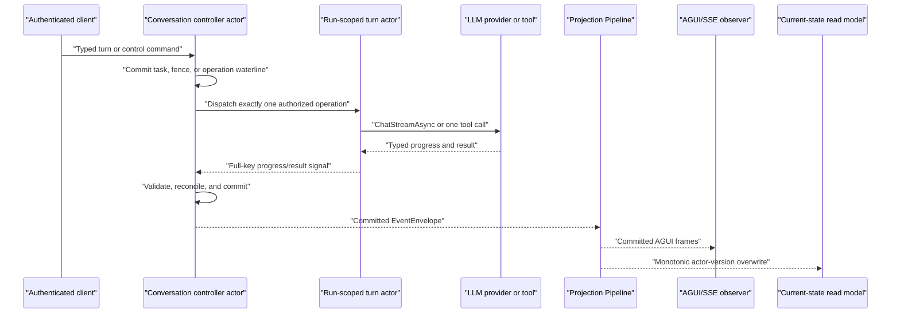

# NyxID Assistant Chat v1 Contract

This document is the canonical Aevatar contract for NyxID Assistant Chat v1. It covers conversation and turn identity, actor-owned task execution, live AGUI observation, stop and steering controls, browser-action handoff, conditional current-state reads, recovery, and the secret boundary.

The authoritative runtime is one durable conversation-controller actor plus a run-scoped turn actor that executes one authorized operation at a time. The controller's committed protobuf state is the task authority. AGUI and the current-state query are two consumers of the same committed Projection Pipeline; neither endpoint nor projector reconstructs task truth.

## Architecture and ownership



The conversation controller owns active/latest turns, task and step status, operation generations, effect evidence, approval/action correlation, stop/steering fences, continuation admission, and available actions. It remains responsive while provider or tool I/O is pending.

`NyxIdChatTurnGAgent` is short-lived. Its opaque actor address is a server-owned reuse key and has no client-visible meaning. It records only admission/completion/delivery waterlines and safe effect evidence, runs one LLM or tool operation, and reports back to the controller. It never owns conversation truth and never performs a second operation without a new controller authorization.

The Host authenticates, validates identities, dispatches commands, and maps typed results. It does not decide task transitions. Projection consumes committed controller facts only. Query reads `NyxIdChatConversationCurrentStateDocument` only; it does not activate an actor, read the event store, attach or prime a projection, replay events, or create a turn.

Conversation creation has three deliberately separate authorities:

| Concern | Authority | Query surface |
|---|---|---|
| Admission and create status | Scope actor registry | `GET /api/scopes/{scopeId}/nyxid-chat/conversations` |
| Task, turn, and control state | `NyxIdChatConversationGAgent` | `GET /api/scopes/{scopeId}/nyxid-chat/conversations/{actorId}/state` |
| Durable transcript | `ChatConversationGAgent` | `/api/scopes/{scopeId}/chat-history` |

The HTTP endpoint owns only authentication/protocol adaptation, serialized SSE writes, and the wall-clock connection deadline. No one surface implies synchronous visibility in the other two.

## Identity model

| Identity | Owner and lifetime | Meaning |
|---|---|---|
| `scopeId` | Authenticated resource scope | Ownership/admission boundary for the conversation. |
| `actorId` | Server-created, conversation lifetime | Canonical conversation-controller identity and public thread identity. Reuse it across turns. |
| `turnId` | Server-created, one normal submission or continuation | One observed run. It is not the conversation actor ID. |
| `taskId` | Conversation actor, one task plan | Actor-owned task identity. It is distinct from `turnId`. |
| `stepId` | Conversation actor, one task step | Selects a typed step inside `taskId`. |
| `operationId` | Conversation actor, one logical operation | Correlates one LLM, tool, or postcondition operation. |
| `operationGeneration` | Conversation actor, monotonically renewed for a step | Rejects stale progress/results and fences retries. |
| `clientRequestId` | Caller-created, one transport retry identity | Makes an identical request replayable. It is not a resource identity. |
| `commandId` | Command pipeline, one dispatch | Tracks accepted dispatch. It does not imply commit or read-model visibility. |
| `correlationId` | Command pipeline, one trace chain | Correlates transport and observation independently of resource IDs. |
| `stopRequestId` / `steeringId` | Caller-created control identity | Makes one stop or steering intent idempotent. |
| `retryRequestId` / `skipRequestId` | Caller-created step-control identity | Makes one exact step control idempotent. |
| approval `requestId` | Conversation actor | Selects a pending Aevatar tool approval; it is not a browser-action ID. |
| `actionRequestId` | Conversation actor | Correlates one NyxID browser journey and its reports. |
| `originTurnId` | Conversation actor | The blocked turn that emitted an action request. |
| `continuationTurnId` | Server-created | New run created after accepted steering or `action.continue`; it never resumes the old turn ID. |
| `stateVersion` | Conversation actor committed version | Read-model freshness watermark; projection never invents a local version. |

Every child progress/result uses the complete operation key:

```text
actorId + turnId + taskId + stepId + operationId + operationGeneration
```

A mismatch in any component is stale or foreign evidence and cannot advance state.

## Create and confirm a conversation

```http
POST /api/scopes/{scopeId}/nyxid-chat/conversations
Authorization: Bearer <access-token>
```

Creation remains asynchronous and returns `202 Accepted` with a stable actor identity and an honest accepted-stage receipt:

```json
{
  "status": "accepted",
  "actorId": "conversation-alpha",
  "acceptedCommandId": "command-alpha",
  "correlationId": "correlation-alpha",
  "statusUrl": "/api/scopes/scope-alpha/nyxid-chat/conversations"
}
```

`acceptedCommandId` traces inbox admission; it is not a promise that actor handling, transcript projection, or a first turn has completed. The response `Location` and `statusUrl` both identify the NyxID conversation list. That list is the create-status resource for this transport: poll it until the returned `actorId` is present before treating admission as observable.

Registry visibility and transcript visibility are eventually consistent. Once registration is accepted, the controller durably schedules idempotent transcript initialization. The normal chat-history projection therefore eventually makes this request return `200` even when no first turn has completed:

```http
GET /api/scopes/{scopeId}/chat-history/conversations/{actorId}
```

The response contains the conversation document with an empty `messages` list. A transient `404` before projection catches up is lag, not permission to reconstruct history from controller events or to create a second transcript store.

`GET /api/scopes/{scopeId}/chat-history/create-recovery/{commandId}` belongs only to workflow conversation creation through `/api/chat`. It is not valid recovery for `nyxid-chat`; NyxID clients use the returned conversation-list `statusUrl`.

## Start and observe a turn

```http
POST /api/scopes/{scopeId}/nyxid-chat/conversations/{actorId}:stream
Authorization: Bearer <nyxid-access-token>
Content-Type: application/json
Idempotency-Key: client-alpha
```

```json
{
  "type": "text",
  "prompt": "Summarize the connected repository",
  "clientRequestId": "client-alpha"
}
```

`clientRequestId` may be supplied in the body or `Idempotency-Key`; the body wins. The server derives a stable actor-scoped `turnId` when a key is present and creates a fresh `turnId` otherwise. An exact retry reuses committed admission/result semantics; the same identity with different content fails closed. The deprecated `sessionId` field is ignored.

An ordinary text submission is not an implicit steering command. If the controller already has active work, it commits and projects a typed failure with code `ACTIVE_TURN_REQUIRES_STEERING`; it does not queue a hidden turn or fork the active plan.

The stream begins with transport context:

```json
{
  "type": "RUN_STARTED",
  "actorId": "conversation-alpha",
  "turnId": "turn-alpha",
  "runStarted": {
    "threadId": "conversation-alpha",
    "runId": "turn-alpha"
  }
}
```

Actor-authored task observation is committed before publication. The controller emits typed custom frames through the unified Projection Pipeline:

- `nyxid.task.snapshot`
- `nyxid.task.step.changed`
- `nyxid.control.changed`
- `nyxid.continuation.changed`
- `nyxid.step.control.changed`
- `nyxid.action.request`

Text, reasoning, tool-start, task, control, and terminal frames share the actor-owned progress sequence. `RUN_STARTED`, keepalive, and bounded endpoint-local setup failures are transport context and do not invent an actor sequence. A stream closes with exactly one terminal:

- task and turn `succeeded`: `RUN_FINISHED`, status `completed`;
- task and turn `blocked` or `stopped`: `RUN_FINISHED`, status `blocked`;
- task and turn `failed`: `RUN_ERROR` with a stable code and safe message;
- inconsistent committed task/turn terminal states: fail closed with `NYXID_CHAT_TERMINAL_STATE_CONFLICT`.

Heartbeat and text/action/approval frames share one serialized writer gate. A real terminal atomically closes that gate. If the configured wall-clock deadline wins, the endpoint closes the same gate, emits exactly one safe `RUN_ERROR` with code `STREAM_TIMEOUT`, and only then cancels the inner interaction. It returns without waiting for an interaction that ignores cancellation; any later content or terminal callback is discarded. A provider or interaction that completes by throwing its own `TimeoutException` is instead an inner execution failure and maps to the safe `STREAM_FAILURE` terminal. Request cancellation closes the gate without attempting a synthetic terminal on a disconnected client.

## Actor-owned state machine

Task and turn status are closed:

- `active`
- `succeeded`
- `failed`
- `stopped`
- `blocked`

Step status is closed:

- `planned`
- `waiting`
- `running`
- `done`
- `failed`
- `skipped`
- `cancelled`
- `uncertain`

Operation phase is closed:

- `requested`
- `dispatched`
- `running`
- `succeeded`
- `failed`
- `cancelled`
- `uncertain`

External-effect evidence is closed:

- `not_started`: no operation entered execution;
- `not_applied`: typed evidence says no external mutation occurred;
- `confirmed`: typed result or postcondition proves the effect;
- `may_have_changed`: an effect-capable operation may have reached the external system, but the outcome cannot be proved.

`uncertain` is not success and is not an automatic retry invitation. A required `failed`, `cancelled`, or unrecoverable `uncertain` step prevents task success. Browser-reported completion cannot make a step `done`; only a matching typed postcondition can.

The actor computes `retry`, `skip`, and `stop` availability. Retry requires rebuildable typed input plus proof that replay is safe: no effect occurred, or the exact logical operation is idempotent under a stable key. V1 does not persist tool arguments or capabilities, so an interrupted tool is never silently reconstructed. Skip requires an optional step or explicit safe-skip policy. UI code must not derive these actions independently.

## Stop, steering, retry, and skip

All control endpoints require scope/conversation admission. A successful endpoint response is `202 Accepted` and contains `requestId`, `commandId`, `correlationId`, and the canonical `stateUrl`; acceptance promises dispatch only. Observe committed outcome through AGUI or the state query.

| Intent | Route | Required request facts |
|---|---|---|
| Stop active work | `POST /api/scopes/{scopeId}/nyxid-chat/conversations/{actorId}:stop` | `turnId`, `stopRequestId`, `clientRequestId`, `expectedStateVersion` |
| Steer active work | `POST /api/scopes/{scopeId}/nyxid-chat/conversations/{actorId}:steer` | `turnId`, `steeringId`, `clientRequestId`, `instruction`, optional `inputParts`, `expectedStateVersion` |
| Retry one step | `POST /api/scopes/{scopeId}/nyxid-chat/conversations/{actorId}/turns/{turnId}/steps/{stepId}:retry` | `taskId`, `retryRequestId`, `clientRequestId`, `expectedOperationGeneration`, `expectedStateVersion` |
| Skip one step | `POST /api/scopes/{scopeId}/nyxid-chat/conversations/{actorId}/turns/{turnId}/steps/{stepId}:skip` | `taskId`, `skipRequestId`, `clientRequestId`, `expectedOperationGeneration`, `expectedStateVersion` |

Example stop request:

```json
{
  "turnId": "turn-alpha",
  "stopRequestId": "stop-alpha",
  "clientRequestId": "client-stop-alpha",
  "expectedStateVersion": 17
}
```

The controller commits a stop or steering fence before any successor decision. Once accepted, no later old-plan LLM round, tool, retry, or step may start. Stop outcomes are typed: `accepted`, `rejected`, `already_terminal`, or `uncancellable`. Cancellation is best effort. A late LLM result is discarded. Exact late tool evidence may refine `external_effect`, but it cannot remove the fence, change the stopped terminal, or authorize a successor. An unprovable effect-capable operation becomes `uncertain / may_have_changed`.

Steering is serialized by the actor. If an operation is physically in flight, the controller may commit `accepted_for_later`; the server starts the new `continuationTurnId` only after a safe checkpoint. Completed steps and prior effect evidence are preserved and never re-executed.

Retry and skip validate path `turnId`/`stepId`, body `taskId`, expected generation, expected actor version, and current actor-computed availability. Replaying the same request and content is idempotent. Reusing an identity with different content fails closed.

## Tool approval versus NyxID browser actions

These are separate products and identities:

- `POST .../{actorId}:approve` resolves a real `PendingToolApprovalState.requestId` for an Aevatar tool decision;
- `action.continue` reports a NyxID browser journey and starts a new continuation turn;
- an authorization/browser-action blocked turn cannot be continued via `:approve`;
- neither route reuses the old turn ID.

`:approve` accepts the actor-owned approval `requestId`, `approved`, and optional safe `reason`. Unknown or stale IDs return a typed error and do not modify another pending approval.

## NyxID browser-action handoff: schema v4

### Ownership and registry

Aevatar owns action intent, task correlation, safe parameter references, and the decision to continue. NyxID owns the browser card and journey, consent copy, auth modality, mutation, credential storage, and final authorization.

Aevatar snapshots `GET /api/v1/assistant/actions` at startup and accepts only schema version `4` with registry revision `nyxid-assistant-actions.v4`. The registry's `risk` and `remember_eligible` values are advisory inputs to Aevatar presentation/planning. The caller cannot submit or lower them, and NyxID recomputes and enforces authorization at execution time.

This startup dependency is active only when `Aevatar:NyxId:AssistantActions:Enabled=true`. The default is `false`: Aevatar does not call the registry endpoint and injects an immutable registry with no executable actions, so browser-action requests fail closed with `NYXID_ACTION_UNSUPPORTED` without preventing unrelated Host capabilities from starting. When explicitly enabled, registry fetch and schema/revision validation remain strict startup requirements.

The typed registry recognizes closed action schemas, but executable v1 handoff is narrower: an action must also have an Aevatar producer, wire mapper, and typed postcondition reader. In this version, `service.connect` is the executable browser-action path. Catalog and custom connection are distinct variants; a boolean such as `custom: true` never changes the meaning of one shared field set.

### Request wire frame

The outer AGUI custom envelope uses `payload`. The action's own arguments use `params`. `actionRequestId` and `originTurnId` are distinct:

```json
{
  "type": "CUSTOM",
  "custom": {
    "name": "nyxid.action.request",
    "payload": {
      "schemaVersion": 4,
      "actorId": "conversation-alpha",
      "originTurnId": "turn-alpha",
      "taskId": "task-alpha",
      "stepId": "step-connect-github",
      "actionRequestId": "action-alpha",
      "action": "service.connect",
      "params": {
        "catalogService": {
          "serviceSlug": "api-github",
          "requestedScopes": ["repo"]
        }
      }
    }
  }
}
```

For a custom endpoint, `params.customService` is used instead of `params.catalogService`. Safe custom URLs must be absolute HTTPS URLs and must not contain userinfo, query, or fragment components.

Before the action frame is observable, the controller atomically commits the action request, the waiting browser-action step, and the origin task/turn `blocked` terminal. A page reload therefore cannot lose the handoff fact.

### Continuation input and dispositions

The existing stream route accepts a discriminated authenticated body:

```json
{
  "type": "action.continue",
  "clientRequestId": "client-action-alpha",
  "originTurnId": "turn-alpha",
  "actions": [
    {
      "actionRequestId": "action-alpha",
      "originTurnId": "turn-alpha",
      "disposition": "completed",
      "resource": {
        "userService": {
          "userServiceId": "service-alpha"
        }
      }
    }
  ]
}
```

Reports must carry a unique `actionRequestId`, the exact common `originTurnId`, one closed disposition, and at most one typed safe resource reference. The five dispositions are:

- `completed`
- `declined`
- `failed`
- `cancelled`
- `expired`

Safe resource variants are `userService`, `key`, `node`, `serviceAccount`, `developerApp`, and `device`; a generic `id` is not accepted because those identities have different meanings.

`action.continue` is a wake-up signal, not mutation proof and not an old-run resume. The server creates a new `continuationTurnId` from the conversation and authenticated client request identity. A `completed` report starts the action-specific typed read-model postcondition. Only an exact, current match can change the step to `done / confirmed`. Missing, stale, unavailable, or mismatched evidence remains blocked/unverified; it never guesses success. Non-completed dispositions become typed terminal action outcomes without a postcondition success.

The continuation is archived as a separate transcript turn, but its user-side transcript input is a fixed disposition-only summary such as `NyxID action update: completed.` It never copies action resource IDs, request payloads, credentials, tool arguments, or raw results into chat history.

Multiple reports are reconciled independently; a batch is not a transaction. Duplicate exact reports are idempotent, while conflicting or cross-scope/conversation/origin reports fail closed.

## Conditional current-state query

```http
GET /api/scopes/{scopeId}/nyxid-chat/conversations/{actorId}/state
    ?afterStateVersion={version}&turnId={turnId}
```

The endpoint first validates scope ownership, then reads the durable actor-scoped current-state document. `afterStateVersion` and `turnId` are optional cursors. Results are typed:

- `current`: the server has a valid snapshot newer than the client cursor; returns the full safe snapshot;
- `not_modified`: server and client versions match, and optional `turnId` matches;
- `reload_required`: input is invalid, the client version is in the future, or scope/conversation/turn identity does not match;
- `not_found`: no owned conversation/read model exists.

Example `current` envelope:

```json
{
  "status": "current",
  "stateVersion": 18,
  "turnId": "turn-alpha",
  "snapshot": {
    "actorId": "conversation-alpha",
    "scopeId": "scope-alpha",
    "stateVersion": 18,
    "progressSequence": 9,
    "activeTurn": null,
    "latestTurn": {
      "turnId": "turn-alpha",
      "taskId": "task-alpha",
      "status": "blocked"
    }
  }
}
```

The snapshot contains query-shaped safe data: active/latest/recent turns, ordered task steps, operation key/generation and phase, effect evidence, available actions, approval/action summaries, control fences, continuation admission, progress sequence, and actor version. It excludes transient capabilities, raw LLM/tool results, credentials, and actor runtime internals.

The read model is eventually consistent and says so through its actor-derived `stateVersion`. Writes are monotonic overwrite: newer replaces older, byte-equivalent equal-version duplicates are idempotent, equal-version conflicts fail, and older versions cannot overwrite newer state. Query-time priming and replay are forbidden.

## Restart, cancellation, and uncertainty

Activation never executes provider/tool work inline. It may publish a typed self recovery signal containing the complete operation key, expected committed version, and closed recovery kind. The normal actor handler revalidates current state before acting; a stale key or version is a no-op.

Recovery rules are conservative:

- an exact requested browser-action postcondition may be redispatched under the same operation key because it is a typed read-model query;
- an interrupted LLM operation is not replayed automatically; it becomes `NYXID_CHAT_OPERATION_INTERRUPTED / not_applied` and may expose an explicit authenticated retry when input is rebuildable;
- an effect-capable tool is never replayed automatically, even when only its requested waterline was committed, because dispatch may have reached the external system before the next commit; it becomes `NYXID_CHAT_OPERATION_OUTCOME_UNCERTAIN / may_have_changed`;
- a turn actor that committed completion but lost result delivery does not reconstruct raw output or repeat I/O; it reports `NYXID_CHAT_OPERATION_RESULT_DELIVERY_LOST` and preserves its committed effect evidence;
- a blocked browser action has no hidden continuation after restart;
- late evidence after stop/steering may refine effect truth but cannot advance the old plan.

The turn actor persists no raw LLM text, raw tool result, tool arguments, credential, or transient execution capability. Therefore recovery is deterministic and honest rather than a best-effort reconstruction of uncommitted output.

## Secret boundary

Secrets may exist only in transient authenticated Host-to-operation commands where execution requires them. They must never enter conversation/turn actor state, committed domain events, current-state read models, AGUI/SSE frames, logs, or audit-safe annotations.

Forbidden durable/presentation data includes:

- access, refresh, bearer, OAuth, or provider tokens;
- authorization and cookie headers;
- client secrets, passwords, passphrases, or credential values;
- OAuth device codes or user codes;
- raw upstream bodies and secret-bearing tool arguments;
- URI userinfo, query, or fragment values that can carry secrets.

Action JSON rejects secret-shaped field names and bearer/basic credential values before protobuf dispatch. It rejects unsafe URLs instead of redacting and continuing. `device.approve.user_code` is never an Aevatar action: code entry stays entirely inside the NyxID-owned browser journey.

Action names such as `service_account.rotate_secret` describe a NyxID-owned journey; their params carry only the non-secret resource identity. They do not authorize a secret value to cross this boundary.

## Conversation transcript

All turns under one `actorId` share a conversation transcript, including after passivation/reactivation. Transcript/history remains a separate `ChatConversationGAgent` concern and is not the task current-state read model. Accepted registration initializes this authority even with zero turns. Completed, failed, stopped, and blocked terminal turns are delivered through the existing chat-history delivery actor at least once; stable delivery identities make initialization, reservation, and terminal replay idempotent and prevent duplicate transcript turns. Once a reservation is committed, any malformed or conflicting reuse fails without replacing that authoritative delivery state.

For a text turn whose `prompt` is empty and whose content is supplied only by
typed `inputParts`, transcript `userText` is the fixed safe placeholder
`Shared input content.` Raw part text, bytes, URI, and name are not copied into
history. The idempotency fingerprint still includes an irreversible digest of
the complete typed parts, so the same request identity cannot replay different
input as if it were an exact retry.

A blocked or stopped turn is archived with its typed terminal and safe summary. A new `clientRequestId` starts a new turn over the same conversation; reconnect uses the current-state endpoint instead of replaying actor events inside the query path.

Historical `nyxid.chat.legacy` actors are not controller actors. Their existing chat-history documents remain readable through chat-history endpoints, but the new `nyxid-chat` admission and streaming routes do not reinterpret `serviceKind`, actor-ID text, or history rows as a migration. Presenting a legacy actor ID to the new stream may therefore return `ACTOR_NOT_FOUND`. Legacy conversations remain read-only until an explicit migration contract creates a controller identity and records a real mapping.

## Caller checklist

Callers must:

1. reuse `actorId` only as conversation identity;
2. treat each `turnId` as one server-created run;
3. send `clientRequestId` only for transport idempotency;
4. use `:steer` rather than a normal text turn while work is active;
5. preserve the exact task/step/generation/version when invoking retry or skip;
6. preserve approval `requestId` separately from browser `actionRequestId`;
7. send schema v4 action reports with `actionRequestId`, `originTurnId`, `disposition`, and typed resource refs;
8. treat browser `completed` as a signal pending typed postcondition proof;
9. poll with `stateVersion` and obey `reload_required`;
10. use the NyxID conversation list, not workflow `create-recovery`, to confirm creation;
11. tolerate eventual empty-transcript materialization before the first turn;
12. never send a secret, OAuth/device/user code, raw credential, or secret-bearing URL in action params or reports.

Earlier schema v3 drafts that use action `id`, inner `payload`, only `completed/declined`, or a device user-code action are obsolete and must not be used to implement or test this contract.
