# NyxID Connected-Service LLM Tools

NyxID 是 exact UserService、credential、route、effective OpenAPI 与 normalized operation catalog 的唯一权威 owner。Aevatar 不托管 OpenAPI、不保存 UserService/endpoint 影子目录、不从 slug 推导实例身份，也不在 prompt 中维护第二份权限目录。

NyxID Assistant 的 operation-class 权威边界见 [ADR-0048](../adr/0048-nyxid-assistant-operation-class-boundary.md)。管理读（R）、浏览器 action（A）与 admitted connected-service operation（P）是三个独立 surface；任一 surface 的注册或激活都不会自动授权另一个 surface。

模型看到的最终 tool schema 与实际执行对象来自同一份 `LLMRequest.Tools`。工具调用仍经 NyxID proxy 下发，凭证注入、proxy/broker 审计、node routing 和 delegation 由 NyxID 负责；Aevatar 在进入 proxy 前统一执行 credential policy、actor-owned durable approval 和平台 tool audit。两边各自记录本边界事实，NyxID 的审批能力不能替代 Aevatar 本地准入。

NyxID `GET /api/v1/mcp/config` is the only descriptor source for published operations. `GET /api/v1/keys` supplies the caller-executable exact UserService inventory plus credential/node execution readiness; `/api/v1/user-services` is the route-configuration and write-authority surface, not the execution-readiness authority. Aevatar never fetches or parses raw OpenAPI from `/keys`. Current-turn published-operation exposure requires the exact ordinal intersection of `/keys` and MCP on both `user_service_id` and route slug; matching an ID with a different slug is route drift and fails closed. Published-operation runtime retains exact MCP endpoint-digest revalidation; authored-request runtime reads neither MCP, OpenAPI, nor inventory.

### Caller-visible inventory 与 route 自动收敛

三个 NyxID surface 各自只表达一种事实，不能相互代替：

| Surface | Aevatar 使用的权威语义 |
|---|---|
| `GET /api/v1/keys` | 当前 caller 可以执行的 exact UserService inventory，以及 active、connected/credential/node readiness、`allowed` 等执行事实。 |
| `GET /api/v1/mcp/config` | 已发布 typed operation catalog；只定义可被安全建模的 endpoint contract，不授予 UserService access。 |
| `/api/v1/user-services` | exact UserService route configuration 与该 caller 的 write authority；不作为执行 inventory 或 operation catalog。 |

Aevatar 默认把 `/keys` 中当前 caller 所有 active、connected/credential-ready 且 allowed 的 exact UserService 作为可直接使用的服务全集，不要求用户再在 Aevatar 注册一份服务或维护平行 allowlist。这里的“直接使用”表示拥有 typed operation、authored-request proof 或 platform capability contract 的调用链可选择该 exact UserService；它不把未发布 endpoint 变成 model-visible tool，也不开放 generic raw proxy。inactive、credential-forbidden、identity-conflicted 或 source-unready 的条目仍 fail closed。

route policy 不属于一套全局默认值。每个 capability owner 必须声明自己的 typed route contract；例如它可以要求一种被下游接受的 credential delivery 方式或一个最小 scope membership。只有 fresh command admission 确实选择并需要该 capability、当前 route 又不满足其 contract 时，Application command preflight 才可请求 NyxID adapter 对 exact UserService 做需求驱动的最小收敛，然后 fresh readback 并重新执行同一 contract。readiness/query、read model、actor runtime、persisted revalidation 与普通 inventory discovery 都不得写 route，也不得在读取时顺带 repair。

caller-visible 不等于 caller-writable。自动收敛只接受经过 ingress 验证的 direct human NyxID access token，并且 NyxID authority 必须证明该 exact route 是 caller-owned personal service，或 caller 是该 organization service 的 admin。organization member/viewer 即使 `allowed=true` 仍只能使用已经满足 contract 的 route，Aevatar 不替其修改 shared route；不具备 write authority 的 mismatch 返回 typed blocker。proxy delegation、broker/read token、API key、service account、relay credential 和持久化 command/proof 中的 token-like value 都不能升级成 route mutation authority。

收敛必须只写 capability contract 所需字段，保留当前 route 的其他 typed 值；禁止为“以后可能需要”而统一开启 `forward_access_token`、统一开启 delegation、或给所有服务追加 `proxy:*` / `sandbox:execute`。已经满足 contract 的 route 必须零写入。NyxID 当前 UserService update contract 没有 revision/ETag compare-and-swap，因此该过程是 bounded best-effort convergence，不是线性化事务：它在写前读取 exact route、提交最小 patch、写后 fresh readback；若最终 identity、authority、preserved values 或 contract 不匹配就 fail closed，且不得 blind retry。并发写仍可能在 read/PUT/read 窗口发生，尤其需要重写 scope 集合时不能声称不会覆盖同窗口的第三方变更。

## 1. 实例与 operation 身份

普通 connected-service tool discovery 分别使用当前请求的 user token 和可用 organization token 读取 `/api/v1/keys`。每条可用实例在边界映射为 Protobuf `NyxIdServiceInstance`，保留：

- exact `user_service_id`；
- credential source 与实际 access-token source；
- active、credential-allowed 状态；
- catalog service ID 或 custom service slug 组成的单一 route constraint；
- endpoint 与 node binding facts。

同一个 `user_service_id` 若在 user/org 结果中对应不同 token、credential 或 route facts，该身份整项删除。inactive 或 credential-forbidden 的实例不进入工具。不同 `user_service_id` 即使显示 slug 相同也保持独立，不合并，也不按前缀、字符串相等或 route 位置推断身份。

面向 NyxID Chat 展示与恢复的 `NyxIdOperationRef` 还可以携带可选的
`readiness_capability_id`。该值只能由拥有 NyxID Assistant readiness
registry 映射的 producer 明确提供；Aevatar 只做 typed snapshot 与投影，
不调用 readiness API，也不从 `user_service_id`、route `service_slug`、
`catalog_service_slug`、tool name 或错误文本推导。connected service ID、
route slug、catalog slug 与 readiness capability ID 始终是四个独立身份域。

MCP catalog 中 `is_user_service=true` 的 `service_id` 是 exact UserService identity；`endpoint_id` 是 service-local opaque operation identity。`PublishedEndpoint` selector 使用 `user_service_id + endpoint_id`，display name、method、path 与 slug 都不能替代或重建任一 ID。`AuthoredRequest` selector 使用 typed request contract，并且只有 authenticated binder 对当前 digest/risk 的确认生成 `NyxIdExplicitRequestGrant` 后才能成为 admitted proof；它不把 request contract 降级为 endpoint selector。

`catalog_service_slug` 是 NyxID catalog class identity，不是 exact connection identity。current-turn operation factory 从 exact `/keys` observation 把它写入 `AgentToolOperationAdmission`，admission digest 与 Protobuf checkpoint 都覆盖该值；presentation 只投影同一 admission，不再独立持有一份安全事实。它可供 Agent Profile 做服务类别缩权，但不能替代 `user_service_id + endpoint_id` 的执行 selector，也不能从 display、route slug 或 tool name 反推。

## 2. Shared MCP catalog adapter

普通 current-turn discovery 与 published-operation workflow admission 共用 `NyxIdMcpOperationCatalog`; published runtime keeps its exact MCP endpoint-digest revalidation. Authored-request runtime does not use this adapter. The adapter accepts only stable contract:

- `contract_version == "1.0"`；
- `catalog_digest` 为 `sha256:<64 lowercase hex>`，并直接作为 NyxID normalized descriptor revision；
- non-empty、unique `service_id` 与 service-local unique `endpoint_id`；
- `is_user_service=true && is_generic_proxy=false`；
- 支持的 method/path、parameter、header、request body 与 JSON Schema 子集；
- typed `response.content_types` 与 tri-state `response.binary_artifact`。

missing/duplicate identity、platform service、generic proxy、cookie、required sensitive/unsupported header、不支持的 body/schema/response 均 fail closed，并生成 bounded typed diagnostics。`binary_artifact=true` 只准入 GET operation；`false` 生成 text response proof；`null` 只允许 text，不被猜测成 file artifact。free-form `response_description` 不参与安全决策。

Aevatar 记录真实 observation time 作为 freshness fact，但不把时间戳或本地 counter 冒充 source revision，也不重新计算一个替代 NyxID `catalog_digest` 的 root revision。endpoint admission digest 只覆盖 Aevatar 实际验证并提交到 proof 的 canonical 字段。adapter 不建立 process-local catalog、token、service 或 endpoint cache。

## 3. 普通 current-turn 工具

NyxID Assistant 的 management Class-R 由 `NyxIdAssistantToolSource` 提供 narrow typed REST reads。connected-service exact inventory 是其中独立的只读子边界：`nyxid_service_inventory` 由 `NyxIdConnectedServiceInventoryToolSource` 或 channel sender-authority wrapper 提供，只接受空参数，并在真正调用时读取当前 caller 的 exact `/keys` inventory。它不与 Class-P operation source 合并，也不把 inventory ID 当成 operation selector。

历史 `nyxid_service_update`、`nyxid_service_route` 与 `nyxid_service_delete` 不再由 connected-service tool source 生成。它们与 ADR-0048 的 Class-A action ownership 冲突，且 #3299 的 pinned chat allowlist 明确不允许这类 mutation 因 DI 注册进入 Assistant。需要管理 mutation 的产品 surface 必须拥有独立、显式的 authorization contract，不能复用 Class-R inventory 或 Class-P operation admission。

NyxID `contract_version=1.0` 没有发布独立的 typed current-turn exposure policy。Milestone 40 因此采用 Aevatar-owned、server-sealed closed policy，而不是把 MCP catalog 整体当成授权：只有同时存在于本次 active、credential-allowed exact inventory 的 UserService 才进入候选；`GET/HEAD/OPTIONS` 作为 safe read 暴露，`POST/PUT/PATCH` 只作为必须经过统一 approval port 的 non-destructive effect 暴露，`DELETE`、generic proxy、unknown risk 和 policy/schema contradiction 全部 fail closed。生产路径仍不存在 model-visible generic proxy、raw method/path selector 或 raw OpenAPI parser；workflow admission 通过也不能自动扩大普通 turn exposure。

Milestone 40 的唯一 model-visible Class-P contract 是 request-local dynamic operation tools：每个 server-admitted operation 对应一个 bounded argument-only schema 和 opaque request-local tool name，并在服务端映射回同一份冻结 `user_service_id + service_slug + endpoint_id + canonical operation digest`、risk 与 argument contract；根级 `catalog_digest` 作为 source observation provenance 随 admission 保留，但不属于 terminal exact authority key。opaque name、description 与 schema 都不得泄露 selector 或 digest；description 只携带 server-authored、bounded、normalized service/operation label，使模型在多 operation 场景可以区分工具。normalized label 只要包含任一 exact service ID、service slug、endpoint ID、catalog digest 或 contract digest，就必须整体降级为通用 `Connected service` / `Operation`；endpoint name 缺失时也不得把 endpoint ID fallback 暴露给模型。模型参数不得包含 service/endpoint/catalog selector。`search_connected_service_operations + invoke_connected_service_operation(candidate_ref)` 不属于本里程碑，不得作为第二条选择链路并存。

current-turn discovery request-locally 读取并解析 MCP catalog，与 `/keys` exact inventory 求交后生成 operation tool，并只记录 bounded diagnostics/count。MCP 或 `/keys` discovery 不可用、无 caller token、无有效实例或 identity conflict 时，Class-P surface 为空；管理 surface 不作为 fallback。

Profile connected-service selector 只在上述 request-local catalog 已经完成 route discovery、typed visibility 与 caller authorization 后执行。selector 优先使用 canonical `catalog_service_slug + endpoint_id + READ_ONLY/WRITE risk` 匹配 exact operation admission；只给 slug/risk 且候选仍过多时，bounded selector 最多选择 3 个 read 或 1 个 write endpoint。同类多 connection 或多个 write 无法唯一确定时只暴露 `ask_user`，不把全集交给模型。selector 不按 opaque `nyxop_*` 名称、presentation、HTTP method/path 或 `service_instance_id` 猜测，不创建/修复连接。literal name、tool-set ref 与 selector 在单个 policy 内相加，而 maximum、recovery 与 task policy 继续取交集；因此 selector 只能缩小现有 surface，不能扩大 route authority。未匹配 selector 贡献空集，非法 sealed selector fail closed。

所有 connected operations 都进入统一 [`AgentTurnToolCatalog`](agent-turn-tool-catalog.md)：ordinary final catalog 以 8 tools 为优化目标、schema 不超过 48 KiB，并额外硬限制 read ≤ 3、write ≤ 1。合法 exact catalog 超过数量目标时完整进入模型，不报错也不截断；模型声明、exact executor object 和 persisted proof 使用同一 digest。

浏览器授权后的原请求续接仍使用同一条通用 Class-P 主链，不为任何 provider 建立专用分支。只有 actor-owned typed postcondition 已验证一个 exact UserService，且跨 turn correlation 同时匹配 accepted continuation admission、origin/continuation turn、task、完整 operation key、action request 与 postcondition dependency 时，conversation actor 才能派发 `NyxIdChatVerifiedAuthorizationContinuation`。该 closed protobuf 只包含安全 action/step/resource identity、从 typed action params 冻结的 `service_slug`、验证时间与 resume requirement；不包含 token、credential 或 generic metadata bag。

`COMPLETE_ORIGINAL_SERVICE_REQUEST` 续接会先使用当前请求 credential 重新物化 request-local catalog，再按 typed `IAgentToolOperationAdmissionOwner.OperationAdmission.ServiceInstanceId == verified UserServiceId` 且 `ServiceSlug == frozen service_slug` 做精确收窄。unprofiled turn 从当前 `agent-profile.nyxid-chat` route toolset 重新发现；profiled turn 必须校验 committed profile identity，并继续受当前 `MaximumToolPolicy` 限制，但不再与 OAuth 前冻结的 turn/task authority ceiling 求交，因为新连接建立的 operation 不可能预先存在于旧 ceiling。结果只保留当前 catalog 中 final-allowed 的 route-owned operation tools；management tools、global tools、其他 UserService、相同 slug 的其他实例或相同实例的不同 slug 都不构成 fallback。缺少 exact UserService、缺少 frozen slug、没有匹配 operation 或 route drift 时返回 restricted empty catalog，并在 LLM 前以 `NYXID_AUTHORIZATION_CONTINUATION_CAPABILITY_UNAVAILABLE` fail closed。

续接 instruction 只追加到本次 transient LLM step state，不进入 pending/appended history、actor state、committed event、read model、projection、metadata 或日志。模型第一次只返回文本而没有调用 exact operation 时，actor 只追加一次携带同一 action identity 与 postcondition dependency 的 `failure_recovery` LLM step；第二次仍无 tool call 时固定失败为 `NYXID_AUTHORIZATION_CONTINUATION_TOOL_REQUIRED`。专门的授权完成请求使用 `COMMUNICATE_AUTHORIZATION_COMPLETION`，其 request-local catalog 强制为空，只允许在 typed postcondition 已验证后沟通授权结果。缺少 typed UserService、frozen slug、recognized resume requirement 或 profiled committed identity 的其他组合都在 LLM 前 fail closed。

read operation 的 terminal 结果固定投影为 `connected_service_read_projection`：proxy transport 以 headers-first streaming read 将 upstream text 限制为 16 KiB，完整 model-visible typed projection 再以 UTF-8 字节数执行同一 16 KiB 上限；任一边界超限都只返回 `status=retry_required` 的 bounded typed projection，不返回 partial/raw provider body。该投影的 tool receipt 为 `SUCCESS` 只证明边界执行成功并可靠地产生了“必须缩小查询”的结果，不表示 oversized provider data 已被读取或可用；conversation 因此可以继续下一次 LLM turn，用更窄 query/page size 分页读取，而不是把整个 task 终止为工具不可用。`error_code=NYXID_CONNECTED_SERVICE_READ_TOO_LARGE` 只存在于 model-visible projection，receipt 不伪造 provider error。投影携带 bounded service/operation provenance、`content_boundary=untrusted_external_data_only` 与 `instructions_allowed=false`，外部字符串始终只是 data。effect operation 固定投影为 `connected_service_effect_receipt` 并携带 provider-owned typed receipt；read projection 与 effect receipt 不共用结果 shape，upstream effect body 不进入模型或 durable result。

## 4. Workflow authoring 与 admission

```mermaid
%%{init: {"maxTextSize": 100000, "flowchart": {"useMaxWidth": false, "nodeSpacing": 10, "rankSpacing": 50}, "themeVariables": {"fontSize": "10px"}}}%%
flowchart LR
    A{"Workflow step selector"}
    A -->|"PublishedEndpoint(endpoint_id)"| B["MCP descriptor"]
    A -->|"AuthoredRequest(request_contract_digest)"| C["Exact inventory at bind"]
    C --> D["Authenticated binder confirmation + NyxIdExplicitRequestGrant"]
    B --> E["Actor-owned server v4 definition proof"]
    D --> E
    E --> F["Workflow run actor"]
    F --> G{"Committed selector"}
    G -->|"PublishedEndpoint"| H["Runtime MCP endpoint-digest revalidation"]
    G -->|"AuthoredRequest"| I["Validate proof + grant; no MCP/OpenAPI/inventory re-read"]
    H --> J["NyxIdAdmittedRequestBuilder"]
    I --> J
    J --> K["Exact proof-bound NyxID Proxy route"]
```

Workflow live discovery uses the caller token to read MCP only for `nyxid_operation`, which is `PublishedEndpoint(endpoint_id)`. Its definition actor commits a call-site-scoped proof with server-derived slug, endpoint identity, request schema, response policy, execution policy, source stamp, and contract digest. `nyxid_request` is instead `AuthoredRequest(request_contract_digest)`: bind-time admission reads one active, caller-visible, credential-allowed exact `user_service_id` from inventory, derives the slug constraint server-side, and does zero MCP/OpenAPI read. The definition actor persists the request proof only after an authenticated binder explicitly confirms its current request-contract digest and effective risk as `NyxIdExplicitRequestGrant`; apply/save cannot grant it. Omitted risk remains method-derived. Explicit `POST + READ_ONLY` is supported for semantically read-only APIs but is interactive-only; `PUT/PATCH/DELETE + READ_ONLY` is rejected.

这个重验是 terminal 内的资源一致性检查，不能代替 terminal 前的统一准入。所有 server-owned connected-service 工具都通过 `IAgentToolExecutionPort`；只有 `AdmittedAgentToolExecutor` 可以调用 raw `IAgentTool.ExecuteAsync`。端口冻结最终 arguments 并只分类一次，随后依次执行 credential policy、exact actor-owned grant、start-once admission ledger 与 `WAITING_APPROVAL/RUNNING/TERMINAL` audit observation。完整 `AgentToolOperationAdmission` 作为 typed Protobuf fact 随 actor-owned execution/recovery checkpoint 持久化，恢复时重建同一个 selector、contract、response 与 execution policy；credential 不进入该 payload，必须按恢复请求重新解析。conversation actor 生成 direct typed Tool command 时，必须把同一份 exact admission、完整 arguments 与以 `operation_id` 冻结的 idempotency key 交给 turn actor，不能退回只凭 tool name、argument hash 或 transient capability 执行。只有 ledger 返回 `Started` 才能进入上述 `/keys` 重验和 proxy 调用；ledger `Duplicate`、`Conflict`、审批拒绝或 credential 拒绝的下游请求数都为 0。audit append status 不授予执行；terminal 已调用后任何 audit failure 都保留实际结果并标记不可重试。

proxy 请求只接受相对路径，拒绝绝对 URL、fragment、query-in-path 和 dot segment。路由只来自冻结并重验后的 catalog ID 或 custom slug；Aevatar 追加 URL 编码后的 `_nyxid_via={user_service_id}`，调用参数不得提供任何 `_nyxid_*` query。header allow-list 仅含 JSON `Accept`/`Content-Type` 与条件头 `If-Match`/`If-None-Match`，禁止调用者注入 authorization、routing 或 hop-by-hop header。非 safe method 由客户端生成 typed idempotency key。

Workflow authoring 的只读入口统一属于 `workflow.external-capability-authoring` tool set，且只包含 `list_external_workflow_capabilities`、`inspect_external_workflow_capability_readiness` 与 `preview_workflow_explicit_requests`。Mainnet 的 `workspace.default` 与 `nyxid.chat.default` 都不包含这个集合；NyxID Chat 先把当前请求分类成持久化的 typed `WORKFLOW_AUTHORING` intent，命中后才为该回合物化这三个只读工具。`agent-profile.nyxid-chat` 只把该集合纳入内部 authority superset，profile 的 `MaximumToolPolicy` 与本回合 task policy 仍会继续收窄，不能据此把 schema 默认发给模型。内置 Studio workflow 因职责明确而显式组合该集合；其他 direct route 只有显式选择这个 tool set 才会得到它。完整 binding source 不因 authoring 需求而进入上述 surface。这样普通回合不承担无关 schema 成本，authoring 回合的 prompt 与实际工具仍保持一致，也不扩大 bind/unbind 或 scope workflow mutation 权限。

Studio authoring 在 exact descriptor 缺失时不再把“当前不可运行”误报成“不能创建 workflow”。`/api/chat` 的 Studio agent 仍先调用 `list_external_workflow_capabilities`；若没有匹配项，可用 `web_search` / `web_fetch` 查询官方文档，官方文档也不可用时可根据用户描述推导最小 authoring shape。搜索或推导只用于生成可编辑 YAML，不是 route authority：不得据此生成 `user_service_id`、`endpoint_id`、selector、admission proof、HTTP method 或 path authority。

缺 exact selector 的 YAML 不写 step-level `capability`，只通过 `aevatar_create_member_workflow_draft` 创建或复用 Team-owned workflow member shell，并保存独立的 scope-owned draft。返回值必须保持三类身份分离：`member_id`、draft `workflow_id`、未来的 `published_service_id` 互不替代；Studio URL 固定为 `/scopes/:scopeId/teams/:teamId/members/:memberId/workflow?workflowId=:workflowId`。draft receipt 只表示 command `Accepted`，readiness 为 `projection_pending`，并显式返回 `runnable=false`、`binding_status=not_bound` 与 `NYXID_OPERATION_SELECTION_REQUIRED`。该分支不得 bind、schedule、provision、publish、run 或发出 proxy request。

因此 workflow 外部能力有四个诚实阶段：

1. **Authoring draft**：允许无 exact descriptor 保存不可运行草稿；搜索/推导只影响可编辑内容。
2. **Workflow definition admission**：`nyxid_operation` uses exact `user_service_id + endpoint_id` and live MCP; `nyxid_request` uses its exact UserService inventory observation and typed request contract.
3. **Binding / publication**：only an authenticated binder can confirm the current authored-request digest/risk and create its grant; admission plus grant are required before bind/publish, while draft save cannot impersonate either.
4. **Runtime authorization**：run validates committed proof, matching grant when authored, execution mode, and digests, then makes one exact proxy request. PublishedEndpoint retains MCP endpoint-digest revalidation; AuthoredRequest performs no MCP/OpenAPI/inventory re-read. No earlier stage expands runtime permission.

身份边界保持独立：`scope_id`、`owner_scope_id` 与 `owner_subject` 只表达 Aevatar 资源所有权/调用上下文；NyxID caller 只能来自认证 principal 映射出的 typed `NyxIdAuthority`。缺失 authority 时 live discovery/admission fail closed，禁止从 scope、member、workflow、route 或 owner 字符串推导。

Dynamic exposure、workflow definition admission 与 runtime authorization 是三个独立 policy；authoring draft 位于这些授权 policy 之前，不授予执行权限：

1. **Current-turn exposure**：由上述 Aevatar-owned closed policy 对当前 exact MCP + inventory observation 做 request-local admission；catalog entry 本身不自动获得 exposure。
2. **Workflow definition admission**：MCP resolves only `PublishedEndpoint`; exact inventory plus authenticated binder grant resolves `AuthoredRequest`.
3. **Runtime authorization**：managed workflow accepts only its committed call-site proof and matching authored-request grant. Durable additionally requires exact-service catalog authorization plus the schedule operation-authorization gate; `READ_ONLY` remains limited to GET/HEAD/OPTIONS, while `WRITE` and `DESTRUCTIVE` requests keep their admitted risk in the proof.

GET/HEAD/OPTIONS are durable-capable when the binder attests `READ_ONLY` and exact-service durable authorization exists. After the complete durable proof/grant integrity check, these safe reads do not require the separate schedule operation-authorization preview contract; NyxID still enforces current policy on every runtime proxy call. `POST + READ_ONLY` remains interactive-only; `PUT/PATCH/DELETE + READ_ONLY` is rejected. `WRITE` and `DESTRUCTIVE` authored requests may be durable only with the matching explicit grant, durable catalog evidence, execution mode, and schedule operation authorization. A selector, route proof, source observation, or service durable authorization cannot replace the explicit grant or policy gate.

- NyxID 是实例、credential、route 与 spec 的唯一真实源；Aevatar 不维护 process-local catalog 或 spec cache。
- Aevatar 不新增 NyxID endpoint，不绕过 proxy 直连下游，不引入第二条投影或 read model。
- 外部 JSON 只在 NyxID adapter 边界解析；内部实例、请求与结果语义使用 Protobuf。
- 平台审计由 canonical `AdmittedAgentToolExecutor` 消费 typed execution context、credential source、冻结参数 digest 和 receipt；默认不记录完整 arguments、result 或 `receipt.result_json`。
- prompt-prefetch、API hint、slug-bound proxy 和独立 connected-service spec cache 已从主链删除；prompt 不能替代最终 tool schema 做能力判断。

### NyxID 聚合工具的 closed action

`nyxid_approvals` 与 `nyxid_services` 使用同一个 closed typed action parser 生成 schema enum、执行 `GetCallSafety` 分类并选择 terminal action，三处不能维护不同的 action 列表。只有合法 JSON object 缺少 `action` 时才默认只读 `list`。空白、malformed JSON、数组、scalar、非字符串/null/空白 action 和 unknown action 一律按 `requires approval + non-read-only + destructive` 分类；若进入 terminal，只返回 `invalid_action`，不调用 NyxID HTTP。

所有 caller-requested generic management mutation 都需要 durable approval，包括 approval decision、grant revoke、service create/update/route/delete 和 credential rotation。准入发生在 mutation 的任何预读之前，因此 credential rotation 被拒绝时，查找 `api_key_id` 的 GET 和后续 update 都必须为 0。capability-owned route convergence 不是 model-visible management action：它只允许在上文 direct-human command preflight、exact write authority、typed field contract、最小 patch 与 fresh readback 全部满足时自动执行，不能作为 Class-R/P tool 或 runtime fallback 暴露。

## 5. 执行与重验

update、route 与 delete 在 mutation 前使用发现时绑定的 token 读取 exact `/keys/{user_service_id}`。当前 instance 必须与冻结 instance 的 identity、credential/token source、credential allowance、route、endpoint 与 node facts 一致且仍为 active，否则在副作用前 fail closed。

Proof-bound runtime does not rediscover, prime, refresh admission, or read raw OpenAPI. PublishedEndpoint dispatch retains current-MCP exact `user_service_id + service_slug + endpoint_id + operation_contract_digest` revalidation. A root `catalog_digest` mismatch emits a bounded diagnostic and continues this exact revalidation; missing service identity, slug drift, endpoint absence, or operation-contract drift still fails closed before proxy dispatch. AuthoredRequest dispatch reads neither MCP nor inventory: before downstream proxy request or file ingress it validates committed request proof/grant digests, policy, and allowed execution mode, then calls only the exact proxy route with exact `user_service_id` and server-derived slug constraint. Proxy authority drift/access rejection maps to typed failure. Slug-only lookup and any authored-request runtime source fallback are forbidden.

`NyxIdProxyTool` 是共享 runtime enforcement boundary。Mainnet 的 `Distributed` 配置显式设置 `Aevatar:NyxId:ManagedWorkflowAdmissionMode=Enforce`，且 proxy 与 startup inventory guard 读取同一个 `NyxIdToolOptions` singleton。managed workflow 缺 proof 或携带无效 policy 会在 token resolution、exact revalidation、file ingress 和 proxy HTTP 前返回 `NYXID_OPERATION_ADMISSION_REQUIRED`；显式 `Shadow` 回滚只记录相同 decision 并继续 legacy behavior。普通 non-workflow human raw proxy surface 不因 workflow guard 获得或失去权限。

proxy request 只接受 relative path，拒绝 absolute URL、fragment、query-in-path 和 dot segment。route 只来自 proof/frozen exact instance；Aevatar 追加 URL-encoded `_nyxid_via={user_service_id}`，调用参数不得提供 `_nyxid_*` query。caller header 不能注入 authorization、routing、content-type ownership 或 hop-by-hop semantics。非-safe method 使用 typed idempotency key。

## 6. 请求期能力与 channel inventory

Class-P dynamic operation adapter set 注册为 `nyxid.connected_services`（`ToolSetNames.NyxIdConnectedServices`），但注册不等于 NyxID Assistant route 激活。Studio 每个 LLM turn 都在当前 caller token 与 typed context 下分别 resolve R/A route tools 与 P admitted operation tools；结果只进入该请求的 `AgentTurnToolCatalog` 与最终 `LLMRequest.Tools`。unknown set、discovery failure 或 duplicate name 对本请求 fail closed，不写 actor/global catalog，也不跨 caller 缓存。Workflow operation authoring 使用独立的 structured capability list/readiness tools。

Mainnet 不得假设 `agent-profile.nyxid-chat` 自动合并 `workspace.default` 与完整 `nyxid.connected_services`。R/A 的 route set 由 profile binding 显式激活；P operation 则只能由本次请求的 exact MCP observation 生成，并以 `user_service_id + service_slug + endpoint_id + canonical operation digest` 完成 admission 后注入，同时保留根级 `catalog_digest` 作为 observation provenance。Mainnet host 在 Milestone 40 直接启用已具备 actor-owned admission/effect facts 的 non-destructive effect exposure；其他 host 仍保持 fail-closed 默认值。raw `nyxid_proxy` 自声明不适用于 NyxID Assistant，因此 profiled 与 unprofiled NyxID Chat 都不会把它提供给模型。该 surface 限制不删除 shared proxy，也不改变 workflow、Lark 或其他拥有独立 admission contract 的调用方。

Milestone 40 使用 ADR-0048 的 Tier B approval fallback。turn actor 提交准入与 effect dispatch waterline 后立即结束当前 turn；基础设施 dispatch session 在后台等待 NyxID effect handler。等待期间 Aevatar 尚无 exact `approval_request_id`，只能投影 running/waiting 与阈值派生的 stalled；只有 NyxID 返回 7000/7001 且携带真实 request ID 后，typed inbox completion 才能推进并提交 pending-approval fact。NyxID 返回的 `approval_mode` 独立映射为 typed `per_request / grant / unknown`，不复用 Aevatar 本地 approval receipt mode；缺失或非法值只能提交 `unknown`。generic `tool_approval` sentinel 没有真实 request ID，也不产生 exact-service grant，必须 fail closed。

计划只投影 read-only progress，不参与工具授权。conversation actor 直接派发 server-sealed typed Tool command；turn actor 在执行前持久化 exact admission、operation key、idempotency key 与 effect dispatch waterline。ambiguous operation dispatch 走普通 operation probe/tombstone 协议，迟到命令不得越过已提交 fence。显式 effect retry 只携带 credential-free authorization snapshot、完整 tool-definition fingerprint 与 exact `not_applied` source operation key；turn 重新匹配 current profile tool 和 complete admission contract，不能把 generation counter、历史 receipt 或 generic approval 当成授权。工具若返回 exact `ApprovalRequired`，只能由该 invocation 对应的 `approval.resolve` 继续；计划、OAuth 完成信号或其他工具 receipt 都不能替代它。

只读 `nyxid_service_inventory` 也可由 `ChannelNyxIdConnectedServiceInventoryToolSource` 显式挂入 channel reply generator。该 wrapper 在模型真正调用时才以 current sender authority 读取 `/api/v1/keys`；不得替换为 bot-owner token、sandbox CLI login 或进程级 cache。自然语言 inventory 走 `AgentRun -> ChatStreamAsync -> use_skill("nyxid") -> nyxid_service_inventory -> sender /keys -> streamed answer`，不引入 phrase matcher、direct query adapter 或 `code_execute`。

Pinned NyxID Assistant route 不挂载 `nyxid_service_inventory`：该 route 的 caller inventory 读取由 read-only `nyxid_services`（list/show，读 `/api/v1/keys`）承担，不为同一事实并列第二个 model-visible 读取工具。kernel 与 floor prompt 对 inventory 读取的指引必须以 `nyxid_service_inventory` 出现在最终 tool schemas 为条件；缺席时指向当前实际存在的只读 management read，不得无条件指向单一工具名。

## 7. NyxID Chat turn credential lifecycle

NyxID Chat ingress 把 caller credential 明确分为两类，后续 turn operation 不得改变其 kind：

- `SourceReadableUserBearer` 是 caller 自己的 bearer。Aevatar 只把它用于本次 human-session turn，不调用 delegation refresh，也不在 bearer 失效后改用 delegation、organization token 或其他 bearer。
- `ProxyDelegation` 是 NyxID proxy 注入的短期 delegation token。run-scoped turn actor 在每次 catalog、LLM 或 tool external operation 之前读取 JWT `exp`；剩余时间不超过 120 秒时，通过现有 `POST /api/v1/delegation/refresh` 主动刷新。该 POST 使用当前 delegation bearer，且不发送 request body。

浏览器 proxied chat 可以在同一请求中携带两个用途互不替代的 credential：`Authorization` 中的 proxy delegation 是 execution credential，用于 `/api/v1/mcp/config`、LLM control 与最终 proxy operation；`X-NyxID-Delegation-Token` 中的 source-readable management delegation 是 inventory credential，只用于 `/api/v1/keys`。ingress 必须同时保留二者，禁止因为先解析到 `Authorization` 就丢弃 inventory credential，也禁止拿 management token 执行 operation。header 缺失、重复、格式非法或 purpose 不匹配时按对应 surface fail closed。这个 split 保证已连接的 GitHub exact UserService 能与 MCP catalog 相交并成为真实 tool，而不是被误判为“当前 turn 没有 GitHub tool”。

JWT payload 只用于决定 refresh 时机，不被 Aevatar 当作身份或权限证明；NyxID refresh endpoint 仍负责签名、issuer、audience、actor、consent 与 scope 校验。刷新成功后，turn actor 在同一 transient execution session 中一起替换 request/step-state 的 typed tool credential 与 LLM control，并替换已授权 exact tool capability 携带的 credential。token 不进入 actor state、committed event、read model 或 process-local registry。

刷新发生在 provider effect 调用之前，并有独立的 10 秒上限。effect-capable command 先提交 actor-owned `effect_dispatch_waterline=not_started`；turn actor 在把命令交给后台 dispatch session 前保守提交 `may_have_changed`，然后立即结束当前 turn。每个携带 exact admission 的 connected-service read/effect handoff 都注册 exact operation-key durable completion watchdog，其期限来自同一个 NyxID execution transport ceiling 并额外保留 30 秒，不能早于合法 provider 请求超时。若 background typed completion 丢失，effect watchdog 在 actor turn 内只启动一次 reconciliation；reconciliation completion 仍丢失时，下一次 watchdog 提交 `outcome uncertain`，不会再次读取 provider 或重放 effect。read watchdog 不猜测 provider ground truth，直接提交诚实的 interrupted terminal。terminal commit 后另有 durable result-delivery watchdog，确保向 conversation 的首次投递失败不会把 actor 永久留在 completed-undelivered。正常 completion/delivery 提交会通过 authoritative state version fencing 使旧 watchdog no-op，不使用进程内 registry 或 queue 作为恢复事实源。

Milestone 40 的 reconciliation port 使用 admission 时冻结的 typed read-back operation、provider resource identity 与 check contract 读取 provider ground truth。effect 成功或 `may_have_changed` 后都保留 vault recovery credential，passivation/activation 会在过期前续期，直到 frozen verification 得出 `applied / not_applied / unavailable` 后才在 terminal commit 后 revoke。bounded-list read-back 未找到对象只能返回 `unavailable`，不能把分页不可见误报为 `not_applied`。retry 始终 reconcile-first；steering/stop cancellation 会 fence 精确 execution session，迟到的 effectful completion 只能触发 frozen verification。只有 `applied` 或 `not_applied` 才把 steering continuation 从 `accepted_for_later` 提升为 `accepted`，`unavailable` 继续停放，禁止用新 idempotency key 猜测重试。无 token、carrier token conflict、JWT 无合法 `exp`、NyxID 拒绝、transport failure 或 malformed success response 都返回 `NYXID_CHAT_DELEGATION_REFRESH_FAILED`，`externalEffect=not_applied`，且不调用 catalog、LLM 或 tool。Aevatar 不在下游 401 后用旧 token 重试，也不 fallback 到普通 bearer；后续 retry/skip/stop 只能由 actor 根据 committed effect evidence 与可重建输入计算，不提供固定 action 集合。

operation dispatch 若在“可能已进入 turn inbox”后抛错，conversation 只提交 secret-free delivery probe，不得立刻自行 read-back、reconcile 或推进 N+1。turn actor 若已 committed exact operation，返回 admitted 与 actor-owned effect-dispatch waterline；若未 committed，则先持久化 exact delivery tombstone 再返回 not-admitted。conversation 只有收到其中一个 committed 结果后才清除 probe；匹配 tombstone 的迟到 command 永远不得执行。progress/result 可作为更强的 exact admission 证据并清除同一 probe，但 assistant 文案和 transport ACK 不能替代它。

NyxID LLM progress 使用容量 32 的 bounded channel。首个 delta 立即提交，后续按固定 1 秒 deadline 或 64 KiB UTF-8 payload 上限批量提交；分片按 Unicode rune 边界切割，并保留 text/reasoning segment 顺序。terminal/cancellation 强制 flush 并使用独立 tail drain，不得因请求 cancellation 丢失已接收的尾部进度，也不得让 progress batching 阻塞 control actor turn。

NyxID 当前 refresh contract 还有两项 provider-owned 限制，Aevatar 不绕过或掩盖：包含 `account:read` 的 delegation 明确不可刷新；service-injected token 当前把 service slug 写入 `act.sub`，而 refresh 实现按 OAuth client ID 解析该字段，因此标准 proxy token 可能被拒绝。此时 turn 诚实进入上述 typed failure，需要新的同-kind proxied request；不能据 fixture 或 assistant 文案宣称 long-run refresh 已线上成功。

## 8. 审计与架构边界

- 外部 JSON 只在 NyxID adapter 边界解析；内部稳定执行语义使用 Protobuf/typed records。
- Aevatar 不新增 NyxID endpoint，不绕过 proxy 直连下游，不保留 raw OpenAPI fallback。
- current-turn MCP logs 只包含 bounded diagnostic code/count，不包含 token、body、header、path、user/service ID 或用户内容。
- platform tool audit 只消费 typed execution context、credential source 与 receipt，默认不记录完整 arguments/result。
- `aevatar.nyxid.proxy.admission.decisions` 只使用 bounded enum/bool tags，不追加 credential 或用户内容。

## 9. `QuotaLedger` profile

`QuotaLedger` 是外部 REST service profile，契约见 [approval-quota-ledger.openapi.yaml](../contracts/approval-quota-ledger.openapi.yaml)，权威口径见 [approval-quota-ledger.md](approval-quota-ledger.md)。它的 operations 可通过 exact MCP selector 进入 workflow admission；普通 current-turn 不因该 OpenAPI 的历史 marker 自动暴露 operation。余额、reservation 与 deduction transaction 始终由外部 ledger 或渠道原生账本拥有。

## 10. 相关代码

- `src/Aevatar.AI.ToolProviders.NyxId/ConnectedServices/NyxIdMcpOperationCatalog.cs`
- `src/Aevatar.AI.ToolProviders.NyxId/ConnectedServices/NyxIdOperationAdmissionProofBuilder.cs`
- `src/Aevatar.AI.ToolProviders.NyxId/ConnectedServices/NyxIdOperationHeaderPolicy.cs`
- `src/Aevatar.AI.ToolProviders.NyxId/ConnectedServices/NyxIdServiceInventoryReceiptFactory.cs`
- `src/Aevatar.AI.ToolProviders.NyxId/ConnectedServices/NyxIdServiceInstanceClient.cs`
- `src/Aevatar.AI.ToolProviders.NyxId/ConnectedServices/nyxid_service_tools.proto`
- `src/Aevatar.AI.ToolProviders.NyxId/NyxIdConnectedServiceToolSource.cs`
- `src/Aevatar.AI.ToolProviders.NyxId/NyxIdExternalWorkflowCapabilitySource.cs`
- `src/Aevatar.AI.ToolProviders.NyxId/Tools/NyxIdProxyTool.cs`
- `src/Aevatar.AI.ToolProviders.NyxId/NyxIdApiClient.cs`
- `src/Aevatar.AI.ToolProviders.ToolSetRegistry/ToolSetNames.cs`
- `src/Aevatar.AI.Abstractions/ToolProviders/IAgentToolExecutionPort.cs`
- `src/Aevatar.AI.Core/Tools/AdmittedAgentToolExecutor.cs`
- `agents/Aevatar.GAgents.NyxidChat/ChannelNyxIdConnectedServiceInventoryToolSource.cs`
- `agents/Aevatar.GAgents.NyxidChat/NyxIdChatDelegationCredentialLifecycle.cs`
