# NyxID Connected-Service LLM Tools

NyxID 是 exact UserService、credential、route、effective OpenAPI 与 normalized operation catalog 的唯一权威 owner。Aevatar 不托管 OpenAPI、不保存 UserService/endpoint 影子目录、不从 slug 推导实例身份，也不在 prompt 中维护第二份权限目录。

模型看到的最终 tool schema 与实际执行对象来自同一份 `LLMRequest.Tools`。工具调用仍经 NyxID proxy 下发，凭证注入、proxy/broker 审计、node routing 和 delegation 由 NyxID 负责；Aevatar 在进入 proxy 前统一执行 credential policy、actor-owned durable approval 和平台 tool audit。两边各自记录本边界事实，NyxID 的审批能力不能替代 Aevatar 本地准入。

NyxID `GET /api/v1/mcp/config` is the only descriptor source for published operations. `GET /api/v1/keys` supplies exact UserService inventory plus credential/node execution readiness for bind-time authored-request admission, credential ownership, and management actions; `/api/v1/user-services` is the route-configuration projection, not the execution-readiness authority. Aevatar never fetches or parses raw OpenAPI from `/keys`. Published-operation runtime retains exact MCP endpoint-digest revalidation; authored-request runtime reads neither MCP, OpenAPI, nor inventory.

## 1. 实例与 operation 身份

普通 connected-service tool discovery 分别使用当前请求的 user token 和可用 organization token 读取 `/api/v1/keys`。每条可用实例在边界映射为 Protobuf `NyxIdServiceInstance`，保留：

- exact `user_service_id`；
- credential source 与实际 access-token source；
- active、credential-allowed 状态；
- catalog service ID 或 custom service slug 组成的单一 route constraint；
- endpoint 与 node binding facts。

同一个 `user_service_id` 若在 user/org 结果中对应不同 token、credential 或 route facts，该身份整项删除。inactive 或 credential-forbidden 的实例不进入工具。不同 `user_service_id` 即使显示 slug 相同也保持独立，不合并，也不按前缀、字符串相等或 route 位置推断身份。

MCP catalog 中 `is_user_service=true` 的 `service_id` 是 exact UserService identity；`endpoint_id` 是 service-local opaque operation identity。`PublishedEndpoint` selector 使用 `user_service_id + endpoint_id`，display name、method、path 与 slug 都不能替代或重建任一 ID。`AuthoredRequest` selector 使用 typed request contract，并且只有 authenticated binder 对当前 digest/risk 的确认生成 `NyxIdExplicitRequestGrant` 后才能成为 admitted proof；它不把 request contract 降级为 endpoint selector。

## 2. Shared MCP catalog adapter

普通 current-turn discovery 与 published-operation workflow admission 共用 `NyxIdMcpOperationCatalog`; published runtime keeps its exact MCP endpoint-digest revalidation. Authored-request runtime does not use this adapter. The adapter accepts only stable contract:

- `contract_version == "1.0"`；
- `catalog_digest` 为 `sha256:<64 lowercase hex>`，并直接作为 NyxID normalized descriptor revision；
- non-empty、unique `service_id` 与 service-local unique `endpoint_id`；
- `is_user_service=true && is_generic_proxy=false`；
- 支持的 method/path、parameter、header、request body 与 JSON Schema 子集；
- typed `response.content_types` 与 tri-state `response.binary_artifact`。

missing/duplicate identity、platform service、generic proxy、cookie、required sensitive/unsupported header、不支持的 body/schema/response 均 fail closed，并生成 bounded typed diagnostics。`binary_artifact=true` 只准入 GET operation；`false` 生成 text response proof；`null` 只允许 text，不被猜测成 file artifact。free-form `response_description` 不参与安全决策。

Aevatar 记录真实 observation time 作为 freshness fact，但不把时间戳或本地 counter 冒充 source revision，也不重新计算一个替代 NyxID `catalog_digest` 的 root revision。endpoint admission digest 只覆盖 Aevatar 实际验证并提交到 proof 的 canonical 字段。adapter 不建立 process-local catalog、token、service 或 endpoint cache。

## 3. 普通 current-turn 工具

成功发现 exact instance 后只生成四个 request-local 管理工具，参数和结果由 `nyxid_service_tools.proto` 定义：

| 工具 | 语义 | 审批 |
|---|---|---|
| `nyxid_service_inventory` | 列出或查看本次请求已冻结的 exact 实例 | 只读，不审批 |
| `nyxid_service_update` | 更新一个 exact 实例的 label、endpoint、OpenAPI override 或 active 状态 | 必须审批 |
| `nyxid_service_route` | 把一个 exact 实例设为 direct 或指定 node | 必须审批 |
| `nyxid_service_delete` | 删除一个 exact 实例 | destructive，必须审批 |

每个需要选实例的 schema 都把 `user_service_id` 收紧为本次 request-local 实例枚举。inventory 允许省略 ID 以列出全部实例；update、route、delete 必须提供枚举中的 exact ID。NyxID 原始 mutation response 只放在 typed result 的 `response_json`，不承担内部控制语义。

`nyxid_service_update.openapi_spec_url` 复用 NyxID 已发布的 exact UserService update wire：省略表示保持不变，非空字符串设置 override，空字符串 `""` 清除 override。设置或清除只改变 NyxID 权威的 effective contract，不让 Aevatar 成为 OpenAPI owner。

NyxID `contract_version=1.0` 尚未发布等价于历史 `x-aevatar-tool` 的 typed current-turn exposure policy。Aevatar 因此 fail closed：不生成 operation tool，也不暴露 arbitrary method/path surface。生产路径不存在 `nyxid_service_request`、`nyxid_service_operation__*` 或 raw OpenAPI parser。workflow admission 通过不能自动扩大普通 turn exposure。

current-turn discovery 仍 request-locally 读取并解析 MCP catalog，以验证 shared adapter 与记录 bounded diagnostics；MCP discovery 不可用时，四个只依赖 `/keys` authority 的管理工具仍可用。`/keys` discovery 本身失败、无 caller token、无有效实例或 identity conflict 时不暴露这些工具。

## 4. Workflow authoring 与 admission

```mermaid
%%{init: {"maxTextSize": 100000, "flowchart": {"useMaxWidth": false, "nodeSpacing": 10, "rankSpacing": 50}, "themeVariables": {"fontSize": "10px"}}}%%
flowchart LR
    A{"Workflow step selector"}
    A -->|"PublishedEndpoint(endpoint_id)"| B["MCP descriptor"]
    A -->|"AuthoredRequest(request_contract_digest)"| C["Exact inventory at bind"]
    C --> D["Authenticated binder confirmation + NyxIdExplicitRequestGrant"]
    B --> E["Actor-owned server v4 definition proof"]
    D --> E
    E --> F["Workflow run actor"]
    F --> G{"Committed selector"}
    G -->|"PublishedEndpoint"| H["Runtime MCP endpoint-digest revalidation"]
    G -->|"AuthoredRequest"| I["Validate proof + grant; no MCP/OpenAPI/inventory re-read"]
    H --> J["NyxIdAdmittedRequestBuilder"]
    I --> J
    J --> K["Exact proof-bound NyxID Proxy route"]
```

Workflow live discovery uses the caller token to read MCP only for `nyxid_operation`, which is `PublishedEndpoint(endpoint_id)`. Its definition actor commits a call-site-scoped proof with server-derived slug, endpoint identity, request schema, response policy, execution policy, source stamp, and contract digest. `nyxid_request` is instead `AuthoredRequest(request_contract_digest)`: bind-time admission reads one active, caller-visible, credential-allowed exact `user_service_id` from inventory, derives the slug constraint server-side, and does zero MCP/OpenAPI read. The definition actor persists the request proof only after an authenticated binder explicitly confirms its current request-contract digest and derived risk as `NyxIdExplicitRequestGrant`; apply/save cannot grant it.

这个重验是 terminal 内的资源一致性检查，不能代替 terminal 前的统一准入。所有 server-owned connected-service 工具都通过 `IAgentToolExecutionPort`；只有 `AdmittedAgentToolExecutor` 可以调用 raw `IAgentTool.ExecuteAsync`。端口冻结最终 arguments 并只分类一次，随后依次执行 credential policy、exact actor-owned grant、start-once admission ledger 与 `WAITING_APPROVAL/RUNNING/TERMINAL` audit observation。只有 ledger 返回 `Started` 才能进入上述 `/keys` 重验和 proxy 调用；ledger `Duplicate`、`Conflict`、审批拒绝或 credential 拒绝的下游请求数都为 0。audit append status 不授予执行；terminal 已调用后任何 audit failure 都保留实际结果并标记不可重试。

proxy 请求只接受相对路径，拒绝绝对 URL、fragment、query-in-path 和 dot segment。路由只来自冻结并重验后的 catalog ID 或 custom slug；Aevatar 追加 URL 编码后的 `_nyxid_via={user_service_id}`，调用参数不得提供任何 `_nyxid_*` query。header allow-list 仅含 JSON `Accept`/`Content-Type` 与条件头 `If-Match`/`If-None-Match`，禁止调用者注入 authorization、routing 或 hop-by-hop header。非 safe method 由客户端生成 typed idempotency key。

Studio authoring 在 exact descriptor 缺失时不再把“当前不可运行”误报成“不能创建 workflow”。`/api/chat` 的 Studio agent 仍先调用 `list_external_workflow_capabilities`；若没有匹配项，可用 `web_search` / `web_fetch` 查询官方文档，官方文档也不可用时可根据用户描述推导最小 authoring shape。搜索或推导只用于生成可编辑 YAML，不是 route authority：不得据此生成 `user_service_id`、`endpoint_id`、selector、admission proof、HTTP method 或 path authority。

缺 exact selector 的 YAML 不写 step-level `capability`，只通过 `aevatar_create_member_workflow_draft` 创建或复用 Team-owned workflow member shell，并保存独立的 scope-owned draft。返回值必须保持三类身份分离：`member_id`、draft `workflow_id`、未来的 `published_service_id` 互不替代；Studio URL 固定为 `/scopes/:scopeId/teams/:teamId/members/:memberId/workflow?workflowId=:workflowId`。draft receipt 只表示 command `Accepted`，readiness 为 `projection_pending`，并显式返回 `runnable=false`、`binding_status=not_bound` 与 `NYXID_OPERATION_SELECTION_REQUIRED`。该分支不得 bind、schedule、provision、publish、run 或发出 proxy request。

因此 workflow 外部能力有四个诚实阶段：

1. **Authoring draft**：允许无 exact descriptor 保存不可运行草稿；搜索/推导只影响可编辑内容。
2. **Workflow definition admission**：`nyxid_operation` uses exact `user_service_id + endpoint_id` and live MCP; `nyxid_request` uses its exact UserService inventory observation and typed request contract.
3. **Binding / publication**：only an authenticated binder can confirm the current authored-request digest/risk and create its grant; admission plus grant are required before bind/publish, while draft save cannot impersonate either.
4. **Runtime authorization**：run validates committed proof, matching grant when authored, execution mode, and digests, then makes one exact proxy request. PublishedEndpoint retains MCP endpoint-digest revalidation; AuthoredRequest performs no MCP/OpenAPI/inventory re-read. No earlier stage expands runtime permission.

身份边界保持独立：`scope_id`、`owner_scope_id` 与 `owner_subject` 只表达 Aevatar 资源所有权/调用上下文；NyxID caller 只能来自认证 principal 映射出的 typed `NyxIdAuthority`。缺失 authority 时 live discovery/admission fail closed，禁止从 scope、member、workflow、route 或 owner 字符串推导。

Dynamic exposure、workflow definition admission 与 runtime authorization 是三个独立 policy；authoring draft 位于这些授权 policy 之前，不授予执行权限：

1. **Current-turn exposure**：缺 NyxID typed exposure policy，因此 operation 数量为零。
2. **Workflow definition admission**：MCP resolves only `PublishedEndpoint`; exact inventory plus authenticated binder grant resolves `AuthoredRequest`.
3. **Runtime authorization**：managed workflow accepts only its committed call-site proof and matching authored-request grant. Durable additionally requires exact-service catalog authorization, but only for trusted `READ_ONLY` GET/HEAD/OPTIONS.

GET/HEAD/OPTIONS are durable-capable only when the binder attests `READ_ONLY` and exact-service durable authorization exists. Without that attestation they are conservative writes: approval-required and interactive-only. POST/PUT/PATCH are always write, approval-required, interactive-only; DELETE is destructive, approval-required, interactive-only. A selector, route proof, source observation, or service durable authorization cannot replace the explicit grant or required approval.

- NyxID 是实例、credential、route 与 spec 的唯一真实源；Aevatar 不维护 process-local catalog 或 spec cache。
- Aevatar 不新增 NyxID endpoint，不绕过 proxy 直连下游，不引入第二条投影或 read model。
- 外部 JSON 只在 NyxID adapter 边界解析；内部实例、请求与结果语义使用 Protobuf。
- 平台审计由 canonical `AdmittedAgentToolExecutor` 消费 typed execution context、credential source、冻结参数 digest 和 receipt；默认不记录完整 arguments、result 或 `receipt.result_json`。
- prompt-prefetch、API hint、slug-bound proxy 和独立 connected-service spec cache 已从主链删除；prompt 不能替代最终 tool schema 做能力判断。

### NyxID 聚合工具的 closed action

`nyxid_approvals` 与 `nyxid_services` 使用同一个 closed typed action parser 生成 schema enum、执行 `GetCallSafety` 分类并选择 terminal action，三处不能维护不同的 action 列表。只有合法 JSON object 缺少 `action` 时才默认只读 `list`。空白、malformed JSON、数组、scalar、非字符串/null/空白 action 和 unknown action 一律按 `requires approval + non-read-only + destructive` 分类；若进入 terminal，只返回 `invalid_action`，不调用 NyxID HTTP。

所有 mutation 都需要 durable approval，包括 approval decision、grant revoke、service create/update/route/delete 和 credential rotation。准入发生在 mutation 的任何预读之前，因此 credential rotation 被拒绝时，查找 `api_key_id` 的 GET 和后续 update 都必须为 0。

## 5. 执行与重验

update、route 与 delete 在 mutation 前使用发现时绑定的 token 读取 exact `/keys/{user_service_id}`。当前 instance 必须与冻结 instance 的 identity、credential/token source、credential allowance、route、endpoint 与 node facts 一致且仍为 active，否则在副作用前 fail closed。

Proof-bound runtime does not rediscover, prime, refresh admission, or read raw OpenAPI. PublishedEndpoint dispatch retains its existing current-MCP exact `service_id + endpoint_id` endpoint-digest revalidation. AuthoredRequest dispatch reads neither MCP nor inventory: before downstream proxy request or file ingress it validates committed request proof/grant digests, policy, and allowed execution mode, then calls only the exact proxy route with exact `user_service_id` and server-derived slug constraint. Proxy authority drift/access rejection maps to typed failure. Slug-only lookup and any authored-request runtime source fallback are forbidden.

`NyxIdProxyTool` 是共享 runtime enforcement boundary。Mainnet 的 `Distributed` 配置显式设置 `Aevatar:NyxId:ManagedWorkflowAdmissionMode=Enforce`，且 proxy 与 startup inventory guard 读取同一个 `NyxIdToolOptions` singleton。managed workflow 缺 proof 或携带无效 policy 会在 token resolution、exact revalidation、file ingress 和 proxy HTTP 前返回 `NYXID_OPERATION_ADMISSION_REQUIRED`；显式 `Shadow` 回滚只记录相同 decision 并继续 legacy behavior。普通 non-workflow human raw proxy surface 不因 workflow guard 获得或失去权限。

proxy request 只接受 relative path，拒绝 absolute URL、fragment、query-in-path 和 dot segment。route 只来自 proof/frozen exact instance；Aevatar 追加 URL-encoded `_nyxid_via={user_service_id}`，调用参数不得提供 `_nyxid_*` query。caller header 不能注入 authorization、routing、content-type ownership 或 hop-by-hop semantics。非-safe method 使用 typed idempotency key。

## 6. 请求期能力与 channel inventory

完整管理工具集位于 `nyxid.connected_services`（`ToolSetNames.NyxIdConnectedServices`）。Studio 每个 LLM turn 都在当前 caller token 与 typed context 下重新 resolve；结果只进入该请求的 `AgentProfileTurnCatalog` 与最终 `LLMRequest.Tools`。unknown set、discovery failure 或 duplicate name 对本请求 fail closed，不写 actor/global catalog，也不跨 caller 缓存。Workflow operation authoring 使用独立的 structured capability list/readiness tools。

Mainnet 的 `agent-profile.nyxid-chat` route 同时包含 `workspace.default` 与 `nyxid.connected_services`，再由已提交的 profile policy 收窄最终工具目录。raw `nyxid_proxy` 自声明不适用于 NyxID Assistant，因此 profiled 与 unprofiled NyxID Chat 都不会把它提供给模型；`nyxid_require_service` 与已连接服务的 typed 工具不受影响。该 surface 限制不删除 shared proxy，也不改变 workflow、Lark 或其他拥有独立 admission contract 的调用方。

只读 `nyxid_service_inventory` 也可由 `ChannelNyxIdConnectedServiceInventoryToolSource` 显式挂入 channel reply generator。该 wrapper 在模型真正调用时才以 current sender authority 读取 `/api/v1/keys`；不得替换为 bot-owner token、sandbox CLI login 或进程级 cache。自然语言 inventory 走 `AgentRun -> ChatStreamAsync -> use_skill("nyxid") -> nyxid_service_inventory -> sender /keys -> streamed answer`，不引入 phrase matcher、direct query adapter 或 `code_execute`。

## 7. 审计与架构边界

- 外部 JSON 只在 NyxID adapter 边界解析；内部稳定执行语义使用 Protobuf/typed records。
- Aevatar 不新增 NyxID endpoint，不绕过 proxy 直连下游，不保留 raw OpenAPI fallback。
- current-turn MCP logs 只包含 bounded diagnostic code/count，不包含 token、body、header、path、user/service ID 或用户内容。
- platform tool audit 只消费 typed execution context、credential source 与 receipt，默认不记录完整 arguments/result。
- `aevatar.nyxid.proxy.admission.decisions` 只使用 bounded enum/bool tags，不追加 credential 或用户内容。

## 8. `QuotaLedger` profile

`QuotaLedger` 是外部 REST service profile，契约见 [approval-quota-ledger.openapi.yaml](../contracts/approval-quota-ledger.openapi.yaml)，权威口径见 [approval-quota-ledger.md](approval-quota-ledger.md)。它的 operations 可通过 exact MCP selector 进入 workflow admission；普通 current-turn 不因该 OpenAPI 的历史 marker 自动暴露 operation。余额、reservation 与 deduction transaction 始终由外部 ledger 或渠道原生账本拥有。

## 9. 相关代码

- `src/Aevatar.AI.ToolProviders.NyxId/ConnectedServices/NyxIdMcpOperationCatalog.cs`
- `src/Aevatar.AI.ToolProviders.NyxId/ConnectedServices/NyxIdOperationAdmissionProofBuilder.cs`
- `src/Aevatar.AI.ToolProviders.NyxId/ConnectedServices/NyxIdOperationHeaderPolicy.cs`
- `src/Aevatar.AI.ToolProviders.NyxId/ConnectedServices/NyxIdServiceInstanceClient.cs`
- `src/Aevatar.AI.ToolProviders.NyxId/ConnectedServices/NyxIdServiceTools.cs`
- `src/Aevatar.AI.ToolProviders.NyxId/ConnectedServices/nyxid_service_tools.proto`
- `src/Aevatar.AI.ToolProviders.NyxId/NyxIdConnectedServiceToolSource.cs`
- `src/Aevatar.AI.ToolProviders.NyxId/NyxIdExternalWorkflowCapabilitySource.cs`
- `src/Aevatar.AI.ToolProviders.NyxId/Tools/NyxIdProxyTool.cs`
- `src/Aevatar.AI.ToolProviders.NyxId/NyxIdApiClient.cs`
- `src/Aevatar.AI.ToolProviders.ToolSetRegistry/ToolSetNames.cs`
- `src/Aevatar.AI.Abstractions/ToolProviders/IAgentToolExecutionPort.cs`
- `src/Aevatar.AI.Core/Tools/AdmittedAgentToolExecutor.cs`
- `agents/Aevatar.GAgents.NyxidChat/ChannelNyxIdConnectedServiceInventoryToolSource.cs`
