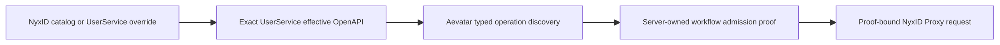
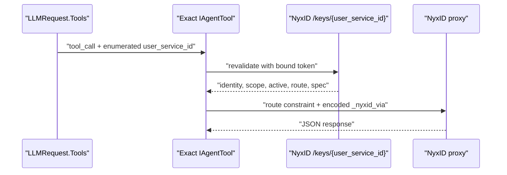

# NyxID Connected-Service LLM Tools

NyxID connected-service 工具以 `user_service_id` 为实例身份。NyxID 是 catalog service、exact UserService 及其 effective OpenAPI 的唯一权威 owner；Aevatar 在请求期从 NyxID `/keys` live surface 读取调用者可见的实例，并只通过 `GET /api/v1/proxy/services/{user_service_id}/openapi.json` 读取该 exact UserService 的有效契约。Aevatar 不托管 OpenAPI、不保存 service/endpoint 影子目录、不从 slug 猜实例，也不在 prompt 里另建权限目录。

模型看到的最终 tool schema 与实际执行对象来自同一份 `LLMRequest.Tools`。工具调用仍经 NyxID proxy 下发；凭证注入、proxy/broker 审计、node routing 和 delegation 由 NyxID 负责。Aevatar 负责本地动态工具审批以及 workflow proof 中明确归 Aevatar 的审批，记录平台 tool invocation 与 typed receipt 审计。

## 1. 实例发现与身份

发现分别使用当前请求的 user token 和可用的 organization token 调用 `/api/v1/keys`。每条可用实例被建模为 Protobuf `NyxIdServiceInstance`，至少保留：

- exact `user_service_id`；
- credential source 与实际 access-token source；
- active、credential-allowed 状态；
- catalog service ID 或 custom service slug 组成的单一 route constraint；
- 从 `openapi_url` 提取的 proxy spec service ID、endpoint 和 node 绑定事实；当前 NyxID `/keys` wire contract 中，proxy spec service ID 是 exact `user_service_id`，不等于 catalog route ID。

同一个 `user_service_id` 若在 user/org 结果中指向不同权限、token 或路由事实，该身份整项删除。inactive 或 credential forbidden 的实例不会进入工具；缺 spec 身份的 active 连接仍可进入只读 inventory，但不会进入 update、route、delete、request 或动态 operation 工具。不同 `user_service_id` 即使显示 slug 相同也保持为不同实例，不合并、不按前缀或相等关系推断。

## 2. 固定工具与 operation 工具

每次成功发现至少生成以下五个窄工具，参数和结果由 `nyxid_service_tools.proto` 定义：

| 工具 | 语义 | 审批 |
|---|---|---|
| `nyxid_service_inventory` | 列出或查看本次请求已冻结的 exact 实例 | 只读，不审批 |
| `nyxid_service_update` | 更新一个 exact 实例的 label、endpoint、OpenAPI override 或 active 状态 | 必须审批 |
| `nyxid_service_route` | 把一个 exact 实例设为 direct 或指定 node | 必须审批 |
| `nyxid_service_delete` | 删除一个 exact 实例 | destructive，必须审批 |
| `nyxid_service_request` | 通过一个 exact 实例调用 JSON endpoint | safe method 不审批，写方法审批 |

每个需要选实例的 schema 都把 `user_service_id` 收紧为当前 request-local 实例枚举。inventory 允许省略 ID 以列出全部实例；其他固定工具必须提供枚举中的 exact ID。变更、删除和请求返回 typed Protobuf result，NyxID 原始响应只放在 `response_json`，不承担内部控制语义。

`nyxid_service_update.openapi_spec_url` 是 approval-gated 的 A′ 更新选项，复用 NyxID 已发布的 exact UserService update wire：省略字段表示保持不变，非空字符串设置 UserService override，空字符串 `""` 清除 override。这个选项不改变 connected-service create/provisioning；创建仍只提交既有的 service slug、credential 与 label，不由 Aevatar 托管或自动注入 spec URL。设置或清除后的 effective contract 仍由 NyxID exact UserService endpoint 解释和发布。

OpenAPI 中通过 `x-aevatar-tool` 准入的 operation 还会生成 `nyxid_service_operation__{name|operationId}` 工具。名称不嵌入 slug 或实例 ID；contract 与 route constraint 完全相同的多个实例共用一个 operation tool，并在 schema 的 `user_service_id` 枚举中显式选择。相同工具名若出现不同 contract、不同 route constraint 或同 ID 不同对象，整名删除，而不是保留任一候选。

## 3. OpenAPI 准入

有效契约遵循一条权威链：



Workflow admission 只读 exact UserService effective contract。无 contract、读取失败、无权访问、文档无效或 contract drift 都 fail closed，并返回 typed blocker/remediation；不存在 Aevatar contract pack、catalog contract fallback、本地 OpenAPI cache 或 runtime/query-time side read。

同一个 `x-aevatar-tool` marker 被三个彼此独立的策略消费，不能把其中一个策略的通过当成另两个策略的授权：

1. **Dynamic exposure**：marker 只决定 operation 是否能进入 request-local LLM tool catalog。缺 marker 默认不暴露，operation-level `false` 覆盖 service-level `true`。
2. **Workflow definition admission**：作者只提交 `user_service_id + operation_id` selector；live admission 重新读取 exact contract，并由 definition actor 提交 call-site scoped v3 proof。marker 通过只是 admission 条件之一，不是 runtime authorization。
3. **Runtime authorization**：managed workflow 的 raw `nyxid_proxy` 只接受当前 call site 的 actor-owned proof。普通 non-workflow human session 的 raw proxy surface 不因 workflow policy 获得或失去权限。

注册是 allow-list：没有标记的 operation 不会成为工具。标记可写在文档根、`info` 或单个 operation 上：

```yaml
x-aevatar-tool: true

paths:
  /orders/search:
    post:
      operationId: search_orders
      summary: Search orders
      x-aevatar-tool:
        enabled: true
        name: search_orders
        readOnly: false
        destructive: false
        approval: always
```

准入规则默认拒绝：operation `enabled: false` 始终排除；operation `enabled: true` 始终准入；没有 operation 标记时才继承 service 级 `enabled: true`。标记只能收紧方法推导出的安全属性：`GET`/`HEAD`/`OPTIONS` 才可只读，写方法和 destructive operation 必须审批，标记不能把它们降成免审批。Workflow operation identity 必须来自文档中显式且全局唯一、大小写敏感的 `operationId`；缺失或重复时整份 admission fail closed，不生成 method/path fallback，也不任选一个重复候选。

OpenAPI 参数通过结构化解析生成 JSON Schema：path/query/header 参数成为顶层属性，path 参数恒为 required；JSON request body 使用 `body`，冲突时使用 `request_body`；本地 `$ref` 会做带环保护的内联。operation tool 只接受其 spec 声明的参数，并额外要求 exact `user_service_id`。

## 4. 执行与重验



每次 update、route、delete、request 或 operation 执行，都先用发现时绑定的 token 调用 exact `/keys/{user_service_id}`。当前记录必须与冻结记录在 identity、credential/token source、credential-allowed、catalog/slug、endpoint、`node_id`、route constraint 和 proxy spec 上一致，而且仍为 active；否则在副作用前 fail closed。

Managed workflow proof 还携带 typed `risk / approval / enforcement_owner / allowed_execution_modes`。GET/HEAD/OPTIONS 默认是 read-only；POST/PUT/PATCH 是 write；DELETE 或 destructive marker 是 destructive。仓库内从 OpenAPI 派生的 write/destructive operation 必须由 Aevatar 审批，且首版只允许 interactive execution；read-only operation 可允许 interactive 与 durable。任意第三方 OpenAPI marker 不能把 enforcement owner 改为 NyxID。typed policy 进入现有 contract/admission digest，policy drift 必须重新 admission/rebind，不新增第二个 digest。

`NyxIdProxyTool` 是共享 runtime enforcement boundary。`Aevatar:NyxId:ManagedWorkflowAdmissionMode=Enforce` 时，managed workflow 缺 proof 或携带无效 policy 会在 token 解析、exact-service read、file ingress 和 proxy HTTP 前返回 `NYXID_OPERATION_ADMISSION_REQUIRED`；`Shadow` 只记录同一 decision 并继续 legacy path。proof 存在时，method/path/schema 仍完全由 `NyxIdOperationRequestBuilder` 从 proof 构造，调用参数不能覆盖 route facts。

proxy 请求只接受相对路径，拒绝绝对 URL、fragment、query-in-path 和 dot segment。路由只来自冻结并重验后的 catalog ID 或 custom slug；Aevatar 追加 URL 编码后的 `_nyxid_via={user_service_id}`，调用参数不得提供任何 `_nyxid_*` query。header allow-list 仅含 JSON `Accept`/`Content-Type` 与条件头 `If-Match`/`If-None-Match`，禁止调用者注入 authorization、routing 或 hop-by-hop header。非 safe method 由客户端生成 typed idempotency key。

## 5. 请求期能力边界

完整动态工具集位于独立 tool set `nyxid.connected_services`（`ToolSetNames.NyxIdConnectedServices`）。其中 update、route、delete、request 与 OpenAPI operation 工具默认不并入通用 chat surface，chat route policy 必须显式引用该 tool set 或包含它的组合 tool set。

内建 Studio role 显式声明 `tool_sets: [nyxid.connected_services]`，但不再把 raw `nyxid_proxy` 放进 `allowed_tools`。每个 Studio LLM turn 都在当前 caller token 与 typed tool context 下重新 resolve/discover，并把结果放入该请求自己的 `AgentProfileTurnCatalog`；动态名称只并入本次 turn 的 visibility ceiling。unknown set、discovery failure 或重复名称 collision 对该请求 fail closed，只记录有界 count，不写 actor/global catalog，也不跨 caller 缓存。Workflow authoring 仍使用 structured selector/readiness；内部 `tool_call -> nyxid_proxy` 只是 proof-bound runtime adapter。

只读 `nyxid_service_inventory` 由 `ChannelNyxIdConnectedServiceInventoryToolSource` 显式挂入 channel reply generator。tool discovery 只暴露无参数、list-only 的 request-local 工具，不签发 capability，也不访问 NyxID；因为此时还没有 `/keys` 结果，schema 不得接受未枚举的 `user_service_id`。只有模型实际执行工具时，source 才组合底层 `NyxIdConnectedServiceInventoryToolSource`：存在已验证的 sender runtime token 时复用；否则根据 typed `ExternalSubjectRef + bindingId` 通过 `INyxIdConnectedServiceInventoryCapabilityIssuer` 当场签发 inventory capability，再以 current sender 身份读取 `GET /api/v1/keys`。inventory capability 只证明绑定账号可以读取自己的 connected-service inventory，不证明该 binding 已覆盖 Aevatar LLM route、Ornn、Sandbox 等全部 runtime resources；后者仍由严格 `INyxIdCapabilityBroker` 独立校验。不得用 bot owner token 代替 sender inventory authority，也不得缓存 bearer 或用户事实。

明确询问“我在 NyxID 上已连接/可用哪些服务”的自然语言 channel 文本走唯一的 AgentRun 主链：`LlmReplyRequested -> AgentRun -> ChatStreamAsync -> use_skill(skill="nyxid") -> nyxid_service_inventory -> sender GET /api/v1/keys -> streamed model answer -> CardKit create/stream/finalize`。`use_skill` 读取远端 NyxID 语义时使用独立的 `INyxIdSkillCapabilityIssuer`；inventory read 使用 `INyxIdConnectedServiceInventoryCapabilityIssuer`，两者都是 request-local 窄能力，不能互相冒充。省略 `mount_workflows` 或传 `false` 的 `use_skill` 是只读加载；只有显式 `mount_workflows=true` 才可能写 workflow。

该自然语言路径不得引入 phrase matcher、固定 renderer、direct query adapter、`code_execute` 或 sandbox CLI，也不得运行 `nyxid service list`。成功、空清单和查询失败都必须保持 binding 语义诚实：inventory read 失败只能表达临时读取失败，不能据此宣称未绑定或无条件建议 `/init`；只有 typed binding 明确缺失或撤销时才可引导 `/init`。

它不注册到全局 `IAgentToolSource` 集合，也不并入 `workspace.default`，避免污染 actor/voice 工具面，或与显式 `nyxid.connected_services` tool set 中的同名 inventory 发生对象身份碰撞。它与完整 tool set 使用同一 `/keys` live surface 和 typed result；完整 tool set 在 discovery 后可通过 schema 枚举 exact `user_service_id`，channel list-only wrapper 则不接受调用者手写 ID。inventory 查询不以 OpenAPI spec 是否可用作为“已连接”判据，并在连接清单为空时返回空的 typed result；动态 operation 工具仍要求有效 proxy spec。

`ToolSetResponsesToolProvider` 通过 `AgentToolContextScope` 提供当前请求的 typed token context，`NyxIdConnectedServiceToolSource` 在该作用域内 live 发现。未配置 NyxID base URL、没有 user token、发现失败或身份冲突时，不暴露相关工具。发现结果随 profile turn catalog 和最终 `LLMRequest.Tools` 冻结；执行路径不能再按名称回查 actor-level `ToolManager`。

Voice realtime attach 也遵循同一边界。带 `voice-tool:` credential ref 的 lease 使用 caller-scoped snapshot；不得读写匿名进程级 voice catalog cache。匿名 session 仍可复用 no-token catalog cache，但 caller-token connected-service 工具必须保持 request/lease scoped。

## 6. 审计与架构边界

- NyxID 是实例、credential、route 与 exact UserService effective OpenAPI 的唯一真实源；Aevatar 不维护 process-local catalog、contract pack 或 spec cache。
- Aevatar 不新增 NyxID endpoint，不绕过 proxy 直连下游，不引入第二条投影或 read model。
- 外部 JSON 只在 NyxID adapter 边界解析；内部实例、请求与结果语义使用 Protobuf。
- 平台审计只由 canonical `ToolExecutionAuditMiddleware` 消费 typed execution context、credential source 和 receipt；默认不记录完整 arguments、result 或 `receipt.result_json`。
- admission decision counter 是 `aevatar.nyxid.proxy.admission.decisions`（Meter `Aevatar.AI.ToolProviders.NyxId`）。唯一 tags 为 `aevatar.nyxid.admission.mode`、`managed`、`proof_present`、`invocation_surface`、`risk`、`would_approve`、`would_block`；值域分别是有界 enum/bool，不得追加 token、body、header、path、user/service ID 或用户内容。
- prompt-prefetch、API hint、slug-bound proxy 和独立 connected-service spec cache 已从主链删除；prompt 不能替代最终 tool schema 做能力判断。

## 7. `QuotaLedger` profile

`QuotaLedger` 不是 Aevatar 内部账本，而是一个外部 REST service profile，契约见 [approval-quota-ledger.openapi.yaml](../contracts/approval-quota-ledger.openapi.yaml)，权威口径见 [approval-quota-ledger.md](approval-quota-ledger.md)。

注册时把该 OpenAPI spec 挂到现有 NyxID service 上。Aevatar 通过 live discovery 读取 spec，并以 exact `user_service_id` 经 NyxID proxy 调用 `GET /balances`、`POST /balances/reserve`、`POST /balances/deduct` 和 `POST /balances/release`。余额、reservation、deduction transaction 归外部 ledger 或渠道原生账本拥有；Aevatar 只传递强类型字段和稳定 idempotency key。

如果目标渠道已原生维护额度，优先记录渠道 API、scope 和真实 subject probe，再使用渠道原生账本；渠道自动扣减时不得再次调用 `QuotaLedger` deduct。

## 8. 相关代码

- `src/Aevatar.AI.ToolProviders.NyxId/ConnectedServices/nyxid_service_tools.proto`
- `src/Aevatar.AI.ToolProviders.NyxId/ConnectedServices/NyxIdServiceTools.cs`
- `src/Aevatar.AI.ToolProviders.NyxId/ConnectedServices/ConnectedServiceOperationTool.cs`
- `src/Aevatar.AI.ToolProviders.NyxId/ConnectedServices/NyxIdServiceInstanceClient.cs`
- `src/Aevatar.AI.ToolProviders.NyxId/NyxIdConnectedServiceToolSource.cs`
- `src/Aevatar.AI.ToolProviders.NyxId/NyxIdConnectedServiceInventoryToolSource.cs`
- `agents/Aevatar.GAgents.NyxidChat/ChannelNyxIdConnectedServiceInventoryToolSource.cs`
- `agents/Aevatar.GAgents.Channel.Identity.Abstractions/INyxIdConnectedServiceInventoryCapabilityIssuer.cs`
- `src/Aevatar.AI.ToolProviders.NyxId/NyxIdApiClient.cs`
- `src/Aevatar.AI.ToolProviders.ToolSetRegistry/ToolSetNames.cs`
