# NyxID Connected-Service LLM Tools

NyxID 是 exact UserService、credential、route、effective OpenAPI 与 normalized operation catalog 的唯一权威 owner。Aevatar 不托管 OpenAPI、不保存 UserService/endpoint 影子目录、不从 slug 推导实例身份，也不在 prompt 中维护第二份权限目录。

NyxID `GET /api/v1/mcp/config` 是 Aevatar 唯一的 operation descriptor source。`GET /api/v1/keys` 及其 exact instance endpoint 只负责实例 inventory、credential ownership、管理动作与执行前实例重验；Aevatar 不再从 `/keys` 的 `openapi_url` 拉取或解析 raw OpenAPI。

## 1. 实例与 operation 身份

普通 connected-service tool discovery 分别使用当前请求的 user token 和可用 organization token 读取 `/api/v1/keys`。每条可用实例在边界映射为 Protobuf `NyxIdServiceInstance`，保留：

- exact `user_service_id`；
- credential source 与实际 access-token source；
- active、credential-allowed 状态；
- catalog service ID 或 custom service slug 组成的单一 route constraint；
- endpoint 与 node binding facts。

同一个 `user_service_id` 若在 user/org 结果中对应不同 token、credential 或 route facts，该身份整项删除。inactive 或 credential-forbidden 的实例不进入工具。不同 `user_service_id` 即使显示 slug 相同也保持独立，不合并，也不按前缀、字符串相等或 route 位置推断身份。

MCP catalog 中 `is_user_service=true` 的 `service_id` 是 exact UserService identity；`endpoint_id` 是 service-local opaque operation identity。Aevatar selector 始终使用 `user_service_id + endpoint_id`，display name、method、path 与 slug 都不能替代或重建任一 ID。

## 2. Shared MCP catalog adapter

普通 current-turn discovery、workflow authoring/admission 与 proof-bound runtime revalidation 共用 `NyxIdMcpOperationCatalog`。adapter 只接受稳定 contract：

- `contract_version == "1.0"`；
- `catalog_digest` 为 `sha256:<64 lowercase hex>`，并直接作为 NyxID normalized descriptor revision；
- non-empty、unique `service_id` 与 service-local unique `endpoint_id`；
- `is_user_service=true && is_generic_proxy=false`；
- 支持的 method/path、parameter、header、request body 与 JSON Schema 子集；
- typed `response.content_types` 与 tri-state `response.binary_artifact`。

missing/duplicate identity、platform service、generic proxy、cookie、required sensitive/unsupported header、不支持的 body/schema/response 均 fail closed，并生成 bounded typed diagnostics。`binary_artifact=true` 只准入 GET operation；`false` 生成 text response proof；`null` 只允许 text，不被猜测成 file artifact。free-form `response_description` 不参与安全决策。

Aevatar 记录真实 observation time 作为 freshness fact，但不把时间戳或本地 counter 冒充 source revision，也不重新计算一个替代 NyxID `catalog_digest` 的 root revision。endpoint admission digest 只覆盖 Aevatar 实际验证并提交到 proof 的 canonical 字段。adapter 不建立 process-local catalog、token、service 或 endpoint cache。

## 3. 普通 current-turn 工具

成功发现 exact instance 后只生成四个 request-local 管理工具，参数和结果由 `nyxid_service_tools.proto` 定义：

| 工具 | 语义 | 审批 |
|---|---|---|
| `nyxid_service_inventory` | 列出或查看本次请求已冻结的 exact 实例 | 只读，不审批 |
| `nyxid_service_update` | 更新一个 exact 实例的 label、endpoint、OpenAPI override 或 active 状态 | 必须审批 |
| `nyxid_service_route` | 把一个 exact 实例设为 direct 或指定 node | 必须审批 |
| `nyxid_service_delete` | 删除一个 exact 实例 | destructive，必须审批 |

每个需要选实例的 schema 都把 `user_service_id` 收紧为本次 request-local 实例枚举。inventory 允许省略 ID 以列出全部实例；update、route、delete 必须提供枚举中的 exact ID。NyxID 原始 mutation response 只放在 typed result 的 `response_json`，不承担内部控制语义。

`nyxid_service_update.openapi_spec_url` 复用 NyxID 已发布的 exact UserService update wire：省略表示保持不变，非空字符串设置 override，空字符串 `""` 清除 override。设置或清除只改变 NyxID 权威的 effective contract，不让 Aevatar 成为 OpenAPI owner。

NyxID `contract_version=1.0` 尚未发布等价于历史 `x-aevatar-tool` 的 typed current-turn exposure policy。Aevatar 因此 fail closed：不生成 operation tool，也不暴露 arbitrary method/path surface。生产路径不存在 `nyxid_service_request`、`nyxid_service_operation__*` 或 raw OpenAPI parser。workflow admission 通过不能自动扩大普通 turn exposure。

current-turn discovery 仍 request-locally 读取并解析 MCP catalog，以验证 shared adapter 与记录 bounded diagnostics；MCP discovery 不可用时，四个只依赖 `/keys` authority 的管理工具仍可用。`/keys` discovery 本身失败、无 caller token、无有效实例或 identity conflict 时不暴露这些工具。

## 4. Workflow authoring 与 admission

```mermaid
%%{init: {"maxTextSize": 100000, "flowchart": {"useMaxWidth": false, "nodeSpacing": 10, "rankSpacing": 50}, "themeVariables": {"fontSize": "10px"}}}%%
flowchart LR
    A["NyxID GET /api/v1/mcp/config"] --> B["Shared typed adapter"]
    B --> C["Exact service_id + endpoint_id selector"]
    C --> D["Server-owned v4 definition proof"]
    D --> E["Workflow run actor"]
    E --> F["Proof-bound NyxID Proxy request"]
```

Workflow live discovery 使用当前 caller token 读取 MCP catalog，列出 exact non-generic UserService endpoints。作者只持久化 typed selector；definition actor 提交 call-site-scoped v4 proof，其中包含 service slug、endpoint identity、method/path、parameter/body schema、typed response policy、execution policy、source stamp 与 contract digest。

身份边界保持独立：`scope_id`、`owner_scope_id` 与 `owner_subject` 只表达 Aevatar 资源所有权/调用上下文；NyxID caller 只能来自认证 principal 映射出的 typed `NyxIdAuthority`。缺失 authority 时 live discovery/admission fail closed，禁止从 scope、member、workflow、route 或 owner 字符串推导。

Dynamic exposure、workflow definition admission 与 runtime authorization 是三个独立 policy：

1. **Current-turn exposure**：缺 NyxID typed exposure policy，因此 operation 数量为零。
2. **Workflow definition admission**：live MCP catalog 把 exact selector 解析并提交为 actor-owned proof。
3. **Runtime authorization**：managed workflow 只接受当前 call site 的 proof；durable mode 还要求 owner-scoped catalog 对 exact `user_service_id` 的 durable grant。

GET/HEAD/OPTIONS 默认为 read-only；POST/PUT/PATCH 为 write；DELETE 为 destructive。write/destructive operation 必须由 Aevatar 审批并只允许 interactive；read-only operation 可允许 interactive 与 durable。一个 policy 的通过不能冒充另两个 policy 的授权。

## 5. 执行与重验

update、route 与 delete 在 mutation 前使用发现时绑定的 token 读取 exact `/keys/{user_service_id}`。当前 instance 必须与冻结 instance 的 identity、credential/token source、credential allowance、route、endpoint 与 node facts 一致且仍为 active，否则在副作用前 fail closed。

proof-bound runtime 不重新 discovery、prime 或刷新 admission，也不读取 raw OpenAPI。每次 dispatch 只使用本次 caller token 读取同一 MCP config，按 exact `service_id + endpoint_id` 定位 endpoint，并比对 service slug 与 committed endpoint digest：

- service/slug drift 返回 `NYXID_OPERATION_AUTHORITY_DRIFT`；
- endpoint missing 或 contract drift 返回 `NYXID_OPERATION_CONTRACT_DRIFT`；
- 两者都发生在 downstream proxy request 或 file ingress 前。

`NyxIdProxyTool` 是共享 runtime enforcement boundary。`Aevatar:NyxId:ManagedWorkflowAdmissionMode=Enforce` 时，managed workflow 缺 proof 或携带无效 policy 会在 token resolution、exact revalidation、file ingress 和 proxy HTTP 前返回 `NYXID_OPERATION_ADMISSION_REQUIRED`；`Shadow` 只记录相同 decision 并继续 legacy behavior。普通 non-workflow human raw proxy surface 不因 workflow guard 获得或失去权限。

proxy request 只接受 relative path，拒绝 absolute URL、fragment、query-in-path 和 dot segment。route 只来自 proof/frozen exact instance；Aevatar 追加 URL-encoded `_nyxid_via={user_service_id}`，调用参数不得提供 `_nyxid_*` query。caller header 不能注入 authorization、routing、content-type ownership 或 hop-by-hop semantics。非-safe method 使用 typed idempotency key。

## 6. 请求期能力与 channel inventory

完整管理工具集位于 `nyxid.connected_services`（`ToolSetNames.NyxIdConnectedServices`）。Studio 每个 LLM turn 都在当前 caller token 与 typed context 下重新 resolve；结果只进入该请求的 `AgentProfileTurnCatalog` 与最终 `LLMRequest.Tools`。unknown set、discovery failure 或 duplicate name 对本请求 fail closed，不写 actor/global catalog，也不跨 caller 缓存。Workflow operation authoring 使用独立的 structured capability list/readiness tools。

只读 `nyxid_service_inventory` 也可由 `ChannelNyxIdConnectedServiceInventoryToolSource` 显式挂入 channel reply generator。该 wrapper 在模型真正调用时才以 current sender authority 读取 `/api/v1/keys`；不得替换为 bot-owner token、sandbox CLI login 或进程级 cache。自然语言 inventory 走 `AgentRun -> ChatStreamAsync -> use_skill("nyxid") -> nyxid_service_inventory -> sender /keys -> streamed answer`，不引入 phrase matcher、direct query adapter 或 `code_execute`。

## 7. 审计与架构边界

- 外部 JSON 只在 NyxID adapter 边界解析；内部稳定执行语义使用 Protobuf/typed records。
- Aevatar 不新增 NyxID endpoint，不绕过 proxy 直连下游，不保留 raw OpenAPI fallback。
- current-turn MCP logs 只包含 bounded diagnostic code/count，不包含 token、body、header、path、user/service ID 或用户内容。
- platform tool audit 只消费 typed execution context、credential source 与 receipt，默认不记录完整 arguments/result。
- `aevatar.nyxid.proxy.admission.decisions` 只使用 bounded enum/bool tags，不追加 credential 或用户内容。

## 8. `QuotaLedger` profile

`QuotaLedger` 是外部 REST service profile，契约见 [approval-quota-ledger.openapi.yaml](../contracts/approval-quota-ledger.openapi.yaml)，权威口径见 [approval-quota-ledger.md](approval-quota-ledger.md)。它的 operations 可通过 exact MCP selector 进入 workflow admission；普通 current-turn 不因该 OpenAPI 的历史 marker 自动暴露 operation。余额、reservation 与 deduction transaction 始终由外部 ledger 或渠道原生账本拥有。

## 9. 相关代码

- `src/Aevatar.AI.ToolProviders.NyxId/ConnectedServices/NyxIdMcpOperationCatalog.cs`
- `src/Aevatar.AI.ToolProviders.NyxId/ConnectedServices/NyxIdOperationAdmissionProofBuilder.cs`
- `src/Aevatar.AI.ToolProviders.NyxId/ConnectedServices/NyxIdOperationHeaderPolicy.cs`
- `src/Aevatar.AI.ToolProviders.NyxId/ConnectedServices/NyxIdServiceInstanceClient.cs`
- `src/Aevatar.AI.ToolProviders.NyxId/ConnectedServices/NyxIdServiceTools.cs`
- `src/Aevatar.AI.ToolProviders.NyxId/ConnectedServices/nyxid_service_tools.proto`
- `src/Aevatar.AI.ToolProviders.NyxId/NyxIdConnectedServiceToolSource.cs`
- `src/Aevatar.AI.ToolProviders.NyxId/NyxIdExternalWorkflowCapabilitySource.cs`
- `src/Aevatar.AI.ToolProviders.NyxId/Tools/NyxIdProxyTool.cs`
- `src/Aevatar.AI.ToolProviders.NyxId/NyxIdApiClient.cs`
- `agents/Aevatar.GAgents.NyxidChat/ChannelNyxIdConnectedServiceInventoryToolSource.cs`
