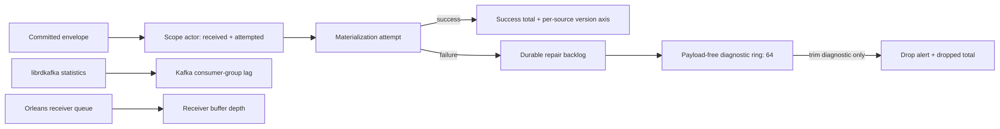

# Aevatar Observability — OTel Semantic Conventions

## 1. 目的

定义 aevatar 仓库内 OpenTelemetry `ActivitySource` 与 `Meter` 发出的 activity、
metric、tag 键、稳定性等级，以及 Host → browser demo 边界的 JSON wire 形式例外。
这是 aevatar 可观测面的唯一权威清单 —— 加新 activity / metric / tag、改名、
提升稳定性，都要先动这份文档再动代码。

## 2. ActivitySources

```
┌────────────────────────────────────────────────────────────────┐
│ Aevatar process                                                │
│                                                                │
│   ┌─────────────────────┐    ┌──────────────────────────┐      │
│   │ Aevatar.Agents      │    │ Aevatar.GenAI            │      │
│   │ (AevatarActivity-   │    │ (GenAIActivitySource)    │      │
│   │  Source)            │    │ — OTel GenAI SemConv     │      │
│   │                     │    │   compliant, unchanged   │      │
│   │ agent lifecycle,    │    │   by ADR 0021            │      │
│   │ event handling,     │    │                          │      │
│   │ projection, readmodel, │ │   gen_ai.* family        │      │
│   │ workflow run        │    │                          │      │
│   └──────────┬──────────┘    └─────────────┬────────────┘      │
│              │                              │                   │
│              └──────────┬───────────────────┘                   │
│                         ▼                                       │
│           OTel pipeline (exporters / samplers)                  │
└────────────────────────────────────────────────────────────────┘
```

- `Aevatar.Agents` —— 仓库自身的 activity 总集。详见 §3 / §4。
- `Aevatar.GenAI` —— LLM 与 Tool 的 trace，符合 OpenTelemetry GenAI
  Semantic Conventions。本文档不重复其规范；引用见 [OTel GenAI SemConv](https://opentelemetry.io/docs/specs/semconv/gen-ai/)。

ActivityListener 消费方过滤：`source.Name == "Aevatar.Agents"`（单源
模式，对应 ADR [0022](../adr/0022-otel-aevatar-semantic-conventions.md)
的决定）。

### 2.1 Runtime terminal-failure metric

`Aevatar.Agents` meter 发出
`aevatar.runtime.envelope_terminal_failures_total` counter。它记录 runtime envelope
已到达 terminal failure，而不是 handler success。该 counter 使用两个低基数 tag：

| Tag | Values | 语义 |
|-----|--------|------|
| `failure_reason` | `handler_retry_exhausted` / `compatibility_retry_exhausted` / `actor_unavailable` / `invalid_envelope` | terminal 原因；不得写 exception message、actor id 或 envelope id |
| `failure_disposition` | `returned` / `propagated` | `returned` 只表示 runtime 的 terminal-failure policy 正常返回；它不表示 Orleans 已调用 `MessagesDeliveredAsync` 或 Kafka offset 已提交。`propagated` 表示异常穿透 observer，persistent provider 应保留 redelivery 能力 |

该 metric 是 retry exhausted、actor unavailable 与 malformed Kafka envelope 的告警入口。
具体 consume → observer → handler → retry → `MessagesDeliveredAsync` → offset commit
语义及 operator recovery 见
[`Aevatar.Foundation.Runtime.Implementations.Orleans/README.md`](../../src/Aevatar.Foundation.Runtime.Implementations.Orleans/README.md#kafka-入站投递与失败语义)。
当前没有通用 durable poison-envelope/DLQ owner；因此默认 terminal failure 使用
`returned`，只有 envelope 显式请求 `PropagateFailure` 时才使用 `propagated`，
避免永久业务错误默认无限阻塞 Kafka partition。

#3145 已删除 runtime process-local envelope filter 及其 DI seam。每次 transport delivery 都进入 authoritative
actor；重复消息是否已完成只能由 actor committed state、稳定 command/operation identity 或外部权威
idempotency contract 判断。`RuntimeEnvelopeDeliveryIdentity` 只解析 typed delivery operation lineage/retry attempt，不记录事实、
不抑制 redelivery，也不提供 durable idempotency 或 exactly-once 保证。

## 3. Activity 清单 (`Aevatar.Agents`)

每条 activity 都标 **stability**（`[experimental]` / `[stable]`），实验
级允许在任一版本里改名 / 改语义 / 删除；稳定级走废弃周期。当前**全部
为 experimental**。

### 3.1 Event handling

#### `HandleEvent:{eventTypeName}` `[stable]`

事件处理器执行。事件 typeName 拼在 activity name 里以方便 Jaeger /
Tempo 中按事件类型 facet。

| Tag | Type | Required | 说明 |
|-----|------|----------|------|
| `aevatar.agent.id` | string | yes | actor id |
| `aevatar.agent.type` | string | yes | `IAgent` 类型名，ADR 0021 新增 `[experimental]` |
| `aevatar.event.id` | string | yes | event id |
| `aevatar.event.type` | string | yes | event type url |
| `aevatar.event.direction` | string | yes | `in` / `out` |
| `aevatar.event.publisher` | string | yes | 发布者 id（如有） |

### 3.2 Actor lifecycle `[experimental]`

#### `aevatar.agent.spawn` `[experimental]`

actor 首次被激活（**不**在 idempotent return 路径上触发）。`LocalActorRuntime`
在 `CreateAsync` 实际新建 actor 之后 emit；命中已存在 actor 直接 return
时不 emit。Orleans 当前实现在 V2 才覆盖（届时在 `OnActivateAsync` emit，
时机与 Local 不同）。

| Tag | Type | Required | 说明 |
|-----|------|----------|------|
| `aevatar.agent.id` | string | yes | actor id |
| `aevatar.agent.type` | string | yes | `IAgent` 类型名 |

#### `aevatar.agent.deactivate` `[experimental]`

actor 销毁（`DestroyAsync`）或通过 `IActorDeactivationHook` 失活。

| Tag | Type | Required | 说明 |
|-----|------|----------|------|
| `aevatar.agent.id` | string | yes | actor id |
| `aevatar.agent.type` | string | no | 类型名（如能拿到） |

#### `aevatar.agent.link` `[experimental]`

`IActorRuntime.LinkAsync(parentId, childId)` 完成时 emit。**parent-child
关系是动态的**：spawn 时**不**附 parent tag；link/unlink 才是权威的拓扑变化点。

| Tag | Type | Required | 说明 |
|-----|------|----------|------|
| `aevatar.agent.parent` | string | yes | parentId |
| `aevatar.agent.id` | string | yes | childId |

#### `aevatar.agent.unlink` `[experimental]`

`IActorRuntime.UnlinkAsync(childId)` 完成时 emit。

| Tag | Type | Required | 说明 |
|-----|------|----------|------|
| `aevatar.agent.parent` | string | yes | parentId |
| `aevatar.agent.id` | string | yes | childId |

### 3.3 Projection materialize `[experimental]`

#### `aevatar.projection.materialize` `[experimental]`

`IProjectionMaterializer<TContext>.ProjectAsync` 的 wrapper。中心装配
点 `src/Aevatar.CQRS.Projection.Core/DependencyInjection/ProjectionMaterializerRegistration.cs`
将所有 projector 自动包入 `ObservedProjectionMaterializer<TContext>` —— 即
新增 projector 默认获得这一 activity，无需业务侧改动。

| Tag | Type | Required | 说明 |
|-----|------|----------|------|
| `aevatar.projection.name` | string | yes | `typeof(TContext).Name` |
| `aevatar.projection.last_event_id` | string | yes | `EventEnvelope.EventId`，进入时设 |
| `aevatar.projection.state.version` | int64 | no | 成功完成后设；失败路径不设 |
| `aevatar.workflow.run_id` | string | no | 若 `context is IWorkflowProjectionContext`，附 |
| `aevatar.workflow.step` | string | no | 同上 |

同一个 wrapper 还会在每个具体 materializer 结束时发出一条结构化 terminal log，
并记录 materializer 级 duration/total。terminal result 只能是
`completed`、`failed`、`cancelled`；只有调用方 token 已取消时
`OperationCanceledException` 才归类为 `cancelled`。日志字段为
`projectionKind / materializerKind / stateVersion / elapsedMs / result`，
失败时另含 `errorType`。`stateVersion` 没有权威 committed-state 来源时必须为
`null`，不得伪造为 0。失败日志不得附带异常对象或异常消息，避免 provider 查询、
连接信息或业务载荷从上层 materializer 日志泄漏。

### 3.4 Readmodel writes `[experimental]`

decorator 装配点：`src/Aevatar.CQRS.Projection.Runtime/DependencyInjection/ServiceCollectionExtensions.cs:11`
（`IProjectionWriteDispatcher<>` open-generic 单点注册），改为先注册
`ObservedProjectionWriteDispatcher<>` wrap `ProjectionStoreDispatcher<>`。

#### `aevatar.readmodel.upsert` `[experimental]`

`IProjectionWriteDispatcher<TReadModel>.UpsertAsync` 包装。

| Tag | Type | Required | 说明 |
|-----|------|----------|------|
| `aevatar.readmodel.name` | string | yes | `typeof(TReadModel).Name` |
| `aevatar.readmodel.state.version` | int64 | yes | 被写入的 state 版本 |

#### `aevatar.readmodel.delete` `[experimental]`

`IProjectionWriteDispatcher<TReadModel>.DeleteAsync` 包装。

| Tag | Type | Required | 说明 |
|-----|------|----------|------|
| `aevatar.readmodel.name` | string | yes | `typeof(TReadModel).Name` |
| `aevatar.readmodel.id` | string | yes | 被删除的 readmodel id |

### 3.5 Workflow run `[experimental]`

#### `aevatar.workflow.run` `[experimental]`

`WorkflowExecutionRunEventProjector`（`src/workflow/Aevatar.Workflow.Presentation.AGUIAdapter/WorkflowExecutionRunEventProjector.cs`）
入口装饰。**不**改动 workflow runtime 的 emit 路径；现有 `WorkflowEvent`
SSE 流维持原状。

| Tag | Type | Required | 说明 |
|-----|------|----------|------|
| `aevatar.workflow.run_id` | string | yes | run id |
| `aevatar.workflow.name` | string | yes | workflow name |
| `aevatar.workflow.step` | string | no | 当前 step（如适用） |

### 3.6 Channel runtime `[experimental]`

Channel runtime spans emit through the canonical `Aevatar.Agents` source via
`ChannelDiagnostics`. They keep the channel RFC span names while using the
documented `aevatar.channel.*` tag family so Host OTel collection and
repository dashboards can join them with the rest of the Aevatar trace surface.
iter85/cluster-085 keeps channel diagnostics on the single canonical source.

#### `channel.pipeline.invoke` `[experimental]`

`TracingMiddleware` wraps one channel pipeline invocation. Downstream channel
middleware and bot-turn spans run inside this span.

| Tag | Type | Required | 说明 |
|-----|------|----------|------|
| `aevatar.channel.activity_id` | string | yes | normalized inbound activity id |
| `aevatar.channel.provider_event_id` | string | no | adapter-provided raw payload identifier |
| `aevatar.channel.canonical_key` | string | yes | `ConversationReference.CanonicalKey` |
| `aevatar.channel.bot_instance_id` | string | yes | bot instance routing dimension |
| `aevatar.channel.id` | string | yes | channel id |
| `aevatar.channel.retry_count` | int64 | yes | retry attempt count |
| `aevatar.channel.raw_payload_blob_ref` | string | no | redacted raw payload blob reference |
| `aevatar.channel.auth_principal` | string | yes | auth principal summary |

The same tag family is used by the other channel RFC spans when those spans are
implemented: `channel.ingress.verify`, `channel.ingress.commit`,
`channel.pipeline.dedup`, `channel.pipeline.resolve`, `channel.bot.turn`,
`channel.egress.send`, `channel.egress.update`, `channel.egress.delete`, and
`channel.egress.commit`. Outbound success spans may also set
`aevatar.channel.sent_activity_id`.

### 3.7 LLM / Tool（由 `Aevatar.GenAI` 拥有，未变）

`invoke_agent` / `chat` / `execute_tool` 等 activity 在 `Aevatar.GenAI`
源，按 [OTel GenAI SemConv](https://opentelemetry.io/docs/specs/semconv/gen-ai/)
约定。本 ADR / 文档**不**修改。

## 4. Tag 完整索引

| Tag key | Source | Stability | Found on |
|---------|--------|-----------|----------|
| `aevatar.agent.id` | `Aevatar.Agents` | stable | HandleEvent, agent.* |
| `aevatar.agent.type` | `Aevatar.Agents` | experimental | HandleEvent, agent.spawn, agent.deactivate |
| `aevatar.agent.parent` | `Aevatar.Agents` | experimental | agent.link, agent.unlink |
| `aevatar.event.id` | `Aevatar.Agents` | stable | HandleEvent |
| `aevatar.event.type` | `Aevatar.Agents` | stable | HandleEvent |
| `aevatar.event.direction` | `Aevatar.Agents` | stable | HandleEvent |
| `aevatar.event.publisher` | `Aevatar.Agents` | stable | HandleEvent |
| `failure_reason` | `Aevatar.Agents` metric | experimental | `aevatar.runtime.envelope_terminal_failures_total` |
| `failure_disposition` | `Aevatar.Agents` metric | experimental | `aevatar.runtime.envelope_terminal_failures_total` |
| `aevatar.projection.name` | `Aevatar.Agents` | experimental | projection.materialize |
| `aevatar.projection.last_event_id` | `Aevatar.Agents` | experimental | projection.materialize |
| `aevatar.projection.state.version` | `Aevatar.Agents` | experimental | projection.materialize (success) |
| `aevatar.readmodel.name` | `Aevatar.Agents` | experimental | readmodel.upsert, readmodel.delete |
| `aevatar.readmodel.state.version` | `Aevatar.Agents` | experimental | readmodel.upsert |
| `aevatar.readmodel.id` | `Aevatar.Agents` | experimental | readmodel.delete |
| `aevatar.workflow.run_id` | `Aevatar.Agents` | experimental | workflow.run, projection.materialize (workflow context) |
| `aevatar.workflow.name` | `Aevatar.Agents` | experimental | workflow.run |
| `aevatar.workflow.step` | `Aevatar.Agents` | experimental | workflow.run, projection.materialize (workflow context) |
| `aevatar.channel.activity_id` | `Aevatar.Agents` | experimental | channel.* |
| `aevatar.channel.provider_event_id` | `Aevatar.Agents` | experimental | channel.ingress.*, channel.pipeline.invoke |
| `aevatar.channel.canonical_key` | `Aevatar.Agents` | experimental | channel.* |
| `aevatar.channel.bot_instance_id` | `Aevatar.Agents` | experimental | channel.* |
| `aevatar.channel.id` | `Aevatar.Agents` | experimental | channel.* |
| `aevatar.channel.sent_activity_id` | `Aevatar.Agents` | experimental | channel.egress.* |
| `aevatar.channel.retry_count` | `Aevatar.Agents` | experimental | channel.ingress.*, channel.egress.*, channel.pipeline.invoke |
| `aevatar.channel.raw_payload_blob_ref` | `Aevatar.Agents` | experimental | channel.ingress.*, channel.pipeline.invoke |
| `aevatar.channel.auth_principal` | `Aevatar.Agents` | experimental | channel.egress.*, channel.pipeline.invoke |

## 5. 稳定性策略

```
[experimental]  ←—  introduction default
     │
     │   (a) 经过两个 release 周期无破坏性改动
     │   (b) 至少一个外部 consumer 已验证（dashboard / alert）
     │   (c) 命名经过 ADR 评审
     ▼
[stable]        ←—  ADR 升级。废弃需经 deprecation 周期：
     │             1) ADR 标 `deprecated`
     │             2) 一个 release 内并发 emit 新旧 key
     │             3) 下一个 major 移除旧 key
     ▼
[deprecated] → [removed]
```

- 实验级 key 可在任一 release 改名 / 删除；外部 consumer 自担风险。
- 稳定级 key 走废弃周期；orphaned dashboard 有时间迁移。

## 6. Sampling 与 emission 行为

- 生产部署的 sampler 由部署侧决定；本文档不强制。建议生产用
  `ParentBased(TraceIdRatioBased)`，开发用 `AlwaysOn`。
- 本地 Inspector-style consumer（详见 ADR
  [0023](../adr/0023-two-tier-inspector-architecture.md)）可在注册时显式覆盖为
  `AlwaysOn`，仅本地生效。
- Activity emit **必须 infallible**：tag set 失败 / listener 抛错 **不**
  传播到业务路径。`AevatarActivitySource` 的 helper 方法内置 try/catch
  swallow。

## 7. Helper API

仓库内禁止散落的 `activity?.SetTag(...)` 链。所有新 activity 通过
`AevatarActivitySource` 的 typed factory 创建：

```csharp
public static class AevatarActivitySource
{
    // (existing)
    public static Activity? StartHandleEvent(string agentId, string agentType, string eventId, ...);

    // (new — ADR 0021)
    public static Activity? StartAgentSpawn(string agentId, string agentType);
    public static Activity? StartAgentDeactivate(string agentId, string? agentType = null);
    public static Activity? StartAgentLink(string parentId, string childId);
    public static Activity? StartAgentUnlink(string parentId, string childId);
    public static Activity? StartProjectionMaterialize(string projectionName, string lastEventId);
    public static Activity? StartReadmodelUpsert(string readmodelName, long stateVersion);
    public static Activity? StartReadmodelDelete(string readmodelName, string id);
    public static Activity? StartWorkflowRun(string runId, string workflowName, string? step = null);
}
```

每个 callsite 一行。decorator 内的 post-call tag（如
`aevatar.projection.state.version`）通过 `activity?.SetTag(...)`
显式设，包 try/catch swallow（参见 ADR 0021 §"Consequences"）。
Channel runtime may use its domain-local `ChannelDiagnostics` facade, but that
facade must alias `AevatarActivitySource.Source` and only expose tag keys from
the `aevatar.channel.*` family listed above.

## 8. 消费者：ActivityListener pattern

Inspector-style 本地 consumer 的最小消费实现：

```csharp
var listener = new ActivityListener
{
    ShouldListenTo = src => src.Name == "Aevatar.Agents",
    Sample = (ref ActivityCreationOptions<ActivityContext> _) =>
        ActivitySamplingResult.AllDataAndRecorded,  // local override, AlwaysOn
    ActivityStarted = activity =>
    {
        // 转换为 TelemetryFrame，写入 BoundedChannel
        var frame = TelemetryFrame.FromActivity(activity);
        _channel.Writer.TryWrite(frame);  // drop-oldest when full
    },
};
ActivitySource.AddActivityListener(listener);
```

Channel policy（ADR [0023](../adr/0023-two-tier-inspector-architecture.md)
强制）：

```csharp
Channel.CreateBounded<TelemetryFrame>(new BoundedChannelOptions(1000)
{
    FullMode = BoundedChannelFullMode.DropOldest,
    SingleReader = false,
    SingleWriter = false,
});
```

drop-oldest 保证：listener 永不反压回业务路径；channel 满时丢最旧帧。

## 9. Host → browser JSON wire-format 例外

CLAUDE.md "Protobuf 优先" 适用于：
- actor ↔ actor 内部传输
- 跨节点 RPC 内部传输
- actor 持久态、event store、readmodel doc 等仓库内部存储

**例外**：Host → browser demo 边界（例如 Inspector REST / SSE endpoint
对前端 React 的传输）允许 JSON。具体规则：

- Tier 1 REST：readmodel `state_root`（Protobuf `Any`）在 host 端用
  `Google.Protobuf.JsonFormatter` 反包成 typed JSON（或复用 Studio.Projection
  内现有 helper —— Phase A.3 调研确认）。
- Tier 2 SSE：`TelemetryFrame` 序列化为 JSON event payload。
- 此例外仅适用 demo 边界；任何其他出现 JSON 的内部跨 actor / 跨节点路径
  仍属违规，应转 Protobuf。

## 10. 与 Workflow Studio 的关系

Workflow Studio（`demos/Aevatar.Demos.Workflow.Web`）走原 `WorkflowEvent`
SSE 通道，由 `WorkflowExecutionRunEventProjector` 派发。本文档新增的
`aevatar.workflow.run` activity **不替代**这条流；它是 OTel 侧的 trace
装饰，给 Inspector / Jaeger / Tempo 用，**emit 路径不分叉**。

| 消费者 | 通道 | 数据形式 |
|--------|------|----------|
| Workflow Studio (yaml editor + run viewer) | 原 `WorkflowEvent` SSE | `WorkflowRunEventEnvelope` proto（JSON 仅在 wire boundary） |
| Inspector-style live actor system viz | OTel `Aevatar.Agents` activities | OTel activity + tags（observation） |
| 外部 trace stack (Jaeger / Tempo) | OTel exporter | OTel spans |

三个消费者读同一份 committed 事实源（workflow committed events），
**emit 路径不 fanout**。Workflow Studio 不需要改动。

## 11. CI 守护

- `tools/ci/inspector_tier_boundary_guard.sh`（ADR
  [0023](../adr/0023-two-tier-inspector-architecture.md) 引入）：扫描
  `demos/Aevatar.Demos.Inspector*`，禁止任何 `/api/inspector/*`
  endpoint 读 `Channel<TelemetryFrame>` 或返回历史 telemetry 列表。
- `tools/ci/projection_state_version_guard.sh`：现有 guard，wrap
  decorator 落地后不应触发新违规（decorator 只加 observation，不改
  projection 语义）。
- `tools/ci/architecture_guards.sh`：主入口，运行上述两条 + 其他。

## 12. Projection 与 Kafka metrics

Projection processing 与 transport backlog 是两个独立观测域。Projection scope actor
持久化处理事实与 repair backlog；Meter 只观察这些事实，不触发 actor lifecycle、
projection priming、query replay 或额外业务状态变更。Kafka lag 只来自
`librdkafka` statistics 的 `consumer_lag`，不得从 projection version 推导。



### 12.1 Projection processing state

`ProjectionScopeStatusDocument` 是 actor-scoped current-state readmodel，公开以下稳定
查询语义：

- `received_envelope_total`：从 observation 主链收到的 envelope 数；repair replay
  不是新 receipt。
- `attempted_envelope_total`：通过 successful-version fence 后实际尝试物化的次数，
  包含 replay。
- `successful_materialization_total`、`failed_attempt_total`：分别表示成功与失败尝试的
  累计次数。
- `retry_exhausted_total`：failure 首次达到 retry limit 的累计历史次数；repair 成功后
  不递减，因此不得用于判断当前健康。
- `retry_exhausted_failure_count`：当前 durable repair backlog 中已经耗尽自动重试的
  failure 数；健康、告警与排序使用该字段。
- `unresolved_failure_count`、`oldest_unresolved_failure_at_utc`：durable operator
  repair backlog 的数量与最旧发生时间。每条 failure 及其 payload-free diagnostic
  都保留权威 `source_actor_id`；较新版本成功不会消除较旧 failure hole。
- `failure_diagnostic_dropped_total`：64 条 payload-free diagnostic ring 被裁剪的累计数。
  第 65 条 failure 只裁剪 diagnostic 副本；durable repair record 不裁剪，并通过
  `IProjectionFailureAlertSink` 发出包含 dropped failure identity 的专项 signal。
- `in_flight_source`：scope actor 当前已持久化、尚待完成的串行 observation 坐标，
  由 `source_actor_id + state_version + event_id` 唯一标识。`null` 只表示当前没有 staged
  durable source，不表示投影已追平；成功水位仍以 `source_versions` 为准。
- `source_versions`：按 authoritative `source_actor_id` 分组的
  `highest_seen_version / last_successful_version / version_gap`。版本差只允许在同一个
  source actor 轴内计算。多 actor scope 不提供聚合 version subtraction。

Observatory list API 仅在 scope 恰好有一个 source actor 时返回
`singleSourceVersionGap`；否则返回 `null`。跨 scope 健康度与排序使用 unresolved
failure、当前 `retryExhaustedFailureCount`、处理计数和 oldest age，不把 `null`
伪装成 0，也不使用累计 `retryExhaustedTotal` 表示当前异常。

### 12.2 Meter 清单

`Aevatar.CQRS.Projection`：

| Instrument | Type | Unit | Allowed labels |
|------------|------|------|----------------|
| `aevatar.projection.envelope.received` | Counter | count | `projection.kind`, `event.kind` |
| `aevatar.projection.envelope.attempted` | Counter | count | `projection.kind`, `event.kind` |
| `aevatar.projection.materialization.succeeded` | Counter | count | `projection.kind`, `event.kind` |
| `aevatar.projection.materialization.failed` | Counter | count | `projection.kind`, `event.kind` |
| `aevatar.projection.retry.exhausted` | Counter | count | `projection.kind`, `event.kind` |
| `aevatar.projection.unresolved_failure.change` | UpDownCounter | count | `projection.kind` |
| `aevatar.projection.oldest_unresolved_failure.age` | Histogram | s | `projection.kind` |
| `aevatar.projection.materialization.latency` | Histogram | ms | `projection.kind`, `event.kind` |
| `aevatar.projection.materializer.duration` | Histogram | ms | `projection.kind`, `materializer.kind`, `result` |
| `aevatar.projection.materializer.total` | Counter | count | `projection.kind`, `materializer.kind`, `result` |
| `aevatar.projection.failure_diagnostic.dropped` | Counter | count | `projection.kind` |
| `aevatar.projection.activation.stage.duration` | Histogram | ms | `stage`, `outcome`, `mode` |
| `aevatar.projection.activation.result.total` | Counter | count | `path`, `outcome`, `mode` |

`Aevatar.CQRS.Projection.Providers.Neo4j`：

| Instrument | Type | Unit | Allowed labels |
|------------|------|------|----------------|
| `aevatar.projection.neo4j.write.duration` | Histogram | ms | `provider`, `operation`, `result` |
| `aevatar.projection.neo4j.write.total` | Counter | count | `provider`, `operation`, `result` |

Neo4j `operation` 只能是 `replace_owner_graph / upsert_node / upsert_edge /
delete_node / delete_edge`，`result` 只能是 `completed / failed / cancelled`。
`projectionKind` 可用于 Core materializer 的低基数 tag，但 `stateVersion`、
`scope`、`ownerId`、节点/边 id、`nodeCount`、`edgeCount` 只允许作为结构化
日志字段或 metric value，绝不能成为 tag。graph construction 与
`replace_owner_graph` 日志必须携带同源 `projectionKind / stateVersion`；直接
CRUD 没有该上下文时记录 `null`，不得推断或伪造。

`Aevatar.Kafka.Transport`：

| Instrument | Type | Unit | Allowed labels |
|------------|------|------|----------------|
| `aevatar.kafka.consumer_group.lag` | Gauge | messages | `provider`, `topic`, `partition` |
| `aevatar.kafka.receiver.buffer_depth` | Gauge | messages | `provider`, `topic`, `partition` |
| `aevatar.kafka.receiver.buffer_capacity` | Gauge | messages | `provider`, `topic`, `partition` |
| `aevatar.kafka.receiver.paused_partitions` | Gauge | partitions | `provider`, `topic`, `partition` |
| `aevatar.kafka.receiver.pause_resume` | Counter | operations | `provider`, `topic`, `partition`, `operation` (`pause` / `resume`) |
| `aevatar.kafka.receiver.pause_duration` | Histogram | ms | `provider`, `topic`, `partition` |
| `aevatar.kafka.receiver.buffer_saturations` | Counter | transitions | `provider`, `topic`, `partition` |
| `aevatar.kafka.receiver.consume_errors` | Counter | errors | `provider`, `topic`, `partition` |

当 statistics disabled、provider unavailable、partition 缺失或 `consumer_lag` 无效时，
不 emit Kafka lag sample；这表示 unavailable，而不是 0。receiver buffer depth 与
consumer-group lag 必须使用不同 instrument 和 dashboard panel。

Receiver capacity、high watermark 与 low watermark 是 Host typed options，并满足
`0 < low < high <= capacity`。`buffer_saturations` 只在进入 high-watermark backpressure
时增加，不在每次 paused poll 时重复增加；`pause_duration` 在固定 receiver partition 恢复或
receiver shutdown 时记录。Orleans queue balancer 拥有 `QueueId -> partition` receiver 生命周期；
这里的 consumer 使用手动 `Assign`，不通过 Kafka subscription/rebalance 竞争第二套 ownership。
pause 期间的定期 `Consume(timeout)` 仅用于推进 librdkafka broker/protocol 处理，不宣称 group heartbeat。
这些指标只观察 transport working state，不定义 delivery 完成事实，也不改变
`MessagesDeliveredAsync -> contiguous offset commit` 的 ACK watermark。

### 12.3 Cardinality 与 Host 注册

Metric label 禁止包含 `actorId`、`sessionId`、`commandId`、failure identity、exception
message 或其他业务身份。具体 scope/actor failure identity 只通过 readmodel query、日志、
trace 或 alert payload 获取。Workflow Host 必须注册 `Aevatar.CQRS.Projection` 与
`Aevatar.CQRS.Projection.Providers.Neo4j`、`Aevatar.Kafka.Transport` 三个 Meter，
OTLP exporter 才会采集上述 instrument。Projection/Neo4j duration 使用独立的
`Observability:Metrics:ProjectionLatencyBucketsMs` 配置；默认桶覆盖到 600 秒，
避免已观测到的 10–40 秒样本全部落入 `+Inf` 而无法计算 p50/p90。

`unresolved_failure.change` 只表示当前进程观测到的 backlog 增减，不是跨 actor 激活或
进程重启可恢复的权威 current count。`oldest_unresolved_failure.age` 也只在 backlog 变化时
产生年龄样本。当前 unresolved 数量与最旧发生时间始终读取
`ProjectionScopeStatusDocument`，不得用 Meter 聚合值反向定义事实。

Projection activation labels are deliberately low-cardinality. `stage` is limited to
`authority_lookup / existence_lookup / kind_verification / dispatch_admission / relay_readiness / release_readiness`;
`path` is `warm / cold`; `mode` is `durable / session / unknown`; and `outcome` is limited to
`hit / miss / mismatch / success / failure / cancelled / timeout`. Actor ids, scope ids and projection
kinds must remain log fields and must not be added as activation metric labels.

## 13. 参考

- ADR [0022](../adr/0022-otel-aevatar-semantic-conventions.md) —
  semantic conventions 的决议。
- ADR [0023](../adr/0023-two-tier-inspector-architecture.md) —
  Inspector two-tier 架构。
- ADR [0019](../adr/0019-stable-agent-kind-identity.md) +
  [0020](../adr/0020-actor-state-version-placement.md) —
  actor identity / state version 的上下文（被 spawn / link tag 引用）。
- [OpenTelemetry .NET API — ActivitySource](https://opentelemetry.io/docs/languages/net/instrumentation/)
- [OpenTelemetry GenAI Semantic Conventions](https://opentelemetry.io/docs/specs/semconv/gen-ai/)
- [docs/canon/architecture.md](architecture.md) — 仓库分层与 source 的归属。
- [docs/canon/cqrs-projection.md](cqrs-projection.md) — projection
  pipeline 的现状，被本文档的 materialize / readmodel 段引用。
