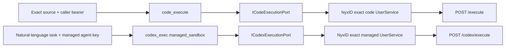

# Sandbox Execution

Aevatar exposes two execution verbs because they represent different user actions. Their
similar output fields do not make them one capability, and callers must select the verb from
the requested work rather than from an implementation detail.

| User intent | Tool and target | Result and approval boundary |
|---|---|---|
| Run an exact source program supplied by the caller | `code_execute` | One-shot remote code runtime; returns stdout, stderr, and exit code. |
| Delegate a natural-language task to an isolated Codex agent | `codex_exec` with `managed_sandbox` | Fixed managed runtime and empty Git workspace; no human approval is required by this target. |
| Delegate a natural-language task to Codex on a real user host | `codex_exec` with `private_ssh` | Uses the selected NyxID-backed host and requires durable human approval. |

## `code_execute`

Use `code_execute` when the caller has already supplied the program to run. The input is exact
Python, JavaScript, TypeScript, or Bash source. The output is the program's stdout, stderr, and
exit code.

The read-only classification describes the isolated runtime's durable-effect boundary. It does
not promise that arbitrary caller-provided code is deterministic, pure, successful, or safe to
run outside that runtime. Do not present it as a natural-language agent delegation surface.

## `codex_exec`

Use `codex_exec` when the caller wants Codex to interpret and carry out a natural-language task.
The target is part of that request:

- `managed_sandbox` runs under the operator-owned fixed isolation and workspace policy. It does
  not request human approval.
- `private_ssh` operates on a real user host using its local Codex configuration. It requires
  durable human approval for the exact tool call.

The tool's static approval mode is fail-closed metadata. The admitted execution path resolves
the effective approval requirement from the selected target; documentation and prompts must not
describe all `codex_exec` calls as approved or approval-free.

## Selection Rules

- Exact source code to execute: choose `code_execute`.
- Natural-language task for an isolated agent: choose `codex_exec.managed_sandbox`.
- Natural-language task that must act on a real host: choose `codex_exec.private_ssh` and obtain
  approval.
- Connected-service inventory or catalog inspection is not an execution task. Use the typed
  NyxID catalog/service-inspection path supplied by the current tool schemas and loaded skill.

The final tool schemas remain the authority for availability in the current turn. Prompt text and
this guide explain selection but do not grant either capability. The managed target's transport,
credential, lifecycle, and failure contracts are defined in
[Managed Codex Execution](managed-codex-execution.md).

## Execution Boundaries

The two verbs share no route identity or credential. A host may point both NyxID services at the
same upstream deployment, but it must resolve two different exact UserService IDs from structured
NyxID contracts.

| Boundary | NyxID service | Required policy | Upstream path | Aevatar credential to NyxID |
|---|---|---|---|---|
| Exact source execution | `chrono-sandbox` | `forward_access_token=false`, `inject_delegation_token=true`, exact scope `sandbox:execute` | `/execute` | Source-readable caller bearer |
| Managed Codex delegation | `chrono-managed-codex` | `forward_access_token=false`, `inject_delegation_token=true`, exact scope `proxy:*` | `/codex/execute` | Operator-managed agent key in `X-API-Key` |

Route selection must not parse connected-service display text, inspect ID prefixes, use substring
matching, assume ID equality, or retry another identity or path. Missing, duplicated, or
policy-mismatched identities fail closed. In particular, `/execute` never falls back to `/run`, and
the managed route never falls back to `chrono-sandbox`.

Both result contracts retain the completed process payload. A non-zero exit is a typed failure and
still carries stdout, stderr or output, exit code, diagnostic ID, and elapsed time into the tool
result and receipt. Failures before a process result exists carry only the typed safe failure.

For managed execution, deadline ownership follows this strict order: the upstream execution budget
is 180 seconds, Aevatar's complete-lifecycle deadline is 300 seconds, the NyxID/ingress deadline is
at least 315 seconds, and the outer workflow budget is 360 seconds. A shorter intermediary timeout
is an infrastructure defect; callers must not reinterpret its gateway response as a Codex terminal
failure.
