# Sandbox Execution Entry Selection

Aevatar exposes two execution verbs because they represent different user actions. Their
similar output fields do not make them one capability, and callers must select the verb from
the requested work rather than from an implementation detail.

| User intent | Tool and target | Result and approval boundary |
|---|---|---|
| Run an exact source program supplied by the caller | `code_execute` | One-shot remote code runtime; returns stdout, stderr, and exit code. |
| Delegate a natural-language task to an isolated Codex agent | `codex_exec` with `managed_sandbox` | Fixed managed runtime and empty Git workspace; no human approval is required by this target. |
| Delegate a natural-language task to Codex on a real user host | `codex_exec` with `private_ssh` | Uses the selected NyxID-backed host and requires durable human approval. |

## `code_execute`

NyxID-routed capabilities keep three ownership contracts separate:

- `PlatformBuiltIn`: the platform owns the capability and route contract while the caller owns
  invocation authority. `code_execute` is in this class.
- `RolloutRestrictedPlatform`: the platform owns the capability, but a typed rollout boundary and
  eligibility policy limit availability. Managed `codex_exec` remains in this class.
- `CallerConnected`: the caller or an allowed organization owns the connected service. Ordinary
  `nyxid_proxy`, explicit workflow capabilities, and LLM routes remain in this class.

Resolvers and eligibility policies are private to their class. In particular, code-execution
catalog and delegation checks must not filter `CallerConnected` inventory or alter managed Codex
rollout eligibility.

Use `code_execute` when the caller has already supplied the program to run. The input is exact
Python, JavaScript, TypeScript, or Bash source. The output is the program's stdout, stderr, and
exit code.

The read-only classification describes the isolated runtime's durable-effect boundary. It does
not promise that arbitrary caller-provided code is deterministic, pure, successful, or safe to
run outside that runtime. Do not present it as a natural-language agent delegation surface.

Route selection is fail closed, but credential provenance is not a capability lifecycle. During
interactive admission, Aevatar reads the caller-visible typed NyxID UserService inventory and
selects an active, catalog-backed route that delivers an execution credential the code runtime
accepts. When both the shared `chrono-sandbox` route and the personal
`chrono-sandbox-aevatar` fallback are eligible, the shared route wins deterministically. An exact
UserService ID already sealed into an admission proof remains authoritative. Multiple eligible
shared routes, or multiple eligible aliases without a shared route, remain ambiguous and fail
closed. A personal route is accessible by ownership; an
organization/member route is accessible only when NyxID reports
`credential_source.allowed=true`. An arbitrary custom UserService with the same slug has no
canonical `catalog_service_id` and cannot shadow the platform route. The resolved exact
UserService ID is sent through `_nyxid_via`; there is no slug fallback or first-candidate
selection.

### Accepted execution credentials

The shared `chrono-sandbox` route must deliver two credentials with different typed purposes:

- `forward_access_token=true` forwards the caller credential as `Authorization`. Channel,
  webhook, and scheduled workflow paths must resolve their Vault-backed NyxID Agent Key at the
  outbound call and keep its credential kind as `AgentKey`; they must not relabel it as
  `ProxyDelegation`. A direct human invocation may still use a source-readable bearer.
- `inject_delegation_token=true` and a whitespace-separated `delegation_token_scope` containing
  both `proxy:*` and `sandbox:execute` makes NyxID add the short-lived
  `X-NyxID-Delegation-Token`. The `sandbox:execute` grant authenticates Chrono's exact execution
  request, while `proxy:*` preserves the managed Codex contract on the same route.

This policy is a conjunction. A route missing any setting or required scope is rejected as
`CODE_EXECUTION_ROUTE_POLICY_MISMATCH`, and the blocker reports only the observed fields that
differ from the required values. Admission
checks scope membership rather than exact string order and preserves unrelated existing scopes.

For an exact forwarded `nyxid_ag_` Agent Key, Chrono validates the separate delegation token for
the request and injects the Agent Key into the isolated program as `NYXID_API_KEY`, together with
`NYXID_BASE_URL`. The short token is not the program's NyxID credential and is not subject to a
five-minute mid-run cliff. An ordinary bearer remains authoritative for direct-human execution and
is never injected into program environment. Caller-authored environment values cannot override
either server-owned NyxID variable.

```mermaid
%%{init: {"maxTextSize": 100000, "flowchart": {"useMaxWidth": false, "nodeSpacing": 10, "rankSpacing": 50}, "themeVariables": {"fontSize": "10px"}}}%%
flowchart LR
    A["Aevatar late-resolves typed AgentKey"] -->|"Authorization"| N["NyxID exact chrono-sandbox route"]
    N -->|"forwarded Agent Key + short delegation"| C["Chrono request boundary"]
    C -->|"verify sandbox:execute delegation"| X["Exact /execute or /executions"]
    X -->|"native env: NYXID_API_KEY + NYXID_BASE_URL"| S["Isolated program"]
    S -->|"long-running caller-scoped NyxID calls"| N
```

Fresh workflow command admission may converge this mismatch without a platform administrator.
`code_execute` owns the typed route contract above; it does not own a second route-management
lifecycle. When authenticated ingress supplies a verified direct human NyxID access token and
there is exactly one active, catalog-backed candidate that token may write, the shared route
convergence boundary updates only that exact UserService to `forward_access_token=true`,
`inject_delegation_token=true`, preserves the observed unique delegation scopes, and appends
`proxy:*` plus `sandbox:execute`. Write authority means either a caller-owned personal route or an organization
route for which the caller is an organization admin. It then rereads NyxID and admits only when
the exact route identity, catalog identity, credential policy, and preserved scopes verify. An
already compliant route remains unchanged.

An allowed organization member/viewer may use an already compatible route but may not change it;
a mismatch remains a typed write-authority blocker. Readiness queries and runtime never write.
Neither proxy delegation, a broker-issued read token, API key, service account, nor relay
credential authorizes this convergence. The write-authority marker is transient ingress evidence:
it is not serialized into a workflow command envelope, admission plan, actor state, or read model.
NyxID UserService updates currently provide no compare-and-swap revision, so this is bounded
best-effort convergence: Aevatar sends the minimal field patch, performs fresh readback, fails
closed on final drift, and does not claim that a concurrent scope edit cannot be overwritten.

A platform auto-connected route (`auto_connected=true`, read only from NyxID `/keys` by exact ID;
`/user-services` does not carry the field) is never mutated: NyxID owns its configuration and
keeps it reconciled with the service's catalog identity. When the only canonical candidate is
such a route and it misses the contract, convergence instead creates the caller's personal alias
(`chrono-sandbox-aevatar`) with the full contract, a readable label, and the platform route's node
binding when NyxID reports one; a conflict response means a concurrent create and admission
re-reads instead of failing. Repair outcomes are classified, not collapsed: a definitive NyxID
client rejection (4xx other than request-timeout or rate-limit) admits with
`CODE_EXECUTION_ROUTE_REPAIR_REJECTED` and a request-access remediation, because retrying the
identical repair cannot succeed — the contract must be granted by the route owner, which for the
shared platform route means the operator updating the NyxID catalog identity that NyxID
propagates to existing routes. Transport failures, upstream 5xx, and readback drift stay
`CODE_EXECUTION_ROUTE_REPAIR_UNVERIFIED` with a retry remediation.

Managed `codex_exec` selects the same exact `chrono-sandbox` UserService ID but calls
`/codex/execute` with its own request credential and eligibility contract. The UserService route
configuration is shared: managed execution requires delegation containing `proxy:*`, while
`code_execute` convergence preserves existing scopes and ensures both `proxy:*` and
`sandbox:execute`. Managed eligibility checks the same two required members and tolerates
unrelated additional scopes. Neither
capability may replace the other's contract or fall back to the other's runtime path.

Interactive NyxID ingress may authorize that admission read with either a source-readable user
bearer or the short-lived proxy delegation token injected for Aevatar when it carries NyxID's
`account:read` grant. This code-execution admission rule is not shared by connected-service
discovery, ordinary `nyxid_proxy`, LLM, or managed Codex paths. Unattended channel, webhook, and
scheduled paths do not substitute such a short token for their Vault-backed Agent Key.

The word "scheduled" in an Aevatar credential purpose describes who owns and reuses the Vault
reference; it does not select NyxID's `scheduled_invocation` API-key security class. The
asynchronous `code_execute` lifecycle requires one `POST /executions` followed by `GET` status and
result requests. NyxID durable-operation grants bind one exact published write operation and
require a grant ID plus operation ID on every request, so they cannot authorize this multi-request
lifecycle. Channel, webhook, and scheduled provisioning must therefore accept only a NyxID create
response with `purpose=general`, `scheduled_write_enabled=false`, and `durable_grants` absent or
empty. Any other or absent class is rejected, and any incompatible key is rolled back before its
secret is persisted. Existing incompatible channel keys require a full registration
rebind because rotation preserves the security class; the narrower "Repair workflow replies"
action cannot perform that conversion. Other incompatible keys must likewise be reissued through
their owning binding flow. Aevatar must not guess durable grant headers or replace the Agent Key
with a five-minute delegation token.

Production drift is checked independently of source conformance. The hourly
`nyxid-code-execution-route-drift.yml` workflow runs
`tools/ops/check_nyxid_code_execution_route.sh` with a dedicated read-only canary identity. Its
fixed API endpoint comes from the `NYXID_ROUTE_DRIFT_API_BASE_URL` repository variable and its
runtime-only bearer comes from the `NYXID_ROUTE_DRIFT_READ_TOKEN` Actions secret; absence of either
is itself a failing, visible check. The probe performs one inventory GET, requires one
catalog-backed shared route, and verifies the ADR-0050 conjunction without logging credentials,
route IDs, owners, or response bodies.

For workflows, `code_execute` is compiled as an external capability with no caller-authored route
selector. Fresh draft-run, save, and bind command admission performs the bounded exact-route
convergence before live readiness when the caller has write authority; standalone readiness
remains read-only. Admission commits
the exact UserService ID, slug snapshot, catalog identity, and contract digest into an
`external-capability-admission.v6` call-site proof. Durable bind/invoke additionally requires the
existing actor-owned NyxID authorization catalog to prove that exact service grant. Interactive
runtime re-reads NyxID facts when it has a source-readable caller credential. If that source read
returns `401 Unauthorized` after admission because the short-lived credential expired during a long
run, runtime may continue only when the valid admission proof seals an exact UserService ID; NyxID
then performs the final live credential and allowlist check on that exact proxy request. A `403`
response or an inventory read that succeeds and explicitly denies the route still fails closed. With
delegation-only interactive ingress, runtime does not read inventory again and may call only the
exact UserService ID sealed in the valid admission proof. Scheduled runtime follows the same
exact-proof rule. Authority-refreshed tokens and short-lived tokens projected through a scheduled
durable handle retain the `ProxyDelegation` kind; restricted scheduled-invocation, channel, and
webhook Agent Keys retain the distinct `AgentKey` kind. These are execution credentials, not
source-readable inventory credentials, so none may auto-resolve a slug.
NyxID then enforces the exact route's slug constraint and credential allowlist on the proxy
request. Without either a source-readable credential or an exact admitted route, execution fails
before network access. Existing v4 plans did not contain code-execution proofs; they remain
supported for source-readable interactive runtime resolution, but delegation-only and scheduled
execution require an exact proof. New live admissions write v6 proofs; v5 requires rebind.

### Durable workflow execution

Workflow `code_execute` uses Chrono Sandbox's asynchronous `/executions` contract so a program can
run longer than the public edge's request timeout without keeping any Aevatar-to-NyxID exchange
open. This changes the workflow transport, not the admitted logical capability: existing call-site
proofs continue to identify the platform-owned `code_execute` operation, while direct chat and
human-session invocations retain the legacy synchronous `/execute` path and remain non-replayable.

The workflow lifecycle is actor-owned:

1. The admitted tool executor creates an opaque `tool:v1:operation:<sha256>` identity. Aevatar sends
   a short `POST /executions` and uses that exact identity as `Idempotency-Key`.
2. Before registering any callback, the workflow actor persists the receipt, provider operation ID,
   exact route identity, ETag, expiry, retry time, callback identity, and a verified protected-material
   reference plus digest. Source, idempotency key, file references, and external invocation details
   stay in the runtime secret store rather than actor state. Raw credentials never enter actor state,
   events, projections, logs, or API responses; Agent Keys remain Vault-backed and are resolved again
   at outbound execution.
3. A typed durable self-callback performs one bounded status request. It sends `If-None-Match` when
   an ETag is known, saves the next callback identity before scheduling it, and never polls with
   `Task.Delay` inside an actor turn.
4. Once status is `succeeded` or `failed`, the actor fetches the result and atomically replaces the
   pending operation with the existing completion outbox entry before publishing workflow
   completion. `cancelled`, `outcome_uncertain`, and definitive non-retryable failures map directly
   to typed terminal outcomes without a result fetch.

Each outbound durable HTTP exchange has a 15-second upper bound. Retry delays are persisted and
capped at 30 seconds, so neither a slow provider nor an unbounded `Retry-After` can turn one actor
callback into another edge-length request.

The typed `code_execute` request always carries `timeout_secs`. Its default is 180 seconds and its
accepted range is 1 through 600 seconds; invalid values fail before network dispatch. Consequently,
the greater-than-125-second canary does not depend on Chrono Sandbox's own omitted-field default.

Every durable exchange goes through the public NyxID proxy rooted at
`Aevatar:NyxId:ApiBaseUrl`. This path never reads `InternalApiBaseUrl` and never uses Aevatar's
internal-to-public fallback. Receipt URL fields are treated as provider metadata: Aevatar builds
status, result, and cancel paths from the validated provider operation ID and the already admitted
NyxID proxy route instead of resolving a provider URL against the NyxID origin.

The reconciliation rules are deliberately narrow:

- `202` persists the receipt; `304` and active statuses reschedule a status read.
- `429` and retryable `503` reschedule the same operation after the bounded retry delay.
- A lost submit response may repeat `POST /executions` only with the same admitted operation key.
  The legacy `/execute` request is never retried.
- `409 IDEMPOTENCY_KEY_REUSE`, `410`, `cancelled`, and `outcome_uncertain` become typed terminal
  outcomes. A result-side `409 OPERATION_NOT_TERMINAL` remains pending.
- Once a provider operation ID is known, `404` is a terminal ownership/unknown-operation failure;
  Aevatar does not submit a replacement execution.

#### Stop cancellation and terminal audit recovery

The first matching external `WorkflowStoppedEvent` or `WorkflowRunStoppedEvent` persists a
two-minute absolute stop-cancellation deadline from the actor's UTC clock. Redelivery for the same
run reuses that `expires_at_unix_ms`; it never restarts or extends the window. Every cancellation
request carries the same absolute `DeadlineUnixMs`, not an ephemeral "already timed out" flag.

The executor rechecks that deadline around the admission ledger, running audit, and provider
boundaries. Once the deadline has elapsed it starts no new admission-ledger or provider operation
and freezes `code_execution_cancel_outcome_uncertain` for audit convergence. If a provider cancel
that was already in flight crosses the deadline and returns a real terminal outcome, that provider
truth wins and is not replaced with uncertainty.

When the provider outcome is terminal but the running or terminal audit cannot yet be written, the
actor keeps the operation and stop intent, freezes a terminal audit intent, and enters the persisted
`FinalizingAudit` phase. Activation and callback redelivery preserve that phase. They replay only
the stable audit append from the frozen intent; they do not call the admission ledger, provider
cancellation, tool classification, or tool receipt factory again.

The frozen intent includes the generic terminal result plus an opaque typed tool-owned `Any`
payload. That payload preserves the normalized full `AgentToolReceipt`, including subject and
provider-resource evidence, together with outcome kind, failure stage, mutation and safety facts,
failure fields, and terminal/retry flags. A frozen intent cannot be replaced by a different intent.
The adapter validates the generic result against the tool-owned payload, and a later completed
result that conflicts with either leaves the operation pending and the stop gated. Only a matching
completed result with `AuditCompleted=true` settles cancellation; an ordinary non-retryable failed
result is not audit proof.

Before the deadline, the next callback is shortened to that absolute boundary. After the deadline,
audit recovery continues with bounded backoff instead of hot-looping or silently abandoning the
intent. A due or overdue cancellation callback uses a minimum positive 1 ms delay because the
durable scheduler rejects zero; an actual scheduler failure falls back to a typed self-continuation.

Audit idempotency compares the durable business fact rather than callback delivery tracing.
`trace_id`, `span_id`, `traceparent`, and `tracestate`, like occurrence and recording timestamps, do
not participate in semantic duplicate comparison. The persisted content hash retains its existing
timestamp-insensitive algorithm for rolling-upgrade compatibility. Request, call, workflow,
approval, correlation, and causation identities still participate in duplicate comparison: a
trace-only retry is a duplicate, while changed business correlation remains a conflict.

Durable provider adapter logs may contain bounded status categories and local diagnostic IDs, but
never source code, bearer tokens, raw idempotency keys, route identities, or UserService IDs.

Production enablement is gated on all four async routes being live through the public NyxID proxy,
the Chrono Sandbox async execution backend being enabled, and NyxID preserving status plus
`Location`, `ETag`, and `Retry-After`. The public canary must prove a program running longer than 125
seconds completes through short submit/status/result exchanges without a `524`, including same-key
submit convergence and cancel behavior.

The current deployment uses Chrono Sandbox's single-replica ephemeral operation store. This is
sufficient to decouple a running execution from the public request timeout, but it is explicitly a
temporary backend: a sandbox process restart loses operations and retained results, and another
replica cannot serve an operation it does not own. Until a persistent shared backend is deployed and
the same canary is repeated across restart and replicas, this integration must not claim provider
crash durability, retained-result durability, or cross-node owner isolation.

#### Production verification (2026-08-17 UTC)

Production acceptance used the committed NyxID, Chrono Sandbox, Aevatar, and Lark read models rather
than client or Bot wording. The Aevatar deployment was Ready on immutable image
`9af2a379680cad37759e0628fae9712b12283e67` (deployment generation 3279, revision 1677, 1/1 updated,
ready, and available), and its public readiness endpoint returned HTTP 200.

The public NyxID route produced the following provider evidence:

- The zero-persistence enablement probe omitted `Idempotency-Key` and sent empty script and language
  fields. It failed before admission or operation creation with HTTP 400 and
  `IDEMPOTENCY_KEY_MISSING`, rather than the disabled-handler `ASYNC_EXECUTION_UNAVAILABLE` response.
- A harmless program slept for 130 seconds with an explicit `timeout_secs=180`. Submit returned a
  queued receipt immediately; repeating the same owner, key, and payload converged on the same
  operation. The terminal result had `success=true`, `exit_code=0`, execution time `131124 ms`, and
  the expected `AEVATAR_DURABLE_GT125_OK` stdout marker. The maximum observed individual
  submit/status/result exchange was 1 second and no exchange returned `524`. The redacted operation
  fingerprint is `sha256:2231f328b39d`.

The separately authorized Lark HR-01 canary then exercised the deployed Aevatar workflow adapter:

- Exactly one trigger delivery was created after the `2026-08-17T17:24:20Z` baseline. It reached
  `delivered` in one attempt; its redacted fingerprint is `sha256:35362f37942c`.
- The unique committed workflow run started at `2026-08-17T17:26:13.8708204Z` and completed at
  `2026-08-17T17:31:24.871508Z` with `status=completed`, `success=true`, state version 724, and
  102/102 requested steps completed. The formerly failing `normalize_person` code-execution step
  succeeded in `8825 ms`. Its typed final output reported complete 65/65 history pagination,
  `failed_reads=0`, `approval_created=true`, `verify_ok=true`, `partial_failure=false`, and a
  `PENDING` approval. The redacted run fingerprint is `sha256:9c6531877445`.
- An independent Lark Approval API read returned that real `PENDING` instance and matched the exact
  synthetic name, Human Resources department, 2026-12-31 onboarding date, and generated email
  prefix. The redacted approval fingerprint is `sha256:043342b4a7c0`.

The greater-than-125-second probe directly verifies the deployed public provider contract; HR-01
separately verifies that the deployed Aevatar durable adapter reaches a committed terminal workflow
and externally committed approval. It does not claim that this particular HR run executed a
greater-than-125-second program, nor does either result change the ephemeral restart and replica
limitations above. The database-free single-replica rollout is tracked in
[Chrono Sandbox issue 11](https://github.com/ChronoAIProject/chrono-sandbox/issues/11); persistent
shared-backend replacement is tracked separately in
[issue 12](https://github.com/ChronoAIProject/chrono-sandbox/issues/12).

The selector and accepted credential contract are private to the platform `code_execute` route.
They do not filter connected services, `nyxid_proxy`, explicit external-capability selections, LLM
routes, or managed `codex_exec`. Other capabilities may use the same generic convergence mechanism
only by declaring their own typed route contract; they cannot inherit `sandbox:execute` or this
route's preferred credential delivery settings.

Route diagnostics distinguish `code_execution_route_missing`, `code_execution_route_inactive`,
`code_execution_route_policy_mismatch`, `code_execution_route_ambiguous`, and
`code_execution_route_access_denied`. Each runtime rejection carries a local diagnostic ID. Logs
contain only that ID, the reason category, and canonical, accessible, active, and eligible candidate
counts; they do not contain bearer tokens, source code, or the raw inventory.

## `codex_exec`

Use `codex_exec` when the caller wants Codex to interpret and carry out a natural-language task.
The target is part of that request:

- `managed_sandbox` runs under the operator-owned fixed isolation and workspace policy. It does
  not request human approval.
- `private_ssh` operates on a real user host using its local Codex configuration. It requires
  durable human approval for the exact tool call.

The tool's static approval mode is fail-closed metadata. The admitted execution path resolves
the effective approval requirement from the selected target; documentation and prompts must not
describe all `codex_exec` calls as approved or approval-free.

## Selection Rules

- Exact source code to execute: choose `code_execute`.
- Natural-language task for an isolated agent: choose `codex_exec.managed_sandbox`.
- Natural-language task that must act on a real host: choose `codex_exec.private_ssh` and obtain
  approval.
- Connected-service inventory or catalog inspection is not an execution task. Load the current
  discovery skill and use the typed NyxID catalog/service-inspection capability because it
  establishes sender-specific service facts; execution tools do not.

Do not choose between these tools from an approval label, service identity, or similar output
fields. Choose from the user's input and intended execution location. The final tool schemas remain
the authority for availability in the current turn; prompt text and this guide explain selection
but do not grant either capability or alter its runtime policy.
