# Aevatar /status 状态面板架构

## 1. 目的

本文定义 Mainnet Host 的 `/status` 状态面板架构与实现边界。

核心口径：

1. `/status` 是展示面，只返回静态 HTML。
2. `/api/status` 是查询面，只读取已经物化的 `HealthProbeTargetDocument`。
3. 探针执行由 `HealthProbeTargetGAgent` 按 target 独立运行，不在 HTTP 请求路径里现场执行。
4. 探针结果通过 actor domain event 与 Projection Pipeline 物化成 readmodel。
5. 这套机制用于持续可用性探测与诊断，不替代 CI 中的行为回归测试。

## 2. 模块位置

| 模块 | 路径 | 职责 |
|---|---|---|
| Host endpoint | `src/Aevatar.Mainnet.Host.Api/Status/StatusEndpoints.cs` | 暴露 `/status` 与 `/api/status` |
| HTML dashboard | `src/Aevatar.Mainnet.Host.Api/Status/StatusHtml.cs` | 自包含页面，轮询 `/api/status` 渲染状态 |
| Host composition | `src/Aevatar.Mainnet.Host.Api/Hosting/MainnetHostBuilderExtensions.cs` | 注册 `AddStatusDashboard` 与 host 侧 freshness source |
| StatusDashboard agent module | `agents/Aevatar.GAgents.StatusDashboard/` | 探针 actor、执行器、投影、查询端口 |
| Proto contract | `agents/Aevatar.GAgents.StatusDashboard/protos/status_dashboard.proto` | target descriptor、state、event、readmodel 契约 |
| Channel freshness source | `src/Aevatar.Mainnet.Host.Api/Status/ChannelBotRegistrationFreshnessSource.cs` | 将 channel-bot registration readmodel 暴露为 freshness source |

## 3. 总体链路

```mermaid
%%{init: {"maxTextSize": 100000, "flowchart": {"useMaxWidth": false, "nodeSpacing": 10, "rankSpacing": 50}, "themeVariables": {"fontSize": "10px"}}}%%
flowchart LR
    CFG["Aevatar:Status 配置"] --> MAN["StatusDashboardManifest"]
    MAN --> START["HealthProbeStartupService"]
    START --> DISPATCH["IActorDispatchPort"]
    DISPATCH --> ACT["HealthProbeTargetGAgent"]
    ACT --> TICK["Self durable timeout"]
    TICK --> ACT
    ACT --> EXEC["IHealthProbeExecutor"]
    EXEC --> OUT["HealthProbeOutcome"]
    OUT --> EVT["HealthProbeObserved"]
    EVT --> STATE["HealthProbeTargetState"]
    STATE --> HOOK["Committed-state activation hook"]
    HOOK --> SCOPE["ProjectionMaterializationScopeGAgent"]
    STATE --> PIPE["Projection Pipeline"]
    SCOPE --> PIPE
    PIPE --> RM["HealthProbeTargetDocument"]
    RM --> API["/api/status"]
    API --> HTML["/status"]
```



这条链路的关键点是：HTTP endpoint 不执行探针，也不触发投影补跑。它只读取 projection document store 中当前可见的 readmodel。

## 4. 启动与配置

`AddStatusDashboard(configuration)` 注册整套状态面板能力：

1. 绑定 `Aevatar:Status` 到 `StatusDashboardOptions`。
2. 注册默认 executor：`HttpStatusProbeExecutor` 与 `ReadmodelFreshnessProbeExecutor`。
3. 注册 `IHealthProbeExecutorRegistry`。
4. 注册 current-state projection materialization runtime。
5. 注册 `HealthProbeTargetProjector`。
6. 注册 `IHealthStatusQueryPort`。
7. 注册 `ProjectionActivationPlanDispatcher`、`CommittedStateProjectionActivationHook` 与 `HealthProbeCommittedStateProjectionActivationPlanProvider`。
8. 注册 `HealthProbeStartupService`。
9. 按配置选择 `HealthProbeTargetDocument` 的 projection store：Elasticsearch 或 InMemory。

`HealthProbeStartupService` 在 host 启动时读取 manifest。每个有效 target 会执行：

1. 用 `HealthProbeStoreCommands.BuildActorId(slug)` 得到稳定 actor id。
2. 通过 typed attach-existing lease lookup 查找旧版本曾为 health projection 建立的嵌套 `projection-scope-status` scope；仅在已存在时通过 typed release service 释放，绝不为迁移创建 scope。清理集合同时覆盖当前 manifest 与 `RetiredStatusProbeTargets`。
3. 通过 `HealthProbeStoreCommands.DispatchConfigureAsync(...)` 创建或获取 `HealthProbeTargetGAgent`，再投递 `HealthProbeConfigureCommand`。
4. actor 持久化 `HealthProbeConfigured` / `HealthProbeObserved` 后，committed-state publication hook 根据 `HealthProbeCommittedStateProjectionActivationPlanProvider` 生成 `ProjectionScopeStartRequest`，由 projection dispatcher 激活 durable materialization scope。

启动服务只负责显式的历史 scope 修复与 startup configure dispatch，不拥有正常投影激活或长期调度状态。投影激活由 committed-state hook 触发，长期调度由每个 probe actor 自己维护。

## 5. Probe Actor

每个 target 对应一个 `HealthProbeTargetGAgent`。

Actor 拥有的事实：

1. `HealthProbeTargetDescriptor`：target slug、显示名、类别、probe kind、interval、timeout、enabled、executor 参数。
2. `LastOutcome`：最近一次探针结果。
3. `ConsecutiveFailures`：连续失败次数。
4. `LastSuccessAt` / `LastCheckAt`。
5. `RecentOutcomes`：最近窗口内的样本，当前最多保留 120 条，并按两小时窗口裁剪。

Actor 处理两类消息：

| 消息 | 来源 | 行为 |
|---|---|---|
| `HealthProbeConfigureCommand` | startup service | 持久化 `HealthProbeConfigured`，并安排下一次 self tick |
| `HealthProbeTickRequested` | actor durable timeout | 执行 executor，持久化 `HealthProbeObserved`，再安排下一次 self tick |

tick 通过 `ScheduleSelfDurableTimeoutAsync` 调度，回到同一个 actor inbox，由 actor 单线程事件处理流程消费。禁用 target 时 actor 不再重排下一次 tick。

正常异步探针每轮只提交两个领域事件：`HealthProbeExecutionStarted` 与携带同一 `operation_id` 的 `HealthProbeObserved`。terminal observation 同时清理 `ActiveExecution`；旧流中的 `HealthProbeExecutionCleared` 仍可回放，但新执行不再为同一个完成事实追加第三个事件。executor/registry 在 execution 注册前立即失败的路径没有 active execution，只提交一个 `HealthProbeObserved`。

## 6. Executor 边界

`IHealthProbeExecutor` 是 probe kind 的执行策略接口。Executor 是普通 DI 服务，但只由 `HealthProbeTargetGAgent` 在 tick 里调用。

默认 executor：

| Kind | 实现 | 用途 |
|---|---|---|
| `http_status` | `HttpStatusProbeExecutor` | 发送一次 HTTP 请求，按 status code 与 body assertion 分类结果 |
| `readmodel_freshness` | `ReadmodelFreshnessProbeExecutor` | 读取某个注册的 `IReadmodelFreshnessSource`，检查数量与更新时间 |

Mainnet Host 额外注册 `aevatar_core_loop` 与 `audit_query_index` executor。前者不调用 LLM、不创建 run、不调用固定 actor/team，只验证 host 组合层是否仍具备 core-loop 所需能力：

1. `workspace.default` tool set 可解析。
2. 四个 Aevatar invocation tools 可发现，且具备 description、parameters schema 与 `IAevatarInvocationTool` 契约。
3. route policy 使用 `ForwardToModel + tool_choice_hint` 表达 `aevatar_invoke_gagent`、`aevatar_invoke_team`、`aevatar_start_workflow` 目标；旧 GAgent/team wire action 已删除。
4. `wait=complete` 在 `aevatar_invoke_gagent`、`aevatar_invoke_team`、`aevatar_start_workflow` 上只保留公开参数与 accepted/streaming receipt 语义；完成态由 typed `aevatar_observe_run` target 读取单一 readmodel 获取，不再进入 ChatRun completion 协调。普通 workflow 查询走 workflow-owned `workflow_actor_current_state`、`workflow_status`、`event_query`。

`audit_query_index` 通过 `IAuditTrailQueryPort` 执行一次有界未来时间窗查询，同时验证 audit alias、mapping、Elasticsearch query 与空结果反序列化。它只返回脱敏后的成功/失败分类，不把 Elasticsearch URL、凭证或原始异常写入 health actor state。

`http_status` 支持的常用参数：

| 参数 | 含义 |
|---|---|
| `Url` | 必填，绝对 URL，支持 `${configuration:Key}` 占位符 |
| `Method` | 默认 `GET` |
| `ExpectedStatuses` | 默认 `200`，逗号分隔 |
| `ContentType` | 默认 `application/json` |
| `Body` | 请求体，支持配置占位符 |
| `Header.{name}` | 请求头，支持配置占位符 |
| `ExpectedBodyContains` / `ExpectedBodyRegex` | 成功响应必须包含的 body 条件 |
| `ForbiddenBodyContains` / `ForbiddenBodyRegex` | 成功响应不得包含的 body 条件 |
| `DegradedOnNon2xx` | unexpected non-2xx 是否标为 degraded，而不是 down |
| `Auth.Mode` | 可选认证模式：`none`、`static_bearer`、`client_credentials`、`scope_service_token`、`auto` |
| `Auth.StaticBearerConfigurationKey` | `static_bearer` 使用的配置键 |
| `Auth.TokenEndpoint` | `client_credentials` 使用的 OAuth token endpoint |
| `Auth.ClientIdConfigurationKey` / `Auth.ClientSecretConfigurationKey` | `client_credentials` 使用的 client id / secret 配置键 |
| `Auth.ClientCredentialsScope` | `client_credentials` 请求的 OAuth scope |
| `Auth.ScopeId` | `scope_service_token` 使用的 scope id（自签 token 的 `scope_id` claim，须与被探端点路径一致） |

`scope_service_token` 让 host 用 `IScopeServiceTokenIssuer` 自签一个短生命周期 scope service token（Bearer，带 `scope_id` claim），用于探测 host 自身的鉴权端点并断言真实成功（200）。token 由 host 侧 `IProbeServiceTokenProvider` 按 scope 缓存、临到期前刷新。当 scope service tokens 未启用（provider 缺失）或拿不到 token 时，executor 把该探针记为 `unknown`（detail `credential_unavailable`），绝不发未鉴权请求、绝不误报 `down`。解析出的 Bearer 即使 target 未声明 `Header.Authorization` 也会自动附加。

`static_bearer` 用于长期机器 bearer，例如 NyxID API key / Agent Key。不要把人工登录产生的短期 access token 配成这里的生产值；它会过期，过期后整组探针会一起 401。

`client_credentials` 用于上游支持的 service account token。若某个业务入口需要用 bearer 解析真实调用者身份，探针必须先确认该入口支持 service account 语义，否则不要把它放入默认状态面板。

`readmodel_freshness` 支持的参数：

| 参数 | 含义 |
|---|---|
| `Source` | 必填，对应 `IReadmodelFreshnessSource.Name` |
| `MinCount` | 最小记录数，低于该值返回 degraded |
| `StaleAfterSeconds` | 若 source 提供 `LastUpdatedAt`，超过阈值返回 degraded |

## 7. Projection 与查询

`HealthProbeTargetGAgent` 实现 `IProjectedActor`。当 actor 持久化状态事件后，current-state projection pipeline 会把 `HealthProbeTargetState` 物化为 `HealthProbeTargetDocument`。

health materialization runtime 显式关闭 scope-status 二次物化。`HealthProbeTargetDocument` 本身就是稳定消费方需要的运维状态面，再为它的 projection scope 建一个 `projection-scope-status` readmodel 没有独立消费场景，只会形成递归 durable write amplification。升级时，启动服务会幂等释放旧版本遗留的嵌套 status scope 并移除其 observation relay；正常路径不会再创建它。

`HealthProbeTargetProjector` 的职责是纯物化：

1. 从 committed state event envelope 解包 `HealthProbeTargetState`。
2. 用 actor state version 写入 `HealthProbeTargetDocument.StateVersion`。
3. 将 `LastOutcome`、连续失败次数、最近样本、actor id、last event id 等字段覆盖写入 readmodel。

`HealthStatusQueryPort` 只读 projection document store：

1. `ListAllAsync` 返回当前 manifest 中仍声明的 target documents。
2. `GetBySlugAsync` 按 slug 读取单个当前 manifest document。
3. 不激活 projection。
4. 不读取 write-side actor state。
5. 不执行 query-time replay 或 priming。

退役 target 的历史 readmodel 可能仍在 document store 中，但查询端口不会把它们返回给 `/api/status`。启动服务也会对已知退役 target 下发 disabled descriptor，使旧 actor 停止后续 tick。

探针 actor 与保留的主 health projection scope 都服从全局 `ActorRuntime:EventSourcing:*` 快照/裁剪策略；持续活跃时达到 `SnapshotInterval` 就会快照并裁剪，不依赖 deactivation。探针频率由每个 target 的 `IntervalSeconds` 控制，可用于容量调整，但它不是替代事件数收敛、移除无消费场景 projection chain 或通用 EventStore retention 的结构性修复。

## 8. HTTP Surface

`/status`：

1. 返回 `StatusHtml.Page`。
2. 页面无构建步骤、无外部静态资产依赖。
3. 浏览器端轮询 `/api/status`。

`/api/status`：

1. 调用 `IHealthStatusQueryPort.ListAllAsync`。
2. 将 `HealthProbeTargetDocument` 映射成 JSON（含 `severity`）。
3. 聚合 overall（按 severity 加权、诚实口径）：
   - 只统计 status 已知（ok/degraded/down）的 enabled target；status 为 `unknown`（例如未配置凭证的 canary）一律排除，永不把面板拖红。
   - 任一 `critical` target 为 `down` → overall `down`。
   - 否则任一 target 为 `degraded`，或任一非 critical target 为 `down` → overall `degraded`。
   - 否则存在已知 ok → `ok`；否则 `unknown`。
   - 口径目的：liveness 绿不能掩盖 critical 业务面 down；非 critical 失败降级但不黑屏。
4. 计算最近样本窗口的 availability。

`/api/status` 返回的是当前已物化视图，不承诺强一致。调用方应结合 `last_check_at`、`last_success_at`、`state_version`、`updated_at_utc` 判断新鲜度。

## 9. 内置 Targets

当 `Aevatar:Status:Targets` 为空且 `UseBuiltInTargets=true` 时，`StatusDashboardManifest` 会生成 mainnet 默认 target 集。

默认类别（`category` 即展示分层）：

| Category | 含义 |
|---|---|
| `self` | 当前 Mainnet Host 的 liveness / readiness |
| `llm` | OpenAI 兼容 LLM ingress（`/v1/*`） |
| `studio` | Studio / App 对外匿名健康面（`/api/health`、`/api/app/context`） |
| `feature` | Aevatar 核心功能面或内部 readmodel freshness |
| `upstream` | NyxID 等上游依赖 |

每个 target 另有 `severity`（`critical` / `standard` / `canary`），用于 §8 的诚实 overall 聚合。`critical` 表示该面 down 即代表产品对用户不可用；`canary` 表示带凭证/付费的深度探针，失败只降级、未配置即 `unknown` 不参与聚合。

无凭证内置 probe（始终开启，全部断言真实成功状态）：

1. `self-liveness`（standard）/ `self-readiness`（critical）。
2. `studio-health`（`/api/health` → 200）、`app-context`（`/api/app/context` → 200）：匿名 200 即真实成功信号。
3. `aevatar-core-loop-tools`（critical），展示当前分支核心的 LLM-driven Aevatar invocation/tool-choice 链路是否在 host 组合层可用。
4. `channel-bot-runtime` readmodel freshness（standard）。
5. `audit-query-index` audit artifact query/index readiness（standard）。
6. NyxID `/health` 与 OIDC discovery 上游探测（standard）。

凭证门控的 LLM canary（仅当配置了 `Aevatar:Status:Probe:CanaryBearer` 时生成，`severity=canary`）：

1. `llm-catalog`：带 canary bearer 读 `GET /v1/models` → 200 + 合法列表 body，证明 LLM ingress 与 NyxID catalog 聚合端到端可用，无模型调用成本。
2. `llm-completion-canary`：带 canary bearer `POST /v1/chat/completions`（最便宜模型、`max_tokens≈8`、prompt `ping`）→ 200 + body 含 `choices`，端到端验证 LLM 真能出结果。默认 15 分钟一次；未配置凭证即不探测（不误报 down）。两者复用 `static_bearer` 认证模式，executor 在探测时从 `Aevatar:Status:Probe:CanaryBearer` 读取密钥。

凭证门控的编排 / observatory 探针（仅当配置了 `Aevatar:Status:Probe:ScopeId` 时生成，`scope_service_token` 认证、断言 200）：

1. `orchestration-scope-read`：带自签 scope service token 读 `GET /api/scopes/{ScopeId}/services` → 200，证明编排读路径与 scope 鉴权端到端可用。
2. `observatory-read`：带自签 scope service token 读 `GET /api/workflow/observatory/me` → 200，证明 observatory 读路径可用。

二者需 `Aevatar:Authentication:ScopeServiceTokens:Enabled=true` + 签名密钥才能真正出 token；未启用时降级为 `unknown`（`credential_unavailable`），不误报 down。不使用 draft-run 工作流 canary：draft-run 对内部工具错误也返回 200，是误导性的“200=ok”信号，违背 §9.1 同一原则。

`Aevatar:Status:Probe` 配置：`CanaryBearer`（真实 NyxID 凭证，空则禁用 LLM canary）、`CanaryModel`（默认 `deepseek/deepseek-v4-flash`）、`CanaryIntervalSeconds`（默认 900）、`CanaryMaxTokens`（默认 8）、`ScopeId`（探针 scope，空则禁用编排/observatory 探针）。

默认内置 target 不包含”期望返回 401”的 auth gate。401 只能证明匿名请求被拦截，不能证明业务链路可用；若探针目标是业务健康，必须显式配置带凭证的 target，并把 `ExpectedStatuses` 设为真实成功状态（通常是 `200`）。生产环境可以显式配置 `Targets` 覆盖内置集合，也可以保留内置集合并只通过配置项调整 base URL、token、timeout 与 interval。

### 9.1 退役探针

`chat-completion-api-singular-route` 已退役。它曾用于探测 `/v1/chat/completion` 单数误用路径是否返回 `404`，但 Mainnet Host 启用全局 auth fallback 后，未带 bearer 的未知 `/v1/*` 请求会先得到 `401`，这条探针只能反映认证中间件顺序，不能稳定证明 OpenAI 兼容入口是否正确。真实入口由 `chat-completions-api-auth-gate` 监控；单数路径不得注册由 Host route composition 测试保证。

默认 auth-gate 探针已退役：`responses-api-auth-gate`、`messages-api-auth-gate`、`chat-completions-api-auth-gate`、`models-api-auth-gate`、`voice-websocket-auth-gate`、`channel-registration-api-auth-gate`、`nyxid-llm-status`、`nyxid-llm-gateway-auth-gate`、`nyxid-channel-bots-auth-gate`、`nyxid-channel-relay-reply-auth-gate`。它们长期把 `http_401` 显示成 `ok`，语义上只是认证边界检查，不是健康检查。

旧的 `responses-forward-team-00` 到 `responses-forward-team-08` 分阶段探针已经退役。这组探针绑定 NyxID proxy、`/v1/responses`、chat-route、Studio Team、member binding 与 direct team invoke，长期依赖预置 token 和固定 team/member 事实，和当前“通过 Aevatar 核心功能由 LLM driven 使用”的方向不一致。

退役后：

1. 内置 manifest 不再生成这些 target。
2. `/api/status` 只返回当前 manifest 中仍声明的 target，旧 readmodel 不再展示。
3. `HealthProbeStartupService` 会对这些旧 slug 下发 disabled descriptor，停止旧 actor 的后续 tick。
4. `HealthProbeStartupService` 也会查找并释放这些旧 slug 遗留的嵌套 projection-scope-status lease，不让历史 relay 继续放大写入。
5. 若需要临时诊断某条业务链路，应通过 `Aevatar:Status:Targets` 显式增加普通 `http_status` target，或使用业务侧 readmodel / tracing 工具定位，不把固定业务编排长期放进默认状态面板。

## 10. 扩展新探针

### 10.1 新增一个 HTTP target

只需要在 `Aevatar:Status:Targets` 中增加配置：

```json
{
  "Aevatar": {
    "Status": {
      "Targets": [
        {
          "Slug": "nyxid-oidc-discovery",
          "Name": "NyxID OIDC Discovery",
          "Category": "upstream",
          "Probe": "http_status",
          "IntervalSeconds": 60,
          "TimeoutMs": 5000,
          "Parameters": {
            "Url": "${configuration:Aevatar:NyxId:Authority}/.well-known/openid-configuration",
            "Method": "GET",
            "ExpectedStatuses": "200",
            "ExpectedBodyContains": "issuer"
          }
        }
      ]
    }
  }
}
```

### 10.2 新增一个 readmodel freshness source

当探针需要读取某个已物化 readmodel 时，实现并注册 `IReadmodelFreshnessSource`：

```csharp
internal sealed class MyReadmodelFreshnessSource : IReadmodelFreshnessSource
{
    public string Name => "my-readmodel";

    public async Task<ReadmodelFreshnessSnapshot> GetFreshnessAsync(CancellationToken ct)
    {
        var items = await _queryPort.QueryAsync(ct);
        return new ReadmodelFreshnessSnapshot(items.Count, LastUpdatedAt: null);
    }
}
```

注册时使用 `TryAddEnumerable`，再在 target 中使用：

```json
{
  "Slug": "my-readmodel",
  "Name": "My Readmodel",
  "Category": "feature",
  "Probe": "readmodel_freshness",
  "Parameters": {
    "Source": "my-readmodel",
    "MinCount": "1"
  }
}
```

### 10.3 新增一个 executor kind

只有当 HTTP 与 readmodel freshness 都无法表达需求时，才新增 `IHealthProbeExecutor` 实现。

要求：

1. `Kind` 必须稳定、短小、语义明确。
2. 输入来自 `HealthProbeTargetDescriptor.Parameters`。
3. 输出必须是 `HealthProbeOutcome`。
4. executor 不持有跨 target 事实状态。
5. executor 不直接写 actor state、readmodel 或 projection store。
6. executor 必须接受 cancellation token，并由 actor 外层 timeout 约束。
7. 注册使用 `TryAddEnumerable(ServiceDescriptor.Singleton<IHealthProbeExecutor, ...>())`。

## 11. 架构边界

必须保持：

1. `/status` 与 `/api/status` 不执行探针。
2. query path 不创建 actor、不激活 projection、不补跑 materialization。
3. 探针事实状态只由 `HealthProbeTargetGAgent` 拥有。
4. executor 只是执行策略，不是事实源。
5. readmodel 只是查询副本，版本来自 actor committed state version。
6. 配置占位符只在 executor 边界解析，避免把 secret 写进 actor state 或 readmodel。
7. 对外 JSON 不暴露请求头、token 或原始配置 secret。

允许：

1. startup service 根据 manifest 创建或配置 probe actor。
2. startup service 激活 per-actor materialization scope，保证重启后 readmodel 可以恢复可见。
3. executor 调用外部 HTTP API 或读取已存在 query port。
4. host 模块按需注册新的 `IReadmodelFreshnessSource` 或 executor。

禁止：

1. 在 `/api/status` 中同步调用 LLM、HTTP upstream 或 actor tick。
2. 在 query 方法里 event replay、projection priming 或 readmodel rebuild。
3. 用进程内 `Dictionary<slug, outcome>` 作为探针事实源。
4. 让 executor 直接修改 actor state 或 projection document。
5. 把 `/status` 当完整回归测试平台。

## 12. 验证

相关测试项目：

| 测试 | 覆盖 |
|---|---|
| `test/Aevatar.GAgents.StatusDashboard.Tests/StatusDashboardManifestTests.cs` | manifest 解析、内置 target、退役 target 屏蔽 |
| `test/Aevatar.GAgents.StatusDashboard.Tests/HealthProbeTargetGAgentTests.cs` | actor configure、tick、异常、历史裁剪 |
| `test/Aevatar.GAgents.StatusDashboard.Tests/HttpStatusProbeExecutorTests.cs` | HTTP executor status/body/header/timeout 行为 |
| `test/Aevatar.GAgents.StatusDashboard.Tests/ReadmodelFreshnessProbeExecutorTests.cs` | freshness executor 分类逻辑 |
| `test/Aevatar.GAgents.StatusDashboard.Tests/HealthProbeTargetProjectorTests.cs` | actor state 到 readmodel 的物化 |
| `test/Aevatar.Capabilities.Tests/MainnetStatusEndpointsTests.cs` | mainnet `/status` 与 `/api/status` endpoint |
| `test/Aevatar.Capabilities.Tests/MainnetHostCompositionTests.cs` | Mainnet host 注册与 `aevatar_core_loop` executor 可用性 |

常用验证命令：

```bash
dotnet test test/Aevatar.GAgents.StatusDashboard.Tests/Aevatar.GAgents.StatusDashboard.Tests.csproj --nologo
dotnet test test/Aevatar.Capabilities.Tests/Aevatar.Capabilities.Tests.csproj --filter MainnetStatusEndpointsTests --nologo
```

若修改测试或新增测试，还必须执行：

```bash
bash tools/ci/test_stability_guards.sh
```
