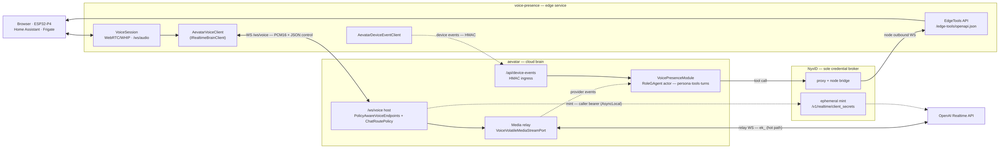

# Voice Presence Integration — aevatar as the `/ws/voice` Brain

This page is the authoritative reference for how aevatar serves as the AI brain
for the external `voice-presence` edge server (`~/Code/voice-presence`). It is
the current-state map of the contract, the runtime planes, and the ownership
boundary. Hardening / open work is tracked in **milestone 23 "Voice Realtime"**;
design rationale lives in the referenced ADRs and is not restated here.

Operator setup steps live in
`docs/operations/2026-06-18-aevatar-mode-voice-presence-setup.md`. Keep this
canon page as the contract SSOT; the runbook must only assemble verified
surfaces from this page, the referenced ADRs, NyxID node/service/device
registration, aevatar device-event ingress, `voice-presence/enable`, the
voice-capability read model, and `/ws/voice`.

## Scope

`voice-presence` is a standalone ASP.NET edge server (the home-presence device
side) that captures device audio (browser AudioWorklet, ESP32-P4 WHIP, Home
Assistant / Frigate) and routes a realtime conversation to an AI brain selected
by `BRAIN_PROVIDER`. In `aevatar` mode it stops dialing OpenAI directly and
relays over aevatar's `/ws/voice` transport; the brain — realtime provider,
persona, tools, turn lifecycle, event-injection policy, memory — lives in an
aevatar `RoleGAgent` actor, and NyxID brokers every credential. This is the
acceptance criterion of milestone 23.

aevatar owns everything brain-side; `voice-presence` degrades to a LAN
transport / transcoding gateway plus a LAN tool/device surface.

## System overview

The integration meets over a single WebSocket — `/ws/voice` — plus three
out-of-band side channels. Audio rides binary frames; control and events ride a
JSON projection of the `VoiceControlFrame` protobuf.



## The four planes

The design's load-bearing idea is that four concerns take four different routes
with different trust and latency properties. Audio never touches NyxID or the
actor; credentials touch NyxID only at connect; tools and device events never
touch the audio socket.

| Plane | Route | Carrier | Notes |
|---|---|---|---|
| **Audio + control** | edge ⇄ aevatar ⇄ OpenAI | binary PCM16 (audio) + JSON `VoiceControlFrame` (control) over `/ws/voice`; relay WS to OpenAI | Hot path. Raw PCM never enters the actor inbox / `EventEnvelope` / projection / committed store (ADR-013 media red line). |
| **Credential** | aevatar → NyxID → OpenAI | HTTPS mint; `/ws/voice` admission carries a short-TTL opaque `credential_ref` in typed `VoiceToolExecutionContext` and binds the raw caller bearer only when the live transport lease attaches | Connect-time/provider/tool use only. Actor state carries the ref and non-secret caller/channel fields; catalog, invoker, and provider reconnect resolve through `ICredentialProvider` at the co-located transport boundary. Raw bearers do not cross lease/proto/actor/readmodel boundaries. |
| **Edge tools** | actor → NyxID proxy → node WS → edge HTTP → LAN | NyxID connected-service `x-aevatar-tool` operations | The LAN tool bridge. Edge publishes `/edge-tools/openapi.json`; only `EDGE_TOOLS_ALLOWLIST` operations are exposed (ADR-0031 short-term bridge). |
| **Device events** | edge → aevatar `/api/device-events/{regId}` | HMAC-SHA256 signed callback body | Off-socket household-event ingress. The endpoint admits only fresh signed body timestamps and maps a stable delivery id into the envelope delivery operation identity; the actor owns fencing / turn creation. |

Device-event replay protection is enforced before dispatch. The endpoint trusts
only the timestamp carried in the HMAC-covered callback body, with a default
10-second freshness window aligned to voice event staleness. `X-NyxID-Timestamp`
is diagnostic only and cannot refresh a captured body. The delivery id is
`content.text.event_id` when present, otherwise a home-alert `correlation_key`;
it becomes `Runtime.DeliveryIdentity.OperationId =
device-event:{registrationId}:{deliveryId}`. If no active voice session exists,
the event is still drop-and-log at the voice boundary; this integration does not
add a durable spool.

## Wire contract

Authoritative schema: `src/Aevatar.Foundation.VoicePresence.Abstractions/Protos/voice_presence.proto`.
The edge consumes a JSON projection of it (camelCase), hand-parsed by
`voice-presence` `Aevatar/AevatarRealtimeFrameParser.cs`.

- **Endpoint** — `GET /ws/voice` (policy-resolved). Browser clients offer
  `aevatar-voice-v1` and `aevatar-bearer.<NyxID JWT>` through
  `Sec-WebSocket-Protocol`; the host must select only `aevatar-voice-v1` in the
  upgrade response and must never echo the bearer entry. Non-browser clients
  may use `Authorization: Bearer <NyxID JWT>`; `?access_token=` is legacy only.
  Query: `codec=pcm16`, `mode`, `voice_module_name`. Mainnet does not expose an
  actor-id path; explicit voice attachment is represented only by typed
  `ForwardToModel.tool_choice_hint.voice_attach_target`.
- **Audio** — WebSocket **binary** frames carry raw PCM16 (24 kHz) both
  directions. `audio_received` / `audio_output` are `reserved` in the proto:
  audio was deliberately pulled out of the envelope.
- **Control / events** — WebSocket **text** frames carry a JSON
  `VoiceControlFrame` oneof:
  - up (client → aevatar): `drainAcknowledged`, `inputImage`,
    `functionCallOutput`
  - down (aevatar → client): `sessionAccepted`, `realtimeFrame`
  - `sessionAccepted` advertises the typed wire contract version (`1.0`) and
    the input image policy (`maxBytes: 512000`, allowed media types
    `image/jpeg`, `image/png`) owned by aevatar. It also carries
    `attachOutcome`: `NEW_SESSION` for a fresh lease and `RESTARTED` when
    aevatar intentionally evicted a previous lease before accepting the new
    transport. Clients must not infer reset semantics from a changed
    `sessionId`; `sessionId` remains identity.
  - `realtimeFrame` is itself a `VoiceRealtimeFrame` oneof: `responseStarted`/
    `Done`/`Cancelled`, `speechStarted`/`Stopped`, `functionCall`,
    `transcriptDelta`/`Completed`, `error`, `disconnected`, `sessionClosed`.
    `transcriptCompleted` represents provider transcript text only; a
    `drainAcknowledged` playout ACK advances the actor drain fence but does not
    publish a transcript fact.
- **Tool ownership** — every `VoiceToolDefinition` declares typed ownership.
  The actor still owns persona, turn lifecycle and VAD; the edge sends no
  `session.update` / `response.create` / `response.cancel`.
  `VOICE_TOOL_OWNER_UNSPECIFIED` and `VOICE_TOOL_OWNER_ACTOR` keep the default
  actor-owned path: the actor executes through `IVoiceToolInvoker` and submits
  the provider result. `VOICE_TOOL_OWNER_CLIENT` makes the edge client the owner
  of the side effect and output. The provider `function_call` is still published
  through `VoiceRealtimeFrame.functionCall`; the actor records a
  `VoicePendingClientToolCall` in `VoicePresenceRuntimeState` and waits for a
  matching `VoiceControlFrame.functionCallOutput` or a durable
  `VoiceClientToolCallTimeoutExpired` self-signal before reusing the same
  provider result delivery path. No process-local pending map or device command
  queue is part of this contract.
- **Tool catalog proof** — Voice uses the shared request-scoped discovery path
  and persists one `AgentTurnToolCatalogProof` snapshot for the lease/session.
  The allowlist has a 6-tool optimization target and a hard 32 KiB canonical
  schema limit; exceeding the count target neither rejects nor truncates an exact
  catalog. An empty allowlist is restricted empty, never unrestricted. Readiness, provider schema
  injection and `IVoiceToolInvoker` validate the same names/schema/digest, and
  any re-materialization mismatch fails before tool execution. Voice does not
  inherit the whole `workspace.default` ceiling. See
  [agent-turn-tool-catalog.md](agent-turn-tool-catalog.md).
- **Lease** — the host attaches a transport lease (`transport_lease_id`,
  `owner_id`, `lease_epoch`, `lease_expires_at`) the actor owns; the volatile
  media relay is bound to that lease. Host/provider connect paths must carry
  the readmodel-observed positive `lease_epoch`; transport attach reuses that
  lease generation and does not create the next epoch. While the relay remains
  live it sends typed actor renewal signals that extend the actor-owned lease
  deadline. `owner_id`, `transport_lease_id`, and `lease_epoch` form the identity
  fence; `lease_expires_at` / `renew_expires_at` are freshness deadlines and do
  not independently identify a lease generation. After the actor accepts an
  upstream `transport_lease_id`, barge-in cancellation, input images, tool
  results, and event injection are delivered only through the live media relay
  bound at attach time. A missing media port or relay for that lease is a
  delivery/topology gap, not permission to open a replacement provider socket.
- **Attach lifecycle** — both the Foundation endpoint and the Mainnet
  policy-aware endpoint use the same stateless Foundation WebSocket attach
  executor. It sends the typed `sessionAccepted` ACK, subscribes realtime
  control frames, attaches the volatile media relay with a bounded timeout, and
  releases/detaches with a bounded close-wait. A pre-upgrade
  `TransportAlreadyAttached` result returns `409` with `Retry-After: 1`;
  post-upgrade media, credential, conflict, or timeout failures close the socket
  with a policy-violation reason.
- **Credential ref lifetime** — `/ws/voice` admission mints at most one
  `voice-tool:` ref for an attach attempt and hands a non-protobuf transport
  binding to the host attach path. The raw caller bearer becomes resolvable
  only after `VoiceVolatileMediaStreamPort.AttachAsync` observes the accepted
  `transport_lease_id` and binds the credential to that same live lease. The
  actor/session/readmodel path carries only `VoiceToolExecutionContext` with
  the opaque ref and non-secret caller/channel fields. Detach, failed attach,
  and transport lifetime completion evict the bound credential in the same
  cleanup path that removes the volatile media relay; expired refs are evicted
  on resolve/issue and never fall back to durable `IAevatarSecretsStore`
  writes.
- **Media readiness vs. session-update readiness** — attach returns a provider
  media session as soon as the provider socket is connected. Tool discovery and
  the full `session.update` run as a lease-scoped readiness task behind that
  session; audio frames and `response.cancel` pass through immediately, while
  image input, event injection, tool results, and later session updates wait for
  readiness. OpenAI connects with a no-auto-response baseline until the full
  update lands, so first audio is not blocked by NyxID/OpenAPI discovery and the
  model cannot create responses before the tool/persona session is ready.
- **Credential/media co-location boundary** — voice tool credentials share the
  `IVoiceVolatileMediaStreamPort` lifetime boundary: resolve is valid only in
  the host process that owns the live transport lease and media relay. A tool
  turn running in another silo cannot resolve this volatile ref today; that is
  the same known boundary as the live media relay and is a follow-up topology
  problem, not a durable credential fact source.
- **Drain-ack timeout** — when a response enters `AudioDraining`, the actor
  schedules a durable `VoiceDrainTimeoutExpired` self-signal and releases the
  drain fence only after matching the active `response_id` and positive
  `lease_epoch`; this preserves the existing ACK watermark without treating the
  timeout as edge playout confirmation.

## Connect + turn sequence

The browser `/voice` surface keeps its provider grant separate from the shared
console login. Before route provisioning or microphone access, it obtains a
feature token whose RFC 8707 resources are the union of the baseline Aevatar
resource and
`<same-NyxID-resource-base>/api/v1/proxy/s/<configured-realtime-service-slug>`.
The browser derives that URI from the injected Aevatar resource, so it preserves
the resource server's canonical API base independently of the OIDC authority. The
authorization-code exchange repeats that exact resource set, and refresh uses
the resources stored with the feature token. The shared baseline token is not
overwritten. Owning the NyxID service and authorizing a particular access token
to proxy it are separate facts.

For a caller without a resolved voice target, `/voice` provisions a dedicated
`nyxid.voice` `RoleGAgent` through `POST
/api/scopes/{scopeId}/voice-agents`. The application command service creates the
actor, registers caller-scope ownership, and dispatches the
`VoicePresenceEnableRequested` command for `voice_presence_openai`; the HTTP 202
receipt promises only accepted dispatch. The page then writes the
`voice-default` rule with both `actor_id` and `voice_module_name`, and polls the
policy plus voice-capability read models before dialing. It never substitutes a
`nyxid.chat` conversation actor: that actor owns the NyxID conversation
controller state and does not implement the voice capability contract. A
console-managed `voice-default` rule left by the former conversation path is
replaced after the actor registry proves that mismatch.

```mermaid
%%{init: {"maxTextSize": 100000, "sequence": {"useMaxWidth": false}, "themeVariables": {"fontSize": "10px"}}}%%
sequenceDiagram
  autonumber
  participant D as Edge device
  participant VP as voice-presence
  participant H as aevatar /ws/voice host
  participant A as VoicePresenceModule (actor)
  participant N as NyxID
  participant O as OpenAI Realtime

  Note over D,VP: device audio via WebRTC/WHIP or /ws/audio (24kHz PCM16)
  VP->>H: WS connect /ws/voice (Bearer NyxID token)
  H->>H: JWT auth → OwnerScope → ChatRoutePolicy.Resolve → voice_attach_target
  H->>A: ExecuteAsync(Attach) preflight
  A-->>H: lease handle (else 404 / 503 / 409)
  H-->>VP: sessionAccepted (JSON control frame)
  H->>N: mint ephemeral (resolve credential_ref at provider boundary)
  N->>O: POST /v1/realtime/client_secrets (NyxID injects sk-)
  O-->>N: ek_ (~60s TTL)
  N-->>H: ek_
  H->>O: open realtime WS (ek_) — relay; no-auto-response baseline
  H-->>VP: media relay starts; first PCM can flow
  H->>N: discover caller-scoped tools if a live credential_ref exists
  H->>O: session.update persona + tools; readiness opens response-producing calls
  loop conversation — hot path (no NyxID, no actor)
    VP->>H: PCM16 mic (binary)
    H->>O: PCM16 (relay)
    O-->>H: PCM16 response (relay)
    H-->>VP: PCM16 response (binary)
  end
  O-->>A: function_call event (relay → actor)
  alt actor-owned tool
    A->>N: tool exec (proxy → node WS)
    N->>VP: POST /edge-tools/tools/{name}
    VP->>VP: run HA / Frigate / LCD on LAN
    VP-->>A: result
  else client-owned tool
    A-->>H: realtimeFrame.functionCall
    H-->>VP: functionCall (JSON)
    VP->>VP: run local tool
    VP-->>H: functionCallOutput (JSON)
    H-->>A: typed control self-signal
  end
  A->>O: SendToolResult (upstream)
  O-->>H: responseStarted/Done · transcripts → realtimeFrame
  H-->>VP: realtimeFrame (JSON)
  VP-->>H: drainAcknowledged (JSON)
  Note over D,A: Household events bypass the socket:<br/>VP → POST /api/device-events/{regId} (HMAC) → actor injects
```

## Component ownership

| Concern | aevatar (brain) | voice-presence (edge) |
|---|---|---|
| Ingress / routing | `PolicyAwareVoiceEndpoints` + `ChatRoutePolicy` | `AevatarVoiceClient` dials `/ws/voice` |
| Media relay | `VoiceVolatileMediaStreamPort` (volatile, per-lease) | `VoiceSession` + WebRTC/WHIP transcode |
| Brain state | `VoicePresenceModule` on a `RoleGAgent` actor | — (no `session.update`) |
| Provider | `OpenAIRealtimeProvider` (direct WS) / MiniCPM | — |
| Credentials | `/voice` feature-scoped OAuth token + `VoiceToolExecutionContext` / `ICredentialProvider` use-boundary resolution; `NyxIdRealtimeProviderCredentialResolver` mints provider ephemeral | NyxID bearer authorized for both Aevatar and the configured realtime service |
| Tools | `IVoiceToolInvoker` / `IAgentToolSource` (+ NyxID connected-service) | `/edge-tools` HTTP surface (LAN execution) |
| Device events | `/api/device-events` HMAC ingress → actor | `AevatarDeviceEventClient` (HMAC sign) |

## References

- ADR-0025 — Voice Router Integration (policy-aware WebSocket boundary)
- ADR-0026 — Tool-First Chat Ingress
- ADR-0031 — Voice Edge Local Tools (NyxID node bridge; long-term `function_call_output`)
- ADR-0033 — Voice Provider Credential via NyxID Ephemeral Broker
- ADR-013 — NyxID pure passthrough (media red line)
- `docs/canon/nyxid-connected-service-tools.md`
- `docs/canon/agent-turn-tool-catalog.md`
- `docs/operations/2026-06-18-aevatar-mode-voice-presence-setup.md`
- Milestone 23 "Voice Realtime" — foundational slices #1939–#1945 (merged)

## Open work

Hardening and contract-completeness follow-ups are tracked under **milestone 23
"Voice Realtime"** (issues #2150–#2161):

- #2150 — thread real `lease_epoch` into provider sessions (inert fence)
- #2151 — renew the session lease while the relay is attached
- #2152 — bound `AudioDraining` with a server-side drain-ack timeout
- #2153 — reuse the live relay provider session for upstream sends (barge-in latency)
- #2155 — route-scoped voice tool execution context (unblocks per-caller edge tools)
- #2157 — replay protection for the device-event HMAC ingress
- #2158 — remove Mainnet's `/ws/voice/{actorId}` dev-bypass route
- #2159 — `/ws/voice` reconnect/reattach contract + wire dead attach timeouts
- #2160 — version the wire contract + ship a shared frame/vocabulary descriptor
- #2161 — operator setup guide for aevatar-mode voice

See the milestone for the live list.
