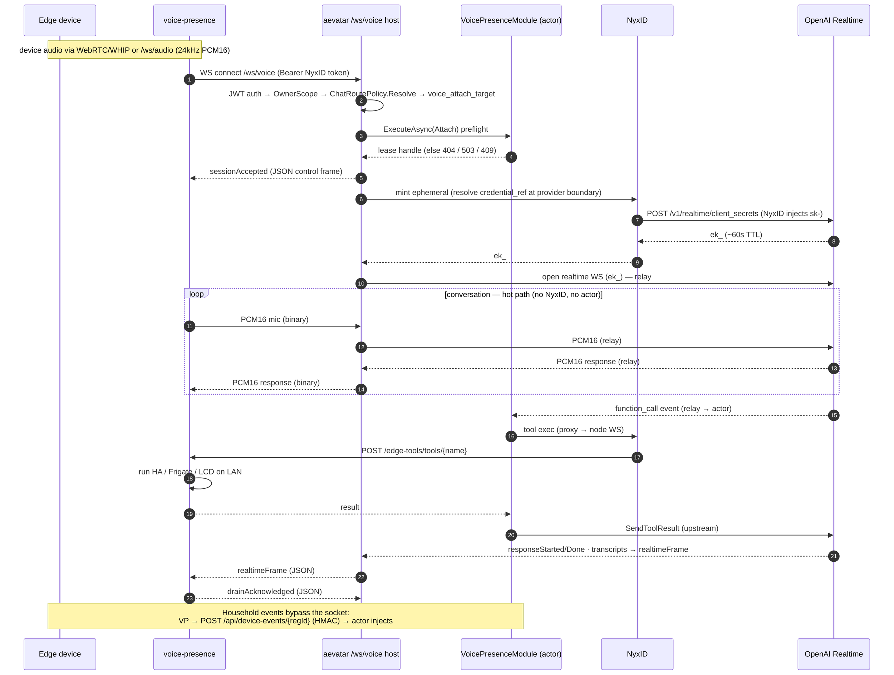

# Voice Presence Integration — aevatar as the `/ws/voice` Brain

This page is the authoritative reference for how aevatar serves as the AI brain
for the external `voice-presence` edge server (`~/Code/voice-presence`). It is
the current-state map of the contract, the runtime planes, and the ownership
boundary. Hardening / open work is tracked in **milestone 23 "Voice Realtime"**;
design rationale lives in the referenced ADRs and is not restated here.

## Scope

`voice-presence` is a standalone ASP.NET edge server (the home-presence device
side) that captures device audio (browser AudioWorklet, ESP32-P4 WHIP, Home
Assistant / Frigate) and routes a realtime conversation to an AI brain selected
by `BRAIN_PROVIDER`. In `aevatar` mode it stops dialing OpenAI directly and
relays over aevatar's `/ws/voice` transport; the brain — realtime provider,
persona, tools, turn lifecycle, event-injection policy, memory — lives in an
aevatar `RoleGAgent` actor, and NyxID brokers every credential. This is the
acceptance criterion of milestone 23.

aevatar owns everything brain-side; `voice-presence` degrades to a LAN
transport / transcoding gateway plus a LAN tool/device surface.

## System overview

The integration meets over a single WebSocket — `/ws/voice` — plus three
out-of-band side channels. Audio rides binary frames; control and events ride a
JSON projection of the `VoiceControlFrame` protobuf.

## The four planes

The design's load-bearing idea is that four concerns take four different routes
with different trust and latency properties. Audio never touches NyxID or the
actor; credentials touch NyxID only at connect; tools and device events never
touch the audio socket.

| Plane | Route | Carrier | Notes |
|---|---|---|---|
| **Audio + control** | edge ⇄ aevatar ⇄ OpenAI | binary PCM16 (audio) + JSON `VoiceControlFrame` (control) over `/ws/voice`; relay WS to OpenAI | Hot path. Raw PCM never enters the actor inbox / `EventEnvelope` / projection / committed store (ADR-013 media red line). |
| **Credential** | aevatar → NyxID → OpenAI | HTTPS mint; `/ws/voice` admission carries a short-TTL opaque `credential_ref` in typed `VoiceToolExecutionContext` and binds the raw caller bearer only when the live transport lease attaches | Connect-time/provider/tool use only. Actor state carries the ref and non-secret caller/channel fields; catalog, invoker, and provider reconnect resolve through `ICredentialProvider` at the co-located transport boundary. Raw bearers do not cross lease/proto/actor/readmodel boundaries. |
| **Edge tools** | actor → NyxID proxy → node WS → edge HTTP → LAN | NyxID connected-service `x-aevatar-tool` operations | The LAN tool bridge. Edge publishes `/edge-tools/openapi.json`; only `EDGE_TOOLS_ALLOWLIST` operations are exposed (ADR-0031 short-term bridge). |
| **Device events** | edge → aevatar `/api/device-events/{regId}` | HMAC-SHA256 signed callback body | Off-socket household-event ingress. The endpoint admits only fresh signed body timestamps and maps a stable delivery id into the envelope dedupe operation; the actor owns fencing / turn creation. |

Device-event replay protection is enforced before dispatch. The endpoint trusts
only the timestamp carried in the HMAC-covered callback body, with a default
10-second freshness window aligned to voice event staleness. `X-NyxID-Timestamp`
is diagnostic only and cannot refresh a captured body. The delivery id is
`content.text.event_id` when present, otherwise a home-alert `correlation_key`;
it becomes `Runtime.Deduplication.OperationId =
device-event:{registrationId}:{deliveryId}`. If no active voice session exists,
the event is still drop-and-log at the voice boundary; this integration does not
add a durable spool.

## Wire contract

Authoritative schema: `src/Aevatar.Foundation.VoicePresence.Abstractions/Protos/voice_presence.proto`.
The edge consumes a JSON projection of it (camelCase), hand-parsed by
`voice-presence` `Aevatar/AevatarRealtimeFrameParser.cs`.

- **Endpoint** — `GET /ws/voice` (policy-resolved) and `GET /ws/voice/{actorId}`
  (dev/admin bypass). Auth: `Authorization: Bearer <NyxID JWT>` or
  `?access_token=`. Query: `codec=pcm16`, `mode`, `voice_module_name`.
- **Audio** — WebSocket **binary** frames carry raw PCM16 (24 kHz) both
  directions. `audio_received` / `audio_output` are `reserved` in the proto:
  audio was deliberately pulled out of the envelope.
- **Control / events** — WebSocket **text** frames carry a JSON
  `VoiceControlFrame` oneof:
  - up (client → aevatar): `drainAcknowledged`, `inputImage`
  - down (aevatar → client): `sessionAccepted`, `realtimeFrame`
  - `realtimeFrame` is itself a `VoiceRealtimeFrame` oneof: `responseStarted`/
    `Done`/`Cancelled`, `speechStarted`/`Stopped`, `functionCall`,
    `transcriptDelta`/`Completed`, `error`, `disconnected`, `sessionClosed`.
- **Ownership** — the actor owns persona, tools, turn lifecycle and VAD; the
  edge sends no `session.update` / `response.create` / `response.cancel` and
  drops any local `function_call_output` (tools execute actor-side).
- **Lease** — the host attaches a transport lease (`transport_lease_id`,
  `owner_id`, `lease_epoch`, `lease_expires_at`) the actor owns; the volatile
  media relay is bound to that lease. Host/provider connect paths must carry
  the readmodel-observed positive `lease_epoch`; transport attach reuses that
  lease generation and does not create the next epoch. While the relay remains
  live it sends typed actor renewal signals that extend the actor-owned lease
  deadline. `owner_id`, `transport_lease_id`, and `lease_epoch` form the identity
  fence; `lease_expires_at` / `renew_expires_at` are freshness deadlines and do
  not independently identify a lease generation.
- **Credential ref lifetime** — `/ws/voice` admission mints at most one
  `voice-tool:` ref for an attach attempt and hands a non-protobuf transport
  binding to the host attach path. The raw caller bearer becomes resolvable
  only after `VoiceVolatileMediaStreamPort.AttachAsync` observes the accepted
  `transport_lease_id` and binds the credential to that same live lease. The
  actor/session/readmodel path carries only `VoiceToolExecutionContext` with
  the opaque ref and non-secret caller/channel fields. Detach, failed attach,
  and transport lifetime completion evict the bound credential in the same
  cleanup path that removes the volatile media relay; expired refs are evicted
  on resolve/issue and never fall back to durable `IAevatarSecretsStore`
  writes.
- **Credential/media co-location boundary** — voice tool credentials share the
  `IVoiceVolatileMediaStreamPort` lifetime boundary: resolve is valid only in
  the host process that owns the live transport lease and media relay. A tool
  turn running in another silo cannot resolve this volatile ref today; that is
  the same known boundary as the live media relay and is a follow-up topology
  problem, not a durable credential fact source.

## Connect + turn sequence

## Component ownership

| Concern | aevatar (brain) | voice-presence (edge) |
|---|---|---|
| Ingress / routing | `PolicyAwareVoiceEndpoints` + `ChatRoutePolicy` | `AevatarVoiceClient` dials `/ws/voice` |
| Media relay | `VoiceVolatileMediaStreamPort` (volatile, per-lease) | `VoiceSession` + WebRTC/WHIP transcode |
| Brain state | `VoicePresenceModule` on a `RoleGAgent` actor | — (no `session.update`) |
| Provider | `OpenAIRealtimeProvider` (direct WS) / MiniCPM | — |
| Credentials | `VoiceToolExecutionContext` + `ICredentialProvider` use-boundary resolution; `NyxIdRealtimeProviderCredentialResolver` mints provider ephemeral | NyxID bearer only |
| Tools | `IVoiceToolInvoker` / `IAgentToolSource` (+ NyxID connected-service) | `/edge-tools` HTTP surface (LAN execution) |
| Device events | `/api/device-events` HMAC ingress → actor | `AevatarDeviceEventClient` (HMAC sign) |

## References

- ADR-0025 — Voice Router Integration (policy-aware WebSocket boundary)
- ADR-0026 — Tool-First Chat Ingress
- ADR-0031 — Voice Edge Local Tools (NyxID node bridge; long-term `function_call_output`)
- ADR-0033 — Voice Provider Credential via NyxID Ephemeral Broker
- ADR-013 — NyxID pure passthrough (media red line)
- `docs/canon/nyxid-connected-service-tools.md`
- Milestone 23 "Voice Realtime" — foundational slices #1939–#1945 (merged)

## Open work

Hardening and contract-completeness follow-ups are tracked under **milestone 23
"Voice Realtime"** (issues #2150–#2161):

- #2150 — thread real `lease_epoch` into provider sessions (inert fence)
- #2151 — renew the session lease while the relay is attached
- #2152 — bound `AudioDraining` with a server-side drain-ack timeout
- #2153 — reuse the live relay provider session for upstream sends (barge-in latency)
- #2154 — don't block first-audio on connect-time tool discovery
- #2155 — route-scoped voice tool execution context (unblocks per-caller edge tools)
- #2156 — typed `VoiceFunctionCallOutput` control frame
- #2157 — replay protection for the device-event HMAC ingress
- #2158 — harden / gate the `/ws/voice` dev-bypass route
- #2159 — `/ws/voice` reconnect/reattach contract + wire dead attach timeouts
- #2160 — version the wire contract + ship a shared frame/vocabulary descriptor
- #2161 — operator setup guide for aevatar-mode voice

See the milestone for the live list.
