# Workflow Delivery Control Plane

Workflow Delivery Center lets an Aevatar administrator deliver one configured, allowlisted workflow package to one NyxID personal scope. The customer configures only the declared variables, resolves connection slots through NyxID hosted connect links, selects a real Studio Team, and publishes through the existing Scope Workflow provisioning path.

Scope Workflow remains the only published, queryable, and runnable workflow authority. Delivery does not create a second workflow runtime, member identity model, capability admission path, schedule implementation, or projection pipeline.

## Authority And Read Model

One `WorkflowDeliveryGAgent` owns one `deliveryId`. Its persisted protobuf state contains:

- the immutable package version snapshot, source hash, package hash, and typed acceptance policy;
- target scope, expiry, access, and revocation facts;
- secret-free NyxID connection references;
- one stable installation identity, its resolved configuration hashes, trigger intent, provisioning identities, errors, attempts, and acceptance evidence.

Every command is dispatched to `workflow-delivery:{deliveryId}`. Committed state enters the normal current-state projection pipeline and materializes `WorkflowDeliveryCurrentStateDocument`. HTTP queries read that document only. Customer detail is selected by exact `delivery_id + target_scope_id` filters before the package schema is mapped into an API response; query-time actor activation, event replay, and projection priming are forbidden.

```mermaid
%%{init: {"maxTextSize": 100000, "flowchart": {"useMaxWidth": false, "nodeSpacing": 10, "rankSpacing": 50}, "themeVariables": {"fontSize": "10px"}}}%%
flowchart LR
    A["Aevatar admin"] --> B["Allowlisted package catalog"]
    B --> C["WorkflowDeliveryGAgent"]
    U["NyxID personal-scope user"] --> H["Delivery HTTP boundary"]
    H --> C
    C --> E["Committed state event"]
    E --> P["Unified projection pipeline"]
    P --> R["WorkflowDelivery current-state read model"]
    H --> R
    R --> K["Delivery continuation worker"]
    K --> S["Studio provisioning service"]
    S --> C
    S --> W["Authoritative Scope Workflow"]
```



## Package And Configuration Contract

`Aevatar:Delivery:AllowedWorkflowNames` is the exact administrator package allowlist. API callers submit a workflow name, never arbitrary YAML. Allowlisted sources live in and are published from the dedicated `delivery-workflows/` package directory, then loaded through an Infrastructure source port; they are deliberately excluded from the global startup Workflow Catalog and are not callable until the customer installation reaches the existing Scope Workflow provisioning path. The catalog parses the source, computes its hash, and snapshots the immutable YAML when the delivery is created. `packageVersionId` is derived from a separate package hash over the source, variable schema, connection slots, capabilities, risk summary, parser diagnostics, and typed acceptance policy. Changing any of those semantics creates a different package version even when the YAML source is unchanged.

Customer updates are keyed by the package's typed variable schema. YAML pointers are resolved through the YAML AST. A JSON pointer inside a YAML scalar is applied through `JsonNode`, never string replacement. Unknown fields and wrong JSON types fail closed. Connection `user_service_id` values are not customer fields: the server resolves them only from completed NyxID hosted connect links and updates structured YAML nodes. The installation preserves both `sourceHash` and the deterministic `resolvedHash`.

The delivery API exposes three explicit trigger intents: publish-only `none`, acceptance `one_shot`, and recurring `cron`. Packages with automatic acceptance default to `one_shot` so the installed revision can produce terminal acceptance evidence. `none` never claims automatic acceptance and remains `provisioning_accepted`; an ordinary manual run is not eligible because it has no typed installation/attempt/operation attribution. A cron intent is stored separately from YAML and only becomes Ready after the exact schedule operation produces a successful typed-artifact run.

`fin_invoice_precheck_approval` (FIN-01) requires `input_file_refs`, while Workflow Delivery does not transport run attachments. Its immutable acceptance policy therefore exposes only `none`. FIN-01 is published but honestly remains `provisioning_accepted`; it cannot become Ready until a future typed manual-acceptance command binds an attachment-bearing run to the exact `deliveryId + installationId + attempt + operationId`. Delivery must not infer that attribution from workflow, member, run timing, or a later unattributed manual run.

## Identity And Authorization

Administrator package and delivery mutations require an `IPlatformAdminAuthorizer` result with all of:

- `IsElevated == true`;
- a nonempty NyxID `UserId`;
- `GrantSource == allowed_user_id`.

Customer operations require the route `scopeId` to equal the single authenticated `scope_id` or `workflow.scope_id` claim. A delivery link carries only `deliveryId` and grants no authority. `memberId`, `workflowId`, and `publishedServiceId` remain separate identities returned by their owning Studio/Scope Workflow contracts.

NyxID connect URLs are transient responses. Delivery state retains only `connectLinkId` while pending and `userServiceId` after completion. External-service OAuth credentials, connection tokens, and connect URLs are never written into workflow YAML, actor state, read models, or browser storage; the console's own OIDC login session follows the shared Backend Console storage contract. The current NyxID connect-link contract supports personal scope only. Organization-scope connection materialization remains unsupported rather than being inferred.

NyxID hosted-connect callbacks use the trusted `Aevatar:Delivery:ConsoleBaseUrl`, never an arbitrary HTTP `Host` header. Distributed production configuration sets this to `https://aevatar-console-backend-api.aevatar.ai`; other production-like environments must provide an absolute HTTPS URL without userinfo, query, or fragment, otherwise connect-link creation fails with `503 DELIVERY_CALLBACK_BASE_URL_UNAVAILABLE`. Development, `PersistentLocal`, and test environments may omit the setting, but their request-derived fallback accepts only `localhost`, `127.0.0.1`, or another URI-recognized loopback host (including its local port and `PathBase`). A non-loopback request host never becomes an external callback.

Connection observation follows the same CQRS boundary as every other delivery fact. `GET .../connections/{slotKey}` reads only the projected delivery document. `POST .../connections/{slotKey}:refresh` reads the current NyxID link, dispatches a typed actor update, and returns `202 refresh_accepted`; callers must poll the GET resource until the committed projection changes. The refresh response never claims that the connection is complete.

NyxID does not currently accept an idempotency key when creating a hosted connect link. Link creation therefore precedes the actor command that records the link identity. If NyxID creates the link but actor dispatch is rejected or unavailable, that external link can remain orphaned until it expires; the Delivery Center never retries link creation automatically after an uncertain result. Closing this gap requires a NyxID creation-idempotency contract rather than a local duplicate-suppression guess.

## Installation Status

Installation identity is deterministic for `deliveryId + targetScopeId`, and the customer publish idempotency key is persisted. The initial HTTP operation validates and persists a secret-free provisioning plan, then returns an accepted receipt. A background continuation resumes accepted installations from the durable read model and invokes the existing idempotent Studio provisioning application service outside the HTTP request lifetime.

Delivery provisioning uses two deliberately different identities. `operationId` is fenced to the current installation attempt and advances on an explicit retry. The StudioMember schedule `provisioningId` includes that normalized operation identity, so replaying one attempt reuses the same actor-owned intent while a later attempt cannot conflict with a terminal intent from an earlier attempt. Retry clears the prior attempt's schedule provisioning id/status and readiness evidence, while retaining the stable member, workflow, published service, revision, and schedule identities. `scheduleIdempotencyKey` remains stable for the immutable installation, keeping retries converged on the same Team-owned schedule resource.

The authoritative progression is:

```text
accepted -> provisioning_accepted -> ready
         \-> failed -> accepted (explicit retry)
```

`HTTP 202`, member creation, binding acceptance, or schedule provisioning acceptance must never be rendered as installation success. `ready` requires one actor command carrying all of the following typed evidence:

1. the published Scope Workflow is committed and runnable;
2. the expected revision is bound;
3. the requested trigger or explicit no-trigger condition is ready;
4. an acceptance run reached terminal success;
5. at least one expected typed artifact was verified.

The actor validates evidence against the installation's persisted identities, attempt, operation identity, and trigger intent before committing Ready. Ready and failure outcomes carry the active `attempt + operationId` fence: stale outcomes from an earlier retry are ignored, while an outcome for the active attempt with a different operation identity is rejected. Reconciliation is a background/actor-owned responsibility, never a GET-side effect. If any authoritative fact is still pending, the installation remains `provisioning_accepted`; neither the API nor `/delivery` fabricates completion.

## Product Surface

`/delivery` is an embedded Backend Console shell parallel to `/admin`, with routes `/delivery#/fde`, `/delivery#/customer`, and `/delivery#/customer/{deliveryId}`. `GET /api/delivery/session` is the sole UI role/scope authority. The page uses the shared NyxID OIDC PKCE contract, server-returned packages and Teams, dynamic variable forms, explicit risk confirmations, transient connect links, and manual/durable installation refresh. It contains no demo data, role switch, fixed delivery identity, timer-driven success, or fallback success state.
