# Workflow Delivery Control Plane

Workflow Delivery Center lets an Aevatar administrator deliver one configured, allowlisted workflow package to one NyxID personal scope. The customer configures only the declared variables, resolves connection slots through NyxID hosted connect links, selects a real Studio Team, and publishes through the existing Scope Workflow provisioning path.

Scope Workflow remains the only published, queryable, and runnable workflow authority. Delivery does not create a second workflow runtime, member identity model, capability admission path, schedule implementation, or projection pipeline.

## Authority And Read Model

One `WorkflowDeliveryGAgent` owns one `deliveryId`. Its persisted protobuf state contains:

- the immutable package version snapshot, source hash, package hash, and typed acceptance policy;
- target scope, expiry, access, and revocation facts;
- secret-free NyxID connection references;
- one stable installation identity, its resolved configuration hashes, trigger intent, provisioning identities, errors, attempts, and acceptance evidence.

Every command is dispatched to `workflow-delivery:{deliveryId}`. Committed state enters the normal current-state projection pipeline and materializes `WorkflowDeliveryCurrentStateDocument`. HTTP queries read that document only. Customer detail is selected by exact `delivery_id + target_scope_id` filters before the package schema is mapped into an API response; query-time actor activation, event replay, and projection priming are forbidden.

```mermaid
%%{init: {"maxTextSize": 100000, "flowchart": {"useMaxWidth": false, "nodeSpacing": 10, "rankSpacing": 50}, "themeVariables": {"fontSize": "10px"}}}%%
flowchart LR
    A["Aevatar admin"] --> B["External package catalog and typed input recipe"]
    B --> C["WorkflowDeliveryGAgent"]
    U["NyxID personal-scope user"] --> H["Delivery HTTP boundary"]
    H --> C
    C --> E["Committed state event with resolved installation input"]
    E --> P["Unified projection pipeline"]
    P --> R["WorkflowDelivery current-state read model"]
    H --> R
    R --> K["Delivery continuation worker"]
    K --> S["Studio provisioning service"]
    S --> C
    S --> W["Authoritative Scope Workflow"]
```



## Package And Configuration Contract

`Aevatar:Delivery:Packages` is the exact administrator package catalog. Each entry declares a workflow name, customer-facing description, risk summary, capabilities, typed variables, connection slots, and typed acceptance policy. Acceptance input is a bounded, strongly typed recipe. Literal entries support `String`, `Integer`, `Number`, and `Boolean`. Dynamic string bindings may read only the installation creation instant or the authenticated owner's external user ID; time bindings select an explicit UTC date, year-month, ISO week, or compact-date projection and may apply a bounded day offset plus bounded prefix and suffix. Delivery configuration rejects unknown keys. The retired `AllowedWorkflowNames`, `UseShippedWorkflowAllowlist`, and `ConsoleBaseUrl` keys are the only rolling-upgrade exceptions: the strict binder recognizes them as no-op compatibility sinks, and they never publish or modify a package. Host startup probes the complete configured catalog through the same catalog path used by the API, so invalid definitions, missing YAML, parser failures, and workflow identity mismatches fail startup before the host accepts traffic. An explicitly empty `Packages` list remains valid.

The Application module converts this configuration to `WorkflowDeliveryAcceptanceInputRecipe`. The complete Protobuf recipe participates in the immutable package hash. When installation starts, `WorkflowDeliveryGAgent` resolves the recipe exactly once from `StartWorkflowInstallationCommand.requested_at_utc` and the validated authenticated owner, then commits the resulting `google.protobuf.Struct` in `WorkflowInstallationState.acceptance_input`. Projection preserves that committed value. Retries and `WorkflowDeliveryProvisioningExecutor` reuse it unchanged; they never consult the current clock or re-evaluate the package recipe. `StudioWorkflowProvisioningService` renders the committed value into the existing opaque workflow-input prompt, which the Protobuf schedule contracts carry and persist.

Snapshots committed before the recipe field remain queryable: the query contract returns an empty recipe with `InputDeclared = false`, and the customer view exposes no available trigger intents. Validation and provisioning fail closed with `DELIVERY_ACCEPTANCE_INPUT_MIGRATION_REQUIRED`; adding typed configuration does not mutate an existing immutable Delivery snapshot. An administrator must revoke the legacy Delivery, create a new Delivery from the typed package with a new idempotency key, and have the customer install the replacement. An installation snapshot that lacks committed `acceptance_input` requires the same revoke, recreate, and reinstall flow instead of recalculating input. These presence checks distinguish legacy data from a new package that explicitly declares an empty recipe and commits an empty `Struct` because its workflow requires no acceptance input.

The repository and Mainnet host ship no product workflow packages. An empty `Packages` list is an honest empty catalog, and package-list queries return no entries. Extension owners provide both the typed package configuration and the matching `{workflowName}.yaml` file through `Aevatar:Delivery:PackageDirectory` (default `workflow-delivery-packages`). API callers submit a configured workflow name, never arbitrary YAML. Sources are loaded through the Infrastructure source port, remain separate from the global startup Workflow Catalog, and are not callable until customer installation reaches the existing Scope Workflow provisioning path. The catalog parses the source, verifies that its workflow identity matches the configured name, computes its source hash, and snapshots the immutable YAML when the delivery is created. `packageVersionId` derives from a separate package hash over the source, variable schema, connection slots, capabilities, risk summary, parser diagnostics, acceptance mode, limitation, and typed acceptance input. Changing any of those semantics creates a different package version even when the YAML source is unchanged.

Customer updates are keyed by the package's typed variable schema. YAML pointers are resolved through the YAML AST. A JSON pointer inside a YAML scalar is applied through `JsonNode`, never string replacement. Unknown fields and wrong JSON types fail closed. Connection `user_service_id` values are not customer fields: the server resolves them only from completed NyxID hosted connect links and updates structured YAML nodes. The installation preserves both `sourceHash` and the deterministic `resolvedHash`.

The delivery API exposes three explicit trigger intents: publish-only `none`, acceptance `one_shot`, and recurring `cron`. Packages with automatic acceptance default to `one_shot` so the installed revision can produce terminal acceptance evidence. `none` never claims automatic acceptance; it becomes Ready after the published service and bound revision are committed together with explicit no-trigger evidence, without manufacturing an acceptance run or artifact. An ordinary manual run is not eligible because it has no typed installation/attempt/operation attribution. A cron intent is stored separately from YAML and only becomes Ready after the exact schedule operation produces a successful typed-artifact run.

Packages whose extension-owned input contract cannot support an automatic preview declare `Manual` acceptance with an explicit limitation. They expose only `none`; after provisioning, the same typed published-service, bound-revision, and no-trigger evidence advances the installation to Ready without an acceptance run or artifact. The limitation means that `one_shot` and `cron` automatic acceptance are unavailable, not that a publish-only installation remains permanently pending. Delivery never infers acceptance attribution from workflow name, member identity, run timing, or a later unattributed run.

## Identity And Authorization

Administrator package and delivery mutations require an `IPlatformAdminAuthorizer` result with all of:

- `IsElevated == true`;
- a nonempty NyxID `UserId`;
- `GrantSource == allowed_user_id`.

Customer operations require the route `scopeId` to equal the single authenticated `scope_id` or `workflow.scope_id` claim. A delivery link carries only `deliveryId` and grants no authority. `memberId`, `workflowId`, and `publishedServiceId` remain separate identities returned by their owning Studio/Scope Workflow contracts.

NyxID connect URLs are transient responses. Delivery state retains only `connectLinkId` while pending and `userServiceId` after completion. External-service OAuth credentials, connection tokens, and connect URLs are never written into workflow YAML, actor state, read models, or browser storage; the console's own OIDC login session follows the shared Backend Console storage contract. The current NyxID connect-link contract supports personal scope only. Organization-scope connection materialization remains unsupported rather than being inferred.

Delivery creates NyxID hosted-connect links without `callback_url`. Browser OAuth tokens are bound to the Aevatar OAuth client, and NyxID accepts an app-bound callback only when it exactly matches a redirect URI registered on that client; a per-delivery `/delivery?deliveryId=...` URL can never satisfy that contract. The connect page opens in a separate tab, NyxID owns its terminal confirmation, and the customer returns to the still-open Delivery page to request an explicit status refresh. Aevatar forwards the current browser bearer for create and refresh, but it does not replace that bearer, weaken NyxID's app binding, or persist the connect URL.

Connection observation follows the same CQRS boundary as every other delivery fact. `GET .../connections/{slotKey}` reads only the projected delivery document and returns the projected `connectLinkId` for correlation. `POST .../connections/{slotKey}:refresh` reads the current NyxID link, dispatches a typed actor update, and returns `202 refresh_accepted`; callers must poll the GET resource until the committed projection changes. The refresh response never claims that the connection is complete.

Connection references become immutable when installation starts. Before that boundary, each slot may have at most one pending connect link. The application rejects another connect-link request before calling NyxID when the projected delivery is already installing or the slot is pending; the actor independently enforces the same mutation lock. NyxID returns the transient connect URL only on creation, so after `BeginWorkflowDeliveryConnectionCommand` is accepted for dispatch the application returns `202 begin_accepted` without polling the read model. That receipt includes the exact `connectLinkId` and connection `statusUrl`; it performs one non-blocking read to reject a competing link that is already visible, but projection lag is not reported as an HTTP failure and the response does not claim the actor command is committed. The browser follows the URL and accepts later connection state only when its projected link ID matches the receipt. `StartWorkflowInstallationCommand.ConnectionReferences` must exactly equal the actor's current set of completed slot references, including optional slots. This closes the `Begin(B) -> Start(A)` race where a command built from an older projection could otherwise publish a workflow against a stale UserService identity.

Customers may also reuse a UserService already visible to their NyxID bearer. `GET .../connections/{slotKey}/available` reads `/api/v1/keys` with a 15-second operation budget and a 4 MiB streaming response limit, then returns only connected personal services whose exact `catalog_service_slug` matches the slot and whose credential or node readiness is usable. Instance slugs are display and routing facts, not catalog identity. For a new binding, `POST .../connections/{slotKey}:attach` rechecks that inventory before dispatch, carries the delivery's authoritative state version as a compare-and-set fence, and observes a higher committed version before returning success. Repeating the exact committed attachment returns idempotently without depending on another inventory read; a competing delivery mutation returns `409 CONNECTION_CHANGED` rather than waiting for the observation timeout. The actor stores only the UserService reference and does not invent a hosted-connect `linkId`.

For `one_shot` and `cron`, the browser refreshes the current personal NyxID authorization catalog through `/api/auth/nyxid/authorization-catalog:refresh` before validating the resolved workflow and requires the returned catalog visibility to be `ready`. Live UserService inventory can advance after the last console login, so an available and attachable connection is not by itself durable authorization evidence. `none` remains an interactive admission and does not require this refresh. The page surfaces a pending catalog as retryable rather than forwarding an avoidable durable-admission rejection to the customer.

NyxID does not currently accept an idempotency key when creating a hosted connect link. Link creation therefore precedes the actor command that records the link identity. If actor dispatch is rejected or a concurrent link wins after NyxID creates the link, the external link can remain orphaned until it expires; the Delivery Center never retries link creation automatically after an uncertain result. Closing the external orphan gap requires a NyxID creation-idempotency or reservation contract rather than a local duplicate-suppression guess.

## Installation Status

Installation identity is deterministic for `deliveryId + targetScopeId`, and the customer publish idempotency key is persisted. The initial HTTP operation validates a secret-free provisioning plan, dispatches the typed start command, and returns `202` only after a higher-version delivery read model contains the exact installation identity, request fields, owner, and capability-admission plan. A competing installation returns `409 DELIVERY_CONFLICT`; projection lag beyond the bounded observation window returns retryable `503 INSTALLATION_OBSERVATION_TIMEOUT`, never a false accepted receipt. A background continuation resumes accepted installations from that durable read model and invokes the existing idempotent Studio provisioning application service outside the HTTP request lifetime. When live revalidation of the integrity-checked plan fails only because its durable NyxID authorization-catalog evidence expired, the continuation refreshes the exact admitted UserService grants, observes the refreshed catalog, and retries the same persisted-plan validation; every other admission blocker remains fail-closed.

Revision retry equivalence treats admission `SourceStamps` and their derived `AdmissionDigest` as renewable evidence only after each plan digest is verified. Workflow definition, capability, explicit grant, durable owner, and every other revision field remain exact-match inputs, and a prepared artifact with a non-empty hash must prove that hash before it can be reused. An active deployment committed before artifact fencing may bind its missing hash only through a deployment-actor event after the published artifact is verified; this migration reuses the active runtime and does not claim a second activation.

The continuation query matches the Protobuf JSON installation enum through its non-analyzed Elasticsearch exact-value field. A worker must not filter the analyzed enum text field: doing so makes committed `accepted` installations invisible to the scanner and leaves them permanently accepted without a claim.

`WorkflowDeliveryView.StateVersion` and `WorkflowInstallationView.DeliveryStateVersion` expose the authoritative delivery actor version already carried by the current-state read model. After publish or retry returns `202`, the browser treats observations at or below the pre-command version as stale and keeps polling; it never substitutes a fingerprint of display fields for this version. An unchanged `ready` observation remains valid for an idempotent re-submit, and any terminal observation clears the earlier accepted-only notice so the page cannot simultaneously claim "still waiting" and "failed". Every asynchronous customer mutation also carries the current `deliveryId + routeSequence`; a response arriving after navigation is discarded without touching the replacement route.

Delivery provisioning uses two deliberately different identities. `operationId` is fenced to the current installation attempt and advances on an explicit retry. The StudioMember schedule `provisioningId` includes that normalized operation identity, so replaying one attempt reuses the same actor-owned intent while a later attempt cannot conflict with a terminal intent from an earlier attempt. Retry clears the prior attempt's schedule provisioning id/status and readiness evidence, while retaining the stable member, workflow, published service, revision, and schedule identities. `scheduleIdempotencyKey` remains stable for the immutable installation, keeping retries converged on the same Team-owned schedule resource.

Continuation ownership is also an actor fact, not a host-local lock. For each active installation stage, a worker first dispatches `ClaimWorkflowInstallationContinuationCommand` fenced by `installationId + expectedStatus + attempt + operationId`. The request supplies only a bounded duration; the actor's injected `TimeProvider` authors `claimedAtUtc`, derives `expiresAtUtc`, and caps it at `delivery.expiresAtUtc`. An accepted dispatch receipt is not proof that the claim committed. That scan performs no provisioning, artifact materialization, or readiness reconciliation. A later scan may execute those effects only when the current-state read model contains the exact claim, names that worker as `claimantId`, and shows an unexpired lease. Competing replicas observe the first committed claimant and do not execute or steal the stage; after lease expiry, the actor may commit a replacement claim. If wall-clock time moves backward, an actor-issued claim remains exclusive until its authored expiry; `claimedAtUtc` is audit evidence and does not open a second ownership window. Advancing from `accepted` to `provisioning_accepted` invalidates the old claim by stage mismatch, and an explicit retry clears the prior attempt's claim.

Claim acquisition and terminal withdrawal jointly define the revoke/continuation boundary. The actor grants a claim only while the delivery is active and unexpired. Revocation or expiry terminalizes every unfinished installation, clears its continuation claim, and prevents later provisioning, readiness, or outcome commands from advancing it. The scanner does not silently skip a revoked or expired row: it asks the actor to reconcile the exact installation into that terminal state. Outcomes must carry the exact `claimId + claimantId`, and the actor checks lease authority against its current clock rather than caller outcome timestamps. A claim lasts at most five minutes, the worker default is two minutes, and only the actor authors and caps its expiry, so a lease can never extend the delivery's configured authority window.

The scanner gives owned work a hard cancellation deadline one second before the actor lease expires and awaits the actual downstream task; it does not detach work with `WaitAsync`. Provisioning, acceptance-artifact materialization, and readiness reconciliation each revalidate the exact claimant before their first read or mutation, so callers cannot bypass scanner ownership through the public DI services. Cancellation remains cooperative, while external writes use deterministic identities and idempotency keys; a dependency that ignores cancellation may finish its deterministic call, but the actor rejects every stale outcome after claim replacement or expiry.

The authoritative progression is:

```text
accepted -> provisioning_accepted -> ready
         \-> failed -> accepted (explicit retry)
```

`HTTP 202`, member creation, binding acceptance, or schedule provisioning acceptance must never be rendered as installation success. `ready` requires one actor command carrying all of the following typed evidence:

1. the published Scope Workflow is committed and runnable;
2. the expected revision is bound;
3. the requested trigger or explicit no-trigger condition is ready;
4. for `one_shot` or `cron`, an acceptance run reached terminal success;
5. for `one_shot` or `cron`, at least one expected typed artifact was verified; publish-only `none` instead carries explicit no-trigger evidence and must not manufacture either fact.

Acceptance evidence joins two committed read models without changing their ownership. The ServiceRun current-state registry proves the exact `scopeId + publishedServiceId + revisionId + scheduleId + operationId` attribution and supplies the stable Run/target actor identities. For workflow implementations, execution terminal status, success, output, and evidence version come from the target Workflow Run actor's current-state read model; the registry's `Accepted` status only records dispatch admission and is not a workflow terminal fact. Static and scripting implementations continue to use their ServiceRun terminal state. Artifact creation uses the authoritative terminal output, while attachment uses the ServiceRun registry version for its own compare-and-set command.

The actor validates evidence against the installation's persisted identities, attempt, operation identity, continuation claim, and trigger intent before committing Ready. Provisioning, Ready, and failure outcomes carry the active `attempt + operationId + claimId + claimantId` fence: stale outcomes from an earlier retry are ignored, while an outcome for the active attempt with a different operation or claim identity is rejected. Reconciliation is a background/actor-owned responsibility, never a GET-side effect. If any authoritative fact is still pending, the installation remains `provisioning_accepted`; neither the API nor `/delivery` fabricates completion.

## Product Surface

`/delivery` is an embedded Backend Console shell parallel to `/admin`, with routes `/delivery#/fde`, `/delivery#/customer`, and `/delivery#/customer/{deliveryId}`. `GET /api/delivery/session` is the sole UI role/scope authority. The page uses the shared NyxID OIDC PKCE contract, server-returned packages and Teams, dynamic variable forms, explicit risk confirmations, transient connect links, and manual/durable installation refresh. It contains no demo data, role switch, fixed delivery identity, timer-driven success, or fallback success state.

## Customer Usage After Ready

Ready proves the workflow is published and runnable; it does not by itself put the workflow in front of the customer. Delivery owns exactly two honest entry points and asserts nothing beyond them.

The product-console origin is deployment configuration. The Mainnet deployment mounts `appsettings.json` and `appsettings.Distributed.json` from cluster ConfigMaps over the copies baked into the image, so the value committed in this repository is only the local and reference default. `Aevatar:Delivery:ConsoleWebBaseUrl` must be present in the deployed ConfigMap; without it, delivery responses carry no console link.

The console entry point is `WorkflowInstallationView.ConsoleUrl`. The delivery read model owns only the console-relative member invoke path (`/scopes/{scopeId}/teams/{teamId}/members/{memberId}/invoke`), which resolves the installed member's explicit binding and calls its published service rather than running the workspace draft. This API is served from a different host than `apps/aevatar-console-web`, so the origin is host configuration: `Aevatar:Delivery:ConsoleWebBaseUrl`. A present value must be an absolute HTTPS origin, or a loopback HTTP origin for local hosts, without userinfo, query, or fragment; a present-but-invalid value fails host startup rather than silently degrading. When the origin is unset, `ConsoleUrl` is `null` and the surface renders no link. It must never fall back to a same-origin path: resolving the console path against this API host produces a route that does not exist.

The channel entry point is `WorkflowInstallationView.ChannelRunCommand`, the exact `/workflow run {workflowId}` slash command. Its precondition is load-bearing and must be stated wherever the command is shown: `ChannelWorkflowDraftRunAdmission` resolves the workflow in the **bot registration's** scope, so the command only reaches this installation when the bot is registered in the installation's own scope. `/workflow list` lists that same scope, so whatever it lists is what `/workflow run` can run. Delivery neither creates the channel registration nor verifies it, and must not present the command as a ready-to-use entry point.

Delivery creates no channel registration, bot binding, agent profile, tool policy, or console entitlement, and no channel-runtime code reads delivery state. Making a delivered workflow reachable from a Lark chat remains a separate, customer-performed registration.

## Customer Onboarding Prerequisites

Publish has two prerequisites that a delivery link alone used to be unable to satisfy. Both are now owned by the delivery flow itself, so the link is self-sufficient for a first-time customer.

`PublishAsync` resolves a `StudioMemberAutomationHttpAuthority` for every trigger intent, including `none`, and fails with `409 DELIVERY_AUTHORIZATION_BINDING_REQUIRED` when the account has no NyxID `ExternalIdentityBinding`. That binding is committed by `POST /api/auth/nyxid/finalize`. The shared Backend Console callback therefore finalizes ordinary console logins server-side instead of exchanging the authorization code in the browser. Finalize also omits `resource`, which ADR-0018 requires: repeating it narrows the grant per RFC 8707 and the binding inherits that narrowing. The purpose-scoped `voice-realtime` token is not a login and keeps its own browser exchange with its intentional narrowing.

Publish also requires a Studio Team, and a new scope has none. The `/delivery` Team step creates one in the target scope through the existing `POST /api/scopes/{scopeId}/teams` contract rather than sending the customer to another product.

## Known Gaps

These are verified, currently-true limitations. They are recorded here so the surfaces above are not read as more complete than they are.

- **External package publication is deployment-owned.** Aevatar validates configured definitions and matching YAML files but does not provide a package registry, signature distribution flow, or built-in product catalog. Missing configured sources fail closed; no fallback package is substituted.
- **Existing Mainnet configuration and Delivery snapshots require an operator-owned migration.** Rolling hosts tolerate `AllowedWorkflowNames`, `UseShippedWorkflowAllowlist`, and `ConsoleBaseUrl` only as ignored configuration sinks, so those keys do not block an otherwise valid rollout and never recreate the removed built-in catalog. Operators must still remove them, supply typed `Aevatar:Delivery:Packages` entries, and mount matching `{workflowName}.yaml` artifacts under the configured package directory before publishing new packages. The host startup probe fails if any configured package definition or source is invalid. Administrators must revoke legacy Deliveries that predate typed acceptance input, create replacements with new idempotency keys, and have customers reinstall them. Source delivery proceeds through normal CI/CD; Aevatar does not mutate production pods or synthesize missing packages.
- **A `cron` installation replays the immutable acceptance input.** Every fire receives the same extension-owned typed input that was hashed into the package snapshot. A recurring installation can therefore be Ready after its acceptance run without proving that later recurring work has occurred.
- **Manual acceptance has no run-based completion command.** A package that declares `Manual` acceptance supports publish-only `none` and can reach Ready through explicit no-trigger evidence, but it cannot offer `one_shot` or `cron`; an ordinary run cannot be attributed to the installation by timing or workflow identity.
- **Most asynchronous mutations still expose accepted-only dispatch receipts.** Installation publish is the exception: it observes the exact higher-version installation before returning `202`, and connect-link creation returns a correlated `begin_accepted` receipt without claiming commit. Later expiry, revocation, evidence, and fence outcomes remain read-model facts rather than synchronous command results.
- **The continuation worker has no global leader election or per-installation backoff.** It runs in every host replica, while an actor-owned expiring claim serializes each installation stage to one claimant. The owning replica still re-reconciles a pending installation every poll interval until the stage advances or its lease expires.
