# Workflow Delivery Control Plane

Workflow Delivery Center lets an Aevatar administrator deliver one configured, allowlisted workflow package to one NyxID personal scope. The customer configures only the declared variables, resolves connection slots through NyxID hosted connect links, selects a real Studio Team, and publishes through the existing Scope Workflow provisioning path.

Scope Workflow remains the only published, queryable, and runnable workflow authority. Delivery does not create a second workflow runtime, member identity model, capability admission path, schedule implementation, or projection pipeline.

## Authority And Read Model

One `WorkflowDeliveryGAgent` owns one `deliveryId`. Its persisted protobuf state contains:

- the immutable package version snapshot, source hash, package hash, and typed acceptance policy;
- target scope, expiry, access, and revocation facts;
- secret-free NyxID connection references;
- one stable installation identity, its resolved configuration hashes, trigger intent, provisioning identities, errors, attempts, and acceptance evidence.

Every command is dispatched to `workflow-delivery:{deliveryId}`. Committed state enters the normal current-state projection pipeline and materializes `WorkflowDeliveryCurrentStateDocument`. HTTP queries read that document only. Customer detail is selected by exact `delivery_id + target_scope_id` filters before the package schema is mapped into an API response; query-time actor activation, event replay, and projection priming are forbidden.

```mermaid
%%{init: {"maxTextSize": 100000, "flowchart": {"useMaxWidth": false, "nodeSpacing": 10, "rankSpacing": 50}, "themeVariables": {"fontSize": "10px"}}}%%
flowchart LR
    A["Aevatar admin"] --> B["Allowlisted package catalog"]
    B --> C["WorkflowDeliveryGAgent"]
    U["NyxID personal-scope user"] --> H["Delivery HTTP boundary"]
    H --> C
    C --> E["Committed state event"]
    E --> P["Unified projection pipeline"]
    P --> R["WorkflowDelivery current-state read model"]
    H --> R
    R --> K["Delivery continuation worker"]
    K --> S["Studio provisioning service"]
    S --> C
    S --> W["Authoritative Scope Workflow"]
```



## Package And Configuration Contract

`Aevatar:Delivery:AllowedWorkflowNames` is the exact administrator package allowlist. When configuration exposes no keys beneath `Aevatar:Delivery`, the host falls back to the five workflow packages shipped in `delivery-workflows/`. `UseShippedWorkflowAllowlist: true` provides the same explicit opt-in for layered configuration without placing a lower-priority array in the configuration graph. Whenever `AllowedWorkflowNames` is present, that array is authoritative: a configured subset stays exact and an empty array fails closed, even when the shipped allowlist opt-in is also present. A present section with neither an allowlist nor the opt-in also fails closed. API callers submit a workflow name, never arbitrary YAML. Allowlisted sources live in and are published from the dedicated `delivery-workflows/` package directory, then loaded through an Infrastructure source port; they are deliberately excluded from the global startup Workflow Catalog and are not callable until the customer installation reaches the existing Scope Workflow provisioning path. The catalog parses the source, computes its hash, and snapshots the immutable YAML when the delivery is created. `packageVersionId` is derived from a separate package hash over the source, variable schema, connection slots, capabilities, risk summary, parser diagnostics, and typed acceptance policy. Changing any of those semantics creates a different package version even when the YAML source is unchanged.

Customer updates are keyed by the package's typed variable schema. YAML pointers are resolved through the YAML AST. A JSON pointer inside a YAML scalar is applied through `JsonNode`, never string replacement. Unknown fields and wrong JSON types fail closed. Connection `user_service_id` values are not customer fields: the server resolves them only from completed NyxID hosted connect links and updates structured YAML nodes. The installation preserves both `sourceHash` and the deterministic `resolvedHash`.

The delivery API exposes three explicit trigger intents: publish-only `none`, acceptance `one_shot`, and recurring `cron`. Packages with automatic acceptance default to `one_shot` so the installed revision can produce terminal acceptance evidence. `none` never claims automatic acceptance and remains `provisioning_accepted`; an ordinary manual run is not eligible because it has no typed installation/attempt/operation attribution. A cron intent is stored separately from YAML and only becomes Ready after the exact schedule operation produces a successful typed-artifact run.

`fin_invoice_precheck_approval` (FIN-01) requires `input_file_refs`, while Workflow Delivery does not transport run attachments. Its immutable acceptance policy therefore exposes only `none`. FIN-01 is published but honestly remains `provisioning_accepted`; it cannot become Ready until a future typed manual-acceptance command binds an attachment-bearing run to the exact `deliveryId + installationId + attempt + operationId`. Delivery must not infer that attribution from workflow, member, run timing, or a later unattributed manual run.

## Identity And Authorization

Administrator package and delivery mutations require an `IPlatformAdminAuthorizer` result with all of:

- `IsElevated == true`;
- a nonempty NyxID `UserId`;
- `GrantSource == allowed_user_id`.

Customer operations require the route `scopeId` to equal the single authenticated `scope_id` or `workflow.scope_id` claim. A delivery link carries only `deliveryId` and grants no authority. `memberId`, `workflowId`, and `publishedServiceId` remain separate identities returned by their owning Studio/Scope Workflow contracts.

NyxID connect URLs are transient responses. Delivery state retains only `connectLinkId` while pending and `userServiceId` after completion. External-service OAuth credentials, connection tokens, and connect URLs are never written into workflow YAML, actor state, read models, or browser storage; the console's own OIDC login session follows the shared Backend Console storage contract. The current NyxID connect-link contract supports personal scope only. Organization-scope connection materialization remains unsupported rather than being inferred.

Delivery creates NyxID hosted-connect links without `callback_url`. Browser OAuth tokens are bound to the Aevatar OAuth client, and NyxID accepts an app-bound callback only when it exactly matches a redirect URI registered on that client; a per-delivery `/delivery?deliveryId=...` URL can never satisfy that contract. The connect page opens in a separate tab, NyxID owns its terminal confirmation, and the customer returns to the still-open Delivery page to request an explicit status refresh. Aevatar forwards the current browser bearer for create and refresh, but it does not replace that bearer, weaken NyxID's app binding, or persist the connect URL.

Connection observation follows the same CQRS boundary as every other delivery fact. `GET .../connections/{slotKey}` reads only the projected delivery document. `POST .../connections/{slotKey}:refresh` reads the current NyxID link, dispatches a typed actor update, and returns `202 refresh_accepted`; callers must poll the GET resource until the committed projection changes. The refresh response never claims that the connection is complete.

Connection references become immutable when installation starts. Before that boundary, each slot may have at most one pending connect link. The application rejects another connect-link request before calling NyxID when the projected delivery is already installing or the slot is pending; the actor independently enforces the same mutation lock. Because command ACK means accepted for dispatch rather than committed, the application does not return the transient NyxID URL immediately after dispatching `BeginWorkflowDeliveryConnectionCommand`: it first observes the exact `linkId` in the delivery read model. A concurrent loser receives `409 CONNECTION_ALREADY_PENDING`; an observation timeout receives retryable `503 CONNECTION_OBSERVATION_TIMEOUT`. Neither response exposes a link the delivery actor did not commit. `StartWorkflowInstallationCommand.ConnectionReferences` must exactly equal the actor's current set of completed slot references, including optional slots. This closes the `Begin(B) -> Start(A)` race where a command built from an older projection could otherwise publish a workflow against a stale UserService identity.

NyxID does not currently accept an idempotency key when creating a hosted connect link. Link creation therefore precedes the actor command that records the link identity. If NyxID creates the link but actor dispatch is rejected or unavailable, that unreturned external link can remain orphaned until it expires; the Delivery Center never retries link creation automatically after an uncertain result. Closing the external orphan gap requires a NyxID creation-idempotency contract rather than a local duplicate-suppression guess.

## Installation Status

Installation identity is deterministic for `deliveryId + targetScopeId`, and the customer publish idempotency key is persisted. The initial HTTP operation validates and persists a secret-free provisioning plan, then returns an accepted receipt. A background continuation resumes accepted installations from the durable read model and invokes the existing idempotent Studio provisioning application service outside the HTTP request lifetime.

`WorkflowDeliveryView.StateVersion` and `WorkflowInstallationView.DeliveryStateVersion` expose the authoritative delivery actor version already carried by the current-state read model. After publish or retry returns `202`, the browser treats observations at or below the pre-command version as stale and keeps polling; it never substitutes a fingerprint of display fields for this version. An unchanged `ready` observation remains valid for an idempotent re-submit, and any terminal observation clears the earlier accepted-only notice so the page cannot simultaneously claim "still waiting" and "failed". Every asynchronous customer mutation also carries the current `deliveryId + routeSequence`; a response arriving after navigation is discarded without touching the replacement route.

Delivery provisioning uses two deliberately different identities. `operationId` is fenced to the current installation attempt and advances on an explicit retry. The StudioMember schedule `provisioningId` includes that normalized operation identity, so replaying one attempt reuses the same actor-owned intent while a later attempt cannot conflict with a terminal intent from an earlier attempt. Retry clears the prior attempt's schedule provisioning id/status and readiness evidence, while retaining the stable member, workflow, published service, revision, and schedule identities. `scheduleIdempotencyKey` remains stable for the immutable installation, keeping retries converged on the same Team-owned schedule resource.

Continuation ownership is also an actor fact, not a host-local lock. For each active installation stage, a worker first dispatches `ClaimWorkflowInstallationContinuationCommand` fenced by `installationId + expectedStatus + attempt + operationId`. The request supplies only a bounded duration; the actor's injected `TimeProvider` authors `claimedAtUtc`, derives `expiresAtUtc`, and caps it at `delivery.expiresAtUtc`. An accepted dispatch receipt is not proof that the claim committed. That scan performs no provisioning, artifact materialization, or readiness reconciliation. A later scan may execute those effects only when the current-state read model contains the exact claim, names that worker as `claimantId`, and shows an unexpired lease. Competing replicas observe the first committed claimant and do not execute or steal the stage; after lease expiry, the actor may commit a replacement claim. If wall-clock time moves backward, an actor-issued claim remains exclusive until its authored expiry; `claimedAtUtc` is audit evidence and does not open a second ownership window. Advancing from `accepted` to `provisioning_accepted` invalidates the old claim by stage mismatch, and an explicit retry clears the prior attempt's claim.

Claim acquisition is the revoke/continuation linearization point. The actor grants a claim only while the delivery is active and unexpired. If revoke commits first, every later claim is rejected and no later read-model observation can create authority. If a claim commits first, that one bounded `status + attempt + operationId` continuation remains authorized until its lease expires; revoke is not retroactive for work already claimed. Outcomes must carry the exact `claimId + claimantId`, and the actor checks lease authority against its current clock rather than caller outcome timestamps. A claim lasts at most five minutes, the worker default is two minutes, and only the actor authors and caps its expiry, so a lease can never extend the delivery's configured authority window. This ordering makes a stale read model unable to invent a new continuation grant while keeping in-flight authority explicit and auditable.

The scanner gives owned work a hard cancellation deadline one second before the actor lease expires and awaits the actual downstream task; it does not detach work with `WaitAsync`. Provisioning, acceptance-artifact materialization, and readiness reconciliation each revalidate the exact claimant before their first read or mutation, so callers cannot bypass scanner ownership through the public DI services. Cancellation remains cooperative, while external writes use deterministic identities and idempotency keys; a dependency that ignores cancellation may finish its deterministic call, but the actor rejects every stale outcome after claim replacement or expiry.

The authoritative progression is:

```text
accepted -> provisioning_accepted -> ready
         \-> failed -> accepted (explicit retry)
```

`HTTP 202`, member creation, binding acceptance, or schedule provisioning acceptance must never be rendered as installation success. `ready` requires one actor command carrying all of the following typed evidence:

1. the published Scope Workflow is committed and runnable;
2. the expected revision is bound;
3. the requested trigger or explicit no-trigger condition is ready;
4. an acceptance run reached terminal success;
5. at least one expected typed artifact was verified.

The actor validates evidence against the installation's persisted identities, attempt, operation identity, continuation claim, and trigger intent before committing Ready. Provisioning, Ready, and failure outcomes carry the active `attempt + operationId + claimId + claimantId` fence: stale outcomes from an earlier retry are ignored, while an outcome for the active attempt with a different operation or claim identity is rejected. Reconciliation is a background/actor-owned responsibility, never a GET-side effect. If any authoritative fact is still pending, the installation remains `provisioning_accepted`; neither the API nor `/delivery` fabricates completion.

## Product Surface

`/delivery` is an embedded Backend Console shell parallel to `/admin`, with routes `/delivery#/fde`, `/delivery#/customer`, and `/delivery#/customer/{deliveryId}`. `GET /api/delivery/session` is the sole UI role/scope authority. The page uses the shared NyxID OIDC PKCE contract, server-returned packages and Teams, dynamic variable forms, explicit risk confirmations, transient connect links, and manual/durable installation refresh. It contains no demo data, role switch, fixed delivery identity, timer-driven success, or fallback success state.

## Customer Usage After Ready

Ready proves the workflow is published and runnable; it does not by itself put the workflow in front of the customer. Delivery owns exactly two honest entry points and asserts nothing beyond them.

The product-console origin is deployment configuration. The Mainnet deployment mounts `appsettings.json` and `appsettings.Distributed.json` from cluster ConfigMaps over the copies baked into the image, so the value committed in this repository is only the local and reference default. `Aevatar:Delivery:ConsoleWebBaseUrl` must be present in the deployed ConfigMap; without it, delivery responses carry no console link.

The console entry point is `WorkflowInstallationView.ConsoleUrl`. The delivery read model owns only the console-relative member invoke path (`/scopes/{scopeId}/teams/{teamId}/members/{memberId}/invoke`), which resolves the installed member's explicit binding and calls its published service rather than running the workspace draft. This API is served from a different host than `apps/aevatar-console-web`, so the origin is host configuration: `Aevatar:Delivery:ConsoleWebBaseUrl`. A present value must be an absolute HTTPS origin, or a loopback HTTP origin for local hosts, without userinfo, query, or fragment; a present-but-invalid value fails host startup rather than silently degrading. When the origin is unset, `ConsoleUrl` is `null` and the surface renders no link. It must never fall back to a same-origin path: resolving the console path against this API host produces a route that does not exist.

The channel entry point is `WorkflowInstallationView.ChannelRunCommand`, the exact `/workflow run {workflowId}` slash command. Its precondition is load-bearing and must be stated wherever the command is shown: `ChannelWorkflowDraftRunAdmission` resolves the workflow in the **bot registration's** scope, so the command only reaches this installation when the bot is registered in the installation's own scope. `/workflow list` lists that same scope, so whatever it lists is what `/workflow run` can run. Delivery neither creates the channel registration nor verifies it, and must not present the command as a ready-to-use entry point.

Delivery creates no channel registration, bot binding, agent profile, tool policy, or console entitlement, and no channel-runtime code reads delivery state. Making a delivered workflow reachable from a Lark chat remains a separate, customer-performed registration.

## Customer Onboarding Prerequisites

Publish has two prerequisites that a delivery link alone used to be unable to satisfy. Both are now owned by the delivery flow itself, so the link is self-sufficient for a first-time customer.

`PublishAsync` resolves a `StudioMemberAutomationHttpAuthority` for every trigger intent, including `none`, and fails with `409 DELIVERY_AUTHORIZATION_BINDING_REQUIRED` when the account has no NyxID `ExternalIdentityBinding`. That binding is committed by `POST /api/auth/nyxid/finalize`. The shared Backend Console callback therefore finalizes ordinary console logins server-side instead of exchanging the authorization code in the browser. Finalize also omits `resource`, which ADR-0018 requires: repeating it narrows the grant per RFC 8707 and the binding inherits that narrowing. The purpose-scoped `voice-realtime` token is not a login and keeps its own browser exchange with its intentional narrowing.

Publish also requires a Studio Team, and a new scope has none. The `/delivery` Team step creates one in the target scope through the existing `POST /api/scopes/{scopeId}/teams` contract rather than sending the customer to another product.

## Known Gaps

These are verified, currently-true limitations. They are recorded here so the surfaces above are not read as more complete than they are.

- **Package schema, acceptance policy, and acceptance input are keyed by literal workflow name.** `WorkflowDeliveryPackageCatalog`, `WorkflowDeliveryAcceptancePolicies.Resolve`, and `WorkflowDeliveryProvisioningExecutor.BuildAcceptancePrompt` all branch on the five shipped names, and the default branch throws `UNSUPPORTED_DELIVERY_PACKAGE`. Allowlisting a sixth package therefore fails provisioning rather than delivering it. This is the hardcoded-template-name pattern the top-level architecture constraints forbid and is tracked as a refactor, not a supported extension point.
- **Package defaults are the author's own production identifiers.** Only a subset of each package's config keys is exposed as a customer variable; the rest keep the shipped defaults. Every declared variable is required and the renderer now fails closed with `CONFIGURATION_FIELD_REQUIRED` when one is omitted, but an unexposed key still installs the shipped value.
- **A `cron` installation replays the acceptance payload.** The provisioning prompt is stored verbatim in the schedule intent, so every fire repeats the acceptance input — including its preview-mode flag and the dates frozen at publish. A recurring installation is Ready without performing the recurring work it exists to perform.
- **`fin_invoice_precheck_approval` cannot reach Ready.** Its acceptance policy is manual and no typed manual-acceptance command exists, so it stays `provisioning_accepted` permanently.
- **Actor rejections are invisible to callers.** Delivery command dispatch is accepted-only, so expiry, revocation, evidence, and fence rejections never surface in the HTTP response and are only observable as a read model that stops advancing.
- **The continuation worker has no global leader election or per-installation backoff.** It runs in every host replica, while an actor-owned expiring claim serializes each installation stage to one claimant. The owning replica still re-reconciles a pending installation every poll interval until the stage advances or its lease expires.
