# Workflow Primitives 参考手册

本文按原语逐条说明：

- 作用（这个原语做什么）
- 常用参数（最常用的配置项）
- Sample（最小 YAML 片段）

> 约定：示例中 `parameters` 的值统一使用字符串；`target_role` 与 `role` 为别名，推荐优先使用 `target_role`。

## 1. 通用写法

```yaml
name: my_workflow
description: demo
roles:
  - id: assistant
    name: Assistant
    agent_kind: workflow.role-agent
    system_prompt: "You are helpful."
steps:
  - id: step_1
    type: llm_call
    target_role: assistant
    parameters:
      prompt_prefix: "Please answer:"
    next: step_2
  - id: step_2
    type: assign
    parameters:
      target: result
      value: "$input"
```

### `roles` 正式 schema（Workflow 与 Role YAML 对齐）

```yaml
roles:
  - id: assistant
    name: Assistant
    system_prompt: "You are helpful."
    provider: openai
    model: gpt-5.4
    temperature: 0.2
    max_tokens: 512
    max_tool_rounds: 4
    max_history_messages: 80
    event_modules: "llm_handler,tool_handler"
    event_routes: |
      event.type == ChatRequestEvent -> llm_handler
    connectors: [my_api, my_mcp]
    allowed_tools: [web_search, calendar_lookup]
    extensions:
      event_modules: "fallback_module"
      event_routes: "event.type == X -> fallback_module"
```

- `agent_kind` 是可选的稳定 kind token；配置后由 `WorkflowRunGAgent` 通过 Foundation runtime 创建该 role actor；省略时默认 `workflow.role-agent`。
- `roles` 配置会透传到 `InitializeRoleAgentEvent`，并在 role actor 运行时生效。
- `allowed_tools` 是 role 级 agent tool 可见范围上限；省略表示不限制，显式 `[]` 表示该 role 默认不暴露 agent tool。
- `event_modules/event_routes` 合并优先级：平铺字段 > `extensions.*`。
- `workflow yaml roles` 与独立 `role yaml` 共享同一归一化语义，避免双套解析规则。
- step 只能通过 `target_role` / `role` 指向角色；`parameters.agent_type` 与 `parameters.agent_id` 不是 workflow DSL。
- Refactor (iter31/cluster-032-chatruntime-taskrun-business-loop):
  Old pattern: ChatRuntime.ChatStreamAsync 用 Task.Run + Channel<LLMStreamChunk>/ChannelWriter 在 actor turn 外跑 LLM/tool/hook/history 业务循环,违反 actor execution integrity
  New principle: ChatStreamAsync owns the stream flow directly; the Task.Run + Channel owned-stream loop and stream_buffer_capacity config were removed; middleware wrapping stays inside private bridge adapters.

### Saga compensation

Every step may declare `compensation: <step_id>` when its successful side effect can be undone by another step in the same workflow. The compensation target must resolve to an existing step id during validation; it is not a late-bound name or inline body.

```yaml
steps:
  - id: create_order
    type: connector_call
    next: charge_payment
    compensation: cancel_order
  - id: charge_payment
    type: connector_call
    next: ship_order
    compensation: refund_payment
  - id: ship_order
    type: connector_call
  - id: refund_payment
    type: connector_call
  - id: cancel_order
    type: connector_call
```

Runtime semantics:

- `tool_call`, `connector_call`, and `secure_connector_call` are the v1.1 side-effecting primitive set. When one declares `compensation`, dispatch first records a `PROVISIONAL` ledger entry before the external side-effect boundary.
- A successful completion confirms a matching provisional entry as `CONFIRMED` and fills captured output. If no dispatch event exists, legacy success still appends one `CONFIRMED` entry.
- A callee-confirmed failure removes the matching provisional entry. Timeout, force-fail, or stop-to-failure paths set `failure_outcome = OUTCOME_UNCERTAIN`, keep the provisional entry, and let compensation treat undoing a not-applied side effect as a safe no-op.
- If a later terminal failure occurs while the ledger is non-empty, compensation runs in reverse ledger order over both `PROVISIONAL` and `CONFIRMED` entries.
- The typed `WorkflowSagaStatus` moves `WORKFLOW_SAGA_STATUS_UNSPECIFIED -> WORKFLOW_SAGA_STATUS_COMPENSATING -> WORKFLOW_SAGA_STATUS_COMPENSATED_FAILED` when every compensation step succeeds (a non-compensating run stays `UNSPECIFIED`; there is no distinct `running` saga status).
- If a compensation step fails, the run moves to `WORKFLOW_SAGA_STATUS_COMPENSATION_DEAD_LETTER` and emits `WorkflowCompensationFailedEvent` with the failed compensation step, remaining uncompensated count, and error.
- Compensation dispatch uses self continuation. Stale or duplicate compensation completions are rejected by execution id and do not advance the cursor.
- A child `workflow_call` reports its own compensated terminal failure with `SubWorkflowInvocationCompletedEvent.compensated = true`. The flag is child-outcome-only; parent workflow compensation remains driven by the parent run's own ledger.

### External capability authoring 与统一 admission

External operation 先按 authority owner 选 primitive，而不是按“是否需要认证”判断：部署配置并 allowlist 的 operation 使用 `connector_call`，即使它的 Connector 使用 `client_credentials` 或 `secret_ref_header`；用户/org credential、OAuth connection、NyxID UserService 或 local Node 拥有的 operation 使用 `tool_call -> nyxid_proxy`。任意未发现 URL 不允许 authoring。

Chat authoring 先调用只读 `list_external_workflow_capabilities` 选择 `nyxid_operation` 的 `PublishedEndpoint(endpoint_id)`；已知静态 HTTP contract 则可作者化 `nyxid_request` 的 `AuthoredRequest(request_contract_digest)`。两者都是 typed step-owned selector，绝不从 display name、slug 或 ID 字符串规则推导身份。`nyxid_request` 只是 contract proposal：Apply/save 可保存它，但不能创建授权；authenticated binder 必须显式确认当前 canonical digest 与 risk，definition actor 才持久化 `NyxIdExplicitRequestGrant`。只有每个 external capability 的 typed readiness status 都是 `READY` 且显式 request grant 匹配，才尝试 bind/publish；其他 status 只展示 typed blocker 和 trusted remediation。

NyxID durable admission is deliberately narrow. `nyxid_operation` obtains its published contract from MCP; `nyxid_request` obtains only exact UserService facts at bind time and performs zero MCP/OpenAPI reads. Durable is allowed only for GET/HEAD/OPTIONS whose binder-attested grant is `READ_ONLY`, and only when the exact-service durable authorization catalog is activated, fresh, exact-owner matched, and emits `DURABLE_AUTHORIZATION_CATALOG`. A safe method without trusted read-only attestation is conservatively a write; POST/PUT/PATCH and DELETE are always approval-required and interactive-only. Querying this read model must not refresh, activate, lease, poll, replay, or prime projection.

```mermaid
%%{init: {"maxTextSize": 100000, "flowchart": {"useMaxWidth": false, "nodeSpacing": 10, "rankSpacing": 50}, "themeVariables": {"fontSize": "10px"}}}%%
flowchart LR
    A["Chat intent"] --> B["Typed capability listing"]
    B --> C{"Authority owner"}
    C -->|"Host-owned"| D["Connector catalog"]
    C -->|"User or org-owned"| E{"NyxID selector"}
    D --> F["Typed readiness"]
    F --> G{"READY"}
    G -->|"No"| H["Typed blocker and remediation; no write"]
    G -->|"Yes"| I["Host admission"]
    E -->|"PublishedEndpoint(endpoint_id)"| J["MCP descriptor"]
    E -->|"AuthoredRequest(request_contract_digest)"| K["Exact inventory at bind"]
    K --> L["Authenticated binder confirmation + NyxIdExplicitRequestGrant"]
    J --> M["Actor-owned admission + v4 call-site proof"]
    L --> M
    I --> N["Commit definition"]
    M --> N
    N --> O{"Runtime capability owner"}
    O -->|"Host Connector"| P["Host connector credential edge"]
    O -->|"NyxID"| Q{"Committed selector"}
    Q -->|"PublishedEndpoint"| R["Runtime MCP endpoint-digest revalidation"]
    Q -->|"AuthoredRequest"| S["Validate proof + grant; no MCP/OpenAPI/inventory re-read"]
    R --> T["NyxIdAdmittedRequestBuilder"]
    S --> T
    T --> U["Exact proxy route _nyxid_via=user_service_id"]
```



所有普通 write entry（Scope upsert、Studio draft/provision/bind、skill mount、prepare、publish、startup file materialization）统一调用 `IWorkflowExternalCapabilityAdmissionService`，但契约明确区分两条路径。首次 live admission 在 mutation 前重新 parse YAML，以 authenticated caller 的 transient authority/credential 读取 live sources，并生成 `external-capability-admission.v4` plan。Actor 已持有 v4 plan 的后续 prepare、publish 或 Studio handoff 只调用 credential-free persisted revalidation；每个调用点必须按当前业务契约独立提供 expected execution mode，并与 plan 精确匹配，禁止从待验证 plan 自身回读 mode。该路径不伪造 caller、不使用 `appId`/`serviceId` 替代 owner，也不重复外部 readiness read。

其中 Aevatar 所有权上下文与 NyxID authority 是两个独立 contract：`scope_id`、`owner_scope_id`、`owner_subject` 不得填入 NyxID caller；live admission 只接受认证入口提供的 typed NyxID user identity，缺失即返回 typed blocker。

V4 plan 以 call-site scoped `invocation_admissions` 作为唯一当前事实，固化 definition digest、服务端生成的 exact capability proof、endpoint contract digests 和 source stamps；deprecated field 4 `external_capabilities` 只保留为 v2 反序列化槽，v4 创建必须为空，验证遇到非空必须拒绝。Durable NyxID plan 还必须携带 typed `durable_authorization_owner = nyxid/personal/<subject>`，该 owner 参与 `admission_digest`，并且必须能确定唯一、完全相等的 owner-scoped catalog source id。即使篡改者重新计算未加密 digest，owner/source mismatch 仍 fail closed；不需要 durable NyxID catalog 的 plan 则禁止携带该 owner。Definition actor 再次独立 parse，并在一个 actor transition 中提交 definition 与 admission fact；caller-supplied evidence 不能覆盖 actor 解析结果。仓库 `workflows/` 是无租户 caller authority 的 startup definition source，因此不得内嵌租户专属 NyxID `user_service_id`；这类 workflow 必须由 scope/user authoring 路径基于 live candidate 创建。持久化 v2/v3 plan 重新 prepare/publish/bind 时返回 typed `CAPABILITY_ADMISSION_REBIND_REQUIRED`，不在 runtime 保留 raw-path fallback。

YAML 的 exact capability 规则：

- `connector_call` 使用静态 `connector + operation + contract_digest`，对应 `HostConnectorCapabilityRef`。
- `nyxid_proxy` has exactly one selector: `capability.nyxid_operation { user_service_id, endpoint_id }` (`PublishedEndpoint`) or `capability.nyxid_request { user_service_id, method, path_template, query_parameters, header_parameters, body_mode, body_required, response_mode }` (`AuthoredRequest`). Both are static and mutually exclusive.
- Published-operation slug/method/path/schema/source facts come from `/api/v1/mcp/config` at admission. Authored-request admission reads only exact UserService inventory, derives the slug constraint server-side, and requires a separate authenticated binder confirmation to create the typed grant. Dynamic selector, missing selector/grant, caller-authored proof fields, secret-bearing headers, and runtime route/policy overrides fail closed.
- ordinary、nested、`foreach`/`for_each`/`foreach_llm` 与 `while`/`loop` 共享同一 invocation compiler。循环 primitive 的 selector 写在 owner step 的 `capability` 上，编译器为其 synthesized tool sub-step 生成稳定 `<workflow>/<step>/sub-step` call-site；每个 item/iteration 只能改变 runtime arguments，不能改变服务或 endpoint。
- `sub_param_` 仍是通用的 synthesized sub-step 参数前缀；`sub_param_prompt`、`sub_param_workflow`、`sub_param_prompt_prefix` 与其他非工具用法保持原语义，不承载 capability proof。
- API key、bearer、OAuth secret、cookie 和 downstream credential 不得进入 Chat、YAML、actor state、read model、receipt 或 log。Credential setup 只在 NyxID 或 Host Connector trusted boundary 完成。

## 2. Data 原语

### `transform`

- 作用：对输入做确定性变换，既支持纯文本操作（如 `trim`/`uppercase`/`count_words`/`split`），也支持 `json_extract` 这类 JSON 投影。
- 常用参数：`op`、`n`、`separator`；当 `op=json_extract` 时，还可用 `path`、`field`、`sort_by`、`order`。
- 金额级确定性操作：`sum`、`subtract`、`multiply`、`divide`、`round`、`min`、`max`、`group_by`。这些操作会被解析为 typed `transform_operation`，同时保留 legacy `parameters` map；识别到的数值/分组操作解析或运行失败时发布失败的 `StepCompletedEvent`，不会包装成成功文本。
- `group_by` v1 只接受 JSON array of objects，支持单个 `key`/`group_by`、单个 `value`/`value_field`，`aggregate` 仅支持 `sum`、`count`、`avg`。这不是脚本、表达式、SQL 或 LLM 数据处理入口。
- `rss_extract_items` 是唯一 RSS/Atom 解析 op 名称，不提供 `rss_extract` alias。输入为 RSS 2.0 或 Atom XML，输出 JSON array，每个 item 只包含 `source_id`、`source_url`、`id`、`title`、`link`、`published_at`、`summary`。

```yaml
steps:
  - id: normalize_text
    type: transform
    parameters:
      op: trim
```

```yaml
steps:
  - id: pick_recent_nodes
    type: transform
    parameters:
      op: json_extract
      path: nodes
      field: id,properties.abstract
      sort_by: createdAt
      order: desc
      n: "50"
```

```yaml
steps:
  - id: sum_by_department
    type: transform
    parameters:
      op: group_by
      key: department
      value: amount
      aggregate: sum
      precision: "2"
```

```yaml
steps:
  - id: extract_feed_items
    type: transform
    parameters:
      op: rss_extract_items
      source_id: "vendor-feed"
      source_url: "https://example.com/feed.xml"
```

### `assign`

- 作用：给 workflow 变量赋值（运行时写入变量上下文）。
- 常用参数：`target`、`value`（可用 `$input`）。

```yaml
steps:
  - id: save_input
    type: assign
    parameters:
      target: user_question
      value: "$input"
```

### `retrieve_facts`

- 作用：按关键词从输入文本中检索最相关片段。
- 常用参数：`query`、`top_k`。

```yaml
steps:
  - id: extract_facts
    type: retrieve_facts
    parameters:
      query: "latency timeout error"
      top_k: "3"
```

### `cache`

- 作用：按 key 缓存子步骤结果，命中直接返回，未命中执行子步骤。
- 常用参数：`cache_key`、`ttl_seconds`、`child_step_type`、`child_target_role`。

```yaml
steps:
  - id: cached_answer
    type: cache
    parameters:
      cache_key: "$input"
      ttl_seconds: "600"
      child_step_type: "llm_call"
      child_target_role: "assistant"
```

## 3. Control 原语

### `guard`（别名：`assert`）

- 作用：输入校验门禁；失败可 `fail`、`skip` 或 `branch`。
- 常用参数：`check`、`on_fail`、`pattern`、`max`、`keyword`、`branch_target`。

```yaml
steps:
  - id: ensure_not_empty
    type: guard
    parameters:
      check: not_empty
      on_fail: fail
```

### `conditional`

- 作用：二分分支，输出分支 key（`true`/`false`）供引擎路由。
- 常用参数：`condition`。
- 注意：建议在 step 上配置 `branches.true` 与 `branches.false`。

```yaml
steps:
  - id: decide_path
    type: conditional
    parameters:
      condition: "urgent"
    branches:
      true: urgent_path
      false: normal_path
```

### `switch`

- 作用：多路分支匹配，命中分支后路由到目标步骤。
- 常用参数：`on`、`branch.{key}`（如 `branch.bug`）。
- 注意：建议同时配置 `parameters.branch.*` 和 `branches`，并提供 `_default`。

```yaml
steps:
  - id: route_issue
    type: switch
    parameters:
      on: "$input"
      branch.bug: bug_handler
      branch.feature: feature_handler
      branch._default: fallback_handler
    branches:
      bug: bug_handler
      feature: feature_handler
      _default: fallback_handler
```

### `while`（别名：`loop`）

- 作用：循环执行子步骤，直到条件不满足或达到最大迭代次数。
- 常用参数：`step`、`max_iterations`、`condition`、`sub_param_{key}`。

```yaml
steps:
  - id: refine_loop
    type: while
    target_role: writer
    parameters:
      step: llm_call
      max_iterations: "5"
      condition: "${lt(iteration, 5)}"
      sub_param_prompt_prefix: "Refine and improve:"
```

### `delay`（别名：`sleep`）

- 作用：暂停执行一段时间后继续。
- 常用参数：`duration_ms`。

```yaml
steps:
  - id: cool_down
    type: delay
    parameters:
      duration_ms: "1500"
```

### `lease`（别名：`mutex`）

- 作用：在多个 workflow run 之间协调同一个单例资源的持有权。
- 事实源：每个 canonical `key` 对应一个 `WorkflowLeaseGAgent` actor；run actor 只发请求并等待 continuation event。
- v1 action：`acquire`、`renew`、`release`。缺省 action 为 `acquire`。
- 常用参数：`key`、`on_conflict`、`ttl_ms`、`wait_timeout_ms`、`holder_token`、`generation`、`holder_token_variable`。
- TTL 默认 `300000` ms，范围 `1000..3600000`；wait timeout 默认 `300000` ms，范围 `1000..3600000`。
- `on_conflict` 仅 `fail|wait`；`wait` 使用固定 FIFO 队列，队列上限固定 32。
- acquire 成功输出为 `holder_token`，并写入 `lease.*` annotations；renew/release 必须显式传回 `holder_token + generation`。
- v1 不支持 `with_lease` 或自动持凭据。

```yaml
steps:
  - id: acquire_lease
    type: lease
    parameters:
      key: "billing/export"
      on_conflict: wait
      ttl_ms: "300000"
      wait_timeout_ms: "120000"
      holder_token_variable: billing_export_lease_token
    next: do_singleton_work

  - id: do_singleton_work
    type: connector_call
    parameters:
      connector: billing_export
      operation: run
    next: release_lease

  - id: release_lease
    type: lease
    parameters:
      action: release
      key: "billing/export"
      holder_token: "${steps.acquire_lease.annotations.lease.holder_token}"
      generation: "${steps.acquire_lease.annotations.lease.generation}"
```

### `wait_signal`（别名：`wait`）

- 作用：等待外部信号（可设置超时）。
- 常用参数：`signal_name`、`prompt`、`timeout_ms`。
- 运行时事件：`WaitingForSignalEvent` 会显式携带 `run_id + step_id + signal_name`，用于无状态 UI 回传。
- 回传约束：`SignalReceivedEvent` 必须携带 `run_id`；若同一 run 下同名 signal 有多个 waiter，还必须携带 `step_id` 以消歧。
- 长等待口径：对长时间外部执行（例如 Codex worker、人工审批前置检查、离线作业）不要把一个普通执行步骤硬拉到超过 executor 的 `600s` 单步 timeout；改成“先发起外部工作，再 `wait_signal` 等回调”的 continuation 语义。当前 `wait_signal.timeout_ms` 官方支持到 `86400000`（24 小时）。
- submit/poll 外部作业不属于 `wait_signal` 扩容场景，也不新增 `await_job` / `async_job` 原语。`wait_signal` 只表达一个 actor-owned durable callback/signal lease；需要重复轮询或可能超过单次 callback lease 的作业必须使用拆分 run 模板：submit run 只提交一次外部 job 并把 `job_id`、`idempotency_key`、确定性 `schedule_id`、deadline 与 attempt 预算写入 poll handoff；`ScheduledDispatchGAgent` 持有 poll schedule fact；每个 poll run 只查询一次状态，终态分支用同一个 `schedule_id` 禁用 schedule。

```yaml
steps:
  - id: wait_for_approve
    type: wait_signal
    parameters:
      signal_name: "release_approved"
      prompt: "Waiting for release approval"
      timeout_ms: "86400000"
```

### `checkpoint`

- 作用：写入检查点，便于恢复与审计。
- 常用参数：`name`。

```yaml
steps:
  - id: save_checkpoint
    type: checkpoint
    parameters:
      name: "before_publish"
```

## 4. AI 原语

### `llm_call`

- 作用：调用目标角色 LLM 完成推理或生成。
- 常用参数：`prompt_prefix`。

```yaml
roles:
  - id: analyst
    system_prompt: "You are a strict technical analyst."
steps:
  - id: analyze
    type: llm_call
    target_role: analyst
    allowed_tools: [web_search]
    parameters:
      prompt_prefix: "Analyze this input:"
```

- `allowed_tools` 可写在 `llm_call` step 根部，用于收窄目标 role 的工具范围；省略继承 role 上限，显式 `[]` 表示本次 LLM call 不暴露 agent tool。
- role 与 step 均配置时取交集；同一结果会同时限制 provider 可见的 `LLMRequest.Tools` 与执行期 tool lookup。

### `tool_call`

- 作用：调用已注册工具（函数/工具链/MCP 工具）。
- 常用参数：`tool`。
- 工具输出若是 JSON object 且步骤成功，运行时会把顶层字段镜像为 `steps.<step_id>.json.<field>` 变量，供后续 `switch` / `conditional` / `while` 分支使用。
- 当前 step 的 typed input file refs 会随 `WorkflowToolExecutionRequest` 传给 workflow tool。工具若同时支持 arguments `fileRef` 与当前输入文件上下文，显式 `fileRef` 优先；未显式选择时，只能在恰好 1 个当前输入文件时 fallback，多文件必须 fail closed 并要求调用方显式选择。
- `tool_call` dispatch 语义是 at-least-once。workflow actor 在 dispatch seam 解析并持久化 typed `idempotency_key`；若 step 声明 `compensation`，同一 seam 先写入 `PROVISIONAL` compensation ledger，再发布 tool invocation envelope。审批 resume 会复用同一个 key；该 key 仍只是 callee-side 幂等建议。server-owned `IAgentTool` terminal 另由 `IAgentToolAdmissionLedger` 做 start-once admission：只有 `Started` 执行，`Duplicate/Conflict` 不重放。`RUNNING/TERMINAL` audit 只观察 ledger 决策与实际结果，不授予执行；因此 crash 落在 start admission 与 `TERMINAL` 之间时必须按 outcome uncertain 处理，不能靠再次调用 raw terminal 猜结果。
- workflow tool 的成功或失败是 typed outcome。外部协议的 provider/adapter 负责把 HTTP 非 2xx、第三方错误 envelope 或 provider receipt 归一化为 typed failure；Workflow Core 与前端不得根据任意 output JSON 中的 `error`、`status` 等字段猜测执行结果。
- typed failure 会发布 `WorkflowToolCallCompletedEvent.Success=false` 与 `StepCompletedEvent.Success=false`，保留 provider 提供的安全结果输出，并进入与异常失败相同的 retry、`on_error`、saga compensation 和 terminal run failure 链路。provider 未提供 typed receipt 时，结果保持 `unknown` 并按失败处理；不得根据业务 payload 中名为 `error`、`status` 等字段反推成功或失败。
- 升级后，过去以 success-wrapped error 返回的 tool 若已由 provider/adapter 分类，会从“步骤成功”变为正确的失败或进入 workflow 配置的恢复策略。workflow 作者应检查依赖旧假成功输出分支的定义，并改用 `on_error`、retry 或 compensation 表达恢复语义。
- 需要人工审批的 direct `tool_call` 不把 `ApprovalPending` 当作失败完成。`ToolCallModule` 将原始 tool name、arguments、`execution_id`、`tool_call_id`、`approval_request_id` 持久化到 workflow actor state，并发布 `WorkflowSuspendedEvent.tool_approval`。该 suspension 只暴露审批对账键，不暴露工具参数。
- tool approval resume 使用 `WorkflowResumedEvent.tool_approval` nested payload，仅携带 `execution_id`、`tool_call_id`、`approval_request_id`。客户端不得在 resume payload 中提交 tool name、arguments 或 digest；approved resume 必须从 actor pending state 读取原始工具和参数，由原始 `arguments_json` 派生 SHA-256，并向 `IAgentToolExecutionPort` 传递 typed `AgentToolApprovalGrant`。grant 精确绑定 `ApprovalRequestId/RequestId/ToolName/ToolCallId/ArgumentsSha256`。
- resume 对账按 `run_id + step_id + execution_id + tool_call_id + approval_request_id` 精确匹配。approved 后重放原工具；rejected / timed out / non-pending termination fail closed 并清理 pending state；stale 或 mismatched resume event 直接忽略。
- workflow adapter 不直接调用 `IAgentTool.ExecuteAsync`。最终 arguments 在进入端口时冻结并只分类一次；credential policy、actor-owned grant、`WAITING_APPROVAL/RUNNING/TERMINAL` durable audit 与 terminal 共用这份参数。terminal audit 失败保留真实 result 并标记不可重试，不能把审计缺失解释为工具未执行。

```yaml
steps:
  - id: call_tool
    type: tool_call
    parameters:
      tool: "web_search"
```

NyxID external operation copies a `PublishedEndpoint` selector from typed listing/readiness. An `AuthoredRequest` YAML is also valid when its request shape is known, but it remains inert until the independent binder grant is persisted. Runtime parameters express only declared call values; they cannot override selector, exact UserService identity, method, route, policy, or response mode:

```yaml
steps:
  - id: read_home_state
    type: tool_call
    capability:
      nyxid_operation:
        user_service_id: us-home-alpha
        endpoint_id: list-states
    parameters:
      tool: nyxid_proxy
      arguments: >-
        {"query":{},"headers":{},"response_mode":"text"}
```

循环中合成的 `nyxid_proxy` 子步骤把同一个 selector 声明在 owner step 上，仍通过通用 `sub_param_` 提供运行参数：

```yaml
steps:
  - id: fetch_each_object
    type: foreach
    capability:
      nyxid_operation:
        user_service_id: us-files-alpha
        endpoint_id: get-object
    parameters:
      sub_step_type: tool_call
      sub_param_tool: nyxid_proxy
      sub_param_arguments: >-
        {"path_params":{"object_id":"${input}"},"response_mode":"text"}
```

`while`/`loop` 使用 `step: tool_call` 时遵循同一规则。编译期缺少静态 selector，或 authored request 缺少匹配 grant，就直接产生 typed admission blocker，不能以空 capability plan 进入运行时。`file_artifact` is allowed only for an authored GET with `body_mode=none`; it retains managed workflow context, exact proxy authority, ingress byte limits, and `IWorkflowFileIngressPort` handling.

#### NyxID `codex_exec` 工具

`codex_exec` 是 NyxID tool provider 暴露的受限执行路由，不是独立 workflow primitive，也不使用 Aevatar CLI connector 或 `~/.aevatar/connectors.json`。它只接受强类型 target；workflow 不能选择镜像、provider、Codex flags 或 sandbox/isolation 配置。

- `managed_sandbox`：Aevatar 通过 `ICodexExecutionPort` 使用用户级 Vault agent key 调用固定 NyxID `chrono-sandbox` proxy 路由，只接受 `empty_git` workspace 和最长 `180s` timeout。内部 canary 阶段 NyxID 为该请求注入五分钟 `proxy:*` delegation token，Codex 只配置固定 `chrono-llm-public` proxy URL；chrono-sandbox 负责 OpenSandbox、runner 镜像、gVisor 隔离、provider 配置与清理（ADR-0044）。用户必须先通过 authenticated self-service endpoint 完成 allowlisted credential provisioning；在 NyxID 提供窄 scope 前禁止扩大到全用户。
- `private_ssh`：`target.private_ssh.service` 是 NyxID SSH UserService 的 slug/UUID，不是 `node_id`；`principal` 是该 service 允许的 Unix principal。Codex 登录态、workspace 与 sandbox policy 由目标机固定 wrapper 负责，最长 `300s`。
- prompt 最多 `6000` UTF-8 bytes，只通过 stdin/file boundary 进入固定命令，不参与 shell command 拼接。
- managed target 返回包含 `status/target/output/exit_code/diagnostic_id/elapsed_ms` 的 JSON；private SSH target 保留 NyxID SSH executor 的结构化结果。
- 配置检查、credential status 或 chrono-sandbox health 只证明局部依赖；必须运行真实 workflow sample 并得到精确 `CODEX_EXEC_READY` 才能声明可用。
- 安全：private SSH 只有显式设置 `NyxIdToolOptions.EnableSshExecTool` 才暴露，且始终要求匹配当前冻结参数的 actor-owned durable grant，不存在 approval bypass。managed sandbox 的启用由独立 host 配置和执行端口控制。

Managed sample 不接收调用者路由参数：

```yaml
steps:
  - id: verify_managed_codex
    type: tool_call
    timeout_ms: 200000
    parameters:
      tool: codex_exec
      arguments: >-
        {"target":{"kind":"managed_sandbox"},"workspace":{"kind":"empty_git"},"prompt":"Reply with exactly CODEX_EXEC_READY","timeout_secs":180}
```

Private SSH sample 使用 nested target，禁止继续使用旧的 root-level `service/principal`：

```yaml
steps:
  - id: implement_change
    type: tool_call
    timeout_ms: 320000
    parameters:
      tool: codex_exec
      arguments: >-
        {"target":{"kind":"private_ssh","private_ssh":{"service":"${json(input.service)}","principal":"${json(input.principal)}"}},"prompt":"${json(input.prompt)}","timeout_secs":300}
```

完整架构边界见 [Managed Codex Execution](managed-codex-execution.md)，部署与 tenant smoke 见 [managed codex_exec rollout runbook](../operations/2026-07-16-managed-codex-exec-rollout.md)。

#### Lark approval status 工具

`lark_approvals_get` 是只读 Lark 审批实例查询工具，输入使用 `instance_code`，可选 `locale` 与 `user_id_type`。工作流不得手工拼接 NyxID proxy path；需要等待审批时，先调用该 typed tool，再基于稳定控制字段分支。

稳定控制字段：

- `success`：工具调用是否得到可解析的实例结果。
- `status`：归一化状态，常见值为 `running`、`approved`、`rejected`、`withdrawn`、`terminated`。
- `raw_status`：Lark 原始状态值。
- `is_terminal` / `terminal_status`：是否进入终态，以及终态名称。
- `should_continue_waiting`：仍需等待时为 `true`。
- `approved` / `rejected` / `withdrawn` / `terminated`：便于 workflow 直接分支的布尔字段。

```yaml
steps:
  - id: get_instance
    type: tool_call
    parameters:
      tool: lark_approvals_get
    next: route_status

  - id: route_status
    type: switch
    parameters:
      on: "${steps.get_instance.json.status}"
      branch.approved: mark_approved
      branch.rejected: mark_rejected
      branch._default: wait_or_fail
```

### `evaluate`（别名：`judge`）

- 作用：LLM 评审打分，可按阈值分流。
- 常用参数：`criteria`、`scale`、`threshold`、`on_below`。

```yaml
steps:
  - id: score_answer
    type: evaluate
    target_role: reviewer
    parameters:
      criteria: "correctness and clarity"
      scale: "1-5"
      threshold: "4"
      on_below: "rewrite"
```

### `reflect`

- 作用：自我反思与改进循环，直到达标或达到轮数上限。
- 常用参数：`max_rounds`、`criteria`。

```yaml
steps:
  - id: self_reflect
    type: reflect
    target_role: writer
    parameters:
      max_rounds: "3"
      criteria: "accuracy and conciseness"
```

## 5. Composition 原语

### `foreach`（别名：`for_each`、`foreach_llm`）

- 作用：按分隔符拆分输入，对每个条目执行子步骤，再合并结果。
- 常用参数：`delimiter`、`sub_step_type`、`sub_target_role`、`sub_param_{key}`、`min_concurrent_workers`、`max_concurrent_workers`。
- Ergonomic 说明：`foreach_llm` 会在解析期归一化为 `foreach`，并在未显式指定时自动补 `sub_step_type=llm_call`。
- 并发口径：`max_concurrent_workers` 默认安全值为 `20`，显式参数可提升到 `200`；`min_concurrent_workers` 用于声明“保持 >= N 并发”，运行时会按 floor 做 top-up，而不是一次性把所有队列前推完。

```yaml
steps:
  - id: per_item_process
    type: foreach
    parameters:
      delimiter: "\n---\n"
      sub_step_type: "llm_call"
      sub_target_role: "assistant"
      sub_param_prompt_prefix: "Process item:"
      min_concurrent_workers: "4"
      max_concurrent_workers: "12"
```

### `parallel`（别名：`parallel_fanout`、`fan_out`）

- 作用：并行扇出到多个 worker，收敛合并，可选接投票步骤。
- 常用参数：`workers`、`parallel_count`、`vote_step_type`、`vote_param_{key}`、`min_concurrent_workers`、`max_concurrent_workers`。
- `vote_step_type=vote` 时，`vote_param_{key}` 会在扇入时解析为 typed agreement rule；worker 完成态会作为 `VoteAgreementCandidateSet` 传给 vote step，不再把拼接文本当作权威候选结构。
- 并发口径：`max_concurrent_workers` 默认安全值为 `20`，显式参数可提升到 `200`；若设置 `min_concurrent_workers`，运行时会保留队列并持续补位到该 floor，适合长尾 worker 任务。

```yaml
steps:
  - id: fanout_analyze
    type: parallel
    parameters:
      workers: "agent_a,agent_b,agent_c"
      min_concurrent_workers: "2"
      max_concurrent_workers: "8"
      vote_step_type: "vote"
      vote_param_rule_mode: "quorum"
      vote_param_quorum_count: "2"
      vote_param_on_agreed: "accepted"
```

### `race`（别名：`select`）

- 作用：并行发送到多个 worker，返回最先完成的结果。
- 常用参数：`workers`、`count`。

```yaml
steps:
  - id: first_answer_wins
    type: race
    parameters:
      workers: "fast_model,cheap_model"
      count: "2"
```

### `map_reduce`（别名：`mapreduce`、`map_reduce_llm`）

- 作用：先 map（分片并行处理），再 reduce（汇总归并）。
- 常用参数：`delimiter`、`map_step_type`、`map_target_role`、`reduce_step_type`、`reduce_target_role`、`reduce_prompt_prefix`、`min_concurrent_workers`、`max_concurrent_workers`。
- Ergonomic 说明：`map_reduce_llm` 会在解析期归一化为 `map_reduce`，并在未显式指定时自动补 `map_step_type=llm_call`、`reduce_step_type=llm_call`。
- 并发口径：map 阶段复用与 `parallel/foreach` 相同的 floor/top-up 语义，适合控制长尾分片吞吐。

```yaml
steps:
  - id: summarize_chunks
    type: map_reduce
    parameters:
      delimiter: "\n---\n"
      map_step_type: "llm_call"
      map_target_role: "mapper"
      reduce_step_type: "llm_call"
      reduce_target_role: "reducer"
      reduce_prompt_prefix: "Merge these chunk summaries:"
      min_concurrent_workers: "4"
      max_concurrent_workers: "16"
```

### `workflow_call`（别名：`sub_workflow`）

- 作用：调用子工作流，并将子工作流完成态返回到当前步骤。
- 常用参数：`workflow`、`lifecycle`。
- `lifecycle` 语义：
  - `singleton`（默认）：复用同名子工作流 actor；
  - `transient`：每次调用独立 actor，子流程完成后销毁；
  - `scope`：与 `transient` 相同生命周期策略（保留语义别名，便于上层配置表达）。
- `lifecycle` 校验：
  - 仅允许 `singleton/transient/scope`；
  - 非法值会在校验阶段或模块执行阶段直接失败，不再回落到默认值。
- 运行时关联语义：
  - `workflow_call` 调用会生成统一格式的 invocation id：`<parent_run_id>:workflow_call:<parent_step_id|step>:<guidN>`；
  - 该规则由共享工厂统一生成，模块层与 actor 编排层保持一致；
  - 子流程 `child_run_id` 复用 invocation id，便于跨事件链路关联与回放定位。
- Actor-owned admission：
  - root run id、depth 与 active fanout 是父 run actor 持久态事实，不由工具调用参数提供；
  - `SubWorkflowOrchestrator` 在注册或创建子 actor 前先执行 depth/fanout admission，拒绝结果以当前步骤失败事件返回；
  - workflow 内的 `llm_call` / `tool_call` 若触发 `aevatar_start_workflow`，只能通过 host stamped typed runtime context 转成父 run actor 的 managed child start。

```yaml
steps:
  - id: call_sub_workflow
    type: workflow_call
    parameters:
      workflow: "shared_enrichment_pipeline"
      lifecycle: "singleton"
```

#### Lark approval wait 模板

`workflows/lark_approval_wait.yaml` 是可复用审批等待模板，输入为 Lark `instance_code`。它通过 `while + workflow_call + tool_call + switch + delay` 组合调用 `lark_approval_wait_poll`，默认最多轮询 60 次、每轮非终态等待 5000ms。超时预算由 `max_iterations` 与 `duration_ms` 显式表达；需要不同预算时复制模板并调整这两个参数，不新增 Lark 专用 polling runtime。

### `dynamic_workflow`

- 作用：从上一步输出中提取 YAML 代码块，动态重配当前 workflow run actor 后继续执行。
- 常用参数：`original_input`（可选，作为动态流程启动输入）。
- 说明：仅在非 `closed_world_mode` 下可用；若输入中无 YAML 代码块则返回失败 `StepCompletedEvent`。

```yaml
steps:
  - id: apply_generated_workflow
    type: dynamic_workflow
    parameters:
      original_input: "{{user_request}}"
```

### `vote`（别名：`vote_consensus`）

- 作用：对多个候选结果做结构化 agreement 判定，常和 `parallel` 组合使用。
- `vote` 是 canonical spelling；`vote_consensus` 仅是兼容别名。不会注册 `structured_agreement` 或 `agreement` 公共原语。
- 常用参数：
  - `rule_mode`：`all`、`majority`、`quorum`、`label_count_constraints`、`predicate`。
  - `label_source`：`success`、`branch_key`、`annotation`；`annotation` 需要 `label_field`。
  - `quorum_count` / `quorum_ratio`：`quorum` 模式的通过阈值。
  - `min_approve_count`、`max_reject_count` 等：`label_count_constraints` 的计数约束。
  - `predicate_id`：仅支持本地确定性 predicate，如 `non_empty_output`、`exact_label:approve`。
  - `winner_policy`：`first_approved`（默认）、`first_success`、`first`。
  - `on_agreed`、`on_rejected`、`on_inconclusive`：覆盖输出的 `BranchKey`，配置后必须存在同名 branch。

```yaml
steps:
  - id: consensus
    type: vote
    parameters:
      rule_mode: "majority"
      on_agreed: "accepted"
      on_rejected: "retry"
    branches:
      accepted: done
      retry: revise
  - id: revise
    type: assign
    parameters:
      target: result
      value: "retry"
  - id: done
    type: assign
    parameters:
      target: result
      value: "$input"
```

```yaml
steps:
  - id: consensus
    type: vote
    parameters:
      rule_mode: "label_count_constraints"
      label_source: "annotation"
      label_field: "vote"
      min_approve_count: "2"
      max_reject_count: "0"
```

## 6. Integration 原语

### `connector_call`（别名：`bridge_call`、`cli_call`、`mcp_call`、`http_get`、`http_post`、`http_put`、`http_delete`）

- 作用：调用外部 connector（HTTP/CLI/MCP 等），支持重试和降级策略。
- 常用参数：`connector`、`operation`、`contract_digest`、`retry`、`timeout_ms`、`optional`、`on_missing`、`on_error`。
- 新 authoring 必须从 typed capability listing 复制静态 `connector + operation + contract_digest`；动态 connector identity、缺失 operation 或 digest drift 会在 server-side admission fail closed。
- `connector_call` / `secure_connector_call` side effect 是 at-least-once。workflow actor 按 logical run id + step id + logical attempt 解析并持久化 typed `idempotency_key`；若 step 声明 `compensation`，同一 seam 先写入 `PROVISIONAL` compensation ledger，再发布 connector request。connector physical retry / pending replay 复用同一个 key；HTTP connector 会在 key 非空时发送 `Idempotency-Key` header，其他 connector 可按自身边界使用或忽略。该 key 不提供 engine-side dedup 或 exactly-once。
- MCP connector 进入 server-owned start-once admission 后，必须把 admitted outcome 的 optional `TerminalInvoked` 与 `Retryable` 原样写入 Protobuf attempt completion。两项都显式存在时，只有 `Retryable=true` 且 `TerminalInvoked=false` 才允许 physical retry；terminal 已调用后不得生成新 call id 绕过 ledger。普通 connector 若不参与该 admission，可同时省略两项并保持上条 at-least-once 语义；只提供其中一项视为不完整安全分类并停止重试。
- `approval.policy: required` enables actor-owned durable approval coordination before connector dispatch. The step must provide `approval.service_ref`, `approval.node_id`, `approval.http_verb`, `approval.resource`, `approval.permission_scope`, `approval.expiration_seconds`, and a stable `idempotency_key`. `approval.status_check_interval_seconds` defaults to 2.
- The exact payload, input, parameters, and execution options are stored as protected Protobuf material and bound to the safe approval plan by SHA-256. They are absent from approval records, committed projections, logs, and public APIs.
- Approval state survives restart through actor state plus durable self callbacks. NyxID submission or status uncertainty fails closed; an indeterminate submission is not retried because NyxID creates a unique request for each submission.
- Approved execution revalidates the remote binding, action, digest, caller authority, scope, node, service, permission scope, and effective expiry immediately before dispatch. HTTP approvals also require the approved verb/resource to match the concrete connector method/path. Dispatch replay and connector retries reuse the same physical `idempotency_key`; approval success and connector success remain separate persisted facts.
- The Actor persists a dispatch acknowledgement and keeps the exact pending `StepCompletedEvent` as protected Protobuf until publication succeeds. Restart recovery can therefore redispatch an unacknowledged invocation or republish an acknowledged external result without copying response content into audit facts or public read models.
- Ergonomic 说明（统一归一化到 `connector_call`）：
  - `http_get`/`http_post`/`http_put`/`http_delete`：自动补 `method=GET/POST/PUT/DELETE`（若未显式提供）。
  - `mcp_call`：若只写 `tool` 且未写 `operation/action`，会自动补 `operation=<tool>`。
  - `cli_call`：仅语义别名，不改变执行语义。

```yaml
steps:
  - id: call_external
    type: connector_call
    target_role: coordinator
    parameters:
      connector: "incident_api"
      operation: "create_ticket"
      contract_digest: "<exact digest from READY connector capability>"
      retry: "2"
      timeout_ms: "10000"
      on_error: "continue"
```

```yaml
steps:
  - id: get_health
    type: http_get
    target_role: coordinator
    parameters:
      connector: "internal_http"
      path: "/healthz"
```

```yaml
steps:
  - id: create_resource
    type: connector_call
    target_role: coordinator
    idempotency_key: "${input.idempotency_key}"
    parameters:
      connector: "service_proxy"
      operation: "create_resource"
      contract_digest: "<exact digest from READY connector capability>"
      method: "POST"
      path: "/resources/alpha"
      approval.policy: "required"
      approval.service_ref: "service-alpha"
      approval.node_id: "node-alpha"
      approval.http_verb: "POST"
      approval.resource: "/resources/alpha"
      approval.permission_scope: "resources.write"
      approval.expiration_seconds: "300"
      approval.status_check_interval_seconds: "2"
      approval.destructive: "true"
```

### `emit`（别名：`publish`）

- 作用：向外发布事件，用于通知或集成事件驱动链路。
- 常用参数：`event_type`、`payload`。

```yaml
steps:
  - id: publish_event
    type: emit
    parameters:
      event_type: "workflow.completed"
      payload: "$input"
```

### `self_reschedule` submit/poll 模板

- 作用：为长时外部 submit/poll job 创建或更新一个 workflow schedule。schedule fact 由 `ScheduledDispatchGAgent` 拥有，workflow run 只收到 accepted receipt。
- 常用参数：`schedule_id`、`cron_expression`、`timezone`、`workflow_name` 或 `service_id`、`scope_id`、`prompt`、`enabled`。
- submit/poll 合同：submit 模板把 `job_id`、`idempotency_key`、确定性 `schedule_id`、poll cadence、deadline 与 attempt 预算放进 poll workflow 的 `prompt`；poll 模板每次只 poll 一次，非终态结束本 run，终态用同一 `schedule_id` 且 `enabled: "false"` 停止 schedule。
- `header.*` 只用于 dispatch header 扩展；不得承载 `job_id`、`idempotency_key`、`schedule_id`、deadline、attempt 或 terminal status 等业务事实。内部 workflow YAML 不使用泛化 `metadata` 承载这些事实。

参考模板：`workflows/firecrawl_agent_async_submit.yaml` 与 `workflows/firecrawl_agent_async_poll.yaml`。

```yaml
steps:
  - id: ensure_poll_schedule
    type: self_reschedule
    parameters:
      schedule_id: "firecrawl:${steps.submit_crawl.json.job_id}"
      cron_expression: "*/5 * * * *"
      timezone: "UTC"
      workflow_name: firecrawl_agent_async_poll
      scope_id: "${input.scope_id}"
      prompt: '{"job_id":"${json(steps.submit_crawl.json.job_id)}","idempotency_key":"${json(input.idempotency_key)}","schedule_id":"firecrawl:${steps.submit_crawl.json.job_id}"}'
```

## 7. Human 原语

### `human_input`

- 作用：暂停并等待人工输入。
- 常用参数：`prompt`、`variable`、`timeout`、`on_timeout`。

```yaml
steps:
  - id: ask_human
    type: human_input
    parameters:
      prompt: "Please provide customer decision:"
      variable: "review_decision"
      timeout: "1800"
      on_timeout: "fail"
```

### `human_approval`

- 作用：暂停并等待人工批准/拒绝。
- 常用参数：`prompt`、`timeout`、`timeout_default_decision`、`delivery_target_id`、`on_reject`。
- `timeout_default_decision` 支持 `reject` / `approve`；缺省安全值为 `reject`。
- `delivery_target_id` 是通用投递目标，不表示某个固定渠道。运行时通过 `WorkflowSuspendedEvent -> IHumanInteractionPort` 交给宿主/skill/agent 能力投递，Feishu/Lark、Web、Email 等只是边界实现。
- skill-backed delivery 的稳定身份绑定 `actor_id + run_id + step_id + committed source_event_id + delivery kind + delivery_target_id`。同一 committed event 的 projection redelivery 复用 start-once identity；同一步骤后续产生的新 committed event 使用不同 identity。只有 admission stage 的精确 `tool_execution_already_started`、且 `TerminalInvoked=false / Retryable=false` 才作为已完成的幂等 redelivery 吞掉，其他失败继续上抛。

```yaml
steps:
  - id: approval_gate
    type: human_approval
    parameters:
      prompt: "Approve release?"
      delivery_target_id: "${input.approver_delivery_target_id}"
      timeout: "3600"
      timeout_default_decision: "reject"
      on_reject: "fail"
```

### 实际应用集成模式（`human_input` / `human_approval` / `wait_signal`）

推荐把“人工/外部系统回调”当作**标准双向事件交互**来接入：

1. Workflow 运行到阻塞点，发出等待事件（SSE/WebSocket/EventBus 都可）。
2. App 渲染交互 UI（输入框、审批按钮、发送信号表单）。
3. App 收集用户/系统回调后，回发 resume/signal 事件给同一个 run（显式携带 `actorId + runId`）。

事件对照：

- `human_input` / `human_approval`：`WorkflowSuspendedEvent` -> `WorkflowResumedEvent`
- `wait_signal`：`WaitingForSignalEvent(run_id, step_id, signal_name, ...)` -> `SignalReceivedEvent`

约束补充：

- `WorkflowResumedEvent` 与 `SignalReceivedEvent` 都必须显式携带 `run_id`；运行时不再对缺失 `run_id` 做 best-effort 猜测。
- `SignalReceivedEvent.step_id` 在“同一 run + 同一 signal_name”存在多个 waiter 时必填，用于精确命中 waiter。

建议的请求契约（以 Web API 为例）：

```json
POST /api/workflows/resume
{
  "actorId": "wf-2f3f...",
  "runId": "c7e0...",
  "stepId": "approval_gate",
  "approved": true,
  "userInput": "approved by oncall",
  "metadata": { "operator": "alice" }
}
```

```json
POST /api/workflows/signal
{
  "actorId": "wf-2f3f...",
  "runId": "c7e0...",
  "signalName": "ops_window_open",
  "payload": "window=2026-02-25T21:00Z"
}
```

约定与注意事项：

- `actorId`：必须来自当前运行上下文（例如 `RUN_STARTED` 或 `workflow.suspended` / `workflow.waiting_signal` 事件）。
- `runId`：必须来自当前运行上下文（优先使用 `workflow.waiting_signal` 或 `workflow.suspended` 事件中显式携带的 runId）。
- `stepId`：resume 时必须对应当前挂起步骤；不要用旧步骤 ID 复用请求。
- `signalName`：建议统一小写蛇形命名，和 YAML `signal_name` 保持一致。
- 交互端点为无状态契约：服务端不维护 `runId -> actorId` 进程内映射，调用方必须在每次请求里显式传入 `actorId` 与 `runId`。
- 长运行建议：对预计会超过普通 executor `600s` 单步 timeout、且能由一个外部 callback/signal 恢复的工作，优先采用 `emit/connector_call -> wait_signal` 或 `human_approval` continuation；需要重复轮询的外部 job 使用 split-run + `self_reschedule`，而不是在同一个 run 中长轮询。
- `human_approval.on_reject`：
  - `fail`：拒绝会终止流程；
  - `skip` / `continue`：拒绝后继续下一个步骤（输入保持原值）。
- `human_approval.timeout_default_decision`：超时由 workflow actor 自身的 durable callback 触发，并按 `approve` / `reject` 自动完成；渠道/skill 只负责通知和把按钮回调转换为 resume，不拥有超时语义。
- `wait_signal.timeout_ms`：超时会返回失败 `StepCompletedEvent`，上层可配 `on_error` 做降级。
- UI 层建议把“待处理交互卡片”与执行日志放在一起，便于审计 run 的人工干预轨迹。

参考示例：`workflows/codex_long_running_handoff.yaml`

## 8. 引擎内部原语

### `workflow_loop`

- 作用：工作流主循环调度器（派发步骤、接收 `StepCompletedEvent`、推进到下一步/结束）。
- 常用参数：无（由引擎注入）。
- 使用方式：**不建议在 YAML 中手写**，由依赖推导器自动装配。

```yaml
# internal-only: runtime injects this module automatically
# type: workflow_loop
```

## 9. 闭世界图灵完备实践建议

在 `closed_world_mode: true` 下，建议优先组合以下原语做确定性编排：

- 状态写入：`assign`
- 条件跳转：`conditional` / `switch`
- 循环推进：`while`（或通过分支回边实现循环）
- 表达式计算：在参数里使用 `${add/sub/eq/lt/...}`

可参考示例：

- `workflows/turing-completeness/counter-addition.yaml`
- `workflows/turing-completeness/minsky-inc-dec-jz.yaml`
