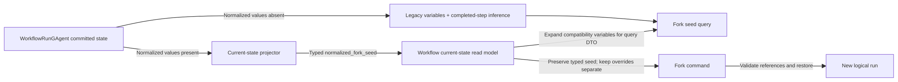
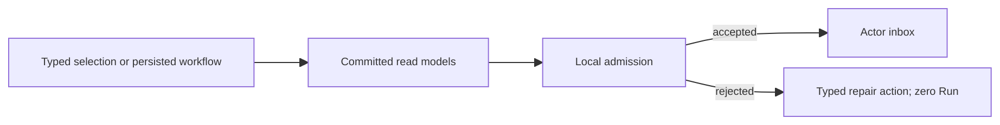

# 工作流引擎设计与实践

> 状态更新（2026-03-08）
>
> 当前权威实现已经从“`WorkflowGAgent + WorkflowLoopModule`”演进为“`WorkflowGAgent + WorkflowRunGAgent + WorkflowExecutionKernel`”。
>
> - `WorkflowGAgent` 只承载 definition facts，不再直接推进 run。
> - `WorkflowRunGAgent` 是单次 run 的唯一写侧事实源。
> - `Foundation` 统一只保留 `IEventModule<TContext>`；workflow step 模块实现 `IEventModule<IWorkflowExecutionContext>`，并通过 `WorkflowExecutionBridgeModule` 接入 Foundation pipeline。
> - `IEventContext` 是共性根接口；`IEventHandlerContext` 与 `IWorkflowExecutionContext` 只在能力上分化。
> - `WorkflowExecutionKernel` 已替代 `WorkflowLoopModule` 负责主循环推进。
>
> 下文保留了大量 DSL 与原语说明；凡提到旧的 `WorkflowLoopModule`/`WorkflowGAgent` 执行职责，均以上述现状为准。

这份文档回答三个问题：

1. 为什么需要工作流引擎（`Aevatar.Workflow.Core` + `IEventModule<TContext>`）？
2. 代码里怎么实现的？
3. 实际开发时怎么用？

---

## 一、它解决了什么问题？

普通 Agent 模式下，收到事件 -> 写固定代码处理 -> 发布下一个事件。直接但有两个限制：

- **流程变更成本高**：改一次步骤顺序就要改代码
- **复用性差**：`if/while/并行/投票` 这些控制逻辑会重复出现在很多 Agent 里

工作流引擎的思路：

- 把流程控制能力做成通用模块（Event Modules）
- 把业务流程写成 YAML（可配置）
- 让 `WorkflowGAgent` 负责 definition 绑定，让 `WorkflowRunGAgent` 在运行时装配模块并驱动流程

一句话：**硬编码 Agent 适合固定逻辑，工作流适合可编排、可调整、可复用的流程逻辑。**

口径先说清楚：

- workflow 运行主链路建立在 `EventEnvelope` 消息流之上。
- `EventEnvelope` 在这里是 runtime message envelope，不等于 Event Sourcing 的领域事件记录。
- `WorkflowRunGAgent` / `WorkflowGAgent` 只有在显式 `PersistDomainEventAsync(...)` 时，才把领域事实写入 EventStore。
- 定时触发属于 Aevatar workflow runtime 能力；NyxID 只保留 credential/proxy/audit 职责，ORNN 只保留 deterministic skill/payload-builder 职责。
- 认证 webhook start-run 是 Host/Adapter 触发面：raw JSON、HMAC、route binding 与 prompt mapping 留在 Host；进入应用层后只使用 typed `WorkflowChatRunRequest` 与 `WorkflowExternalIngressContext`。

---

## 二、核心概念

### WorkflowGAgent / WorkflowRunGAgent

当前实现下，workflow 职责拆成两个 Actor：

1. `WorkflowGAgent`
   - 持有 workflow YAML（definition facts）
   - 解析 YAML、校验结构、维护版本与编译结果
   - 作为 definition/source actor 被解析与绑定
2. `WorkflowRunGAgent`
   - 一次 run 一个 actor
  - 按 `roles` 创建 run-scoped role actor 树；`agent_kind` 由 Foundation runtime 解析，省略时默认 `workflow.role-agent`
   - 通过依赖推导（`IWorkflowModuleDependencyExpander`）确定所需模块，经 `WorkflowModuleFactory` 创建并安装
   - 收到 `ChatRequestEvent` envelope 后先把 exact `StartWorkflowEvent` 作为 `WorkflowRunExecutionStartedEvent.pending_start_workflow` 同原子提交，再 self publish；首次 kernel checkpoint 清除该 intent，activation 与 committed-publication recovery 会补发未完成启动
   - fork/resume-from-step seed 只走 request-level `WorkflowChatRequestEvent.fork_seed -> StartWorkflowEvent.fork_seed`；run bind 只表达 definition/run binding，不携带 seed。
   - run lineage 是 `WorkflowRunGAgent` owned committed fact，不从 route、actor id、graph/topology、workflow name 或 ID 前缀推断。`WorkflowRunLineage` 分离 retry/fork 与 `workflow_call` parent/child 关系，并始终使用可路由 public `runId`；actor address 只作为可选寻址信息保留。legacy 或未携带 lineage 的 run 必须显式返回 unavailable/legacy-unavailable。
   - 由 `WorkflowExecutionKernel` 推进 `StepRequestEvent -> StepCompletedEvent -> WorkflowCompletedEvent`

```
BindWorkflowDefinition(yaml)
  -> WorkflowParser.Parse (YAML -> WorkflowDefinition)
  -> WorkflowValidator.Validate (结构校验)
  -> BindWorkflowRunDefinition(yaml/run binding + capability admission plan)
  -> InstallCognitiveModules on WorkflowRunGAgent:
       IWorkflowModuleDependencyExpander[]: 推导模块名集合
       WorkflowModuleFactory: 按名称创建实例
       IWorkflowModuleConfigurator[]: 配置实例
       WorkflowExecutionBridgeModule: 接入 Foundation 事件管线
```

### Normalized execution state rollout

`workflow.run` 的 state schema v1 把执行值的引用身份从 legacy string map 中分离出来；schema v2 在此基础上增加 author-directed value lifecycle、digest replay evidence 与 release tombstone。`WorkflowExecutionKernelState.normalized_values` 是否存在是完整的 legacy/normalized 判别；业务 state 不再复制 runtime schema version，版本轴只来自 `RuntimeActorIdentity.state_schema_version`。

Normalized state 包含四类 actor-owned fact：

1. `canonical_values`：每个被接受的生产实例都有唯一 `value_id`，即使文本内容相同也不合并；同时记录 producer step 与 execution id。
2. `bindings`：expression-visible key 到 canonical value 的 typed alias，并区分 step output、current input、assigned value 与 internal output。
3. `completed_steps`：显式完成 ledger，保存 output/assigned value 引用、success/error、branch/next step、annotations、usage 与 JSON alias 来源；不再用“任意非保留 variable key”猜完成态。
4. `next_value_sequence` 与 `current_step_input_value_id`：保证新引用单调分配，并让 retry/continuation 复用精确输入实例。

legacy `variables/current_step_input` 字段继续用于未采用 v1 的 run 与兼容读取，但不承载 normalized 引用身份。v0 -> v1 migration 只 clone 原 Protobuf state 并写入 runtime adoption receipt，不从历史字符串制造 provenance；因此已存在的 legacy run 仍按 legacy representation 读取。采用 receipt 之后，每个新的 logical run/fork mutation 都必须重新通过 live `WorkflowNormalizedStateWritesV1` fleet gate；gate 撤销不会破坏已提交 normalized state 的读取，也不会阻断 active-run resume 或 duplicate redelivery。

schema v2 的 author contract 是 step-level typed sub-message，不进入 `parameters` 或其他 bag：

```yaml
steps:
  - id: reduce
    type: transform
    value_lifecycle:
      release_variables_after_success:
        - raw_pages
```

`release_variables_after_success` 只允许顶层 step 声明非空、去重的 author-owned variable name；`input`、step id、`steps.*`、`workflow.usage.*`、`workflow_call.*` 等 engine-owned key 均在 definition validation 阶段拒绝。legacy run/fork、nested lifecycle 与 dynamic definition replacement 不得 opt in 或静默降级。新 lifecycle run/fork 必须同时具备 schema-v2 immutable adoption receipt 和 reader contract v2 的 live fleet admission；v1 receipt 只继续授权原 normalized-state 语义。`WorkflowRunStateV1ToV2Migration` 通过连续 migration chain 为既有 accepted/inherited completion 建立 SHA-256 + UTF-8 byte-size evidence，并删除只被 replay ledger 引用的历史 raw payload；它不猜测 author release 或 value identity。

release 在 successful completion、usage 与 compensation facts 已接受后、下一 step dispatch intent 建立前执行。runtime 只通过 typed binding `variable name -> value_id` 解析目标：同一 identity 的全部 alias 一次性失效，同文本但不同 `value_id` 的值不受影响。active current value、pending output reference、pending internal dispatch 与 actor-owned compensation ledger 都是 pin；任一目标缺失、仍 live 或被 compensation pin 时，整组 release 不产生部分变更。相同 step/execution 的 redelivery 幂等；直接读取已释放 author alias 或 `steps.<id>.*` 返回 typed lifecycle failure，变量枚举跳过 tombstone。显式 request override 可以用新 canonical identity 恢复同名 author variable，但不能复活旧 identity。tombstone 覆盖且仅覆盖其记录的 `value_id`：循环 workflow（如每轮 fetch → reduce → release 同名中间值）中后续 step 完成可以把同一 author variable 重绑到新 canonical value，新值保持可读，并可在该轮 release 点再次释放；每个已释放 canonical value 保留其 typed (step, execution) tombstone，因此任一历史 release 的迟到 redelivery 都不会误删后续迭代的新值。

authoritative state 保留 canonical/alias tombstone，并清空 raw `value`；accepted/inherited completion 以 typed digest、provenance 与 control fields 完成 exact replay 校验。digest evidence 与它允许的 raw payload 裁剪同属 schema v2 事实：kernel 只在 runtime schema context 持有 exact v2 adoption receipt 时才写入 completion digest（`WorkflowValueReplayEvidence.Digest`）；仍是 v1 identity 的 actor 保持 raw canonical value 供 v1 reader 精确 replay（`WorkflowValueReplayEvidence.RawValue`），不得由本地 flag 或 wire 字段推断。normalized fork seed 原样 round-trip tombstone 与 digest，兼容 variable expansion 不恢复 released raw alias。digest 仅是 actor-authoritative control evidence：`WorkflowRunCommittedStateRedactionHook` 对 committed `state_event` 和完整 `state_root` 都移除 authoritative digest bytes/size，只保留 typed redacted/released outcome；current-state projector/query DTO 仅暴露 terminal `WorkflowValueLifecycleFailureKind`，不暴露 digest。`CommittedStateEventPublished.state_root` 仍是完整 current-state snapshot，本机制不引入 delta publication 或 query-time replay。

Workflow report 对带 typed `execution_id` 的 `StepRequestEvent` 采用 document-local immutable evidence：以 `(step_id, execution_id)` 生成不透明 `evidence_id`，在 `request_evidence_by_id` 中只保留一份经过 audit redaction 的完整参数，并记录 source/retained UTF-8 bytes、retained SHA-256 与 source event identity。latest step、`step.request` timeline 和 failed-attempt snapshot 只保存 typed `WorkflowStepRequestEvidenceReference`；query mapper 按该引用恢复现有 report/timeline DTO，retry 同一 `step_id` 的不同 execution 始终解析到各自历史参数。相同 `(step_id, execution_id)` 若出现不同 retained content 必须 fail closed，不能覆盖既有 evidence。缺失 `execution_id` 的 legacy event 保留旧 inline 形态，不允许伪造 attempt identity；Elasticsearch 对 evidence store、引用和 legacy payload map 全部 `enabled:false`，mapping 变更继续走 fingerprint/reindex/alias lifecycle，不在 query path 修复。

补偿完成采用两段 durable handoff。`WorkflowExecutionKernel` 在调用 run actor 前先写入 `PendingCompensationOutcome`，保存 exact `StepCompletedEvent + compensation execution id`；`WorkflowRunGAgent` 提交 `CompensationStepCompletedEvent` 时同步写入 actor-owned `PendingCompensationCompletion`，直到下一条 `CompensationRequestEvent`、`WorkflowCompensationCompletedEvent` 或 `WorkflowCompensationFailedEvent` 提交后才清除。actor 返回后，kernel 必须先把结果保存为 typed continuation oneof（next compensation request、terminal completion 或 completed-without-continuation），再执行 self publish 或 terminal cleanup。这样同时覆盖“actor outcome 已提交但 kernel continuation 尚未保存”和“continuation 已保存但 publish/terminal handoff 尚未完成”两个 crash window。

activation 先恢复 kernel 的 pending compensation outcome，并使用 actor pending completion、当前 cursor/execution fence 与已提交 terminal fact 对账；不得重新 dispatch 已完成的 physical compensation step。多 entry ledger 必须复用 actor 已提交的下一条 execution id、idempotency key 与 canonical captured-value provenance。transport 仍允许 at-least-once delivery，但同一 compensation completion domain fact 只能提交一次；terminal cleanup 必须在同一次 state save 中清除已完成 step 的 compensation execution fence。



Projection/fork 边界不通过相等的字符串内容重建 value identity：current-state projector 原样携带 typed `normalized_fork_seed`；query mapper 只为旧 application DTO 展开兼容 variable view 与 completed step ids；真正的 fork handoff 保留 normalized seed，并把 caller overrides 单独传递。目标 run 拒绝同时携带 normalized seed 与 expanded legacy variables，校验所有 canonical reference 后恢复 state；override 会移除同名 typed binding，再创建 `RequestOverride` canonical value 并写入新的 typed binding，不回写 flat literal variable。legacy read model 没有 normalized seed 时，继续走原有 variables/completed-step path。

### External operation admission proof handoff

NyxID external operation 使用一条 actor-owned proof 主链，step selector 是 `PublishedEndpoint(endpoint_id)` 或 `AuthoredRequest(request_contract_digest)`。`PublishedEndpoint` 持久化 `NyxIdOperationSelector { user_service_id, endpoint_id }`；definition admission 读取 NyxID `/api/v1/mcp/config`，shared typed adapter 只接受 exact non-generic UserService endpoint，并生成 server-owned service slug、method、path template、parameter/body contract、typed response policy、source stamp 与 digest。`AuthoredRequest` 持久化 typed request contract proposal；definition admission 只读取 exact UserService inventory，且必须由 authenticated binder 确认当前 digest 与 risk，actor 才能持久化 `NyxIdExplicitRequestGrant` 并提交 proof。NyxID `catalog_digest` 是 `PublishedEndpoint` 的 normalized descriptor revision；Aevatar 不保存另一份 UserService/OpenAPI catalog，也不以 observation time 或本地 counter 冒充 revision。

Studio 的 authoring draft 是 proof 主链之前的编辑态，不是运行态。`/api/chat` 先发现 structured external capability；没有 exact descriptor 时，可以查询官方文档或推导最小 authoring shape，但只能保存不含 step-level `capability` 的 unresolved YAML。`aevatar_create_member_workflow_draft` 创建或复用 Team workflow member shell，并使用独立稳定 draft identity 保存 YAML；返回 canonical Studio URL、`runnable=false`、`binding_status=not_bound`、Accepted command receipt、`projection_pending` readiness 和 `NYXID_OPERATION_SELECTION_REQUIRED`。

unresolved draft 不调用 bind、schedule、provision、publish、run 或 `nyxid_proxy`。搜索结果、推测 API 形状、display text、slug、method 或 path 都不能构造 selector/proof。后续有 exact MCP descriptor 时，作者才能写入 `PublishedEndpoint` 的 `user_service_id + endpoint_id` selector；已知静态 HTTP contract 时，作者可写入 `AuthoredRequest` typed request contract proposal，但仍必须经 exact inventory admission 与 authenticated binder grant。两条路径都重新进入正式 definition admission；admission 通过后仍需独立 binding/publication，运行时继续按 committed proof 重验。

```mermaid
%%{init: {"maxTextSize": 100000, "flowchart": {"useMaxWidth": false, "nodeSpacing": 10, "rankSpacing": 50}, "themeVariables": {"fontSize": "10px"}}}%%
flowchart LR
    A{"Step selector"}
    A -->|"PublishedEndpoint(endpoint_id)"| B["MCP descriptor"]
    A -->|"AuthoredRequest(request_contract_digest)"| C["Exact inventory at bind"]
    C --> D["Authenticated binder confirmation + NyxIdExplicitRequestGrant"]
    B --> E["Actor-owned WorkflowGAgent v4 invocation_admissions"]
    D --> E
    E --> F["BindWorkflowRunDefinitionEvent.capability_admission_plan"]
    F --> G["WorkflowRunState.capability_admission_plan"]
    G --> H["StepRequestEvent.external_invocation"]
    H --> I["WorkflowToolExecutionRequest.InvocationAdmission"]
    I --> J["AgentToolExecutionContext.OperationAdmission"]
    J --> K{"Committed selector"}
    K -->|"PublishedEndpoint"| L["Runtime MCP endpoint-digest revalidation"]
    K -->|"AuthoredRequest"| M["Validate proof + grant; no MCP/OpenAPI/inventory re-read"]
    L --> N["NyxIdAdmittedRequestBuilder"]
    M --> N
    N --> O["Exact NyxID Proxy HTTP request"]
```



`WorkflowRunActorPort` 从权威 definition binding 复制 plan 到 `BindWorkflowRunDefinitionEvent`，`WorkflowRunGAgent` 把它提交到本 run 的 state。`WorkflowExecutionKernel` 与 admission 共用 compiler，为 ordinary、nested、`foreach`/`for_each`/`foreach_llm` 和 `while`/`loop` 派生同一稳定 call-site；`ToolCallModule` 只从 run actor state 解析该 call-site 的唯一 proof。missing plan、missing/duplicate call-site、selector mismatch 或 tool mismatch 都在 dispatch 前 fail closed。foreach backpressure、while state 与 tool approval suspend/resume 都复制同一个 typed invocation，不按动态 item id 猜 proof。

AI adapter 把当前 proof 映射到 provider-neutral `AgentToolExecutionContext.OperationAdmission` with one typed identity union: `PublishedEndpoint { endpoint_id }` or `AuthoredRequest { request_contract_digest }`. An authored digest is never stored in `endpoint_id`, and no synthetic/empty operation ID exists. The proof carries typed `risk / approval / enforcement_owner / allowed_execution_modes`; authored requests additionally carry their matching `NyxIdExplicitRequestGrant`, and both participate in the admission digest. The single admitted-request builder accepts only declared `path_params`、`query`、`headers`、`body`; response mode is fixed by the proof. NyxID Proxy wire receives the server-derived route constraint, exact `user_service_id`, and HTTP request; endpoint IDs and digests never enter the wire.

Dynamic LLM exposure、definition admission 与 runtime authorization are separate policies. `nyxid_operation` admission reads its MCP descriptor; `nyxid_request` admission reads only authenticated exact UserService inventory and requires the independent binder grant. An authored request can bind an explicit typed risk into its v2 digest; omitted risk keeps the method-derived v1 contract. Binder-confirmed `POST + READ_ONLY` is interactive-only, while durable `WRITE` or `DESTRUCTIVE` authored requests are allowed only when the proof, grant, exact UserService durable catalog evidence, and allowed execution mode all match. Neither selector expands normal current-turn tool exposure. `Shadow` only records a proofless/invalid-policy decision; `Enforce` rejects a managed workflow before token resolution, file ingress, or proxy HTTP when proof, grant, execution mode, or local digest is invalid.

Runtime does no raw OpenAPI read, definition-actor/read-model/event-store side read, admission refresh/priming, or process-local proof registration. `PublishedEndpoint` retains current MCP exact endpoint-digest revalidation. `AuthoredRequest` reads neither MCP nor UserService inventory: before dispatch it validates its committed plan, request identity, matching explicit grant, execution mode, and local digests, then sends exactly one exact NyxID proxy route using exact `user_service_id` and the server-derived route slug constraint. There is no slug-only fallback.

#### Authored request approval and resume

`explicitRequestConfirmations` confirms the exact authored request contract and attests its classified risk when binding. It is admission evidence, not blanket approval for future executions and not an operation-scoped NyxID grant. Trusted `GET / HEAD / OPTIONS` requests may execute without Aevatar generic tool approval. Authored `POST / PUT / PATCH` writes and `DELETE` requests keep `Approval.Required` in the proof; every interactive `WorkflowToolCall` with that policy suspends through `aevatar.tool_approval.pending` before any downstream request, just like other actor-owned tool approvals. The exact nested approval identity resumes only that pending call; after approval, the outbound request remains governed by NyxID `auto_allow / grant / per_request / deny`.

Scope-service callers approve or reject the pending call through `POST /api/scopes/{scopeId}/services/{publishedServiceId}/runs/{runId}:resume`:

```json
{
  "stepId": "write_record",
  "approved": true,
  "toolApproval": {
    "executionId": "exec-alpha",
    "toolCallId": "call-alpha",
    "approvalRequestId": "approval-alpha"
  }
}
```

The identifiers must come from the typed pending-approval event or read model; callers must not infer them from route identities or string patterns. Aevatar binder admission alone does not turn authored writes into unattended or scheduled operations. Durable authored requests additionally require current `DURABLE_AUTHORIZATION_CATALOG` evidence for the exact UserService plus the schedule operation-authorization gate before credential materialization or schedule actor creation; a UserService identity alone does not prove durable authority.

`executionId / toolCallId / approvalRequestId` are not valid top-level aliases. A request that places any of them at the top level is rejected with `400 INVALID_TOOL_APPROVAL_RESUME_REQUEST`; when `toolApproval` is present, all three nested fields are required. A resume without `toolApproval` remains valid for ordinary human input or human approval steps.

`202 Accepted` confirms only that the validated command entered the target run actor inbox. It does not claim that the continuation was applied or that a new read model version is already visible. A typed approval identity that no longer matches the actor-owned pending call preserves the pending call and commits `WorkflowToolApprovalResumeRejectedEvent`; the run timeline and Observatory expose this as `tool_approval_resume_rejected` instead of silently ignoring the command.

Published endpoint creation is owned by NyxID, not by Aevatar workflow save/bind. A NyxID admin or the catalog service creator must create the endpoint contract or run endpoint discovery; seeded third-party services normally receive endpoint contracts from operator-maintained catalog overlays. Aevatar consumes only the resulting exact `user_service_id + endpoint_id` MCP descriptor and still requires separate, current owner-scoped durable authorization catalog evidence for durable admission.

### Admission v6、v5 与 v4 forward compatibility

`external-capability-admission.v6` 只以 call-site scoped `invocation_admissions` 表达当前事实，并把 response projection（包括 `map` 的 typed nested operation list）封存到同一个 admission digest。`map` 只允许一层、保序且不改变 cardinality；任一元素投影失败、总 operation nodes 超过 16、输入数组超过 1024 项或最终结果超过 64 KiB 都在 durable persistence 前 fail closed。proto field 4 `external_capabilities` 是 deprecated v2 deserialization slot；v6 creation 保持为空，validation 对非空值 fail closed，禁止双事实源。Published-endpoint proof 必须带 `NYX_ID_MCP_CONFIG` source stamp; authored-request proof 与 canonical code-execution proof 必须带 `NYX_ID_USER_SERVICES` source stamp。Authored request 还必须带 matching typed binder grant。Durable NyxID 与 code-execution capability additionally require `DURABLE_AUTHORIZATION_CATALOG`; that source stamp is evidence for the exact service grant, not a replacement for the binder grant, execution-mode proof, or schedule operation-authorization contract。

既有 v4 plan 保持可执行，不能因新增 platform code-execution proof 迫使用户重绑普通 NyxID capability。Persisted v4 revalidation 对原有 NyxID invocation 继续执行完整 proof、source、digest 和 execution-mode 校验；只忽略 v4 schema 当时无法表达的 `code_execute` admission call site，该调用仍在 runtime 每次通过 canonical resolver 做 exact route、access、active 和 delegation-policy 复核。所有新 live admission 写 v6。V2、v3 与未定义强制 response-persistence boundary 的 v5 均要求 rebind。

升级采用 forward-only 语义：旧 serving definition/run 不热替换；持久化 v2/v3/v5 plan 一旦进入 reprepare、publish 或 rebind，就在解析旧 authoring 前返回 typed `CAPABILITY_ADMISSION_REBIND_REQUIRED` 与 rebind remediation，要求使用 `PublishedEndpoint(endpoint_id)`、带独立 binder grant 的 `AuthoredRequest(request_contract_digest)` 或 canonical platform code-execution proof 重新 admission 并创建 v6 revision。runtime 不把旧 raw route 或 OpenAPI identity 当 fallback，也不 query-time 迁移。明确的 `schema_version` 字符串是版本边界。

Mainnet 的 `Enforce` startup gate 只读 actor-scoped current-state read models，不 activate、prime、replay 或 mutate projection。它分页校验所有未被 typed deployment state 明确标记为 deactivated 的 definition binding，以及所有非 `completed / failed / stopped` run current state；每个对象都必须携带完整且 digest-valid 的 v4/v6 plan。为允许 v6 的两阶段滚动升级，startup inventory 可暂时接受原始 digest 有效且按当前定义完成全部 proof 校验的 v5 plan，但这不把 v5 恢复为 supported runtime schema：direct tool dispatch、approval resume、prepare、publish 与 schedule 仍 fail closed 并要求 rebind。已 deactivated service definition 可作为历史 revision 留存；缺 deployment relationship、active/failed/unknown deployment、普通 definition 和非终态 run 一律保守校验。失败使用稳定 blocker `CAPABILITY_ADMISSION_REBIND_REQUIRED`，仅含总数与每类最多八个 actor ID sample。`Shadow` 不执行 startup inventory scan。

### Local artifact compatibility before actor lifecycle

Every publish, deployment, chat, schedule, and fork producer supplies a typed, non-`Unspecified` `ExpectedExecutionMode`. The value is protocol evidence owned by that producer; it is never inferred from `scheduleId`, `runOrigin`, an actor ID, a route position, or the admission plan being checked. Definition and run bindings persist the same value, and a run cannot change mode after its first binding.

The service revision catalog treats a workflow prepared artifact whose deployment plan cannot pass `WorkflowServiceDeploymentPlanIntegrity` as unavailable. A normal invocation, schedule fire, runtime activation, or query never repairs it. An operator or authoring flow may send the explicit `PrepareServiceRevisionCommand`; the revision actor then re-runs the implementation adapter from its committed authoring spec and commits `ServiceRevisionPreparedArtifactRepairedEvent`. That event replaces only the prepared artifact/hash/endpoints, preserves `Prepared` or `Published` status and the published timestamp, and republishes the actor-owned revision observation. Legacy authoring that predates both a persisted capability plan and an expected mode remains the historical Interactive producer during this explicit prepare. A persisted v2/v3 plan, a mode disagreement, or an incomplete explicit-request identity still fails closed and requires a new authoring admission/revision.

Prepared-artifact repair does not hot-replace a serving definition actor. After repairing a revision that already has an Active deployment, the operator must explicitly deactivate and activate that revision so new Runs bind from the repaired typed artifact. The deployment and actor addresses remain opaque to callers; invocation readiness does not use query-time actor inspection or lifecycle priming to hide an unrepaired artifact.

The startup workflow catalog is an explicit Interactive producer. Built-in and file-backed registrations carry `ExpectedExecutionMode=Interactive`; the startup materializer passes that same value to capability admission and `BindWorkflowDefinitionEvent`, and rejects `Unspecified` or a plan with a different mode before actor creation. File loading remains in the hosted service's normal `StartAsync`, while actor materialization runs in `StartedAsync` after Kestrel and Orleans have completed their own start phase, so a slow committed observation cannot prevent the liveness port from binding. Before dispatch, startup prepares an actorized definition-bind observation projection and attaches an explicit session sink; it reports startup completion only after that projection delivers the correlated committed bind event, then detaches and releases both leases. Observation-unavailable and bind-not-committed outcomes receive a bounded typed retry; invalid execution modes, admission drift, and rejected dispatch remain fatal. This explicit startup/repair path may advance a legacy actor from `Unspecified` to `Interactive` once; an actor already committed to `Durable` remains incompatible and fails startup instead of being overwritten. Normal chat/run resolution never treats `Unspecified` as a wildcard and never derives mode from the admission plan.

Before creating, linking, binding, repairing, registering, or dispatching a workflow actor, the Application preflight parses the root YAML and every distinct inline workflow with the canonical parser, evaluates external invocations with the canonical dependency evaluator, and validates the persisted capability plan locally. It performs no network call, catalog lookup, source-freshness check, event replay, projection priming, repair, or invocation-time `RevalidatePersistedAsync`. The authoritative `WorkflowRunActorPort` repeats this pre-mutation gate; exact service-run dispatch also performs it before service-run registration so a deterministic rejection leaves zero Run artifacts.



The stable local outcomes are deliberately bounded and safe:

| Condition | Stable code | Safe message | Repair action |
| --- | --- | --- | --- |
| Invalid root or inline YAML | `WORKFLOW_DEFINITION_INVALID` | Workflow definition is invalid. | Update and rebind workflow. |
| Retired direct NyxID authoring | `NYXID_OPERATION_AUTHORING_MIGRATION_REQUIRED` | Workflow uses a retired NyxID tool contract. | Update and rebind workflow. |
| Missing or legacy plan | `CAPABILITY_ADMISSION_REBIND_REQUIRED` | Workflow capability admission must be rebuilt. | Update and rebind workflow. |
| YAML/plan or execution-mode mismatch | `CAPABILITY_ADMISSION_REBIND_REQUIRED` | Saved workflow and capability admission no longer match. | Update and rebind workflow. |

The exception exposes only the stable code and safe message. YAML, selectors, credentials, upstream response bodies, exception types, and stack traces do not enter state, projection, logs, or API summaries.

### Event Module

可插拔的事件处理器（实现 `IEventModule<TContext>`），四个要素：

- `Name`：模块名（如 `"llm_call"`）
- `Priority`：数值越小优先级越高
- `CanHandle(envelope)`：判断是否处理该事件
- `HandleAsync(envelope, ctx, ct)`：处理逻辑

当前分层里：

- `Foundation` 管线使用 `IEventModule<IEventHandlerContext>`
- workflow step 模块使用 `IEventModule<IWorkflowExecutionContext>`
- 两者共享 `EventEnvelope` 与 `IEventContext` 根抽象

模块和静态 `[EventHandler]` 方法一起进入统一事件管线。可以在不改业务代码的情况下替换流程行为。

### Scheduled Dispatch API

第一版定时触发只提供 API 配置面，不提供 UI。主 API 路径为 `/api/schedules`，支持 create/update/enable/disable/delete/list/get/preview/run-now。旧 `/api/workflow-schedules` 兼容入口已删除；workflow 内部调度只通过 actor-owned scheduled dispatch 应用契约进入统一主链路。

运行边界：

- `ScheduledDispatchGAgent` 是每个 schedule 的唯一写侧事实源，持有 cron、timezone、enabled、typed target descriptor、dispatch headers、next fire lease 与 recent fire records。
- scheduled `ChatRequestEvent.Prompt` 可以使用 schedule-owned fire-time 模板。模板原文随 target descriptor 持久化，只在每次 fire 的 payload clone 上展开；输入必须取 actor 权威的 logical `scheduledFireAtUtc + timezone`，禁止改用 callback 到达时间、Host 当前时间、LLM 推测或客户端 header。自动补跑继续使用原计划 occurrence，`run-now` 使用本次手动触发时刻。
- fire-time 模板仅在 JSON string value 中接受 `{{@schedule.run_date}}`（当地 `yyyy-MM-dd`）、`{{@schedule.run_year}}`、`{{@schedule.run_month}}`（不补零）、`{{@schedule.days_until_month_end}}`（不含当天）、`{{@schedule.fire_at_utc}}` 与 `{{@schedule.timezone}}`。create/update/ensure 以及 Team automation credential operation 在产生副作用前校验模板；未知 schedule placeholder、非法 JSON、property-name placeholder、超限模板均 fail closed。没有 schedule-owned placeholder 的现有 prompt 与非 Chat protobuf payload 保持原样。
- workflow 内部的 `self_reschedule` / `schedule_workflow` step 只向 `ScheduledDispatchGAgent` 发送幂等 ensure 命令；跨 run schedule fact 不归 workflow run actor 持有。创建不同 schedule 时，step 只能复用可信 HTTP ingress 或 Scheduled Dispatch 写入 run actor 的 typed caller NyxID authority，并把该 subject + capability scope 映射为 `SenderNyxId` source；`scopeId` 只表达 Aevatar 资源边界，禁止把它构造成 NyxID `external_user_id`。没有 typed caller authority 的 legacy/untrusted run 必须 fail closed。更新当前 run 所属 schedule 时省略 auth，由 schedule actor 保留其已有 typed source，禁止用本次 run 的 bearer 覆盖 schedule auth。
- workflow schedule ensure 同步结果只表示 `accepted` command receipt（schedule id、schedule actor id、command id、correlation id）；readmodel freshness 通过 projection/readmodel 观察，不能由 step completion 暗示强一致。
- 外部 submit/poll job 必须建模为 split-run 模板，而不是 workflow core primitive。submit run 提交一次外部 job 并把 `job_id`、`idempotency_key`、确定性 `schedule_id`、poll cadence、deadline 与 attempt 预算交给 poll workflow；`ScheduledDispatchGAgent` 持有 schedule fact；每个 poll run 查询一次状态；终态分支用同一 `schedule_id` 幂等 ensure `enabled=false` 来停止后续 poll。
- `await_job` / `async_job` 不是 runtime 原语。`wait_signal` 最多持有一个 actor-owned durable callback/signal lease，当前上限为 24 小时；它不用于把 submit/poll job 扩成同 run long polling。poll handoff 的业务字段必须在 workflow 参数或 prompt payload 中显式表达，不能塞进 dispatch `Headers` 或泛化 `metadata`。
- 定时唤醒走 `ScheduleSelfDurableTimeoutAsync`，在 Orleans runtime 下由 durable callback/reminder 机制承载；回调只向 schedule actor 发 fire command，不在中间层保存 schedule 状态。
- schedule actor 只负责计算下一次 fire、生成幂等 key 并投递 prepared target envelope；workflow、GAgent service invocation 与 scripting 目标准备由 application/infrastructure adapter 承载，不进入 schedule actor core。
- workflow schedule 的 `WorkflowName`、`Prompt`、`ScopeId` 仅存在 typed workflow target descriptor 中；service invocation 与 envelope target 使用各自 typed target descriptor；dispatch `Headers` 只保留传输扩展。
- service invocation schedule auth 支持且仅支持一个 active typed credential source：HTTP/API 只接受 `senderNyxId` 或 `scopeOwnerNyxId`；trusted internal provisioning 还可写入 `durable` 或 `scheduledInvocationAgentKey` typed reference。HTTP/API、application service、actor port 与 runtime dispatch 均不接受新的 `durableSenderBearerToken`；该 proto 字段仅作为旧事件读取入口保留，reducer 必须把旧 raw bearer 丢弃并标记 legacy blocked，fire 时失败关闭并要求用 typed credential source 重新配置。raw bearer 不得写入 schedule actor current state、dispatch command、`ScheduledDispatchDocument` read model、query response 或 list/get API 回显。
- service invocation schedule 的 required-credential 判定由统一 `IScheduledDispatchCredentialRequirementPolicy` 承担。Application 在 create/ensure/update 进入 actor 前按 typed target kind 校验；ensure/update 省略 auth 时只能用既有 schedule readmodel 的 credential source kind 通过预检，command 仍保持 auth absent，最终由 actor-owned state 完成保留并重新校验。`ScheduledDispatchGAgent` 持久化 `credential_requirement_target_kind` 作为 actor-owned input classification，并在 fire/run-now 使用最终状态重新校验。`Envelope`、`StaticService`、`ScriptingService` 默认允许 no-auth；`WorkflowService` 与 `Connector` 必须带 typed service invocation credential source。Host 只负责把 HTTP body、认证 principal 与 service revision snapshot 映射成 typed config，不保留 endpoint-private binding/exchange gate；revoked binding 与 scope mismatch 仍由 downstream credential exchange fail closed。
- workflow caller state 只保留三种互斥 typed source：direct bearer 的 run-scoped secret reference、tag-7 durable secret reference、或 refreshable NyxID authority。scheduled workflow fire 把 typed subject + capability scope 交给 service-dispatch consumer；consumer 可以把它归一化为 NyxID authority，或把交换得到的短期 token 投影为 scheduled durable handle。connector、每次 LLM dispatch/stream、每次 tool execute 都必须在真实外呼前解析对应的 presentation token；authority 即时签发结果和 scheduled durable handle 解析结果都必须标记为 `ProxyDelegation`，不能降级为 `Unspecified`。authority 路径首版不缓存、不写回 token，也不回读 schedule actor/event store。缺失或不完整 authority、不可用 provider、binding revoked/scope mismatch 均 fail closed。direct bearer 与非 scheduled 的 tag-7 durable secret 保持原有非刷新语义。consumer-first 混部期间，只有包含完整 embedded authority 的旧 scheduled ref 可在恢复边界归一化；authority 缺失且不是合法 scheduled durable handle 的 ref 不得回退为可调用凭据。caller authority 与 token 都必须从 committed projection/readmodel payload 中移除。
- trusted internal `ScheduledInvocationAgentKey` 已经是 vault-backed credential。workflow fire 必须 exact 复用其 `SecretReference.Ref/Purpose/OwnerScopeKey + ApiKeyId` 构造 borrowed `DurableCallerCredentialRef(SourceKind=ScheduledDispatch)`；service dispatch 必须把 scheduled、channel 与 webhook Agent Key purpose 映射为独立 `AgentKey`，不得再映射为五分钟 `ProxyDelegation`，也不得把 Agent Key 冒充 source-readable user bearer。dispatch 不得复制或重新 put secret；borrowed handle 不归 workflow run 所有，因此 dispatch failure 与 run completed/stopped 都不得 revoke。每次 LLM/tool/connector 外呼仍统一通过 `TryGetCallerCredentialAsync` late resolve，使 rotation 生效，并对 revoke、expiry 或 identity mismatch fail closed。raw key 只进入本次 NyxID proxy request，不进入 actor state、event、projection、log 或 API response。`code_execute` 在这种 credential 下只接受 admission proof 固定的 exact UserService ID，不读取 `/user-services`，并由 NyxID proxy 对 `_nyxid_via` 与 Agent Key allowlist 做最终授权。
- scheduled `ChatRequestEvent` 只携带 typed caller credential source：vault-backed caller 使用 `caller_durable_credential` handle，refreshable NyxID caller 使用其中的 typed authority。interactive NyxID proxy ingress 可同时接收用途隔离的 delegation execution credential 与 source-readable user bearer；service invocation 必须以 `caller_nyx_id_credential_kind` 和 `caller_source_readable_nyx_id_bearer_token` 分别传递 credential purpose 与 supplemental source credential，禁止借用 `llm_control` / `metadata`，也禁止按 token 相等、header 优先级或 route 字面推断。两者进入 run 后必须分别转换成 run-scoped runtime-secret reference；delegation 默认只供下游 proxy execution，source-readable bearer 默认只供 identity/inventory/readiness。唯一窄例外是 interactive `PlatformBuiltIn code_execute` admission：NyxID 为 Aevatar 签发且带 `account:read` 的 delegation credential可送回 NyxID 读取 caller-visible route inventory；runtime 仍把它作为 execution credential 并只调用 admission proof 固定的 exact UserService ID。scheduled Agent Key 不适用该例外。对 exact Agent Key `code_execute`，NyxID 转发 Agent Key 并注入 `sandbox:execute` delegation；Chrono 用短 token 认证执行请求，再把 Agent Key 作为 `NYXID_API_KEY` 注入隔离程序。短 token 不作为程序内 NyxID 凭据。该选择不得扩散到普通 connected-service、`nyxid_proxy`、LLM 或 managed Codex。caller raw token、raw Agent Key 与 authority 必须从 committed event、projection/readmodel payload、log 与 API response 中移除，任一 required reference 无法解析时整体 fail closed。没有 handle 的旧 run 继续走 legacy fallback，不热替换。外部 API 请求若自带 `caller_durable_credential` 必须 fail closed；projection/readmodel/log 只暴露 credential source kind。
- workflow fork 的 HTTP/automation 入口只构造 typed `WorkflowForkRunCommand` 并走 `ICommandDispatchService<WorkflowForkRunCommand, WorkflowForkRunAcceptedReceipt, WorkflowForkRunStartError>`；seed 来源读取 `IWorkflowRunForkSeedQueryPort` read model，不走 event-store replay 或 actor state side-read。
- public API identity fields 必须显式区分 `ScheduleActorId` 与 `TargetActorId`：`ScheduleActorId` 表示持有定时配置与 fire 事实的 schedule actor receipt，`TargetActorId` 表示最近一次或摘要中的投递目标；不得用一个 `ActorId` 混用 schedule actor receipt 和目标摘要。
- 幂等 key 格式固定为 `schedule:{scheduleId}:fire:{scheduledFireAtUtc:o}`，并随 scheduled fire dispatch headers 透传。
- schedule 查询只读取 `ScheduledDispatchDocument` read model；API 不读取 actor state，不在 query path replay event store。
- projection 使用 committed `ScheduledDispatchState` current-state payload 物化 read model，版本来自权威 actor committed version。

配置边界：

- cron 使用 standard 5-field format。
- timezone 为空时默认为 `UTC`，非空时必须能被 runtime `TimeZoneInfo` 解析。
- `Headers` 是 command dispatch headers，不用于承载 schedule 核心语义。

### Connected-Service Resource Fetch

Workflow runtime owns the canonical connected-service resource fetch use case. The only workflow-callable tool name is `workflow_connected_service_resource_fetch`; connected-service provider packages do not publish a same-name workflow tool.

运行边界：

- Tool arguments identify a narrow route with typed fields: `provider`、`operation`、`resource_kind`、`message_id`、`resource_key`。
- Workflow infrastructure resolves the route through registered `IWorkflowConnectedServiceResourceFetchAdapter` instances. Unsupported routes fail before any provider call.
- Provider packages only register binary adapters for their own public surface. The first Lark adapter exposes `lark/message_resource_download/image` and `lark/message_resource_download/file`.
- Downloaded bytes must enter workflow storage only through `IWorkflowFileIngressPort` with `WorkflowFileSourceKind.ConnectedServiceResource`; workflow commands, actor state, readmodels, logs, and tool results must not carry raw bytes or base64.
- The tool result is a sanitized `WorkflowFileRef` plus route facts. It does not expose provider response bodies, base64, or downloaded content.

### NyxID Proxy File Artifacts

`nyxid_proxy(response_mode=file_artifact)` is the only v1 public NyxID proxy binary download mode for workflow-managed runs. Missing `response_mode` and explicit `text` keep the existing string proxy behavior.

运行边界：

- `NyxIdProxyTool` owns response-mode parsing. Invalid modes fail closed; v1 does not expose `file_artifact_put`、`nyxid_binary_download`、provider-specific global download tools、`binary_base64` or `data_uri`.
- `response_mode=file_artifact` requires `GET`, no request body, a managed workflow runtime parent from typed `AgentToolRequestContext.Current.WorkflowRuntime`, a caller scope, and a host-registered `INyxIdProxyFileArtifactIngress`.
- The binary response is downloaded through `NyxIdApiClient.ProxyGetBinaryResponseAsync` with `ProxyFileArtifactMaxBytes` defaulting to 25 MiB and capped at 100 MiB. Content-length and streaming reads are bounded before workflow ingress.
- Persistence only goes through `IWorkflowFileIngressPort` with `WorkflowFileSourceKind.ConnectedServiceResource`; `nyxid_proxy` does not stage process-local handles or persist raw bytes itself.
- Success and failure results are structured JSON with `success`、`response_mode`、bounded source diagnostics, and a sanitized `WorkflowFileRef` projection on success. Results must not include raw bytes, base64, data URI, provider response bodies, or durable byte state.

### Workflow File Artifact Lifecycle

Workflow file artifacts use narrow ports with separate responsibilities:

- `IWorkflowFileIngressPort` writes bytes at Host/adapter ingress and returns a typed `WorkflowFileRef`.
- `IWorkflowFileArtifactReadPort` describes or opens an existing descriptor-backed artifact.
- `IWorkflowFileArtifactOwnershipPort` binds owner facts when a workflow run actor later claims an ownerless artifact.
- `IWorkflowFileArtifactCleanupPort` is cleanup-only lifecycle surface. It is triggered by Host background service, while the provider owns physical cleanup decisions.
- `WorkflowMultipartFileInputParser` is the shared Host/adapter boundary parser for multipart file input. It validates form shape and media constraints, returns raw payload JSON, `HasFiles`, and pending file bytes, but does not decide service kind and does not write artifacts by itself.

Runtime boundary:

- The artifact descriptor manifest is the readability commit record. Content without a descriptor is staged/incomplete and can be cleaned by the provider after its configured age.
- Workflow run ownership remains actor fact. Descriptor owner fields are only file-reference facts used by the artifact provider and do not replace actor-owned run state.
- Cleanup must be based on durable descriptor/index state. A provider must not depend on a process-local run/artifact registry, `actorId -> context` lookup, or query-time reconstruction to decide what to remove.
- `WorkflowChatRunRequest`、actor state、readmodels、logs、prompts 与 tool results continue to carry only `WorkflowFileRef` descriptors or sanitized derived fields. They must not carry file bytes, base64, multipart payloads, or provider raw response bodies.
- Scope service endpoints that accept multipart stream requests must resolve the service target first. Only workflow service targets may ingest pending files into artifact storage, and the owner scope must come from the path `scopeId`; static or scripting targets fail closed before artifact ingress.
- Host composition must fail closed for production/external backends. `WorkflowFileArtifacts:Backend=External` requires explicit registrations for ingress/read/ownership/cleanup ports; production policy rejects the implicit filesystem backend.
- The filesystem backend is the local/test concrete backend. Its cleanup removes expired descriptor-committed artifacts and stale staged directories without introducing a process-local artifact registry.

Workflow files can back a revisioned ContentArtifact without becoming the
ContentArtifact authority. The Host adapter accepts only
`backingObject.provider=workflow-file`, maps `objectKey` to the stable workflow
`FileArtifactRef.ArtifactId`, and requires descriptor Scope/Run ownership to
match the ContentArtifact revision provenance. Workflow file expiry and cleanup
remain unchanged; a missing file makes content unavailable while immutable
ContentArtifact metadata and provenance survive. See
[Content Artifacts](content-artifacts.md).

### Webhook Ingress API

`POST /api/workflow-webhooks/{routeKey}` 是 workflow 的第四个 start-run 入口。它和 `/api/chat` 复用同一条 `WorkflowChatRunRequest` accepted-only command dispatch 主干；它不是 workflow YAML 顶级 trigger，也不复用 channel inbound 或 `WorkflowSignalCommand`。

运行边界：

- Binding 可以由 Host-owned `WorkflowWebhookIngress` options/config 承载，也可以由 scope member 通过 `PUT/GET/DELETE /api/scopes/{scopeId}/workflow-webhooks...` 管理。动态 binding 是 scope-owned Protobuf state，HMAC secret 加密落盘且只写不读；route ownership 的 create/update/delete 都以原子 compare-and-set 维护。
- 动态 binding 必须指向同 scope 的 committed Definition actor 和精确 revision。每次 ingress 在 HMAC 验证后、replay admission 前重新读取 authoritative actor binding，并核对 scope/name/revision/payload/version/capability admission digest；任何 drift 都 fail closed，不允许静默执行新 revision 或新 capability plan。
- Host/Adapter 有界读取 raw body、校验 HMAC，并从已签名 JSON body 取得稳定 delivery id；可选 header 必须与 body id 相同。prompt template 是 JSON-aware 映射，缺失字段、未知占位符、非法 JSON 或超限输入都 fail closed。
- command/correlation seed 对 canonical `route/source/delivery` 长度前缀 tuple 做 SHA-256，保持稳定且无分隔符碰撞。`@run_date` 使用 binding 配置时区，默认 UTC。
- 应用层只接收 typed `WorkflowChatRunRequest.ExternalIngress`，command envelope 写入 `WorkflowChatRequestEvent.external_ingress`；不得把 route、delivery、fingerprint、auth 等稳定语义塞进 `Metadata`。
- 默认 webhook 只获得启动权限，不获得下游写权限。scope-authorized direct human 可以在管理 binding 时显式设置 `enableUnattendedEffects=true`；该 opt-in 只接受 exact、versioned、Durable Definition，并把当前 NyxID binding authority 与所有符合条件的 authored-request write call-site 一起密封。authority 与授权密文落盘，GET/list 只显示是否启用；永远不在 binding 中持久化 bearer token。
- run-start 会再次把授权与 webhook route、scope、Definition actor、workflow/revision/version、capability admission digest 和 caller authority 精确比对。每个 tool call 只能从 actor-owned state 派生一次 process-local permit；它只允许 `nyxid_proxy` 的 exact、non-destructive、Aevatar-owned Durable write，不能流入 LLM tool loop、fork、subworkflow 或 dynamic replacement，也不能伪装成人工 approval grant。任何 drift 都 fail closed。
- 这个许可只处理 Aevatar 的 tool-approval gate；NyxID/目标 provider 自己的 operation policy 仍独立生效。HMAC、`enableUnattendedEffects` 或 Aevatar permit 都不能绕过下游 `require_approval`。
- Replay/idempotency 权威是 `IWorkflowWebhookReplayStore`，生产实现必须是 durable/distributed first-writer-wins store；`InMemoryWorkflowWebhookReplayStore` 只在显式配置时用于本地或测试。
- Host 启用 webhook ingress 但没有 replay store 时返回 `503 WEBHOOK_REPLAY_STORE_UNAVAILABLE`，不能退化为无幂等的生产路径。
- HTTP 成功响应只返回 `202 Accepted + commandId/correlationId/actorId/statusUrl/deliveryId`，不暗示 committed、result 或 readmodel-observed。
- Replay admission 当前没有与 terminal run 联动的 lease/completed 状态，不能表述为 crash-safe exactly-once；未显式启用且通过上述 exact Durable 授权时，HMAC binding 也不等价于 caller credential 或运行时写工具批准。

不属于 v1 的范围：

- 不新增 `WorkflowWebhookTriggerGAgent`、trigger state proto、trigger projection/readmodel 或 `/api/workflow-triggers/{triggerId}/deliveries` endpoint family。
- 不在 endpoint 或中间层维护生产 `Dictionary` / `ConcurrentDictionary` / `MemoryCache` delivery ledger。
- 不依赖 NyxID、chrono-storage 或 Ornn 新增端点、schema 或能力；NyxID 发送方应使用已签名 envelope 内的 `event_id` 作为 delivery identity。

### Workflow Lease

`WorkflowLeaseGAgent` 是 workflow 跨 run 单例 lease 的唯一事实源。一个 canonical `lease_key` 对应一个 deterministic lease actor；`WorkflowRunGAgent` 与 `LeaseModule` 只是 client，不保存可复用 credential，也不把进程内状态当成互斥事实。

运行语义：

- canonical key = trim 后 lower-invariant；actor id 由 `workflow.lease:` 加 key hash 生成，真实 key 保存在 actor state 和 typed event 中，调用方不得解析 actor id。
- acquire 空闲或已过期时生成新的 `holder_token`，`generation += 1`，并基于 actor state 持久化 holder、expiry 和 callback intent。
- renew/release 必须显式带 `holder_token + generation`；generation 不匹配、token 不匹配或 holder run 不匹配时返回 typed rejection，不修改 holder。
- renew 只延长 `expires_at_unix_ms`，不提升 generation。
- conflict policy v1 只支持 `fail` 或 FIFO `wait`；wait queue 上限固定为 32，不从 DSL 配置。
- TTL expiry 与 wait timeout 都通过 durable self callback 事件化；callback 回到 lease actor 后再次按 token/generation/request_id 对账，陈旧 callback 被忽略。
- release 或 TTL 清 holder 后由同一个 lease actor 授予 FIFO waiter；grant/reject 作为 continuation event 发送回请求方 run actor。
- `.refactor-loop/host.env` 不是生产事实源，不保存 branch topology、machine path、ledger authority 或 workflow lease 常量。

### WorkflowModuleFactory

按名称创建模块实例。DI 注册时每个模块有一个或多个名称：

```csharp
services.AddWorkflowModule<LLMCallModule>("llm_call");
services.AddWorkflowModule<ParallelFanOutModule>("parallel_fanout", "parallel", "fan_out");
```

YAML 里 `type: parallel` 会经工厂解析到 `ParallelFanOutModule`。

---

### Workflow Roles（正式 schema）

`workflow yaml` 里的 `roles` 现在是 role actor 的正式初始化入口，运行时会完整透传到 `InitializeRoleAgentEvent`：

```yaml
roles:
  - id: planner
    name: Planner
    agent_kind: workflow.role-agent
    system_prompt: "You are a planning assistant."
    provider: openai
    model: gpt-5.4
    temperature: 0.2
    max_tokens: 512
    max_tool_rounds: 4
    max_history_messages: 50
    event_modules: "llm_handler,tool_handler"
    event_routes: |
      event.type == ChatRequestEvent -> llm_handler
    connectors: [incident_api, search_mcp]
    allowed_tools: [web_search, issue_lookup]
    tool_sets: [nyxid.connected_services]
    extensions:
      event_modules: "fallback_module"
      event_routes: "event.type == X -> fallback_module"
```

语义规则：

- `workflow roles` 与 `role yaml` 共用同一份解析归一化逻辑（`RoleConfigurationNormalizer`）。
- `agent_kind` 是 role-level actor lifecycle 入口，可指向任意已注册 primary `[GAgent]` kind；step 只使用 `target_role` / `role`，不得通过参数选择 CLR 类型或 actor id。
- `allowed_tools` 是 role actor 上 agent tool 可见范围的上限。采用 `workflow-agent-turn-tool-catalog/v1` 的新建/重发 definition 必须显式提供该字段；缺失会在 publish/bind 前失败，空数组表示 restricted empty。只有已经提交的 v0 run 保留“缺失等于旧全量”的历史语义，且部署后不能再据此创建新 run。
- `tool_sets` 是独立的 typed request-time source refs，不编码成静态 tool name。`allowed_tools` 与 `tool_sets` 两个维度分别合并：step 未声明某维度时继承 role，双方都声明时才对该维度求交，显式空数组只清空对应维度。有效 scope 写入 `WorkflowStepParameters.agent_tool_scope`，再由 `WorkflowLlmExecutionIntent.agent_tool_scope` 传给 AI 边界。
- `llm_call` step 可在根部配置 `allowed_tools` 继续收窄本次调用；静态工具维度映射到 `AgentToolExecutionContext.ToolVisibility`，named tool-set 维度保持 request-time source refs。
- Studio 的 `nyxid.connected_services` 每 turn 使用当前 caller token live resolve/discover，结果只存在 request-local catalog；resolution/discovery/collision failure 对本次动态工具 fail closed，不缓存为 role actor 或 process fact。
- 工具可见范围同时作用于 provider 看到的 `LLMRequest.Tools` 和 streaming tool executor 的实际 lookup；未授权工具调用会得到 not-available tool result，不会执行工具。
- 每个新 run 固定 `tool_catalog_policy_version`、最终 catalog proof 与 digest；workflow role 通过共享 discovery 和 catalog factory 重新物化 exact objects 并核对 proof。16 owned tools 是优化目标，合法 exact catalog 超目标时继续执行且不截断；128 KiB canonical schema 仍在 admission 阶段硬限制。统一契约见 [agent-turn-tool-catalog.md](agent-turn-tool-catalog.md)。
- `event_modules` / `event_routes` 支持平铺写法和 `extensions.*` 写法，且**平铺字段优先级更高**。
- 未配置 `event_modules` 时，`RoleGAgent` 不会额外装配 event modules（保持旧行为）。
- Refactor (iter31/cluster-032-chatruntime-taskrun-business-loop):
  Old pattern: ChatRuntime.ChatStreamAsync 用 Task.Run + Channel<LLMStreamChunk>/ChannelWriter 在 actor turn 外跑 LLM/tool/hook/history 业务循环,违反 actor execution integrity
  New principle: ChatStreamAsync owns the stream flow directly; the Task.Run + Channel owned-stream loop and stream_buffer_capacity config were removed; middleware wrapping stays inside private bridge adapters.

---

## 三、内置模块一览

| 类别 | YAML type | 模块 | 说明 |
|------|-----------|------|------|
| **引擎** | N/A | `WorkflowExecutionKernel` | 按步骤顺序派发，收到完成事件后推进下一步或结束 |
| **执行** | `llm_call` | `LLMCallModule` | 向目标 RoleGAgent 发 `ChatRequestEvent`，等回复转 `StepCompletedEvent` |
| | `tool_call` | `ToolCallModule` | 调用已注册的 Agent 工具（MCP/Skills） |
| | `connector_call` | `ConnectorCallModule` | 按名称调用配置好的 HTTP/CLI/MCP/host_callback connector |
| **并行** | `parallel` | `ParallelFanOutModule` | 拆 N 个子步骤并行发给不同 role，收齐后合并，可选触发 typed vote agreement |
| **共识** | `vote` | `VoteAgreementModule` | 基于 typed candidate/rule/decision 做结构化 agreement 判定（`vote_consensus` 为别名） |
| **迭代** | `foreach` | `ForEachModule` | 按分隔符拆分输入，逐项执行子步骤 |
| **流程** | `conditional` | `ConditionalModule` | 条件分支 |
| | `while` | `WhileModule` | 循环执行（别名 `loop`） |
| | `workflow_call` | `WorkflowCallModule` | 调用子工作流（别名 `sub_workflow`，支持 `lifecycle=singleton/transient/scope`） |
| | `dynamic_workflow` | `DynamicWorkflowModule` | 从 LLM 输出提取 YAML，动态重配后继续执行 |
| | `lease` | `LeaseModule` | 跨 run 显式 acquire/renew/release 单例 lease（别名 `mutex`） |
| | `assign` | `AssignModule` | 变量赋值 |
| | `checkpoint` | `CheckpointModule` | 检查点 |
| **数据** | `transform` | `TransformModule` | 纯函数变换（count/take/join/split/distinct 等） |
| | `retrieve_facts` | `RetrieveFactsModule` | 按关键词检索事实片段 |

每个原语的作用、参数和 YAML sample，见 [WORKFLOW_PRIMITIVES.md](./WORKFLOW_PRIMITIVES.md)。
如果要把 `human_input` / `human_approval` / `wait_signal` 接到真实应用交互，优先参考该文档中的“实际应用集成模式”小节。

`workflow_call` 关联规则补充：

- invocation id 统一由共享工厂生成，格式为 `<parent_run_id>:workflow_call:<parent_step_id>:<guidN>`；
- `parent_step_id` 必须非空；缺失时直接失败，不再生成兜底 step token；
- `WorkflowCallModule` 与 `WorkflowGAgent` 共用同一规则，避免双点实现漂移；
- 子流程 run id 复用 invocation id，便于父子流程关联追踪。
- 父子 run 的 root/depth/fanout 由父 `WorkflowRunGAgent` 持久态与 `SubWorkflowOrchestrator` 判定；`llm_call` / `tool_call` 只能透传 host stamped typed runtime context。
- workflow 内调用 `aevatar_start_workflow` 时，如果工具上下文带有可信 workflow runtime context，dispatcher 必须发布 `SubWorkflowInvokeRequestedEvent` 给父 run actor，由父 actor 完成 admission、registration、start、completion 与 cleanup；公开 tool 参数不得暴露 parent/root/depth 字段。

### 从 Foundation Orchestration 迁移

`Aevatar.Foundation.Core/Orchestration` 已移除，原能力统一收敛到 workflow 模块：

| 原类 | 推荐替代 |
|------|------|
| `SequentialOrchestration` | 线性 `steps`（由 `WorkflowLoopModule` 推进） |
| `ConcurrentOrchestration` | `type: parallel`（`ParallelFanOutModule`） |
| `VoteOrchestration` | `parallel + vote`（`VoteAgreementModule` typed agreement rule） |
| `HandoffOrchestration` | `type: conditional` / `type: switch` + 分支推进 |

最小迁移示例（并行 + 投票）：

```yaml
steps:
  - id: parallel_analysis
    type: parallel
    parameters:
      workers: "agent_a,agent_b,agent_c"
      vote_step_type: "vote"
      vote_param_rule_mode: "quorum"
      vote_param_quorum_count: "2"
```

---

## 四、运行链路（从请求到结果）

```
POST /api/chat { prompt, workflow?, workflowYaml?, source? }
  │
  ├── ICommandInteractionService<WorkflowChatRunRequest, WorkflowChatRunAcceptedReceipt, WorkflowChatRunStartError, WorkflowRunEventEnvelope, WorkflowProjectionCompletionStatus>.ExecuteAsync
  │     ├── WorkflowRunCommandTargetResolver: workflowYaml 优先；否则按 workflow 名查 registry；仅当 workflow/workflowYaml 同时为空时走默认 workflow（默认 direct，可配置为 auto）
  │     ├── WorkflowRunObservationLifecycle: attach 到既有 projection session + live sink，不做 pre-dispatch projection activation；accepted receipt 由 receipt factory 生成
  │     └── DefaultCommandDispatchPipeline / ActorCommandTargetDispatcher: 将 `ChatRequestEvent` 包装为 `EventEnvelope`，由 `IActorDispatchPort` 投递到 run actor；目标 actor 的获取/创建仍由 `IActorRuntime` 负责
  │
  ├── WorkflowRunGAgent 收到 `ChatRequestEvent` envelope
  │     ├── EnsureAgentTreeAsync: 按 roles 创建子 RoleGAgent
  │     ├── 原子提交 WorkflowRunExecutionStartedEvent + pending_start_workflow
  │     └── 发布 StartWorkflowEvent (TopologyAudience.Self)
  │
  ├── WorkflowExecutionKernel 收到 StartWorkflowEvent
  │     └── 取第一个步骤，发布 StepRequestEvent
  │
  ├── 对应模块处理 StepRequestEvent
  │     ├── LLMCallModule: 转 ChatRequestEvent → SendTo RoleGAgent → 等 TextMessageEndEvent → StepCompletedEvent
  │     ├── ConnectorCallModule: 查 registry → 执行 connector → StepCompletedEvent
  │     ├── ParallelFanOutModule: 拆子步骤 → 收齐合并 → 可选投票 → StepCompletedEvent
  │     └── ...其他模块同理
  │
  ├── WorkflowExecutionKernel 收到 StepCompletedEvent
  │     ├── 有下一步 → 再发 StepRequestEvent（循环）
  │     ├── 有补偿 ledger 的终止失败 → 发布 CompensationRequestEvent 并进入补偿相位
  │     └── 无下一步 → 持久化 pending workflow completion → self 发布 WorkflowCompletedEvent
  │
  ├── run actor envelope 流进入统一 Projection Pipeline（一对多分发）
  │     ├── WorkflowExecutionCurrentStateProjector / WorkflowRunInsightReportArtifactProjector / WorkflowRunTimelineArtifactProjector / WorkflowRunGraphArtifactProjector: 按消费场景物化 current-state + durable artifacts
  │     └── WorkflowExecutionRunEventProjector: EventEnvelope -> WorkflowRunEventEnvelope run event stream
  │
  ├── DefaultEventOutputStream + IdentityEventFrameMapper: 从 sink 读事件 → 透传 WorkflowRunEventEnvelope → emitAsync
  └── SSE 流返回客户端
```

关键点：**流程控制由模块完成，不写死在单个 Agent 的方法里。**

run 启动也使用 actor-owned durable outbox。`WorkflowRunGAgent` 在状态进入 `running` 时，把待发布的完整强类型 `StartWorkflowEvent` 与 `WorkflowRunExecutionStartedEvent` 一次提交；只有 `WorkflowExecutionKernel` 提交第一个 `WorkflowExecutionStateUpsertedEvent` checkpoint 后才清除 `pending_start_workflow`。若进程在“run-start 已提交、self publish 尚未完成”或“self message 已发布、kernel 尚未 checkpoint”期间退出，activation 与 committed-publication recovery 会重发同一个 intent；kernel 对同 run 的 top-level start 幂等吸收。该内部 intent 在 committed projection hook 中清除，不扩散到 current-state readmodel。终态 reducer 也会清除它，禁止 terminal run 被恢复性启动重新打开。

### Saga 补偿生命周期

Workflow step 可以通过 `compensation` 声明一个已存在的 step id。静态校验阶段会解析该目标，引用不存在的补偿步骤会被拒绝。运行时中，`tool_call`、`connector_call`、`secure_connector_call` 这三个 side-effecting primitive 在 dispatch 前会由 `WorkflowRunGAgent` 持久化 `CompensableStepDispatchedEvent`，先写入 `PROVISIONAL` ledger 项；其他 primitive 即使声明 compensation，也只在成功完成后按 legacy 路径写入 `CONFIRMED` ledger 项。`compensable_ledger` 归 `WorkflowRunGAgent` 持有，是 run actor 的权威状态。

成功完成会把匹配的 `PROVISIONAL` ledger 项确认成 `CONFIRMED` 并补齐 captured output；没有 provisional 项的 legacy success 仍追加一条 `CONFIRMED` ledger。失败完成通过 typed `WorkflowStepFailureOutcome` 对账：`CALLEE_CONFIRMED`（含默认 `UNSPECIFIED`）删除匹配 provisional，表示 callee 已确认没有可补偿副作用；`OUTCOME_UNCERTAIN` 保留 provisional，timeout / force-fail / stop-to-failure 这类中断按“副作用可能已发生”处理。

当后续 step 发生终止失败且 ledger 非空时，run 不直接提交 `WorkflowCompletedEvent(success=false)`。`WorkflowExecutionKernel` 先请求 run actor 开启补偿相位，run actor 按 ledger 反向顺序提交 `CompensationRequestEvent`，再通过 self continuation 派发对应补偿 step。`PROVISIONAL` 和 `CONFIRMED` 项使用同一条 LIFO compensation walk；provisional 的 captured output 可为空，补偿 idempotency key 保持稳定，撤销未生效副作用必须是安全 no-op。补偿 step 派发使用补偿专用默认超时：若补偿 step 没有显式 `timeout_ms`，kernel 使用 `DefaultCompensationTimeoutMs = 30000`，再沿用 step timeout 的 `100..600000` ms clamp；forward step 省略 `timeout_ms` 的语义保持不变。补偿 step 完成后以 `CompensationStepCompletedEvent` 回到 run actor，由 actor 校验 `run_id + compensation_step_id + execution_id`，拒绝陈旧或重复完成事件。

补偿相位本身也有 actor-owned durable deadline。第一次进入补偿相位或 crash/reactivation 后重发当前 `CompensationRequestEvent` 时，`WorkflowExecutionKernel` 通过 `ScheduleSelfDurableTimeoutAsync` 安排 `WorkflowCompensationPhaseDeadlineFiredEvent`，相对超时为 `CompensationPhaseDeadlineMs = 300000`。deadline fired 后若 run 仍处于当前补偿相位且 callback lease 匹配，kernel 只向 `WorkflowRunGAgent` 报告 deadline exceeded；仍由 run actor 依据权威 `compensation_cursor` 提交 `WorkflowCompensationFailedEvent`，进入 `COMPENSATION_DEAD_LETTER` 并复用失败 `WorkflowCompletedEvent` 通知 caller。补偿正常完成或 dead-letter 终态会清理并取消 phase deadline lease；终态后迟到的 deadline fired event 会被忽略。

run actor 会把触发补偿的原始失败 step 持久化为 `compensation_origin_failed_step_id`，后续每个 `CompensationRequestEvent.failed_step_id` 都复用这个 actor-owned fact，不从当前 compensation cursor 反推。`terminal_workflow_completion_recorded` 是 `WorkflowCompletedEvent` redelivery 的幂等门禁；补偿 dead-letter 可以先把 run 标为 failed，但不会阻止第一次最终 completion fact 落账。

所有成功与失败终态共用同一条 durable completion outbox。`WorkflowExecutionKernel` 在清理运行态或 self-publish 之前，先把完整强类型 `WorkflowCompletedEvent` 写入 actor-owned `pending_workflow_completion`；只有根 run actor 提交该 `WorkflowCompletedEvent`、把外层 status 推进为 terminal 后，reducer 才能清除 intent。首次 publish 失败、进程退出或 activation rollover 不会再留下“kernel 已 inactive、外层仍 running”的空窗：activation 与 committed-publication recovery 会从 kernel state 重发同一 intent，重复交付由 `terminal_workflow_completion_recorded` 幂等收敛。

部署不会主动激活历史 run actor。workflow terminal recovery reconciler 只从 current-state readmodel 逐页发现长时间未更新的 `running` 候选，并投递 typed reconcile command 来唤醒对应 actor；scanner 不读取 write state，也不决定 success/failure。actor 收到命令后先恢复已有 pending completion；若 actor 权威状态已经 terminal，必须用当前 committed version 和完整 `state_root` 幂等重投对应 terminal fact，修复漏投或落后的 current-state replica，不能因 write state 已终态而静默返回。带 `rebuild:` event id 的维护重投是同版本 replica repair 的唯一例外：store 必须允许它覆盖普通同版本文档，并把随后迟到的普通写判为 stale；普通事件之间仍执行严格 event id 与 protobuf bytes 冲突校验。权威 state 若证明 kernel 已 inactive、无 active compensation 且不存在 pending completion，才把历史不可能继续推进的 cleanup gap 收敛为明确失败。缺失或类型错误的 kernel 也按 cleanup gap 处理，但 actor-owned `pending_start_workflow` 或 definition binding continuation 尚存时必须保留启动恢复，不能把 start/checkpoint 窗口误判成终态。active kernel 可以恢复当前同 run、同 step、同 execution attempt 的 `foreach` 已提交失败事实，也可以依据 `LLMCallModuleState` 中唯一 pending session 请求目标 role actor 重投它已经提交的终态；旧 session 缺失 `execution_id` 时，只能在 run + step 唯一命中当前 execution identity 时兼容。若 LLM 请求已发布但 `request_dispatched` 的 checkpoint 未确认，run actor 必须先把同一 current step 的 dispatch intent 重新置为 pending，再用原 execution/session/operation identity 同时尝试 committed child outcome redelivery 和 self recovery；不得创建新的逻辑 attempt。`emit` 是立即完成的 outward side effect：模块必须先向 parent/children 发布 authored announcement，再向 self 发布同一 exact completion 以推进 kernel；若 reconciler 发现该 exact execution 已清除 dispatch checkpoint 却长期没有 completion，不得重发 outward announcement，而应把原 attempt 收敛为 `OutcomeUncertain + RetryDisposition.Forbidden` 的失败。role actor 必须精确匹配 committed `run_id + step_id + session_id`，只重建并投递既有 outcome，禁止推断或创建新的 LLM 结果。`ForEachParentState.collected` 中至少一个 typed failed item 会先生成 durable parent `StepCompletedEvent`，再由 kernel 的 typed failure 主链收敛，scanner 不直接伪造 workflow 终态。旧版 `run:step` parent 只有在当前 step 尚未进入 retry、现存 parent 唯一，并且 parent/outbox/child 中所有非空 run、step、execution identity 均与当前 attempt 兼容时才允许迁移；任何冲突 identity 都必须拒绝，不能改写后冒充当前 attempt。部分 fan-out 的 `OutcomeUncertain` 会跳过 retry/on_error 并直接进入 compensation/terminal failure；完整收敛且 callee-confirmed 的失败保留既有 retry/on_error 语义，child 明确 `RetryDisposition=Forbidden` 时父级仍必须禁止重试。没有已提交失败事实或精确 pending LLM session 的 active execution，以及 delay/signal/human-input 等合法等待，均不得被 scanner 推断为终态；query path 也不得借此 prime actor。

`foreach` 默认采用失败即终止的父级语义。直接 child failure 必须与 collected result、队列停止和 parent completion outbox 在同一个 actor checkpoint 中持久化；未 admission 的队列不得继续派发。已经进入 durable `PendingDispatches` 的 intent 可能处于“publish 已逃逸但 ACK 未返回”的不确定窗口，失败收敛时必须按 potentially-published sibling 保留共享 backpressure slot，不能把进程内 acceptance cache 当成事实源；只有对应迟到 completion 才能幂等结算该 slot。只要还有未收敛 sibling，父失败必须标记 `FailureOutcome=OutcomeUncertain` 且 `RetryDisposition=Forbidden`，避免整批重试重复已成功 sibling 的外部副作用。父 completion 发布成功后仍需保留 run/parent/child execution identity tombstone；迟到 child 即使来自不回传 `execution_id` 的旧 primitive，也只能在 `run + child step` 唯一命中 attempt 时结算，且必须被 kernel fencing，不能写入后续 variables 或再次发布父 completion。

`workflow_call` child run 失败时先由 child run 自己完成补偿，再向 parent actor 发送 `SubWorkflowInvocationCompletedEvent(success=false, compensated=true)`。`compensated` 只表达 child compensation outcome；parent 侧仍把该 child failure 转成普通 `StepCompletedEvent(success=false)` 推进本 run，是否补偿 parent 的 `workflow_call` step 由 parent 自己的 ledger 决定。

维护重投的恢复语义覆盖 durable scope 和图物化：同一 actor 的 `rebuild:` 可以替换旧的普通 in-flight observation，并以 bounded full graph replacement 跨过缺失的增量图水位；普通事件不能反向覆盖该维护水位。

Saga 状态由强类型枚举 `WorkflowSagaStatus`（`workflow_execution_messages.proto`）表达，生命周期为：

```text
WORKFLOW_SAGA_STATUS_UNSPECIFIED -> WORKFLOW_SAGA_STATUS_COMPENSATING -> WORKFLOW_SAGA_STATUS_COMPENSATED_FAILED
WORKFLOW_SAGA_STATUS_UNSPECIFIED -> WORKFLOW_SAGA_STATUS_COMPENSATING -> WORKFLOW_SAGA_STATUS_COMPENSATION_DEAD_LETTER
```

- `UNSPECIFIED`：非补偿阶段（run 仍是普通 `running` 运行态），provisional/confirmed compensable step 按 dispatch/完成顺序写入 ledger；saga_status 没有独立的 `running` 取值。
- `COMPENSATING`：终止失败已转入补偿相位，`compensation_cursor` 指向当前待补偿 ledger 项。
- `COMPENSATED_FAILED`：所有补偿按反向顺序成功，随后发布失败的 `WorkflowCompletedEvent`，表示原业务 run 失败但补偿已完成。
- `COMPENSATION_DEAD_LETTER`：某个补偿 step 失败或补偿耗尽，run actor 提交 `WorkflowCompensationFailedEvent`，记录失败补偿 step、剩余未补偿数量和错误；此状态不再走 on_error fallback，也不会静默丢弃。

补偿相位继续遵守 actor 化执行约束：补偿推进只通过 self message 进入 actor inbox，不在 callback 线程或 helper 内 inline 推进；deadline 是 durable self event，不使用 wall-clock 字段或 query-time 检查；crash/reactivation 时，actor 根据已提交 `CompensationRequestEvent` 和当前 cursor 重发当前 self continuation，不重复提交领域事件。

## Host Boundary For GitHub / Router / Closure

和 issue #1738 相关的几个职责边界在 runtime 层明确如下：

- GitHub inbound、label、merge、close 是 host 职责。
- 跨条目的 `phase9-router` 是 host 职责。
- `vibe-map` closure 是 host 职责。

Workflow engine 只接收这些 host 能力已经发布出来的表面契约，例如：

- `connector_call -> host_callback`
- 已镜像到 `workflow.usage.*` / `steps.<id>.usage.*` 的 usage facts

Workflow engine 不新增：

- 专用 GitHub controller primitive
- phase9-router built-in capability
- vibe-map closure built-in capability
- 为上述职责新增的 Aevatar endpoint

这条边界对应三个原则：

- `host-not-controller`
- `published-surfaces-only`
- `no-new-aevatar-endpoints`

### `/api/chat` 入参矩阵（推荐）

| 场景 | 推荐请求体 | 说明 |
|------|------------|------|
| 新建 Actor，按名称加载已注册 workflow | `{ "prompt": "...", "workflow": "direct" }` | `workflow` 按名称从 registry 查 YAML。 |
| 新建 Actor，`workflow/workflowYaml` 都不传 | `{ "prompt": "..." }` | 默认走 `direct`；如开启 `UseAutoAsDefaultWhenWorkflowUnspecified`，则默认走 `auto`。 |
| 复用已绑定 workflow 的 Actor | `{ "prompt": "...", "source": { "kind": "definition_actor", "definitionActor": { "actorId": "actor-123" } } }` | actor-targeted execution 只通过 typed source 子消息表达。 |
| 新建 Actor，直接提交 inline YAML | `{ "prompt": "...", "workflowYaml": "name: demo\\nroles: ...\\nsteps: ..." }` | 不依赖预存文件，服务端先解析 `workflowYaml`。 |
| 给指定 Actor 传 inline YAML | `{ "prompt": "...", "source": { "kind": "inline_yaml_bundle", "inlineBundle": { "actorId": "actor-123", "yamlDocuments": [{ "yaml": "..." }] } } }` | 仅允许“未绑定 actor 首次绑定”或“同名 workflow 更新”；不允许切换到其它 workflow 名。 |
| 同时传 `workflow` + `workflowYaml` | `{ "prompt": "...", "workflow": "demo", "workflowYaml": "name: demo\\n..." }` | 两者名称必须一致；不一致返回 `WORKFLOW_NAME_MISMATCH`（400）。 |

错误码要点：

- `INVALID_WORKFLOW_YAML`（400）：`workflowYaml` 解析/校验失败。
- `EXTERNAL_WORKFLOW_CAPABILITY_NOT_READY`（409）：定义有效，但外部能力 admission 未就绪。
- `WORKFLOW_NAME_MISMATCH`（400）：`workflow` 与 `workflowYaml.name` 不一致。
- `WORKFLOW_BINDING_MISMATCH`（409）：目标 actor 已绑定其它 workflow。
- `AGENT_WORKFLOW_NOT_CONFIGURED`（409）：typed source 指定的 actor 未绑定且未提供 inline YAML。

异常回退语义：

- 应用层仅在“白名单 workflow + 白名单异常类型”命中时尝试一次 `direct` 回退执行。
- inline `workflowYaml` 与显式 `direct` 请求默认不触发自动回退；已进入回退阶段也不再二次回退（防循环）。

最小可用示例（复用已有 Actor）：

```json
{
  "prompt": "继续上一次分析，给我三条行动建议",
  "source": {
    "kind": "definition_actor",
    "definitionActor": {
      "actorId": "actor-123"
    }
  }
}
```

### 和 CQRS 投影的关系

- 同一条 `EventEnvelope` 并行进入多个 projector：ReadModel 分支（查询用）和 AGUI 分支（实时输出用）
- 投影管线统一入口、一对多分发，不搞双轨实现
- ReadModel 是事件投影的结果，不是 Agent State 的直接镜像
- 需要列表/统计等读模型时，扩展 reducer/projector + read-only store，通过 Query API 暴露

---

## 五、模块装配机制

`WorkflowRunGAgent` 不硬编码“哪个 workflow 需要哪些模块”，而是通过组合策略自动推导：

### 1. 依赖推导（`IWorkflowModuleDependencyExpander`）

按 Order 排序，依次调用，累积出所需模块名集合：

| Expander | 逻辑 |
|----------|------|
| `WorkflowLoopModuleDependencyExpander` | 现已等价为“确保执行内核存在”；兼容命名仍保留在依赖推导层 |
| `WorkflowStepTypeModuleDependencyExpander` | 遍历 steps，按 `type` 加入对应模块 |
| `WorkflowImplicitModuleDependencyExpander` | 补齐隐式依赖（如 `parallel` 隐式需要 `llm_call`） |

### 2. 实例配置（`IWorkflowModuleConfigurator`）

模块创建后，由 configurator 做初始化：

| Configurator | 逻辑 |
|--------------|------|
| `WorkflowLoopModuleConfigurator` | 历史命名；当前配置目标是 `WorkflowExecutionKernel` 相关执行上下文 |

### 扩展方式

新增模块不改 `WorkflowRunGAgent`，只需：

```csharp
// 1. 实现 IEventModule<IWorkflowExecutionContext>
public sealed class MyStepModule : IEventModule<IWorkflowExecutionContext> { ... }

// 2. DI 注册
services.AddWorkflowModule<MyStepModule>("my_step", "my_alias");

// 3. （可选）如果需要自定义推导或配置，新增 expander/configurator
services.TryAddEnumerable(ServiceDescriptor.Singleton<IWorkflowModuleDependencyExpander, MyExpander>());
```

---

## 六、Connector 机制

`connector_call` 把外部能力（HTTP / CLI / MCP）收敛到统一契约：

| 组件 | 位置 |
|------|------|
| 契约 | `Aevatar.Foundation.Abstractions/Connectors/IConnector.cs` |
| 注册表 | `Aevatar.Workflow.Core/Connectors/ConfiguredConnectorRegistry.cs` |
| 执行模块 | `Aevatar.Workflow.Core/Modules/ConnectorCallModule.cs` |
| 配置加载 | `Aevatar.Configuration/AevatarConnectorConfig.cs` → `~/.aevatar/connectors.json` |

### 安全策略

HTTP 和 CLI connector 都采用白名单：
- **HTTP**：`allowedMethods`、`allowedPaths`、`allowedInputKeys`
- **CLI**：`allowedOperations`、`allowedInputKeys`

### 角色级授权

YAML 中角色可声明 `connectors` 列表，`ConnectorCallModule` 执行时校验：步骤指定的 connector 名称必须在角色允许列表内。

```yaml
roles:
  - id: coordinator
    connectors: [my_api, my_mcp]  # 只允许调这两个

steps:
  - id: call_api
    type: connector_call
    role: coordinator
    parameters:
      connector: my_api           # 必须在 coordinator.connectors 内
```

### 容错参数

| 参数 | 说明 |
|------|------|
| `retry` | 失败重试次数（0-5） |
| `timeout_ms` | 超时（100-300000ms） |
| `on_missing` | connector 不存在时：`fail`（默认）/ `skip` |
| `on_error` | 执行失败时：`fail`（默认）/ `continue` |
| `optional` | `true` 等价于 `on_missing: skip` |

---

## 七、示例

### 示例 1：最简单的工作流（单步 LLM 调用）

```yaml
name: simple_qa
roles:
  - id: assistant
    name: Assistant
    system_prompt: "You are a helpful assistant."
steps:
  - id: answer
    type: llm_call
    role: assistant
```

一个角色、一个步骤。用户输入直接发给 assistant 角色的 LLM，回复即为工作流输出。

### 示例 2：顺序多步

```yaml
name: research_then_summarize
roles:
  - id: researcher
    name: Researcher
    system_prompt: "You gather and organize information."
  - id: writer
    name: Writer
    system_prompt: "You write clear, concise summaries."
steps:
  - id: research
    type: llm_call
    role: researcher
  - id: summarize
    type: llm_call
    role: writer
```

先让 researcher 调研，输出传给 writer 做总结。

### 示例 3：并行 + 投票

```yaml
name: multi_perspective
roles:
  - id: analyst_a
    name: Analyst A
    system_prompt: "You analyze from a technical perspective."
  - id: analyst_b
    name: Analyst B
    system_prompt: "You analyze from a business perspective."
  - id: analyst_c
    name: Analyst C
    system_prompt: "You analyze from a user experience perspective."
steps:
  - id: parallel_analysis
    type: parallel
    parameters:
      workers: "analyst_a,analyst_b,analyst_c"
      vote_step_type: "vote"
      vote_param_rule_mode: "majority"
```

三个分析师并行工作，结果作为 typed candidates 扇入 `vote`；`vote` 根据配置的 agreement rule 产出 `agreed` / `rejected` / `inconclusive` 分支与结构化 decision。

### 示例 4：LLM + Connector 调外部 API

```yaml
name: analyze_and_post
roles:
  - id: coordinator
    name: Coordinator
    system_prompt: "You coordinate analysis tasks."
    connectors: [my_api]
steps:
  - id: analyze
    type: llm_call
    role: coordinator
  - id: post_result
    type: connector_call
    role: coordinator
    parameters:
      connector: my_api
      timeout_ms: "10000"
```

先用 LLM 分析，再把结果发到外部 API。

### 示例 5：循环 + 条件

```yaml
name: iterative_refinement
roles:
  - id: writer
    name: Writer
    system_prompt: "You write and refine content. When satisfied, include DONE in your response."
steps:
  - id: draft
    type: llm_call
    role: writer
  - id: refine_loop
    type: while
    parameters:
      max_iterations: "5"
    children:
      - id: refine
        type: llm_call
        role: writer
```

写初稿后循环打磨，直到回复中包含 "DONE" 或达到最大迭代次数。

---

## 八、代码定位（阅读顺序建议）

| 顺序 | 文件 | 看什么 |
|------|------|--------|
| 1 | `src/workflow/Aevatar.Workflow.Core/WorkflowGAgent.cs` | 入口、YAML 编译、模块装配、子 Agent 创建 |
| 2 | `src/workflow/Aevatar.Workflow.Core/Modules/WorkflowLoopModule.cs` | 引擎主循环：步骤派发与推进 |
| 3 | `src/workflow/Aevatar.Workflow.Core/Modules/LLMCallModule.cs` | LLM 调用：请求/响应关联、点对点发送 |
| 4 | `src/workflow/Aevatar.Workflow.Core/Modules/ParallelFanOutModule.cs` | 并行：扇出/收集/合并/投票 |
| 5 | `src/workflow/Aevatar.Workflow.Core/Modules/ConnectorCallModule.cs` | Connector：安全校验、重试、容错 |
| 6 | `src/workflow/Aevatar.Workflow.Core/Composition/` | 模块装配策略：expander + configurator |
| 7 | `src/Aevatar.CQRS.Core/Interactions/DefaultCommandInteractionService.cs` | 通用交互编排：dispatch → stream → finalize |
| 8 | `src/workflow/Aevatar.Workflow.Projection/` | 投影管线：reducer → ReadModel、AGUI 输出 |
| 9 | `src/Aevatar.Foundation.Core/GAgentBase.cs` | 模块如何进入统一事件管线 |

各项目的详细结构见 [src/workflow/README.md](../src/workflow/README.md)。

---

## 九、优缺点

### 优点

- **可配置**：流程从代码移到 YAML，业务人员可调整
- **可复用**：控制原语模块跨项目复用
- **可演进**：新增能力多数只需新增模块，不改 WorkflowGAgent
- **可治理**：模块统一做日志、容错、元数据记录

### 代价

- 调试链路变长（事件驱动 + 模块分发）
- 需要理解事件驱动思维
- 模块间通过事件通信，隐式依赖需要文档说明

建议：先从 1-2 个步骤的 workflow 开始，确保链路通了再逐步增加复杂度。

---

## 十、开发建议

- 每引入一个新模块，单独做用例验证
- 对关键模块加结构化日志（stepId、runId、duration）
- 不要在模块里藏隐式状态，状态尽量显式放在 workflow vars 或事件里
- 模块保持单一职责：一个模块处理一种 step type
- YAML 只写 connector 名称和调用意图，连接细节与安全策略放配置
- 每次 connector 调用的运行注解会写入 `StepCompletedEvent.Annotations`，便于回放与审计

---

## 十一、FAQ

### Q1：什么时候该用工作流？

当你需要以下任一能力时：

- 流程可配置（不改代码调整步骤）
- 复杂分支和循环
- 多 Agent 并行协作与结果汇总
- 业务团队希望通过 YAML 调整流程

### Q2：所有 Agent 都要改成 WorkflowGAgent 吗？

不需要。固定流程、简单任务型 Agent，用普通 `GAgentBase` + `[EventHandler]` 更直接。

### Q3：模块失败会怎样？

取决于模块实现、步骤配置和 saga ledger。`WorkflowExecutionKernel` 收到 `Success=false` 的 `StepCompletedEvent` 后，先用 `failure_outcome` 对账 provisional ledger；若当前 run 仍有非空 `compensable_ledger`，再进入补偿相位；补偿全部成功后才以 `WorkflowCompletedEvent(Success=false)` 结束。没有 compensable ledger 时，失败直接发布 `WorkflowCompletedEvent(Success=false)`。支持 retry/on_error 的 step 会先按对应策略处理，未被策略接管的终止失败才触发上述逻辑。

### Q4：怎么新增一种步骤类型？

三步：

1. 实现 `IEventModule`（`CanHandle` 过滤 `StepRequestEvent.StepType`，`HandleAsync` 执行逻辑，完成后发布 `StepCompletedEvent`）
2. DI 注册：`services.AddWorkflowModule<MyModule>("my_type")`
3. YAML 里写 `type: my_type`

### Q5：怎么替换投影存储？

默认是内存存储（`InMemoryWorkflowExecutionReadModelStore`）。替换为持久化实现：

```csharp
services.AddWorkflowExecutionProjectionReadModelStore<MyPersistentStore>();
```
