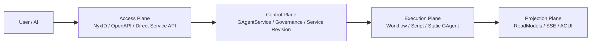

# Aevatar User-Scoped Service 极简架构草案（2026-03-26）

## 1. 文档目标

本文定义一个比当前 `AppPlatform + GAgentService` 更简单的方向：

- `NyxID user id = scope id`
- 在 `GAgentService` 中，`tenant id = scope id`
- 用户的“app”不再单独建模为 `AppDefinition / AppRelease / AppRoute / Function`
- 用户的“app”直接等价为 `GAgentService` 中的一个 `service`
- 用户调用的不是 app function，而是这个 user-scoped service
- 这个 service 预先绑定 workflow、script 或 static gagent
- 本质上这三种实现都统一收敛为：**给某个 GAgent 发 event**

一句话口径：

> 对用户自建能力，我们把“app 层”压扁成“用户作用域下的 service 层”，让 AI 直接围绕 service 做编码、部署、调用和运维。

## 2. 核心判定

这个方向下，Aevatar 的核心对象从：

- `app`
- `release`
- `route`
- `function`

收敛为：

- `scope`
- `service`
- `service revision`
- `service binding`
- `service policy`
- `operation`

因此统一映射关系如下：

| 用户语义 | 极简架构中的正式对象 |
|----------|----------------------|
| 用户身份 | `scope_id` |
| 用户 app | `service_id` |
| app 版本 | `revision_id` |
| app 调用入口 | `service + endpoint` |
| app 内部组合 | `binding + policy` |

也就是说：

- 用户的 app 就是一条 service definition
- 版本管理不再挂在 `AppRelease`
- 版本管理直接收敛到 `ServiceRevision`

## 3. 身份与寻址模型

统一约束：

- `NyxID user_id = scope_id`
- `GAgentService tenant_id = scope_id`
- 外部主要寻址键是 `scope_id + service_id`

因此 AI 和用户主要理解下面这套模型即可：

```text
scope_id   = 当前 NyxID 用户
service_id = 用户的 app 名
revision_id = 用户 app 的版本
endpoint_id = 用户 app 暴露的调用入口
```

`GAgentService` 内部原有的 `ServiceIdentity(tenant_id, app_id, namespace, service_id)` 仍可保留，但对外我们只暴露最小必要语义：

- `tenant_id = scope_id`
- `app_id / namespace` 可以收敛为平台默认值或内部实现细节
- 用户和 AI 不需要理解它们

## 4. 三种实现的统一语义

用户 service 背后的实现只保留三类：

- `workflow`
- `script`
- `static gagent`

但对外不再强调三者差异，而是统一成：

- service 接到请求
- service 把请求翻译成一个 typed event
- event 被投递给目标 GAgent
- GAgent 处理 event，产生日志、状态变化和 committed facts
- facts 进入 projection pipeline

统一主链如下：

```mermaid
%%{init: {"maxTextSize": 100000, "flowchart": {"useMaxWidth": false, "nodeSpacing": 10, "rankSpacing": 50}, "themeVariables": {"fontSize": "10px"}}}%%
flowchart LR
  U["User / AI"] --> A["NyxID Auth"]
  A --> B["Scope = Tenant"]
  B --> C["User-Scoped Service"]
  C --> D["Workflow / Script / Static GAgent"]
  D --> E["Typed Event -> GAgent"]
  E --> F["Committed Facts"]
  F --> G["Projection / ReadModels / SSE"]
```



这里最关键的抽象变化是：

- 不再先 resolve app，再 resolve function
- 而是直接 resolve service，再把请求映射成 event

## 5. Access Plane 和 Control Plane 会被砍掉多少

答案是：**会被大幅压缩，但不会完全消失。**

### 5.1 Access Plane 压缩后的职责

Access Plane 不再承担独立 app gateway 语义，只保留：

- `NyxID` 认证
- `OpenAPI` 暴露
- direct service invoke API
- operation/query API

它不再负责：

- app route resolve
- app function catalog
- app bundle
- app release 管理

因此 Access Plane 会从“接入层 + app 入口层”压缩为“认证 + API gateway”。

### 5.2 Control Plane 压缩后的职责

Control Plane 不再以 `AppPlatform` 为核心，而是收敛为 `GAgentService + Governance`：

- service definition
- service revision
- serving/default revision
- binding
- policy
- operation observation

它不再需要独立维护：

- `AppDefinition`
- `AppRelease`
- `AppRoute`
- `AppFunction`
- app-level resource bundle

因此 Control Plane 会从“app control plane + capability kernel”压缩为“service control plane”。

### 5.3 哪些东西不能砍

下面这些不能砍：

- `Execution Plane`
- `Projection Plane`
- `typed event contract`
- `service revision`
- `governance binding / policy`
- `operation observation`

原因很简单：

- 你可以砍掉 app 这一层语义
- 但不能砍掉 execution、projection、版本、权限和观察

## 6. 极简四层图

这个方向下，四层仍然存在，但 Access/Control 会明显变薄。



对应变化如下：

| 层 | 当前较重模型 | 极简模型 |
|----|--------------|----------|
| Access Plane | auth + studio + app gateway + route resolve | auth + OpenAPI + direct service API |
| Control Plane | AppPlatform + GAgentService + Governance | GAgentService + Governance |
| Execution Plane | 基本不变 | 基本不变 |
| Projection Plane | 基本不变 | 基本不变 |

## 7. 调用模型

这个方向下，内核仍然统一成 service 级别，但当前用户面先收敛成 scope 级别默认 service，而不是 app/function 级别。

AI 需要理解的最小调用协议：

```text
1. 我是谁：scope_id
2. 我要调用哪个 endpoint：endpoint_id（当前默认是 chat）
3. 我调用哪个版本：revision_id（当前默认 serving，可逐步显式化）
4. 请求 payload 是什么 typed event
```

正式调用主链：

```mermaid
%%{init: {"maxTextSize": 100000, "flowchart": {"useMaxWidth": false, "nodeSpacing": 10, "rankSpacing": 50}, "themeVariables": {"fontSize": "10px"}}}%%
flowchart LR
  A["POST /scopes/{scopeId}/invoke/chat:stream"] --> B["Resolve Default Service Binding"]
  B --> C["Resolve Revision"]
  C --> D["Map Request -> Typed Event"]
  D --> E["Dispatch Event to GAgent"]
  E --> F["Committed Facts"]
  F --> G["Projection / SSE / Query"]
```



这里的关键架构判定是：

### 7.1 当前实现落地口径

当前实现我们已经按这个方向收敛到下面这套入口：

- 一个 `NyxID` 账号只对应一个 `scope`
- 一个 `scope` 当前只对应一个默认对外 service binding，但内核仍保留 `service` 模型以支持后续扩展到多 service
- test run 入口走：
  - `POST /api/scopes/{scopeId}/draft-run`
- binding / publish 入口走：
  - `PUT /api/scopes/{scopeId}/binding`
  - `GET /api/scopes/{scopeId}/binding`
  - `GET /api/scopes/{scopeId}/revisions`
  - `GET /api/scopes/{scopeId}/revisions/{revisionId}`
  - `POST /api/scopes/{scopeId}/binding/revisions/{revisionId}:activate`
  - `POST /api/scopes/{scopeId}/binding/revisions/{revisionId}:retire`
- 正式 workflow 启动主入口走：
  - `POST /api/scopes/{scopeId}/invoke/chat:stream`
- 正式 run 历史 / 恢复 / 审计统一提升到 scope 层默认 service：
  - `GET /api/scopes/{scopeId}/runs`
  - `GET /api/scopes/{scopeId}/runs/{runId}`
  - `GET /api/scopes/{scopeId}/runs/{runId}/audit`
- workflow run control 统一提升到 scope 层默认 service：
  - `POST /api/scopes/{scopeId}/runs/{runId}:resume`
  - `POST /api/scopes/{scopeId}/runs/{runId}:signal`
  - `POST /api/scopes/{scopeId}/runs/{runId}:stop`
- 内部与扩展面仍保留 service-level contract：
  - `POST /api/scopes/{scopeId}/services/{serviceId}/invoke/{endpointId}`
  - `POST /api/scopes/{scopeId}/services/{serviceId}/invoke/{endpointId}:stream`
  - `GET /api/scopes/{scopeId}/services/{serviceId}/revisions`
  - `GET /api/scopes/{scopeId}/services/{serviceId}/revisions/{revisionId}`
  - `POST /api/scopes/{scopeId}/services/{serviceId}/revisions/{revisionId}:retire`
  - `GET /api/scopes/{scopeId}/services/{serviceId}/runs`
  - `GET /api/scopes/{scopeId}/services/{serviceId}/runs/{runId}`
  - `GET /api/scopes/{scopeId}/services/{serviceId}/runs/{runId}/audit`
  - `POST /api/scopes/{scopeId}/services/{serviceId}/runs/{runId}:resume`
  - `POST /api/scopes/{scopeId}/services/{serviceId}/runs/{runId}:signal`
  - `POST /api/scopes/{scopeId}/services/{serviceId}/runs/{runId}:stop`
- `workflowYamls` 的约定是：
  - 第一个 YAML 是主 workflow
  - 后续 YAML 都是 sub workflow
  - `workflow_call` 默认在这组 YAML 内解析
- workflow / script / static gagent 的执行本质仍然是把 typed event 投递给目标 `GAgent`

同时我们不再保留下面这些旧入口作为正式运行时 contract：

- `POST /api/chat`
- `GET /api/ws/chat`
- `POST /api/workflows/resume`
- `POST /api/workflows/signal`
- `POST /api/workflows/stop`
- `POST /api/scopes/{scopeId}/workflow-runs/stop`

workflow、script、static gagent 不再是三个对外入口协议，它们只是三种 event-dispatch implementation。

## 8. 版本管理如何简化

如果用户 app = service，那么版本管理就不再是 `AppRelease`，而是 `ServiceRevision`。

统一规则如下：

1. `revision_id = 用户 app 的版本号`
2. AI 和外部调用应允许显式指定 `revision_id`
3. 默认 serving revision 只是便捷别名，不是强一致版本语义
4. rollback 本质上是把 serving 指回旧 revision，或基于旧 revision 重新发布
5. 被 `retire` 或不在 active serving 集内的 revision 禁止正式调用
6. read side 必须暴露 revision catalog 的权威水位，如 `CatalogStateVersion / CatalogLastEventId`
7. revision catalog 必须返回 typed implementation 治理信息，而不是把 workflow / script / static gagent 细节塞回泛化 bag

因此版本治理直接收敛为：

- `create revision`
- `publish revision`
- `set default serving revision`
- `rollback to prior revision`
- `retire revision`
- `query revision catalog watermark`
- `query typed implementation governance`

而不需要：

- app release
- app default release
- app function 绑定到 release

## 9. Binding 如何表达“用户预先配置的 workflow / script / gagent”

用户 service 的 definition 只负责暴露稳定 endpoint。

实际执行逻辑通过 binding 指向三类能力：

- 绑定某个 workflow definition
- 绑定某个 script definition
- 绑定某个 static gagent type

因此 service 的最小正式模型可以收敛为：

```text
UserService
├── scope_id
├── service_id
├── endpoint_catalog[]
├── current_revision_id
└── revisions[]
    ├── revision_id
    ├── implementation_kind
    ├── implementation_ref
    ├── bindings[]
    ├── policies[]
    └── serving_state
```

这里：

- `implementation_kind = workflow / script / static`
- `implementation_ref` 指向 workflow id、script id 或 actor type
- `bindings` 表达 companion service / connector / secret
- `policies` 表达暴露与调用限制

## 10. 这条路线对 AI 更友好的地方

对 AI 来说，这个方向的最大价值是认知负担明显下降。

AI 不需要先理解：

- app
- release
- route
- function
- app bundle

AI 只需要理解：

- 当前用户是谁
- 这个用户有哪些 service
- service 暴露哪些 endpoint
- 每个 service 当前绑定的是 workflow、script 还是 gagent
- 当前默认 revision 是什么
- 如果要精确调用，用哪个 revision

因此 AI 的 prompt 和工具链可以直接收敛为：

- list services
- get service
- list revisions
- publish revision
- invoke service
- get operation
- get projection/readmodel

## 11. 这条路线砍掉了什么

对于“用户自建 app”这条主路径，我们可以直接砍掉：

- 独立 `AppPlatform`
- `AppDefinition`
- `AppRelease`
- `AppRoute`
- `AppFunction`
- app-level bundle 作为核心协议

也就是说，`AppPlatform` 不再是核心必需层，而是：

- 可选 overlay
- 只在需要更高层 packaging 时再叠加

例如：

- 平台官方 app
- 市场化发布
- 多 service 打包发行
- 对外产品化路由

这些场景仍然可以保留重 control plane。

但对于“用户自己通过 AI 在 Aevatar 上跑一个服务”这条主路径，完全可以不走这一层。

## 12. 代价与边界

这条路线更简单，但也有边界：

1. 多 service 产品化 packaging 能力会变弱
   需要靠 service binding 命名约定补回来。
2. app-level bundle/diff/apply 这类高层协议会被推迟
   先让 AI 用 service 级协议跑起来。
3. route/function 这类对外产品语义不再是核心对象
   更适合“用户自建能力”，不一定适合 marketplace。

因此我们统一判断：

- **对用户自建服务路径**：采用这条极简模型
- **对平台产品化/市场化路径**：以后如有必要，再叠加重 control plane

## 13. 最终结论

如果我们接受：

- `NyxID user id = scope id`
- `tenant id = scope id`
- `用户 app = GAgentService service`
- `workflow / script / static gagent` 本质统一为“给 GAgent 发 event”

那么结论就是：

1. `Access Plane` 可以明显变薄，压缩成 auth + OpenAPI + direct service API。
2. `Control Plane` 可以明显变薄，压缩成 `GAgentService + Governance + ServiceRevision`。
3. `Execution Plane` 和 `Projection Plane` 基本不动。
4. `AppPlatform` 不再是用户主路径必需层，而是可选 overlay。

最短的一句话口径：

> 对用户自建能力，Aevatar 可以不再先做 app，再做 function；而是直接让 AI 面对 user-scoped service，并把 workflow、script、static gagent 统一成“向 GAgent 投递 event”的执行模型。
