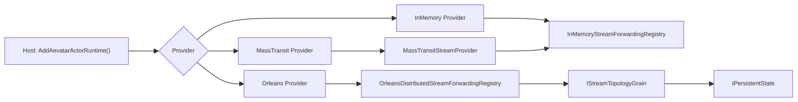
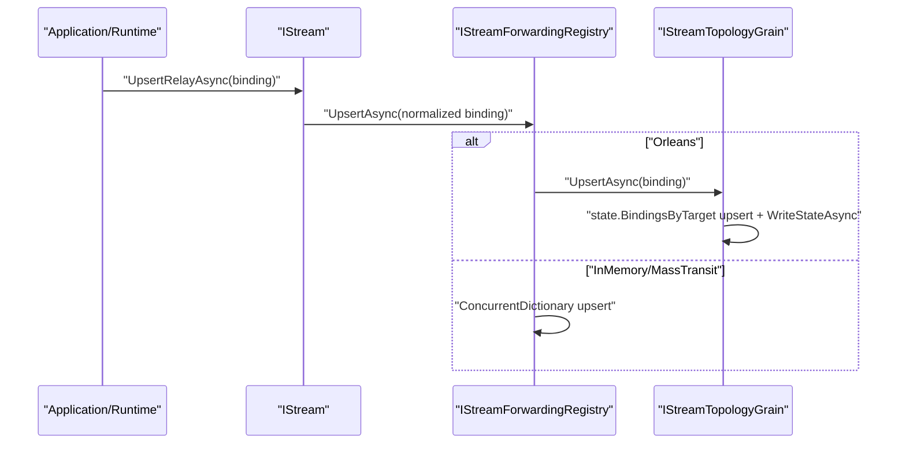

# Aevatar Stream Forward 架构说明（2026-02-22）

> Last updated: 2026-04-03. Active runtime paths: `InMemory` (dev/test) and `Orleans` with `KafkaProvider` (production).

## 1. 目标与范围

本文档定义 `Stream Forward` 能力的架构边界与状态存储语义，覆盖以下内容：

1. `Forward` 状态模型与职责分层。
2. InMemory / Orleans 两种运行模式下的状态落点。
3. Forward 的写入、读取、转发与清理链路。
4. 与架构门禁的一致性约束。

不包含内容：

1. 业务域事件建模（由 Domain/Application 文档负责）。
<<<<<<<< HEAD:docs/history/2026-03/STREAM_FORWARD_ARCHITECTURE.md
2. CQRS 读模型投影细节（由 `docs/architecture/CQRS_ARCHITECTURE.md` 负责）。
========
2. CQRS 读模型投影细节（由 `docs/canon/cqrs-projection.md` 负责）。
>>>>>>>> c20fc87ec173e49be645ea287f4bb54ecd975935:docs/decisions/0007-stream-forward.md

## 2. 设计原则

1. 单一事实源：Forward 拓扑状态必须有明确事实源，不依赖隐式缓存。
2. 分层清晰：Forward 逻辑属于 `Streaming/Transport` 基础设施层，Actor 层不做转发图遍历。
3. 统一抽象：所有实现都通过 `IStreamForwardingRegistry` 与 `StreamForwardingBinding` 统一建模。
4. 可替换：开发期可用 InMemory；分布式模式可切换为 Orleans 承载拓扑事实态。

## 3. 核心抽象

Forward 状态模型为 `StreamForwardingBinding`，核心字段：

1. `SourceStreamId`：源流。
2. `TargetStreamId`：目标流。
3. `ForwardingMode`：`TransitOnly` / `HandleThenForward`。
4. `DirectionFilter` 与 `EventTypeFilter`：转发过滤条件。
5. `Version`：版本号。
6. `LeaseId`：会话/租约关联字段。
7. `Revision`（Topology Grain State）：拓扑变更版本号，用于 registry 侧缓存校验。

代码锚点：

1. `src/Aevatar.Foundation.Abstractions/Streaming/IStreamForwardingRegistry.cs:15`
2. `src/Aevatar.Foundation.Abstractions/Streaming/IStreamForwardingRegistry.cs:33`
3. `src/Aevatar.Foundation.Abstractions/Streaming/IStreamForwardingRegistry.cs:39`
4. `src/Aevatar.Foundation.Runtime.Implementations.Orleans.Streaming/Streaming/Topology/StreamTopologyGrainState.cs:15`

## 4. 组件关系

关键装配锚点：

1. `src/Aevatar.Foundation.Runtime.Hosting/DependencyInjection/ServiceCollectionExtensions.cs:51`
2. `src/Aevatar.Foundation.Runtime.Hosting/DependencyInjection/ServiceCollectionExtensions.cs:57`
3. `src/Aevatar.Foundation.Runtime.Hosting/DependencyInjection/ServiceCollectionExtensions.cs:65`
4. `src/Aevatar.Foundation.Runtime.Implementations.Local/DependencyInjection/ServiceCollectionExtensions.cs:40`
5. `src/Aevatar.Foundation.Runtime.Streaming.Implementations.MassTransit/DependencyInjection/ServiceCollectionExtensions.cs:21`
6. `src/Aevatar.Foundation.Runtime.Implementations.Orleans.Streaming/DependencyInjection/ServiceCollectionExtensions.cs:15`

## 5. 状态存储策略（按运行模式）

| 运行模式 | Registry 实现 | 状态实际存储位置 | 语义说明 |
|---|---|---|---|
| `Provider=InMemory` | `InMemoryStreamForwardingRegistry` | 进程内 `ConcurrentDictionary<string, ConcurrentDictionary<string, StreamForwardingBinding>>` | 本地开发/测试语义，非跨节点事实源。 |
| `Provider=MassTransit` | 默认仍为 `InMemoryStreamForwardingRegistry` | 同上（进程内字典） | `MassTransitStreamProvider` 仅替换流传输，不替换 Forward 状态存储。 |
| `Provider=Orleans` | `OrleansDistributedStreamForwardingRegistry` | `IStreamTopologyGrain` 的 `IPersistentState<StreamTopologyGrainState>.BindingsByTarget` | 由 Grain 状态承载跨节点一致性事实。 |

代码锚点：

1. `src/Aevatar.Foundation.Runtime/Streaming/InMemoryStreamForwardingRegistry.cs:15`
2. `src/Aevatar.Foundation.Runtime.Streaming.Implementations.MassTransit/Streaming/MassTransitStreamProvider.cs:12`
3. `src/Aevatar.Foundation.Runtime.Streaming.Implementations.MassTransit/Streaming/MassTransitStreamProvider.cs:24`
4. `src/Aevatar.Foundation.Runtime.Implementations.Orleans.Streaming/Streaming/OrleansDistributedStreamForwardingRegistry.cs:14`
5. `src/Aevatar.Foundation.Runtime.Implementations.Orleans.Streaming/Streaming/Topology/StreamTopologyGrain.cs:7`
6. `src/Aevatar.Foundation.Runtime.Implementations.Orleans.Streaming/Streaming/Topology/StreamTopologyGrainState.cs:12`

## 6. 写入与转发链路

### 6.1 Forward 配置写入（Upsert/Remove/List）

相关锚点：

1. `src/Aevatar.Foundation.Runtime/Streaming/InMemoryStream.cs:128`
2. `src/Aevatar.Foundation.Runtime.Streaming.Implementations.MassTransit/Streaming/MassTransitStream.cs:88`
3. `src/Aevatar.Foundation.Runtime.Implementations.Orleans.Streaming/Streaming/OrleansActorStream.cs:63`
4. `src/Aevatar.Foundation.Runtime.Implementations.Orleans.Streaming/Streaming/Topology/StreamTopologyGrain.cs:25`

### 6.2 事件转发执行（Produce -> Relay）

1. InMemory：`InMemoryStream` 在派发后调用 `InMemoryStreamForwardingEngine.ForwardAsync(...)`。
2. MassTransit：`MassTransitStream` 在 `ProduceAsync` 后执行 `RelayAsync`，通过 registry 做 BFS/逐层转发。
3. Orleans：`OrleansActorStream` 在 `ProduceAsync` 后执行 `RelayAsync`，通过 registry 查询转发表并转发。

相关锚点：

1. `src/Aevatar.Foundation.Runtime/Streaming/InMemoryStream.cs:72`
2. `src/Aevatar.Foundation.Runtime/Streaming/InMemoryStreamForwardingEngine.cs:22`
3. `src/Aevatar.Foundation.Runtime.Streaming.Implementations.MassTransit/Streaming/MassTransitStream.cs:46`
4. `src/Aevatar.Foundation.Runtime.Streaming.Implementations.MassTransit/Streaming/MassTransitStream.cs:108`
5. `src/Aevatar.Foundation.Runtime.Implementations.Orleans.Streaming/Streaming/OrleansActorStream.cs:49`
6. `src/Aevatar.Foundation.Runtime.Implementations.Orleans.Streaming/Streaming/OrleansActorStream.cs:98`

### 6.3 Orleans Registry 读缓存（Revision 校验）

1. `OrleansDistributedStreamForwardingRegistry` 本地缓存 `sourceStreamId -> bindings + revision`。
2. 在校验窗口内直接返回缓存，避免频繁远程 `ListAsync`。
3. 超出窗口后先读 `GetRevisionAsync()`；若版本未变化，继续复用缓存；若变化再拉取 `ListAsync()` 并刷新缓存。
4. `Upsert/Remove` 成功后会立即失效对应 source 的本地缓存。

相关锚点：

1. `src/Aevatar.Foundation.Runtime.Implementations.Orleans.Streaming/Streaming/OrleansDistributedStreamForwardingRegistry.cs:6`
2. `src/Aevatar.Foundation.Runtime.Implementations.Orleans.Streaming/Streaming/OrleansDistributedStreamForwardingRegistry.cs:43`
3. `src/Aevatar.Foundation.Runtime.Implementations.Orleans.Streaming/Streaming/Topology/IStreamTopologyGrain.cs:13`
4. `src/Aevatar.Foundation.Runtime.Implementations.Orleans.Streaming/Streaming/Topology/StreamTopologyGrain.cs:52`

## 7. 生命周期与清理语义

1. InMemory 模式下，`RemoveStream(actorId)` 会清理源与目标相关转发表项（`RemoveByActor`）。
2. Orleans 模式下，`OrleansStreamProviderAdapter.RemoveStream` 仅清理本地 stream 缓存，拓扑事实由 registry/grain 管理；关系移除依赖显式 `RemoveRelayAsync` 或运行时 unlink/destroy 流程。
3. `OrleansActorRuntime` 在 `DestroyAsync/UnlinkAsync` 中调用 `RemoveRelayAsync` 清理父子转发关系。

相关锚点：

1. `src/Aevatar.Foundation.Runtime/Streaming/InMemoryStreamProvider.cs:94`
2. `src/Aevatar.Foundation.Runtime/Streaming/InMemoryStreamForwardingRegistry.cs:68`
3. `src/Aevatar.Foundation.Runtime.Implementations.Orleans.Streaming/Streaming/OrleansStreamProviderAdapter.cs:46`
4. `src/Aevatar.Foundation.Runtime.Implementations.Orleans/Actors/OrleansActorRuntime.cs:66`
5. `src/Aevatar.Foundation.Runtime.Implementations.Orleans/Actors/OrleansActorRuntime.cs:73`
6. `src/Aevatar.Foundation.Runtime.Implementations.Orleans/Actors/OrleansActorRuntime.cs:123`

## 8. 架构守卫约束

Forward 相关守卫强调“转发图遍历只能在 Stream/消息基础设施层”：

1. Runtime Actor 层禁止直接出现 `ListBySourceAsync` / `TryBuildForwardedEnvelope` 调用。
2. 若违反，`architecture_guards.sh` 会失败并阻断变更。

锚点：

1. `tools/ci/architecture_guards.sh:289`
2. `tools/ci/architecture_guards.sh:298`

## 9. 当前边界与演进建议

1. Orleans 模式下当前默认 `AddMemoryGrainStorage`，因此 topology 持久态默认仍是内存存储；生产建议替换为持久化 Grain Storage。
2. `Provider=MassTransit` 目前 Forward 状态仍落在 InMemory registry；如需跨节点一致性，可引入分布式 `IStreamForwardingRegistry` 实现并在该模式下替换注册。
3. `LeaseId` 已进入统一 binding 模型，可继续扩展为“租约 TTL + 失效回收”治理机制。

锚点：

1. `src/Aevatar.Foundation.Runtime.Implementations.Orleans/DependencyInjection/ServiceCollectionExtensions.cs:55`
2. `src/Aevatar.Foundation.Runtime.Hosting/DependencyInjection/ServiceCollectionExtensions.cs:57`
3. `src/Aevatar.Foundation.Abstractions/Streaming/IStreamForwardingRegistry.cs:33`
