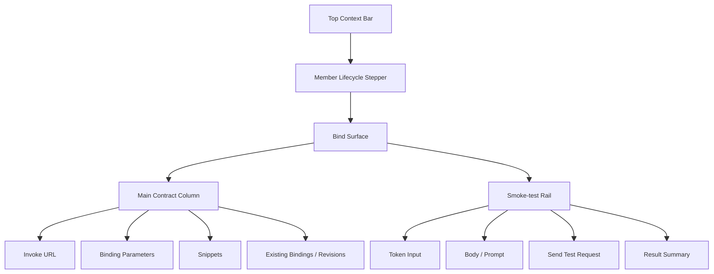

## Studio Workflow Bind Information Architecture

### 文档目的

本文只回答一件事：

`Workflow member` 在 `Studio -> Bind` 这一步，页面到底应该长什么样、先讲什么、后讲什么。

它是 [2026-04-21-studio-workflow-member-lifecycle-prd.md](./2026-04-21-studio-workflow-member-lifecycle-prd.md) 的 `Bind` 专项展开稿。

---

### 1. 页面定位

`Bind` 是当前 member 的 `invoke contract workbench`。

它的第一职责不是展示 runtime 总览，而是回答：

1. 这个 member 现在会如何被调用。
2. 它当前对外暴露的是哪个 revision。
3. 调用它需要哪些参数、协议和认证信息。
4. 我能不能先在这里做一次轻量 smoke-test。

因此，`Bind` 的主语必须是：

`selected member -> selected contract -> selected revision`

而不是：

`scope -> services catalog -> runtime governance overview`

---

### 2. 页面承诺

用户进入 `Bind` 后，首屏必须完成三件事：

1. 一眼看到当前 `Invoke URL` 和关键契约标签。
2. 直接确认 `Binding parameters`。
3. 直接在右侧做 `Smoke-test`。

也就是说，用户不应该先看到：

1. 一组大卡片式 `Published Services`
2. 一组偏诊断性质的 `Runtime Posture`
3. 一组“先去 review runs / review bindings”的跳转按钮

这些信息不是不重要，而是不应该占据首屏第一主语。

---

### 3. 核心对象模型

`Bind` 页面只围绕下面几个对象工作：

#### 3.1 Selected Member

当前在 Studio 左侧 rail 里选中的 member。

#### 3.2 Published Service

当前 member 已发布出来的 service 视图。

它用于确定：

1. service id
2. service key
3. endpoint surface
4. serving posture

#### 3.3 Binding Contract

`Bind` 页面真正的一等对象。

它至少包含：

1. invoke URL
2. method
3. auth scheme
4. scope
5. environment
6. revision
7. streaming protocol
8. selected endpoint

#### 3.4 Serving Revision

当前用于对外调用的 revision。

#### 3.5 Smoke-test Session

`Bind` 内部的一次轻量调用预检状态，包含：

1. request body
2. token input
3. request status
4. latency
5. response summary

---

### 4. 首屏结构

---

### 5. 页面区域定义

## 5.1 顶部上下文

沿用 Studio 顶部 context bar：

1. 返回 team
2. 当前 member 名称
3. 当前 step = `Bind`
4. revision / binding / serving 状态摘要
5. 右上角主动作：
   `进入调用`

这层不在 `Bind` 内单独重做，但必须提供上下文。

## 5.2 主区域布局

推荐使用：

1. 左侧主列：`minmax(0, 1fr)`
2. 右侧 rail：`360px - 420px`

右侧 rail 在桌面端固定可见，在窄屏下折叠到主列下方。

## 5.3 左侧主列顺序

左侧内容顺序必须固定为：

1. `Invoke URL`
2. `Binding parameters`
3. `Snippets`
4. `Existing bindings`
5. `Revisions`

顺序理由：

1. 用户先确认“怎么调”。
2. 再确认“调的是哪个版本、什么参数”。
3. 再复制代码或检查历史 binding。

## 5.4 右侧 Smoke-test Rail

右侧固定 `Smoke-test`，包括：

1. token 输入
2. prompt / body 输入
3. `Send test request`
4. 返回摘要
5. 快速进入 `Invoke`

它是 Bind 首屏的核心区域，不应该再被藏进 tab 或次级 drawer。

---

### 6. 主区域详细定义

## 6.1 Invoke URL 卡片

这是页面第一信息块。

必须展示：

1. `POST`
2. invoke URL
3. copy
4. 当前状态标签：
   `bound / live / draft / unbound`
5. route posture：
   `gateway / direct / provider`
6. auth 标签
7. scope 标签
8. revision 标签
9. stream 标签

可选说明区：

1. `Need a NyxID token?`
2. 当前 auth 的获取方式

用户进入 Bind 的第一眼，必须知道：

1. 我调哪个地址
2. 我拿什么认证
3. 我现在调的是哪个 revision

## 6.2 Binding Parameters

这个区域是 `invoke contract` 的结构化表达。

推荐字段：

1. `Scope`
2. `Environment`
3. `Revision`
4. `Rate limit`
5. `Allowed origins`
6. `Streaming`

字段语义要求：

1. `Scope`
   在 Studio 中通常只读，因为当前 team/scope 已固定。
2. `Environment`
   若后端尚未提供正式切换能力，可先表现为 segmented state + provenance 标记。
3. `Revision`
   必须能切换当前可选 revision，或至少明确显示当前 serving revision。
4. `Rate limit`
   若后端暂无可写能力，可先只读展示。
5. `Allowed origins`
   若没有正式绑定来源，可先以 current policy / placeholder 呈现，但必须标记来源。
6. `Streaming`
   必须显式展示：
   `SSE / WebSocket / AGUI frames`

注意：

`Binding Parameters` 是契约面板，不是“运行时诊断表”。

## 6.3 Snippets

这里负责把当前 contract 直接翻译成可复制调用示例。

固定三种 tab：

1. `cURL`
2. `Fetch`
3. `SDK`

内容必须由当前页面状态实时派生：

1. invoke URL 变化，snippet 立刻变化
2. revision 变化，snippet 标签同步变化
3. streaming 变化，`Accept` 与消费方式同步变化

这个区域的价值是：

1. 把 `Bind` 从“解释型页面”变成“可执行的交付页面”
2. 让用户在进入 `Invoke` 前，就能拿到外部集成示例

## 6.4 Existing Bindings

这个区域保留治理信息，但降为首屏后半段。

应展示：

1. alias / display name
2. scope / env
3. revision
4. URL
5. rate
6. status
7. actions

操作可以包括：

1. `Rotate`
2. `Revoke`
3. `Retire`
4. `Edit`

但这些动作必须围绕当前 selected member 展开，不能变成 scope 全局治理页。

## 6.5 Revisions

`Revisions` 在 Bind 中是辅助确认区，不是首屏第一块。

它负责回答：

1. 当前 serving 的 revision 是什么
2. 当前 revision 对应哪种实现
3. 还有哪些历史 revision 可以切换或查看

表现建议：

1. 紧凑列表
2. 当前 selected revision 固定展开
3. 非当前 revision 折叠为次级行

---

### 7. Smoke-test Rail 定义

## 7.1 页面目标

让用户在进入 `Invoke` 前，先做一次极轻量的“契约有没有接住”的验证。

## 7.2 结构

右侧 rail 包含：

1. `Bearer token`
2. `Prompt / Body`
3. `Send test request`
4. request 状态
5. latency
6. response summary

## 7.3 产品边界

`Smoke-test` 不是完整调用台。

它不负责：

1. 长 transcript
2. 全量 AGUI 事件流浏览
3. request history
4. 多 run 比较

这些能力仍归 `Invoke`。

## 7.4 成功后的动作

成功后应提供两个方向：

1. 保留成功摘要，用户继续留在 Bind
2. 点击 `进入调用`，带着当前 service/endpoint 进入 Invoke

失败后也必须留在当前页，并明确告诉用户：

1. 是认证问题
2. 是 endpoint 不可用
3. 是 revision 没 serving
4. 是 runtime 返回异常

---

### 8. 当前实现与目标结构的映射

当前 Bind 直接使用 [ScopeServiceRuntimeWorkbench.tsx](../../apps/aevatar-console-web/src/pages/scopes/components/ScopeServiceRuntimeWorkbench.tsx)。

这带来了三类偏差：

## 8.1 首屏顺序错了

现在首屏先出现的是：

1. `Published Services`
2. `Runtime Posture`
3. `Endpoint Surface`

而不是：

1. `Invoke URL`
2. `Binding parameters`
3. `Smoke-test`

## 8.2 主语偏成 runtime inspection

当前页面更像“检查当前 service 在 runtime 上处于什么状态”，而不是“确认当前 member 将如何被调用”。

## 8.3 Bind / Invoke 边界不清

当前 `Bind` 能选 endpoint 并立即跳转 `Invoke`，但它自己没有把 `invoke contract` 首屏讲清楚，导致用户进入时不知道这一页到底是：

1. 绑定页
2. 运行态页
3. 调用页前置页

---

### 9. 当前实现中哪些能力应该保留

来自 `ScopeServiceRuntimeWorkbench` 的这些能力仍有价值，但需要重排位置：

1. `Bindings`
   保留，放到下半区
2. `Revisions`
   保留，作为辅助确认区
3. `Open Services`
   保留，作为 deep link
4. `Runs`
   保留，但降级为次级链接，不再占首屏
5. `Endpoint Surface`
   保留，但与 invoke contract 合并表达，不再单独占一个首屏面板

---

### 10. 页面交互规则

## 10.1 进入页面

进入 `Bind` 后：

1. 自动解析当前 member 对应的 preferred service
2. 自动解析默认 endpoint
3. 自动解析当前 serving revision
4. 自动生成 invoke contract 与 snippets

## 10.2 切换 revision

切换 revision 后，应同步更新：

1. invoke URL 标签
2. revision 标签
3. snippets
4. smoke-test 默认上下文

## 10.3 切换 endpoint

切换 endpoint 后，应同步更新：

1. invoke URL
2. request body placeholder
3. snippets
4. 进入 Invoke 时带入的 endpoint

## 10.4 点击进入调用

点击 `进入调用` 后，至少携带：

1. selected service id
2. selected endpoint id
3. 当前 contract 相关上下文

让 `Invoke` 打开后是连续体验，而不是重新选一次。

---

### 11. 验收标准

完成后的 Bind 页，用户必须能在首屏回答下面 5 个问题：

1. 我调哪个 URL？
2. 我当前调的是哪个 revision？
3. 我需要什么 token / auth？
4. 我当前的 streaming 协议是什么？
5. 我能不能现在先试一次？

如果用户进入 Bind 后还需要先去理解“Published Services / Runtime Posture / Review runs”才能知道怎么调用它，说明这页的信息架构仍未收口。
