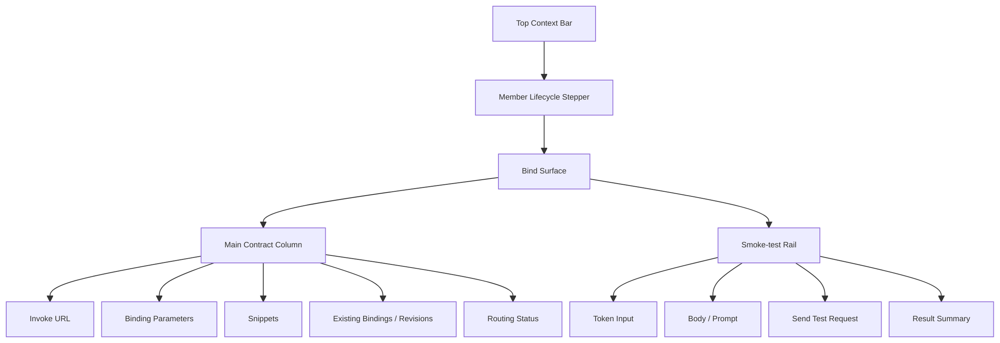

## Studio Workflow Bind Information Architecture

### 文档目的

本文只回答一件事：

`Workflow member` 在 `Studio -> Bind` 这一步，页面到底应该长什么样、先讲什么、后讲什么。

本文遵循 [2026-04-22-team-member-first-prd.md](./2026-04-22-team-member-first-prd.md)：

1. 只有 member 能被 invoke
2. team 最多只维护一份默认路由配置
3. `Bind` 页面讲的是当前 member 的直接调用契约

---

### 1. 页面定位

`Bind` 是当前 `workflow member` 的 `invoke contract workbench`。

它的第一职责不是展示 runtime 总览，而是回答：

1. 这个 member 现在会如何被直接调用
2. 它当前对外暴露的是哪个 revision
3. 调用它需要哪些参数、协议和认证信息
4. 我能不能先在这里做一次轻量 smoke-test

因此，`Bind` 的主语必须是：

`selected scope -> selected team -> selected member -> selected contract -> selected revision`

而不是：

`scope -> services catalog -> runtime governance overview`

---

### 2. 页面承诺

用户进入 `Bind` 后，首屏必须完成三件事：

1. 一眼看到当前 member 的 `Invoke URL` 和关键契约标签
2. 直接确认 `Binding parameters`
3. 直接在右侧做 `Smoke-test`

用户不应该先看到：

1. 一组大卡片式 `Published Services`
2. 一组偏诊断性质的 `Runtime Posture`
3. 一组“先去 review runs / review bindings”的跳转按钮

这些信息不是不重要，而是不应该占据首屏第一主语。

---

### 3. 核心对象模型

`Bind` 页面只围绕下面几个对象工作：

#### 3.1 Selected Team

当前 member 所属的 team。

它用于表达：

1. 当前归属哪个 team
2. 返回 Team Detail 的路径
3. 当前 member 是否是默认路由目标

#### 3.2 Selected Member

当前在 Studio 左侧 rail 里选中的 workflow member。

#### 3.3 Published Service

当前 member 已发布出来的 service 视图。

它用于确定：

1. service id
2. service key
3. endpoint surface
4. serving posture

#### 3.4 Binding Contract

`Bind` 页面真正的一等对象。

它至少包含：

1. invoke URL
2. method
3. auth scheme
4. scope
5. environment
6. revision
7. streaming protocol
8. selected endpoint

#### 3.5 Routing Status

当前 member 是否是 team 默认路由当前指向的目标。

它不是主对象，但应该在页面里诚实出现：

1. `This member is the default route target`
2. `Open Team Routing`

#### 3.6 Smoke-test Session

`Bind` 内部的一次轻量调用预检状态，包含：

1. request body
2. token input
3. request status
4. latency
5. response summary

---

### 4. 首屏结构

---

### 5. 页面区域定义

## 5.1 顶部上下文

沿用 Studio 顶部 context bar：

1. 返回 team
2. 当前 team 名称
3. 当前 member 名称
4. 当前 step = `Bind`
5. revision / binding / serving 状态摘要
6. 右上角主动作：
   `进入调用`

若当前 member 是默认路由目标，顶部可附加 badge，但不能因此把页面主语改成 team。

## 5.2 主区域布局

推荐使用：

1. 左侧主列：`minmax(0, 1fr)`
2. 右侧 rail：`360px - 420px`

## 5.3 左侧主列顺序

左侧内容顺序必须固定为：

1. `Invoke URL`
2. `Binding parameters`
3. `Snippets`
4. `Routing status`
5. `Existing bindings`
6. `Revisions`

顺序理由：

1. 用户先确认“怎么调这个 member”
2. 再确认“它是否恰好是 team 默认路由当前指向的目标”
3. 最后才看历史 binding 和 revision

## 5.4 右侧 Smoke-test Rail

右侧固定 `Smoke-test`，包括：

1. token 输入
2. prompt / body 输入
3. `Send test request`
4. 返回摘要
5. 快速进入 `Invoke`

它是 Bind 首屏的核心区域，不应该再被藏进 tab 或次级 drawer。

---

### 6. 主区域详细定义

## 6.1 Invoke URL 卡片

这是页面第一信息块。

必须展示：

1. `POST`
2. member invoke URL
3. copy
4. 当前状态标签：
   `bound / live / draft / unbound`
5. auth 标签
6. scope 标签
7. revision 标签
8. stream 标签

用户进入 Bind 的第一眼，必须知道：

1. 我调哪个 member 地址
2. 我拿什么认证
3. 我现在调的是哪个 revision

## 6.2 Binding Parameters

这个区域是 `member invoke contract` 的结构化表达。

推荐字段：

1. `Scope`
2. `Environment`
3. `Revision`
4. `Rate limit`
5. `Allowed origins`
6. `Streaming`

注意：

这是契约面板，不是运行时诊断表。

## 6.3 Routing Status

这个区域不是主角，但必须存在。

当当前 member 是默认路由目标时，展示：

1. `This member is the default route target`
2. `Open Team Routing`

当不是默认路由目标时，展示：

1. `Not the default route target`
2. `Set in Team Detail`

## 6.4 Snippets

固定三种 tab：

1. `cURL`
2. `Fetch`
3. `SDK`

内容必须由当前页面状态实时派生。

## 6.5 Existing Bindings / Revisions

这是辅助区，不是首屏主角。

它负责回答：

1. 这个 member 之前绑定过什么
2. 当前 serving revision 是哪一个
3. 我能否继续 activate / inspect

---

### 7. Bind 与其他层级的边界

`Bind` 只讲：

1. 当前 member 的直接 bind
2. 当前 member 的发布契约
3. 当前 member 的 smoke-test

`Bind` 不讲：

1. team 自己的 invoke 契约
2. team-wide runtime 总控
3. service catalog 总览
4. team router 的完整设置流程

---

### 一句话规则

> Bind 是 “这个 workflow member 现在如何被直接调用”，不是 “这个 team 如何被调用”。
