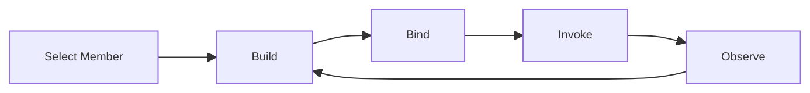

## Studio Workflow Member Lifecycle PRD

### 文档目的

这份文档用于把当前 `Studio` 中面向 `Workflow member` 的主链路重新定义清楚：

1. `Build` 到底负责什么。
2. `Bind` 到底负责什么。
3. `Invoke` 到底负责什么。
4. `Observe` 到底负责什么。

它不是替代更大范围的 `member-first workbench` PRD，而是把当前最容易混淆的一条链路单独收紧，尤其是把 `Bind` 和 `Invoke` 的边界定死。

当前仓库已经有一条真实实现主链：

1. `Build`：Workflow 编辑与 dry-run
2. `Bind`：runtime posture / bindings / revisions / runs
3. `Invoke`：成员调用与事件查看
4. `Observe`：workflow execution 图与日志

但这条实现主链和原型中的产品语义还没有完全对齐，最明显的偏差发生在 `Bind`。

---

### 背景

当用户在 `Studio` 中选中一个 `team member` 且它的实现方式为 `Workflow` 时，用户的真实任务不是“在不同工具页之间跳转”，而是连续完成下面四件事：

1. 把当前 member 的 workflow 搭出来。
2. 确认这个 workflow 将以什么运行契约被暴露出去。
3. 真实调用它一次，看输入输出是否符合预期。
4. 回看执行图、日志与人工交互状态。

原型里的心智已经很明确：

`Build -> Bind -> Invoke -> Observe`

其中：

1. `Build` 是实现编辑。
2. `Bind` 是发布与调用面配置。
3. `Invoke` 是真实调用与事件消费。
4. `Observe` 是运行后观察与回放。

当前仓库的问题不是能力缺失，而是把这些能力接成了不同语义：

1. `Build` 基本已经成立。
2. `Bind` 被 runtime workbench 占据，偏成“服务运行态检查”。
3. `Invoke` 已经是完整调用台。
4. `Observe` 已经是完整 execution 观察页。

所以本 PRD 的核心任务不是“发明新东西”，而是把这四步重新定义成一条诚实、连续、可解释的 member lifecycle。

---

### 产品目标

当用户进入某个 `Workflow member` 的 Studio 工作台时，必须可以在一条连续链路内完成下面的事情：

1. 在 `Build` 内完成 DAG 编辑、step 编辑、YAML 精修、保存和 dry-run。
2. 在 `Bind` 内看到该 member 的外部调用契约，并确认 revision、环境、认证、流式协议与 binding 参数。
3. 在 `Invoke` 内直接发起真实调用，并看到 transcript、events、output 与运行摘要。
4. 在 `Observe` 内回看 workflow 执行图、逐步日志、human-in-the-loop 状态与历史运行。

### 非目标

1. 本期不重做 Team Detail。
2. 本期不新增一套全新的后端 binding 模型。
3. 本期不把 `Observe` 扩展成 team 级总控台。
4. 本期不把 `Script` 或 `GAgent` 的完整细节一并定稿。

---

### 用户

- 编排者：负责搭建当前 member 的 workflow。
- 调试者：需要快速确认绑定契约、测试输入与输出。
- 发布者：需要确认某个 revision 如何对外 serving。
- 运营者：需要在一次调用后回看执行与人工交互状态。

---

### 核心用户链路

#### 1. 选中当前 member

用户先在左侧 `Team members` 中选中一个 member，明确“我现在修改的是谁”。

#### 2. 在 Build 中完成实现

用户在 `Workflow` 模式中完成：

1. 编辑 DAG。
2. 编辑 step 细节。
3. 切换 YAML 精修。
4. 保存 draft。
5. 用 dry-run 验证 draft。

当 draft 可用后，用户进入 `Bind`。

#### 3. 在 Bind 中确认运行契约

用户在 `Bind` 中完成的不是“再看一次运行态”，而是确认：

1. 当前 member 的对外调用地址是什么。
2. 当前 binding 指向哪个 `scope / environment / revision`。
3. 调用需要哪些认证和 headers。
4. 是否开启 `SSE / WebSocket / AGUI frames`。
5. 是否允许当前绑定参数进入 serving。
6. 是否可以先做一次轻量 smoke-test。

确认无误后，用户进入 `Invoke`。

#### 4. 在 Invoke 中真实调用

用户在 `Invoke` 中：

1. 选择当前 published service 与 endpoint。
2. 输入 prompt 或 typed payload。
3. 发起调用。
4. 看到 transcript、events、output、run summary。
5. 必要时打开完整 runs 页。

#### 5. 在 Observe 中回看执行

用户在 `Observe` 中：

1. 查看 workflow graph 上每个 step 的实际执行状态。
2. 查看逐条 execution logs。
3. 处理 human approval 或 human input。
4. 重新运行或停止当前执行。

---

### 生命周期定义

这条链路中的每一步必须回答不同的问题：

1. `Build`
   这个 member 要怎么实现？
2. `Bind`
   这个 member 最终以什么契约被暴露出去？
3. `Invoke`
   用这个契约真实调用时，返回了什么？
4. `Observe`
   这次调用在 workflow 内部是怎么执行的？

---

### 四个阶段的产品定义

## 1. Build

### 页面目标

编辑当前 `Workflow member` 的实现。

### 必须具备的能力

1. `Workflow / Script / GAgent` mode switch
2. `DAG Canvas`
3. `Step Detail`
4. `YAML` 视图
5. `Save draft`
6. `Dry-run`
7. `Continue to Bind`

### 对用户的承诺

用户必须可以在同一屏内完成：

1. 画结构
2. 改 step
3. 切 YAML
4. 保存
5. 直接验证 draft

### 当前实现映射

当前仓库中，`Build` 已由下面这组组件支撑：

1. [studio/index.tsx](../../apps/aevatar-console-web/src/pages/studio/index.tsx)
2. [StudioBuildPanels.tsx](../../apps/aevatar-console-web/src/pages/studio/components/StudioBuildPanels.tsx)

这一块的主链已经基本符合预期。

## 2. Bind

### 页面目标

把当前 member 的 `revision -> runtime contract` 讲清楚，并允许用户确认“这个 member 现在如何被调用”。

### Bind 必须回答的问题

1. 当前对外调用 URL 是什么。
2. 当前服务是 `draft` 还是 `live`。
3. 当前 serving revision 是什么。
4. 当前调用属于哪个 scope / environment。
5. 当前认证要求是什么。
6. 当前 streaming 协议是什么。
7. 当前 binding 参数是什么。
8. 当前是否允许先做一次轻量 smoke-test。

### Bind 的页面结构

Bind 应该由四块组成：

1. `Invoke URL`
2. `Binding parameters`
3. `Snippets`
   `cURL / Fetch / SDK`
4. `Smoke-test`

以及一个辅助区域：

1. `Existing bindings`
2. `Revisions`
3. `Open Services / governance deep links`

### Bind 和 Invoke 的边界

`Bind` 和 `Invoke` 必须明确分工：

1. `Bind`
   负责“我会以什么契约被调用”
2. `Invoke`
   负责“我现在真的发起一次调用”

因此：

1. `Bind` 里的 `Smoke-test` 是轻量预检，不是完整调试台。
2. `Invoke` 才是 transcript、事件流、输出、运行摘要的主战场。
3. `Bind` 可以展示当前 endpoint 和参数，但不应该替代完整调用体验。

### 当前实现偏差

当前仓库中的 `Bind` 实际复用了：

1. [ScopeServiceRuntimeWorkbench.tsx](../../apps/aevatar-console-web/src/pages/scopes/components/ScopeServiceRuntimeWorkbench.tsx)
2. [studio/index.tsx](../../apps/aevatar-console-web/src/pages/studio/index.tsx)

它现在能展示：

1. `Published Services`
2. `Runtime Posture`
3. `Endpoint Surface`
4. `Bindings`
5. `Revisions`
6. `Runs`

这更像“runtime inspection workbench”，而不是原型想表达的“binding contract workbench”。

所以 Bind 当前的主要问题不是不能用，而是产品语义漂移了：

1. 它过度回答了“当前 runtime 状态如何”。
2. 它没有把“当前调用契约”作为页面第一主语。
3. 它和 `Invoke` 之间出现了边界重叠。

### 本期要求

Bind 后续必须回到下面这条主线：

1. 先看到当前 invoke contract。
2. 再配置或确认 binding parameters。
3. 再做一次 smoke-test。
4. 再进入 Invoke 做完整调用。

## 3. Invoke

### 页面目标

直接在 Studio 内调用当前 member，并把运行结果留在同一工作台里。

### 必须具备的能力

1. 选择当前 `published service`
2. 选择 `endpoint`
3. 输入 `prompt` 或 typed payload
4. 发起调用
5. 查看 `Transcript`
6. 查看 `Events`
7. 查看 `Output`
8. 查看当前运行摘要
9. 打开完整 `Runs`

### 页面结构

Invoke 页面应包含：

1. 顶部动作：
   `Start chat / Invoke / Abort / Open Runs / Clear`
2. 上方摘要：
   `Bound Member / Binding Context / Revision / Latest Run`
3. 输入区：
   `service / endpoint / prompt / payload`
4. 主体区：
   `Transcript / Events / Output`
5. 右侧摘要：
   `Actor ID / Command ID / Endpoint / Observed Events`

### 当前实现映射

当前仓库中的 `Invoke` 已由下面组件承接：

1. [StudioMemberInvokePanel.tsx](../../apps/aevatar-console-web/src/pages/studio/components/StudioMemberInvokePanel.tsx)

它已经满足大部分产品要求，是当前最接近目标态的阶段。

## 4. Observe

### 页面目标

让用户在一次调用后，回看 workflow 是如何执行的，并在必要时继续介入。

### 必须具备的能力

1. 看到 workflow graph 上的执行状态
2. 看到当前 execution status
3. 看到按时间顺序排列的 execution logs
4. 选择历史 run
5. 复制日志或 actor id
6. 处理 `human approval / human input`
7. 重新运行
8. 停止当前运行

### 页面结构

Observe 页面应包含：

1. 顶部执行状态条：
   `running / completed / failed`
2. 中间 graph：
   当前 workflow 的执行态视图
3. 下方日志区：
   execution logs
4. 人工交互区：
   approval / input
5. run modal：
   重新运行当前 workflow

### 当前实现映射

当前仓库中的 `Observe` 主要由下面组件承接：

1. [StudioWorkbenchSections.tsx](../../apps/aevatar-console-web/src/pages/studio/components/StudioWorkbenchSections.tsx)
2. 其中的 `StudioExecutionPage`

这一块已经形成了清晰的 workflow 观察能力。

---

### 当前实现映射总表

| 阶段 | 当前主组件 | 语义状态 |
| --- | --- | --- |
| Build | `StudioWorkflowBuildPanel` / `StudioBuildPanels` | 基本成立 |
| Bind | `ScopeServiceRuntimeWorkbench` | 能力可用，但产品语义偏成 runtime inspection |
| Invoke | `StudioMemberInvokePanel` | 基本成立 |
| Observe | `StudioExecutionPage` | 基本成立 |

---

### 关键产品原则

1. `Build` 不回答调用契约问题。
2. `Bind` 不替代完整调用台。
3. `Invoke` 不替代执行回放页。
4. `Observe` 不承担契约配置。

换句话说：

1. `Build` 负责实现。
2. `Bind` 负责契约。
3. `Invoke` 负责调用。
4. `Observe` 负责回看。

只要这四个边界不清，用户就会持续问：

1. 为什么这里像绑定，又像运行态？
2. 为什么这里已经能调用了，还要进下一步？
3. 为什么我改完 workflow，却不知道下一步该看 URL、参数还是日志？

---

### 验收标准

本期完成后，一个用户在 `Workflow member` 上必须可以顺畅走完下面这条链：

1. 在 `Build` 中完成 workflow 编辑并 dry-run。
2. 进入 `Bind` 后，一眼看到当前 invoke contract 和 binding parameters。
3. 在 `Bind` 中完成 smoke-test 或确认 binding 配置。
4. 点击进入 `Invoke`，完成一次真实调用。
5. 在 `Invoke` 中看到 transcript、events、output。
6. 进入 `Observe`，看到 workflow graph、execution logs 和人工交互状态。

如果用户在 `Bind` 阶段仍然分不清“这是发布契约页”还是“这是运行态检查页”，则视为本期 PRD 尚未被正确实现。

---

### 与现有大 PRD 的关系

这份文档是对以下文档的聚焦补充：

1. [2026-04-20-studio-member-workbench-prd.md](./2026-04-20-studio-member-workbench-prd.md)
2. [2026-04-20-studio-member-workbench-information-architecture.md](./2026-04-20-studio-member-workbench-information-architecture.md)
3. [2026-04-20-studio-member-workbench-implementation-checklist.md](./2026-04-20-studio-member-workbench-implementation-checklist.md)

它新增的最关键约束只有一条：

`Bind` 的第一主语必须是 `invoke contract`，不是 `runtime posture`。
