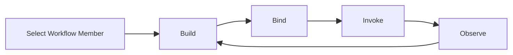

## Studio Workflow Member Lifecycle PRD

### 文档定位

本文只定义一条更窄的链路：

`Studio` 中，当用户已经选中了某个 `Workflow member` 之后，`Build / Bind / Invoke / Observe` 四步分别负责什么。

本文遵循 [2026-04-22-team-member-first-prd.md](./2026-04-22-team-member-first-prd.md) 的 canonical 模型：

1. `scope` 是工作空间上下文
2. `team` 是协作边界
3. `team router` 是 team 的默认路由配置
4. `member` 才是被 build / bind / invoke / observe 的真实对象

---

### 背景

当用户在 `Studio` 中选中某个 member，且它的实现方式已经确定为 `Workflow` 时，用户的真实任务不是“在不同工具页之间跳转”，而是连续完成下面四件事：

1. 把当前 member 的 workflow 搭出来
2. 确认这个 workflow member 会以什么运行契约被直接暴露出去
3. 真实调用它一次，看输入输出是否符合预期
4. 回看执行图、日志与人工交互状态

原型里的心智就是：

`Build -> Bind -> Invoke -> Observe`

其中：

1. `Build`
   编辑当前 workflow member 的实现
2. `Bind`
   讲清当前 workflow member 的直接调用契约
3. `Invoke`
   真实调用当前 workflow member
4. `Observe`
   回看这次 member invoke 的执行事实

---

### 产品目标

当用户进入某个 `Workflow member` 的 Studio 工作台时，必须可以在一条连续链路内完成下面的事情：

1. 在 `Build` 内完成 DAG 编辑、step 编辑、YAML 精修、保存和 dry-run
2. 在 `Bind` 内看到该 member 的外部调用契约，并确认 revision、认证、流式协议与 binding 参数
3. 在 `Invoke` 内直接发起当前 member 的真实调用，并看到 transcript、events、output 与运行摘要
4. 在 `Observe` 内回看 workflow 执行图、逐步日志、human-in-the-loop 状态与历史运行

### 非目标

1. 本期不重做 Team Detail
2. 本期不定义 team router 的设置页
3. 本期不把 `Script` 或 `GAgent` 的完整细节一并定稿
4. 本文不重新定义 member 选择逻辑，那属于上层 `member-first workbench`

---

### 核心用户链路

#### 1. 选中当前 Workflow Member

用户先在左侧 `Team members` 中选中一个 member，并且该 member 的 implementation kind 是 `workflow`。

#### 2. 在 Build 中完成实现

用户在 `Workflow Build` 中完成：

1. 编辑 DAG
2. 编辑 step 细节
3. 切换 YAML 精修
4. 保存 draft
5. 用 dry-run 验证 draft

注意：

这里不再讨论 `Workflow / Script / GAgent` mode switch，因为这一层在上级 member workbench 已经决定完了。本文只讨论“当前 member 已经是 workflow implementation”的情况。

#### 3. 在 Bind 中确认直接调用契约

用户在 `Bind` 中完成的不是“再看一次 team 运行态”，而是确认：

1. 当前 member 的对外调用地址是什么
2. 当前 member 的 serving revision 是什么
3. 调用它需要哪些认证和 headers
4. 当前流式协议是什么
5. 是否可以先做一次轻量 smoke-test

如果这个 member 恰好是 team 默认路由当前指向的目标，Bind 里可以显示 badge 或 deep link，但这页主语仍然是“当前 workflow member 的直接 bind”。

#### 4. 在 Invoke 中真实调用

用户在 `Invoke` 中：

1. 选择当前 member 的 endpoint
2. 输入 prompt 或 typed payload
3. 发起调用
4. 看到 transcript、events、output、run summary
5. 必要时打开完整 runs 页

#### 5. 在 Observe 中回看执行

用户在 `Observe` 中：

1. 查看 workflow graph 上每个 step 的实际执行状态
2. 查看逐条 execution logs
3. 处理 human approval 或 human input
4. 重新运行或停止当前执行

---

### 生命周期定义

这条链路中的每一步必须回答不同的问题：

1. `Build`
   这个 workflow member 要怎么实现
2. `Bind`
   这个 workflow member 最终以什么契约被直接调用
3. `Invoke`
   用这个 member contract 真实调用时，返回了什么
4. `Observe`
   这次 member invoke 在 workflow 内部是怎么执行的

---

### 四个阶段的产品定义

## 1. Build

### 页面目标

编辑当前 `Workflow member` 的实现。

### 必须具备的能力

1. `DAG Canvas`
2. `Step Detail`
3. `YAML` 视图
4. `Save draft`
5. `Dry-run`
6. `Continue to Bind`

### 对用户的承诺

用户必须可以在同一屏内完成：

1. 画结构
2. 改 step
3. 切 YAML
4. 保存
5. 直接验证 draft

## 2. Bind

### 页面目标

把当前 workflow member 的 `revision -> runtime contract` 讲清楚，并允许用户确认“这个 member 现在如何被直接调用”。

### Bind 必须回答的问题

1. 当前对外调用 URL 是什么
2. 当前 serving revision 是什么
3. 当前调用需要什么认证
4. 当前 streaming 协议是什么
5. 当前 binding 参数是什么
6. 当前是否允许先做一次轻量 smoke-test

### Bind 和 Team Router 的边界

`Bind` 讲的是当前 member 的直接 bind。

它不负责：

1. 定义 team 的 router 规则
2. 把 team 自己变成 invoke target
3. 把 member bind 扩写成 team-level 治理总览

## 3. Invoke

### 页面目标

直接调当前 workflow member，并看到运行中的反馈。

### 必须具备的能力

1. request editor
2. send button
3. request history
4. transcript
5. events
6. output
7. run summary

## 4. Observe

### 页面目标

回看当前 workflow member 的某次运行事实。

### 必须具备的能力

1. workflow graph execution state
2. step logs
3. human-in-the-loop status
4. run history
5. rerun / stop

---

### 一句话规则

> 这份文档只讲 `workflow member` 的直接生命周期，不讲 team invoke，也不把默认路由目标当成新的成员类型。
