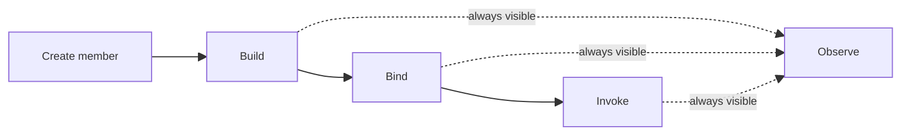

## Studio Member Lifecycle Spec

### 文档定位

本文定义 `Studio` 的最小 canonical 生命周期规则。

目标不是展开所有页面细节，而是先写死下面几件事：

1. `member` 是 `Studio` 的唯一主语
2. 用户必须先 `Create member`
3. `Build / Bind / Invoke / Observe` 是同一个 member 的四个生命周期步骤
4. `Build` 内包含三种实现类型：`workflow / script / gagent`
5. `Bind` 与 `Invoke` 必须有明确门禁
6. `Observe` 永远可进入，但内容必须诚实反映当前状态

本文遵循 [2026-04-22-team-member-first-prd.md](./2026-04-22-team-member-first-prd.md)。

---

### 1. 核心主语

`Studio` 的主语必须是：

`selected team + selected member`

不是：

1. `selected workflow file`
2. `selected script definition`
3. `selected published service`
4. `selected binding revision`

这些都只是 `member` 在不同阶段的实现资产或运行事实，不应替代 `member` 成为页面一等主语。

---

### 2. 生命周期主链



Studio 中，一个正常的 member 流程必须是：

1. `Create member`
2. `Build`
3. `Bind`
4. `Invoke`
5. `Observe`

其中：

1. `Build` 后才能进入 `Bind`
2. `Bind` 后才能进入 `Invoke`
3. `Observe` 一直可以进入

---

### 3. Create Member

`Create member` 的语义是创建一个新的成员身份。

创建完成后，系统至少应有：

1. `memberId`
2. `teamId`
3. `scopeId`
4. `displayName`
5. `implementationKind = unset`
6. `lifecycleStage = build`

注意：

创建 member 不是创建 workflow 文件，也不是创建 service。

换句话说：

1. `workflow` 不是 member
2. `script` 不是 member
3. `service` 不是 member

它们都只是这个 member 后续的实现或运行投影。

---

### 4. Build

`Build` 的职责是定义“这个 member 由什么实现，以及它具体做什么”。

`Build` 内必须支持三种实现类型：

1. `workflow`
2. `script`
3. `gagent`

这三种是同一个 member 的 `implementation type`，不是三套平行生命周期对象。

在 `Build` 中，用户可以：

1. 选择实现类型
2. 编辑对应实现内容
3. 保存 draft
4. 验证 draft

`Build` 完成的判定标准应是：

`当前 member 已经拥有一个可用的实现 revision`

只有满足这个条件，`Bind` 才可进入。

---

### 5. Bind

`Bind` 的职责是定义“这个 member 现在如何被对外调用”。

`Bind` 关注的不是编辑实现，而是确认调用契约，例如：

1. published service
2. endpoint
3. invoke URL
4. revision
5. auth mode
6. request / response schema
7. smoke-test

`Bind` 的前置条件必须是：

`当前 member 已经至少 build 出一个可绑定 revision`

没有 build 成功时：

1. 顶部 stepper 中 `Bind` 应为 disabled
2. 直接跳转 `Bind` 时应展示明确空态，而不是假装已有 contract

`Bind` 完成的判定标准应是：

`当前 member 已经拥有一个可调用的 binding contract`

只有满足这个条件，`Invoke` 才可进入。

---

### 6. Invoke

`Invoke` 的职责是对当前 member 发起真实调用。

这里关注的是：

1. 选择 endpoint
2. 填写 prompt 或 typed payload
3. 发请求
4. 查看 output / transcript / events / receipt

`Invoke` 的前置条件必须是：

`当前 member 已经存在可调用 contract`

没有 bind 成功时：

1. 顶部 stepper 中 `Invoke` 应为 disabled
2. 不应允许用户进入一个看似可调用、但实际没有 contract 的页面

---

### 7. Observe

`Observe` 的职责是回看当前 member 的运行事实。

它应该始终可进入，但内容必须诚实：

1. 没 build：显示“还没有实现”
2. build 了但没 bind：显示“还没有调用契约”
3. bind 了但没 invoke：显示“还没有运行记录”
4. invoke 之后：显示 runs、logs、graph、human interaction、health

所以：

`Observe` 永远可见，不代表永远有运行内容`

---

### 8. 左侧 Team Members Rail

左侧 `Team members` 展示的必须是 `member roster`。

它不应直接退化为下面任何一种：

1. workflow 文件列表
2. script 定义列表
3. published services 列表
4. binding revisions 列表

正确关系应是：

1. 左侧 rail：`members`
2. `Build`：编辑这个 member 的实现资产
3. `Bind`：查看这个 member 的调用契约
4. `Invoke`：调用这个 member
5. `Observe`：观察这个 member 的运行事实

---

### 9. 最小状态机

```text
MemberLifecycleState
- member_created
- build_ready
- bind_ready
- invoke_ready
```

可用性规则：

1. `member_created`
   `Build = enabled`
   `Bind = disabled`
   `Invoke = disabled`
   `Observe = enabled`

2. `build_ready`
   `Build = enabled`
   `Bind = enabled`
   `Invoke = disabled`
   `Observe = enabled`

3. `bind_ready`
   `Build = enabled`
   `Bind = enabled`
   `Invoke = enabled`
   `Observe = enabled`

4. `invoke_ready`
   `Build = enabled`
   `Bind = enabled`
   `Invoke = enabled`
   `Observe = enabled`

---

### 10. 对 307 的直接约束

如果按本文收口，当前 Studio 前端必须满足：

1. 左侧 rail 以 `member` 为主语，不得只展示 `workflow/script inventory`
2. `Create member` 是显式动作，但创建后必须在左侧出现该 member
3. `Build` 中的 `workflow / script / gagent` 是实现类型切换，不是 member 列表来源
4. `Bind` 不得在 `Build` 未完成时看起来可用
5. `Invoke` 不得在 `Bind` 未完成时看起来可用
6. `Observe` 永远可点，但必须有分阶段空态

---

### 11. 一句话总结

`Studio` 不是“素材工作台”也不是“service 控制台”，而是“某个 member 的生命周期工作台”。
