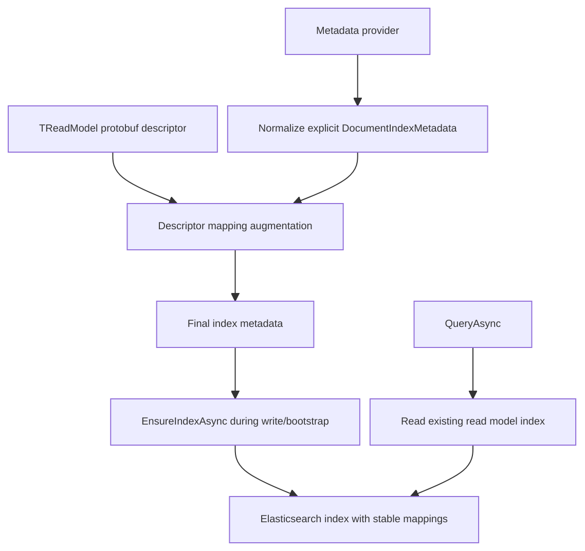

# Elasticsearch Projection Index Mapping Blueprint

## 1. 文档元信息

- 状态: Draft
- 版本: R1
- 日期: 2026-05-15
- 关联 Issue: [#533](https://github.com/aevatarAI/aevatar/issues/533)
- 关联 Issue 背景: #410 已通过局部 mapping 修复 `script-catalog-entries.updated_at_utc_value` 的 mainnet 查询故障
- 适用范围:
  - `src/Aevatar.CQRS.Projection.Providers.Elasticsearch`
  - `src/Aevatar.CQRS.Projection.Stores.Abstractions`
  - 各 `IProjectionDocumentMetadataProvider<TReadModel>` 实现
  - `test/Aevatar.CQRS.Projection.Core.Tests`
  - 受影响的 projection read model metadata provider 测试
- 文档定位:
  - 本文定义 Elasticsearch projection document provider 如何基于 protobuf read model contract 生成稳定 index mapping。
  - 本文不改变 CQRS / Projection 主链路，不新增第二套 projection pipeline，不改变 read model 的业务事实来源。
- 最近一次验证结果:
  - provider helper、store 接入、focused tests、README 更新已实施。
  - targeted tests、solution build、test stability guard、query projection priming guard、workflow host startup smoke 已通过；full architecture guard 当前停在既有 CLI playground frontend 依赖缺失。

## 2. 背景与关键决策

当前 Elasticsearch projection document provider 支持通过 `DocumentIndexMetadata` 初始化 index mapping。实际代码里，大量静态 read model metadata provider 只声明 `dynamic: true` 或空 mapping，导致稳定查询字段的 Elasticsearch 类型依赖首次写入时的 dynamic inference。

这对 read model 查询是不稳定的:

- 空 index 或字段尚未写入时，显式 sort / filter 只能依赖 query-time `unmapped_type` 兜底。
- string 字段可能被 dynamic mapping 推断为 `text + keyword`，而稳定 ID 字段实际需要 `keyword`。
- `google.protobuf.Timestamp` 字段若未显式声明为 `date`，排序和范围查询的一致性依赖 Elasticsearch 推断。
- 同类字段 mapping 现在散落在各 metadata provider 中；#410 只对 `ScriptCatalogEntryDocument` 手写了 `created_at_utc_value` 和 `updated_at_utc_value` 的 `date` mapping。

本设计做出以下关键决策:

1. #533 是有效 issue。它指向的是 projection store provider 的 index contract 稳定性问题，不是业务 projection 逻辑问题。
2. 稳定 read model 字段 mapping 应由 Elasticsearch provider 基于 protobuf descriptor 统一补齐，而不是由每个业务 metadata provider 重复手写。
3. 显式 metadata provider mapping 优先。统一 helper 只补缺失的稳定字段，不覆盖业务 provider 已声明的 mapping。
4. open / native / plugin document 区域必须显式保留开放边界，禁止为了标准化把动态脚本字段收窄。
5. 不背历史 index 兼容包袱。mapping 变更以 alias + augmented mapping fingerprint lifecycle 为唯一 schema-drift 权威；alias 指向非当前 fingerprint 的 physical index 时 fail loud，不做在线兼容、双轨 query fallback 或旧 index repair。
6. 当前 `GetAsync` / `QueryAsync` 会调用 `EnsureIndexAsync` 处理缺失 index，这是既有 lifecycle 行为；本设计不新增 query-time ES actual mapping reader、query-time mapping mutation / repair，也不引入 query-time replay 或 priming。

## 3. 重构目标

1. 新建 Elasticsearch projection index 时，稳定 read model query / sort 字段拥有确定 mapping。
2. 公共 timestamp 字段不再需要各 metadata provider 手写 `date` mapping。
3. 公共 exact-match identifier 字段不再依赖 dynamic mapping 推断。
4. `ProjectionDocumentId` 继续作为 provider-owned stable pagination field，并强制保持 `keyword`。
5. native script / plugin dynamic document materialization 保持现有开放或 schema-driven 行为。
6. query path 不引入 mapping repair、read model refresh 或 event replay；只复用当前缺失 index 时的 `EnsureIndexAsync` 行为。
7. 文档、测试和 provider README 同步说明新 mapping 契约，以及开发 / 测试环境中需要清空或重建 projection index 的要求。

## 4. 范围与非范围

### 4.1 范围

- Elasticsearch provider 内部 mapping normalization / augmentation。
- 基于 `TReadModel.Descriptor` 的稳定字段 mapping 生成。
- `DocumentIndexMetadata` 与显式 provider mapping 的合并规则。
- provider-level tests:
  - timestamp mapping
  - keyword mapping
  - explicit mapping preservation
  - open / dynamic field opt-out
  - `ProjectionDocumentId` 保留字段约束
- provider README / architecture docs 对不兼容旧 index、需要重建 projection index 的说明。

### 4.2 非范围

- 不改变 actor authoritative state。
- 不改变 `CommittedStateEventPublished -> Projection Pipeline -> ReadModel` 主链。
- 不新增 read model 类型。
- 不引入第二套 projection envelope。
- 不在 query path 中刷新 read model、修复 index mapping 或重建 index；缺失 index 的创建继续沿用当前 `EnsureIndexAsync` 行为。
- 不自动修复已有 Elasticsearch index 的错误 mapping；需要时直接清空 / 重建 projection index，或通过显式运维迁移重建 alias 指向。
- 不改变 native script materialization compiler 的 schema-driven mapping 语义。
- 不为了兼容历史 index 增加双轨 query fallback。

## 5. 架构硬约束

1. Elasticsearch mapping augmentation 必须位于 provider 边界，不得泄露到 Domain / Application / Host 业务编排层。
2. 统一 helper 只能基于 protobuf read model contract 和显式 `DocumentIndexMetadata` 工作，不能依赖运行时 query 样本或已写入 document。
3. query path 禁止执行 live ES mapping 读取、mapping mutation / repair、projection lifecycle 操作或 event replay；不得在查询路径补写 read model 数据。
4. 显式业务 mapping 优先；helper 不得覆盖 metadata provider 已声明的字段 mapping。
5. provider-owned `ProjectionDocumentId` 必须保持 `keyword`；冲突时应启动期失败，而不是降级兼容。
6. `google.protobuf.Any`、`google.protobuf.Struct`、map 字段、repeated complex message 默认不得递归展开为静态 mapping。
7. native / plugin script read model 的开放字段区域必须保持显式 open 或由脚本 schema 编译器生成，不得被通用 helper 猜测。
8. 所有稳定 mapping 规则必须可测试，不依赖人工检查 index payload。
9. 重构语义必须诚实: 新 mapping 契约不兼容旧 index 时，直接要求清空 / 重建 projection index；不在应用读路径里偷偷修复，也不为未投产历史数据设计兼容层。
10. 本设计不得引入内部泛化 `Metadata` bag；`DocumentIndexMetadata` 是 Elasticsearch index 边界元信息，允许保留该命名。

## 6. 当前基线

### 6.1 当前正确部分

1. Elasticsearch provider 已有统一 index metadata normalization 入口。
   - `ElasticsearchProjectionDocumentStoreMetadataSupport.NormalizeMetadata(...)`
2. `ProjectionDocumentId` 已被统一补为 `keyword`，用于稳定 `search_after` pagination tie-breaker。
3. query builder 已能将 CLR property path 转为 protobuf field path。
4. exact-match resolver 已能识别显式 `keyword` mapping 或 `.keyword` multi-field。
5. native script materialization compiler 已能基于脚本 schema 生成 mapping，但该 mapping 是否进入实际 `EnsureIndexAsync` index initialization payload 需要在实施前验证；不能在本设计中默认等同于 Elasticsearch index 已 schema-driven。

### 6.2 当前偏差部分

1. 大量静态 metadata provider 只声明 `dynamic: true` 或空 mapping。
2. `ScriptCatalogEntryDocumentMetadataProvider` 对 timestamp 字段存在局部手写 mapping，说明公共规则还没有收敛到 provider。
3. `DocumentIndexMetadata` 没有 descriptor-aware augmentation，导致 read model contract 与 index contract 脱节。
4. stable read ports 已经在按 `scope_id`、`run_id`、`catalog_actor_id`、`updated_at` 等字段查询或排序，但新 index mapping 不保证这些字段先验存在。
5. README 目前只说明 `ProjectionDocumentId` 的 mapping 约束，没有说明 protobuf descriptor-driven stable field mapping。

## 7. 需求分解与状态矩阵

| ID | 需求 | 验收标准 | 当前状态 | 证据 | 差距 |
|---|---|---|---|---|---|
| R1 | provider 统一补 timestamp mapping | 新建 index payload 中 protobuf `Timestamp` 稳定字段为 `date` | 未完成 | 只有 `ScriptCatalogEntryDocument` 手写 timestamp mapping | 需要 descriptor helper |
| R2 | provider 统一补 identifier keyword mapping | 稳定 ID / key / status 等 exact-match 字符串字段为 `keyword` | 未完成 | 多数 provider `dynamic: true` 或空 mapping | 需要字段分类策略 |
| R3 | 保留显式 mapping 优先级 | 显式 `text` / custom mapping 不被覆盖 | 部分完成 | exact-match resolver 已尊重显式 mapping | augmentation 也需同样尊重 |
| R4 | 保留 provider-owned pagination field | `ProjectionDocumentId` 始终是 `keyword`，冲突时报错 | 已完成 | metadata support 已校验 | 新 helper 不得破坏 |
| R5 | open / native script 字段不被收窄 | `Struct` / `Any` / script native fields 不被递归猜测 mapping | 部分完成 | compiler 自己生成 native mapping | 通用 helper 需要 opt-out 规则 |
| R6 | query path 无 mapping repair side effect | `QueryAsync` 不修改 index mapping，不补投影，不 replay | 已完成但需守住 | 当前 `GetAsync` / `QueryAsync` 会 `EnsureIndexAsync` 以处理缺失 index，但不会对已有 index 做 mapping mutation | 实施不得加 query-time repair |
| R7 | 文档说明重建边界 | README / docs 明确 mapping 变更后需清空 / 重建 projection index，不承诺旧 index 兼容 | 未完成 | README 只覆盖 `ProjectionDocumentId` | 需要补文档 |
| R8 | 自动化测试覆盖规则 | provider tests 覆盖 timestamp / keyword / explicit override / open fields | 未完成 | 现有测试覆盖 sort fallback 和 `ProjectionDocumentId` | 需要新增测试 |

## 8. 差距详解

### 8.1 read model contract 与 index contract 未对齐

read model 已经是 protobuf typed contract，包含字段类型和字段名。Elasticsearch index mapping 却主要依赖手写字典或 dynamic inference。这样会出现一个不必要的断层:

- protobuf contract 知道 `updated_at_utc_value` 是 timestamp。
- query port 知道它要按 `UpdatedAt` 排序。
- Elasticsearch index 在新建时却未必知道它是 `date`。

正确方向是 provider 在 index bootstrap 时读取 read model descriptor，并把稳定字段映射为 Elasticsearch mapping。

### 8.2 手写 mapping 无法规模化

当前 `ScriptCatalogEntryDocumentMetadataProvider` 的局部补丁是必要但不可扩展的。继续让每个 provider 手写:

- 会重复 `updated_at` / `created_at` / `actor_id` / `state_version` 等公共字段。
- 容易漏掉新增 read model。
- 会让 provider 细节扩散到业务 projection metadata provider。

### 8.3 dynamic mapping 仍有边界价值

不能把 `dynamic: true` 一刀切视为错误。它在以下场景仍有价值:

- 外部插件或 native script 的开放扩展字段。
- 不被稳定 query path 使用的观察性 payload。
- schema 编译器显式允许开放的区域。

因此目标不是消灭 dynamic mapping，而是让稳定查询字段不再依赖 dynamic mapping。

## 9. 目标架构

### 9.1 目标职责划分

| 组件 | 职责 |
|---|---|
| `IProjectionDocumentMetadataProvider<TReadModel>` | 声明 index name、业务需要的显式 mapping、settings、aliases |
| `ElasticsearchProjectionDocumentStoreMetadataSupport` | normalize metadata 字典、保证 provider-owned 字段、校验非法结构 |
| `ElasticsearchProjectionDescriptorMappingSupport` | 基于 protobuf descriptor 补齐稳定 read model 字段 mapping |
| `ElasticsearchProjectionDocumentStore<TReadModel, TKey>` | 组合 options、metadata、descriptor mapping，并执行 read/write |
| `ScriptReadModelMaterializationCompiler` | 为脚本 schema 生成 native document mapping，不被通用 helper 替代 |

### 9.2 目标链路



### 9.3 推荐新增 helper

建议在 `Aevatar.CQRS.Projection.Providers.Elasticsearch.Stores` 内新增内部 helper:

```csharp
internal static class ElasticsearchProjectionDescriptorMappingSupport
{
    internal static DocumentIndexMetadata AugmentMetadata(
        DocumentIndexMetadata metadata,
        MessageDescriptor descriptor);
}
```

第一版不引入 options/config。规则写死在 internal helper 中，并由测试固定，避免把简单标准化做成可配置框架。

### 9.4 合并规则

1. 先 normalize explicit `DocumentIndexMetadata`。
2. 再读取 `TReadModel.Descriptor`。
3. 如果 `mappings.properties.<field>` 已存在，保持原 mapping。
4. 如果字段被判定为 stable timestamp，补 `{ "type": "date" }`。
5. 如果字段被判定为 stable exact-match string，补 `{ "type": "keyword" }`。
6. 如果字段是 `Any`、`Struct`、map、repeated complex message，跳过。
7. 最后再次保证 `ProjectionDocumentId` 为 `keyword`。

显式 mapping 永远优先，避免 helper 改写有业务含义的 `text`、nested、object、analyzer 或 custom field mapping。

### 9.5 stable field policy

第一版按最小必要范围实现，不做全仓库 query / sort inventory，也不为所有 scalar 字段生成 mapping。稳定字段来源按以下优先级确定:

1. 显式 provider mapping: 已声明 mapping 的字段直接使用 provider mapping。
2. Descriptor low-risk convention: 对明显低风险的 root-level timestamp 和 identifier 命名字段自动生成 mapping。
3. Provider-level explicit mapping: 若某个不满足低风险命名规则的字段已经在当前 issue 相关路径中必须稳定查询，由对应 metadata provider 显式声明 mapping，而不是扩大全局猜测规则。

第一版只覆盖 #533 明确要求的公共 timestamp / identifier 字段和已存在的局部 timestamp 补丁替代；其他字段后续按实际 query bug 或新需求单独补。

#### timestamp

映射为 `date`:

- protobuf field type 是 `google.protobuf.Timestamp`
- root-level field
- 示例:
  - `updated_at`
  - `updated_at_utc_value`
  - `created_at`
  - `created_at_utc_value`
  - `started_at_utc_value`
  - `ended_at_utc_value`
  - `observed_at_utc_value`
  - `last_bound_at`

#### keyword

映射为 `keyword`:

- root-level string field
- 字段名满足以下任一条件:
  - 等于 `id`
  - 等于 `actor_id`
  - 等于 `last_event_id`
  - 以 `_id` 结尾
  - 以 `_actor_id` 结尾
  - 以 `_key` 结尾
  - 以 `_hash` 结尾
  - 以 `_revision` 或 `_revision_id` 结尾
  - 以 `_status` 结尾
  - 以 `_kind` 结尾
  - 以 `_type` 或 `_type_url` 结尾

第一版不要默认把所有 string 字段映射为 `keyword`。例如 `description`、`input`、`final_output`、`final_error`、`workflow_yaml` 不应因为是 string 就被收窄。

#### numeric / boolean

第一版不自动生成 numeric / boolean mapping。若后续某个 numeric / boolean 字段出现明确 query / sort 需求，由对应 metadata provider 显式声明 mapping，或另开 issue 扩展公共规则。

### 9.6 open field policy

以下字段默认跳过:

- `google.protobuf.Any`
- `google.protobuf.Struct`
- protobuf map field
- repeated message field
- repeated scalar field，除非后续另有明确需求和测试

脚本 native document 的 schema-driven mapping 是独立问题，不能被本 helper 猜测替代。#533 第一版只保证通用 helper 不递归收窄 native/open 字段；不在本次实现 per-index native schema mapping path。

## 10. 重构工作包

### WP1. Provider descriptor helper

- 目标: 新增 descriptor-driven mapping augmentation。
- 范围:
  - `ElasticsearchProjectionDescriptorMappingSupport`
  - 必要的 internal constants
- 产物:
  - timestamp -> date
  - stable string identifiers -> keyword
  - explicit mapping preservation
  - open field skipping
- DoD:
  - provider tests 覆盖核心规则。

### WP2. Store constructor 接入

- 目标: `ElasticsearchProjectionDocumentStore<TReadModel, TKey>` 在构造时生成 final metadata。
- 范围:
  - constructor 内 `descriptor` 与 metadata normalization 顺序调整
  - `_indexMetadata` 使用 augmented metadata
- DoD:
  - query path 行为稳定。
  - 明确 mapping 变更后旧 index 不兼容时必须清空 / 重建，避免为了旧 `text + keyword` index 保留 `field.keyword` fallback。
  - `ProjectionDocumentId` 校验继续生效。

### WP3. 清理 ad-hoc metadata provider

- 目标: 删除不再需要的公共 timestamp 手写 mapping。
- 范围:
  - `ScriptCatalogEntryDocumentMetadataProvider`
  - 其他仅为公共字段手写 mapping 的 provider
- DoD:
  - provider-specific metadata 只保留真正业务定制 mapping。
  - tests 从 provider 局部断言迁移到 provider helper 断言。

### WP4. Open field 回归

- 目标: 确认通用 helper 不收窄 open document 字段。
- 范围:
  - provider helper tests
- DoD:
  - helper 不展开 `Any` / `Struct` / map / repeated message / open payload。
  - 不实现 native script per-index schema mapping path；该能力如有需要另开 issue。

### WP5. 文档与重建说明

- 目标: 更新 provider README 和必要架构文档。
- 范围:
  - `src/Aevatar.CQRS.Projection.Providers.Elasticsearch/README.md`
  - 本设计文档执行快照
  - 开发 / 测试环境的 projection index 重建步骤
- DoD:
  - 明确新建 index 自动获得 stable mapping。
  - 明确 mapping 契约变更不兼容旧 index 时，直接清空 / 重建 projection index；不设计 alias cutover、双写、双读或在线兼容。
  - 明确 query path 不做自动修复。
  - 明确 `AutoCreateIndex=true` 时，read path 的 `EnsureIndexAsync` 可以在清空后按新契约重建缺失 index；若需要保留数据，则应先导出 / 重放 projection，而不是在 provider 内兼容旧 mapping。

## 11. 里程碑与依赖

| Milestone | 内容 | 依赖 | 产物 |
|---|---|---|---|
| M1 | helper + provider tests | 无 | descriptor mapping support |
| M2 | store constructor 接入 | M1 | 新建 index payload 稳定 |
| M3 | metadata provider 清理 | M2 | 去除公共字段 ad-hoc mapping |
| M4 | open field 回归 | M2 | open field safety tests |
| M5 | docs / migration note | M1-M4 | README 与设计文档更新 |

## 12. 验证矩阵

| 需求 | 验证命令 | 通过标准 |
|---|---|---|
| R1 / R2 / R3 / R4 / R5 | `dotnet test test/Aevatar.CQRS.Projection.Core.Tests/Aevatar.CQRS.Projection.Core.Tests.csproj --nologo` | provider behavior tests 全部通过 |
| R5 | provider helper tests | native/open payload 不被通用 helper 收窄 |
| R6 | `bash tools/ci/query_projection_priming_guard.sh` | query/read path 无 projection priming 或 lifecycle 操作 |
| R7 | 文档 diff review | README 与本文重建说明一致，明确不兼容旧 index、需要清空 / 重建 projection index、以及 `AutoCreateIndex` 行为 |
| R8 | `bash tools/ci/architecture_guards.sh` | 架构门禁通过 |
| 全局 | `dotnet build aevatar.slnx --nologo` | 全量编译通过 |

若实施中新增或修改测试，还必须执行:

```bash
bash tools/ci/test_stability_guards.sh
```

## 13. 完成定义

本设计完成必须同时满足:

1. Elasticsearch provider 能基于 protobuf descriptor 生成 stable timestamp / keyword mapping，并允许 provider 显式 mapping 覆盖特殊字段。
2. `ProjectionDocumentId` 的 `keyword` 约束仍强制生效。
3. 显式 provider mapping 不被覆盖。
4. open / native script read model 不被错误收窄。
5. 新建 index 的 mapping payload 在 tests 中可断言。
6. query path 没有新增 mapping mutation、read model priming 或 replay。
7. provider README 说明 mapping 变更后的 projection index 重建边界。
8. 相关 build / test / architecture guard 通过。

## 14. 风险与应对

| 风险 | 影响 | 应对 |
|---|---|---|
| 自动 keyword 规则过宽 | 大文本字段被错误收窄，影响搜索能力 | 第一版仅映射稳定 ID / key / status 字段，不映射所有 string |
| 自动 mapping 覆盖业务 mapping | custom analyzer / text mapping 丢失 | 显式 mapping 永远优先，并加测试 |
| 递归展开 `Any` / `Struct` | open plugin 字段被静态化 | 默认跳过 well-known open types 和 map / repeated message |
| 旧 index mapping 不匹配 | 本地 / 测试环境已有 index 可能在重构后查询失败 | 明确不兼容旧 index；变更后清空 / 重建 projection index，不在 provider 内兼容旧 mapping |
| AutoCreateIndex 在读路径创建缺失 index | 清空 index 后首次读可能用新 mapping 创建空 index | 这是可接受的开发 / 测试行为；需要数据时通过 projection 重放或显式重建，不做旧 index 在线迁移 |
| stable field 规则过窄 | 部分未满足低风险命名规则的查询字段仍依赖 dynamic inference | 第一版接受该边界；需要时由对应 provider 显式 mapping 或另开 issue 扩展公共规则 |
| native script schema mapping 误判 | 把 native script schema path 误纳入本次 scope 会扩大改动面 | 第一版明确排除 per-index native schema mapping path，只测试 open payload 不被 helper 收窄 |
| helper 放错层 | ES 细节扩散到业务 projection provider | helper 只在 ES provider 内部使用 |
| query-time repair 诱惑 | 破坏 query/read 边界和架构门禁 | 明确禁止，验证跑 query projection priming guard |

## 15. 执行清单

- [x] 新增 `ElasticsearchProjectionDescriptorMappingSupport`。
- [x] 为 timestamp mapping 添加 provider test。
- [x] 为 stable string keyword mapping 添加 provider test。
- [x] 为 explicit mapping preservation 添加 provider test。
- [x] 为 `Any` / `Struct` / open field skipping 添加 provider test。
- [x] 在 store constructor 接入 augmented metadata。
- [x] 清理不再需要的公共 timestamp ad-hoc provider mapping。
- [x] 回归 open payload 不被通用 helper 收窄；native schema mapping path 不纳入本次实施。
- [x] 为 `ServiceCatalogReadModel.namespace` 添加显式 provider mapping，避免扩大通用 string heuristic。
- [x] 更新 Elasticsearch provider README，说明 mapping 变更不兼容旧 index 时直接清空 / 重建 projection index，以及 `AutoCreateIndex` 的重建行为。
- [x] 执行验证矩阵中的相关命令并记录结果。

## 16. 当前执行快照（2026-05-15）

- 已完成:
  - 确认 #533 为有效 issue。
  - 完成目标设计、边界定义、工作包拆解和验证矩阵。
  - 实施 `ElasticsearchProjectionDescriptorMappingSupport` 并在 store constructor 接入。
  - 添加 timestamp、stable keyword、explicit mapping preservation、open field skipping、`ProjectionDocumentId` focused tests。
  - 清理 scripting catalog 公共 timestamp ad-hoc mapping。
  - 为不满足全局低风险命名规则但参与稳定等值查询的 `ServiceCatalogReadModel.namespace` 添加 provider 显式 `keyword` mapping。
  - 更新 Elasticsearch provider README。
  - 已通过 targeted tests、solution build、test stability guard、query projection priming guard、workflow host startup smoke。
- 未完成:
  - 无本 issue 阻塞项。
- 已知外部验证限制:
  - `architecture_guards.sh` 停在 `playground_asset_drift_guard.sh`，根因是 CLI frontend 既有依赖缺失（`@tanstack/react-virtual`、`@chenglou/pretext`），与本次 ES projection mapping 改动无关。

## 17. 变更纪律

1. 实施必须从 provider helper 和 tests 开始，不允许先批量修改业务 metadata provider。
2. 每个 mapping 规则都必须有测试覆盖；没有 descriptor low-risk convention 或 provider-level explicit mapping 的字段不默认加入规则。
3. 若发现某字段需要特殊 mapping，优先在对应 metadata provider 显式声明，而不是扩大全局猜测规则。
4. 若某 read model 需要全文检索，应单独声明 `text` / analyzer mapping，不能依赖全局 keyword policy。
5. 若变更影响旧 index，PR 描述中写清“不兼容旧 index，需清空 / 重建 projection index”；不要设计历史兼容层。
6. 文档、测试和 provider README 必须与代码同 PR 更新。
7. 不保留无效兼容层；若旧 ad-hoc mapping 已被 provider helper 覆盖，应删除重复字典。
8. 任何实现都不得把 read path 变成 index repair / rebuild path。
